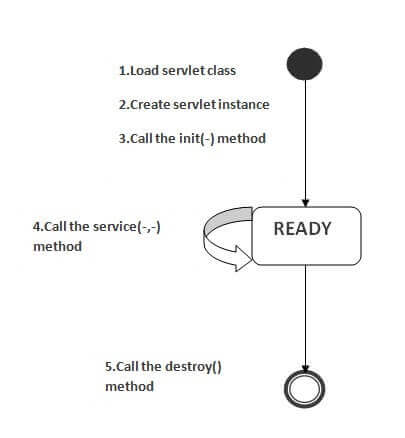
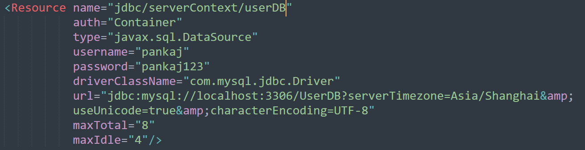

- Servlet
  collapsed:: true
	- Java web application介绍
		- 静态和动态网站的区别
		  collapsed:: true
			- 图片
			- 静态网站
			  collapsed:: true
				- 每次加载页面时，预生成的内容都是相同的
				- 使用 HTML 代码来开发网站
				- 对每个请求发送完全相同的响应
				- 只有当有人发布和更新文件(将其发送到 Web 服务器)时，内容才会更改
				- 灵活性是静态网站的主要优势
			- 动态网站
			  collapsed:: true
				- 内容快速生成并定期更改
				- 使用 PHP、 SERVLET、 JSP 和 ASP.NET 等服务器端语言来开发网站
				- 可以为每个请求生成不同的 HTML
				- 页面包含“服务器端”代码，该代码允许服务器在加载页面时生成唯一的内容
				- 内容管理系统(CMS)是动态网站的主要优势
		- 服务器和客户端
		  collapsed:: true
			- 服务器：负责处理客户端请求，并返回响应
			- 客户端：与服务器沟通交互的软件
		- Html和Http
		  collapsed:: true
			- html：超文本标记语言，客户端和服务器之间通用的交互语言
			- http：http是客户端和服务器之间通用的通信协议，http运行在TCP/IP协议之上
			  collapsed:: true
				- 三个基本特性
				  collapsed:: true
					- HTTP与媒体无关：它指定只要服务器和客户端都能处理数据内容，任何类型的媒体内容都可以通过 HTTP 发送。
					- HTTP 是无连接的：它是一种无连接的方法，其中 HTTP 客户端，即浏览器发起 HTTP 请求，并在请求被发送后，客户端从服务器断开连接并等待响应。
					- HTTP 是无状态的：客户端和服务器只在当前请求期间知道彼此。后来，他们两个都忘记了对方。由于协议的无状态特性，无论是客户端还是服务器端都不能跨网页保留不同请求的信息。
				- http请求的重要部分
				  collapsed:: true
					- Http Method
					  collapsed:: true
						- GET：请求指定的资源。使用 GET 的请求应该只用于获取数据。
						- POST：发送数据给服务器。请求主体的类型由 Content-Type 首部指定
						- HEAD：请求资源的头部信息，并且这些头部与 HTTP GET 方法请求时返回的一致。该请求方法的一个使用场景是在下载一个大文件前先获取其大小再决定是否要下载，以此可以节约带宽资源。
						- TRACE：实现沿通向目标资源的路径的消息环回（loop-back）测试 ，提供了一种实用的 debug 机制。
						- PUT
						  collapsed:: true
							- 使用请求中的负载创建或者替换目标资源
							- PUT 与 POST 方法的区别在于，PUT 方法是幂等的：调用一次与连续调用多次是等价的（即没有副作用），而连续调用多次 POST 方法可能会有副作用，比如将一个订单重复提交多次。
						- DELETE：用于删除指定的资源
						- OPTIONS：用于获取目的资源所支持的通信选项。客户端可以对特定的 URL 使用 OPTIONS 方法，也可以对整站（通过将 URL 设置为“*”）使用该方法
					- URL(Uniform Resource Identifier)
					- Form Parameters
					- source IP address, proxy and port
					- destination IP address, protocol, port and host
					- Request method and Content
					- User-Agent header
					- Connection control header
					- Cache control header
				- http响应的重要部分
				  collapsed:: true
					- Status Code
					- Content Type（MIME type）：告诉客户端给用户呈现的数据类型
					- Content
				- GET vs. POST
				  collapsed:: true
					- GET
					  collapsed:: true
						- 只能发送有限数量的数据，因为数据是在URL中发送的，不同的浏览器和Web服务器限制了URL的长度
						- GET请求不安全，因为数据暴露在 URL 栏中
						- 获取请求可以加入书签
						- GET请求是等幂的。这意味着第二个请求将被忽略，直到第一个请求的响应被传递
						- GET请求比 Post 更高效，使用更多
					- POST
					  collapsed:: true
						- 由于数据是在主体中发送的，因此可以发送大量的数据
						- POST请求是安全的，因为数据没有暴露在 URL 栏中
						- 请求无法加入书签
						- POST请求的非幂等的
						- Post请求是低效率的，使用较少
		- URL
		  collapsed:: true
			- 定义：URL 是通用资源定位器的首字母缩写，用于定位服务器和资源。
			- https://localhost:8080/FirstServletProject/jsps/hello.jsp解析
			  collapsed:: true
				- https://：指定了客户端和服务器的通信协议
				- localhost：服务器主机名（ip）或是域名
				- 8080：服务器监听的端口
				- FirstServletProject/jsps/hello.jsp：请求服务器的资源，可能是静态网页，pdf
		- Servlet和JSP的用途
		  collapsed:: true
			- 提供对动态响应和数据持久性的支持来扩展web服务器的功能
		- Servlet容器
		  collapsed:: true
			- Servlet容器是web服务器的一部分
			- 作用：将客户端请求交给正确的资源（servlet和JSP）来处理，然后使用资源中的响应来生成Http响应并提供给web容器，web容器将响应发送给客户端
			- 原理：web容器接收到请求，对于Servlet来说会创建两个对象，分别是HttpServletRequest和HttpServletResponse。然后去找到正确的Servlet，接着为请求创建线程，接着会调用Servlet的service()方法，根据http请求方式调用doGet()或是doPost()方法，servlet会生产动态页面并写到响应中，一旦线程完成，web容器就会将响应转换为http响应返回给客户端
			- Servlet容器的状态
			  collapsed:: true
				- Standalone
				- In-process
				- Out-of-process
			- Servlet容器的重要工作
			  collapsed:: true
				- 通信的支持
				  collapsed:: true
					- 提供了web服务器与Servlet/JSP之间的通信支持
					- 不需要构建一个服务器套接字来监听来自 webserver 的任何请求，解析请求并生成响应
					- 只需关注自己的业务逻辑
				- 生命周期与资源管理
				  collapsed:: true
					- 负责管理Servlet的生命周期
					- 提供诸如 JNDI 之类的实用工具，用于资源池和管理
				- 多线程支持
				  collapsed:: true
					- 为每一个请求创建一个线程
					- 不会为每个请求初始化 servlet，从而节省时间和内存
				- JSP支持
				  collapsed:: true
					- 应用程序中的每个 JSP 都由容器编译并转换为 Servlet，然后容器像其他 Servlet 一样管理它们
				- 杂项
				  collapsed:: true
					- Web 容器管理资源池、进行内存优化、运行垃圾收集器、提供安全配置、对多个应用程序的支持、热部署以及其他一些幕后任务
		- Server：Web vs. Application
		  collapsed:: true
			- 定义
			  collapsed:: true
				- 服务器是接受并响应其他程序（称为客户端）发出的请求的设备或计算机程序。 它用于管理网络资源和运行提供服务的程序或软件。
			- 分类
			  collapsed:: true
				- Web Server
				  collapsed:: true
					- 图片
					- Web 服务器只包含 web 或 servlet 容器。 可用于servlet、jsp、struts、jsf等。不能用于EJB。
					- 它是一台可以存储网络内容的计算机。 一般来说，网络服务器可用于托管网站，但也使用其他一些网络服务器，如 FTP、电子邮件、存储、游戏等。
					- web server的例子
					  collapsed:: true
						- Apache Tomcat
						- Resin
					- 有两种方式为客户端提供响应
					  collapsed:: true
						- 通过脚本和数据库通信生成响应
						- 发送与url相关联的文件给客户端
					- Web Server与Application Server之间的区别
					  collapsed:: true
						- Application Server是Web Server的一部分
						- Web Server可以直接向客户端提供静态资源的响应
						- 除静态数据等资源外，Web Server可以通过与Application Server连接去处理相应的请求
				- Application Server
				  collapsed:: true
					- 图片
					- 定义
					  collapsed:: true
						- Application Server包括web和EJB容器，只要是使用Servlet、JSP、EJB、JSF等组件实现，它是一个基于组件的产品，位于以服务器为中心的体系结构的中间层。
						- 提供了会话状态维护、安全、数据访问和持久化等功能
					- Application Server的例子
					  collapsed:: true
						- JBoss: Open-source server from JBoss community.
						- Glassfish: Provided by Sun Microsystem. Now acquired by Oracle.
						- Weblogic: Provided by Oracle. It more secured.
						- Websphere: Provided by IBM.
		- Content Type
		  collapsed:: true
			- 定义
			  collapsed:: true
				- Content Type也被称为MIME(多用途互联网邮件扩展)类型。它是一个HTTP报头，提供关于您要向浏览器发送什么内容的描述。
				- MIME是一种互联网标准，用于通过允许在消息中插入声音、图像和文本来扩展电子邮件的有限功能。
			- Content Type的清单
			  collapsed:: true
				- text/html
				- text/plain
				- application/json
		- web应用程序文件结构
		  collapsed:: true
			- 目录结构这里可以参考：https://maven.apache.org/guides/introduction/introduction-to-the-standard-directory-layout.html
		- Deployment Descriptor
		  collapsed:: true
			- web.xml文件是 web 应用程序的部署描述符，包含 servlet (3.0之前)、欢迎页面、安全配置、会话超时设置等的映射。
	- Servlet简介
		- 开头
		  collapsed:: true
			- Servlet中的主要api是由javax.servlet-api提供的，主要的接口和类在javax.servlet和javax.servlet.http下面
			- Servlet接口定义了Servlet的生命周期
			- 我们通过实现GenericServlet和HttpServlet来定义我们自己的Servlet，因为我们通常使用http协议访问我们的服务，所以一般实现HttpServlet
		- Common Gateway Interface (CGI)
		  collapsed:: true
			- 使用CGI技术创建动态web应用程序。
			- CGI的缺点
			  collapsed:: true
				- 随着请求数量的增加，服务器响应需要更多的时间
				- 对于每一个请求，CGI都会启动一个进程，web服务器受限于启动进程
				- 使用的平台语言是C，C++，Perl
			- Servlet与CGI之间的比较
			  collapsed:: true
				- 在处理时间和内存利用率方面，servlet提供了比CGI更好的性能
				- Servlet与平台和系统无关，使用Servlet开发的web应用程序可以运行在任何标准的web容器上
				- servlet是健壮的，因为容器负责servlet的生命周期，我们不需要担心内存泄漏、安全性、垃圾收集等问题
				- servlet是可维护的，而且学习曲线很小，因为我们只需要注意应用程序的业务逻辑
		- Servlet API
		  collapsed:: true
			- Javax.Servlet.Servlet是Servlet API的基本接口
		- Servlet Interface
		  collapsed:: true
			- 方法
			  collapsed:: true
				- init(ServletConfig paramServletConfig)
				  collapsed:: true
					- Servlet生命周期方法
					- 用于初始化servlet和ServletConfig参数
					- init()方法执行完成，Servlet才能处理客户端请求
					- 在servlet生命周期中只被调用一次
					- 可以在servlet类中扩展这个方法来初始化资源，比如DB Connection、Socket Connection等
				- getServletConfig()
				  collapsed:: true
					- 返回一个Servlet配置对象，它包含了Servlet的初始化参数和启动配置
					- 返回的 ServletConfig 对象是传递给 init 方法的那个
				- service(ServletRequest req, ServletResponse res)
				  collapsed:: true
					- Servlet生命周期方法
					- 该方法负责处理客户端请求
					- 当Servlet容器收到任何请求时，它都会创建一个新线程并通过将请求和响应作为参数传递和响应来执行Service()方法
					- servlet通常在多线程环境中运行，因此开发人员有责任使用同步保持共享资源线程安全
				- getServletInfo()
				  collapsed:: true
					- 这个方法返回包含servlet信息的字符串，比如作者、版本和版权。
					- 返回的字符串应该是纯文本，不能有标记。
				- destroy()
				  collapsed:: true
					- Servlet生命周期方法
					- 该方法在servlet生命周期中只能调用一次，并用于关闭任何开放资源。这类似于java类的finalize方法。
		- ServletConfig Interface
		  collapsed:: true
			- 介绍
			  collapsed:: true
				- 用于将配置信息传递给 Servlet
				- 每个 servlet 都有自己的 ServletConfig 对象，servlet 容器负责实例化该对象
				- 可以在 web.xml 文件中<context-name>、<param-name>、<param-value>或通过使用 @WebInitParam注释提供 servlet init 参数。
				- 我们可以使用getServletConfig ()方法来获取 servlet 的 ServletConfig 对象。
			- 方法
			  collapsed:: true
				- getServletContext()
				  collapsed:: true
					- 此方法返回 servlet 的 ServletContext 对象。
				- getInitParameterNames()
				  collapsed:: true
					- 这个方法返回为 servlet 定义的 init 参数的名称的枚举 < String > 。如果没有定义 init 参数，则此方法返回空枚举。
				- getInitParameter(String paramString)
				  collapsed:: true
					- 此方法可用于按名称获取特定的 init 参数值。如果名称中没有参数，则返回 null。
				- getServletName()
				  collapsed:: true
					- 返回这个servlet实例的名称
		- ServletContext interface
		  collapsed:: true
			- 介绍
			  collapsed:: true
				- ServletContext接口提供了对 servlet 的 Web 应用程序变量的访问。
				- ServletContext是唯一的对象，Web应用程序中的所有Servlet都可用
				- 当我们希望某些初始化参数对web应用程序中的多个或所有servlet可用时，我们可以使用ServletContext对象，并使用<context-param>元素在web.xml中定义参数
				- 可以通过ServletConfig的getServletContext()方法获取ServletContext对象
				- Servlet引擎还可以提供上下文对象，这些对象对于一组Servlet是唯一的，并且与主机的URL路径名称空间的特定部分绑定在一起。
			- 方法
				- getContext(String uripath)
				  collapsed:: true
					- 该方法返回特定uri路径的ServletContext对象，如果对servlet不可用或不可见，则返回null。
				- getResource(String path)
				  collapsed:: true
					- 此方法返回URL对象，允许访问任何请求的内容资源。我们可以访问项目，无论它们是否驻留在本地文件系统，远程文件系统，数据库或远程网络站点上，而无需了解如何获得资源的具体详细信息。
				- getResourceAsStream(String path)
				  collapsed:: true
					- 此方法返回给定资源路径的输入流，如果没有找到，则返回null。
				- getRequestDispatcher(String urlpath)
				  collapsed:: true
					- 此方法主要用于获取对另一个servlet的引用。在获得RequestDispatcher之后，servlet程序员将请求转发给目标组件（forward方法）或包含来自该组件的内容（include方法）。
				- log(String msg)
				  collapsed:: true
					- 此方法用于将给定的消息字符串写入Servlet日志文件。
				- getAttribute(String name)
					- 返回给定名称的对象属性。我们可以使用公共抽象enumeration <String> getAttributeNames()方法获取所有属性的枚举。
				- setAttribute(String paramString, Object paramObject)
					- 此方法用于设置具有应用程序范围的属性。所有其他访问这个ServletContext的servlet都可以访问这个属性。我们可以使用公共抽象方法void removeAttribute(String paramString)删除属性
				- getInitParameter(String name)
				  collapsed:: true
					- 这个方法返回在web.xml中用name定义的init参数的String值，如果参数名不存在则返回null。我们可以使用Enumeration<String> getInitParameterNames()来获取所有init参数名的枚举。
				- setInitParameter(String paramString1, String paramString2)
				  collapsed:: true
					- 可以使用这个方法来设置应用程序的初始化参数。
			- 注意
				- 理想情况下，这个接口的名称应该是ApplicationContext，因为它用于应用程序，而不是特定于任何servlet。另外，不要将它与URL中传递的访问web应用程序的servlet上下文混淆。
		- ServletRequest interface
		  collapsed:: true
			- 介绍
			  collapsed:: true
				- ServletRequest接口用于向servlet提供客户端请求信息。如内容类型、内容长度、参数名称和值、头信息、属性等。
				- Servlet容器根据客户端请求创建ServletRequest对象，并将其传递给Servlet service()方法进行处理。
				- ServletRequest的子接口是HttpServletRequest，它包含一些用于会话管理、cookie和请求授权的其他方法。
			- 方法
			  collapsed:: true
				- Object getAttribute(String name)
				  collapsed:: true
					- 此方法将指定属性的值返回为Object，如果不存在则返回null。
					- 我们可以使用getAttributeNames()方法来获取请求属性名称的枚举。此接口还提供设置和删除属性的方法
				- getServerName()
				  collapsed:: true
					- 返回服务器的主机名。
				- getServerPort()
				  collapsed:: true
					- 返回它正在监听的服务器的端口号。
				- getParameter(String name)
				  collapsed:: true
					- 这个方法以String的形式返回请求参数。
					- 我们可以使用getParameterNames()方法来获取请求参数名称的枚举。
					- 返回url中拼接参数的value值，若请求地址为http://www.abc.com/def?a=1&a=2&a=3，此时使用getPatameter("a")，返回的值是getParameterValues("a")的数组的第一个值。
				- getParameterValues(String name)
				  collapsed:: true
					- 若你的请求参数会有多个值时，调用这个方法会返回一个数组。
		- ServletInputStream class
		  collapsed:: true
			- `ServletInputStream` 类提供从请求对象读取二进制数据(如图像等)的流。它是一个抽象类。
			- `ServletRequest` 接口的 `getInputStream()`方法返回 `ServletInputStream` 类的实例。
			  ```java
			  ServletInputStream sin=request.getInputStream();  
			  ```
		- ServletResponse interface
		  collapsed:: true
			- 介绍
			  collapsed:: true
				- servlet使用ServletResponse接口向客户端发送响应。
				- Servlet容器创建ServletResponse对象，并将其传递给Servlet service()方法，然后使用响应对象为客户机生成HTML响应。
				- ServletResponse的子接口是HttpServletResponse
			- 方法
			  collapsed:: true
				- addCookie(Cookie cookie)
				  collapsed:: true
					- 用于在响应中添加cookie。
				- addHeader(String name, String value)
				  collapsed:: true
					- 用于添加具有给定名称和值的响应头
				- encodeURL(String url)
				  collapsed:: true
					- 通过将会话ID包含在其中对指定的URL进行编码，或者，如果不需要编码，则不加更改地返回URL。
				- getHeader(String name)
				  collapsed:: true
					- 返回指定报头的值，如果没有设置此报头，则返回null。
				- sendRedirect(String location)
				  collapsed:: true
					- 用于使用指定的重定向位置URL向客户端发送临时重定向响应。
				- setStatus(int sc)
				  collapsed:: true
					- 用于设置响应的状态码。
		- RequestDispatcher interface
		  collapsed:: true
			- 介绍
				- `RequestDispatcher`接口用于将请求转发到另一个资源，该资源可以是相同上下文中的HTML、JSP或其他servlet。
				- 我们还可以使用它将另一个资源的内容包含到响应中。
				- 此接口用于同一上下文中的servlet通信协作
				- 我们可以使用`ServletContext.getRequestDisPatcher(String Path)`方法在Servlet中获得RequestDisPatcher。该路径必须以一个`/`开头，并将其解释为相对于当前上下文的根。
			- 方法
				- `forward(ServletRequest request, ServletResponse response)`
					- 将请求从servlet转发到服务器上的另一个资源(servlet、JSP文件或HTML文件)
				- `include(ServletRequest request, ServletResponse response)`
					- 在响应中包含资源(servlet、JSP页面、HTML文件)的内容
		- `HttpServletRequest` interface
			- 关于`httpServletRequest` path API的讨论
				- 附一张图
				  
				- 参考文章：[HttpServletRequest Path Decoding](https://agiletribe.purplehillsbooks.com/2016/02/23/httpservletrequest-path-decoding/)
			- `HttpServletRequest` 是一个接口，它的`getInputStream()`方法来读取主体。默认情况下，来自这个 `InputStream` 的数据只能读取一次。
			- `isCommitted()`方法用于检查响应是否已提交。
				- 当响应被提交后，一些操作可能不再允许，例如设置响应头或写入响应体。
				- 通常，在以下情况下响应会被提交：
					- 1.	调用了 `flushBuffer()` 方法。
					- 2.	响应体已经被部分写入。
				- 在处理 HTTP 响应时，可以使用 `isCommitted()` 方法来确定是否可以进行某些操作。示例代码如下：
				  ```java
				  if (!response.isCommitted()) {
				      // 在响应提交之前可以执行的操作
				  }
				  ```
		- sendRediret
		  collapsed:: true
			- 介绍
			  collapsed:: true
				- HttpServletResponse 接口的 sendRedirect() 方法可用于将响应重定向到另一个资源，它可以是 servlet、jsp 或 html 文件。
				- 它接受相对和绝对 URL。
				- 它在客户端工作，因为它使用浏览器的 url 栏发出另一个请求。 因此，它可以在服务器内部和外部工作，也就是说我们可以通过这个方法在服务器内部控制客户端的行为。
			- forward()和sendRedirect()的区别
			  collapsed:: true
				- 实验结论，可以参考mall/Servlet/forward-sendRedirect-example项目
				  collapsed:: true
					- forward()配置的转发不会进行页面的跳转（或者说浏览器地址栏的地址是不会改变的，因为request和response对象本身就没有变）
					- sendRedirect()配置的跳转会进行页面的跳转，会跳向一个新的地址，浏览器地址栏的地址会变，浏览器控制台http请求的状态码会变为302
				- 参考区别：
		- GenericServlet class
		  collapsed:: true
			- 介绍
			  collapsed:: true
				- GenericServlet是一个抽象类，实现了Servlet，ServletConfig和Serializable接口。
				- GenericServlet提供了所有Servlet生命周期方法和ServletConfig方法的默认实现，使我们在扩展这个类时更加容易，我们只需要覆盖我们想要的方法，其余的方法我们可以使用默认实现。
				- 这个类中定义的大多数方法只是为了方便地访问Servlet和ServletConfig接口中定义的常用方法
				- GenericServlet类中一个重要的方法是无参数的init()方法，如果我们必须在处理servlet请求之前初始化一些资源，那么我们应该在servlet程序中重写这个方法。
			- 除了对Servlet和ServletConfig方法的实现外，单独提供的方法
			  collapsed:: true
				- init()
				  collapsed:: true
					- 一个方便的方法，可以被重写，这样就不需要调用super.init(config)。
					- 不用重写init(ServletConfig)，只需重写这个方法，它就会被GenericServlet的init (ServletConfig config)方法调用。ServletConfig对象仍然可以通过getServletConfig()获取。
				- log(String msg)
				  collapsed:: true
					- 将指定的消息写入servlet日志文件，并以servlet名称作为前缀。
				- log(String message, Throwable t)
				  collapsed:: true
					- 将给定Throwable异常的解释性消息和堆栈跟踪写入servlet日志文件，前面加上servlet名称。
		- HttpServlet class
		  collapsed:: true
			- 介绍
			  collapsed:: true
				- HTTPServlet是一个抽象类，它扩展了GenericServlet，并为创建基于HTTP的web应用程序提供了基础。
				- 为不同的HTTP方法定义了一些可以被子类重写的方法。
			- 方法
			  collapsed:: true
				- service(ServletRequest req,ServletResponse res)
				  collapsed:: true
					- 通过将请求和响应对象转换为 http 类型，将请求分派到protected service()方法。
				- service(HttpServletRequest req, HttpServletResponse resp)
				  collapsed:: true
					- 从服务方法接收请求，并根据传入的 http 请求类型将请求分派到 doXXX ()方法。
				- doGet(HttpServletRequest req, HttpServletResponse resp), for HTTP GET requests
				- doPost(HttpServletRequest req, HttpServletResponse resp), for HTTP POST requests
				- doPut(HttpServletRequest req, HttpServletResponse resp), for HTTP PUT requests
				- doDelete(HttpServletRequest req, HttpServletResponse resp), for HTTP DELETE requests
				- doHead(HttpServletRequest req, HttpServletResponse resp), for HTTP HEAD requests
				- doOptions(HttpServletRequest req, HttpServletResponse resp), for HTTP OPTIONS requests
				- doTrace(HttpServletRequest req, HttpServletResponse resp), for HTTP TRACE requests
				- getLastModified(HttpServletRequest req)
				  collapsed:: true
					- 返回自1970GMT 1月1日午夜以来最后一次修改 HttpServletRequest 的时间
		- Servlet Attributes
		  collapsed:: true
			- 介绍
				- Servlet属性（Servlet Attributes）用于Servlet之间的通信，可以在web应用程序中设置、获取和删除属性。
				- servlet属性有三种作用域：请求作用域（request scope）、会话作用域（session scope）和应用程序作用域（application scope）。
				- ServletRequest，httpsession和ServletContext 接口提供分别从请求，会话和应用程序范围中获取/设置/删除属性的方法。
				- Servlet属性与ServletConfig或ServletContext的web.xml中定义的初始化参数是不同。
		- Annotations in Servlet 3
		  collapsed:: true
			- 背景
			  collapsed:: true
				- 在Servlet 3之前，所有的Servlet映射和它的init参数都是在web.xml中定义的，当应用程序中Servlet的数量很大时，这样做很不方便，而且更容易出错。
				- Servlet 3引入了Java Annotations来定义servlet，filter和listener和初始参数
			- 注解
			  collapsed:: true
				- @WebServlet
				  collapsed:: true
					- 我们可以在Servlet类中使用这个注解来定义init参数、loadOnStartup值、描述和url模式等。
					- 必须在该注解的value或urlPattern属性中声明至少一个URL模式，但不能同时声明两者。
					- 声明此注解的类必须扩展HttpServlet。
					- 值得注意的是value和urlPatterns必须以/开头
				- @WebInitParam
				  collapsed:: true
					- 该注解用于定义servlet或过滤器的初始化参数，它包含名称、值对，我们还可以提供描述。
					- 这个注解可以在@WebFilter或@WebServlet注解中使用
				- @WebFilter
				  collapsed:: true
					- 这个注解用于声明一个servlet过滤器。
					- 该注解在部署期间由容器处理，将根据配置创建它所在的Filter类，并应用于URL模式、servlet和DispatcherTypes。
					- 带注解的类必须实现javax.servlet.Filter接口。
				- @WebListener
				  collapsed:: true
					- 在给定的web应用程序上下文中，用于声明各种事件类型的监听器的注解
			- 空笔记
		- Servlet Life Cycle
		  collapsed:: true
			- web容器维护这Servlet实例的生命周期
			  collapsed:: true
				- 如下图所示，Servlet有三个状态：new，ready和end
				  
				- 当Servlet被创建，则Servle就处于new状态
				- 当web容器调用init()方法之后，Servlet进入ready状态，Servlet去执行它的所有任务
				- 当web容器调用destory()方法之后，Servlet进入end状态
			- 生命周期的五个阶段
			  collapsed:: true
				- Servlet class is loaded
				  collapsed:: true
					- 类加载器负责加载 servlet 类。当 Web 容器接收到对 servlet 的第一个请求时，将加载 servlet 类。
				- Servlet instance is created
				  collapsed:: true
					- Web 容器在加载 servlet 类之后创建 servlet 的实例。Servlet 实例在 servlet 生命周期中只创建一次。
				- init method is invoked
				  collapsed:: true
					- Web 容器在创建 servlet 实例之后只调用一次 init()方法。init()方法用于初始化 servlet。它是 javax.servlet.Servlet 接口的生命周期方法。init()方法的语法如下：public void init(ServletConfig config) throws ServletException
				- service method is invoked
				  collapsed:: true
					- 每次接收到对 servlet 的请求时，Web 容器都会调用service()方法。如果没有初始化 servlet，它将从头按照前三个步骤去执行，再去调用service()方法。如果初始化了 servlet，它将调用service()方法。请注意，servlet 只初始化一次。Servlet 接口的service()方法的语法如下：public void service(ServletRequest request, ServletResponse response) throws ServletException, IOException
				- destroy method is invoked
				  collapsed:: true
					- Web 容器在从服务中删除 servlet 实例之前调用destory()方法。它让 servlet 有机会清理任何资源，例如内存、线程等。Servlet 接口的destory()方法的语法如下：public void destroy()
			- 生命周期的三个核心方法
			  collapsed:: true
				- init()
				  collapsed:: true
					- 这个方法有两个实现
					  collapsed:: true
						- init()
						- init(ServletConfig config)
					- 特点
					  collapsed:: true
						- 在web容器初始化的时候会调用这个方法
						- 这个方法在Servlet的生命周期中只会被调用一次
						- 实现了ServletConfig接口的对象，可以访问web.xml中定义的键值参数
				- service()
				  collapsed:: true
					- 根据请求类型将请求分发到合适的方法上去处理，开发者必须提供相应的实现方法
					- 该方法不需要复写
				- destory()
				  collapsed:: true
					- web容器调用该方法会使Servlet退出服务
					- 想在servlet超出范围之前关闭或销毁一些文件系统或网络资源，您应该调用这个方法
					- 这个方法在Servlet的生命周期中只会被调用一次
		- 创建一个Servlet程序
		  collapsed:: true
			- 实现一个Servlet的三个途径
			  collapsed:: true
				- 实现Servlet接口
				- 继承GenericServlet类
				- 继承HttpServelet类
			- 创建一个Servlet程序的六个步骤
			  collapsed:: true
				- 1.创建目录结构
				  collapsed:: true
					- 目录结构定义了不同类型文件的放置位置，以便 web 容器可以获取信息并响应客户端。这里你可能联想到了Maven的目录结构，如下图：
				- 2.创建一个Servlet
				  collapsed:: true
					- 实现Servlet接口
					- 继承GenericServlet类
					- 继承HttpServelet类
					  collapsed:: true
						- HttpServlet 类被广泛用于创建 servlet，因为它提供了处理 http 请求的方法，例如 doGet()、doPost、doHead() 等。
				- 3.编译Servlet
				  collapsed:: true
					- 为了编译Servlet需要引用服务器厂商提供的Servlet标准实现的jar包：
					- 加载jar文件的两种方式
					  collapsed:: true
						- 1.设置类路径
						- 2.将jar文件粘贴到JRE/lib/ext 文件下
					- 接着编译java文件后，将servlet的类文件粘贴到WEB-INF/classes目录下
				- 4.创建一个部署描述文件
				  collapsed:: true
					- 部署描述符是一个 xml 文件，Web 容器从中获取有关要调用的服务的信息。Web 容器使用解析器从 web.xml 文件中获取信息。 有许多 xml 解析器，例如 SAX、DOM 和 Pull。
				- 5.部署项目，启动服务
				  collapsed:: true
					- Tomcat的配置
					  collapsed:: true
						- 设置JAVAHOME或JREHOME在环境变量中
						- 在conf目录下修改server.xml文件，修改tomcat的默认端口号（默认是8080）
					- 部署servlet项目方法
					  collapsed:: true
						- 将war文件复制到Tomcat的webapps目录下
						- 使用命令创建war文件：jar cvf myproject.war *，在与WEB-INF同级的目录中
					- 运行bin目录下的startup.bat
				- 6.访问Servlet
		- Servlet是如何工作的
		  collapsed:: true
			- Servlet是如何工作的，详情参见下图：
			  :LOGBOOK:
			  CLOCK: [2023-08-21 Mon 21:25:39]--[2023-08-21 Mon 21:25:40] =>  00:00:01
			  :END:
			  
			- web容器如何处理servlet请求
				- 1.将请求与 web.xml 文件中的 servlet 进行映射
				- 2.为此请求创建请求和响应对象
				- 3.调用线程上的service（`javax.servlet.http.HttpServlet#service(javax.servlet.ServletRequest, javax.servlet.ServletResponse)`）方法
				- 4.先调用public的service方法，后调用protected的service方法
				- 5.protected的service方法根据http请求方法调用doxxx()方法
				- 6.doxxx()方法生成响应并将响应传递给客户端
				- 7.发送响应之后，web容器会删除Request和Response对象
		- war文件
		  collapsed:: true
			- 定义：war(web archive)文件 包含一个web项目的文件。它可能有 servlet、xml、jsp、image、html、css、js 等文件。
			- 优势
			  collapsed:: true
				- 节省时间：war 文件将所有文件组合成一个单元。因此，将文件从客户端传输到服务器所需的时间更少。
			- 创建war文件
			  collapsed:: true
				- 进入项目目录（WEB-INF同级目录）执行命令：jar -cvf projectname.war *
				- 其中配置参数：-c 用于创建文件，-v 用于生成详细输出，-f 用于指定 archive 文件名，*（星号）符号表示该目录（包括子目录）的所有文件
			- 部署war文件的两种方式
			  collapsed:: true
				- 通过服务器的控制面板
				- 收单将war包放到Tomcat服务器的webapps目录，将war文件粘贴到这里
			- 提取war包中的文件
			  collapsed:: true
				- 使用命令：jar -xvf projectname.war
				- 其中配置参数：-x从档案中提取指定的 (或所有) 文件，-v 用于生成详细输出，-f 用于指定 archive 文件名
		- web.xml中的welcome-file-list标签
		  collapsed:: true
			- web-app 的welcome-file-list元素，用于定义欢迎文件列表。 它的子元素是welcome-file，用于定义欢迎文件。
			- 欢迎文件是服务器自动调用的文件，如果您未指定任何文件名。
			- 默认情况下，服务器按以下顺序查找欢迎文件（如果没有找到这些文件，服务器将呈现 404 错误）：
			  collapsed:: true
				- welcome-file-list in web.xml
				- index.html
				- index.htm
				- index.jsp
		- web.xml中的load-on-startup标签
		  collapsed:: true
			- 作用
			  collapsed:: true
				- 如果值为正，web-app 的 load-on-startup 元素会在部署或服务器启动时加载 servlet。也称为 servlet 的预初始化。
			- 优势
			  collapsed:: true
				- Servlet会在第一次请求时被加载，这意味着第一次请求会花费更多的时间
				- 如果在web.xml中指定load-on-startup，则Servlet将会在项目部署时或是服务器启动时加载。因此，第一个请求会花费更少的时间
			- 传递正值
			  collapsed:: true
				- 若传递正值，数字越小的Servlet会优先被加载
			- 传递负值
			  collapsed:: true
				- 若传递负值，Servlet将会在第一次请求时才会加载
		- Servlet组件注册的三种方式
		  collapsed:: true
			- 传统web.xml注册方式
			- 注解注册方式（Servlet 3.0+）
			- 编码注册方式（Servlet 3.0+）
			  collapsed:: true
				- 我们可以在ServletContentListener的初始化方法中，使用ServletContext.addServlet()方法去注册一个Servlet
	- Servlet中Session的管理
	  collapsed:: true
		- 会话的定义
		  collapsed:: true
			- 背景
				- HTTP协议和Web服务器是无状态的，这意味着对Web服务器来说，每个请求都是一个新的请求，他们不能识别它是否来自之前发送请求的客户端。
			- 定义
				- Session是web服务器和客户端之间的一种状态标识。由于HTTP和Web Server都是无状态的，所以维护Session的唯一方法是在每个请求和响应中在服务器和客户机之间传递一些关于会话的惟一信息(会话id)。
			- 有几种方法可以在请求和响应中提供唯一标识符
				- 1.用户认证
					- 用户可以从登录页面提供身份验证凭据，然后我们可以在服务器和客户机之间传递身份验证信息以维护会话。
					- 优点：实现简单
					- 缺点：如果同一用户使用不同的浏览器登录，此时系统内有两个相同的用户在操作，无法保证用户操作的唯一性
				- 2.HTML隐藏字段
					- 我们可以在HTML中创建一个唯一的隐藏字段，当用户开始导航时，我们可以设置它的值为用户唯一，并跟踪会话。
					- 优点：实现简单
					- 缺点
					  collapsed:: true
						- 这种办法不能用于链接，客户端每次发送带有隐藏字段的请求时，都需要提交表单
						- 不安全，黑客可以从HTML源中获取隐藏字段的值并使用它们攻击会话
				- 3.URL重写
					- 在每个请求和响应中附加一个会话标识符参数，以跟踪会话。这是非常麻烦的，因为我们需要在每个响应中跟踪此参数，并确保它与其他参数没有冲突。
				- 4.Cookie
					- cookie是由web服务器在响应头中发送的一小段信息，并存储在浏览器的cookie中。当客户端发出进一步的请求时，它将cookie添加到请求头，我们可以利用它来跟踪会话。我们可以用cookie维护一个会话，但如果客户端禁用cookie，那么它就无法工作。
				- 5.Session Management API
					- 是在以上方法的基础上构建的，用于会话跟踪。
					- 上面所有方法的主要缺点
					  collapsed:: true
						- 大多数时候，我们不希望只跟踪会话，我们必须将一些数据存储到会话中，以便在未来的请求中使用。如果我们试图实现这一点，这将需要大量的努力。
						- 上述所有方法本身都不完整，它们都不能在特定的场景中工作。因此，我们需要一种能够利用这些会话跟踪方法在所有情况下都能提供会话管理的解决方案。
					- J2EE Servlet技术附带了我们可以使用的Session Management API。
		- 方法一：Cookies
		  collapsed:: true
			- 这里可以参考mall项目下的子项目Servlet/servlet-demo
				- cn.bravedawn.servlet.session.cookies.LoginSessionServlet
				- cn.bravedawn.servlet.session.cookies.LogoutSessionServlet
		- 方法二：HttpSession
		  collapsed:: true
			- Servlet API通过HttpSession接口提供会话管理。我们可以使用以下方法从HttpServletRequest对象获取会话。HttpSession允许我们将对象设置为可以在未来请求中检索的属性。
			- 方法
			  collapsed:: true
				- HttpSession getSession()
				- HttpSession getSession(boolean flag)
				- String getId()
				- Object getAttribute(String name)
				- long getCreationTime()
				- setMaxInactiveInterval(int interval)，设置会话超时时间
				- ServletContext getServletContext()
				- boolean isNew()
				- void invalidate()
			- Understanding JSESSIONID Cookie
			  collapsed:: true
				- 什么是JSESSIONID
				  collapsed:: true
					- 当我们第一次访问服务器的时候，在请求的响应头中就会有Set-Cookie:JSESSIONID=382503A133C933FCA016B7DB84C7199F;Path=/;信息。
					- 浏览器会根据响应头的set-cookie信息设置浏览器的cookie并保存。注意此cookie由于没有设置cookie有效日期，所以在关闭浏览器（这里的关闭浏览器就是把浏览器窗口关闭，不是只关闭tab）的情况下会丢失掉这个cookie。
					- 当我们再次请求的时候，浏览器会在请求头中携带JSESSIONID发送给服务器（每次请求都是这样）。
					- JSESSIONID用于服务器处理客户端请求时识别Httpsession对象，换句话说服务器识别session的方法是通过jsessionid来告诉服务器该客户端的session在内存的什么地方。说白了HttpSession是通过JSESSIONID来实现的。
				- 当一个JSP页面被访问时，web容器会自动创建一个HttpSession，因此我们无法通过判断HttpSession是否为null来决定用户是否已经登录。所以我们需要使用HttpSession Attribute来判断用户是否已经登录。
			- HttpSession与Cookie的区别
			  collapsed:: true
				- 相同点
				  collapsed:: true
					- HttpSession是通过cookie实现的，需要将JSessionId的值存储在浏览器cookie中
					- 其目的都是为了实现客户端和服务器之间的会话保持
				- 不同点
				  collapsed:: true
					- HttpSession如果关闭浏览器就会丢弃会话信息，而cookie不会
					- HttpSession将数据存储在服务器上，cookie将数据存储的浏览器上
			- 这里可以参考mall项目下的子项目Servlet/servlet-demo
			  collapsed:: true
				- cn.bravedawn.servlet.session.httpsession.LoginHttpSessionServlet
				- cn.bravedawn.servlet.session.httpsession.LogoutHttpSessionServlet
		- 方法三：URL Rewriting
		  collapsed:: true
			- 背景：在禁用浏览器cookie的情况下，服务器端就无法从客户端获取JSESSIONID cookie。Servlet API提供了url复写的方法来解决这个问题，实现会话管理。
			- JSESSIONID
			  collapsed:: true
				- 定义：JSESSIONID是一个Cookie，Servlet容器（tomcat，jetty）用来记录用户会话信息。
				- 简单说明
				  collapsed:: true
					- 1.第一次访问服务器的时候，会在响应头里面看到Set-Cookie信息（只有在首次访问服务器的时候才会在响应头中出现该信息）。例如：
					- 2.当再次请求的时候（非首次请求），浏览器会在请求头里将cookie发送给服务器(每次请求都是这样)
					- 3.当每一个用户访问服务器的时候，服务器都会为用户开启一个session，生成一个JSESSIONID，JSESSIONID就是用来判断当前用户对应于那个session。换句话说服务器识别session时，就是通过JSESSIONID来判断用户的session保存在内存的什么地方
				- 生成时机
				  collapsed:: true
					- 1.创建会话时，即调用request.getSession()的时候
					- 2.当访问JSP资源时，容器会自动为请求创建会话
			- 定义：通过在URL后面加上;jsessionid=xxx来传递session id，这样即使Cookie不可用时，也可以保证session的可用性，但是session暴露在URL里，本身是不安全的
			- 优点
			  collapsed:: true
				- 编码简单
				- 是一种后备方法，只有在浏览器cookie被禁用时才会发挥作用
			- 实现
			  collapsed:: true
				- 通过HttpServletResponse的encodeURL()方法
				- 如果我们必须将请求重定向到另一个资源，并且要提供会话信息，则可以使用encodeRedirecturl()方法。
			- 这里可以参考mall项目下的子项目Servlet/servlet-demo
			  collapsed:: true
				- cn.bravedawn.servlet.session.urlrewriting.LoginServlet
				- cn.bravedawn.servlet.session.urlrewriting.LogoutServlet
	- Servlet中的过滤器
	  collapsed:: true
		- 背景
		  collapsed:: true
			- 在上一节中我们通过HttpSession实现会话管理时，我们通过判断session属性来判断用户是否登录（或者说会话是否有效），这个方式实现简单但是如果我们有大量的Servlet和jsp页面那该怎么办，如果在将来我们修改这个session属性，那我们的工作量就更大了。
		- Servelt常见的使用场景
			- 将请求参数记录到日志文件
			- 资源请求的认证和授权
			- 在将请求正文（body）或报头（header）发送到servlet之前进行格式化
			- 压缩发送给客户端的响应数据
			- 通过添加一些cookie，标题信息等来更改响应
			- 设置请求或响应的报文编码
		- 实现
			- 1.实现javax.servlet.Filter接口
			- 2.在web.xml中声明或是使用@WebFilter注解
		- Servlet Filter interface
			- init(FilterConfig filterConfig)，web应用程序启动时创建Filter对象实例并调用该方法，Filter对象只会创建一次，init方法只会执行一次。可通过FilterConfig对象获取配置信息
			- doFilter()，执行实际的拦截工作
			- destory()，Servlet容器在销毁过滤器实例前调用该方法，在该方法中释放Servlet过滤器占用的资源
		- 具体实现参考mall项目下的子项目Servlet/servlet-demo
			- cn.bravedawn.filter.AuthenticationFilter
			- cn.bravedawn.filter.RequestLoggingFilter
		- 过滤器的执行顺序：web.xml 中的filter-mapping 元素的顺序决定了 Web 容器应用过滤器到 Servlet 的顺序
		- web.xml配置节点说明
		  collapsed:: true
			- <dispatcher>子元素可以设置的值及其意义
			  collapsed:: true
				- REQUEST：当用户直接访问页面时，Web容器将会调用过滤器。如果目标资源是通过RequestDispatcher的include()或forward()方法访问时，那么该过滤器就不会被调用。
				- INCLUDE
				- FORWARD
				- ERROR
		- 参考教程
		  collapsed:: true
			- https://www.journaldev.com/1933/java-servlet-filter-example-tutorial
			- https://www.runoob.com/servlet/servlet-writing-filters.html
	- Servlet中的监听器
	  collapsed:: true
		- 背景
		  collapsed:: true
			- 如果我们想在用户登录入口为数据库连接设置一个属性，如果只有一个入口我们可以直接在Servlet中进行实现，若我们有多个登录入口，就会造成大量的冗余代码。这是一个登录的请求事件，类似的事件还有程序的初始化，客户端请求，程序的销毁，创建和销毁一个会话，会话属性的修改等事件。我们都可以通过监听器去实现。
		- Servlet提供的监听器和事件
		  collapsed:: true
			- 监听器和事件的关系：Servlet为不同的事件提供了不同的监听器，监听器的每一个方法都以事件作为入参，进而根据事件的状态去做不同的处理
			- Servlet中的事件
			  collapsed:: true
				- javax.servlet.AsyncEvent
				- javax.servlet.http.HttpSessionBindingEvent
				- javax.servlet.http.HttpSessionEvent
				- javax.servlet.ServletContextAttributeEvent
				- javax.servlet.ServletContextEvent
				- javax.servlet.ServletRequestEvent
				- javax.servlet.ServletRequestAttributeEvent
			- Servlet中的监听器
			  collapsed:: true
				- javax.servlet.AsyncListener：监听ServletRequest发起的异步操作
				- javax.servlet.ServletContextListener：接收关于ServletContext生命周期更改的通知事件
				- javax.servlet.ServletContextAttributeListener：接收ServletContext属性更改的通知事件
				- javax.servlet.ServletRequestListener：接收关于请求进入和离开web应用程序范围的通知事件
				- javax.servlet.ServletRequestAttributeListener：接收ServletRequest属性变更通知事件
				- javax.servlet.http.HttpSessionListener：接收关于HttpSession生命周期更改的通知事件
				- javax.servlet.http.HttpSessionBindingListener：在对象在与会话绑定或取消绑定时得到通知
				- javax.servlet.http.HttpSessionAttributeListener：接收关于HttpSession属性更改的通知事件
				- javax.servlet.http.HttpSessionActivationListener
		- Servlet监听器的配置
		  collapsed:: true
			- 注解@WebListener
			- 在web.xml中配置
		- Servlet 监听器Listener 的执行顺序
		  collapsed:: true
			- 在 `ServletContext` 创建之前，Listener监听器（包括其他类型监听器）会先按配置顺序初始化；
			- 然后 `ServletContext` 初始化完成后会按照监听器配置的顺序回调相应的方法，比如 `ServletContextListener` 的 `contextInitialized()` 方法。
		- 具体实现参考mall项目下的子项目Servlet/servlet-demo
		  collapsed:: true
			- 包：cn.bravedawn.listener
	- Servlet Cookies Example
	  collapsed:: true
		- Cookie的定义
		  collapsed:: true
			- cookie是服务器发送给客户端的文本数据，并保存在客户端本地机器上。当客户端向服务器发送请求时，它会在请求头中将cookie信息传递给服务器。
		- Cookie的附加信息
		  collapsed:: true
			- 名称，NAME
			- 值，value
			- 所在的域，Domain：在涉及到多个二级域名共享cookie的时候，就需要配置这个值。存取cookie的只能在本域名下或者子域名下才能生效
			- 请求路径，Path：根据当前客户端的访问路径，若访问路径包含cookie的请求路径，客户端请求就会将这些cookie发送到服务器上
			- 有效期（以秒为单位），Max-Age：默认值是-1，表示永久有效
			- 备注，Comment
			- 版本，version：默认值是0
		- API（javax.servlet.http.Cookie）
		  collapsed:: true
			- HttpServletRequest通过getCookies()获取请求中携带的cookie数组
			- HttpServletResponse 通过addCookie(Cookie c)添加cookie信息到响应头里
		- 具体实现参考mall项目下的子项目Servlet/servlet-demo
		  collapsed:: true
			- cn/bravedawn/servlet/cookie
		- 参考文章
		  collapsed:: true
			- 关于cookie的附加信息
			  collapsed:: true
				- https://www.cnblogs.com/xiangkejin/p/8952801.html
	- Servlet上传和下载文件（通过使用commons-fileupload实现）
	  collapsed:: true
		- 实现步骤
			- 引入依赖：commons-fileupload和commons-io
			- 1.编写上传文件的html
			- 2.在web.xml中上下文参数中配置上传文件的路径
			- 3.在上下文监听器中获取上下文参数，创建上传文件路径
			- 4.编写上传文件和下载文件的Servlet
		- 注意点
			- 上传文件
				- request.setCharacterEncoding("utf-8");
				  collapsed:: true
					- 设置客户端请求进行重新编码的编码
				- response.setContentType("text/html;charset=utf-8");
				  collapsed:: true
					- 设置响应文件的编码
			- 下载文件
				- `response.setHeader("Content-Disposition", "attachment;filename*=utf-8''" + URLEncoder.encode(fileName, "utf-8"));`
					- 保证下载文件的编码正确
			- 下面这两句代码一定要在进入doxxx方法的第一句代码上写
				- request.setCharacterEncoding("utf-8");
				- response.setCharacterEncoding("utf-8");
		- 具体实现参考mall项目下的子项目Servlet/servlet-demo
			- cn.bravedawn.servlet.uploadfile.UploadDownloadFileServlet
	- Servlet异常处理
	  collapsed:: true
		- 异常处理关键点
		  collapsed:: true
			- servlet容器在调用servlet去处理异常之前，会将异常信息放到request和response中
		- 部署描述文件
		  collapsed:: true
			- 捕获
			  collapsed:: true
				- 配置http错误码
				- 配置异常
			- 处理
			  collapsed:: true
				- 跳转至jsp
				- 跳转至Servlet
	- Servlet、JDBC和Log4j整合
	  collapsed:: true
		- 设计要点
		  collapsed:: true
			- 1.通过上下文监听器初始化数据库连接和Log4j配置
			- 2.全局异常处理器，这里可以参考上面的Servlet异常处理
			- 3.用户认证的过滤器
			- 4.注册，登录，登出接口
		- 实现参考：mall\Servlet\ServletDBLog4jExample项目
	- Servlet3 文件上传
	  collapsed:: true
		- 注解@MultipartConfig，有三个参数
			- fileSizeThreshold：这是临时保存上传文件时的大小阈值。如果上传的文件大小超过该阈值，将被保存到磁盘上。否则，文件存储在内存中(大小以字节为单位)
			- maxFileSize：这是上传文件的最大大小(大小以字节为单位)
			- maxRequestSize：这是请求的最大大小，包括上传的文件和其他表单数据(大小以字节为单位)
			- location：上传文件的存储目录
		- 参考实现：`mall\Servlet\servlet-demo`项目的cn.bravedawn.servlet.uploadfile.FileUploadServlet
		- 参考文章：
			- A Guide to Java EE Web-Related Annotations
			- Uploading Files with Servlets and JSP
			- Servlet 3 File Upload – @MultipartConfig, Part
	- Tomcat Datasource JNDI
	  collapsed:: true
		- App范围，直接在MATE-INF文件下的context.xml文件中配置
			- 优点
				- 实现简单
			- 缺点
				- 由于context与 WAR 文件绑定在一起，因此我们需要为每个小的配置更改构建和部署新的 WAR。
				- 数据源是由容器创建的，只用于应用程序，因此不能在全局范围内使用。我们不能跨多个应用程序共享数据源。
				- 如果有一个定义为相同名称的全局数据源(Tomcat中的server.xml) ，则忽略应用程序数据源。
			- 参考实现
				- 参考mall项目/Servlet/ServletJNDI
		- Server范围，通过配置Server的context.xml文件，实现多个应用程序共享一个数据源
			- 实现
				- 编辑tamcat/conf/context.xml文件。添加如下代码
				  
				- 在项目的web.xml文件中定义
				  
			- 优点
				- 可以让多个应用程序共享一个数据源
			- 缺点
				- 导致数据库资源耗尽。如果您定义了100个连接的DataSource连接池，并且有20个应用程序，则将为每个应用程序创建数据源。这将导致2000年连接，显然会消耗所有数据库服务器资源并损害应用程序性能。
			- 参考实现
				- 参考mall项目/Servlet/ServletJNDIByServerContext
		- Server范围，通过配置Server的server.xml，在Server或是应用程序配置context.xml文件，是实现多个应用程序共享一个数据源的首要选择
			- 实现
			- 优点
		- 参考资料
			- https://tomcat.apache.org/tomcat-8.0-doc/config/context.html#Resource_Definitions
			- https://blog.csdn.net/wn084/article/details/80736253
		- 注意
			- 关于`</welcome-file>`不能指定Servlet的解决办法：https://www.cnblogs.com/taoweiji/p/3248847.html，我这里采用的是`<meta http-equiv="refresh" content="0;URL=/ServletJNDIByServer">`
- JDBC
  collapsed:: true
	- JDBC核心API
		- 驱动管理器接口：`java.sql.DriverManager`
		  collapsed:: true
			- 获取Driver的实现
				- collapsed:: true
				  1. 通过`Class.forName("com.mysql.jdbc.Driver")`，这种方式需要我们显示的在代码中体现
					- 类加载过程会触发一个静态初始化逻辑，实例化`com.mysql.jdbc.Driver`类，数据库驱动就会调用`java.sql.DriverManager#registerDriver(java.sql.Driver)`方法进行驱动注册。
					- 显示调用Class.forName()方法的背景：在 JDBC 版本 4 和 Java SE 1.6 之前，JVM 中没有可以自动发现和注册服务的通用机制。 因此，需要一个手动步骤来按名称加载 JDBC 驱动程序类。
				- 2. 通过 “jdbc.drivers” 系统属性，DriverManager会帮我们处理
					- 使用命令：`java -Djdbc.drivers=oracle.jdbc.driver.OracleDriver`，设置系统属性。在java.sql.DriverManager了的静态代码块中会调用loadInitialDrivers()方法将系统属性中携带的驱动程序参数进行驱动注册。
					- 或者在代码中设置系统属性：
					- ```java
					  System.setProperty("jdbc.drivers", "oracle.jdbc.driver.OracleDriver")
					  ```
				- 3. 通过 Java SPI ServiceLoader 获取 Driver实现，DriverManager会帮我们处理
				- 上面的这三种方法其实都在DriverManager的加载逻辑中覆盖了。
			- 问题：`java.sql.DriverManager#loadInitialDrivers` 方法中 JavaSPI 迭代器的空遍历的意义（Java8的逻辑）
			  collapsed:: true
				- `driversIterator.next()`方法会执行`ServiceLoader#next()`方法，这个方法会主动触发 ClassLoader 加载，将SPI获取的驱动类进行实例化，将驱动注册到JDBC。
				- 看这个方法：`java.util.ServiceLoader.LazyIterator#nextService`。
			- 核心方法
				- 获取Driver对象
					- `Driver getDriver(String url)`：通过jdbcUrl获取底层的驱动。
					- `Enumeration<Driver> getDrivers()`：获取目前可以检索到的驱动程序枚举。
		- 建立连接 - java.sql.Connection
			- 建立连接的方式
			  collapsed:: true
				- `Connection DriverManager.getContection(String url, String user, String password);`：建立一个数据库连接，返回一个Connection对象
				- **推荐**：使用DataSource对象获取数据源
			- 核心方法
			  collapsed:: true
				- `void setNetworkTimeout(Executor executor, int milliseconds)`：在Java中，setNetworkTimeout方法被用来设置连接到数据库的网络超时时间。当连接到数据库时，有时会出现网络连接超时的情况，这会影响到程序的正常运行。通过设置网络超时时间，我们可以避免长时间等待数据库连接，增加程序的效率。
				- `boolean isValid(int timeout)`：在timeout时间内，通过驱动程序的具体实现验证连接**是否没有关闭且有效**，如果超时则返回false。
				- `boolean isClosed()`：isClosed是判断一个connection是否被关闭，而是否被关闭是停留在java程序层的判断，不会去检测是否与数据库连通。
		- SQL 命令接口 - java.sql.Statement
		  collapsed:: true
			- 普通 SQL 命令 - java.sql.Statement
				- 功能：用于实现简单的没有参数的SQL语句
				- DDL语句和DML语句
				  collapsed:: true
					- DML 语句 ：CRUD
						- R（读操作）：`ResultSet java.sql.Statement#executeQuery`
						- CUD（增删改）：`int java.sql.Statement#executeUpdate(java.lang.String)`
					- DDL 语句
						- 使用`boolean java.sql.Statement#execute(java.lang.String)`
						  collapsed:: true
							- 成功的话：不需要返回值（返回值 false）
							- 失败的话：SQLException
				- 关闭操作
				  collapsed:: true
					- 使用statement.close()去关闭
					- 或者使用Try With Resources进行关闭
				- 核心方法
				  collapsed:: true
					- `setQueryTimeout(int seconds)`：将驱动程序等待`Statement`对象执行的秒数设置为给定的秒数。默认情况下，对正在运行的语句的完成时间没有限制。如果超过限制，则抛出`SQLTimeoutException`。JDBC驱动程序必须将此限制应用于`execute`、`executeQuery`和`executeUpdate`方法。
			- 预编译 SQL 命令 - java.sql.PreparedStatement
				- 功能：用于预编译可能包含输入参数的SQL语句。
				- 继承了`java.sql.Statement`
				- PreparedStatement 可以将参数插入到 SQL 语句中，因此 PreparedStatement 可以通过不同的参数值一次又一次地重复使用。
			- 存储过程 SQL 命令 - java.sql.CallableStatement
				- 功能：用于执行可能包含输入和输出参数的存储过程。
				- 继承了` java.sql.PreparedStatement`
		- 执行SQL
		  collapsed:: true
			- 核心方法
				- **execute**：如果查询返回的第一个对象是 ResultSet 对象，则返回 true。 如果查询可以返回一个或多个 ResultSet 对象，请使用此方法。 通过重复调用Statement.getResultSet 来检索从查询返回的 ResultSet 对象。
				- **executeQuery**：返回一个ResultSet对象。
				- **executeUpdate**：返回一个整数，表示受 SQL 语句影响的行数。 如果您正在使用 INSERT、DELETE 或 UPDATE SQL 语句，请使用此方法
		- 处理结果，结果集接口 - java.sql.ResultSet
		  collapsed:: true
			- 可以通过游标访问 ResultSet 对象中的数据。
			- 调用 ResultSet 对象中定义的各种方法来移动光标。
		- 关闭连接
		  collapsed:: true
			- 在使用完一个`Connection`，`Statement`，或者`ResultSet`对象之后，应该使用他们的`close`方法释放资源。
			- 或者，使用 **try-with-resources** 语句自动关闭 Connection、Statement 和 ResultSet 对象，无论是否抛出 SQLException。
	- 使用DataSource对象获取数据源
		- 特点
			- DataSource接口是由驱动程序供应商实现的。
		- 优点
			- 可维护性：如果有DataSource的属性需要更改，系统管理员可以更新数据源属性，而不必担心更改每个与数据源建立连接的应用程序。
			- 可移植性：如果数据源被移动到不同的服务器，那么系统管理员只需将serverName属性设置为新的服务器名。
			- 当DataSource接口被实现为与ConnectionPoolDataSource实现一起工作时，该DataSource类的实例产生的所有连接将自动成为池连接。类似地，当DataSource实现被实现为与XADataSource类一起工作时，它产生的所有连接都将自动成为可以在分布式事务中使用的连接。
		- 使用DataSource接口的基本实现
			- 部署一个Datasource对象的步骤
				- 创建一个DataSource实例
				- 为DataSource实例设置属性
				- 注册该实例到JNDI命名服务，并使用它
		- 连接池
			- 背景
				- 打开和关闭连接涉及大量开销，使用连接池，可以反复使用连接，从而避免了为每次数据库访问创建新连接的开销。
			- 部署和使用连接池
				- 实例化一个ConnectionPoolDataSource的类的实例，并注册到JNDI命名服务
				- 实例化一个DataSource的类的实例，其其dataSourceName属性的值是绑定到先前部署的ConnectionPoolDataSource对象的逻辑名。
				- 使用DataSource对象来获取数据库连接。
				- 使用finally块来确保连接是关闭的
		- 分布式事务
		- 参考文章：[Connecting with DataSource Objects](https://docs.oracle.com/javase/tutorial/jdbc/basics/sqldatasources.html)
	- 参考教程
		- [JDBC Database Access](https://docs.oracle.com/javase/tutorial/jdbc/index.html)
- JSP
  collapsed:: true
	- 参考文章
		- [JSP tutorial](https://www.javatpoint.com/jsp-tutorial)
- JPA
- 规范
  collapsed:: true
	- JAX-RS(Java API for RESTful Web Services)
		- JAX-RS提供了一些注解将一个资源类，一个POJO Java类，封装为Web资源。