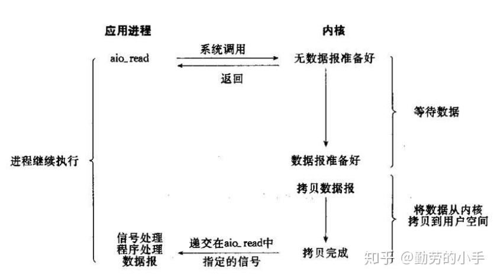
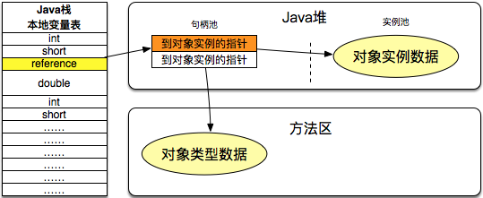
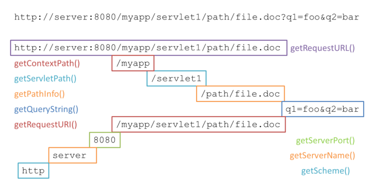
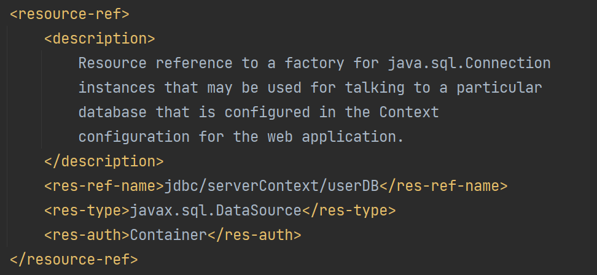

- Java语言
	- Java基础
	  collapsed:: true
		- 语言基础
		  collapsed:: true
			- 数据类型
			  collapsed:: true
				- 基本类型
				  collapsed:: true
					- 整型
						- byte，1个字节
						- short，2个字节
						- int，4个字节
						- long，8个字节
					- 浮点型
					  collapsed:: true
						- float，4个字节
						- double，8个字节
					- 布尔类型：boolean，这种数据类型表示一位信息，但它的“大小”并没有得到精确的定义。
					- 字符类型：char，2个字节，字符类型char表示一个字符。Java的char类型除了可表示标准的ASCII外，还可以表示一个Unicode字符：
					- 其他：引用类型（所有class和interface类型）
				- 包装类型
				  collapsed:: true
					- 基本类型都对应一个包装类型
					  collapsed:: true
						- Java核心库提供的包装类型可以把基本类型包装为class；
						- 自动装箱和自动拆箱都是在编译期完成的（JDK>=1.5）；
						- 装箱和拆箱会影响执行效率，且拆箱时可能发生NullPointerException；
						- 包装类型的比较必须使用equals()，枚举类型可以除外
						- 整数和浮点数的包装类型都继承自Number；
						- 包装类型提供了大量实用方法；
						- 所有的包装类型都是不变类；
					- 基本数据类型和其包装类的对应关系
					  collapsed:: true
						- byte-Byte
						- short-Short
						- int-Integer
						- long-Long
						- float-Float
						- double-Double
						- boolean-Boolean
						- char-Character
					- 自动装箱与拆箱
					- 进制转换
					  collapsed:: true
						- 十进制：Integer.toString
						- 十六进制：Integer.toHexString
						- 八进制：Integer.toOctalString
						- 二进制：Integer.toBinaryString
					- 处理无符号整型
					  collapsed:: true
						- Java并没有无符号整型（Unsigned）的基本数据类型
						- byte、short、int和long都是带符号整型，最高位是符号位
						- Byte.toUnsignedInt
				- Java中的具体类型
				  collapsed:: true
					- 原始数据类型，例如int，float
					- 非泛型的类和接口，例如 String 或 Random
					- 所有类型都是无界通配符的泛型类型，例如 Set<?> 或 Map<?, ?>
					- 集合类型，例如 List或 HashMap
					- 可具体化类型的数组，如 String[]、List[] 或 Map<?, ?>[]
				- 缓存池
				  collapsed:: true
					- `Integer.valueOf()`方法出于减少对象创建次数和节省内存的考虑，对数值在-128~127的Integer对象进行了缓存，如果valueOf()方法的参数在这个范围内，就会直接返回缓存中的对象。也就是说`Integer a = new Integer(1)`和`Integer b = new Integer(1)`其实就是同一个对象。
			- 字符串
			  collapsed:: true
				- String的三种主要的声明方式
				  collapsed:: true
					- 方式一：直接使用双引号声明出来的`String`对象会直接存储在**常量池**中，这个对象指向的是常量池中的String对象。
					- 方式二：如果不是用双引号声明的`String`对象，可以使用`String`提供的`intern`方法。intern 方法会从字符串常量池中查询当前字符串是否存在，若不存在就会将当前字符串放入常量池中。
					- 方式三：`String s = new String("abc")`创建了2个对象，第一个对象是”abc”字符串存储在常量池中，第二个对象在JAVA Heap中的 String 对象。s指向的是Java堆上的对象。
				- 基本操作
				  collapsed:: true
					- 比较：必须使用equals()
					- 是否包含：contains()
					- 去除首尾空格
					  collapsed:: true
						- tirm()：空白字符包括空格，\t，\r，\n和空格
						- strip()：去除\u3000
					- 提取子串：substring()
					- 删除索引位置的字符：deleteCharAt()
					- 字符串替换：replace()
					- 分割字符串：split()
					- 按分隔符拼接字符串：join()
					- 拼接字符串：concat()
					- 格式化字符串
					  collapsed:: true
						- formatted()
						- format()
						- 占位符
						  collapsed:: true
							- %s：显示字符串；
							- %d：显示整数；
							- %x：显示十六进制整数；
							- %f：显示浮点数；
							  collapsed:: true
								- String.format("value is %f", 32.33434)，显示浮点数
								- String.format("value is %32.12f", 32.33434)，显示小数点后显示12位，不够填充0，整体显示位32位，不够的地方补充空格
							- %c：显示Unicode字符；
					- 类型转换
					- 转换为char数组
					  collapsed:: true
						- char[] cs = "Hello".toCharArray(); // String -> char[]
						- String s = new String(cs); // char[] -> String
						  collapsed:: true
							- s不会直接引用char[]，而是复制
							- 如果修改了char[]，并不会影响s
					- 返回字符串索引下表字母的ascII十进制码值：codePointAt()
				- 编码
				  collapsed:: true
					- 字符编码笔记：ASCII，Unicode 和 UTF-8
					- 将字符串转为字节数组：byte[] b2 = "Hello".getBytes("UTF-8"); // 按UTF-8编码转换
					- 将已知编码的字节数组转为字符串：String s2 = new String(b, StandardCharsets.UTF_8); // 按UTF-8转换
				- 不可变
				  collapsed:: true
					- 概述
					  collapsed:: true
						- 在 Java 8 中，String 内部使用 char 数组存储数据
						- 在 Java 9 之后，String 类的实现改用 byte 数组存储字符串，同时使用 coder 来标识使用了哪种编码
						- 不可变特性可以参考：https://www.liaoxuefeng.com/wiki/1252599548343744/1255938912141568
					- 不可变的好处
					  collapsed:: true
						- 可以缓存 hash 值
						- String Pool的需要
						- 安全性
						- 线程安全
				- Sting-StringBuffer-StringBuilder的比较
				  collapsed:: true
					- 可变性
					  collapsed:: true
						- String不可变
						- StringBuffer和StringBuilder可变
					- 线程安全
					  collapsed:: true
						- String不可变，是线程安全的
						- StringBuilder 不是线程安全的
						- StringBuffer 是线程安全的，内部使用 synchronized 进行同步
				- String.intern()
				  id:: 64043de8-605f-43aa-a7b0-a711a39e4d4a
				  collapsed:: true
					- 作用：如果字符串常量池中已经包含一个等于此String对象的字符串，则返回池中这个字符串的**String对象**；否则，将此String对象包含的字符串添加到常量池中，并且返回此**String对象**。
					- JDK6中，常量池和堆是不同的内存区域，所以使用`new String("a")`是分别创建了两个不同的对象。
					- JDK7新的变化
					  collapsed:: true
						- 将String常量池 从 Perm 区移动到了 Java Heap区
						- 涉及到从常量池获取对象的时候，若这个对象在堆上已经存在，则不再常量池创建新的对象，而是返回堆上已经存在对象的引用地址。
					- 可以保证相同内容的字符串变量引用同一的内存对象。
					- String Pool
				- new String("abc")
			- 运算
			  collapsed:: true
				- 参数传递
				  collapsed:: true
					- Java的参数传递是：值传递，
					- 对于基本类型（原始类型），在参数传递中是值传递
					- 对于引用类型，本质上是将对象的地址以值的方式传递到形参中，修改信息的是同一个对象。
					- 如果在方法中重置了对象的引用，则修改信息的是不同的对象。
					- 参考文章
					  collapsed:: true
						- [这一次，彻底解决Java的值传递和引用传递](https://segmentfault.com/a/1190000016773324)
				- 整数运算
				  collapsed:: true
					- 整数类型：byte, short, int, long
					- 溢出：整数由于存在范围限制，如果计算结果超出了范围，就会产生溢出
					- 加减乘除
						- `+`/`+=`
						- `-`/`-=`
						- `*`/`*=`
						- `/`/`/=`
						- `++`和`--`
							- a++是先用当前值，后加1
							- ++a是先加1，用加1之后的值
							- a--也是先用当前值，后减1
							- --a是先减1，用减1之后的值
					- 自增/自减
					  collapsed:: true
						- `++`
						- `--`
						- 不建议把上面的运算符写到变量前面
					- 移位运算
					  collapsed:: true
						- `<<`，左移相当于乘2
						- `>>`，右移相当于除2
						- `>>>`，无符号右移，也相当于除2，与右移运算符不同的是
					- 位运算
						- `&`，与预算
						- `|`，或运算
						- `~`，非运算
						- `^`，异或运算
					- 逻辑运算符
					  collapsed:: true
						- `&&`优先级高于`||`
					- [运算优先级](https://www.liaoxuefeng.com/wiki/1252599548343744/1255888634635520)
					- 类型转换
					  collapsed:: true
						- [隐式类型转换：++和+=](http://www.cyc2018.xyz/Java/Java%20%E5%9F%BA%E7%A1%80.html#%E9%9A%90%E5%BC%8F%E7%B1%BB%E5%9E%8B%E8%BD%AC%E6%8D%A2)
						- 参与运算的两个数类型不一致，那么计算结果为较大类型的整型
						- 大范围的整数转型为小范围的整数。强制转型使用(类型)。强转的结果可能是错的。
				- 浮点数运算
				  collapsed:: true
					- float与double
					  collapsed:: true
						- // float f = 1.1; 是错的，Java 不能隐式执行向下转型，因为这会使得精度降低。
						- 1.1f 字面量才是 float 类型
						- 1.1 字面量属于 double 类型
					- 特点
					  collapsed:: true
						- 不能做位运算和移位运算
						- 浮点数的运算常常存在误差
					- 类型提升：一个浮点数和一个整数的运算，整型可以自动提升到浮点型
					- 溢出：浮点数除0时不会报错，会返回特殊值
					  collapsed:: true
						- NaN表示Not a Number
						- Infinity表示无穷大
						- -Infinity表示负无穷大
					- 强制转型（将浮点型转为整型）
					  collapsed:: true
						- 浮点数的小数部分会被丢掉
						- 四舍五入需要加0.5
						- 如果转型后超过了整型能表示的最大范围，将返回整型的最大值
				- 布尔运算
				  collapsed:: true
					- 短路运算：如果一个布尔运算的表达式能提前确定结果，则后续的计算不再执行，直接返回结果
					- 三元运算符：b ? x : y
				- 运算符
				  collapsed:: true
					- 逻辑运算符
						- 与：`&&`
						- 或：`||`
						- 非：`!`
					- 算术运算符
						- 加：`+`/`+=`/`++`
						- 减：`-`/`-=`/`--`
						- 乘：`*`/`*=`
						- 除：`/`/`/=`
					- 移位运算符
						- `<<`
						  collapsed:: true
							- 运算规则：**左移位会丢弃左边指定位数，右边补0**。
							- 左移位操作，相当于乘2。
							- int类型左移位数大于等于32位操作时，会先求余（%）后再进行左移操作。例如左移40位相当于左移8位（40%32=8）。
							- long类型左移位数大于等于64位操作时，会先求余（%）后再进行右移操作。例如左移70位相当于左移6位（70%64=6）。
							- double，float在二进制中的表现比较特殊，因此不能进行位移操作。
							- 整型byte，short移位前会先转换为int类型（32位）再进行移位。
						- `>>`
						  collapsed:: true
							- 运算规则：**丢弃右边指定位数，左边补上符号位**。符号位0代表的是正数，1代表的是负数。正数右移左侧补0，负数右移左侧补1。
							- 右移位操作，相当于除2。
							- 和左移一样，int类型移位大于等于32位时，long类型大于等于64位时，会先做求余处理再位移处理，byte，short移位前会先转换为int类型（32位）再进行移位。
						- `>>>`
						  collapsed:: true
							- 运算规则：**丢弃右边指定位数，左边补上0**。
							- 对于正数移位来说等同于：`>>`，负数通过此移位运算符能移位成正数。
						- 参考文章
						  collapsed:: true
							- [Java中的移位运算符](https://zhuanlan.zhihu.com/p/30108890)
					- 其他运算符
			- 流程控制
			  collapsed:: true
				- 输入和输出
				  collapsed:: true
					- 输出
					  collapsed:: true
						- System.out.println()，输出并换行
						- System.out.print()，输出不换行
						- System.out.printf()，格式化输出
					- 格式化输出：
					  collapsed:: true
						- printf()
						- 占位符%?
					- 输入：
					  collapsed:: true
						- Scanner scanner = new Scanner(System.in);
						- scanner.nextLine()/nextInt()...
				- if判断
				  collapsed:: true
					- if
					- if...else
					- if...else if...else
				- switch多重选择
				  collapsed:: true
					- 基础语法：switch(value){...case v1: ...break...default...}
					- switch的计算结果必须是整型、字符串或枚举类型；
					- switch的case语句后面可以放多个判断条件，类似：case 1, 2:
					- Java12：switch(value)...{case v1 ->...default}，不用写break
					- Java13 yield语法：我们可以从内部返回一个值
					- Java14：switch语句正式升级为表达式，不再需要break
				- while循环
				  collapsed:: true
					- while循环先判断循环条件是否满足，再执行循环语句；
					- while循环可能一次都不执行；
					- 编写循环时要注意循环条件，并避免死循环；
				- do while循环
				  collapsed:: true
					- do while循环先执行循环，再判断条件；
					- do while循环会至少执行一次；
				- for循环
				  collapsed:: true
					- for循环通过计数器可以实现复杂循环；
					- for each循环可以直接遍历数组的每个元素；
					- 最佳实践：计数器变量定义在for循环内部（初始化值，结束条件，更新语句），循环体内部（就是你要循环执行的代码）不修改计数器；
				- break和continue
				  collapsed:: true
					- 相同点
					  collapsed:: true
						- 都用于while循环和for循环
						- 都通常配合if使用
					- 不同点
					  collapsed:: true
						- break总是跳出最近的一层循环，而continue语句可以提前结束本次循环
			- 数组操作
			  collapsed:: true
				- 初始化数组
					- int[] a = new int[5]; int类型数组初始化之后是0
					- int[] b = {1, 2, 3, 4, 5};
				- 数组操作
				  collapsed:: true
					- 遍历数组
					  collapsed:: true
						- for
						- for each
						- 打印数组：Arrays.toString()
					- 数组排序
					  collapsed:: true
						- 使用Arrays.sort()进行排序
					- 多维数组
					  collapsed:: true
						- 二维数组就是数组的数组，三维数组就是二维数组的数组；
						- 多维数组的每个数组元素（每行数组）长度都不要求相同；
						- 打印多维数组可以使用Arrays.deepToString()；
						- 二位数组的长度是行数；
						- 最常见的多维数组是二维数组，访问二维数组的一个元素使用array[row][col]。
					- 命令行参数
					  collapsed:: true
						- main方法的args字符串数组
						- $ javac Main.java
						- $ java Main -version
				- System.arraycopy()
				  collapsed:: true
					- 功能
						- `java.lang.System.arraycopy(Object src,  int  srcPos, Object dest, int destPos, int length)`方法将源数组从特定起始位置复制到目标数组中提到的位置。 要复制的参数数量由参数决定。 将 source_Position 到 source_Position + length – 1 处的组件从 destination_Position 到 destination_Position + length – 1 复制到目标数组。
					- 特点
						- **深复制**：当数组为**一维数组**，且元素为**基本类型**或**String**类型（**String**的特殊是因为它的不可变性）时，属于深复制，即原数组与新数组的元素不会相互影响。
						- **浅复制**：当数组为**多维数组**，或其中一维数组中的元素为**引用类型**时，属于浅复制，原数组与新数组的元素引用指向同一个对象。
						- 可能会出现的异常
					- 具体实践：JavaTrain/src/main/java/cn/bravedawn/basic/lang/systemarraycopy
					- 参考博客：
						- [System.arraycopy() in Java](https://www.geeksforgeeks.org/system-arraycopy-in-java/)
			- 关键字final和static
			  collapsed:: true
				- final
				  collapsed:: true
					- 修饰类
					  collapsed:: true
						- 如果一个在声明类时用final关键字来修饰，那这个类是不能够被继承的。也就是说这个类时最终的。例如String类。
						- 类声明中的 final 关键字并不意味着该类的对象是不可变的。我们可以自由改变类对象的字段：
					- 修饰方法
					  collapsed:: true
						- 子类是无法重写基类的private的方法的，private隐式的被指定为final。
						- 被final修饰的方法，是无法被子类覆盖的。
						- 如果我们类的某些方法被其他方法调用，我们应该考虑将被调用的方法设为final。否则，覆盖它们会影响调用者的工作并导致令人惊讶的结果。
						- 将类的所有方法设为最终方法与将类本身标记为最终方法有什么区别？
						  collapsed:: true
							- 在第一种情况下，我们可以扩展类并向其添加新方法。
							- 在第二种情况下，我们不能扩展。
					- 修饰变量
					  collapsed:: true
						- 标记为 final 的变量不能重新分配。 一旦最终变量被初始化，它就不能被改变。
						- 修饰原始类型变量
						- 修饰引用变量
						- 修饰字段
						  collapsed:: true
							- 修饰原始类型变量
							- 修饰引用类型变量
							- 修饰类字段（类的属性）
							  collapsed:: true
								- 声明常量
								  collapsed:: true
									- 根据命名约定，类常量应为大写，组件之间用下划线 (“_”) 字符分隔
								- 必须在构造函数完成之前初始化任何 final 字段
								  collapsed:: true
									- static final修饰的类字段的初始化时机
									  collapsed:: true
										- 在声明的时候初始化该字段
										- 在静态代码块中初始化该字段
									- final修饰的类字段的初始化时机
									  collapsed:: true
										- 在声明的时候初始化该字段
										- 在实例初始化代码块中初始化该字段
										- 在构造函数中初始化该字段
					- 参考实现：JavaTrain/src/main/java/cn/bravedawn/basic/keyword/final_
				- static
				  collapsed:: true
					- 静态变量
					- 静态方法
					  collapsed:: true
						- 只能访问所属类的静态字段和静态方法，方法中不能有 this 和 super 关键字，因为这两个关键字与具体对象关联。
					- 静态语句块
					- 静态内部类
					- 静态导包
					- 实例化顺序
			- 日期与时间
			  collapsed:: true
				- 基本概念
				  collapsed:: true
					- 时区
					- 本地化Locale
				- Date和Calendar
				  collapsed:: true
					- 时间戳：System.currentTimeMillis()
					- 标准API
					  collapsed:: true
						- 旧的：java.util，主要包括Date、Calendar和TimeZone这几个类；
						- 新的：java.time，主要包括LocalDateTime、ZonedDateTime、ZoneId等；
					- 格式化时间
					  collapsed:: true
						- yyyy：年
						- MM：月
						- dd：日
						- HH：小时（24小时制）
						- hh：小时（12小时制）
						- mm：分钟
						- ss：秒
						- sss：毫秒
					- Date
					- SimpleDateFormat
						- 不是线程安全
					- Calendar
					  collapsed:: true
						- 利用Calendar.getTime()可以将一个Calendar对象转换成Date对象
						- 相比于Date
						  collapsed:: true
							- 多了做简单的日期和时间运算的功能
							- 提供了时区转换的功能
				- Java8新的时间API体系
				  collapsed:: true
					- 本地日期和时间
					  collapsed:: true
						- LocalDateTime
						  collapsed:: true
							- 它表示一个本地日期和时间
							- 按照ISO 8601格式打印
							- 可以转换为LocalDate和LocalTime
							- of方法创建指定的日期和时间
							- 字符串解析为日期和时间
							- 加减运算
							- 日期和时间的修改
							- with方法进行更复杂的运算
							- 判断时间的先后
							- LocalDateTime无法与时间戳进行转换，因为LocalDateTime没有时区，无法确定某一时刻
						- LocalDate
						  collapsed:: true
							- 它表示一个本地日期
						- LocalTime
						  collapsed:: true
							- 它表示一个本地时间
					- 带时区的日期和时间
					  collapsed:: true
						- ZonedDateTime
						  collapsed:: true
							- 创建
							- 时区转换
							- 转换为LocalDateTime
					- 时刻
					  collapsed:: true
						- Instant
					- 时区
					  collapsed:: true
						- ZoneId
						- ZoneOffset
					- 时间间隔
					  collapsed:: true
						- Duration：表示两个时刻之间的时间间隔
						- Period：表示两个日期之间的天数
					- 时间格式类
						- DateTimeFormatter
						  collapsed:: true
							- 线程安全
							- 创建
							- 格式化输出
					- 互转关系
					  collapsed:: true
						- LocalDateTime和ZoneId可以转换为ZonedDateTime
						- ZonedDateTime可以转为LocalDateTime，丢失时区信息
						- ZonedDateTime可以转化为Instant和long
						- Instant和long也可以转换为ZonedDateTime
				- 最佳实践
				  collapsed:: true
					- 旧API转新API
					- 新API转旧API
					- 数据库中采用长整型存储时间
			- 正则表达式
			  collapsed:: true
				- 功能：正则表达式是用字符串描述的一个匹配规则，使用正则表达式可以快速判断给定的字符串是否符合匹配规则。Java标准库java.util.regex内建了正则表达式引擎。
				- 匹配规则
				  collapsed:: true
					- 匹配任意字符：`.`匹配一个字符且仅限一个任意字符
					- 匹配数字：`\d`仅限单个数字字符
					- 匹配常用字符：`\w`可以匹配一个字母、数字或下划线
					- 匹配空格字符：`\s`可以匹配一个空格字符，注意空格字符不但包括空格，还包括tab字符（在Java中用`\t`表示）
					- 匹配非数字：`\D`则匹配一个非数字
					- 重复匹配
						- 修饰符`*`可以匹配任意个字符，包括0个字符
						- 修饰符`+`可以匹配至少一个字符
						- 修饰符`?`可以匹配0个或一个字符
				- 匹配复杂规则
				  collapsed:: true
					- 匹配开头和结尾
					- 匹配指定范围
					- 或规则匹配
					- 使用括号
						- 提取公共部分，括起子规则
							- 具体实践：JavaTrain:cn.bravedawn.basic.regex.BracketExample
						- 分组匹配
							- 具体实践：JavaTrain:cn.bravedawn.basic.regex.GroupMatch
				- 使用Pattern只做一次编译，不建议使用String.matches()
				- 非贪婪匹配?
				- 搜索和替换
				  collapsed:: true
					- 分割字符串：String.split()
					- 搜索字符串：Matcher.find()
					- 替换字符串：String.replaceAll()
					- 反向引用
					- Matcher.appendReplacement()
				- 参考文章
				  collapsed:: true
					- [正则表达式](https://www.liaoxuefeng.com/wiki/1252599548343744/1255945288020320)
			- 枚举
			  collapsed:: true
				- 枚举类的作用：定义的普通常量类，编译器无法检查每个值的合理性
				- 枚举的比较：相比equals方法，建议使用==
				- 枚举的实例方法
					- `name()`
					- `ordinal()`
					- `values()`
					- `valueOf("RED")`
				- 枚举的switch
			- 随机数
			  collapsed:: true
				- 为什么说我们生成的随机数是伪随机的？
				  collapsed:: true
					- 随机数生成器是一个函数y=f(x)，而随机种子则是变量x。所以一旦x和f(x)确定了，那么产生的随机数y也就确定。“伪随机”正是通过，在随机数生成器中传入的随机种子得到结果产生随机数。之所以为“伪随机”，是因为能够出现的结果以及次序其实已经在随机数生成器这个函数中确定了，如果f(x)一定，而程序通过输入x的变化，而产生不同结果，达到随机的效果。“伪”指的是有规律，而不是“假”。
				- 使用Java API
				  collapsed:: true
					- 使用Math.random()生成随机数
					  collapsed:: true
						- Math 类的 random 方法将返回一个范围从 0.0（包括）到 1.0（不包括）的 double 值
					- 使用Random.next()生成随机数
					  collapsed:: true
						- nextInt(n)，生成一个在0(包括)到n(不包括)之间的一个数，带参数的方法中，n必须大于0，否则就会报IllegalArgumentException
						- 使用无参的nextInt方法可以获取任何随机数，经常会拿到负数
						- 使用有参的nextInt方法，可以得到一个范围内的数字
						- 为Random设置相同的种子之后，每次生成的都是相同的随机数。
					- 使用ThreadLocalRandom生成随机数
					  collapsed:: true
						- ThreadLocalRandom类与Random类有三个重要区别
						  collapsed:: true
							- 1. 不需要显式地初始化ThreadLocalRandom的一个新实例。这有助于我们避免创建大量无用的实例和浪费垃圾回收器时间的情况。
							- 2. 不能为ThreadLocalRandom设置种子。
							- 3. Random类在多线程环境中表现不好。
					- 使用SplittableRandom生成随机数
					  collapsed:: true
						- Java8新的快速生成器，用于并行计算的生成器。重要的是要知道实例不是线程安全的
						- 提供了ints()方法，返回IntStream
					- 使用SecureRandom生成随机数
					  collapsed:: true
						- 安全敏感的应用程序，我们应该考虑使用SecureRandom。这是一个密码学上的强生成器
				- 使用三方API
				  collapsed:: true
					- 使用Apache Common Math3生成随机数
					  collapsed:: true
						- 在Apache commons项目的公共数学库中提供了很多生成器，RandomDataGenerator使用Well19937c算法进行随机数的生成。
					- 使用XoRoShiRo128PlusRandom生成随机数
					  collapsed:: true
						- 最快的随机数生成器实现之一，它是由米兰大学信息科学系开发的。
				- 参考文章
				  collapsed:: true
					- Generating Random Numbers in Java
			- JSON
			  collapsed:: true
				- jackson
				  collapsed:: true
					- 将一个对象转换为json字符串
					  collapsed:: true
						- 参考文章
						  collapsed:: true
							- [How to convert Java object to / from JSON (Jackson)](https://mkyong.com/java/how-to-convert-java-object-to-from-json-jackson/)
		- 面向对象
		  collapsed:: true
			- Object通用方法
			  collapsed:: true
				- equals
				  collapsed:: true
					- Java SE中针对equals()的原则
						- 自反性（Reflexive）：对于非null的x来说，x.equals(x)必须返回true；
						- 对称性（Symmetric）：对于非null的x和y来说，如果x.equals(y)为true，则y.equals(x)也必须为true；
						- 传递性（Transitive）：对于非null的x、y和z来说，如果x.equals(y)为true，y.equals(z)也为true，那么x.equals(z)也必须为true；
						- 一致性（Consistent）：对于非null的x和y来说，只要x和y状态不变，则x.equals(y)总是一致地返回true或者false；
						- 对null的比较：x.equals(null)永远返回false
					- 手动编写equals的步骤（可参考：JavaTrain：cn.bravedawn.obj.object.EqualsExample#equals）
						- 第一步：先确定实例“相等”的逻辑，即哪些字段相等，就认为实例相等；
						- 第二步：用instanceof判断传入的待比较的Object是不是当前类型，如果是，继续比较，否则，返回false；
						- 第三步：对引用类型用Objects.equals()比较，对基本类型直接用==比较；
					- 对于实体类
					  collapsed:: true
						- 对于整型包装类型，在-128到127之间的比较都用到了缓存池，这里的equals()和==的作用是一样的。超过这个范围的值比较要使用equals()方法，不能使用==
						- 对于浮点型包装类型，值的比较使用equals()，不能使用==
						- 对于字符型包装类型，equals()和==的作用是一样的
						- 对于布尔型包装类型，equals()和==的作用是一样的
					- 继承违反equals()的对称性
					  collapsed:: true
						- 实现：子类继承父类，翻写子类的equals()方法，具体可以参考：cn.bravedawn.obj.object.equalsandhashcode.equals.WrongVoucher
						- 使用组合修复equals()的对称性：其实是治标不治本，具体实现可参考：cn.bravedawn.obj.object.equalsandhashcode.equals.Voucher
					- 使用场景
					  collapsed:: true
						- 如果不调用List的contains()、indexOf()这些方法，那么放入的元素就不需要实现equals()方法
						- 对于实体类，像基本类型的包装类型或是String类，通常使用默认的equals()实现就可以。但是对于有自身属性的值对象，我们就需要手动实现equals()方法
					- 辅助工具
					  collapsed:: true
						- IDE生成
						- Apache Commons Lang
						- Google Guava
						- Project Lombok
					- 总结
					  collapsed:: true
						- 对于基本数据类型的包装类型，值的比较建议使用equals，不要使用==
						- 对于基本类型，== 判断两个值是否相等，基本类型没有equals()方法
						- 对于引用类型，== 判断两个变量是否引用同一个对象（对象引用的地址），而 equals()判断引用的对象是否等价
						- 若一个对象没有覆写equals()方法，则equals()方法的默认实现是通过==比较内存地址实现的
					- 参考文章
					  collapsed:: true
						- 廖雪峰-编写equals方法
						- Java equals() and hashCode() Contracts
					- 参考实现：JavaTrain/src/main/java/cn/bravedawn/obj/object/equalsandhashcode/equals
				- hashCode
				  collapsed:: true
					- 一般原则
					  collapsed:: true
						- 内部一致性：hashCode() 的值可能仅在 equals() 中的属性更改时才会更改
						- 等于一致性：彼此相等的对象必须返回相同的hashCode()，也就是说调用equals方法的两个对象相等，调用hashCode()产生的整数结果也相同。
						- 冲突：不相等的对象可能具有相同的 hashCode()
					- 注意
					  collapsed:: true
						- hashCode() 返回哈希值，而 equals() 是用来判断两个对象是否等价。等价的两个对象散列值一定相同，但是散列值相同的两个对象不一定等价
						- 在覆盖 equals() 方法时应当总是覆盖 hashCode()方法，保证等价的两个对象哈希值也相等。否则基于hashCode定位的HashMap就无法正常工作
				- toString
				  collapsed:: true
					- 一个自定义的类如果不覆写toString方法的话，默认返回类名+@+散列值的十六进制表示
				- clone
				  collapsed:: true
					- 方法实现：实现Cloneable接口，重写clone方法（clone() 是 Object 的 protected 方法，它不是 public）
					- 对象拷贝
					  collapsed:: true
						- 浅拷贝
						  collapsed:: true
							- 拷贝对象和原始对象的属性的引用类型引用的是同一个对象
							- 特点
							  collapsed:: true
								- 主对象的内存地址不同，是不同对象。属性对象的内存地址相同，是同一对象。
								- 浅拷贝只复制“主”对象，但不会复制“主”对象的里面的对象（属性），”里面的对象“会在原来的对象和它的副本之间共享。
						- 深拷贝
						  collapsed:: true
							- 拷贝对象和原始对象的属性的引用类型引用是不同对象
							- 特点
							  collapsed:: true
								- 主对象的属性对象内存地址不同，都是不同对象。
								- 深拷贝是一个整个独立的对象拷贝，深拷贝会拷贝所有的属性,并拷贝属性指向的动态分配的内存。当对象和它所引用的对象一起拷贝时即发生深拷贝。深拷贝相比于浅拷贝速度较慢并且花销较大。
							- 方法
							  collapsed:: true
								- 1. 构造函数
								  2. 覆写clone方法
								  3. Serializable序列化
								  4. Json序列化
					- 引用拷贝
					  collapsed:: true
						- 创建一个指向对象的引用变量的拷贝。指两个不同的引用变量指向同一个对象实例，即他们指向的是同一个相同的引用地址，也就是同一个对象。
						- 特点：
						  collapsed:: true
							- 对象的内存地址一样，同一个对象
					- 最佳实践
					  collapsed:: true
						- 最好不要去使用 clone()，可以使用拷贝构造函数或者拷贝工厂来拷贝一个对象
						- 使用 clone() 方法来拷贝一个对象即复杂又有风险，它会抛出异常，并且还需要类型转换
					- 参考文章
					  collapsed:: true
						- [Java深入理解深拷贝和浅拷贝区别](https://blog.csdn.net/riemann_/article/details/87217229)
				- Object.equals()的逻辑
				  collapsed:: true
					- 先判断两个对象是否相等，若是返回true，否则false；若两个参数都为null也返回true；
					- 若第一个参数不为null，则调用他的equals方法进行判断；
			- 面向对象
				- 类和接口的定义
				  collapsed:: true
					- 类：类是用户定义的蓝图或原型，可以从中创建对象。它表示对同一类型的所有对象通用的属性或方法的集合。
					- 接口：像类一样，接口可以有方法和变量，但是在接口中声明的方法默认是抽象的(只有方法签名，没有主体)。接口指定类必须做什么，而不是如何做。它是类的蓝图
				- 类的字段类型的默认值
				  collapsed:: true
					- 基本类型
					  collapsed:: true
						- boolean：false
						- byte：0
						- short：0
						- int：0
						- long：0
						- float：0.0
						- double：0.0
						- char：nul（Assic码表对应十进制0）
					- 引用类型
					  collapsed:: true
						- Boolean：null
						- Byte：null
						- Short：null
						- Integer：null
						- Long：null
						- Float：null
						- Double：null
						- Char：null
				- 访问权限
				  collapsed:: true
					- 定义
					  collapsed:: true
						- Java中，可以使用访问修饰符来保护对类、变量、方法和构造方法的访问。Java 支持 4 种不同的访问权限。
					- private
					  collapsed:: true
						- 在同一类内可见。使用对象：变量、方法、类（接口）。 注意：不能修饰类（外部类）
						- 定义private方法的理由是内部方法是可以调用private方法的
					- default
					  collapsed:: true
						- (即缺省）: 在同一包内可见，不使用任何修饰符。使用对象：类（接口）、变量、方法。
					- protected
					  collapsed:: true
						- 对同一包内的类和所有子类可见。使用对象：类（接口）、变量、方法。 注意：不能修饰类（外部类）
					- public
					  collapsed:: true
						- 对所有类可见。使用对象：类（接口）、变量、方法
						- 一个.java文件只能包含一个public类，但可以包含多个非public类。
					- 权限访问图
					  collapsed:: true
						-
				- 方法
				  collapsed:: true
					- 定义方法
					  collapsed:: true
						- 方法参数
						  collapsed:: true
							- 传值引用
							  collapsed:: true
								- 判断值传递还是引用传递：函数中对传递的参数进行修改是否会影响原来的值，若影响则为引用传递；若不影响则为值传递。
								- 基本类型参数的传递，是调用方值的复制。双方各自的后续修改，互不影响
								- 引用类型参数的传递，调用方的变量，和接收方的参数变量，指向的是同一个对象（其实是引用地址的传递）。双方任意一方对这个对象的修改，都会影响对方（因为指向同一个对象嘛）
							- 可变参数：[type]... names
						- 返回值
						- 访问权限
						- return语句
					- this关键字
					  collapsed:: true
						- 在方法内部，可以使用一个隐含的变量this，它始终指向当前实例.
						- 通过this.field就可以访问当前实例的字段和方法。
				- 构造方法
				  collapsed:: true
					- 若一个类没有定义构造方法，Java会为每个类自动创建默认的无参构造方法
					- 一旦定义构造方法，Java就不会再定义默认无参构造方法。若想保留需手动显式实现
					- 可以定义多个构造方法，编译器根据参数自动判断
					- 可以在一个构造方法内部调用另一个构造方法，便于代码复用，调用其他构造方法的语法是this(…)
					- 若子类没有定义无参构造函数，则实例化子类时，会默认调用父类的无参构造函数
				- 重载
				  collapsed:: true
					- 特点（定义）
						- （Overload）存在于同一个类中，指一个方法与已经存在的方法名称上相同，但是参数类型、个数、顺序至少有一个不同。
						- 返回类型不参与重载选择，可以相同也可以不同。
						- 每个重载的方法（或者构造函数）都必须有一个独一无二的参数类型列表。
						- 最常用的地方就是构造器的重载。
						- Java中不允许用户重载运算符。
					- Java中方法重载的三种方式
						- 更改参数的数量
						- 更改参数的数据类型
						- 改变方法参数的顺序
					- 类型升级
					  collapsed:: true
						- 如果重载的参数类型与方法实际传入的类型不一致怎么办？换句话说实参的数据类型与形参的数据类型不一样，Java如何去选择合适的重载方法？
						- Java将会进行类型转换，将实参的数据类型转换到更高一级的数据类型，从而去匹配合适的重载方法，如果没有匹配到就会报错。
						- 在类型升级的过程中，Java会自动将原始数据类型转为包装类型去类型转换匹配图中去寻找。
						- 类型转换匹配图，例如实参如果是Byte类型，但是形参没有Byte类型，Java就会去找是否有Short、Integer....的重载方法。
					- 返回值问题
						- 如果两个方法参数的参数类型、个数、顺序都相同。返回值不同，是无法通过编译的。
						- 如果两个方法参数的参数类型、个数、顺序至少有一个不同，返回值可以相同也可以不同。
					- 重载main方法
					  collapsed:: true
						- 在Java中main方法是可以重载的。
					- 重载（overload）和覆盖（override）的区别
					  collapsed:: true
						- 重载是关于同一个函数有不同的签名。覆盖是关于相同的功能，相同的签名，但通过继承连接的不同类。
						- 重载是编译时多态性的一个例子，而覆盖是运行时多态性的一个例子。
					- 重载的优点
					  collapsed:: true
						- 方法重载提高了程序的可读性和可重用性。
						- 方法重载降低了程序的复杂性。
						- 使用方法重载，程序员可以高效地执行任务。
						- 使用方法重载，可以使用稍微不同的参数和类型访问执行相关功能的方法。
						- 类的对象也可以使用构造函数以不同的方式初始化。
					- 将null作为实参传给重载方法
					  collapsed:: true
						- 不要直接将null作为实参直接传递给形参为包装类型的重载方法，否则会编译错误。
						- 将null赋值给明确数据类型的变量之后，再传递给重载方法，就是正常的。
					- 参考文章
					  collapsed:: true
						- Java 重写(Override)与重载(Overload)
						- Method Overloading in Java
					- 参考实现：JavaTrain/src/main/java/cn/bravedawn/obj/inherit/polymorphic/overloading
				- 继承
				  collapsed:: true
					- Java只允许一个class继承自一个类，因此，一个类有且仅有一个父类。只有Object特殊，它没有父类。
					- 里氏替换原则
					  collapsed:: true
						- 含义一：子类必须实现父类的抽象方法，但不得重写（覆盖）父类的非抽象（已实现）方法。否则：子类重写的父类的方法，导致相同的方法的实现不同，导致程序的逻辑发生了变化
						- 含义二：子类中可以增加自己特有的方法
						- 含义三：当子类的方法重载父类的方法时，方法的前置条件（即方法的输入/入参）要比父类方法的输入参数更宽松（大于）。（例如父类方法的入参为HashMap，则子类的入参应该为Map）
						- 含义四：当子类的方法实现父类的方法时（重写/重载或实现抽象方法），方法的后置条件（即方法的输出/返回值）要比父类更严格或相等（小于等于）。 （例如父类方法的返回值为Map，则子类的入参应该为Map或为HashMap）。否则： 若在继承时，子类的方法返回值类型范围比父类的方法返回值类型范围大，在子类重写该方法时编译器会报错
					- protected
					  collapsed:: true
						- protected关键字可以把字段和方法的访问权限控制在继承树内部，一个protected字段和方法可以被其子类，以及子类的子类所访问
					- super
					  collapsed:: true
						- 若父类定义了有参构造方法且没有显示定义无参构造方法，子类需显式的复写父类的构造方法，需要在子类的构造方法中通过super关键字显式的调用父类的构造方法
						- 若父类定义了无参构造方法，子类的无参构造方法中会默认调用父类的无参构造方法，而且会先调用父类的后调用子类的
					- 阻止继承
					  collapsed:: true
						- final
						- sealed
						- permits
						- non-sealed
					- 向上转型
					  collapsed:: true
						- 把一个子类类型安全地变为父类类型的赋值，被称为向上转型（upcasting）
					- 向下转型
					  collapsed:: true
						- 把一个父类类型强制转型为子类类型，就是向下转型（downcasting）
						- 可以强制向下转型，最好借助instanceof判断
						- 这种是可以的：Person p1 = new Student;Student s1 = (Student) p1; // downcasting ok
					- instanceof
					  id:: 644252a4-2aa6-4b41-ad86-f99f7cb65ac8
					  collapsed:: true
						- 使用：`obj instanceof 类名`
						- 作用
							- 判断一个变量所指向的实例是否是指定类型，或者这个类型的子类。
							- 用来测试对象是否属于给定类型的二元运算符。
							- 它也称为类型比较运算符，因为它将实例与类型进行比较。
						- 注意
							- 如果被比较的对象和它被比较的类型之间没有关系，则不能使用 `instanceof` 运算符。
							- 如果一个引用变量为`null`，那么对任何instanceof的判断都为`false`。
							- 在 Java 中，每个类都隐式继承自 Object 类。因此，使用带有 Object 类型的 instanceof 运算符将始终计算为 true。
							- 从技术上讲，我们只允许在 Java 中通过 instanceof 和Java中的具体类型一起使用。
						- Java 14 带来了新版的 instanceof操作，将参数类型检查和绑局部变量类型合并到了一起：`obj instanceof String str`
						- 参考文章：https://www.baeldung.com/java-instanceof
					- 区分继承和组合
					  collapsed:: true
						- 继承是is关系，组合是has关系
				- 多态
				  collapsed:: true
					- 多态
						- 多态是指，针对某个类型的方法调用，其真正执行的方法取决于运行时期实际类型的方法
						- 多态具有一个非常强大的功能，就是允许添加更多类型的子类实现功能扩展，却不需要修改基于父类的代码
					- 覆写
						- 定义：在继承关系中，子类如果定义了一个与父类方法签名完全相同的方法，被称为覆写（Override）
						- 实际意义：如果子类覆写了父类的方法，子类的引用在实际调用这个方法的时候，调用的是子类的方法。
					- 实例初始化代码块
					  collapsed:: true
						- 实例初始化代码块（Instance Initializer block）用于初始化实例数据成员。每次创建类的对象时都会运行它。
						- 实例初始化代码块的执行顺序
						  collapsed:: true
							- 1. 先执行实例类的构造器中父类构造器（super()方法）
							- 2. 执行实例初始化代码块
							- 3. 执行实例类的构造器中的代码
							- 参考图
						- 参考文章
						  collapsed:: true
							- Instance initializer block
						- 参考实现：JavaTrain/src/main/java/cn/bravedawn/obj/inherit/polymorphic/instanceinitializerblock
				- 抽象类和接口
				  collapsed:: true
					- 抽象类
						- 背景：由于多态的存在，每个子类都可以覆写父类的方法。我们发现父类的方法其实并没有实际的意义，想要去掉方法的执行语句
						- 定义
							- 抽象方法用abstract修饰
							- 抽象方法所在的类必须是抽象类
							- 抽象类是无法实例化的。可以通过实现一个匿名内部类来实例化对象
						- 优势
							- 上层代码只定义规范
							- 通过抽象类Person类型去引用具体的子类实例
							- 具体的业务逻辑由不同的子类实现
					- 接口
						- 如果一个抽象类没有字段，所有方法全部都是抽象方法，就可以将该抽象类改写为接口
						- 特点
							- 一个类可以实现多个interface
							- 接口定义的所有方法默认都是public abstract的
							- 接口是无法实例化的。可以通过实现一个匿名内部类来实例化对象
							- 接口中是无法定义静态语句块的
						- 与抽象类的比较
						  collapsed:: true
							-
						- default
						  collapsed:: true
							- 在接口中可以有自己的方法实现，通过default方法（JDK>=1.8）
							- default方法的目的是：当我们需要给接口新增一个方法时，会涉及到修改全部子类。如果新增的是default方法，那么子类就不必全部修改，只需要在需要覆写的地方去覆写新增方法。
							- default方法和抽象类的普通方法的区别：因为interface没有字段，default方法无法访问字段，而抽象类的普通方法可以访问实例字段。
				- 包
				  collapsed:: true
					- import
					  collapsed:: true
						- 如果两个类在同一个包内，他俩之间的相互引用是不需要使用import关键字的
						- import static的语法：它可以导入可以导入一个类的静态字段和静态方法
					- Java内建的package机制是为了避免class命名冲突
					- JDK的核心类使用java.lang包，编译器会自动导入
					- JDK的其它常用类定义在java.util.，java.math.，java.text.*，……；
					- 包名推荐使用倒置的域名，例如org.apache
					- package-info.java
					  collapsed:: true
						- pacakge-info.java是一个Java文件，可以添加到任何的Java源码包中。pacakge-info.java的目标是提供一个包级的文档说明或者是包级的注释。
				- 内部类
				  collapsed:: true
					- 内部类
						- 可以用Outer.this引用Outer实例
						- 可以修改Outer Class的private字段
						- 可以访问Outer Class的private字段和方法
					- 匿名内部类
						- 通过实现一个接口或是抽象类来定义一个匿名内部类，从而实例化一个接口或是抽象类
						- 匿名类也完全可以继承自普通类
					- 静态内部类
						- 和内部类类似，但是使用static修饰
						- 不再依附于Outer的实例，而是一个完全独立的类，因此无法引用Outer.this
						- 可以访问Outer的private静态字段和静态方法
				- classpath和jar
				  collapsed:: true
					- classpath
					  collapsed:: true
						- JVM通过环境变量classpath决定搜索class的路径和顺序
						- 不推荐设置系统环境变量classpath，始终建议通过-cp命令传入，例如：java -cp . com.example.Hello
						  collapsed:: true
							- .指的是当前目录
							- -cp：执行类的代码
					- jar
					  collapsed:: true
						- jar包相当于目录，可以包含很多.class文件，方便下载和使用
						- jar包中的/META-INF/MANIFEST.MF文件，MANIFEST.MF是纯文本，可以指定Main-Class和其它信息。如果存在Main-Class，我们就不必在命令行中指定启动的类名了。
					- 运行一个java程序
					  collapsed:: true
						- 使用命令：java -cp E:\code\mall\JavaTrain\target\javatrain.jar cn.bravedawn.obj.inherit.innerclass.anonymousclass.Test
				- 序列化
				  id:: 641475d2-462e-43b7-a273-77ab40289cde
				  collapsed:: true
					- serialVersionUID
						- 定义为代表类定义的版本，在反序列化时，jvm会将字节流状态的类中的serialVersionUID与本地类中的serialVersionUID进行比较，如果相同，则进行序列化，不相同就抛InvalidClassException异常。
						- 在实现序列化接口的时候，我们一般显式的给serialVersionUID设置一个固定值。这样无论类后期增加成员变量还是删除成员变量，都不会发生错误。
						- 如果在实现Serializable接口的时候，没有显式指定一个固定值，java序列化机制是会自动生成一个serialVersionUID，这个自动值会受类名称、它所实现的接口、以及所有的共有的私有的和受保护的成员变量的影响。如果这些值改变，那么这个自动值也会改变。在反序列化时，便会出错。
		- 异常处理
		  collapsed:: true
			- 异常体系
				- 分类
					- 检查性异常：需强制捕获
					- 运行时异常：无需强制捕获
					- 错误：无需捕获的严重错误
				- 关键字
					- try： 用于监听
					- catch： 用于捕获异常
					- finally：finally语句块总是会被执行
					- throw：用于抛出异常
					- throws：用在方法签名中，用于声明该方法可能抛出的异常
			- 捕获异常
				- 多catch语句
					- catch的顺序非常重要：子类必须写在前面
					- 多个catch语句只有一个能被执行
				- finally语句
					- finally语句不是必须的，可写可不写
					- finally总是最后执行
					- finally是用来保证一些代码必须执行的
				- 捕获多种异常
					- 一个catch语句也可以匹配多个非继承关系的异常
					- 因为处理异常的逻辑想通过，可以用`|`合并到一起，像这样catch (IOException | NumberFormatException e)
			- 抛出异常
				- 调用printStackTrace()可以打印异常的传播栈，对于调试非常有用
				- 保存原始的Exception信息
					- A方法调用B方法，两个方法相继抛出异常，A方法的异常信息将会丢失，说明新的异常丢失了原始异常信息
					- 为了追踪到完整的异常栈，在构造异常的时候，把原始的Exception实例传进去，新的Exception就可以持有原始Exception信息
				- 屏蔽异常（抑制异常）
					- 定义：若在catch和finally中都抛出异常，原来在catch中的异常就会消失，因为只能抛出一个异常。没有被抛出的异常（catch中的异常），称为“被屏蔽”的异常（Suppressed Exception）
					- 保存输出屏蔽异常的方法
						- 方法一：将catch中的异常使用一个变量进行保存，然后在finally的异常中，使用e.addSuppressed(origin)方法添加到屏蔽异常的数组中
						- 方法二：try-with-resource代码块可以直接捕获屏蔽异常
			- 自定义异常
				- Java标准库定义的常用异常
					- Exception
					  collapsed:: true
						- RuntimeException
							- NullPointerException
							- IndexOutOfBoundsException
							- SecurityException
							- IllegalArgumentException：参数检查不合法，应该抛出
							  collapsed:: true
								- NumberFormatException：将字符串转为整型时就会报这个错
						- IOException
						  collapsed:: true
							- UnsupportedCharsetException
							- FileNotFoundException
							- SocketException
						- ParseException
						- GeneralSecurityException
						- SQLException
						- TimeoutException
				- 大型项目中定义异常的继承体系
					- 1. 定义一个BaseException作为根异常
					- 2. BaseException通常从RuntimeException派生
			- NullPointerException
				- 查看NullPointerException的详细信息，我们可以看到具体的对象是否为null，可以添加JVM参数开启该功能：-XX:+ShowCodeDetailsInExceptionMessages
			- 断言
				- assert的语法：`assert x > 0 : "<提示话术>";` 这句代码的意思就是说，如果x > 0为false，就会抛出AssertionError，并终止执行
				- 断言会抛出AssertionError异常，导致程序结束退出
				- assert如果断言失败会抛出，JVM默认是会关闭断言指令，需要给Java虚拟机传递-enableassertions（可简写为`-ea`）参数启用断言
				- 对特定的类启用断言：`-ea:com.itranswarp.sample.Main`
				- 对特定的包启用断言：`-ea:com.itranswarp.sample...`，注意后面有三个.
				- 对可恢复的错误不能使用断言，而应该抛出异常；
			- 反射相关的异常
			  collapsed:: true
				- InvocationTargetException
				  collapsed:: true
					- 背景
					  collapsed:: true
						- 反射操作中，代理类通过反射调用目标类的方法时，目标类的方法可能抛出异常。反射可以调用各种目标方法，因此目标方法抛出的异常是多种多样无法确定的。这意味着反射操作可能抛出一个任意类型的异常。可以用 Throwable 去接收这个异常，但这无疑太过宽泛。
					- 作用
					  collapsed:: true
						- 解决通过反射调用目标方法时，统一对目标方法可能抛出来的异常进行封装，便使得反射操作中的异常更易管理。
						- 当反射操作的目标方法中出现异常时，都统一包装成一个必检异常 InvocationTargetException。InvocationTargetException内部的 target 属性则保存了原始的异常。
					- 特点
					  collapsed:: true
						- 来自 java.lang.reflect包
						- 是必检类型的异常
				- UndeclaredThrowableException
					- 特点
					  collapsed:: true
						- 来自 java.lang.reflect包
						- 是必检类型的异常
					- 作用
					  collapsed:: true
						- 在代理类中难免会在执行某些方法时抛出一些代理类和被代理类共同实现的接口或者被代理类方法中没有声明的必检异常。
						- 如果不抛出，则它是必检异常，必须抛出；如果抛出，则父接口或父类中没有声明该必检异常，不能抛出。
						- 必检异常会被包装为免检异常 UndeclaredThrowableException 后抛出。所以说 UndeclaredThrowableException 也是一个包装了其他异常的异常。
		- 加解密与安全
		  collapsed:: true
			- 编码算法
			  collapsed:: true
				- ASCII码
					- 美国制定了一套字符编码，对英语字符与二进制位之间的关系，做了统一规定。这被称为 ASCII 码
					- ASCII 码一共规定了128个字符的编码
				- Unicode码
					- 背景：世界上存在多种编码方式，同一个二进制数字可以被解释成不同的符号，很容易出现乱码
					- Unicode将世界上所有的符号都纳入其中，每一个符号都给予了独一无二的编码
					- Unicode存在的问题
						- 不能区分Unicode和ASCII码，无法确定多个字节表示一个符号还是多个符号。
						- Unicode 的每个符号需要三到四个字节表示，但是英文字母只需要一个字节，十分浪费存储。导致Unicode出现了多种存储方式，也就是说有许多种不同的二进制格式，可以用来表示 Unicode
					- 相关网站
						- Unicode字符百科
						- Unicode
				- UTF-8编码
					- UTF-8 是 Unicode 的实现方式之一
					- uft-8是一种变长的编码方式，可以使用1~4个字表示一个符号，根据符号的不同变化字节长度
				- URL编码
					- 背景：因为出于兼容性考虑，很多服务器只识别ASCII字符。但如果URL中包含中文、日文这些非ASCII字符怎么办
					- URL编码规则
						- 如果字符是A~Z，a~z，0~9以及-、_、.、*，则保持不变；
						- 如果是其他字符，先转换为UTF-8编码，然后对每个字节以%XX表示；
					- 注意
						- URL编码是编码算法，不是加密算法
						- URL编码的目的是把任意文本数据编码为%前缀表示的文本，编码后的文本仅包含A~Z，a~z，0~9，-，_，.，*和%，便于浏览器和服务器处理
				- Base64编码
					- 背景：可以将二进制数据变成文本格式，这样好多文本中就可以处理二进制数据了。例如，电子邮件协议就是文本协议，如果要在电子邮件中添加一个二进制文件，就可以用Base64编码，然后以文本的形式传送。
					- 作用
						- 是一种编码算法，不是加密算法。
						- Base64编码可以把任意长度的二进制数据变为纯文本，且只包含A~Z、a~z、0~9、+、/、=这些字符
					- 原理
						- 把3字节的二进制数据按6bit一组
						- 每一组高位补两个0
						- 用4个int整数表示，然后查Base64索引表，把int整数用索引对应到字符，得到编码后的字符串。
					- 缺点
						- 传输效率会降低，因为它把原始数据的长度增加了1/3
			- 哈希算法
			  collapsed:: true
				- 定义：哈希算法（Hash）又称摘要算法（Digest），它的作用是：对任意一组输入数据进行计算，得到一个固定长度的输出摘要。
				- 特点
					- 无论输入的消息有多长，计算出来的消息摘要的长度总是固定的
					- 消息摘要是 **伪随机的**
					- 通常情况下，不同的输入必会产生不同的输出，相同的输入必会产生相同的输出
					- 只能进行正向的信息摘要，而无法从摘要中恢复出任何原始的信息，甚至根本就找不到任何与原信息相关的信息
				- 目的：为了验证原始数据是否被篡改
				- Java字符串的hashcode方法
					- 它的输入是任意字符串，输出是固定的4字节int整数
					- 两个相同的字符串永远会计算出相同的hashCode
					- 在覆盖 equals() 方法时应当总是覆盖 hashCode()方法，保证等价的两个对象哈希值也相等。否则基于hashCode定位的HashMap就无法正常工作
				- 哈希碰撞
					- 定义：两个不同的输入得到了相同的输出。哈希算法的输出长度越长，就越难产生碰撞，也就越安全
					- 安全的哈希算法满足的条件
						- 碰撞概率低
						- 不能猜测输出
				- 常见的哈希算法
					- MD(Message Digest)：消息摘要算法
					- SHA(Secure Hash Algorithm)：安全散列算法
					- SM3：国密签名算法
					- 相同点
						- 都是密码散列函数，加密不可逆。
						- 都可以实现对任意长度对象加密，都不能防止碰撞。
					- 不同点
						- SHA256（⼜称SHA2）的安全性最⾼，但是耗时要⽐MD5多很多。
						- md5相对来说比较容易碰撞，安全性没这么高。
					- 参考文章
						- [哈希算法的常见种类及特点有哪些？](https://juejin.cn/post/7089749167886565413)
				- 用途
					- 验证软件安装文件是否被人篡改
					- 数据库用户密码存储
				- 加盐
					- 目的：使黑客的彩虹表失效，即使用户使用常用口令，也无法从MD5反推原始口令
					- 彩虹表：提前计算好的密码和其哈希值对照表
					- 定义：对密码额外添加随机数，这个方法称之为加盐（salt），其算法：digest = md5(salt+inputPassword)
			- BouncyCastle
			  collapsed:: true
				- BouncyCastle就是一个提供了很多哈希算法和加密算法的第三方库。它提供了Java标准库没有的一些算法，例如，RipeMD160哈希算法。
				- 使用第三方算法前需要通过Security.addProvider()注册
			- Hmac算法
			  collapsed:: true
				- Hmac算法就是一种基于密钥的消息认证码算法，它的全称是Hash-based Message Authentication Code，是一种更安全的消息摘要算法。
				- HMAC算法包括一个秘密密钥和哈希函数。
					- 秘密密钥是一个唯一的信息或字符串。它是由发件人和消息的接收器所知。
					- 散列函数是一种将一个序列转换为另一个序列的映射算法。
				- HamcMd5相比于md5+salt的优势
					- HmacMD5使用的key长度是64字节，更安全
					- Hmac是标准算法，同样适用于SHA-1等其他哈希算法
					- Hmac输出和原有的哈希算法长度一致
			- 对称加密算法
			  collapsed:: true
				- 定义：用一个密码进行加密和解密的算法
					- 加密：secret = encrypt(key, message);
					- 解密：secret = encrypt(key, message);
					- 需要指定算法名称、工作模式和填充模式
				- DES
					- 注意：由于密钥过短，可以在短时间内被暴力破解，所以现在已经不安全了
				- AES
					- 特点
						- 可以加密任意长度的明文
					- 参考文章
						- [Java AES Encryption and Decryption](https://www.baeldung.com/java-aes-encryption-decryption)
				- IDEA
			- 口令加密算法
			  collapsed:: true
				- 背景：由于用户输入的密码安全性较弱，并不能达到加密算法对密码的长度要求，而且安全性也远不如随机数产生的随机口令。
				- 定义：使用用户口令（密码），采用随机数（salt），综合多种对称加密和摘要算法，生成密钥key。
				- 用途
					- 设计一个通用的“口令”加密软件，将随机生成的salt存储在U盘中，在用户输入密码时读取U盘中的salt，这样就得到了一个USB key的加密软件。
			- 密钥交换算法
			  collapsed:: true
				- 背景：为了解决在不安全的信道上面安全的传输密钥的问题
				- Diffie-Hellman算法
					- DH算法的本质就是双方各自生成自己的私钥和公钥，私钥仅对自己可见，然后交换公钥，并根据自己的私钥和对方的公钥，生成最终的密钥secretKey，DH算法通过数学定律保证了双方各自计算出的secretKey是相同的
					- 具体使用
						- 通过dh算法，通信双方确认密钥
						- 使用确认的密钥，采用例如AES这样的加密算法进行加解密
					- 缺点
						- 不能防止中间人攻击
			- 非对称加密算法
				- 定义：非对称加密就是加密和解密使用的不是相同的密钥，只有同一个公钥-私钥对才能正常加解密。
				- 特性
					- RSA密钥有256/512/1024/2048/4096等不同的长度。
				- 优势
					- 对称加密可以安全地公开各自的公钥，在N个人之间通信的时候：使用非对称加密只需要N个密钥对，每个人只管理自己的密钥对。而对称加密则需要N*(N-1)/2个密钥，因此每个人需要管理N-1个密钥，密钥管理难度大，而且非常容易泄漏
				- 缺点：
					- 运算速度非常慢，比对称加密要慢很多
					- 长度越长，密码强度越大，当然计算速度也越慢
					- 特定长度密钥只能加密一定长度的数据，例如使用512bit的RSA加密时，明文长度不能超过53字节，使用1024bit的RSA加密时，明文长度不能超过117字节
					- 不能防止中间人攻击
				- 应用案例
					- 小红和小明通信，他俩首先互换自己的RAS公钥给对方
					- 小红将AES的密钥用小明的RSA公钥加密，小明用自己的RSA私钥解密得到AES密钥
					- 双方使用这个共享的AES口令用AES加密通信
			- 签名算法
			  collapsed:: true
				- 目的：使用数字签名的目的是为了确认信息确实由某个发送的，任何人都不能伪造，并且发送方也不能抵赖
				- 使用
					- 数字签名就是用发送方的私钥对原始数据进行签名，只有用发送方公钥才能通过签名验证
					- 使用私钥加密生成数字签名：signature = encrypt(privateKey, sha256(message))，签名是针对原始消息的哈希进行签名
					- 使用公钥解密验证签名：hash = decrypt(publicKey, signature)
					- 使用解密后的哈希与原始消息的哈希进行对比
				- 用途
					- 防止伪造
					- 防止抵赖
					- 检测篡改
				- 常用的数字签名算法
					- MD5withRSA
					- SHA1withRSA
					- SHA256withRSA
				- 国密SM2算法
				- DSA签名
					- 算法
						- SHA1withDSA
						- SHA256withDSA
						- SHA512withDSA
					- 优势
						- 和RSA数字签名相比，DSA的优点是更快
				- ECDSA签名
					- 特点
						- 可以从私钥推出公钥
						- 比特币的签名算法就采用了ECDSA算法
						- BouncyCastle提供了ECDSA的完整实现
			- 数字证书
			  collapsed:: true
				- 背景：摘要算法用来确保数据没有被篡改，非对称加密算法可以对数据进行加解密，签名算法可以确保数据完整性和抗否认性，把这些算法集合到一起，并搞一套完善的标准，这就是数字证书
				- 定义：集合了多种密码学算法，用于实现数据加解密、身份认证、签名等多种功能的一种安全标准
				- 特点
				  collapsed:: true
					- 数字证书就是集合了多种密码学算法，用于实现数据加解密、身份认证、签名等多种功能的一种安全标准
					- 数字证书采用链式签名管理，顶级的Root CA证书已内置在操作系统中
					- 数字证书存储的是公钥，可以安全公开，而私钥必须严格保密
				- 优势
				  collapsed:: true
					- 可以防止中间人攻击
				- Java数字证书的生成
				  collapsed:: true
					- 命令：`keytool -storepass 123456 -genkeypair -keyalg RSA -keysize 1024 -sigalg SHA1withRSA -validity 3650 -alias mycert -keystore my.keystore -dname "CN=www.sample.com, OU=sample, O=sample, L=BJ, ST=BJ, C=CN"`
					- `keyalg`：指定RSA加密算法；
					- `sigalg`：指定SHA1withRSA签名算法；
					- `validity`：指定证书有效期3650天；
					- `alias`：指定证书在程序中引用的名称；
					- `dname`：最重要的CN=www.sample.com指定了Common Name，如果证书用在HTTPS中，这个名称必须与域名完全一致。
				- 读取证书信息
				  collapsed:: true
					- [使用 Java 读取 X.509 证书信息](https://janking.netlify.app/post/x509.html)
		- 泛型
		  collapsed:: true
			- 背景
			  collapsed:: true
				- 解决的问题：Java数据类型和自定义对象类型较多，一种公共的数据结构或是算法，需要针对不同的类型和对象进行不同的处理。而且特别容易出错，例如类型强转错误
				- 定义：泛型编写模板代码来适应任意类型，又通过编译器保证了类型安全。例如ArrayList<T>，然后在代码中为用到的类创建对应的ArrayList<类型>，就可以创建任意类型的ArrayList
			- 相关名词
				- 类型变量（Type Varibles）：也称为泛型参数，用于指定一个泛型类型名称的标识符。也就是我们常见的E，T，K等标记符。
				- 参数化类型（Parameterized Types）：泛型的本质是参数化类型，也就是说所操作的数据类型被指定为一个参数。这是一种行为。
			- 特点
				- 泛型的好处是使用时不必对类型进行强制转换，它通过编译器对类型进行检查
				- 泛型的继承关系：可以把ArrayList<Integer>向上转型为List<Integer>（T不能变，这里的T指的是Integer），但不能把ArrayList<Integer>向上转型为ArrayList<Number>或List<Number>（T不能变成父类）
				- 泛型可以同时定义多种类型，例如Map<K, V>
				- Java的泛型只能在类、构造器和方法上进行声明
			- Java中的泛型标记符
				- E - Element (在集合中使用，因为集合中存放的是元素)
				- T - Type（Java 类）
				- K - Key（键）
				- V - Value（值）
				- N - Number（数值类型）
				- ？ - 表示不确定的 java 类型
			- 泛型的使用
				- 泛型类
				  collapsed:: true
					- 泛型类的定义
					- 泛型类的继承
					  collapsed:: true
						- 在子类继承泛型类时，父类的泛型定义处是必须要传泛型实参的
					- 注意点
					  collapsed:: true
						- 在使用泛型的时候传入泛型实参，就会根据泛型实参对具体参数进行类型限制
						- 在使用泛型实参的时候不传泛型实参，在泛型类中使用的泛型方法或成员变量定义的类型可以为任何类型
						- 泛型的类型参数只能是引用类型，不能是原始类型
				- 泛型接口
				  collapsed:: true
					- 泛新接口的定义
					- 使用
					  collapsed:: true
						- 当实现泛型接口的类，传入泛型实参时，所有使用泛型的地方要替换成实参类型
						- 为实现泛型接口的类，未传入泛型实参时，需将泛型的声明也添加到类中
				- 泛型方法
				  collapsed:: true
					- 泛型方法的定义
					- 泛型类中的泛型方法
					- 静态方法和泛型
			- 擦拭法
				- Java泛型的局限性
					- 局限一：<T>不能是基本类型，例如int，因为实际类型是Object，Object类型无法持有基本类型
					- 局限二：无法取得带泛型对象的Class
						- 特殊案例
							- 可以通过类的继承和接口实现关系，获取泛型的Class对象
							- 具体实现：cn.bravedawn.generic.typeerasure.tclass.Main
						- [Java 获取泛型类型](https://www.jianshu.com/p/6bb9b8d6ee7a)
					- 局限三：无法判断带泛型的类型，这里是有解决办法的，这个可以参考cn.bravedawn.generic.typeerasure.GenericType
					- 局限四：不能实例化T类型
						- 泛型中不能new T()的原因有两个
							- 一是因为擦除，不能确定类型
							- 二是无法确定T中是否包含无参构造函数
					- 局限五：不能定义泛型参数化的静态成员变量
					  collapsed:: true
						- public class GenericsExample<T>{   private static T member; //This is not allowed}
					- 局限六：不能定义泛型异常类
					  collapsed:: true
						- public class GenericException<T> extends Exception {}
				- 不恰当的覆写方法
					- 不能覆写Object方法的equals(Object)为equals(T)
				- 泛型继承
					- 继承泛型类型的情况下，子类可以获取父类的泛型类型。这里可以参考cn.bravedawn.generic.typeerasure.IntPair
			- 限定通配符
				- `<? extends T>`
					- 作用：对泛型参数的上界进行限制，必须是泛型T或是他的子类
					- 作为方法参数时控制泛型参数类型为指定类型或是他的子类
					- 上界描述符`extends`适合读取（get）的场景（可以获取具体类型和Object类型），并不适合写入（set，传入null除外）的场景
					- 当`<? extends T>`作为泛型方法参数或是泛型变量声明的时候，这条规则都适用
					  collapsed:: true
						- 泛型方法参数声明：cn.bravedawn.generic.wildcards.upperbounds.v2.Main
						- 泛型变量声明：cn.bravedawn.generic.wildcards.upperbounds.v3.Test*#main*
				- `<? super T>`
				  collapsed:: true
					- 作用：对泛型参数的下界进行限制，必须是泛型T或者他的父类
					- 作为方法参数时控制泛型参数类型为指定类型或是他的父类
					- 下界描述符super适合写入（set）的场景，并不适合读取（get只能拿到Object类型）的场景
					- 也不是所有的父类类型都可以set的原因：`<? super Apple>`，可以set的元素可以是Apple的子类和她自己，他的父类是不行的，原因是我不知道他的父类有哪些
				- PECS原则
				  
				  collapsed:: true
					- Producer Extends Consumer Super
					- 如果需要返回T，它是生产者（Producer），要使用`extends`通配符；如果需要写入T，它是消费者（Consumer），要使用`super`通配符
				- 桥接方法
				  collapsed:: true
					- 背景
					  collapsed:: true
						- 在jdk1.5之前例如集合的操作都是没有泛型支持的, 所以生成的字节码中参数都是用Object接收的, 所以也可以往集合中放入任意类型的对象, 集合类型的校验也被拖到运行期。
						- 在jdk1.5之后引入了泛型, 因此集合的内容校验被提前到了编译期, 但是为了兼容jdk1.5之前的版本java使用了泛型擦除, 所以如果不生成桥接方法就和jdk1.5之前的字节码不兼容了。
					- 作用：实现jdk1.5之前代码的兼容
					- 定义：在编译一个继承泛型类或是实现泛型接口的类和接口的时候，编译器会创建一个合成方法。称为桥接方法，他是类型擦除过程中的一部分。
			- 参考文章：
				- [廖雪峰-泛型](https://www.liaoxuefeng.com/wiki/1252599548343744/1265104600263968)
		- 注解
		  collapsed:: true
			- 定义
			  collapsed:: true
				- 提供了一种安全的类似注释的机制，用来将任何的信息或元数据（metadata）与程序元素（类、方法、成员变量等）进行关联。为程序的元素（类、方法、成员变量）加上更直观更明了的说明，这些说明信息是与程序的业务逻辑无关，并且供指定的工具或框架使用。Annontation像一种修饰符一样，应用于包、类型、构造方法、方法、成员变量、参数及本地变量的声明语句中。
			- 作用
			  collapsed:: true
				- 由编译器使用的注解
				  collapsed:: true
					- @Override：让编译器检查该方法是否正确地实现了覆写
					- @SuppressWarnings：告诉编译器忽略此处代码产生的警告
				- 由工具处理.class文件使用的注解，比如有些工具会在加载class的时候，对class做动态修改，实现一些特殊的功能。这类注解会被编译进入.class文件，但加载结束后并不会存在于内存中。这类注解只被一些底层库使用，一般我们不必自己处理。
				- 跟踪代码依赖性，实现替代配置文件功能。在程序运行期能够读取的注解，它们在加载后一直存在于JVM中，这也是最常用的注解。
			- 元注解
			  collapsed:: true
				- `@Documented`：注解是否将包含在JavaDoc中
				- `@Retention`： 什么时候使用该注解，定义注解的生命周期
				  collapsed:: true
					- `RetentionPolicy.SOURCE`: 在编译阶段丢弃。这些注解在编译结束之后就不再有任何意义，所以它们不会写入字节码。@Override, @SuppressWarnings都属于这类注解。
					- `RetentionPolicy.CLASS`: 仅class文件。在类加载的时候丢弃。在字节码文件的处理中有用，它们不会被加载进JVM。注解默认使用这种方式
					- `RetentionPolicy.RUNTIME` : 始终不会丢弃，运行期也保留该注解，因此可以使用反射机制读取该注解的信息。我们自定义的注解通常使用这种方式。该类型的注解会被加载进JVM，并且在运行期可以被程序读取
				- `@Target`：注解用于什么地方，默认值为任何元素，表示该注解用于什么地方。可用的ElementType 参数包括：
				  collapsed:: true
					- `ElementType.CONSTRUCTOR`：用于描述构造器
					- `ElementType.FIELD`: 成员变量、对象、属性（包括enum实例）
					- `ElementType.LOCAL_VARIABLE`: 用于描述局部变量
					- `ElementType.METHOD`: 用于描述方法
					- `ElementType.PACKAGE`：用于描述包
					- `ElementType.PARAMETER`： 用于描述参数
					- `ElementType.TYPE`：用于描述类、接口(包括注解类型) 或enum声明
					- `ElementType.ANNOTATION_TYPE`：用于描述注解类型
				- `@Inherited`：是否允许子类继承该注解
				- `@Repeatable`：定义Annotation是否可重复。这个注解应用不是特别广泛。
				  collapsed:: true
					- 参考：JavaTrain/src/main/java/cn/bravedawn/annotation/repeatable
			- 常见标准的Annotation
				- `@Override`，标记类型注解，用作标注方法。它说明了被标注的方法重写了父类的方法，起到了断言的作用。如果我们使用了这种注解在一个没有覆盖父类方法的方法时，java 编译器将以一个编译错误来警示。
				- `@Deprecated`，标记类型注解，用于废弃代码。
				- `@SuppressWarnings`，非标记类型注解，它的作用是告诉编译器对被注解的作用域内部警告保持静默。
					- `@SuppressWarnings("unchecked")`：执行了未检查的转换时的警告，例如当使用集合时没有用泛型 (Generics) 来指定集合保存的类型。
					- `@SuppressWarnings("serial")`：某类实现`Serializable`(序列化)， 但没有定义 serialVersionUID 时的警告
					- `@SuppressWarnings("deprecation")`：表示不检测过期的方法，就不会显示使用了不赞成使用的类或方法时的警告。
			- 定义一个注解
				- 1. 用`@interface`声明一个注解
					- Annotation 型定义为@interface，所有的Annotation 会自动继承`java.lang.annotation.Annotation`这一接口，并且不能再去继承别的类或是接口
				- 2. 定义参数成员和默认值
					- 参数成员只能用`public` 或默认(`default`) 这两个访问权修饰
					- 参数成员只能用基本类型`byte`、`short`、`char`、`int`、`long`、`float`、`double`、`boolean`八种基本数据类型和其包装类。
					- `String`、`enums`、`Class`等数据类型
					- 以及以上类型的数组
				- 3. 用元注解配置注解
			- 处理注解
				- 使用反射API判断是否有Annotation修饰
					- Class.isAnnotationPresent(AnnotationClass)
					- Field.isAnnotationPresent(AnnotationClass)
					- Method.isAnnotationPresent(AnnotationClass)
					- Constructor.isAnnotationPresent(AnnotationClass)
				- 使用反射API读取Annotation
					- Class.getAnnotation(AnnotationClass)
					- Field.getAnnotation(AnnotationClass)
					- Method.getAnnotation(AnnotationClass)
					- Constructor.getAnnotation(AnnotationClass)
				- 使用反射API读取Annotation有两种方法（读取Class上面修饰的注解）
					- 方法一是先判断Annotation是否存在，如果存在，就直接读取
					- 方法二是直接读取Annotation，如果Annotation不存在，将返回null
				- 读取方法、字段和构造方法的Annotation和Class类似
					- 获取到Annotation之后，将注解进行强转，就可以获取注解的属性了
					- 参考实现：cn.bravedawn.annotation.fruitexample.FruitInfoUtil
				- 读取方法参数使用getParameterAnnotations()
					- 参考实现：cn.bravedawn.annotation.parameterexample.AnnotationParametersUtil
				- 获取一个元素(Class、 Method、Constructor、Field)上的注解对象
					- getAnnotation(Class<T> annotationClass)
					- getAnnotations()
					- getAnnotationsByType(Class<T> annotationClass)
					- getDeclaredAnnotation(Class<T> annotationClass)
					- getDeclaredAnnotations()
					- getDeclaredAnnotationsByType(Class<T> annotationClass)
			- 参考文章
			  collapsed:: true
				- [廖雪峰-处理注解](https://www.liaoxuefeng.com/wiki/1252599548343744/1265102026065728)
		- 反射
		  collapsed:: true
			- 定义
			  collapsed:: true
				- Java的反射是指程序在运行期可以拿到一个对象的所有信息
				- 反射是为了解决在运行期，对某个实例一无所知的情况下，如何调用其方法
			- Class类
			  collapsed:: true
				- 特点
					- 除基本类型外，Java的其他类型都是Class（包括interface），Class的本质是数据类型
					- 每个类的Class对象是在装载类时，由JVM通过调用类装载器中的`defineClass()`方法自动构建的。
					- 由于JVM为每个加载的类创建了对应的Class实例，并在实例中保存了该类的所有信息，包括类名、包名、父类、实现的接口、所有方法、字段等，因此，如果获取了某个Class实例，我们就可以通过这个Class实例获取到该实例对应的类的所有信息。
				- 获取Class实例的方法
					- 方法一：直接通过一个类的静态变量class获取
					- 方法二：如果我们有一个实例变量，可以通过该实例变量提供的getClass()方法获取
					- 方法三：如果知道一个class的完整类名，可以通过静态方法Class.forName()获取
				- Class实例比较和instanceof的差别
				  collapsed:: true
					- 用instanceof不但匹配指定类型，还匹配指定类型的子类。
					- 用==判断class实例可以精确地判断数据类型，但不能作子类型比较。
				- 通过反射生产对象的方式
				  collapsed:: true
					- 方法一：调用Class提供的`newInstance()`方法，创建无参构造函数的实例
					- 方法二：先通过Class对象获取指定的`Constructor`对象，再调用Constructor对象的newInstance()方法来创建实例。这种方法可以用指定的构造器构造类的实例
				- 动态加载
				  collapsed:: true
					- JVM在执行Java程序的时候，并不是一次性把所有用到的类全部加载到内存，而是第一次需要用到类时才加载。
					- 利用JVM动态加载类的特性，我们才能在运行期根据条件加载不同的实现类。
				- 重要方法
				  collapsed:: true
					- `isInterface()`：该对象是否是一个接口
					- `isAnonymous()`：是否是匿名类
					- `class.newInstance()`： 会直接调用该类的无参构造函数进行实例化
					- `class.getDeclaredConstructor(Class<?>... parameterTypes).newInstance()`：`getDeclaredConstructor()`方法会根据他的参数对该类的构造函数进行搜索并返回对应的构造函数，没有参数就返回该类的无参构造函数，然后再通过newInstance进行实例化。
					- `classA.isAssignableFrom(classB)`：判断a是否是b的父类。这里classA和classB都是Class对象
					- classA.isInstance(objectB)
						- 表示objectB是否能强转为classA类型
						- 与 ((644252a4-2aa6-4b41-ad86-f99f7cb65ac8))的区别
							- instanceof是一个操作符，而isInstance是Class的一个方法
							- `a instanceof B`表示a 是不是 B 这种类型，而`B.Class.isInstance(a)`表示a 是否能强转为 B 类型
			- 访问字段
			  collapsed:: true
				- 通过Class实例获取字段信息，Class提供了 以下几个方法来获取字段
					- `Field getField(name)`：根据字段名获取某个public的field（包括父类）
					- `Field getDeclaredField(name)`：根据字段名获取当前类的某个field（不包括父类）
					- `Field[] getFields()`：获取所有public的field（包括父类）
					- `Field[] getDeclaredFields()`：获取当前类的所有field（不包括父类）
				- 允许访问非public字段：`setAccessible(true)`
				- 获取字段的信息
				  collapsed:: true
					- getName()：返回字段名称，例如，"name"；
					- getType()：返回字段类型，也是一个Class实例，例如，String.class；
					- getModifiers()：返回字段的修饰符，它是一个int，不同的bit表示不同的含义
				- 获取字段值：field.get(object)
				- 设置字段值：field.set(object, value)
			- 调用方法
				- 通过Class实例获取Method信息，Class提供了 以下几个方法来获取方法
				  collapsed:: true
					- Method getMethod(name, Class...)：获取某个public的Method（包括父类）
					- Method getDeclaredMethod(name, Class...)：获取当前类的某个Method（不包括父类）
					- Method[] getMethods()：获取所有public的Method（包括父类）
					- Method[] getDeclaredMethods()：获取当前类的所有Method（不包括父类）
				- 获取Mehtod对象的方法信息
				  collapsed:: true
					- getName()：返回方法名称，例如："getScore"；
					- getReturnType()：返回方法返回值类型，也是一个Class实例，例如：String.class；
					- getParameterTypes()：返回方法的参数类型，是一个Class数组，例如：{String.class, int.class}；
					- getModifiers()：返回方法的修饰符，它是一个int，不同的bit表示不同的含义。
				- 允许调用非public方法需：`setAccessible(true)`
				- 方法参数
					- Java反射无法获取方法的参数名
			- 调用构造方法
			  collapsed:: true
				- Class.newInstance()的局限
					- 只能调用该类的public无参数构造方法
					- 如果构造方法带有参数，或者不是public，就无法直接通过Class.newInstance()来调用
				- 通过Class实例获取Constructor的方法
					- `getConstructor(Class...)`：获取某个public的Constructor；
					- `getDeclaredConstructor(Class...)`：获取某个Constructor；
					- `getConstructors()`：获取所有public的Constructor；
					- `getDeclaredConstructors()`：获取所有Constructor;
				- `Constructor`总是当前类定义的构造方法，和父类无关，因此不存在多态的问题
				- 调用非public的`Constructor`时，必须首先通过setAccessible(true)设置允许访问，否则`setAccessible(true)`可能会失败。
			- 获取继承关系
			  collapsed:: true
				- 获取父类类型：Class getSuperclass()
				- 获取当前类实现的所有接口：Class[] getInterfaces()
				- 通过Class对象的isAssignableFrom()方法可以判断一个向上转型是否可以实现
				- *isAssignableFrom()**判断当前的**Class**对象所表示的类，是不是参数中传递的**Class**对象所表示的类的父类，超接口，或者是相同的类型。是则返回**true**，否则返回**false*
			- 获取注解信息
			  collapsed:: true
				- Annotation[] getAnnotations() ：返回Method对象上的注解信息。
			- 动态代理
			  collapsed:: true
				- 定义
					- 若一个接口没有实现类，但在代码运行期动态创建了一个接口对象的方式，我们称之为动态代码。JDK提供动态创建接口对象的方式，就叫动态代理。
				- Java标准库提供了动态代理功能，允许在运行期动态创建一个接口的实例
				- 动态代理是通过Proxy创建代理对象，然后将接口方法“代理”给InvocationHandler完成的
			- 特殊方法
			  collapsed:: true
				- Reflection.getCallerClass()：获取当前方法的调用类的class对象
			- 方法句柄
			  collapsed:: true
				- 方法句柄MethodHandle
					- 类似于反射，可以实现方法的间接调用。
		- 模块（Java Platform Module System，JPMS）
		  collapsed:: true
			- 背景
				- jar文件就是class文件的容器，但是jar只是用于存放class的容器，它并不关心class之间的依赖。如果我们编写了一个jar，它还引用了多个jar的代码，如果我们要执行这个jar：java -cp app.jar:a.jar:b.jar:c.jar cn.bravedawn.sample.Main，这里我们要写一堆的三方包。如果漏写了某个运行时需要用到的jar，那么在运行期极有可能抛出ClassNotFoundException。
				- Java 9开始引入的模块，主要是为了解决“依赖”这个问题。让程序在编译和运行的时候能自动定位到b.jar，这种自带“依赖关系”的class容器就是模块。
			- 实现模块化的关键目标：可配置的封装隔离机制
				- 解决了两个问题
					- 一解决了JDK9之前基于类路径（classpath）来查找依赖的可靠性问题。
						- 原来：如果某个类在类路径上缺失，当程序运行时执行某个类的加载、链接动作时才会报出异常。
						- 现在：模块在开发时就可以声明对其他模块的显式依赖，在虚拟机启动的时候会验证应用程序在开发阶段设定的依赖关系是否完备，如果缺失虚拟机直接会启动失败。从而避免了程序由于类型依赖引发的运行时异常。
					- 二解决了原来在类路径上跨JAR文件的public类型的可访问性问题。
						- 原来：在JDK9之前，public访问权限的类意味着程序所有的代码都可以随意的访问他们。
						- 现在：
							- 模块提供了更精细化的可访问控制，一个模块必须声明其中哪些public访问权限的类可以被哪些模块访问。
							- 这种访问控制实在类的加载过程中完成的。
			- 模块路径
				- 模块系统使用 **模块路径** 来查找在不同的模块工件（module artifact）中定义的模块。
				- 在不同的阶段可以使用不同类型的模块路径，如下表所示。在使用`javac`编译时，表中的4个模块路径都可以适用。模块系统会首先检查`--module-source-path`指定的模块路径，其次`--upgrade-module-path`，接着是`--system`，最后是`--module-path`或`-p`。
				  :LOGBOOK:
				  CLOCK: [2023-01-09 Mon 21:34:09]--[2023-01-09 Mon 21:34:09] =>  00:00:00
				  :END:
				  
				- 模块路径使用操作系统上路径分隔符来进行分隔：Windows上是分号（`;`），macOS和Linux上是冒号（`:`）。
			- 模块的类型
				- 具名模块（Named Module）
					- 具名模块也称为应用模块（Application Module），通常在模块根目录下有module-info.java文件的话，那么这个模块就称为**具名模块**。
				- 匿名模块（Unnamed Module）
					- **无名模块**指的就是不包含module-info.java的jar包，通常这些jar包都是java9之前构建的。值得注意的是：
					  collapsed:: true
						- 无名模块可以读取到其他所有的模块，并且会将自己包下的所有类都暴露给外界。
						- 具名模块不能读取无名模块，因为具名模块无法在module-info.java中声明对无名模块的依赖。
						- 无名模块导出所有包的目的在于让其他无名模块可以加载这些类。
				- 自动模块（Automatic Module）
					- 任何匿名模块放到模块路径（module path）上会自动变为**自动模块**。
			- 模块化系统是如何保证传统类路径依赖的程序运行在JDK9及其以后的JDK上的，规则如下：
				- JAR文件在类路径的访问规则：所有类路径下的JAR文件及其他资源文件，都被视为自动打包在一个**匿名模块（Unnamed Module）**里，这个匿名模块几乎是没有任何隔离的，它可以看到和使用类路径上所有的包、JDK系统模块中所有的导出包，以及模块路径上所有模块中导出的包。
				- 模块在模块路径的访问规则：模块路径下的**具名模块（Named Module）**只能访问到它依赖定义中列明依赖的模块和包，匿名模块里所有的内容对具名模块来说都是不可见的，即具名模块看不见传统JAR包的内容。
				- JAR文件在模块路径的访问规则：如果把一个传统的、不包含模块定义的JAR文件放置到模块路径中，它就会变成一个**自动模块**（Automatic Module）。尽管不包含module-info.class，但自动模块将默认依赖于整个模块路径中的所有模块，因此可以访问到所有模块导出的包。
			- 编写模块
				- 编译：javac -d bin .\src\module-info.java .\src\cn\bravedawn*.java
				  collapsed:: true
					- -d：指定放置生成的类文件的位置
					- 用法: javac <options> <source files>
				- 生成jar包：jar –create –file hello.jar –main-class cn.bravedawn.Main -C bin .
				  collapsed:: true
					- –create(-c)：创建新jar
					- –file(-f)：指定jar包命名
					- –main-class(-e)：为捆绑到可执行 jar 文件的独立应用程序指定应用程序入口点，换句话说就是为可执行jar指定启动类
					- -C 目录 .：更改为指定的目录并包含其中的文件(可以理解为首先cd到指定目录，然后将目录的所有文件归档到jar包中)
					- 执行完上述命令打出jar文件其实是可以直接运行的，使用：java -jar hello.jar
				- 创建模块（将jar包转换成模块）：jmod create –class-path .\hello.jar hello.jmod
				- 运行模块：java –module-path .\hello.jar –module opp.module
				  collapsed:: true
					- –module-path：一个;目录分开的列表，每个目录都是一个目录的模块。指的是运行模块jar的目录
					- –module：指定模块名
			- 模块描述符
				- 作用
					- 为了描述模块之间的关系，用于定义模块信息，类似于Maven中的pom文件，Java9称之为模块描述符。
					- 模块描述符是一个固定名称的java文件，所有的模块描述符文件名称固定位 **module-info.java**，其内部存在特定的结构。
				- 关键字
					- module: 用来定义一个模块，后面紧跟模块名称，在同一个模块路径下，模块名称不允许相同。
					- exports: 用来指定开放那个包作为API供外部调用，没有开放的api不允许被调用。
					- requires: 用来执行依赖的模块，依赖必须显示指定。
			- 打包JRE
				- 目的
					- 要分发我们自己的Java应用程序，只需要把这个jre目录打个包给对方发过去，对方直接运行上述命令即可，既不用下载安装JDK，也不用知道如何配置我们自己的模块，极大地方便了分发和部署。
				- 步骤
					- 打包生产一个完整的并且带有我们自己opp.module模块的JRE：jlink –module-path hello.jmod –add-modules java.base,java.xml,hello.world –output jre/
					- 运行jre：jre/bin/java –module opp.module
			- 访问权限
				- Java的class的四级访问权限在模块中并不适用，class的这些访问权限只在一个模块内有效。
				- A模块要想访问B模块的某个class，必要条件是B模块要明确地导出了可以访问的包。
			- 参考文章
				- [Java模块系统介绍](http://ypk1226.com/2019/10/16/java/java9-module/)
				- [使用JDK9提供的模块化系统，来定义自己的模块](https://blog.csdn.net/gybshen/article/details/116886776)
				- [Java平台模块系统（3）- JDK工具](https://zhuanlan.zhihu.com/p/97284537)
		- SPI机制
		  collapsed:: true
			- 定义
				- 是JDK内置的一种 服务提供发现机制，可以用来启用框架扩展和替换组件，主要是被框架的开发人员使用
				- 核心思想是解耦
			- 实现
				- 定义一个接口
				- 为接口提供不同的实现
				- 在resources下新建META-INF/services/目录，以接口名新建一个文件，然后将接口实现类的全限定名写在该文件中
			- SPI机制的使用
				- JDBC DriverManager
					- 在Java17中可以参考java.sql.DriverManager#ensureDriversInitialized这个方法
					- 在SPI加载驱动的时候相应jar包对java.sql.Driver接口的实现类都会被实例化
				- Common-Logging
					- 这里定义的接口是org.apache.commons.logging.LogFactory
					- 具体的接口逻辑参考：org.apache.commons.logging.LogFactory#getFactory，这里面就有尝试使用java spi服务发现机制，在META-INF/services下寻找org.apache.commons.logging.LogFactory的实现
				- 插件体系
					- Eclipse使用OSGi作为插件系统的基础，通过规定固定的文件结构去管理插件的生命周期
				- Spring中SPI机制
					- Spring在做自动装配的时候，会加载META-INF/spring.factories文件，而加载的过程是由SpringFactoriesLoader加载的。
					- Spring中具体的代码在org.springframework.core.io.support.SpringFactoriesLoader#loadFactoryNames
			- SPI深入原理
				- 使用流程
				  collapsed:: true
					- 定义标准，比如java.sql.Driver
					- 具体厂商或是开发者实现
						- 在META-INF/services/目录下定义接口全限定名的文件，填写实现类的全限定名
						- 编写接口实现
					- 开发人员使用，这里可以参考JavaTrain项目的cn.bravedawn.spi.example.Test
				- SPI和API之间的区别
					- API是我们直接调用一个方法，以达到某一个目标，代码逻辑组织在实现者的包中
					- SPI是我们需要拓展和实现，以达到某一个目标，代码逻辑组织在调用者的包中
				- SPI机制的实现原理
				  collapsed:: true
					- 源码类：java.util.ServiceLoader
					- 具体阅读笔记参考：cn.bravedawn.spi.example.Test
				- SPI的缺点
					- 不能按需加载，必须遍历所有实现并实例化，造成浪费
					- 获取某个实现类的方式不够灵活，只能通过Iterator形式获取
					- 多线程下使用ServiceLoader类的实例是不安全的
				- 参考文章
				  collapsed:: true
					- [Java SPI机制：ServiceLoader实现原理及应用剖析](https://juejin.cn/post/6844903891746684941)
		- XML
		  collapsed:: true
			- XML文档的定义文件
				- DTD（此类文件的后缀名为 dtd）
				- XML Schema（此类文件的后缀名为 xsd）
			- XPath（XML Path Language）
				- 一种小型的查询语言能够根据 XML结构树在树中寻找节点。
				- javax.xml.xpath包提供了强大的 XPath解析功能，可以基于它实现 XML的解析。
				-
		- Java核心类和接口
		  collapsed:: true
			- BigInteger
			  collapsed:: true
				- 背景
					- Java中，由CPU原生提供的整型最大范围是64位long型整数。使用long型整数可以直接通过CPU指令进行计算，速度非常快
					- 若使用的整数范围超过了long型，此时就需要用软件来模拟一个大整数
				- 定义：java.math.BigInteger就是用来表示任意大小的整数。BigInteger内部用一个int[]数组来模拟一个非常大的整数
				- 特点
					- 是不可变类
					- 没有范围限制，缺点是速度比较慢
				- 转换为基本类型
					- xxxValue()：会丢失高位信息，结果不一定准确
					- xxxValueExact()：精准的转换，如果转换超出范围，将直接抛出ArithmeticException异常
				- 输出字节数组的16进制表示：new BigInteger(1, hash).toString(16)
			- BigDecimal
				- `RoundingModed`定义了8中舍入规则
				  collapsed:: true
					- `ROUND_UP`：向远离零的方向舍入
						- 若舍入位为非零，则对舍入部分的前一位数字加1；若舍入位为零，则直接舍弃。即为向外取整模式。
					- `ROUND_DOWN`：向接近零的方向舍入
						- 不论舍入位是否为零，都直接舍弃。即为向内取整模式。
					- `ROUND_CEILING`：向正无穷大的方向舍入
						- 若 BigDecimal 为正，则舍入行为与 ROUNDUP 相同；若为负，则舍入行为与 ROUNDDOWN 相同。即为向上取整模式。
					- `ROUND_FLOOR`：向负无穷大的方向舍入
						- 若 BigDecimal 为正，则舍入行为与 ROUNDDOWN 相同；若为负，则舍入行为与 ROUNDUP 相同。即为向下取整模式。
					- `ROUND_HAL_FUP`：向“最接近的”整数舍入
						- 若舍入位大于等于5，则对舍入部分的前一位数字加1；若舍入位小于5，则直接舍弃。即为四舍五入模式。
					- `ROUND_HALF_DOWN`：向“最接近的”整数舍入
						- 若舍入位大于5，则对舍入部分的前一位数字加1；若舍入位小于等于5，则直接舍弃。即为五舍六入模式。
					- `ROUND_HALF_EVEN`：向“最接近的”整数舍入
						- 若（舍入位大于5）或者（舍入位等于5且前一位为奇数），则对舍入部分的前一位数字加1；
						- 若（舍入位小于5）或者（舍入位等于5且前一位为偶数），则直接舍弃。即为银行家舍入模式。
					- `ROUND_UNNECESSARY`：
						- 断言请求的操作具有精确的结果，因此不需要舍入。
						- 如果对获得精确结果的操作指定此舍入模式，则抛出ArithmeticException。
				- BigDecimal的三个toString方法
				  collapsed:: true
					- 三个方法
						- `toEngineeringString`：有必要时使用工程计数法。工程记数法是一种工程计算中经常使用的记录数字的方法，与科学技术法类似，但要求10的幂必须是3的倍数
						- `toPlainString`：不使用任何指数
						- `toString`：有必要时使用科学计数法
					- 具体实现：JavaTrain/src/main/java/cn/bravedawn/basic/math/bigdecimal/BigDecimalExample2.java
					- 参考文章：https://www.cnblogs.com/happy520/p/7090199.html
				- DecimalFormat格式化数据
				  collapsed:: true
					- 作用：是 NumberFormat 的一个具体子类，用于格式化十进制数字。
					- 默认的舍入方式：`DecimalFormat` 提供 `RoundingMode` 中定义的舍入模式进行格式化。默认情况下，它使用 `RoundingMode.HALF_EVEN`。
					- 占位符的使用
					  collapsed:: true
						- *0*占位符的使用
						- *#*号占位符的使用
						- 占位符使用总结
							- 格式化数字，保留两位小数，**不足的小数部分用0代替**，这时候，我们就可以使用：**"0.00"**；
							- 格式化数字，只保留有效数字，最多保留两位小数，这时候，我们就可以使用：**"#.##"**。
						-
					- 设置不同的舍入方式：`format.setRoundingMode(RoundingMode.DOWN);`
					- 参考文章
						- [DecimalFormat - 格式化数据](https://www.jianshu.com/p/c1dec1796062)
			- Serializable interfaces
			  collapsed:: true
				- 参考 ((641475d2-462e-43b7-a273-77ab40289cde))
			- Cloneable interfaces
			- Comparable
			  collapsed:: true
				- comparable用于我们在编写实体类时比较对象的主要方式。它定义了一种将对象与其他同类对象进行比较的策略。这被称为类的“自然排序”。
				- Comparable接口是用于定义默认排序的好选择。
				- 具体在实体类中直接实现Comparable接口compareTo方法。
			- Comparator
			  collapsed:: true
				- omparator 接口定义了一个带有两个参数的 compare(arg1, arg2) 方法，这些参数表示比较对象。
				- 已经有 Comparable，为什么还要使用 Comparator 呢？
					- 一：有时我们无法修改要排序的对象的类的源代码，从而导致无法使用 Comparable。
					- 二：使用比较器可以避免向我们的领域类添加额外的代码。
					- 三：可以定义多种不同的比较策略，这在使用 Comparable 时是不可能的。
				- 避免使用减法定义比较器
					- 由于整数溢出，“Integer.MAX_VALUE – (-1)”将小于零。具体代码实现参考：JavaTrain/src/main/java/cn/bravedawn/basic/coreclass/compare/java8/AvoidSubtractionTrick.java
				- Java8
					- 静态工厂方法：Comparator.comparing()
				- 参考文章
					- [Comparator and Comparable in Java](https://www.baeldung.com/java-comparator-comparable)
			- AutoCloseable
			- BeanInfo
			- PropertyDescriptor
		- http
		  collapsed:: true
			- 参考文章
				- [Java11 HttpClient小试牛刀](https://juejin.cn/post/6844903685563088903)
				- [Java11新特性-效能翻倍的HttpClient](https://www.51cto.com/article/700924.html)
				- [工具篇：apache-httpClient 和 jdk11-HttpClient的使用](https://juejin.cn/post/7029896031823200286)
	- Java进阶
	  collapsed:: true
		- 集合框架
		  collapsed:: true
			- Java Collection Framwork
			  collapsed:: true
				- 背景
				  collapsed:: true
					- 集合框架是在Java 1.2之后推出的，之前对Java对象进行集合操作的类是Array，Vectors或是HashTable，这些集合类都没有公共接口，尽管所有集合的主要目标是相同的，但所有这些集合的实现都是独立定义的，它们之间没有相关性。而且，用户很难记住每个集合类中出现的所有不同的方法、语法和构造函数。
					- 这些集合(Array、Vector或Hashtable)都没有实现标准的成员访问接口，因此程序员很难编写适用于所有类型集合的算法。
				- 集合框架的优点
					- 一致的API:：API有一组基本的接口，如Collection、set、List或Map，所有实现这些接口的类(ArrayList、LinkedList、Vector等)都有一些公共的方法集。
					- 减少编程工作量：程序员不必担心Collection的设计，相反，他可以专注于在他的程序中最好地使用它。因此，面向对象编程(即)抽象的基本概念已经成功地实现了。
					- 提高程序速度和质量：通过提供有用数据结构和算法的高性能实现来提高性能，因为在这种情况下，程序员不需要考虑特定数据结构的最佳实现。他可以简单地使用最好的实现来大幅提高算法/程序的性能。
				- Methods of the Collection Interface
				  collapsed:: true
					- 1. add(Object)：添加一个对象到该集合中
					- 2. addAll(Collection c)：将集合中所有的元素添加到该集合中
					- 3. clear()：清除该集合所有的元素
					- 4. contains(Object o)：若该集合中包含该元素，则返回true
					- 5. containsAll(Collection c)：若该集合中包含给定集合的所有元素，则返回true
					- 6. equals(Object o)：比较指定对象与此集合是否相等
					- 7. hashCode()：用于返回此集合的哈希码值
					- 8. isEmpty()：判断集合是否为空
					- 9. iterator()：返回一个遍历集合中元素的迭代器
					- 10. parallelStream()：返回一个以此集合为源的并行流
					- 11. remove(Object o)：用于从集合中删除给定对象。如果有重复值，则该方法删除第一个出现的对象
					- 12. removeAll(Collection c)：用于从集合中删除给定集合中提到的所有对象
					- 13. removeIf(Predicate filter)：用于删除集合中满足给定谓词的所有元素
					- 14. retainAll(Collection c)：用于仅保留此集合中包含在指定集合中的元素
					- 15. size()：用于返回集合中元素的数量
					- 16. spliterator()：用于在此集合中的元素上创建Spliterator
					- 17. stream()：用于返回以此集合为源的顺序流
					- 18. toArray()：用于返回包含此集合中所有元素的数组
				- 集合框架的其他接口
				  collapsed:: true
					- Iterable Interface
						- 集合框架的根接口
						- 功能：为集合提供一个迭代器
						- 方法
							- iterator()：返回一个迭代器
							- forEach(Consumer<? super T> action)：运行给定的action遍历元素
							- spliterator()：创建一个Spliterator
					- Enumeration Interface
						- 枚举从 1.0 版开始就出现在 Java 中。 它是一个接口，任何实现都允许一个一个地访问元素。 简单来说，它用于迭代 Vector 和 Hashtable 等对象的集合。
						- 与Iterator的区别
							- 
					- Collection Interface
					  collapsed:: true
						- 由集合框架中的所有类实现，包含了每个集合都有的所有基本方法，这个接口建立了一个实现集合类的基础
					- List Interface
					  collapsed:: true
						- 专门用于列表类型的数据，我们可以在其中存储对象的所有有序集合。
						- 实现该接口的类
						  collapsed:: true
							- ArrayList
							- LinkedList
							- Vector
							- Stack
					- Queue Interface
					  collapsed:: true
						- 队列接口维护FIFO(先进先出)顺序。
						- 实现该接口的类
						  collapsed:: true
							- PriorityQueue
					- Deque Interface
					  collapsed:: true
						- 这是队列数据结构的一个非常微小的变化。Deque也称为双端队列，是一种数据结构，我们可以在其中从队列的两端添加和删除元素。该接口扩展了Queue接口。
						- 实现该接口的类
						  collapsed:: true
							- ArrayDeque
					- Set Interface
					  collapsed:: true
						- 对象的无序集合，其中不能存储重复的值。
						- 实现该接口的类
						  collapsed:: true
							- HashSet
							- LinkedHashSet
							- TreeSet
					- Map Interface
					  collapsed:: true
						- Map是一种支持数据的键值对映射的数据结构。此接口不支持重复键，因为同一个键不能有多个映射。
						- 实现该接口的类
						  collapsed:: true
							- HashMap
							- TreeMap
			- Collections
			  collapsed:: true
				- 基本操作
					- 获取list，map，set的不变实体
					- addAll()：方法添加集合到另一个集合
					- copy()：复制元素
					- binarySearch()：查找元素，查找之前先要做升序排序
					- sort()：对集合进行排序
					- disjoint()：判断两个集合是否不相交
				- 具体实现
					- JavaTrain/src/main/java/cn/bravedawn/collection/collections
				- 参考文章
					- [Collections Class in Java](https://www.geeksforgeeks.org/collections-class-in-java/)
					  id:: 63a8ef52-fbe6-4838-b3e2-620dbb283662
			- Collection Interface
			  collapsed:: true
				- JDK 不提供此接口的任何直接实现：它提供更具体的子接口（如 Set 和 List）的实现。此接口通常用于传递集合并在需要最大通用性的地方操作它们。
				- 如果集合实现没有实现特定的操作，它应该定义相应的方法来抛出 UnsupportedOperationException。
			- List
			  collapsed:: true
				- 定义：List是最基础的一种集合：它是一种有序列表
				- List<E>接口两个实现
				  collapsed:: true
					- ArrayList，通过数组实现
					- LinkedList，通过链表实现
					- 他两的区别
					  :LOGBOOK:
					  CLOCK: [2023-01-11 Wed 20:23:34]--[2023-01-11 Wed 20:23:35] =>  00:00:01
					  :END:
					  {:height 143, :width 626}
				- 特点
				  collapsed:: true
					- List接口允许我们添加重复的元素
					- List允许添加null值
					- List是一个有序列表
				- 操作
				  collapsed:: true
					- 创建List
						- 法一：List<Integer> list = new ArrayList();
						- 法二：List<Integer> list2 = new LinkedList();
						- 法三：List<Integer> list3 = List.of(1, 2, 4);
					- 遍历List
						- for循环
						- for each遍历，Java也是通过Iterator来实现的
						- Iterator遍历，是最高效的方法
					- List转Array
						- 法一：是调用toArray()方法直接返回一个Object[]数组
						  ```java
						  List list = List.of("apple", "pear", "banana");
						  Object[] array = list.toArray();
						  ```
						- 法二：调用toArray(T[])方法
						  ```java
						  List list = List.of(12, 34, 56);
						  Integer[] array = list.toArray(new Integer[3]);
						  ```
							- 另外两种写法
								- `Integer[] array = list.toArray(new Integer[list.size()]);`
								- `Integer[] array = list.toArray(Integer[]::new);`
					- Array转List
						- 方法一：
						  ```Java
						  Integer[] array = { 1, 2, 3 };
						  List<Integer> list = List.of(array);
						  ```
							- Java9以后的版本可以使用这个方法
							- List.of()返回的是一个**只读**的list
							- 对只读List调用add()、remove()方法会抛出UnsupportedOperationException
						- 方法二：
						  ```java
						  Integer[] array = { 1, 2, 3 };
						  List<Integer> list = Arrays.asList(array);
						  ```
					- 注意
						- 若要调用List的`contains()`、`indexOf()`方法，放入的元素需要实现`equals()`方法，因为这些方法的内部是通过元素的equals进行判断的
				- LinkedList
				  collapsed:: true
					- 介绍
					  collapsed:: true
						- 使用双向链表来存储元素
						- 实现了List和Deque接口，实现了所有的List可选的列表操作，继承了AbstractSequentialList类
						- 实现了所有可选的列表操作并允许所有元素（包括null）
					- 特点
						- 可以包含重复的元素
						- 维护插入的顺序
						- 非同步的，可以通过调用 Collections.synchronizedList 方法来检索它的同步版本
						  id:: 63a8ef52-c395-4958-9d97-65e6d05e4e55
						- 它的Iterator和ListIterator迭代器是fail-fast
						- 它可以用作list，stack，queue
					- 使用
					  collapsed:: true
						- 创建：LinkedList<Integer> list = new LinkedList<>()
						- 添加元素
						  collapsed:: true
							- add()
							- addAll()
							- addFirst()
							- addLast()
						- 移除元素
						  collapsed:: true
							- removeFirst()
							- removeLast()
							- removeFirstOccurrence()
							- removeLastOccurrence()
						- 队列操作
						  collapsed:: true
							- linkedList.poll()，检索第一个元素并从list删除该元素，若list为空，则返回null
							- linkedList.pop()，检索第一个元素并从list删除该元素，若list为空，则抛出java.util.NoSuchElementException
							- linkedList.push(1)，在list头部插入元素
						- 总结
						  collapsed:: true
							- ArrayList 通常是默认的 List 实现，大家常常会使用这个实现
							- 在恒定时间做插入、删除操作时，采用LinkedList往往是更好的选择。ArrayList更适合恒定的访问时间和有效的内存使用。
					- 参考文章：
					  collapsed:: true
						- javapoint：https://www.baeldung.com/java-linkedlist
						- baeldung：https://www.javatpoint.com/java-linkedlist
				- ArrayList
				  collapsed:: true
					- 介绍
					  collapsed:: true
						- ArrayList是构建在数组之上的List实现之一
					- 特点
						- 一个值可以重复出现多次
						- 随机访问的时间复杂度是O(1)
						- 插入和删除的时间复杂度是O(n)
						- 搜索未排序的list需要 O(n) 的时间，二分搜索排序的list需要 O(logn) 的时间
						- List中元素的存取是有序的，该数组的输出顺序是跟你存入(add)的顺序是一致的
					- 使用
						- 创建一个ArrayList
						  collapsed:: true
							- 默认无参构造函数
							- 构造函数接受初始容量
							- 构造函数接受 Collection
						- 添加一个元素到ArrayList
						  collapsed:: true
							- 添加一个元素：add()
							- 一次插入一个Collection或一些元素：addAll()
						- 迭代ArrayList
						  collapsed:: true
							- ListIterator可以从两个方向上遍历列表
							- Iterator只能从一个方向上遍历列表
						- 搜索ArrayList
						  collapsed:: true
							- 搜索没有排序的List
							  collapsed:: true
								- 从头部搜索元素并返回下标：indexOf()
								- 从尾部搜索元素并返回下标：lastIndexOf()
							- 搜索排序的List
							  collapsed:: true
								- 先排序：Collections.sort(copy)
								- 后搜索：Collections.binarySearch(copy, "f")
						- 从ArrayList中移除元素
						  collapsed:: true
							- 从list中移除元素
							- 通过迭代器去移除元素
							- 通过使用Java8 Stream API
					- 参考文章：
					  collapsed:: true
						- Baeldung：Guide to the Java ArrayList
						- javatpoint：Java ArrayList
					- 代码实现：cn.bravedawn.collection.list.arraylist
					- Imutable ArryaList
					  collapsed:: true
						- 五种实现
						  collapsed:: true
							- 一、使用JDK提供了可以从现有集合中获取不可修改集合的方法：Collections.unmodifiableList(list)
							- 二、在Java9中提供了List<E>.of(E… elements)静态工厂方法，来创建不可变列表
							- 三、Guava提供也提供了创建不可变列表的方法，该操作实际上创建了一个新的副本：ImmutableList.copyOf(list)
							- 四、Guava还提供了一个构造器，返回强类型的ImmutableList，而不是简单的List：ImmutableList.<String>builder().addAll(list).build()
							- 五、Apache Collections Commons提供了创建不可变列表的方法：ListUtils.unmodifiableList(list)
						- 参考文章：https://www.baeldung.com/java-immutable-list
						- 参考实现：JavaTrain/src/main/java/cn/bravedawn/collection/list/arraylist/ImmutableArrayListExample.java
				- CopyOnWriteArrayList
				  collapsed:: true
					- 特点
					  collapsed:: true
						- CopyOnWriteArrayList适合在迭代遍历场景较多，频繁修改场景较少的情况。读多写少。
					- CopyOnWriteArrayList的迭代遍历
					  collapsed:: true
						- 介绍
						  collapsed:: true
							- CopyOnWriteArrayList允许以线程安全的方式迭代列表而不需要显示进行同步
						- 迭代的API设计
						  collapsed:: true
							- CopyOnWriteArrayList在修改元素时，比如新增add()或是删除remove()操作时，并不直接操作元数据，操作的是副本数据（CopyOnWriteArrayList 的全部内容被复制到新的内部副本中）
							- 在 CopyOnWriteArrayList 上调用 iterator()方法时，我们会返回一个由 CopyOnWriteArrayList 内容的不可变快照备份的迭代器
						- 在遍历CopyOnWriteArrayList允许插入元素
						  collapsed:: true
							- 在遍历CopyOnWriteArrayList时插入元素，不影响之前创建的迭代器
						- 在遍历CopyOnwriteArrayList不允许移除元素
						  collapsed:: true
							- 由于复制机制，不允许对返回的 Iterator执行 remove() 操作，否则就会报错 UnsupportedOperationException
						- 参考文章：https://www.baeldung.com/java-copy-on-write-arraylist
						- 参考实现：JavaTrain/src/main/java/cn/bravedawn/collection/list/copyonwritearraylist
				- List的比较和使用场景
				- List的应用
				  collapsed:: true
					- 多维列表
					  collapsed:: true
						- 创建二维数组：ArrayList<ArrayList<Integer>>
						- 创建三维数组：ArrayList<ArrayList<ArrayList<String>>>
						- 参考文章：https://www.baeldung.com/java-multi-dimensional-arraylist
						- 参考实现：JavaTrain/src/main/java/cn/bravedawn/collection/list/multidimensinalarraylist
					- Iterator转换为List
					  collapsed:: true
						- 六种方法
						  collapsed:: true
							- 一、使用while循环将Iterator转为List
							- 二、在Java8中使用 Iterator的forEachRemaining()方法来实现Iterator转List
							- 三、使用Java8 Stream API实现 Iterator -> (Iterable) -> List
							- 四、使用 Guava 实现 Iterator 转为不可变的 List
							- 五、使用 Guava将Iterator转为可变的List
							- 六、使用 Apache commons Collections实现Iterator转为List
						- 参考文章：https://www.baeldung.com/java-convert-iterator-to-list
						- 参考实现：JavaTrain/src/main/java/cn/bravedawn/collection/list/iteratortolist
					- 从List获取随机元素
					  collapsed:: true
						- 五种实现
						  collapsed:: true
							- 一、使用Random.next生成随机数，获取List中的随机元素，除此之外，我们也可以使用Math.random()实现
							- 二、使用专用的 ThreadLocalRandom 类为每个线程创建一个新实例，避免多线程情况下选择相同的值
							- 三、选择多个随机元素，重复随机获取一个元素的过程
							- 四、选择多个随机元素，不会出现重复的元素
							- 五、使用Collections.shuffle(givenList)获得随机的多个元素
						- 参考文章：https://www.baeldung.com/java-random-list-element
						- 参考实现：JavaTrain/src/main/java/cn/bravedawn/collection/list/pickrandomitem
					- 将list分区
					  collapsed:: true
						- 背景：Java标准库不支持List的分区操作，Guava、Apache Commons Collections对该操作都有实现
						- 使用Guava实现分区
						  collapsed:: true
							- 使用Guava获取列表-List的分区
							- 使用Guava获取集合-Collection的分区
							- 使用Guava分区，分区（子列表）是原始集合的子列表视图，对原始集合的修改会同步反映在分区中
						- 使用Apache Commons Collections实现分区
						  collapsed:: true
							- 用Apache commons Collections分区，分区（子列表）是原始集合的子列表视图，这意味着原始集合中的更改将反映在分区中
							- 使用Java8 Collectors.partitioningBy()实现分区，生成的分区不是原列表的视图，因此原列表发生的任何更改都不会影响分区
							- 使用Java8 Collectors.groupingBy() 实现分区，生成的分区不是原列表的视图，因此原列表发生的任何更改都不会影响分区
							- 使用Java8 按分隔符拆分列表
						- 参考文章：https://www.baeldung.com/java-list-split
						- 参考实现：JavaTrain/src/main/java/cn/bravedawn/collection/list/splitlisttosublists
					- 移除list中为null的元素
					  collapsed:: true
						- 三种方法
						  collapsed:: true
							- 方法一：使用Java原生提供的方法去移除null元素，会直接修改原list
							- 方法二：使用Guava移除null元素
							  collapsed:: true
								- 移除null会修改原列表
								- 移除null不修改原列表
							- 方法三：使用Apache commons Collections 移除null元素，会直接修改原列表
							- 方法四：使用Java8 Lambda移除null元素
							  collapsed:: true
								- 并行移除
								- 串行移除
								- 使用list.removeIf()方法
						- 参考文章：https://www.baeldung.com/java-remove-nulls-from-list
						- 参考实现：JavaTrain/src/main/java/cn/bravedawn/collection/list/removenull
					- 移除list中重复的元素
					  collapsed:: true
						- 三种方法
						  collapsed:: true
							- 使用原生Java 移除重复元素
							  collapsed:: true
								- 使用HashSet实现，它是一个无序集合，移除重复元素之后列表的顺序可能和原列表元素顺序不同
								- 使用LinkedHashSet保证移除重复元素后列表的元素顺序与原列表元素顺序相同
							- 使用Guava移除重复元素
							  collapsed:: true
								- 使用Sets.newHashSet()，无法保证与原列表元素顺序一致
								- 使用Sets.newLinkedHashSet()，保证与原列表元素顺序一致
							- 使用Java stream distinct()移除重复元素，distinct()方法返回的是一个与原列表顺序一致的列表
						- 参考文章：https://www.baeldung.com/java-remove-duplicates-from-list
						- 参考实现：JavaTrain/src/main/java/cn/bravedawn/collection/list/removeduplicate
					- 在list中查找一个元素
					  collapsed:: true
						- 四种方法
						  collapsed:: true
							- 使用Java原生api查找列表中的一个元素
							  collapsed:: true
								- contains()
								- indexOf()
								- Java Looping
								- Looping with an Iterator
							- 通过Java8 Stream API查找元素
							- 使用Guava查找列表中的一个元素，采用Iterables.tryFind()方法
							- 使用Apache Commons Collections实现查找一个元素
						- 参考文章：https://www.baeldung.com/find-list-element-java
						- 参考实现：JavaTrain/src/main/java/cn/bravedawn/collection/list/findlistelement
					- list的UnsupportedOperationException异常
					  collapsed:: true
						- 说明：当我们对list执行相关操作的时候，往往就会抛出这个异常
						- 出现场景
						  collapsed:: true
							- 第一种：对java.util.Arrays.ArrayList的对象，使用add()操作
							- 第二种：对不可变列表进行修改操作时，会抛出 java.lang.UnsupportedOperationException
						- 参考文章：https://www.baeldung.com/java-list-unsupported-operation-exception
						- 参考实现：JavaTrain/src/main/java/cn/bravedawn/collection/list/unsupportedoperationexception
					- 复制一个list到另一个list
					  collapsed:: true
						- 五种方法
							- 使用ArraysList的结构体参数传入
							  collapsed:: true
								- 可变类，复制之后对原列表元素对象属性的修改，会同步体现在复制后的列表上
								- 不可变类，复制之后对原列表元素的修改，不会同步到复制后的列表上
							- 使用addAll()方法
							  collapsed:: true
								- 可变类，复制之后对原列表元素对象属性的修改，会同步体现在复制后的列表上
								- 不可变类，复制之后对原列表元素的修改，不会同步到复制后的列表上
							- 使用Collections.copy()方法
							  collapsed:: true
								- 若原列表与目标列表长度一致，原列表中的元素会按照下标覆盖目标列表
								- 若原列表与目标列表长度不一致，原列表的元素会按照下标覆盖目标列表，目标列表其余元素会自动追加到后面
							- 使用Java8 stream，他除了拷贝外还提供了skip()和filter()等功能
							  collapsed:: true
								- 可变类，复制之后对原列表元素对象属性的修改，会同步体现在复制后的列表上
								- 不可变类，复制之后对原列表元素的修改，不会同步到复制后的列表上
							- 使用Java10提供的List.copyOf()方法
							  collapsed:: true
								- 可变类，复制之后对原列表元素对象属性的修改，会同步体现在复制后的列表上
								- 不可变类，复制之后对原列表元素的修改，不会同步到复制后的列表上
							- 使用clone()方法
							  collapsed:: true
								- 空笔记
						- 参考文章：https://www.baeldung.com/java-copy-list-to-another
						- 参考实现：JavaTrain/src/main/java/cn/bravedawn/collection/list/copylist
					- 从列表中删除特定值的所有匹配项
					  collapsed:: true
						- 方法
						  collapsed:: true
							- 用while循环，移除一个列表中的所有特定元素
							- 使用for循环，移除一个列表中的所有特定元素
							- for-each循环，移除一个列表中的所有特定元素
							- Iterator循环，移除一个列表中的所有特定元素
							- Collecting，创建一个新的list去保存我们想要的元素
							- 使用Java8 Stream api移除元素
							- 【推荐使用】使用removeIf()移除不需要的元素
						- 参考文章：https://www.baeldung.com/java-remove-value-from-list
						- 参考实现：JavaTrain/src/main/java/cn/bravedawn/collection/list/removealloccurencevalue
					- 添加多个项到列表中
					  collapsed:: true
						- 三种方法
						  collapsed:: true
							- 添加多个元素到列表中
							  collapsed:: true
								- 可变对象：添加到新的list中的是对象的引用，所以修改其两个list中都有的元素属性，会同步体现到两个列表中
								- 不可变对象：由于Integer是不可变对象，所有两个list中都有的元素，修改其中一个元素，不会同步体现在两个列表中
							- 通过Collections.addAll()方法进行添加
							- 使用Java8 Stream forEachOrdered()
						- 参考文章：https://www.baeldung.com/java-add-items-array-list
						- 参考实现：JavaTrain/src/main/java/cn/bravedawn/collection/list/addmultipleitems
					- 移除列表的第一个元素
					  collapsed:: true
						- 在ArrayList中移除第一个元素
						  collapsed:: true
							- remove(0)
							- 缺点：ArrayList移除一个元素的时间复杂度是O(n)，因为他涉及到数组其余元素的位置移动
						- 在LinkedList中移除第一个元素
						  collapsed:: true
							- removeFirst()
							- LinkedList移除一个元素的时间复杂度是O(1)
						- 参考文章：https://www.baeldung.com/java-remove-first-element-from-list
						- 参考实现：JavaTrain/cn/bravedawn/collection/list/removefirstelement
					- 遍历列表
					  collapsed:: true
						- 六种方法：
						  collapsed:: true
							- 方法一：使用for循环
							- 方法二：增强的for循环
							- 方法三：使用Iterator
							- 方法四：使用ListIterator遍历
							- 方法五：使用Iterable.forEach()
							- 方法六：使用Stream.foreach()
						- 参考文章：https://www.baeldung.com/java-iterate-list
						- 参考实现：JavaTrain/cn/bravedawn/collection/list/iteratoroverlist
					- 两个列表的交集
					  collapsed:: true
						- 求两个字符串列表的交集
							- 使用Java8 Stream流操作进行处理
						- 求两个自定义对象列表的交集
							- 方法
								- 重写自定义类的equals方法，因为列表的contains方法就是基于equals方法实现的
								- 使用Java8 Stream流进行处理
						- 参考文章：https://www.baeldung.com/java-lists-intersection
						- 参考实现：JavaTrain/cn/bravedawn/collection/list/intersectiontwolists
					- 对列表中重复计算的元素进行计数
					  collapsed:: true
						- 六种方法
						  collapsed:: true
							- 方法一：通过使用Map.put()去遍历，该实现兼容所有的Java版本
							- 方法二：通过使用forEach()和Map.put()去遍历，该实现不兼容Java8之前的版本
							- 方法三：通过使用Map.compute()去遍历
							- 方法四：通过使用Map.merge()去遍历
							- 方法五：通过使用Stream API的Collectors.toMap()去遍历
							- 方法六：通过使用Stream API的Collectors.groupingBy() 和 Collectors.counting()去遍历
						- 参考文章：https://www.baeldung.com/java-count-duplicate-elements-arraylist#loop-with-mapmerge
						- 参考实现：JavaTrain/src/main/java/cn/bravedawn/collection/list/countduplicateelements
					- 查找两个列表的不同
						- 具体实践：JavaTrain/src/main/java/cn/bravedawn/collection/list/judgelistequals
				- 参考文章
					- [Java Collections](https://www.baeldung.com/java-collections)
			- Set
			- Map
			  collapsed:: true
				- 背景
				  collapsed:: true
					- 为什么不用list而要用map呢
					  collapsed:: true
						- 因为性能，在一个未排序的list中查找一个特定值，需要的时间复杂度是O(n)；在一个已排序的list中查找的话需要的时间复杂度是O(logn)，例如使用二分搜索
						- 使用map的话插入和检索一个元素，需要的时间复杂度是O(1)
				- HashMap
					- 特点
						- Map是一种key-value映射表的数据结构
						- Map中不存在重复的key，因为放入相同的key，只会把原有的key-value对应的value给替换掉
						- Map中存储的映射关系是不保证顺序的
					- 基本操作
						- put
						- get
							- 如果有值的话返回，没值的话返回null
						- null可以作为键，null映射键值将会被放到下标为0的存储桶中
						- remove
						- 检查key或者value是否在映射中
						- Map的遍历
							- 方法一：通过循环遍历Map实例的keySet()方法返回的Set集合
							- 方法二：通过循环遍历Map实例的entrySet()方法返回的Set集合
						- 具体实现参考：JavaTrain/src/main/java/cn/bravedawn/collection/map/hashmap/HashMapExample.java
					- 关于key需要注意
						- 可以在HashMap中使用任何类作为键。为了使映射正常工作，我们需要为equals()和hashCode()提供一个实现
						- hashCode()和equals()只需要在我们希望用作映射键的类中重写
					- Java8新增的方法
						- forEach()
						- getOrDefault()
						- putIfAbsent()
						- merge()
						- compute()
						- 具体的实现参考：JavaTrain/src/main/java/cn/bravedawn/collection/map/hashmap/java8
					- HashMap的内部实现
						- 存储结构
							- 内部包含了一个 Entry 类型的数组 table。也就是我们说的桶数组。
							- Entry 存储着键值对。它包含了四个字段，从 next 字段我们可以看出 Entry 是一个链表。
							- 即数组中的每个位置被当成一个桶，一个桶存放一个链表。
							- HashMap 使用拉链法来解决冲突，同一个链表中存放哈希值和散列桶取模运算结果相同的 Entry。
						- HashMap中检索一个元素的方法
						  collapsed:: true
							- 方法一：遍历所有元素，找到和键匹配的元素返回。这种时间复杂度是O(n)
							- 方法二：使用HashMap的put()和get()方法，实现平均时间复杂度O(1)和空间复杂度O(n)
						- HashMap中put和get操作的实现
						  collapsed:: true
							- HashMap将元素存储在所谓的桶（bucket）中，桶的数量称为容量。
							- bucket的数据结构可能是列表或是平衡树。
							- 当我们向映射中添加一个元素时，将使用键的hashCode()方法来确定将存储该值的bucket。如果该桶已经包含一个值，会调用键对象的equals()方法判断桶内是否有相同键，若有则会覆盖原有的键所对应的value值；若没有则该值将被添加到属于该桶的列表(或树)中。如果负载因子大于映射的最大负载因子，则容量翻倍。
							- 当我们想从映射中获取一个值时，HashMap以相同的方式计算桶——使用hashCode()。然后遍历在该bucket中找到的对象，并使用键的equals()方法在链表上顺序查找，时间复杂度显然和链表的长度成正比。
						- HashMap中键的不变性
						  collapsed:: true
							- 在大多数情况下，我们应该使用不可变键，即就是要保证key的散列值不变。
							- 一旦键改变，我们就不再能够获得相应的值，而是返回null。这是因为HashMap用错误的hashcode找到错误的bucket，然后在错误的bucket中搜索。
						- 哈希碰撞
						  collapsed:: true
							- 要使其正确工作，相等的键必须具有相同的散列，然而，不同的键可以具有相同的散列。如果两个不同的键具有相同的散列，则属于它们的两个值将存储在同一个bucket中。在桶内，值存储在一个列表中，并通过遍历所有元素来检索。它的代价是O(n) ，这里的n指的是桶里键值对的大小。
							- 从Java 8(参见JEP 180)开始，如果一个桶包含8个或更多的值，则存储在一个桶内的值的数据结构将从链表更改为红黑树，这将使性能提高到O(log n)，这里的n指的是桶里键值对的大小。如果某个时刻桶中只剩下2到6个键值对时，则将回退回链表。
						- 容量和负载因子
							- 为了避免多个桶具有多个值，如果75%(负载系数)的桶变为非空的，则容量将翻倍。
							- 默认负载系数为75%，初始容量为16。两者都可以在构造函数中设置。
						- 底层代码解析：Java HashMap的底层实现
						- 具体的实现参考：JavaTrain/src/main/java/cn/bravedawn/collection/map/hashmap/internals
				- LinkedHashMap
				  collapsed:: true
					- 特点（与HashMap的区别）
					  collapsed:: true
						- 也接受空键和空值。
						- LinkedHashMap是通过哈希表和链表实现，增强了哈希映射的功能。
						- 除了默认大小为 16 的底层数组外，它还维护一个贯穿其所有条目的双向链表，为LinkedHashMap.Entry有两个名为before，after的指针，分别指向上一个和下一个条目。从而保证了元素的顺序。
						- 注意LinkedHashMap的这个链表定义了迭代的顺序，默认是元素的插入顺序（insertion-order）。
					- Access-Order LinkedHashMap
					  collapsed:: true
						- 在LinkedHashMap的构造函数中有一个accessOrder的参数，若该参数为true，则就会设置迭代顺序为 LRU(Least Recently Used)，即最近最少使用。
					- 性能
					  collapsed:: true
						- 基本操作：与HashMap相同，如果没有哈希冲突，map的基本操作（put、get、remove、containsKey）平均时间复杂度是O(1) 。但是由于维护双向链表的额外开销，LinkedHashMap的这种恒定时间性能可能会比 HashMap的恒定时间差一点。
						- 迭代：LinkedHashMap 的集合视图的迭代也需要类似于 HashMap的线性时间 O(n) 。但是，LinkedHashMap 在迭代过程中的线性时间性能优于 HashMap的线性时间。这是因为，对于LinkedHashMap，O(n) 中的 n 只是映射中的条目数，而与容量无关。而对于 HashMap，n 是容量和大小的总和，O(size+capacity)。
						- 负载因子和初始化容量：负载因子和初始容量的定义与 HashMap相同。但是请注意，对于 LinkedHashMap而言，为初始容量选择过高的值的成本没有 HashMap高，因为此类的迭代时间不受容量的影响。
						- 这里可以参考：底层代码解析：Java HashMap的底层实现
					- 并发
					  collapsed:: true
						- 与HashMap相同，LinkedHashMap也是不同步的。最好在创建时就使用Collections.synchronizedMap()方法将其变成一个同步的map。
					- 具体的实现参考：JavaTrain/src/main/java/cn/bravedawn/collection/map/linkedhashmap
				- TreeMap
				  collapsed:: true
					- 特点
					  collapsed:: true
						- 不允许空键，但可能包含许多空值。空键是不允许的，因为compareTo()或compare()方法会抛出一个NullPointerException
						- 因为TreeMap 树映射的属性，可以方便的获取 “最大的键”，“最小的键”，“大于或小于某个值的键”。
						- 可以自定义TreeMap的排序规则。
						- 不是线程安全的
					- 默认排序
					  collapsed:: true
						- 当TreeMap的键为整数时，默认顺序是按照整数键的升序顺序进行排序的
						- 当TreeMap的键为字符串时，默认顺序是按照字符串键的首字母的字母顺序进行排序的
					- 与HashMap和LinkedHashMap的区别
					  collapsed:: true
						- 存储不同：与HashMap和LinkedHashMap不同，TreeMap在任何地方都不使用散列原则，因为它不使用数组来存储它的条目。
						- 排序不同：HashMap映射不能保证存储的键的顺序，特别是不能保证这个顺序随着时间的推移保持不变，但是树映射可以保证键总是按照指定的顺序排序。
					- TreeMap的内部实现
					  collapsed:: true
						- TreeMap继承了AbstractMap类。实现了NavigableMap接口，它的内部工作基于红黑树的原则。
						- 红黑数是一个平衡二叉树，这个属性保证了像搜索、获取、放置和删除这样的基本操作需要的时间复杂度是O(log n)。
						- 红黑数的排序规则是由元素的自然顺序或构造时定义的比较器决定的。
				- WeakHashMap
				  collapsed:: true
					- Strong, Soft, and Weak References
					  collapsed:: true
						- Strong Reference
						  collapsed:: true
							- 强引用是我们在日常编程中使用的最常见的引用类型。
							- 任何具有指向它的强引用的对象都不适合进行GC。
							- 强引用的创建：Integer prime = 1;
						- Soft Reference
						  collapsed:: true
							- 一个有软引用指向的对象不会被垃圾回收，直到JVM绝对需要内存。
							- 我们将一个强引用对象a转换为软引用对象后，并将a置为null，此时对象a就有资格进行GC，但只在JVM绝对需要内存时才会被收集。
							- 软引用的创建：SoftReference<Integer> soft = new SoftReference<Integer>(prime);
						- Weak Reference
						  collapsed:: true
							- 只有被弱引用指向的对象会被垃圾回收，在这种情况下，GC不会等到它需要内存。
							- 我们将一个强引用对象a转换为软引用对象后，并将a置为null，此时对象a将在下一个GC周期中被垃圾回收，因为没有其他强引用指向它。
							- 弱引用的创建：WeakReference<Integer> soft = new WeakReference<Integer>(prime);
							- WeakReference类型的引用被用作WeakHashMap中的键。
					- WeakHashMap as an Efficient Memory Cache
					  collapsed:: true
						- 实验一：map中包含一个键值对，当把key的弱引用对象置为null后，调用gc后会自动触发垃圾回收，清空map。
						- 实验二：map中包含两个键值对，当把其中一个key的弱引用对象置为null后，调用gc后会自动触发垃圾回收，map会移除该key对应的键值对。
				- ConcurrentHashMap
					- 特点
						- ConcurrentHashMap是线程安全的。
						- ConcurrentHashMap中key和value是不允许存在null值的。
						- 在多线程环境下，ConcurrentHashMap的性能较好。
						- 包括size(), isEmpty(), containsValue()等聚合方法的结果仅在map未在其他线程中更新时才有用。
						- size()和mappingCount()的底层逻辑相同，但是size返回int值，mappingCount返回long值。
						- ConcurrentHashMap中的键没有排序。
				- ConcurrentSkipListMap
				  collapsed:: true
					- 参考文章：Guide to the ConcurrentSkipListMap
				- Hashtable
				  collapsed:: true
					- HashTable和HashMap的区别
					  collapsed:: true
						- 相同点
						  collapsed:: true
							- 快速失败的迭代
							- 不可预测的迭代顺序
						- 不同点
						  collapsed:: true
							- HashMap 不提供任何枚举，而 Hashtable 不提供快速失败的枚举
							- Hashtable 不允许空键和空值，而 HashMap 允许一个空键和任意数量的空值
							- Hashtable 的方法是同步的，而 HashMaps 的方法是不同步的
					- Java8提供的API
					  collapsed:: true
						- remove：移除一个条目，前提是他的value与预期的一致。
						- replece：替换一个条目，前提是他的value与预期的一致。
						- putIfAbsent：如果键不存在，就将他添加到map中。
						- computeIfAbsent：如果键不存在，就将mappingFunction运算的结果作为value，添加到map中。
						- computeIfPresent：若key对应的键值对存在，则将remappingFunction的运算结果作为value添加到map中。
						- compute：将remappingFunction函数的运算结果作为map的value。
						- merge：若键不存在，则将第二个参数作为其value；若键存在，则第三个参数remappingFunction的运算结果作为其新的value。
						- foreach：遍历map
						- replaceAll：
					- 参考文章
					  collapsed:: true
						- An Introduction to Java.util.Hashtable Class
				- EnumMap
				  collapsed:: true
					- 特点
					  collapsed:: true
						- EnumMap 是一个 Map 实现，它专门以 Enum作为其键。
						- EnumMap 是一个有序映射，插入的键值对会按照插入的顺序进行排列。
					- 构造函数
					  collapsed:: true
						- 1. EnumMap的构造函数的参数为 键的类型。
						- 2.可以将原有的EnumMap作为构造函数的参数，构造其副本。
						- 3. 如果有一个键是枚举的非空 Map，也可以作为EnumMap的构造函数的入参，从而构造他的副本。
					- 添加和检索元素
					  collapsed:: true
						- 添加：put
						- 检索：get
					- 检查元素是否存在
					  collapsed:: true
						- containsKey()
						- containsValue()
						- null可以作为EnumMap的value值
					- 移除元素
					  collapsed:: true
						- remove(key)：根据key移除一个元素。
						- remove(key, value)：只有根据键找到的键值对，其value值与指定的值相等时，才会移除。
					- 集合视图
					  collapsed:: true
						- 值视图：values()
						- 键视图：keySet()
						- 条目视图：entrySet()
						- 视图的易变性
						  collapsed:: true
							- 在原始map的修改会提现在子视图上面
							- 对子视图的修改也会体现在原始map上面
					- 参考实现：JavaTrain/src/main/java/cn/bravedawn/collection/map/enummap
					- 参考文章：A Guide to EnumMap
				- TreeMap和HashMap的比较
				  collapsed:: true
					- 不同点
					  collapsed:: true
						- 内部实现
						  collapsed:: true
							- HashMap是由桶（bucket，数组）和链表（或是红黑树）组成，根据key值的哈希确认键值对存储的桶，然后将键值对添加到链表或是红黑树中。
							- TreeMap扩展了AbstractMap类并实现了NavigableMap接口。TreeMap将键值对元素存储在红黑树中，这是一种自平衡二叉搜索树。
						- 排序
						  collapsed:: true
							- HashMap对元素的排序方式不做保证，在迭代它的键和值时，顺序是随机的。
							- TreeMap中元素是按照key的自然顺序进行排序的，或是可以使用Comparator或Comparable来定义Map中元素的排列顺序。
						- null
						  collapsed:: true
							- HashMap最多允许存储一个空键和多个空值。
							- TreeMap不允许空键，但可能包含许多空值。
					- 性能分析
						- HashMap
							- HashMap为大多数操作(如add()、remove()和contains())提供了预期的恒定时间性能O(1)。因此，它明显比TreeMap快。
							- 我们大概知道在我们的集合中要维护多少项，不希望以自然顺序提取项。在这种情况下，HashMap是我们的最佳选择，因为它提供恒定的插入、搜索和删除时间。
						- TreeMap
							- 对于大多数操作，如add()，remove()和contains()， TreeMap提供了O(log(n))的性能。
							- TreeMap可以节省内存(与HashMap相比)，因为它只使用保存项目所需的内存量，而不像HashMap使用连续的内存区域。
							- 为了保持预期的性能，树应该保持它的平衡，这需要相当多的努力，因此使实现复杂化。
							- 我们应该在以下情况使用TreeMap：
								- 必须考虑到内存限制
								- 我们不知道要在内存中存储多少项
								- 我们希望以自然顺序提取对象
								- 如果需要不断进行添加和删除操作
								- 我们愿意接受O(log n)的搜索时间
					- 相同点
						- 键唯一性
						  collapsed:: true
							- TreeMap和HashMap都不支持重复键。如果添加，它将覆盖前一个元素(没有错误或异常)。
						- 并发访问
						  collapsed:: true
							- 两个Map实现都不是同步的，我们需要自己管理并发访问。
							- 当多个线程并发访问它们并且其中至少有一个线程修改它们时，两者都必须在外部同步。
							- 我们必须显式地使用Collections.synchronizedMap(mapName)来获得所提供映射的同步视图。
						- Fail-Fast Iterators
							- 迭代器创建后，如果Map以任何方式和任何时间被修改，迭代器将抛出ConcurrentModificationException异常。
							- 此外，我们可以使用迭代器的remove方法在迭代过程中更改Map。
					- 如何选择
					  collapsed:: true
						- 如果我们想保持条目的排序，我们应该使用TreeMap。
						- 如果我们优先考虑性能而不是内存消耗，我们应该使用HashMap。
						- HashMap可以使用initialCapacity和loadFactor进行调优，这对于TreeMap是不可能的。
						- 我们可以使用LinkedHashMap，如果我们想保持插入顺序，同时受益于恒定的访问时间。
				- 选择一个正确的Map
					- HashMap是一种提供快速存储和检索操作的通用映射实现。然而，由于条目的排列混乱、无序，它还不够完善。因为受容量（底层数据）和数据条目数量的影响，迭代场景下性能不佳。
					- LinkedHashMap具有哈希映射的良好属性，并为条目增加了顺序。在有大量迭代的情况下，它的性能更好，因为只考虑条目的数量，而不考虑容量。
					- TreeMap通过提供对键应该如何排序的完全控制，将排序提升到下一个层次。另一方面，它提供的总体性能比其他两个备选方案差。
					- LinkedHashMap减少了哈希映射排序中的混乱，而且其性能优于TreeMap。
				- 并发Map
				  collapsed:: true
					- 背景
					  collapsed:: true
						- HashMap不是线程安全的。
						- Hashtable通过同步操作提供线程安全。尽管Hashtable是线程安全的，但它的效率并不高。
						- Collections.synchronizedMap()也没有提供很好的性能。
					- ConcurrentMap
					  collapsed:: true
						- ConcurrentMap是Map接口的扩展。它旨在为解决吞吐量与线程安全之间的协调问题提供一个结构和指导。
						- Map接口的默认实现被覆盖，禁用null键/值支持：
						  collapsed:: true
							- getOrDefault：如果一个键在map中不存在，通过设置他的默认值来获取
							- forEach
							- replaceAll
							- computeIfAbsent：如果键不存在或键对应的值为null，将mappingFunction的执行结果设为value，若执行结果为null，该键值对会被移除
							- computeIfPresent：如果键存在，将remappingFunction的执行结果设为value，如执行结果为null，该键值对会移除
							- compute
							  collapsed:: true
								- 若key对应的键值对是存在的，若value的计算为null，移除该key对应的键值对
								- 若key对应的键值对不存在，若value的计算为null，原有的map保持不变，该key也不会被添加到map中
							- merge
						- Map接口没有默认实现的方法也被覆盖，以支持原子性：
						  collapsed:: true
							- putIfAbsent
							- remove
							- replace(key, oldValue, newValue)
							- replace(key, value)
						- 参考
						  collapsed:: true
							- A Guide to ConcurrentMap
					- ConCurrentHashMap
					- ConcurrentNavigableMap
					  collapsed:: true
						- 特点
						  collapsed:: true
							- 需要对键进行排序的情况，我们可以使用 ConcurrentSkipListMap，它是 TreeMap 的并发版本。
					- ConcurrentSkipListMap
					- Hashtable
				- 不可变Map
				  collapsed:: true
					- Java实现不可变map
					  collapsed:: true
						- `Collections.unmodifiableMap(mutableMap)`，不能直接修改，但是可间接修改
					- Guava实现不可变map
					  collapsed:: true
						- `copyOf()`：直接复制原有可变map
						- `builder()`：即可以直接复制原有可变map，也可以添加新的元素
						- `of()`：可以添加多对键值构造map
						- 特点：生成的不可变map，即不能直接修改也不能间接修改
			- Queue
			- Fail-fast and Fail-safe
			  collapsed:: true
				- Fail-fast
					- 当我们使用 Fail-fast 迭代器时，如果在线程迭代集合时从集合中添加或删除元素，它会立即抛出 ConcurrentModificationException。
					- 案例
						- HashMap 中的迭代器
						- ArrayList 中的迭代器
				- Fail-safe（Non-Fail-fast）
					- 如果线程在迭代集合时从集合中不抛出添加或删除元素，ConcurrentModificationException异常，我们称为Non-Fail-fast或者是Fail-safe。
					- Fail-safe迭代器会创建原始集合或对象数组的副本，并迭代该复制的集合。 在迭代器中所做的任何结构修改都会影响复制的集合，而不是原始集合。 因此，原始集合在结构上保持不变。
					- 案例
						- ConcurrentHashMap 上的迭代器
						- CopyOnWriteArrayList 上的迭代器
				- 具体实践
				  collapsed:: true
					- JavaTrain/src/main/java/cn/bravedawn/collection/failsafe
				- 参考文章
				  collapsed:: true
					- [Fail-fast and Fail-safe in Java](https://www.javatpoint.com/fail-fast-and-fail-safe-in-java)
		- 并发
		  collapsed:: true
			- Thread
			  collapsed:: true
				- 核心方法
					- `getAllStackTraces`：用于获取虚拟机中所有线程的StackTraceElement对象
						- 这个方法几行代码就可以完成 ((643e8e8a-fc31-4ad9-a376-abf958152726))的大部分功能。
						- 具体实践：jvm-demo:cn.bravedawn.jvm.tool.ThreadGetAllStackTraces
			- 线程切换
			  collapsed:: true
				- CPU是以时间片进行线程调度的，一个线程在占有一个分配的时间片之后，CPU就会根据相应的策略进行线程的重新调度。线程切换也就是CPU时间片切换到另一个线程上去执行。
		- IO
		  collapsed:: true
			- 五种IO模型
			  collapsed:: true
				- 同步阻塞-Blocking I/O
					- 阻塞IO模型
						- 阻塞IO就是当应用发起读取数据申请时，在内核数据没有准备好之前，应用B会一直处于等待数据状态，直到内核把数据准备好了交给应用才结束。
						- 示例图
						  
					- IO复用模型（New IO，也就是Java中说的NIO）
						- 进程通过将一个或多个fd传递给select，阻塞在select操作上，select帮我们侦测多个fd是否准备就绪，当有fd准备就绪时，select返回数据可读状态，应用程序再调用recvfrom读取数据。
						- 示例图
						  
				- 同步非阻塞-Non-blocking I/O
					- 非阻塞IO模型
						- 非阻塞IO就是当应用发起读取数据申请时，如果内核数据没有准备好会即刻告诉应用，不会让应用在这里等待。
						- 示例图
						  
					- 信号驱动的IO模型
						- 首先开启套接口信号驱动IO功能，并通过系统调用sigaction执行一个信号处理函数，此时请求即刻返回，当数据准备就绪时，就生成对应进程的SIGIO信号，通过信号回调通知应用线程调用recvfrom来读取数据。
						- IO复用模型里面的select虽然可以监控多个fd了，但select其实现的本质上还是通过不断的轮询fd来监控数据状态， 因为大部分轮询请求其实都是无效的，所以信号驱动IO意在通过这种建立信号关联的方式，实现了发出请求后只需要等待数据就绪的通知即可，这样就可以避免大量无效的数据状态轮询操作。
						- 示例图
						  
				- 异步非阻塞/异步IO-Async I/O
					- 通过观察我们发现，不管是IO复用还是信号驱动，我们要读取一个数据总是要发起两阶段的请求，第一次发送select请求，询问数据状态是否准备好，第二次发送recevform请求读取数据。
					- 应用只需要向内核发送一个read 请求，告诉内核它要读取数据后即刻返回；内核收到请求后会建立一个信号联系，当数据准备就绪，内核会主动把数据从内核复制到用户空间，等所有操作都完成之后，内核会发起一个通知告诉应用，我们称这种一劳永逸的模式为异步IO模型。
					- 示例图
					  
				- 同步和异步的区别在于：是否需要应用进程再去调用recvfrom系统调用。
				- 阻塞和非阻塞的区别在于：应用进程在询问内核数据准备情况时，是否需要等待。
				- 用通俗的话来讲：IO操作就像我们吃饭，首先我们要看饭做好了没有，然后再去吃饭。
				- 参考文章
					- [100%弄明白5种IO模型](https://zhuanlan.zhihu.com/p/115912936)
					- [Java NIO浅析](https://tech.meituan.com/2016/11/04/nio.html)
			- System.out/System.err
			  collapsed:: true
				- 值得注意的点
					- 标准输出（System.out）和标准错误输出（System.err）中打印的信息收集起来。但标准输出设备是整个虚拟机进程全局共享的资源，如果使用`System.setOut()`/`System.setErr()`方法把输出流重定向到自己定义的`PrintStream`对象上固然可以收集到输出信息，但也会对原有程序产生影响：会把其他线程向标准输出中打印的信息也收集了。
			- 字节流
			  collapsed:: true
				- 特点
					- 所有字节流类都继承于 `InputStream` 和 `OutputStream` 。
					- 不同类型字节流的使用方式差别不大，主要是构造方法有区别。
					- 字节流应该用于最原始的I/O，其他流都是建立在字节流之上的。
				- 派生类
					- 专门用于文件I/O的字节流类：*FileInputStream**和**FileOutputStream*
				- 具体实践
					- JavaTrain/src/main/java/cn/bravedawn/io/bytestreams/CopyBytes.java
				- 参考文章
					- [Byte Streams](https://docs.oracle.com/javase/tutorial/essential/io/bytestreams.html)
			- 字符流
			  collapsed:: true
				- 特点
					- 所有字符流类都派生自 `Reader` 和 `Writer`。
					- Java 平台使用 Unicode 约定存储字符值。 字符流 I/O 自动将此内部格式与本地字符集相互转换。
					- 使用流类完成的输入和输出自动转换为本地字符集或从本地字符集转换。
					- 使用字符流代替字节流的程序会自动适应本地字符集并为国际化做好准备。
					- 字符流通常是字节流的“包装器”。 字符流使用字节流来执行物理 I/O，而字符流处理字符和字节之间的转换。 例如，FileReader 使用 FileInputStream，而 FileWriter 使用 FileOutputStream。
					- 有两种通用的字节到字符“桥接”流：InputStreamReader 和 OutputStreamWriter。 当没有满足您需要的预打包字符流类时，使用它们来创建字符流。
					- 字符 I/O 通常以比单个字符更大的单元出现。 一个常见的单位是行：一串字符，末尾有行终止符。 行终止符可以是回车/换行序列（“\r\n”）、单个回车（“\r”）或单个换行（“\n”）。具体可以参考`System.lineSeparator()`，他返回特定操作系统的换行符。
				- 派生类
				  collapsed:: true
					- 专门用于文件 I/O 的字符流类：*FileReader 和 FileWriter*。
				- 具体实践
				  collapsed:: true
					- JavaTrain/src/main/java/cn/bravedawn/io/charaterstreams/CopyCharacters.java
					- JavaTrain/src/main/java/cn/bravedawn/io/charaterstreams/CopyLines.java
			- 缓冲流（buffered streams）          
			  collapsed:: true
				- 背景
					- 使用未缓冲的IO操作每个读或写请求都由底层操作系统直接处理。这会降低程序的效率，因为每个这样的请求通常会触发磁盘访问、网络活动或其他一些相对昂贵的操作。
					- **为了减少这种开销，Java 平台实现了缓冲的 I/O 流**。
				- 实现原理
					- 缓冲的输入流从称为缓冲区的内存区域读取数据; 只有当缓冲区为空时才调用本机输入 API。
					- 缓冲的输出流将数据写入缓冲区，并且只有在缓冲区已满时才调用本机输出 API。
				- 四个缓冲流类用于包装未缓冲流
					- `BufferedInputStream` 和 `BufferedOutputStream` 创建缓冲字节流。
					- `BufferedReader` 和 `BufferedWriter` 创建缓冲字符流。
				- 刷新缓冲区
					- 作用：在临界点写出缓冲区通常是有意义的，而不需要等待它被填满。这就是所谓的冲洗缓冲区。也就是说在开发人员认为需要调用底层API将缓冲区的内容进行写入时调用。
					- 注意点：
						- 一些缓冲输出类支持自动刷新，由可选的构造函数参数指定。
							- 例如，在每次调用`println()`或`format()`时，自动刷新`PrintWriter`对象都会刷新缓冲区。
						- `fluash()`方法任何输出流都可以调用，但是只对缓冲流有效果。
					- 具体实践：cn/bravedawn/io/bufferedstreams/CopyCharacters.java
			- Scanner          
			  collapsed:: true
				- `Scanner` 类型的对象有助于将格式化的输入分解为标记，并根据标记的数据类型转换单个标记。
				- `Scanner`**还支持所有**Java**语言的基本类型**(char**除外**)以及**BigInteger**和**BigDecimal**的令牌。在读取的使用提供了一系列的`nextInt()`、`nextDouble()`...方法
				- 支持读取用户输入
					- 使用next()方法读取用户的键盘输入的字符串
						- next()方法遇到空格就会结束读取
					- 使用nextLine()读取用户的输入的字符串
						- nextLine()方法以Enter为结束符
				- 具体实践：cn/bravedawn/io/scanning
			- Formatting          
			  collapsed:: true
				- 在Java中通过使用java.util.Formatter实现字符串的格式化。
				- 可以通过流对象是PrintWriter(字符流类)或PrintStream(字节流类)的实现格式化操作。
				- `print()`和`println()`以标准方式格式化单个值。
				- `format()`基于格式字符串格式化几乎任何数量的值，有许多精确格式化的选项。
				- format说明符
					- 一般语法：
					  
					    ```
					    %[argument_index$][flags][width][.precision]conversion
					    ```
						- argument_index：参数索引
						- flags：用于修改输出格式的标识
						- width：宽度
						- .precision：精度
				- 对于日期/时间表示
					- 一般语法：`%[argument_index$][flags][width]conversion`
			- 创建文件
			  collapsed:: true
				- 推荐使用Java 7 nio Files.write 来创建和写入文件，因为它有更简洁的代码并自动关闭打开的资源。
				- 实现
					- `Files.newBufferedWriter` (Java 8)
					- `Files.write` (Java 7)
					- `PrintWriter`
					- `File.createNewFile`
					- `Files.writeString`（Java11）
					- `FileOutputStream` 可以将原始字节写入文件，比如图片。
			- 读取文件
			  collapsed:: true
				- 新的 Java 8 `Files.lines` 在读取小型或大型文本文件方面表现良好，返回一个 Stream（灵活类型并支持并行），自动关闭资源，并且有一行干净的代码。
				- 实现
					- `Files.lines`, return a `Stream` (Java 8)
					- `Files.readString`, returns a `String` (Java 11), max file size 2G.
					- `Files.readAllBytes`, returns a `byte[]` (Java 7), max file size 2G.
					- `Files.readAllLines`, returns a `List<String>` (Java 8)
					- `BufferedReader`, a classic old friend (Java 1.1 -> forever)。
					  collapsed:: true
						- Java BufferedReader 类用于从基于字符的输入流中读取文本。 它可以用于通过 readLine() 方法逐行读取数据。 它使性能快速。 它继承了Reader类。
					- `Scanner` (Java 1.5)
					- `BufferedInputStream`
					  collapsed:: true
						- Java BufferedInputStream 类用于从流中读取信息。 它内部使用缓冲机制来提高性能。
			- 构建文件路径
			  collapsed:: true
				- 使用*使用 **File.separator **或 **System.getProperty("file.separator")*
				- 使用新的**File() API**来构造文件路径
				- 检查系统操作系统并手动创建文件路径
			- 文件权限
			  collapsed:: true
				- 检查文件的权限
				  collapsed:: true
					- file.canExecute(); – return true, file is executable; false is not.
					- file.canWrite(); – return true, file is writable; false is not.
					- file.canRead(); – return true, file is readable; false is not.
				- 设置文件的权限
				  collapsed:: true
					- file.setExecutable(boolean); – true, allow execute operations; false to disallow it.
					- file.setReadable(boolean); – true, allow read operations; false to disallow it.
					- file.setWritable(boolean); – true, allow write operations; false to disallow it.
			- 追加内容到文件
			  collapsed:: true
				- 下面几种方式的话，比较推荐`Files.writeString`和Apache的`FileUtils`。
				- `Files.write` – Append a single line to a file, Java 7.
				- `Files.write` – Append multiple lines to a file, Java 7, Java 8.
				- `Files.writeString` – Java 11.
				- `FileWriter`
				- `FileOutputStream`
				- `FileUtils` – Apache Commons IO.
			- 检查一个文件或目录是否存在
			- Java读取文件到字符串
			  collapsed:: true
				- Java使用BufferedReader将文件读取为String
				- 使用FileInputStream在Java中将文件读取为String
				- Java使用Files类将文件读取为字符串
				- 使用Scanner类将文件读取到String
				- Java使用Apache Commons IO FileUtils类将文件读取为字符串
				- 参考实现：JavaTrain/src/main/java/cn/bravedawn/io/file/readfiletostring
				- 参考博客：[java读取文件到字符串_Java读取文件到字符串](https://blog.csdn.net/cunchi4221/article/details/107471069)
			- Java读取项目目录下的文件/路径
			  collapsed:: true
				- 方法一：
				  ```Java
				  // 推荐：获取文件路径
				  File file = new File(Thread.currentThread().getContextClassLoader().getResource("doc/test.txt").getPath());
				  ```
				- 方法二：
				  ```Java
				  URL resource = ClassLoader.getSystemClassLoader().getResource(filename);
				  ```
			- Java InputStream to String
			  collapsed:: true
				- Converting With Java 9 –  *InputStream.readAllBytes()*
				- 参考文章：[Java InputStream to String](https://www.baeldung.com/convert-input-stream-to-string)
			- 文件下载
				- 参考文章
					- [Download a File From an URL in Java](https://www.baeldung.com/java-download-file)
		- JVM（主要参考《深入理解Java虚拟机》记录的笔记）
		  collapsed:: true
			- 第二章 Java的内存区域
			  collapsed:: true
				- Java虚拟机定义了在程序执行期间使用的各种运行时数据区域。其中一些数据区域是在Java虚拟机启动时创建的，只有在Java虚拟机退出时才会销毁。其他数据区域是每个线程。每个线程的数据区域在线程创建时创建，在线程退出时销毁。关于运行时数据区可以用以下图形来表示：
				  
				- 运行时数据区域
				  collapsed:: true
					- 程序计数器
					  collapsed:: true
						- 作用
						  collapsed:: true
							- 执行字节码的行号指示器。
							- 通过改变计数器的值，来选取下一条需要执行的字节码指令。
					- Java虚拟机栈
						- 作用
							- Java虚拟机栈描述的是Java方法执行的内存模型。说通俗点就是存储栈帧的。
							- Java中每个方法执行的同时会创建一个栈帧（Stack Frame）用于存储局部变量比表、操作数栈、动态链接、方法返回值等信息。
							- 每一个方法调用直至执行完成的过程，就对应着一个栈帧在虚拟机中入栈和出栈的过程。
					- 本地方法栈
						- 作用：与Java虚拟机栈不同，本地方法栈描述的是native方法执行的内存模型。
					- Java堆
					  collapsed:: true
						- 作用：用来存储应用系统创建的对象和数组。
						- 区域划分
							- 区域图
							  
							- 元空间（Metadata Space，JDK1.8之前叫永久代）：像一些方法中的操作临时对象等，JDK1.8之前是占用JVM内存，JDK1.8之后直接使用物理内存
							- 新生代（年轻代）：新对象和没达到一定年龄的对象都在年轻代
							  collapsed:: true
								- Eden Space：也叫伊甸区
								- ((64375a7f-dd8b-41a8-939d-58a359b6fc4c)) ：两个存活区
							- 老年代（Tenured Space）：被长时间使用的对象，老年代的内存空间应该要比年轻代更大
					- 方法区
						- 作用：用来保存加载的类的结构信息，包括类信息、常量、静态变量、及时编译期编译后的代码等数据
						- 运行时常量池
							- 是方法区的一部分
							- 作用：用于存放Class文件中的常量池信息，即存放编译期生成的各种字面量和符号引用。
					- 直接内存
					  collapsed:: true
						- 作用：支持NIO等功能，可以使用Native函数库直接分配堆外内存，用来提高性能。
				- JVM参数
				  collapsed:: true
					- `-Xms`：初始堆大小，默认物理内存的1/64。
					- `-Xmx`：最大堆大小，默认物理内存的1/4。
					- `-Xmn`：堆内新生代的大小。通过这个值也可以得到老生代的大小：-Xmx减去-Xmn。
					- `-XX:SurvivorRatio`：Eden和Survivor区的空间比例
					- `-XX:PermSize=10m`
					  collapsed:: true
						- 配置JVM初始分配的非堆内存，也就是方法区的内存大小
						- 堆内存是开发人员用的，而非堆内存是虚拟机用的
						- 在jdk8被废除
					- `-XX:MaxPermSize=10m`
					  collapsed:: true
						- JVM最大允许分配的非堆内存，按需分配
					- `-verbose:gc`：用于垃圾收集时的信息打印。
					- `-XX:+PrintGCDetails`：打印垃圾回收详细日志。已废弃，建议使用`-Xlog:gc*`。
					- `-Xlog:gc*`：打印GC详细信息。
					- `-XX:+UseSerialGC`：虚拟机运行在Clint模式下的默认值，打开此开关后，使用Serial + Serial Old的收集器组合进行内存回收。
					- `XX:PretenureSizeThreshold=3145728`：意思是说超过**3M**的对象会直接被分配到老年代，这个参数没有单位，必须换算为字节为单位。这个参数只对Serial和ParNew收集器有用。
				- 虚拟机对象
				  collapsed:: true
					- 对象的创建
						- **类加载检查**：虚拟机遇到一条new指令时，首先将去检查这个指令的参数是否能在常量池中定位到一个类的符号引用，并且检查这个符号引用代表的类是否已被加载、解析和初始化过。如果没有，那必须先执行相应的类加载过程。
						- **创建时机**：在类加载检查通过后，接下来虚拟机将为新生对象分配内存。对象所需内存的大小在类加载完成后便可完全确定，为对象分配空间的任务等同于把一块确定大小的内存从Java堆中划分出来。
						- 内存空间分配的方式
						  collapsed:: true
							- 分配方式选择的原则：是由Java堆是否规整决定的。
							- 指针碰撞
							  collapsed:: true
								- 适用场景：适用于Java堆的内存是规整的
								- 具体实现：Java堆的内存已经使用过的放一边，还没用的放另一边，中间则是一个指针，若要为新的对象分配内存，则只需要将指针移动相应的位置即可。
							- 空闲列表
							  collapsed:: true
								- 适用场景：适用于Java对的内存是不规整的
								- 具体实现：使用一个列表来登记内存的使用情况，如果要为新的内存分配空间，只需要在列表上面找到一块大小合适的内存空间分配给这个对象，并更新列表上的记录。
						- 内存分配的原子性问题
						  collapsed:: true
							- 背景：存在一种情况，要给对象A分配内存时，对象B也同时使用了原来要分给对象A的内存
							- 解决方法
							  collapsed:: true
								- 方式一：虚拟机采用CAS配上重试机制保证内存分配操作的原子性
								- 方式二：将内存分配的动作按照线程划分到不同的空间去进行，也就是说预先分配内存给线程，让线程自己在自己的内存空间上做分配，与其他线程互不影响。
								  collapsed:: true
									- 分配给线程的这块空间我们称之为：本地线程分配缓冲（Thread Local Allocation Buffer，简称TLAB）
						- 对象的内存布局
						  collapsed:: true
							- 对象头
							  collapsed:: true
								- 第一部分：存储对象自身的运行时数据
								  collapsed:: true
									- 主要数据（Mark Word）
									  collapsed:: true
										- 哈希码
										- GC分代年龄
										- 锁状态标志
										- 线程持有的锁
								- 第二部分：类型指针，即对象指向它的类元数据的指针
								  collapsed:: true
									- 作用：通过这个指针来确定这个对象是那个类的实例
								- 第三部分：记录数组长度的数据（还部分是**数组对象**特有的）
							- 实例数据
							  collapsed:: true
								- 作用：该部分存储的是程序代码中所定义的各种类型的字段内容，也就是这个对象的属性字段数据
							- 对齐填充
							  collapsed:: true
								- 作用：因为JVM要求对象的起始地址必须是8字节的整数倍，也就是说对象的大小必须是8字节的整数倍，主要存储的是占位符，用来补全空间。
						- 对象的访问定位
							- 访问和定位堆中对象具体位置的方法
								- 使用句柄
									- 使用句柄，Java堆中会划分出一块内存来作为句柄池，reference中存储句柄的地址，句柄中存储对象的实例数据和类型数据的具体地址信息
									  
									- 优点：reference中存储的是稳定的句柄，对象被移动（垃圾回收时会移动对象）时只会改变句柄中的实例数据指针，而reference本身不需要修改。
									- 缺点：访问对象需要经过两次指针定位，速度慢。
								- 使用指针
									- Java堆中会直接存放访问类元数据的地址，reference存储的就直接是对象的地址
									  
									- 优点：速度快，节省了一次指针定位的时间开销。
									- 缺点：对象被移动后，需要修改reference中的指针。
				- OutOfMemoryError异常
				  collapsed:: true
					- Java堆的溢出
					  collapsed:: true
						- 具体的代码演示：jvm-demo/src/main/java/cn/bravedawn/jvm/memory/HeapOutOfMemoryError.java
						- 将Xms和Xmx设置的值相同是为了避免堆自动扩展。
						- 堆内存溢出问题的排查方法
						  collapsed:: true
							- 通过MAT工具查看堆转储快照，分析泄露对象到GC Roots的引用链，定位泄露代码的位置。
							- 检查虚拟机堆参数（-Xmx和-Xms），与机器物理内存比较，看是否能够调大。
							- 从代码上检查是否存在某些对象生命周期较长，持有状态时间过长的情况。
					- 虚拟机栈和和本地方法栈溢出
					  collapsed:: true
						- 虚拟机其实不区分虚拟机栈和本地方法栈。
						- 栈容量只由-Xss参数设置，-Xoss参数（设置本地方法栈）其实是无效的配置。
						- 实验
						  collapsed:: true
							- 单线程内存溢出实验
							  collapsed:: true
								- 具体实践：jvm/jvm-demo/src/main/java/cn/bravedawn/jvm/memory/StackOverflowErrorExample.java
								- 结论：在单个线程，无论是由于栈帧太大还是虚拟机栈容量过小，当内存无法分配的时候，都会抛出StackOverflowError异常。
							- 多线程内存溢出实验
							  collapsed:: true
								- 具体实践：jvm/jvm-demo/src/main/java/cn/bravedawn/jvm/memory/StackOverflowErrorExample2.java
								- 结论：多线程实验会造成操作系统假死，建议不要尝试。按照书上的说法会出现OutOfMemoryError异常。
					- 方法区和运行时常量区溢出
					  collapsed:: true
						- 这里主要是以String的intern方法展开讨论的，通过不断的将字符串放入常量池，从而增大方法区的大小，来实现溢出。
						- 实验一：方法区和运行时常量区溢出的具体实践：jvm/jvm-demo/src/main/java/cn/bravedawn/jvm/memory/RuntimeConstantPoolOOM.java
						- 实验二：这里我们着重的讨论了 ((64043de8-605f-43aa-a7b0-a711a39e4d4a)) 方法在jdk6和jdk7下的不同表现，具体实践参考：jvm/jvm-demo/src/main/java/cn/bravedawn/jvm/memory/RuntimeConstantPoolOOM2.java
						- 实验三：借助Cglib生产大量的类，从而实现方法区溢出的效果，具体参考：jvm/jvm-demo/src/main/java/cn/bravedawn/jvm/memory/JavaMethodAreaOOM.java
					- 本机直接内存溢出
					  collapsed:: true
						- 实验：通过**Unsafe**实例进行内存分配，使用直接内存导致溢出，具体实践：jvm/jvm-demo/src/main/java/cn/bravedawn/jvm/memory/DirectMemoryOOM.java
			- 第三章 垃圾回收器
			  collapsed:: true
				- 相关概念
				  collapsed:: true
					- 根据对象的存活周期不同将内存分为新生代、老年代
					- 新生代
					  collapsed:: true
						- 定义：年轻代用来存放新近创建的对象堆内存空间。由Eden区和两个Survivor区组成。
						- 特点
						  collapsed:: true
							- 每次垃圾回收都会有大量的对象死去，只有少量存活
							- 有老年代为新生代进行内存分配担保
					- 老年代
					  id:: 640457c7-910c-4bea-bb1d-de5d2dd61ae0
					  collapsed:: true
						- 定义：老年代用来存放存活时间久的对象的堆内存空间。
						- 特点
						  collapsed:: true
							- 对象存活率高
							- 没有额外的内存为老年代进行内存分配担保
					- 永久代
					  id:: 64045857-a3d0-48e0-b083-94db4c2e7263
					  collapsed:: true
						- 定义：永久代不属于堆内存，是方法区的一种实现，用来存放加载的类的结构信息，包括类信息、常量、静态变量、及时编译期编译后的代码等数据。
					- 吞吐量（Throughput）
					  id:: 6405ef3b-98b6-4356-bc2e-85a1a75e8dc0
					  collapsed:: true
						- 定义：CPU用于运行用户代码的时间与CPU总消耗时间的比值
						- 公式：吞吐量 = 运行用户代码的时间 / (运行用户代码的时间 + 垃圾收集的时间)
					- Ende区
					  collapsed:: true
						- **Eden Space**字面意思是伊甸园，对象被创建的时候首先放到这个区域，进行垃圾回收后，不能被回收的对象被放入到空的survivor区域。
					- Survivor区
					  id:: 64375a7f-dd8b-41a8-939d-58a359b6fc4c
					  collapsed:: true
						- **Survivor Space**幸存者区，用于保存在eden space内存区域中经过垃圾回收后没有被回收的对象。
						- Survivor有两个，分别为To Survivor、 From Survivor，这个两个区域的空间大小是一样的。
						- 为什么要设置两个Survivor区
						  collapsed:: true
							- 首先在解释这个问题之前，我们思考一下为什么需要Survivor区？
							  collapsed:: true
								- 假设堆结构只有新生代和老年代，发生新生代GC后直接将存活的对象移动到老年代，这样老年代很快就满了，老年代满了就要触发Full GC，Full GC速度是比较慢的，这样做还会导致频繁的进行Full GC，从而影响程序运行的效率和耗时。
								- 所以我们得到的第一条结论就是：新生代GC之后存活的对象会先放到Survivor区，Survivor充当了新生代和老年代之间一个缓冲区，减少了被送到老年代的对象，进而减少Full GC的发生。只有当Survivor区的对象存活年龄达到阈值之后才会被移动到老年代。
							- 设置两个Survivor区的目的在于解决了Survivor的空间碎片化问题
							  collapsed:: true
								- 参考文章： [为什么新生代内存需要有两个Survivor区](https://blog.csdn.net/antony9118/article/details/51425581)
					- Full GC/Major GC
					  collapsed:: true
						- 是指发生在老年代的GC，出现了Major GC，经常伴随着一次Minor GC，回收速度比较慢。
					- Minor GC
					  collapsed:: true
						- 也称为新生代GC，**新生代(新生代分为一个 Eden区和两个Survivor区)的垃圾收集叫做 Minor GC**。Minor GC非常频繁，一般回收速度也很快。
						- 新生代的GC垃圾回收的对象是Eden区和一个Survivor区
				- 什么是垃圾回收：简单说就是内存中已经不在被使用到的内存空间就是垃圾。
				- 判断对象可回收的方法
				  id:: 640442e6-c01a-4193-a8c4-d43829e17969
				  collapsed:: true
					- 引用计数法
						- 原理：给对象添加一个引用计数器，有访问就加1，引用失效就减1。
						- 优点：实现简单、效率高
						- 缺点：不能解决对象之间循环引用的问题
					- 可达性分析算法（根搜索算法/GC Root Tracing）
					  id:: 64044e66-3742-4a9f-b08c-e25b45d4c214
						- 从根（GC Roots）节点向下搜索对象节点，搜索走过的路径称为引用链（Reference Chain），当一个对象到根之间没有连通的话，则该对象不可用。
						- Java语音中可作为GC Roots的对象包括：
						  collapsed:: true
							- 虚拟机栈（栈帧局部变量）中引用的对象
							- 方法区类静态属性引用的对象
							- 本地方法栈中JNI（即一般说的Native方法）引用的对象
					- 引用
						- Java对引用的狭义定义：如果 ((64043de7-b2f9-4db7-b4f3-574c88698635))的数据中存储的数值代表的是另外一块内存的起始地址，就称这块内存代表着一个引用。
						- 引用的扩充，又分为
							- 强引用-Strong Reference
								- 描述在程序代码中是普遍存在的对象。
								- 只要强引用存在，垃圾收集器就永远不会回收掉被引用的对象。
							- 软引用-Soft Reference
								- 描述还有用但并非必需的对象。
								- jdk1.2提供了SoftReference类来实现软引用。
							- 弱引用
								- 描述非必需对象。
								- jdk1.2提供了WeakReference类来实现弱引用。
							- 虚引用
								- 也称为幽灵引用或者幻影引用。
								- 设置虚引用的唯一目的是能在这个对象被收集器回收时收到一个系统通知。
								- jdk1.2之后，提供了PhantomReference类来实现虚引用。
					- 方法区的回收
						- 方法区回收的主要内容
							- 废弃常量
							- 废弃无用的类
						- 要求虚拟机具备类卸载功能的使用场景，来保证 ((64045857-a3d0-48e0-b083-94db4c2e7263)) 不会溢出
							- 在大量使用cglib、反射、动态代理等字节码框架
							- 动态生成JSP以及OSGi等频繁自定义ClassLoader的场景
				- 垃圾回收算法
				  collapsed:: true
					- 垃圾回收算法是内存回收的方法论
					- 标记-清除算法
					  id:: 640454c1-d575-4471-8253-b259cfdfd0d0
					  collapsed:: true
						- 算法思想
						  collapsed:: true
							- 分为标记和清除两个阶段，这里的标记就是 ((640442e6-c01a-4193-a8c4-d43829e17969))
							- 先标记出所有需要回收的对象
							- 标记完成后统一进行回收
						- 缺点
						  collapsed:: true
							- 标记和清除的效率都不高
							- 标记清除之后会产生大量不连续的内存碎片
					- 复制算法
					  collapsed:: true
						- 算法思想
						  collapsed:: true
							- 将可用内存分为大小相同AB块
							- 每次只使用其中的一块，比如A，另一块不动
							- 当A块的内存用完了，就将还存活的对象复制到B块上
							- 将A块上已经使用过的内存全部清除掉，只对半块内存进行回收
						- 优点
						  collapsed:: true
							- 实现简单，运行效率高
							- 不会产生内存碎片
						- 缺点
						  collapsed:: true
							- 将可用内存缩小为原来的一半，内存的使用率低
						- 复制算法在现代商业虚拟机的使用
						  id:: 64045bdf-5eee-44ca-bede-49e6e84d4ed3
						  collapsed:: true
							- 将内存分配一块较大的Eden空间和两块较小的Survivor空间
							- 每次使用只使用Eden和一块Survivor空间
							- 当回收时，将Eden区和刚才使用的Survivor区还存活的对象一次性复制到另一个Survivor空间上。若此时另一个Survivor空间内存不足时，将通过**分配担保机制**将这些存活的对象分配到 ((640457c7-910c-4bea-bb1d-de5d2dd61ae0)) 上（也就是说老年代在这里扮演了担保人的角色，当另一个Survivor空间内存不足时，可是使用老年代的内存）
					- 标记-整理算法
					  collapsed:: true
						- 背景：复制算法在对象存活率较高时需要进行频繁的复制操作，效率较低。更为关键的是如果采用 ((64045bdf-5eee-44ca-bede-49e6e84d4ed3))这种方式需要额外的空间进行分配担保，以便于应对所有对象都100%存活的极端情况。
						- 算法思想
						  collapsed:: true
							- 标记阶段与 ((640454c1-d575-4471-8253-b259cfdfd0d0))的一样
							- 不直接对可回收对象进行清除，而是将所有存活的对象**移动并整理**到另一端内存
							- 清除到原来那一端内存上的可回收对象
					- 分代收集算法
					  collapsed:: true
						- 算法思想
						  collapsed:: true
							- 针对新生代采用复制算法
							- 针对老年代采用标记-清除或是标记-整理算法
				- HotSpot的算法实现
				  collapsed:: true
					- 枚举根节点
					  collapsed:: true
						- GC停顿（Stop the world）
						  collapsed:: true
							- 在进行GC时需要执行用户代码的线程暂停工作，由虚拟机进行垃圾回收，这段时间称为GC停顿
						- 枚举根节点（GC Roots）存在的问题
						  collapsed:: true
							- 一查找根节点需要消耗很多的时间
							  collapsed:: true
								- HotSpot采用一组称为OopMap的数据结构来解决这个问题，在类加载完成时就会将对象的类型和偏移量数据记录下来。
								- JIT在编译过程中也会特定位置记录下栈和寄存器中引用的位置。
							- 二GC停顿
						- OopMap
						  collapsed:: true
							- 背景：枚举根节点耗时较长
							- Oop (ordinary object pointer) 普通对象指针
							- Oopmap就是存放这些指针的map
							- OopMap 用于枚举GC Roots，记录栈中引用数据类型的位置。
					- 安全点
					  collapsed:: true
						- 背景：
						  collapsed:: true
							- 在方法执行的过程中， 可能会导致引用关系发生变化，那么保存的OopMap就要随着变化。如果每次引用关系发生了变化都要去修改OopMap的话，这又是一件成本很高的事情。所以这里就引入了安全点的概念。
						- 定义
						  collapsed:: true
							- 程序执行时能停顿下来进行GC的位置，称为安全点。
							- 在OopMap预先选定的一些位置，在这些位置去修改OopMap。这些特定的点就是SafePoint（安全点）
						- 目的：为了高效的修改OoppMap，提高GC的效率。
						- 安全点选取的原则：是否具有让程序长时间执行的特征。满足这种特征的是指令序列复用，比如方法调用、循环跳转、异常跳转等
						- 如何让用户线程（排除执行JNI调用的线程）全部都执行到安全点进行停顿
						  collapsed:: true
							- 抢先式中断
							  collapsed:: true
								- 在GC发生时，将全部用户线程中断，如果有线程的中断没有在安全点上，则让该线程继续执行，直到到安全点上。
							- 主动式中断
							  collapsed:: true
								- 设置一个标志，每个线程执行时会主动的轮训这个标志，如果发现标志为真时就自己中断挂起。轮训标志和安全点事重合的。
					- 安全区
					  collapsed:: true
						- 目的：解决在程序执行时，线程因没有分配到CPU时间，从而无法响应JVM的中断请求，导致无法进行GC。
						- 定义：安全区域是指在一段代码片段中，引用关系不会再发生改变，这个区域的任何位置开始GC都是安全的。
				- 垃圾收集器
				  collapsed:: true
					- 垃圾收集器是内存回收的具体实现。
					- 垃圾收集器按照收集内存区域的不同，分为老年代收集器和新生代收集器两种。两种不同的收集器可以组合使用
					- 垃圾收集器的选择
					  collapsed:: true
						- 停顿时间短
						  collapsed:: true
							- 这种收集器适合需要和用户交互的程序使用，良好的响应速度能提升用户的体验
						- 吞吐量大
						  collapsed:: true
							- 这种收集器适合高效利用CPU时间，尽快完成运算任务的虚拟机，适合后台运算但不需要太多交互的任务
					- 新生代收集器
					  collapsed:: true
						- Serial收集器
						  collapsed:: true
							- 是一个单线程收集器
							- 只会使用一个CPU或是一条收集线程去完成垃圾的回收工作
							- 在垃圾回收时，必须暂停其他所有工作线程，直到他收集结束
							- 采用**复制算法**
							- 使用场景：虚拟机运行在Client模式
							- 优点：简单高效
						- ParNew收集器
						  collapsed:: true
							- Serial收集器的多线程版本
							- 是一个并发收集器
							- 采用**复制算法**
							- 除Serial收集器外，只有他能与CMS收集器配合使用
							- 使用场景：虚拟机运行在Server模式
						- Parallel Scavenge 收集器
						  collapsed:: true
							- 该收集器的目标是达到一个可控制的 ((6405ef3b-98b6-4356-bc2e-85a1a75e8dc0))
							- 使用场景：适合后台运算而不需要太多交互的任务
							- 采用**复制算法**
							- 无法与CMS收集器配合使用
							- 配置
							  collapsed:: true
								- 两个精准控制吞吐量的参数
								  collapsed:: true
									- -XX:MaxGCPauseMillis
									  collapsed:: true
										- 控制最大垃圾收集停顿时间，设置改值后虚拟机垃圾回收的停顿时间都会小于这个值。
										- 该值设置的越小，相应的GC的次数就会增多，吞吐量和新生代的空间就会变小。
									- -X:GCTimeRatio
									  collapsed:: true
										- 设置吞吐量的大小
								- -XX:+UseAdaptiveSizePolicy
								  collapsed:: true
									- 是一个开关参数
									- 该参数打开之后，就不需要设置新生代大小（-Xmn）、Eden和Survivor区的比例（-XX:SurvivorRatio）、晋升老年代对象大小（-XX:PertenureSizeThreshold）等细节参数
									- 这个参数用于 GC自适应的调节策略
					- 老年代收集器
					  collapsed:: true
						- Serial Old收集器
						  collapsed:: true
							- Serial收集器的老年代版本
							- 一个单线程收集器
							- 给Client模式下的虚拟机使用
							- 采用**标记-整理算法**
							- 两大用途
							  collapsed:: true
								- jdk1.5之前版本中与Parallel Scanvenge收集器搭配使用，这种组合无法充分的利用服务器多CPU的处理能力。
								- 作为CMS收集器的后备预案，在发生 Concurrent Mode Failure时使用。
						- Parallel Old收集器
						  collapsed:: true
							- 多线程收集器
							- 是Parallel Scanvenge收集器的老年代版本
							- 采用**标记-整理算法**
							- 在注重吞吐量和CPU资源紧张的场景，优先考虑使用Parallel Scavenge和Parallel Old收集器的组合
						- CMS收集器
						  collapsed:: true
							- 以获取最短回收停顿时间为目标的收集器
							- 采用**标记-清除算法**
							- 也称为 高并发，低停顿收集器
							- 运作过程分为4个步骤
							  collapsed:: true
								- 初始标记（CMS initial mark）
								  collapsed:: true
									- 会出现GC停顿
									- 标记GC Roots能直接关联到的对象
								- 并发标记（CMS concurrent mark）
								  collapsed:: true
									- 执行 ((64044e66-3742-4a9f-b08c-e25b45d4c214))的过程
									- 耗时较长
								- 重新标记（CMS remark）
								  collapsed:: true
									- 会出现GC停顿
									- 在并发标记期间，因为用户程序继续执行导致标记发生变动的那一部分对象，对他们的标记记录进行修正
								- 并发清除（CMS concurrent sweep）
								  collapsed:: true
									- 耗时较长
									- 清除之前标记的可回收对象
							- 缺点
							  collapsed:: true
								- **对CPU资源十分敏感**，在并发收集阶段不会导致用户线程停顿，但是会占用一部分CPU资源，导致应用程序变慢，总吞吐量下降。
								- **无法处理浮动垃圾**，在CMS并发清除阶段用户线程还在执行，会导致新的垃圾产生，这个些垃圾出现在标记过之后，CMS无法在当前收集中集中处理掉他们，只能放在下一次GC时再清理，这部分垃圾就称为浮动垃圾。
								- **会产生大量空间碎片**，因为使用的是标记-清除算法。
					- G1收集器
					  collapsed:: true
						- 特点
						  collapsed:: true
							- 并行与并发，以获取最短回收停顿时间为目标的收集器
							- 分代收集，分代收集的概念在G1收集器中仍然保留
							- 空间整合，整体上采用**标记-整理**算法，局部使用**复制**算法，意味着G1在运行期间不会产生内存空间碎片
							- 可预测的停顿，与CMS不同，G1收集器可以预测回收停顿的时间
						- Region的划分
						  collapsed:: true
							- G1将Java堆划分成了多个大小相等的独立区域Region
							- 会跟踪各个Region里面的垃圾堆积的**价值大小**（回收所获得的空间大小和回收所需时间的经验值），进而方便**优先回收**
						- G1在进行可达性分析的时候，如何避免全堆扫描
						  collapsed:: true
							- 使用Remembered Set来避免全堆扫描
							- 每个Region都有自己的Remembered Set，用来统计Reference引用对象与Region之间的关系
						- 运作过程
						  collapsed:: true
							- 初始标记
							  collapsed:: true
								- 标记GC Roots能直接关联到的对象
								- 会停顿线程，但耗时很短
							- 并发标记
							  collapsed:: true
								- 从GC Root开始对堆中的对象进行可达性分析
								- 与用户线程并发执行，耗时较长
							- 最终标记
							  collapsed:: true
								- 在并发标记期间，因为用户程序继续执行导致标记发生变动的那一部分对象，对他们的标记记录进行修正
								- 需要停顿线程，也可以并发执行
							- 筛选回收
							  collapsed:: true
								- 对各个Region的回收价值和成本进行排序，根据用户期望的停顿时间制定回收计划。
								- 需要停顿线程，也可以并发执行
					- GC日志
					  collapsed:: true
						- 主要内容
						  collapsed:: true
							- GC发生的时间
							- 垃圾收集的停顿类型
							- 垃圾收集的区域名称
							- GC前该内存区域已使用容量->GC后内存区域的使用容量（该内存区域总容量）
						- 参考文章
						  collapsed:: true
							- [深入理解G1的GC日志](https://juejin.cn/post/6844903893906751501)
					- 垃圾收集器的参数配置
				- 内存分配与回收策略
					- 内存分配的时机
						- 每一个栈帧的内存分配大小，基本上在类结构确定下来的时候就是已知的，大体上可以认为是编译期可知的。
					- 对象优先分配到Eden区
					  collapsed:: true
						- 大多数情况下，对象在新生代Eden区和中分配。当Eden区没有足够空间进行分配时，虚拟机将会发起一次Minor GC。（针对Serial+Serial Old收集器做的演示）
						- 具体实践：jvm-demo:cn.bravedawn.jvm.gc.MinorGCDemo
					- 大对象直接进入老年代
					  collapsed:: true
						- 大对象：就是需要大量连续内存空间的Java对象，典型的是长字符串和数组。
						- 虚拟机提供了一个配置`-XX:PretenureSizeThreshold=3145728`，意思是说超过**3M**的对象会直接被分配到老年代
						- 具体实践：jvm-demo:cn.bravedawn.jvm.gc.BigObjectGCDemo
					- 长期存活的对象将进入老年代
					  collapsed:: true
						- 虚拟机采用了分代收集的思想来管理内存，对于经过多次垃圾回收还没有被回收的对象我们称为长期存活的对象
						- 若对象在Eden区经过一次Minor GC就存活下来且能被Survivor的大小容纳，我们将其年龄定为1。此后该对象在Survivor区中每经过一次Minor GC且没有被回收，我们将其年龄加1
						- 虚拟机提供了一个配置参数用来设置对象晋升到老年代的阈值。`-XX:MaxTenuringThreshold=15`，这个值默认是15，这个配置的意思就是说对象只有年龄经过15岁才能被移动到老年代
						- 具体实践：jvm-demo:cn.bravedawn.jvm.gc.MaxTenuringGCDemo
					- 动态对象年龄判定
					  collapsed:: true
						- 除了上面提到的“长期存活对象将进入老年代”这种算法外。如果在Survivor空间中相同年龄的所有对象的大小总和大于Survivor空间的一半，则年龄大于或等于这个年龄的对象就可以直接进入老年代，无需等到`MaxTenuringThreshold`设置的阈值。
						- 具体实践：jvm-demo:cn.bravedawn.jvm.gc.DynamicAgeJudgeDemo
					- 空间分配担保
					  collapsed:: true
						- 在jdk6 uptate 24之后，`-XX:HandlePromotionFailure=false`已经不起作用了，只要老年代的连续空间大于**新生代对象总大小**或者**大于历次晋升的平均大小**就会进行Minor GC，否则将进行Full GC。
						- 历次晋升的平均大小指的是虚拟机统计的之前每一次垃圾回收晋升到老年代对象容量的平均值大小。
			- 第四章 虚拟机性能监控、故障处理工具
			  collapsed:: true
				- 基础故障处理工具
					- jps：虚拟机进程状况工具
					  collapsed:: true
						- 功能：可以列出正在运行的虚拟机进程，并显示虚拟机的执行主类名称以及这些进程的本地虚拟机唯一ID（LVMID，Local Virtual Machine Identifier）
						- 命令格式：`jps [options] [hostid]`
						- 主要选项
							- `-q`：只输出LVMID，省略主类的名称
							- `-m`：输出虚拟机进程启动传递给主类main()函数的参数
							- `-l`：输出主类的全名，如果进程执行的是JAR包，则输出JAR路径
							- `-v`：输出虚拟机进程启动时的JVM参数
						- 值得注意的
							- LVMID与操作系统的进程ID（PID，Process Identifier）是一致的
					- jstat：虚拟机统计信息监视工具
					  collapsed:: true
						- 功能
						  collapsed:: true
							- 监视虚拟机各种运行状态信息的命令行工具
							- 可以显示本地或是远程虚拟机进程中的类加载、内存、垃圾收集、即时编译等运行时数据
							- 没有GUI，只提供**纯文本控制台的打印输出**
						- 命令格式：`jstat [option vmid [inteval [s|ms] [count]]`
						  collapsed:: true
							- `option`：主要选项
							  collapsed:: true
								- `-gc`：监视Java堆状况，包括Eden区，2个Survivor区，老年代，永久代等的容量，已使用空间和垃圾收集时间合计等信息。
								  collapsed:: true
									- S0C：年轻代中第一个Survivor区的容量，单位为KB。
									- S1C：年轻代中第二个Survivor区的容量，单位为KB。
									- S0U：年轻代中第一个Survivor区已使用大小，单位为KB。
									- S1U：年轻代中第二个Survivor区已使用大小，单位为KB。
									- EC：年轻代中Eden区的容量，单位为KB。
									- EU：年轻代中Eden区已使用大小，单位为KB。
									- OC：老年代的容量，单位为KB。
									- OU：老年代已使用大小，单位为KB。
									- MC：元空间的容量，单位为KB。
									- MU：元空间已使用大小，单位为KB。
									- CCSC：压缩类的容量，单位为KB。
									- CCSU：压缩类已使用大小，单位为KB。
									- YGC：Young GC的次数。
									- YGCT：Young GC所用的时间。
									- FGC：Full GC的次数。
									- FGCT：Full GC的所用的时间。
									- GCT：GC的所用的总时间。
							- `vmid(Virtual Machine Identifier)`：如果是本地虚拟机进程，VMID与LVMID是一致的，如果是远程虚拟机进程，那VMID的格式是：`[protocol:][//][@hostname[:port]/servername]`
							  collapsed:: true
								- 如果是本地虚拟机的话，vmid与LVMID是一致的
								- 如果是远程虚拟机的话，vmind有特殊的格式
							- `interval [s|ms]`：每次查询的间隔时间
							  collapsed:: true
								- 查询间隔，默认单位是ms
							- `count`：查询总次数
							  collapsed:: true
								- 查询次数
							- 例子：`jstat -gc 2576 250 20`，每250毫秒查询一次进程2576的垃圾回收情况，一共查询20次
						- 参考文章
						  collapsed:: true
							- [Java的jstat命令使用详解](https://cloud.tencent.com/developer/article/1985765)
					- jinfo：Java配置信息工具
					  collapsed:: true
						- 功能：实时查看和调整虚拟机各项参数
						- 命令格式：`jinfo [option] pid`
						- 使用示例
						  collapsed:: true
							- 查看虚拟机未被显式指定的参数的系统默认值：`jinfo [pid]`
						- 值得注意的
						  collapsed:: true
							- jinfo命令的部分功能在windows上是受限的
					- jmap：Java内存映像工具
					  collapsed:: true
						- 功能：用于生成堆转储快照（一般称为heapdump或者dump文件）
						- 相同功能的工具
						  collapsed:: true
							- 一是添加VM参数：`-XX:+HeapDumpOnOutOfMemoryError`参数，在发生OOM的时候会生成dump文件
							- 二是添加VM参数：`-XX:+HeapDumpOnCtrlBreak参数`，可以使用[Ctrl]+[Break]键让虚拟机生成dump文件或者是在Linux系统中使用`kill -3`，发送进程退出信号让虚拟机生成dump文件
						- 值得注意的
						  collapsed:: true
							- jinfo命令的部分功能在windows上是受限的
					- jhat：虚拟机堆转储快照分析工具（JVM Heap Analysis Tool）
					  collapsed:: true
						- 功能：与jmap搭配使用，来分析堆转储快照文件，也就是dump文件。jhat内置了一个微型的HTTP/Web的服务器，分析结果可以在浏览器中查看。
						- 不推荐使用这个软件，因为易用性和分析能力有限
					- jstack：Java堆栈跟踪工具（Stack Trace for Java）
					  id:: 643e8e8a-fc31-4ad9-a376-abf958152726
					  collapsed:: true
						- 功能：用于生成虚拟机当前时刻的线程快照（一般称之为threadump或者javacore文件）。
						- 线程快照：当前虚拟机每一条线程正在执行的方法堆栈的集合，生成线程快照的目的通常是为了定位线程出现长时间停顿的原因，比如线程间死锁、死循环、请求外部资源导致的长时间挂起等。
					- java：java运行工具，用于运行Class文件或JAR文件
					  collapsed:: true
						- 命令选项
						  collapsed:: true
							- `-cp`：
							- `-jar`：执行jar文件
					- javac：用于Java编程语言的编译器
					- javap：Java字节码分析工具
					- javadoc：Java的API文档生成工具
				- 可视化故障处理工具
					- JConsole：Java监控与管理控制平台
						- 全称是：Java Monitoring and Management Console
						- 在命令行里面输入`jconsole`就可以启动JConsole了
						- 内存监控
						  collapsed:: true
							- 可以可清楚的看到堆中内存的使用情况，包括Eden区、Survivor区、老年代
							- 具体实践：jvm-demo:cn.bravedawn.jvm.tool.JConsoleTestCase
						- 线程监控
						  collapsed:: true
							- 具体实践
								- 线程等待的代码演示：jvm-demo:cn.bravedawn.jvm.tool.JConsoleTestCase2
								- 死锁的代码演示：jvm-demo:cn.bravedawn.jvm.tool.SynAddRunnable
			- 第六章 类文件结构
			- 第七章 虚拟机类的加载机制
			  collapsed:: true
				- 类加载的时机
					- 主动使用
						- 主动引用的时机
					- 被动使用
				- 类加载的过程
					- 加载
					- 连接
						- 验证
						- 准备
						- 解析
					- 初始化
				- 类加载器
					- `ClassLoader`的重要方法
						- `loadClass(String name)`
							- loadClass() 方法是加载目标类的入口，它首先会查找当前 ClassLoader 以及它的双亲里面是否已经加载了目标类，如果没有找到就会让双亲尝试加载，如果双亲都加载不了，就会调用 findClass() 让自定义加载器自己来加载目标类。
						- `findClass(String name)`
							- `ClassLoader` 的 `findClass()` 方法是需要子类来覆盖的，不同的加载器将使用不同的逻辑来获取目标类的字节码。
						- `defineClass(String name, byte[] b, int off, int len)`
							- 将字节码文件的字节数组转换为JVM内部的`java.lang.Class`对象。
					- 类和类加载器的关系
					- 自定义类加载器
						- 复写`ClassLoader`的`findClass`方法
						- 具体实践：jvm/jvm-demo/src/main/java/cn/bravedawn/jvm/classloader/MyClassLoaderTest.java
					- 双亲委派模型
						- JDK9之后
							- JDK 9中虽然仍然维持着三层类加载器和双亲委派的架构，但类加载的委派关系也发生了变动。当平台及应用程序类加载器收到类加载请求，在委派给父加载器加载前，要先判断该类是否能够归属到某一个系统模块中，如果可以找到这样的归属关系，就要优先委派给负责那个模块的加载器完成加载。
					- 破坏双亲委派模型
						- 第一次：Java1.2引入双亲委派模型，为兼容Java1.1就存在的ClassLoader抽象类和类加载器，在ClassLoader中新增了findClass()方法。
						- 第二次：因SPI机制，父的类加载器需要获取子的类加载器，去加载厂商实现的类，提出了线程上下文加载器。
						- 第三次：实现热部署，OSGi。
						- 第四次：JDK9修改了双亲委派的规则。
					- 类加载器的应用
						- 获取一个包下面所有的类
							- 具体实现：cn.bravedawn.jvm.classloader.ClassUtil
							- 参考文章：[Java获取指定package下所有类](https://blog.csdn.net/yuhentian/article/details/110007378)
					- 模块化下的类加载器
						- JDK9，扩展类加载器（Extension Class Loader）被平台类加载器（Platform Class Loader）取代
						- 平台类加载器和应用程序类加载器都不再派生自`java.net.URLClassLoader`
						- 现在启动类加载器、平台类加载器、应用程序类加载器全都继承于`jdk.internal.loader.BuiltinClassLoader`，在`BuiltinClassLoader`中实现了新的模块化架构下类如何从模块中加载的逻辑，以及模块中资源可访问性的处理。
						- 启动类加载器现在是在Java虚拟机内部和Java类库共同协作实现的类加载器。
					- 类加载器的功能
						- 一保障了Java程序的安全稳定运行
							- 基于双亲委派机制，自底向上的类加载模式保证了一个类只能被加载一次，且分层的类加载器设计划分类类加载器的执行范围，避免了程序被恶意篡改
						- 二可以通过自定义类加载器，实现不同应用程序之间依赖的分隔管理，互不干扰。
			- 第八章 虚拟机字节码执行引擎
			  collapsed:: true
				- 虚拟机执行引擎执行字节码的方式
					- 解释执行：通过解释器执行
					- 编译执行：通过即时编译器生成本地代码执行
				- 栈帧
					- 背景
						- Java虚拟机以方法作为最基本的执行单元。
					- 定义
						- 是用于支持虚拟机进行方法调用和方法执行的数据结构
						- 是虚拟机运行时数据区的虚拟机栈（Virtual Machine Stack）的栈元素。
						- 可以理解成Java中的一个方法就是一个栈帧。
					- 作用
						- 存储方法的局部变量表、操作数栈、动态连接和方法返回地址等信息
						- 每一个方法从调用开始至执行完成的过程，都对应一个栈帧在虚拟机栈里面从入栈到出栈的过程
					- 结构
						- 局部变量表
							- 定义：一组变量值存储空间。
							- 作用：用于存放方法参数和方法内部定义的局部变量。
							- 大小：Class文件Code属性的`max_locals`数据项确定了该方法局部变量表的最大容量。
							- Slot-变量槽
								- 每个Slot占用32位长度的内存空间。其实虚拟机规范中并没有明确规定一个变量槽的具体大小，这个变量槽的大小可以根据处理器、操作系统和虚拟机的实现不同而发生变化。
								- Java中占用32位以内的数据类型有：boolean, byte, char, short, int, float, reference和returnAddress。
								  collapsed:: true
									- reference类型
									  id:: 64043de7-b2f9-4db7-b4f3-574c88698635
									  collapsed:: true
										- 定义：表示对一个对象实例的引用。
										- 虚拟机通过该引用要做到两点：
										  collapsed:: true
											- 一是根据此引用中能够直接或间接地查找到对象在Java堆中数据存放的其实地址索引
											- 二是根据引用直接或间接地查找到对象所属数据类型在方法区中的存储的类型信息，否则无法实现Java语言规范中定义的语法约束。
									- returnAddress类型
									  collapsed:: true
										- 它是为字节码指令jsr、jsr_w和ret服务的，指向了一条字节码指令的地址，某些很古老的Java虚拟机曾经使用这几条指令来实现**异常处理时的跳转**，但现在也已经全部改为采用异常表来代替了。
								- 对long和double进行分割存储
								  collapsed:: true
									- 因为只有这两个数据类型是被定义为64位的
									- 由于局部变量表是建立在线程堆栈中的，属于线程私有的数据，无论读写两个连续的变量槽是否为原子操作，都不会引起数据竞争和线程安全问题。
								- 局部变量表中**slot**的位置分布
								  collapsed:: true
									- 静态方法
									- 实例方法
									  collapsed:: true
										- 索引为0的Slot默认是用来传递方法所属对象实例的引用，也就是`this`。
								- 对于一个存储64位数据类型的两个相邻Slot，不允许单独访问其中一个。
							- 使用
								- 通过索引定位的方式访问局部变量表
								- 索引从0开始，直至局部变量表的最大容量
								- 对于32位数据类型的变量，索引n就代表了使用第n个变量槽
								- 对于64位数据类型的变量，则会同时使用索引为n和n+1的变量槽，虚拟机不允许单独访问两个相邻变量槽的某一个。
								- 在方法调用时，虚拟机将会使用局部变量表中的参数值向方法参数列表传值，即实参到形参的传递。若是实例方法（非static修饰的方法），局部变量变量槽索引为0的位置存储的是对象实例的引用，也就是`this`这个变量
							- 特点
								- 局部变量表建立在线程的堆栈上，是线程私有的数据，故对Slot的对写并无原子性的要求，并不会引起数据安全问题。
								- 变量槽slot是可以复用的，如果局部变量表中定义的变量已经离开了他的作用域，那么这个变量的槽位就可以被新的变量所使用。
								- 方法中的局部变量必须要手动赋予初值，否则代码是无法运行的。
						- 操作数栈
							- 定义：是一个先进后出的栈，栈的最大深度定义在Code属性的max_stacks数据项中。32位数据类型所占的栈容量是1，64位数据类型所占的栈容量是2。
							- 作用
								- 用来存放方法运行期间各个指令操作的数据。
								- 在执行方法调用时通过操作数栈进行方法间参数的传递。
							- 特点
								- 操作数栈中元素的数据类型必须和字节码指令的顺序严格匹配。
								- 虚拟机在实现栈帧的时候可能会做一些优化，两个存在调用关系的方法，虚拟机会让两个栈帧的操作数栈出现部分重叠的区域，以存放公用数据，无需进行额外的参数复制传递。
						- 动态连接
							- 定义：在程序运行期间，将常量池中的符号引用转换为直接引用，这个过程称为动态连接
							- 作用：每个栈帧持有一个指向运行时常量池中的该栈帧所属方法的引用，通过这个引用以支持方法调用过程的动态连接。
							- 内容
								- 静态解析：类加载的时候（连接的解析阶段），符号引用就转化为直接引用。
								- 动态连接：运行期间转换为直接引用。
						- 方法返回地址
							- 定义：方法执行后返回的地址，方法退出的过程实际上就是当前栈帧出栈。
							- 退出方式
								- 正常调用完成
									- 执行引擎遇到任意一个方法返回的字节码指令，可能会有返回值传递给方法调用者，这种退出方式称为正常调用完成
								- 异常调用完成
									- 方法执行过程中遇到了异常，且该异常在方法中没有得到妥善的处理
									- 无论是虚拟机内部的异常，或者是使用athrow指令抛出的异常，只要是本地方法异常表中没有搜索到匹配的异常处理器，就会导致方法退出
							- 退出时需要执行的操作
								- 恢复上层方法的局部变量表和操作数栈
								- 把返回值（如果有的话）压入调用者栈帧的操作数栈
								- 调整PC计数器的值以指向法调用指令后面的一条指令
				- 方法调用
					- 背景
					  collapsed:: true
						- Class文件的编译过程不包含传统编译过程中的连接步骤，一切方法调用在Class文件里面存储的都只是符号引用，而不是方法在实际运行时内存布局中的**入口地址**（相当于之前说的直接引用）。
					- 目的：确定被调用方法的版本（即调用哪一个方法）。
					- 方法调用形式
					  collapsed:: true
						- 解析调用
							- 定义
							  collapsed:: true
								- 方法在程序运行之前就有一个可确定的调用版本，方法的调用版本在运行期是不可改变的，我们称这类方法的调用过程为**解析**（Resolution）
								- 解析调用一定是个静态的过程，在编译期间就完全确定，在**类加载**的**解析阶段**就会把涉及的符号引用全部转变为明确的直接引用，不必延迟到运行期再去完成。
							- JVM提供的方法调用的字节码指令
								- `invokestatic`。用于调用静态方法。
								- `invokespecial`。用于调用实例构造器<init>()方法、私有方法和父类中的方法。
								- `invokevirtual`。用于调用所有的虚方法。
								- `invokeinterface`。用于调用接口方法，会在运行时再确定一个实现该接口的对象。
								- `invokedynamic`。先在运行时动态解析出调用点限定符所引用的方法，然后再执行该方法。前面4条调用指令，分派逻辑都固化在Java虚拟机内部，而invokedynamic指令的分派逻辑是由用户设定的引导方法来决定的。
							- 非虚方法
								- 定义：在类加载的时候就会把符号引用解析为直接引用，这些方法称为非虚方法。
								- 五种非虚方法
									- 使用invokestatic调用的方法
										- 类的静态方法
									- 使用invokespecial调用的方法
										- 实例方法
										- 实例构造器方法
										- 父类方法
									- 被final修饰的方法（该方法是通过invokevirtual指令调用的）
							- 虚方法：与非虚方法相反的，就是虚方法
						- 分派
							- 定义：方法的调用版本确认的过程，我们称之为分派。
							- 名称解释
							  collapsed:: true
								- 静态类型（或者外观类型）：在代码`Human man = new Man()`中，Human称为静态类型，即编译期就可以确认，不会被改变的类型。
								- 实际类型（或者运行时类型）：在代码`Human man = new Man()`中，Man称为动态类型，即运行期才可以确认的类型。
								- 宗量：方法的接收者与方法的参数统称为方法的宗量。
							- 静态分派
								- 定义：所有依赖**静态类型**来定位方法执行版本的分派动作称为**静态分派**。
								- 静态分派发生在**编译阶段**。
								- 静态方法会在编译期确定、在类加载期就进行解析，而静态方法显然也是可以拥有重载版本的，选择重载版本的过程也是通过静态分派完成的。
								- 典型应用：重载
								- 重载方法匹配优先级（自动类型转换）
								  collapsed:: true
									- 在方法重载时，方法参数的类型会按照char->int->long->float->double->Character->....(相关类型实现的接口或父类)->Object->可变长参数，来进行静态分派。
									- 在单方法参数中成立的自动转型，在变长参数中是不成立的。
							- 动态分派
								- 定义：在运行期根据**实际类型**确定方法执行版本的分派过程称为**动态分派**。
								- 典型应用：重写
								- 动态分派发生在**虚拟机运行阶段**。
								- `invokevirtual`指令的执行逻辑
									- 1）找到操作数栈顶的第一个元素所指向的对象的实际类型，记作C。
									- 2）如果在类型C中找到与常量中的描述符和简单名称都相符的方法，则进行访问权限校验，如果通过则返回这个方法的直接引用，查找过程结束；不通过则返回java.lang.IllegalAccessError异常。
									- 3）否则，按照继承关系从下往上依次对C的各个父类进行第二步的搜索和验证过程。
									- 4）如果始终没有找到合适的方法，则抛出java.lang.AbstractMethodError异常。
								- 方法多态性的根源在于虚方法调用指令invokevirtual的执行逻辑，但是字段是没有多态性的
								  collapsed:: true
									- 具体实践：cn.bravedawn.jvm.execution_engine.FieldHasNoPolymorphic
								- 根据分派基于多少种宗量，分为单分派和多分派
								- 单分派：根据一个宗量对目标方法进行选择
								- 多分派：根据多于一个宗量对目标方法进行选择
								- Java语言的静态分派属于**多分派类型**
								  collapsed:: true
									- 一是方法接受者
									- 二是方法参数
								- Java语言的动态分派属于**单分派类型**，只看方法的接受者。
							- 虚方法表
								- 背景：动态分派比较消耗性能，大部分的代码实现不会有很多的动态分派
								- 具体内容：使用虚方法表来代替元数据查找，提高性能
								- 特点
									- 某个方法如果在子类中没有被重写，方法的入口地址与父类方法的是一致的。
									- 若子类重写了父类方法，那么子类方法表中的地址会替换为子类实现版本的入口地址。
				- 动态类型语言支持
				  collapsed:: true
					- 背景
					  collapsed:: true
						- Java是在编译期就会做类型检查。
						- 在JDK7，Java为了实现”动态类型语言“而做的改进。
					- 动态类型语言的定义：动态类型语言的关键特征是他的类型检查的主体过程是在运行期而不是编译期。
					- 动态类型语言
					  collapsed:: true
						- 变量无类型，变量值有类型
						- 开发效率高
						- 对开发人员更灵活
					- 静态类型语言
					  collapsed:: true
						- 与类型相关的问题在编译期就能及时发现，利于代码稳定性，进行大规模代码的开发
					- JDK 7时JSR-292提案中`invokedynamic`指令以及`java.lang.invoke`包出现的技术背景
					  collapsed:: true
						- Java方法的符号引用在编译时产生，而动态类型语言只有在运行期才能确定方法的接收者。
						- 最严重的性能瓶颈是在于动态类型方法调用时，由于无法确定调用对象的静态类型，而导致的**方法内联**无法有效进行。
					- MethodHandle机制
						- 背景：Java没有办法单独的把一个函数作为参数进行传递。
						- 功能：类似于方法指针或者委托的方法别名，从而实现将一个函数作为参数进行传递。
						- 与Reflection的区别
							- 两者都是在模拟方法调用，Reflection是模拟Java代码层次的方法调用，而MethodHandle是模拟字节码层次的方法调用。
							- Reflection是重量级的，包含了Java对象的全面映像，也就是说能够获取多全量的对象信息；而MethodHandle只包含执行该方法的相关信息，是轻量级的。
							- MethodHandle是针对字节码方法执行调用的模拟，可以利用虚拟机实现相关优化
							- Reflection是站在Java语言角度来看的，而MethodHandle是服务于所有运行在Java虚拟机之上的语言的
					- invokedynamic指令
						- 动态调用点：包含`invokedynamic`指令的位置。
						- 功能：该指令的作用与MethodHandle的作用类似。为了解决原有4条”invoke*“指令方法分派规则完全固化在虚拟机中的问题，把如何将查找目标方法的决定权从虚拟机转嫁到具体的用户代码之中，让用户有更高的自由度。
						- 特点
							- `invokedynamic`与之前四种invoke*方法不同支出在于分派逻辑不是虚拟机决定，而是由程序员决定。
							- `invokedynamic`指令是服务于运行在Java虚拟机的其他动态类型语言的，不用于Java
						- INDY工具：将字节码转换为使用invokedynamic的简单工具。
					- 实战：修改方法的分派规则
						- 通过MethodHandle去修改方法的分派规则，使得子类能够访问其祖父类的方法。
						- 具体实践：jvm/jvm-demo/src/main/java/cn/bravedawn/jvm/execution_engine/ChangeAllotTest2.java
				- 基于栈的字节码解释执行引擎
					- 执行方式
					  collapsed:: true
						- 解释执行与编译执行，是计算机编程语言的两种执行方式。
						- 编译执行（编译器）：将一段程序直接翻译成机器码(对于C/C++这种非跨平台的语言)或者中间码(Java这种跨平台语言，需要JVM再将字节码编译成机器码)。编译执行是直接将所有语句都编译成了机器语言，并且保存成可执行的机器码。执行的时候，是直接进行执行机器语言，不需要再进行解释/编译。
						- 解释执行（解释器）：在执行程序时，再将中间码（例如Java的字节码通过JVM解释成机器码）一行行的解释成机器码进行执行。这个运行过程是解释一行，执行一行。
						- 解释执行和编译执行的根本区别
							- 根本区别是运行时，解释型需要将程序解释成机器码来运行，并没有保存机器码，是在运行过程中进行。
							- 编译型在运行之前就已经让编译器给程序编译成机器码了。
							- 这也是为什么编译运行会比解释运行快的根本原因。
						- 参考文章
							- [3分钟搞懂什么是编译执行和解释执行《轻松搞定大厂面试》](https://cloud.tencent.com/developer/article/1894284)
					- Java是一个半独立的编译器
					  collapsed:: true
						- Javac编译期完成了词法分析，语法分析到抽象语法树，接着遍历语法数生成字节码指令是在虚拟机之外进行的。
						- Java的解释器却在虚拟机内部。
					- 基于栈的指令集
					  collapsed:: true
						- 特点
							- 大部分指令是零地址指令
							- 依赖操作数栈进行工作
						- 优点
							- 可移植性强
							- 代码紧凑，编译器实现简单
						- 缺点
							- 指令数量多于寄存器指令集和频繁的访问内存，造成了运行较慢
					- 基于寄存器的指令集
					  collapsed:: true
						- 特点
							- 依赖寄存器进行数据的访问和存储
						- 缺点
							- 因为寄存器由硬件提供，所以他受硬件的约束
						- 优点
							- 运行快
					- 基于栈的解释执行过程
					  collapsed:: true
						- 这里主要讲解了JVM是如何使用程序计数器、局部变量、操作数栈等部件执行Java的一个栈帧的。
			- 第九章 类加载及执行子系统的案例与实战
			  collapsed:: true
				- 类加载器在Tomcat中的使用
					- 一个功能健全的web服务器需要解决的4个问题
						- 1.**部署在同一个服务器上的两个Web应用程序所使用的Java类库可以实现相互隔离**。比如A程序依赖了common-lang.3.0的StringUtils类，B程序依赖了Common-lang.3.1的StringUtils类，要保证A程序只能用3.0的StringUtils类，B程序只能使用3.1的StringUtils类。
						- 2.**部署在同一个服务器上的两个Web应用程序所使用的Java类库可以互相共享**。这句话其实和第一点是相反的，比如A程序使用了Spring4.0，B程序也使用了Spring4.0，为了节省虚拟机方法区的内存占用，要实现A和B程序可以共用一份Spring类库的内存资源。
						- 3.**服务器需要尽可能地保证自身的安全不受部署的Web应用程序影响**。比如说Tomcat就是纯Java实现的，我们要保证服务器使用的Java类库要和应用程序使用的是分离的，如果同一份类库资源，如果用户程序的类库遭到恶意篡改，势必会导致服务器无法正常运转。
						- 4.**支持JSP应用的Web服务器，十有八九都需要支持HotSwap功能**。比如你修改了JSP页面的一个展示逻辑，保存文件之后刷新浏览器你就会发现你的展示逻辑生效了，中间并没有重启服务，这里的逻辑是服务器会为每一个JSP文件生成一个类加载器，JSP文件其实就是一个Servlet类，当服务器检测到JSP文件发生了变动，他会为修改后的JSP文件重新生成类加载器，并用这个类加载器去替换原有的类加载器，从而实现了热更新。
					- Tomcat的架构设计
						- Common ClassLoader
							- 负责加载服务器和web应用程序共同使用的类库
							- 对应common目录
						- Catalina ClassLoader
							- 负责加载服务器自己使用的类库
							- 对应server目录
						- Shared ClassLoader
							- 负责加载所有web应用程序使用的类库
							- 对应shared目录
						- WebApp ClassLoader
							- 负责加载当前web应用程序使用的类库
							- 对应webApp/WBE-INF目录
						- JSP ClassLoader
							- 负责加载一个JSP页面的类
					- Tomcat6之后简化了目录，将common、server、shared合并到了/lib目录，使用Common ClassLoader加载。
					- 只有指定了`tomcat/conf/catalina.properties`配置文件的`server.loader`和`share.loader`项后才会真正建立Catalina类加载器和Shared类加载器的实例，否则会用到这两个类加载器的地方都会用Common类加载器的实例代替
				- 灵活的类加载器架构：OSGI
				  collapsed:: true
					- OSGI是动态模块化的规范，而JDK9引入的JPMS是静态模块化的规范。这里的动态模块化，我的理解就是OSGI不仅实现了JMPS对包的依赖和导出的权限控制，而且基于依赖关系实现了网状的类加载机制。
					- OSGI中的模块（bundle），也就是Java的类库，可以打包到一个jar文件
					- OSGI的类加载机制
						- 不同bundle之间类的依赖关系，以bundle作为一个单位去进行加载
						- 对于某个类的依赖需要通过该类所在bundle的类加载器去加载
						- 两个bundle之间的类相互依赖，加载是可能会出现死锁
				- 字节码生成技术与代理类的实现
					- 支持字节码生成技术的第三方类库
						- JDK中的javac命令
						- Javassist
						- CGLib
						- ASM
					- 动态代理
						- Spring内部是通过动态代理的方式来对Bean进行增强的。
						- 动态代理所说的“动态”，是针对使用Java代码实际编写了代理类的“静态”代理而言的。动态代理的优势不在于比静态代理少写了一些代理类的代码，而是**实现了在原始类和接口还未知的时候，就可以编写代理类的规则。代理类与原始类脱离了直接联系，使用十分灵活**。
						- JDK是如何实现动态代理的
							- JDK通过`sun.misc.ProxyGenerator::generateProxyClass()`方法来完成生成字节码的动作，从而完成动态代理增强代码的字节码生成，在具体方法的调用时，其实执行的是`InvocationHandler::invoke()`中的代理逻辑。
				- Backport工具：Java的时光机器
					- 背景：随着JDK的不断更新迭代，每个版本都会带来新的语言特性，我们如果想使用新的JDK开发的代码部署运行在老的JDK版本上，该怎么做呢？
					- 这种能够使使用新版JDK开发的代码，正确部署运行在老版JDK上的做法，我们称为：Java的逆向移植（Java Backporting Tool）。
					- Java逆向移植的杰出工具：
						- Retrotranslator
						- Retrolambda
					- JDK每次新增功能主要分为五类
						- 1.**对Java类库API的代码增强**。譬如JDK 1.2时代引入的java.util.Collections等一系列集合类，在JDK 5时代引入的java.util.concurrent并发包、在JDK 7时引入的java.lang.invoke包，等等。
						- 2.**在前端编译器层面做的改进。这种改进被称作语法糖。**实际上就是Javac编译器在程序中使用到包装对象的地方自动插入了很多Integer.valueOf()、Float.valueOf()之类的代码；变长参数在编译之后就被自动转化成了一个数组来完成参数传递；泛型的信息则在编译阶段就已经被擦除掉了（但是在元数据中还保留着），相应的地方被编译器自动插入了类型转换代码。
						- 3.**需要在字节码中进行支持的改动**。如JDK 7里面新加入的语法特性——动态语言支持，就需要在虚拟机中新增一条invokedynamic字节码指令来实现相关的调用功能。不过字节码指令集一直处于相对稳定的状态，这种要在字节码层面直接进行的改动是比较少见的。
						- 4.**需要在JDK整体结构层面进行支持的改进**，典型的如JDK 9时引入的Java模块化系统，它就涉及了JDK结构、Java语法、类加载和连接过程、Java虚拟机等多个层面。
						- 5.**集中在虚拟机内部的改进**。如JDK 5中实现的JSR-133规范重新定义的Java内存模型（Java Memory Model，JMM），以及在JDK 7、JDK 11、JDK 12中新增的G1、ZGC和Shenandoah收集器之类的改动，这种改动对于程序员编写代码基本是透明的，只会在程序运行时产生影响。
						- Java的逆向移植工具其实目前只能实现前三类的功能。
					-
				- 项目实战
					- 功能：实现在服务器端执行临时代码的功能
					- 实现代码：jvm/jvm-demo/src/main/java/cn/bravedawn/jvm/codetracer
			- 第十章 前端编译优化
			  collapsed:: true
				- 三类类编译器
				  collapsed:: true
					- 前端编译器
						- 功能：把`*.java`文件转变成`*.class`文件（字节码）。
						- 代表产品：JDK的Javac、Eclipse JDT中的增量式编译器（ECJ）
					- 即时编译器
						- 功能：运行期把字节码转变成本地机器码。
						- 代表产品：HotSpot虚拟机的C1、C2编译器，Graal编译器。
					- 提前编译器
						- 功能：直接把程序编译成与目标机器指令集相关的二进制代码。
						- 代表产品：JDK的Jaotc、GNU Compiler for the Java（GCJ）、Excelsior JET。
				- Javac编译器
				  collapsed:: true
					- Javac的源码和调试
						- 这里我们主要参考JDK8的javac程序，它的源码地址是：https://hg.openjdk.org/jdk8/jdk8/langtools/
						- javac代码编译过程
							- 1.准备过程：初始化插入式注解处理器
							- 2.解析与填充符号表过程
								- 2.1词法、语法分析。将源代码的字符流转变为标记集合，构造出抽象语法树。
								- 2.2填充符号表。产生符号地址和符号信息。
							- 3.插入式注解处理器的注解处理过程：插入式注解处理器的执行阶段
							- 4.分析与字节码生成过程
								- 标注检查。对语法的静态信息进行检查。
								- 数据流及控制流分析。对程序动态运行过程进行检查。
								- 解语法糖。将简化代码编写的语法糖还原为原有的形式。
								- 字节码生成。将前面各个步骤所生成的信息转化成字节码。
						- javac的编译过程图
						  id:: 646c6ad3-96eb-4503-a760-5ec2c5479cb5
						  
						- Javac编译动作的入口是com.sun.tools.javac.main.JavaCompiler类，上述3个过程的代码逻辑集中在这个类的compile()和compile2()方法里，其中主体代码如图所示，整个编译过程主要的处理由图中标注的8个方法来完成。
						  
					- 解析与填充符号表
						- 解析过程由parseFiles()方法来执行，解析过程包括了经典程序编译原理中的词法分析和语法分析两个步骤。
						- 词法分析
							- 词法分析是将源代码的字符流转变为标记（Token）集合的过程，单个字符是程序编写时的最小元素，但标记才是编译时的最小元素。
						- 语法分析
							- 语法分析是根据标记序列构造抽象语法树的过程，抽象语法树（Abstract Syntax Tree，AST）是一种用来描述程序代码语法结构的树形表示方式，抽象语法树的每一个节点都代表着程序代码中的一个语法结构（Syntax Construct），例如包、类型、修饰符、运算符、接口、返回值甚至连代码注释等都可以是一种特定的语法结构。
						- 填充符号表
							- 符号表（Symbol Table）是由一组符号地址和符号信息构成的数据结构，读者可以把它类比想象成哈希表中键值对的存储形式。实际上存储结构可以是多种数据结构。
							- 填充符号表的过程由com.sun.tools.javac.comp.Enter类实现，该过程的产出物是一个待处理列表，其中包含了每一个编译单元的抽象语法树的顶级节点，以及package-info.java（如果存在的话）的顶级节点。
						- 注解处理器
							- JDK6中的提案JSR-269，该提案设计了一组被称为“插入式注解处理器”的标准API，可以提前至编译期对代码中的特定注解进行处理，从而影响到前端编译器的工作过程。
							- 可以把插入式注解处理器看作是一组编译器的插件，当这些插件工作时，允许读取、修改、添加抽象语法树中的任意元素。如果这些插件在处理注解期间对语法树进行过修改，编译器将回到解析及填充符号表的过程重新处理，直到所有插入式注解处理器都没有再对语法树进行修改为止，每一次循环过程称为一个轮次（Round），这也就对应着图”“ ((646c6ad3-96eb-4503-a760-5ec2c5479cb5)) ”的那个回环过程。
							- 有了插入式处理器，程序员就可以干涉编译器的行为，程序元可以访问到抽象语法树的任意元素。比如Lombok可以通过注解@Getter或是@Setter等注解自动生成相关方法，帮助程序员消除冗余代码。
						- 语义分析和字节码生成
							- 语义分析
								- 作用：语法分析之后，编译器获得了程序代码的抽象语法树表示，抽象语法树能够表示一个结构正确的源程序，但无法保证源程序的语义是符合逻辑的。而语义分析的主要任务则是对结构上正确的源程序进行上下文相关性质的检查，譬如进行类型检查、控制流检查、数据流检查等等。
								- 语义分析过程可分为标注检查和数据及控制流分析两个步骤：
									- 标注检查
										- 对应 ((646c6ad3-96eb-4503-a760-5ec2c5479cb5))中的attribute()方法。
										- 标注检查步骤要检查的内容包括诸如变量使用前是否已被声明、变量与赋值之间的数据类型是否能够匹配，等等
									- 数据及控制流分析
										- 对应 ((646c6ad3-96eb-4503-a760-5ec2c5479cb5))中的flow()方法。
										- 数据流分析和控制流分析是对程序上下文逻辑更进一步的验证，它可以检查出诸如程序局部变量在使用前是否有赋值、方法的每条路径是否都有返回值、是否所有的受查异常都被正确处理了等问题。
										- 编译时期的数据及控制流分析与类加载时的数据及控制流分析的目的基本上可以看作是一致的，但校验范围会有所区别，有一些校验项只有在编译期或运行期才能进行。比如`final`关键字的使用只能在编译期校验，运行期不做校验。
								- 解语法糖
									- 语法糖
										- 语法糖（Syntactic Sugar），也称糖衣语法，是由英国计算机科学家Peter J.Landin发明的一种编程术语，指的是在计算机语言中添加的某种语法，这种语法对语言的编译结果和功能并没有实际影响，但是却能更方便程序员使用该语言。通常来说使用语法糖能够减少代码量、增加程序的可读性，从而减少程序代码出错的机会。
									- 解语法糖
										- 对应 ((646c6ad3-96eb-4503-a760-5ec2c5479cb5))中的desugar()方法。
										- Java虚拟机运行时并不直接支持这些语法，它们在编译阶段被还原回原始的基础语法结构，这个过程就称为解语法糖。比如Java中的泛型，其实是语法糖实现的。
							- 字节码生成
								- 字节码生成阶段不仅仅是把前面各个步骤所生成的信息（语法树、符号表）转化成字节码指令写到磁盘中，编译器还进行了少量的代码添加和转换工作。比如生成实例构造器<init>和类构造器<cinit>、还有就是字符串的+符号替换成StringBuffer或StringBuilder的append()操作。
				- Java语法糖的味道
				  collapsed:: true
					- 泛型
					  collapsed:: true
						- 裸类型
						  ```java
						  ArrayList<String> slist = new ArrayList<String>();
						  ArrayList list; // 与上面相对应，这种就叫做裸类型
						  ```
						- 类型擦除
							- 所谓类型擦除，就是在将源码进行编译的时候将泛型声明的类型去掉，将其变为裸类型。在源码中定义的泛型类型变量在访问、修改的地方插入强制类型转换和检查的指令。
							- 缺陷
								- 使用类型擦除的泛型实现方案，会有较多的性能损耗
								- 泛型不支持原始数据类型
								- 运行期无法获取到泛型的类型信息
							- 优势
								- 在泛型的技术实现方面，几乎只需在Javac编译器上做出修改即可，不需要动字节码，不需要动虚拟机。
								- 兼容性，Java的泛型之所以选择类型擦除的方案主要是为了先后兼容。也就是老版本编译的java代码在新版本的虚拟机上仍然是可以正常运行的。
					- 自动装箱、拆箱和循环遍历
					  collapsed:: true
						- 要进行循环便利的类需要继承Iterable类，应为for循环在编译之后会被优化为Iterable遍历。
					- 条件编译
						- 通过条件为常量的if语句，Java会将符合条件判断的子句保留，剔除不符合条件的子句，从而达到条件编译的效果。
				- 插入式注解处理器实战：检查类名、方法名、属性名和常量等命名是否符合驼峰命名规则。
		- 三方类库
		  collapsed:: true
			- Guava
			- Apache Commons
			- Jackson JSON
			- reflectasm
				- 空笔记
	- 新特性
	  collapsed:: true
		- Java8
		  collapsed:: true
			- 我不会的函数
			  collapsed:: true
				- java.util.Map#compute
				- java.util.Map#merge
				- java.util.function.BiFunction
				- java.util.stream.Collectors#toMap()
				- Collectors.groupingBy()
				- Collectors.counting()
				- java.util.function.BiConsumer
				- 空笔记
			- stream操作
			  collapsed:: true
				- Stream生命周期
					- 流由三部分构成：数据源，一个或多个中间操作，一个或多个终止操作。
					- **数据源**：为流提供数据。
					- **中间操作**：依次获取数据并处理数据。所有的中间操作都是“懒操作”，也就是说在流开始工作之前，中间操作对流中的数据没有任何影响。
					- **终止操作**：流生命周期的结束，它可以触发流开始工作，中间操作也就会影响流中的数据。
				- peek操作
				  collapsed:: true
					- 使用场景
						- **peek()**方法存在的主要目的是用调试，通过**peek()**方法可以看到流中的数据经过每个处理点时的状态。
						- **peek()**在需要修改元素内部状态的场景也非常有用，比如我们想将所有**Person**的名字修改为大写，当然也可以使用**map()**和**flatMap**实现，但是相比来说**peek()**更加方便，因为我们并不想替代流中的数据，我们想保留原有的数据。
					- 特点
						- peek()是一个中间操作，不是终止操作。
					- 具体实践
						- JavaTrain：cn/bravedawn/java8/stream/peek
				- findAny
				- findFirst
			- Optional类
			  collapsed:: true
				- [Java 8 Optional 类](https://www.runoob.com/java/java8-optional-class.html)
			- Lambda表达式
			  collapsed:: true
				- Variable used in lambda expression should be final or effectively final
				  collapsed:: true
					- 这句话的意思是说lambda 表达式只能引用标记了 final 的外层局部变量，也就是说不能在 lambda 内部修改定义在域外的局部变量，否则会编译错误。
					- 捕获 Lambda
						- Lambda 表达式可以使用在外部作用域中定义的变量。 我们将这些 lambda 称为捕获 lambda。 它们可以捕获静态变量、实例变量和局部变量，但只有局部变量必须是最终的或实际上是最终的。
				- 参考文章
					- [Final vs Effectively Final in Java](https://www.baeldung.com/java-effectively-final)
					- [Why Do Local Variables Used in Lambdas Have to Be Final or Effectively Final?](https://www.baeldung.com/java-lambda-effectively-final-local-variables)
					-
	- 命令行工具
	  collapsed:: true
		- java
			- `-cp`：`java -cp`和`-classpath`一样，是指定类运行所依赖其他类的路径，通常是类库，jar包之类。用于启动JVM时设置`classpath`。
		- javap
			- 介绍
				- javap是jdk自带的反解析工具。它的作用就是根据class字节码文件，反解析出当前类对应的code区（汇编指令）、本地变量表、异常表和代码行偏移量映射表、常量池等等信息。
			- 常用选项
				- `javap -v`：不仅会输出行号、本地变量表信息、反编译汇编代码，还会输出当前类用到的常量池等信息。
		- javac
			- `-source`：指定使用什么版本的JDK语法编译源代码
			- `-target`：指定生成特定于某个JDK版本的class文件
- 设计模式
  collapsed:: true
	- 装饰器模式
		- 使用场景：指能够在一个类的基础上增加一个装饰类（也可以叫包装类），并在装饰类中增加一些新的特性和功能。这样，通过对原有类的包装，就可以在不改变原有类的情况下为原有类增加更多的功能。
		- 类型：结构性
		- 实现接口
			- 接口+接口实现类+装饰器类
			- 抽象类+抽象类子类+装饰器类
	- 单例模式
	  collapsed:: true
		- 使用场景：想确保任何情况下都绝对只有一个实例。
		- 类型：创建型
	- 代理模式
	  collapsed:: true
		- 使用场景
		  collapsed:: true
			- 类似于中介，不会将被代理类直接暴露出来，可以通过代理类间接的使用被代理类的功能。
			- 通过代理类可以对被代理类的方法进行增强，比如统计方法调用耗时、方法调用前后添加日志等功能
		- 类型：结构型
		- 分类
		  collapsed:: true
			- 静态代理
			- 动态代理
			  collapsed:: true
				- 对于基于反射的动态代理而言，有一个必需的条件：被代理的对象必须有一个父接口。
	- 模板模式
	  collapsed:: true
		- 使用场景：通过抽象类定义方法调用的顺序和规则，具体的方法实现则交给子类去实现。
		- 类型：行为型
	- 适配器模式
	  collapsed:: true
		- 使用场景
			- 将多个类的不同功能的方法，整合到统一的方法中，能够使得原本不兼容的类可以一起工作。
			- 如果被适配的类可以修改，就直接修改被适配的类；如果不能修改，可以通过适配器模式进行适配。
		- 构成
		  collapsed:: true
			- 被适配的类
			- 适配器类，需要实现目标类的方法
			- 目标类（接口），规定了适配器类需要实现的方法
		- 分类
		  collapsed:: true
			- 类适配器模式
			  collapsed:: true
				- **适配器类**通过继承**被适配的类**并实现**目标类**，实现适配。
			- 对象适配器模式
			  collapsed:: true
				- **适配器类**实现了**目标类**，并实例化**被适配的类对象**，实现适配。
			- 方法适配器
			  collapsed:: true
				- 通常是指相同功能但由于输入参数的不同被划分为几个方法，其中有一个是核心方法，其余几个方法通过补全输入参数的做法调用核心方法。
				- 这种方式在框架代码中比较常见。
		- 类型：结构型
- Java EE
  collapsed:: true
	- Servlet
		- Java web application介绍
		  collapsed:: true
			- 静态和动态网站的区别
			  collapsed:: true
				- 图片
				- 静态网站
				  collapsed:: true
					- 每次加载页面时，预生成的内容都是相同的
					- 使用 HTML 代码来开发网站
					- 对每个请求发送完全相同的响应
					- 只有当有人发布和更新文件(将其发送到 Web 服务器)时，内容才会更改
					- 灵活性是静态网站的主要优势
				- 动态网站
				  collapsed:: true
					- 内容快速生成并定期更改
					- 使用 PHP、 SERVLET、 JSP 和 ASP.NET 等服务器端语言来开发网站
					- 可以为每个请求生成不同的 HTML
					- 页面包含“服务器端”代码，该代码允许服务器在加载页面时生成唯一的内容
					- 内容管理系统(CMS)是动态网站的主要优势
			- 服务器和客户端
			  collapsed:: true
				- 服务器：负责处理客户端请求，并返回响应
				- 客户端：与服务器沟通交互的软件
			- Html和Http
			  collapsed:: true
				- html：超文本标记语言，客户端和服务器之间通用的交互语言
				- http：http是客户端和服务器之间通用的通信协议，http运行在TCP/IP协议之上
				  collapsed:: true
					- 三个基本特性
					  collapsed:: true
						- HTTP与媒体无关：它指定只要服务器和客户端都能处理数据内容，任何类型的媒体内容都可以通过 HTTP 发送。
						- HTTP 是无连接的：它是一种无连接的方法，其中 HTTP 客户端，即浏览器发起 HTTP 请求，并在请求被发送后，客户端从服务器断开连接并等待响应。
						- HTTP 是无状态的：客户端和服务器只在当前请求期间知道彼此。后来，他们两个都忘记了对方。由于协议的无状态特性，无论是客户端还是服务器端都不能跨网页保留不同请求的信息。
					- http请求的重要部分
					  collapsed:: true
						- Http Method
						  collapsed:: true
							- GET：请求指定的资源。使用 GET 的请求应该只用于获取数据。
							- POST：发送数据给服务器。请求主体的类型由 Content-Type 首部指定
							- HEAD：请求资源的头部信息，并且这些头部与 HTTP GET 方法请求时返回的一致。该请求方法的一个使用场景是在下载一个大文件前先获取其大小再决定是否要下载，以此可以节约带宽资源。
							- TRACE：实现沿通向目标资源的路径的消息环回（loop-back）测试 ，提供了一种实用的 debug 机制。
							- PUT
							  collapsed:: true
								- 使用请求中的负载创建或者替换目标资源
								- PUT 与 POST 方法的区别在于，PUT 方法是幂等的：调用一次与连续调用多次是等价的（即没有副作用），而连续调用多次 POST 方法可能会有副作用，比如将一个订单重复提交多次。
							- DELETE：用于删除指定的资源
							- OPTIONS：用于获取目的资源所支持的通信选项。客户端可以对特定的 URL 使用 OPTIONS 方法，也可以对整站（通过将 URL 设置为“*”）使用该方法
						- URL(Uniform Resource Identifier)
						- Form Parameters
						- source IP address, proxy and port
						- destination IP address, protocol, port and host
						- Request method and Content
						- User-Agent header
						- Connection control header
						- Cache control header
					- http响应的重要部分
					  collapsed:: true
						- Status Code
						- Content Type（MIME type）：告诉客户端给用户呈现的数据类型
						- Content
					- GET vs. POST
					  collapsed:: true
						- GET
						  collapsed:: true
							- 只能发送有限数量的数据，因为数据是在URL中发送的，不同的浏览器和Web服务器限制了URL的长度
							- GET请求不安全，因为数据暴露在 URL 栏中
							- 获取请求可以加入书签
							- GET请求是等幂的。这意味着第二个请求将被忽略，直到第一个请求的响应被传递
							- GET请求比 Post 更高效，使用更多
						- POST
						  collapsed:: true
							- 由于数据是在主体中发送的，因此可以发送大量的数据
							- POST请求是安全的，因为数据没有暴露在 URL 栏中
							- 请求无法加入书签
							- POST请求的非幂等的
							- Post请求是低效率的，使用较少
			- URL
			  collapsed:: true
				- 定义：URL 是通用资源定位器的首字母缩写，用于定位服务器和资源。
				- https://localhost:8080/FirstServletProject/jsps/hello.jsp解析
				  collapsed:: true
					- https://：指定了客户端和服务器的通信协议
					- localhost：服务器主机名（ip）或是域名
					- 8080：服务器监听的端口
					- FirstServletProject/jsps/hello.jsp：请求服务器的资源，可能是静态网页，pdf
			- Servlet和JSP的用途
			  collapsed:: true
				- 提供对动态响应和数据持久性的支持来扩展web服务器的功能
			- Servlet容器
			  collapsed:: true
				- Servlet容器是web服务器的一部分
				- 作用：将客户端请求交给正确的资源（servlet和JSP）来处理，然后使用资源中的响应来生成Http响应并提供给web容器，web容器将响应发送给客户端
				- 原理：web容器接收到请求，对于Servlet来说会创建两个对象，分别是HttpServletRequest和HttpServletResponse。然后去找到正确的Servlet，接着为请求创建线程，接着会调用Servlet的service()方法，根据http请求方式调用doGet()或是doPost()方法，servlet会生产动态页面并写到响应中，一旦线程完成，web容器就会将响应转换为http响应返回给客户端
				- Servlet容器的状态
				  collapsed:: true
					- Standalone
					- In-process
					- Out-of-process
				- Servlet容器的重要工作
				  collapsed:: true
					- 通信的支持
					  collapsed:: true
						- 提供了web服务器与Servlet/JSP之间的通信支持
						- 不需要构建一个服务器套接字来监听来自 webserver 的任何请求，解析请求并生成响应
						- 只需关注自己的业务逻辑
					- 生命周期与资源管理
					  collapsed:: true
						- 负责管理Servlet的生命周期
						- 提供诸如 JNDI 之类的实用工具，用于资源池和管理
					- 多线程支持
					  collapsed:: true
						- 为每一个请求创建一个线程
						- 不会为每个请求初始化 servlet，从而节省时间和内存
					- JSP支持
					  collapsed:: true
						- 应用程序中的每个 JSP 都由容器编译并转换为 Servlet，然后容器像其他 Servlet 一样管理它们
					- 杂项
					  collapsed:: true
						- Web 容器管理资源池、进行内存优化、运行垃圾收集器、提供安全配置、对多个应用程序的支持、热部署以及其他一些幕后任务
			- Server：Web vs. Application
			  collapsed:: true
				- 定义
				  collapsed:: true
					- 服务器是接受并响应其他程序（称为客户端）发出的请求的设备或计算机程序。 它用于管理网络资源和运行提供服务的程序或软件。
				- 分类
				  collapsed:: true
					- Web Server
					  collapsed:: true
						- 图片
						- Web 服务器只包含 web 或 servlet 容器。 可用于servlet、jsp、struts、jsf等。不能用于EJB。
						- 它是一台可以存储网络内容的计算机。 一般来说，网络服务器可用于托管网站，但也使用其他一些网络服务器，如 FTP、电子邮件、存储、游戏等。
						- web server的例子
						  collapsed:: true
							- Apache Tomcat
							- Resin
						- 有两种方式为客户端提供响应
						  collapsed:: true
							- 通过脚本和数据库通信生成响应
							- 发送与url相关联的文件给客户端
						- Web Server与Application Server之间的区别
						  collapsed:: true
							- Application Server是Web Server的一部分
							- Web Server可以直接向客户端提供静态资源的响应
							- 除静态数据等资源外，Web Server可以通过与Application Server连接去处理相应的请求
					- Application Server
					  collapsed:: true
						- 图片
						- 定义
						  collapsed:: true
							- Application Server包括web和EJB容器，只要是使用Servlet、JSP、EJB、JSF等组件实现，它是一个基于组件的产品，位于以服务器为中心的体系结构的中间层。
							- 提供了会话状态维护、安全、数据访问和持久化等功能
						- Application Server的例子
						  collapsed:: true
							- JBoss: Open-source server from JBoss community.
							- Glassfish: Provided by Sun Microsystem. Now acquired by Oracle.
							- Weblogic: Provided by Oracle. It more secured.
							- Websphere: Provided by IBM.
			- Content Type
			  collapsed:: true
				- 定义
				  collapsed:: true
					- Content Type也被称为MIME(多用途互联网邮件扩展)类型。它是一个HTTP报头，提供关于您要向浏览器发送什么内容的描述。
					- MIME是一种互联网标准，用于通过允许在消息中插入声音、图像和文本来扩展电子邮件的有限功能。
				- Content Type的清单
				  collapsed:: true
					- text/html
					- text/plain
					- application/json
			- web应用程序文件结构
			  collapsed:: true
				- 目录结构这里可以参考：https://maven.apache.org/guides/introduction/introduction-to-the-standard-directory-layout.html
			- Deployment Descriptor
			  collapsed:: true
				- web.xml文件是 web 应用程序的部署描述符，包含 servlet (3.0之前)、欢迎页面、安全配置、会话超时设置等的映射。
		- Servlet简介
		  collapsed:: true
			- 开头
			  collapsed:: true
				- Servlet中的主要api是由javax.servlet-api提供的，主要的接口和类在javax.servlet和javax.servlet.http下面
				- Servlet接口定义了Servlet的生命周期
				- 我们通过实现GenericServlet和HttpServlet来定义我们自己的Servlet，因为我们通常使用http协议访问我们的服务，所以一般实现HttpServlet
			- Common Gateway Interface (CGI)
			  collapsed:: true
				- 使用CGI技术创建动态web应用程序。
				- CGI的缺点
				  collapsed:: true
					- 随着请求数量的增加，服务器响应需要更多的时间
					- 对于每一个请求，CGI都会启动一个进程，web服务器受限于启动进程
					- 使用的平台语言是C，C++，Perl
				- Servlet与CGI之间的比较
				  collapsed:: true
					- 在处理时间和内存利用率方面，servlet提供了比CGI更好的性能
					- Servlet与平台和系统无关，使用Servlet开发的web应用程序可以运行在任何标准的web容器上
					- servlet是健壮的，因为容器负责servlet的生命周期，我们不需要担心内存泄漏、安全性、垃圾收集等问题
					- servlet是可维护的，而且学习曲线很小，因为我们只需要注意应用程序的业务逻辑
			- Servlet API
			  collapsed:: true
				- Javax.Servlet.Servlet是Servlet API的基本接口
			- Servlet Interface
			  collapsed:: true
				- 方法
				  collapsed:: true
					- init(ServletConfig paramServletConfig)
					  collapsed:: true
						- Servlet生命周期方法
						- 用于初始化servlet和ServletConfig参数
						- init()方法执行完成，Servlet才能处理客户端请求
						- 在servlet生命周期中只被调用一次
						- 可以在servlet类中扩展这个方法来初始化资源，比如DB Connection、Socket Connection等
					- getServletConfig()
					  collapsed:: true
						- 返回一个Servlet配置对象，它包含了Servlet的初始化参数和启动配置
						- 返回的 ServletConfig 对象是传递给 init 方法的那个
					- service(ServletRequest req, ServletResponse res)
					  collapsed:: true
						- Servlet生命周期方法
						- 该方法负责处理客户端请求
						- 当Servlet容器收到任何请求时，它都会创建一个新线程并通过将请求和响应作为参数传递和响应来执行Service()方法
						- servlet通常在多线程环境中运行，因此开发人员有责任使用同步保持共享资源线程安全
					- getServletInfo()
					  collapsed:: true
						- 这个方法返回包含servlet信息的字符串，比如作者、版本和版权。
						- 返回的字符串应该是纯文本，不能有标记。
					- destroy()
					  collapsed:: true
						- Servlet生命周期方法
						- 该方法在servlet生命周期中只能调用一次，并用于关闭任何开放资源。这类似于java类的finalize方法。
			- ServletConfig Interface
			  collapsed:: true
				- 介绍
				  collapsed:: true
					- 用于将配置信息传递给 Servlet
					- 每个 servlet 都有自己的 ServletConfig 对象，servlet 容器负责实例化该对象
					- 可以在 web.xml 文件中<context-name>、<param-name>、<param-value>或通过使用 @WebInitParam注释提供 servlet init 参数。
					- 我们可以使用getServletConfig ()方法来获取 servlet 的 ServletConfig 对象。
				- 方法
				  collapsed:: true
					- getServletContext()
					  collapsed:: true
						- 此方法返回 servlet 的 ServletContext 对象。
					- getInitParameterNames()
					  collapsed:: true
						- 这个方法返回为 servlet 定义的 init 参数的名称的枚举 < String > 。如果没有定义 init 参数，则此方法返回空枚举。
					- getInitParameter(String paramString)
					  collapsed:: true
						- 此方法可用于按名称获取特定的 init 参数值。如果名称中没有参数，则返回 null。
					- getServletName()
					  collapsed:: true
						- 返回这个servlet实例的名称
			- ServletContext interface
			  collapsed:: true
				- 介绍
				  collapsed:: true
					- ServletContext接口提供了对 servlet 的 Web 应用程序变量的访问。
					- ServletContext是唯一的对象，Web应用程序中的所有Servlet都可用
					- 当我们希望某些初始化参数对web应用程序中的多个或所有servlet可用时，我们可以使用ServletContext对象，并使用<context-param>元素在web.xml中定义参数
					- 可以通过ServletConfig的getServletContext()方法获取ServletContext对象
					- Servlet引擎还可以提供上下文对象，这些对象对于一组Servlet是唯一的，并且与主机的URL路径名称空间的特定部分绑定在一起。
				- 方法
				  collapsed:: true
					- getContext(String uripath)
					  collapsed:: true
						- 该方法返回特定uri路径的ServletContext对象，如果对servlet不可用或不可见，则返回null。
					- getResource(String path)
					  collapsed:: true
						- 此方法返回URL对象，允许访问任何请求的内容资源。我们可以访问项目，无论它们是否驻留在本地文件系统，远程文件系统，数据库或远程网络站点上，而无需了解如何获得资源的具体详细信息。
					- getResourceAsStream(String path)
					  collapsed:: true
						- 此方法返回给定资源路径的输入流，如果没有找到，则返回null。
					- getRequestDispatcher(String urlpath)
					  collapsed:: true
						- 此方法主要用于获取对另一个servlet的引用。在获得RequestDispatcher之后，servlet程序员将请求转发给目标组件（forward方法）或包含来自该组件的内容（include方法）。
					- log(String msg)
					  collapsed:: true
						- 此方法用于将给定的消息字符串写入Servlet日志文件。
					- getAttribute(String name)
					  collapsed:: true
						- 返回给定名称的对象属性。我们可以使用公共抽象enumeration <String> getAttributeNames()方法获取所有属性的枚举。
					- setAttribute(String paramString, Object paramObject)
					  collapsed:: true
						- 此方法用于设置具有应用程序范围的属性。所有其他访问这个ServletContext的servlet都可以访问这个属性。我们可以使用公共抽象方法void removeAttribute(String paramString)删除属性
					- getInitParameter(String name)
					  collapsed:: true
						- 这个方法返回在web.xml中用name定义的init参数的String值，如果参数名不存在则返回null。我们可以使用Enumeration<String> getInitParameterNames()来获取所有init参数名的枚举。
					- setInitParameter(String paramString1, String paramString2)
					  collapsed:: true
						- 可以使用这个方法来设置应用程序的初始化参数。
				- 注意
				  collapsed:: true
					- 理想情况下，这个接口的名称应该是ApplicationContext，因为它用于应用程序，而不是特定于任何servlet。另外，不要将它与URL中传递的访问web应用程序的servlet上下文混淆。
			- ServletRequest interface
			  collapsed:: true
				- 介绍
				  collapsed:: true
					- ServletRequest接口用于向servlet提供客户端请求信息。如内容类型、内容长度、参数名称和值、头信息、属性等。
					- Servlet容器根据客户端请求创建ServletRequest对象，并将其传递给Servlet service()方法进行处理。
					- ServletRequest的子接口是HttpServletRequest，它包含一些用于会话管理、cookie和请求授权的其他方法。
				- 方法
					- Object getAttribute(String name)
					  collapsed:: true
						- 此方法将指定属性的值返回为Object，如果不存在则返回null。
						- 我们可以使用getAttributeNames()方法来获取请求属性名称的枚举。此接口还提供设置和删除属性的方法
					- getServerName()
					  collapsed:: true
						- 返回服务器的主机名。
					- getServerPort()
					  collapsed:: true
						- 返回它正在监听的服务器的端口号。
					- getParameter(String name)
					  collapsed:: true
						- 这个方法以String的形式返回请求参数。
						- 我们可以使用getParameterNames()方法来获取请求参数名称的枚举。
						- 返回url中拼接参数的value值，若请求地址为http://www.abc.com/def?a=1&a=2&a=3，此时使用getPatameter("a")，返回的值是getParameterValues("a")的数组的第一个值。
					- getParameterValues(String name)
					  collapsed:: true
						- 若你的请求参数会有多个值时，调用这个方法会返回一个数组。
			- ServletInputStream class
			  collapsed:: true
				- `ServletInputStream` 类提供从请求对象读取二进制数据(如图像等)的流。它是一个抽象类。
				- `ServletRequest` 接口的 `getInputStream()`方法返回 `ServletInputStream` 类的实例。
				  ```java
				  ServletInputStream sin=request.getInputStream();  
				  ```
			- ServletResponse interface
			  collapsed:: true
				- 介绍
				  collapsed:: true
					- servlet使用ServletResponse接口向客户端发送响应。
					- Servlet容器创建ServletResponse对象，并将其传递给Servlet service()方法，然后使用响应对象为客户机生成HTML响应。
					- ServletResponse的子接口是HttpServletResponse
				- 方法
					- addCookie(Cookie cookie)
					  collapsed:: true
						- 用于在响应中添加cookie。
					- addHeader(String name, String value)
					  collapsed:: true
						- 用于添加具有给定名称和值的响应头
					- encodeURL(String url)
					  collapsed:: true
						- 通过将会话ID包含在其中对指定的URL进行编码，或者，如果不需要编码，则不加更改地返回URL。
					- getHeader(String name)
					  collapsed:: true
						- 返回指定报头的值，如果没有设置此报头，则返回null。
					- sendRedirect(String location)
					  collapsed:: true
						- 用于使用指定的重定向位置URL向客户端发送临时重定向响应。
					- setStatus(int sc)
					  collapsed:: true
						- 用于设置响应的状态码。
			- RequestDispatcher interface
			  collapsed:: true
				- 介绍
				  collapsed:: true
					- RequestDispatcher接口用于将请求转发到另一个资源，该资源可以是相同上下文中的HTML、JSP或其他servlet。
					- 我们还可以使用它将另一个资源的内容包含到响应中。
					- 此接口用于同一上下文中的servlet通信协作
					- 我们可以使用ServletContext.getRequestDisPatcher(String Path)方法在Servlet中获得RequestDisPatcher。该路径必须以一个/开头，并将其解释为相对于当前上下文的根。
				- 方法
				  collapsed:: true
					- forward(ServletRequest request, ServletResponse response)
					  collapsed:: true
						- 将请求从servlet转发到服务器上的另一个资源(servlet、JSP文件或HTML文件)
					- include(ServletRequest request, ServletResponse response)
					  collapsed:: true
						- 在响应中包含资源(servlet、JSP页面、HTML文件)的内容
			- HttpServletRequest interface
			  collapsed:: true
				- 关于httpServletRequest path API的讨论
					- 附一张图
					  
					- 参考文章：[HttpServletRequest Path Decoding](https://agiletribe.purplehillsbooks.com/2016/02/23/httpservletrequest-path-decoding/)
				- HttpServletRequest 是一个接口，它的`getInputStream()`方法来读取主体。默认情况下，来自这个 `InputStream` 的数据只能读取一次。
			- sendRediret
			  collapsed:: true
				- 介绍
				  collapsed:: true
					- HttpServletResponse 接口的 sendRedirect() 方法可用于将响应重定向到另一个资源，它可以是 servlet、jsp 或 html 文件。
					- 它接受相对和绝对 URL。
					- 它在客户端工作，因为它使用浏览器的 url 栏发出另一个请求。 因此，它可以在服务器内部和外部工作，也就是说我们可以通过这个方法在服务器内部控制客户端的行为。
				- forward()和sendRedirect()的区别
				  collapsed:: true
					- 实验结论，可以参考mall/Servlet/forward-sendRedirect-example项目
					  collapsed:: true
						- forward()配置的转发不会进行页面的跳转（或者说浏览器地址栏的地址是不会改变的，因为request和response对象本身就没有变）
						- sendRedirect()配置的跳转会进行页面的跳转，会跳向一个新的地址，浏览器地址栏的地址会变，浏览器控制台http请求的状态码会变为302
					- 参考区别：
			- GenericServlet class
			  collapsed:: true
				- 介绍
				  collapsed:: true
					- GenericServlet是一个抽象类，实现了Servlet，ServletConfig和Serializable接口。
					- GenericServlet提供了所有Servlet生命周期方法和ServletConfig方法的默认实现，使我们在扩展这个类时更加容易，我们只需要覆盖我们想要的方法，其余的方法我们可以使用默认实现。
					- 这个类中定义的大多数方法只是为了方便地访问Servlet和ServletConfig接口中定义的常用方法
					- GenericServlet类中一个重要的方法是无参数的init()方法，如果我们必须在处理servlet请求之前初始化一些资源，那么我们应该在servlet程序中重写这个方法。
				- 除了对Servlet和ServletConfig方法的实现外，单独提供的方法
				  collapsed:: true
					- init()
					  collapsed:: true
						- 一个方便的方法，可以被重写，这样就不需要调用super.init(config)。
						- 不用重写init(ServletConfig)，只需重写这个方法，它就会被GenericServlet的init (ServletConfig config)方法调用。ServletConfig对象仍然可以通过getServletConfig()获取。
					- log(String msg)
					  collapsed:: true
						- 将指定的消息写入servlet日志文件，并以servlet名称作为前缀。
					- log(String message, Throwable t)
					  collapsed:: true
						- 将给定Throwable异常的解释性消息和堆栈跟踪写入servlet日志文件，前面加上servlet名称。
			- HttpServlet class
			  collapsed:: true
				- 介绍
				  collapsed:: true
					- HTTPServlet是一个抽象类，它扩展了GenericServlet，并为创建基于HTTP的web应用程序提供了基础。
					- 为不同的HTTP方法定义了一些可以被子类重写的方法。
				- 方法
				  collapsed:: true
					- service(ServletRequest req,ServletResponse res)
					  collapsed:: true
						- 通过将请求和响应对象转换为 http 类型，将请求分派到protected service()方法。
					- service(HttpServletRequest req, HttpServletResponse resp)
					  collapsed:: true
						- 从服务方法接收请求，并根据传入的 http 请求类型将请求分派到 doXXX ()方法。
					- doGet(HttpServletRequest req, HttpServletResponse resp), for HTTP GET requests
					- doPost(HttpServletRequest req, HttpServletResponse resp), for HTTP POST requests
					- doPut(HttpServletRequest req, HttpServletResponse resp), for HTTP PUT requests
					- doDelete(HttpServletRequest req, HttpServletResponse resp), for HTTP DELETE requests
					- doHead(HttpServletRequest req, HttpServletResponse resp), for HTTP HEAD requests
					- doOptions(HttpServletRequest req, HttpServletResponse resp), for HTTP OPTIONS requests
					- doTrace(HttpServletRequest req, HttpServletResponse resp), for HTTP TRACE requests
					- getLastModified(HttpServletRequest req)
					  collapsed:: true
						- 返回自1970GMT 1月1日午夜以来最后一次修改 HttpServletRequest 的时间
			- Servlet Attributes
			  collapsed:: true
				- 介绍
				  collapsed:: true
					- Servlet属性（Servlet Attributes）用于Servlet之间的通信，可以在web应用程序中设置、获取和删除属性。
					- servlet属性有三种作用域：请求作用域（request scope）、会话作用域（session scope）和应用程序作用域（application scope）。
					- ServletRequest，httpsession和ServletContext 接口提供分别从请求，会话和应用程序范围中获取/设置/删除属性的方法。
					- Servlet属性与ServletConfig或ServletContext的web.xml中定义的初始化参数是不同。
			- Annotations in Servlet 3
			  collapsed:: true
				- 背景
				  collapsed:: true
					- 在Servlet 3之前，所有的Servlet映射和它的init参数都是在web.xml中定义的，当应用程序中Servlet的数量很大时，这样做很不方便，而且更容易出错。
					- Servlet 3引入了Java Annotations来定义servlet，filter和listener和初始参数
				- 注解
				  collapsed:: true
					- @WebServlet
					  collapsed:: true
						- 我们可以在Servlet类中使用这个注解来定义init参数、loadOnStartup值、描述和url模式等。
						- 必须在该注解的value或urlPattern属性中声明至少一个URL模式，但不能同时声明两者。
						- 声明此注解的类必须扩展HttpServlet。
						- 值得注意的是value和urlPatterns必须以/开头
					- @WebInitParam
					  collapsed:: true
						- 该注解用于定义servlet或过滤器的初始化参数，它包含名称、值对，我们还可以提供描述。
						- 这个注解可以在@WebFilter或@WebServlet注解中使用
					- @WebFilter
					  collapsed:: true
						- 这个注解用于声明一个servlet过滤器。
						- 该注解在部署期间由容器处理，将根据配置创建它所在的Filter类，并应用于URL模式、servlet和DispatcherTypes。
						- 带注解的类必须实现javax.servlet.Filter接口。
					- @WebListener
					  collapsed:: true
						- 在给定的web应用程序上下文中，用于声明各种事件类型的监听器的注解
				- 空笔记
			- Servlet Life Cycle
			  collapsed:: true
				- web容器维护这Servlet实例的生命周期
				  collapsed:: true
					- 如下图所示，Servlet有三个状态：new，ready和end
					  
					- 当Servlet被创建，则Servle就处于new状态
					- 当web容器调用init()方法之后，Servlet进入ready状态，Servlet去执行它的所有任务
					- 当web容器调用destory()方法之后，Servlet进入end状态
				- 生命周期的五个阶段
				  collapsed:: true
					- Servlet class is loaded
					  collapsed:: true
						- 类加载器负责加载 servlet 类。当 Web 容器接收到对 servlet 的第一个请求时，将加载 servlet 类。
					- Servlet instance is created
					  collapsed:: true
						- Web 容器在加载 servlet 类之后创建 servlet 的实例。Servlet 实例在 servlet 生命周期中只创建一次。
					- init method is invoked
					  collapsed:: true
						- Web 容器在创建 servlet 实例之后只调用一次 init()方法。init()方法用于初始化 servlet。它是 javax.servlet.Servlet 接口的生命周期方法。init()方法的语法如下：public void init(ServletConfig config) throws ServletException
					- service method is invoked
					  collapsed:: true
						- 每次接收到对 servlet 的请求时，Web 容器都会调用service()方法。如果没有初始化 servlet，它将从头按照前三个步骤去执行，再去调用service()方法。如果初始化了 servlet，它将调用service()方法。请注意，servlet 只初始化一次。Servlet 接口的service()方法的语法如下：public void service(ServletRequest request, ServletResponse response) throws ServletException, IOException
					- destroy method is invoked
					  collapsed:: true
						- Web 容器在从服务中删除 servlet 实例之前调用destory()方法。它让 servlet 有机会清理任何资源，例如内存、线程等。Servlet 接口的destory()方法的语法如下：public void destroy()
				- 生命周期的三个核心方法
				  collapsed:: true
					- init()
					  collapsed:: true
						- 这个方法有两个实现
						  collapsed:: true
							- init()
							- init(ServletConfig config)
						- 特点
						  collapsed:: true
							- 在web容器初始化的时候会调用这个方法
							- 这个方法在Servlet的生命周期中只会被调用一次
							- 实现了ServletConfig接口的对象，可以访问web.xml中定义的键值参数
					- service()
					  collapsed:: true
						- 根据请求类型将请求分发到合适的方法上去处理，开发者必须提供相应的实现方法
						- 该方法不需要复写
					- destory()
					  collapsed:: true
						- web容器调用该方法会使Servlet退出服务
						- 想在servlet超出范围之前关闭或销毁一些文件系统或网络资源，您应该调用这个方法
						- 这个方法在Servlet的生命周期中只会被调用一次
			- 创建一个Servlet程序
			  collapsed:: true
				- 实现一个Servlet的三个途径
				  collapsed:: true
					- 实现Servlet接口
					- 继承GenericServlet类
					- 继承HttpServelet类
				- 创建一个Servlet程序的六个步骤
				  collapsed:: true
					- 1.创建目录结构
					  collapsed:: true
						- 目录结构定义了不同类型文件的放置位置，以便 web 容器可以获取信息并响应客户端。这里你可能联想到了Maven的目录结构，如下图：
					- 2.创建一个Servlet
					  collapsed:: true
						- 实现Servlet接口
						- 继承GenericServlet类
						- 继承HttpServelet类
						  collapsed:: true
							- HttpServlet 类被广泛用于创建 servlet，因为它提供了处理 http 请求的方法，例如 doGet()、doPost、doHead() 等。
					- 3.编译Servlet
					  collapsed:: true
						- 为了编译Servlet需要引用服务器厂商提供的Servlet标准实现的jar包：
						- 加载jar文件的两种方式
						  collapsed:: true
							- 1.设置类路径
							- 2.将jar文件粘贴到JRE/lib/ext 文件下
						- 接着编译java文件后，将servlet的类文件粘贴到WEB-INF/classes目录下
					- 4.创建一个部署描述文件
					  collapsed:: true
						- 部署描述符是一个 xml 文件，Web 容器从中获取有关要调用的服务的信息。Web 容器使用解析器从 web.xml 文件中获取信息。 有许多 xml 解析器，例如 SAX、DOM 和 Pull。
					- 5.部署项目，启动服务
					  collapsed:: true
						- Tomcat的配置
						  collapsed:: true
							- 设置JAVAHOME或JREHOME在环境变量中
							- 在conf目录下修改server.xml文件，修改tomcat的默认端口号（默认是8080）
						- 部署servlet项目方法
						  collapsed:: true
							- 将war文件复制到Tomcat的webapps目录下
							- 使用命令创建war文件：jar cvf myproject.war *，在与WEB-INF同级的目录中
						- 运行bin目录下的startup.bat
					- 6.访问Servlet
			- Servlet是如何工作的
			  collapsed:: true
				- Servlet是如何工作的，详情参见下图：
				- web容器如何处理servlet请求
				  collapsed:: true
					- 1.将请求与 web.xml 文件中的 servlet 进行映射
					- 2.为此请求创建请求和响应对象
					- 3.调用线程上的service（javax.servlet.http.HttpServlet#service(javax.servlet.ServletRequest, javax.servlet.ServletResponse)）方法
					- 4.先调用public的service方法，后调用protected的service方法
					- 5.protected的service方法根据http请求方法调用doxxx()方法
					- 6.doxxx()方法生成响应并将响应传递给客户端
					- 7.发送响应之后，web容器会删除Request和Response对象
			- war文件
			  collapsed:: true
				- 定义：war(web archive)文件 包含一个web项目的文件。它可能有 servlet、xml、jsp、image、html、css、js 等文件。
				- 优势
				  collapsed:: true
					- 节省时间：war 文件将所有文件组合成一个单元。因此，将文件从客户端传输到服务器所需的时间更少。
				- 创建war文件
				  collapsed:: true
					- 进入项目目录（WEB-INF同级目录）执行命令：jar -cvf projectname.war *
					- 其中配置参数：-c 用于创建文件，-v 用于生成详细输出，-f 用于指定 archive 文件名，*（星号）符号表示该目录（包括子目录）的所有文件
				- 部署war文件的两种方式
				  collapsed:: true
					- 通过服务器的控制面板
					- 收单将war包放到Tomcat服务器的webapps目录，将war文件粘贴到这里
				- 提取war包中的文件
				  collapsed:: true
					- 使用命令：jar -xvf projectname.war
					- 其中配置参数：-x从档案中提取指定的 (或所有) 文件，-v 用于生成详细输出，-f 用于指定 archive 文件名
			- web.xml中的welcome-file-list标签
			  collapsed:: true
				- web-app 的welcome-file-list元素，用于定义欢迎文件列表。 它的子元素是welcome-file，用于定义欢迎文件。
				- 欢迎文件是服务器自动调用的文件，如果您未指定任何文件名。
				- 默认情况下，服务器按以下顺序查找欢迎文件（如果没有找到这些文件，服务器将呈现 404 错误）：
				  collapsed:: true
					- welcome-file-list in web.xml
					- index.html
					- index.htm
					- index.jsp
			- web.xml中的load-on-startup标签
			  collapsed:: true
				- 作用
				  collapsed:: true
					- 如果值为正，web-app 的 load-on-startup 元素会在部署或服务器启动时加载 servlet。也称为 servlet 的预初始化。
				- 优势
				  collapsed:: true
					- Servlet会在第一次请求时被加载，这意味着第一次请求会花费更多的时间
					- 如果在web.xml中指定load-on-startup，则Servlet将会在项目部署时或是服务器启动时加载。因此，第一个请求会花费更少的时间
				- 传递正值
				  collapsed:: true
					- 若传递正值，数字越小的Servlet会优先被加载
				- 传递负值
				  collapsed:: true
					- 若传递负值，Servlet将会在第一次请求时才会加载
			- Servlet组件注册的三种方式
			  collapsed:: true
				- 传统web.xml注册方式
				- 注解注册方式（Servlet 3.0+）
				- 编码注册方式（Servlet 3.0+）
				  collapsed:: true
					- 我们可以在ServletContentListener的初始化方法中，使用ServletContext.addServlet()方法去注册一个Servlet
		- Servlet中Session的管理
		  collapsed:: true
			- 会话的定义
			  collapsed:: true
				- 背景
					- HTTP协议和Web服务器是无状态的，这意味着对Web服务器来说，每个请求都是一个新的请求，他们不能识别它是否来自之前发送请求的客户端。
				- 定义
					- Session是web服务器和客户端之间的一种状态标识。由于HTTP和Web Server都是无状态的，所以维护Session的唯一方法是在每个请求和响应中在服务器和客户机之间传递一些关于会话的惟一信息(会话id)。
				- 有几种方法可以在请求和响应中提供唯一标识符
					- 1.用户认证
						- 用户可以从登录页面提供身份验证凭据，然后我们可以在服务器和客户机之间传递身份验证信息以维护会话。
						- 优点：实现简单
						- 缺点：如果同一用户使用不同的浏览器登录，此时系统内有两个相同的用户在操作，无法保证用户操作的唯一性
					- 2.HTML隐藏字段
						- 我们可以在HTML中创建一个唯一的隐藏字段，当用户开始导航时，我们可以设置它的值为用户唯一，并跟踪会话。
						- 优点：实现简单
						- 缺点
						  collapsed:: true
							- 这种办法不能用于链接，客户端每次发送带有隐藏字段的请求时，都需要提交表单
							- 不安全，黑客可以从HTML源中获取隐藏字段的值并使用它们攻击会话
					- 3.URL重写
						- 在每个请求和响应中附加一个会话标识符参数，以跟踪会话。这是非常麻烦的，因为我们需要在每个响应中跟踪此参数，并确保它与其他参数没有冲突。
					- 4.Cookie
						- cookie是由web服务器在响应头中发送的一小段信息，并存储在浏览器的cookie中。当客户端发出进一步的请求时，它将cookie添加到请求头，我们可以利用它来跟踪会话。我们可以用cookie维护一个会话，但如果客户端禁用cookie，那么它就无法工作。
					- 5.Session Management API
						- 是在以上方法的基础上构建的，用于会话跟踪。
						- 上面所有方法的主要缺点
						  collapsed:: true
							- 大多数时候，我们不希望只跟踪会话，我们必须将一些数据存储到会话中，以便在未来的请求中使用。如果我们试图实现这一点，这将需要大量的努力。
							- 上述所有方法本身都不完整，它们都不能在特定的场景中工作。因此，我们需要一种能够利用这些会话跟踪方法在所有情况下都能提供会话管理的解决方案。
						- J2EE Servlet技术附带了我们可以使用的Session Management API。
			- 方法一：Cookies
			  collapsed:: true
				- 这里可以参考mall项目下的子项目Servlet/servlet-demo
					- cn.bravedawn.servlet.session.cookies.LoginSessionServlet
					- cn.bravedawn.servlet.session.cookies.LogoutSessionServlet
			- 方法二：HttpSession
			  collapsed:: true
				- Servlet API通过HttpSession接口提供会话管理。我们可以使用以下方法从HttpServletRequest对象获取会话。HttpSession允许我们将对象设置为可以在未来请求中检索的属性。
				- 方法
				  collapsed:: true
					- HttpSession getSession()
					- HttpSession getSession(boolean flag)
					- String getId()
					- Object getAttribute(String name)
					- long getCreationTime()
					- setMaxInactiveInterval(int interval)，设置会话超时时间
					- ServletContext getServletContext()
					- boolean isNew()
					- void invalidate()
				- Understanding JSESSIONID Cookie
				  collapsed:: true
					- 什么是JSESSIONID
					  collapsed:: true
						- 当我们第一次访问服务器的时候，在请求的响应头中就会有Set-Cookie:JSESSIONID=382503A133C933FCA016B7DB84C7199F;Path=/;信息。
						- 浏览器会根据响应头的set-cookie信息设置浏览器的cookie并保存。注意此cookie由于没有设置cookie有效日期，所以在关闭浏览器（这里的关闭浏览器就是把浏览器窗口关闭，不是只关闭tab）的情况下会丢失掉这个cookie。
						- 当我们再次请求的时候，浏览器会在请求头中携带JSESSIONID发送给服务器（每次请求都是这样）。
						- JSESSIONID用于服务器处理客户端请求时识别Httpsession对象，换句话说服务器识别session的方法是通过jsessionid来告诉服务器该客户端的session在内存的什么地方。说白了HttpSession是通过JSESSIONID来实现的。
					- 当一个JSP页面被访问时，web容器会自动创建一个HttpSession，因此我们无法通过判断HttpSession是否为null来决定用户是否已经登录。所以我们需要使用HttpSession Attribute来判断用户是否已经登录。
				- HttpSession与Cookie的区别
				  collapsed:: true
					- 相同点
					  collapsed:: true
						- HttpSession是通过cookie实现的，需要将JSessionId的值存储在浏览器cookie中
						- 其目的都是为了实现客户端和服务器之间的会话保持
					- 不同点
					  collapsed:: true
						- HttpSession如果关闭浏览器就会丢弃会话信息，而cookie不会
						- HttpSession将数据存储在服务器上，cookie将数据存储的浏览器上
				- 这里可以参考mall项目下的子项目Servlet/servlet-demo
				  collapsed:: true
					- cn.bravedawn.servlet.session.httpsession.LoginHttpSessionServlet
					- cn.bravedawn.servlet.session.httpsession.LogoutHttpSessionServlet
			- 方法三：URL Rewriting
			  collapsed:: true
				- 背景：在禁用浏览器cookie的情况下，服务器端就无法从客户端获取JSESSIONID cookie。Servlet API提供了url复写的方法来解决这个问题，实现会话管理。
				- JSESSIONID
				  collapsed:: true
					- 定义：JSESSIONID是一个Cookie，Servlet容器（tomcat，jetty）用来记录用户会话信息。
					- 简单说明
					  collapsed:: true
						- 1.第一次访问服务器的时候，会在响应头里面看到Set-Cookie信息（只有在首次访问服务器的时候才会在响应头中出现该信息）。例如：
						- 2.当再次请求的时候（非首次请求），浏览器会在请求头里将cookie发送给服务器(每次请求都是这样)
						- 3.当每一个用户访问服务器的时候，服务器都会为用户开启一个session，生成一个JSESSIONID，JSESSIONID就是用来判断当前用户对应于那个session。换句话说服务器识别session时，就是通过JSESSIONID来判断用户的session保存在内存的什么地方
					- 生成时机
					  collapsed:: true
						- 1.创建会话时，即调用request.getSession()的时候
						- 2.当访问JSP资源时，容器会自动为请求创建会话
				- 定义：通过在URL后面加上;jsessionid=xxx来传递session id，这样即使Cookie不可用时，也可以保证session的可用性，但是session暴露在URL里，本身是不安全的
				- 优点
				  collapsed:: true
					- 编码简单
					- 是一种后备方法，只有在浏览器cookie被禁用时才会发挥作用
				- 实现
				  collapsed:: true
					- 通过HttpServletResponse的encodeURL()方法
					- 如果我们必须将请求重定向到另一个资源，并且要提供会话信息，则可以使用encodeRedirecturl()方法。
				- 这里可以参考mall项目下的子项目Servlet/servlet-demo
				  collapsed:: true
					- cn.bravedawn.servlet.session.urlrewriting.LoginServlet
					- cn.bravedawn.servlet.session.urlrewriting.LogoutServlet
		- Servlet中的过滤器
		  collapsed:: true
			- 背景
			  collapsed:: true
				- 在上一节中我们通过HttpSession实现会话管理时，我们通过判断session属性来判断用户是否登录（或者说会话是否有效），这个方式实现简单但是如果我们有大量的Servlet和jsp页面那该怎么办，如果在将来我们修改这个session属性，那我们的工作量就更大了。
			- Servelt常见的使用场景
			  collapsed:: true
				- 将请求参数记录到日志文件
				- 资源请求的认证和授权
				- 在将请求正文（body）或报头（header）发送到servlet之前进行格式化
				- 压缩发送给客户端的响应数据
				- 通过添加一些cookie，标题信息等来更改响应
				- 设置请求或响应的报文编码
			- 实现
				- 1.实现javax.servlet.Filter接口
				- 2.在web.xml中声明或是使用@WebFilter注解
			- Servlet Filter interface
				- init(FilterConfig filterConfig)，web应用程序启动时创建Filter对象实例并调用该方法，Filter对象只会创建一次，init方法只会执行一次。可通过FilterConfig对象获取配置信息
				- doFilter()，执行实际的拦截工作
				- destory()，Servlet容器在销毁过滤器实例前调用该方法，在该方法中释放Servlet过滤器占用的资源
			- 具体实现参考mall项目下的子项目Servlet/servlet-demo
				- cn.bravedawn.filter.AuthenticationFilter
				- cn.bravedawn.filter.RequestLoggingFilter
			- 过滤器的执行顺序：web.xml 中的filter-mapping 元素的顺序决定了 Web 容器应用过滤器到 Servlet 的顺序
			- web.xml配置节点说明
			  collapsed:: true
				- <dispatcher>子元素可以设置的值及其意义
				  collapsed:: true
					- REQUEST：当用户直接访问页面时，Web容器将会调用过滤器。如果目标资源是通过RequestDispatcher的include()或forward()方法访问时，那么该过滤器就不会被调用。
					- INCLUDE
					- FORWARD
					- ERROR
			- 参考教程
			  collapsed:: true
				- https://www.journaldev.com/1933/java-servlet-filter-example-tutorial
				- https://www.runoob.com/servlet/servlet-writing-filters.html
		- Servlet中的监听器
		  collapsed:: true
			- 背景
			  collapsed:: true
				- 如果我们想在用户登录入口为数据库连接设置一个属性，如果只有一个入口我们可以直接在Servlet中进行实现，若我们有多个登录入口，就会造成大量的冗余代码。这是一个登录的请求事件，类似的事件还有程序的初始化，客户端请求，程序的销毁，创建和销毁一个会话，会话属性的修改等事件。我们都可以通过监听器去实现。
			- Servlet提供的监听器和事件
			  collapsed:: true
				- 监听器和事件的关系：Servlet为不同的事件提供了不同的监听器，监听器的每一个方法都以事件作为入参，进而根据事件的状态去做不同的处理
				- Servlet中的事件
				  collapsed:: true
					- javax.servlet.AsyncEvent
					- javax.servlet.http.HttpSessionBindingEvent
					- javax.servlet.http.HttpSessionEvent
					- javax.servlet.ServletContextAttributeEvent
					- javax.servlet.ServletContextEvent
					- javax.servlet.ServletRequestEvent
					- javax.servlet.ServletRequestAttributeEvent
				- Servlet中的监听器
				  collapsed:: true
					- javax.servlet.AsyncListener：监听ServletRequest发起的异步操作
					- javax.servlet.ServletContextListener：接收关于ServletContext生命周期更改的通知事件
					- javax.servlet.ServletContextAttributeListener：接收ServletContext属性更改的通知事件
					- javax.servlet.ServletRequestListener：接收关于请求进入和离开web应用程序范围的通知事件
					- javax.servlet.ServletRequestAttributeListener：接收ServletRequest属性变更通知事件
					- javax.servlet.http.HttpSessionListener：接收关于HttpSession生命周期更改的通知事件
					- javax.servlet.http.HttpSessionBindingListener：在对象在与会话绑定或取消绑定时得到通知
					- javax.servlet.http.HttpSessionAttributeListener：接收关于HttpSession属性更改的通知事件
					- javax.servlet.http.HttpSessionActivationListener
			- Servlet监听器的配置
			  collapsed:: true
				- 注解@WebListener
				- 在web.xml中配置
			- Servlet 监听器Listener 的执行顺序
			  collapsed:: true
				- 在 `ServletContext` 创建之前，Listener监听器（包括其他类型监听器）会先按配置顺序初始化；
				- 然后 `ServletContext` 初始化完成后会按照监听器配置的顺序回调相应的方法，比如 `ServletContextListener` 的 `contextInitialized()` 方法。
			- 具体实现参考mall项目下的子项目Servlet/servlet-demo
			  collapsed:: true
				- 包：cn.bravedawn.listener
		- Servlet Cookies Example
		  collapsed:: true
			- Cookie的定义
			  collapsed:: true
				- cookie是服务器发送给客户端的文本数据，并保存在客户端本地机器上。当客户端向服务器发送请求时，它会在请求头中将cookie信息传递给服务器。
			- Cookie的附加信息
			  collapsed:: true
				- 名称，NAME
				- 值，value
				- 所在的域，Domain：在涉及到多个二级域名共享cookie的时候，就需要配置这个值。存取cookie的只能在本域名下或者子域名下才能生效
				- 请求路径，Path：根据当前客户端的访问路径，若访问路径包含cookie的请求路径，客户端请求就会将这些cookie发送到服务器上
				- 有效期（以秒为单位），Max-Age：默认值是-1，表示永久有效
				- 备注，Comment
				- 版本，version：默认值是0
			- API（javax.servlet.http.Cookie）
			  collapsed:: true
				- HttpServletRequest通过getCookies()获取请求中携带的cookie数组
				- HttpServletResponse 通过addCookie(Cookie c)添加cookie信息到响应头里
			- 具体实现参考mall项目下的子项目Servlet/servlet-demo
			  collapsed:: true
				- cn/bravedawn/servlet/cookie
			- 参考文章
			  collapsed:: true
				- 关于cookie的附加信息
				  collapsed:: true
					- https://www.cnblogs.com/xiangkejin/p/8952801.html
		- Servlet上传和下载文件（通过使用commons-fileupload实现）
		  collapsed:: true
			- 实现步骤
			  collapsed:: true
				- 引入依赖：commons-fileupload和commons-io
				- 1.编写上传文件的html
				- 2.在web.xml中上下文参数中配置上传文件的路径
				- 3.在上下文监听器中获取上下文参数，创建上传文件路径
				- 4.编写上传文件和下载文件的Servlet
			- 注意点
			  collapsed:: true
				- 上传文件
				  collapsed:: true
					- request.setCharacterEncoding("utf-8");
					  collapsed:: true
						- 设置客户端请求进行重新编码的编码
					- response.setContentType("text/html;charset=utf-8");
					  collapsed:: true
						- 设置响应文件的编码
				- 下载文件
				  collapsed:: true
					- response.setHeader("Content-Disposition", "attachment;filename*=utf-8''" + URLEncoder.encode(fileName, "utf-8"));
					  collapsed:: true
						- 保证下载文件的编码正确
				- 下面这两句代码一定要在进入doxxx方法的第一句代码上写
				  collapsed:: true
					- request.setCharacterEncoding("utf-8");
					- response.setCharacterEncoding("utf-8");
			- 具体实现参考mall项目下的子项目Servlet/servlet-demo
			  collapsed:: true
				- cn.bravedawn.servlet.uploadfile.UploadDownloadFileServlet
		- Servlet异常处理
		  collapsed:: true
			- 异常处理关键点
			  collapsed:: true
				- servlet容器在调用servlet去处理异常之前，会将异常信息放到request和response中
			- 部署描述文件
			  collapsed:: true
				- 捕获
				  collapsed:: true
					- 配置http错误码
					- 配置异常
				- 处理
				  collapsed:: true
					- 跳转至jsp
					- 跳转至Servlet
		- Servlet、JDBC和Log4j整合
		  collapsed:: true
			- 设计要点
			  collapsed:: true
				- 1.通过上下文监听器初始化数据库连接和Log4j配置
				- 2.全局异常处理器，这里可以参考上面的Servlet异常处理
				- 3.用户认证的过滤器
				- 4.注册，登录，登出接口
			- 实现参考：mall\Servlet\ServletDBLog4jExample项目
		- Servlet3 文件上传
		  collapsed:: true
			- 注解@MultipartConfig，有三个参数
			  collapsed:: true
				- fileSizeThreshold：这是临时保存上传文件时的大小阈值。如果上传的文件大小超过该阈值，将被保存到磁盘上。否则，文件存储在内存中(大小以字节为单位)
				- maxFileSize：这是上传文件的最大大小(大小以字节为单位)
				- maxRequestSize：这是请求的最大大小，包括上传的文件和其他表单数据(大小以字节为单位)
				- location：上传文件的存储目录
			- 参考实现：mall\Servlet\servlet-demo项目的cn.bravedawn.servlet.uploadfile.FileUploadServlet
			- 参考文章：
			  collapsed:: true
				- A Guide to Java EE Web-Related Annotations
				- Uploading Files with Servlets and JSP
				- Servlet 3 File Upload – @MultipartConfig, Part
		- Tomcat Datasource JNDI
		  collapsed:: true
			- App范围，直接在MATE-INF文件下的context.xml文件中配置
				- 优点
					- 实现简单
				- 缺点
					- 由于context与 WAR 文件绑定在一起，因此我们需要为每个小的配置更改构建和部署新的 WAR。
					- 数据源是由容器创建的，只用于应用程序，因此不能在全局范围内使用。我们不能跨多个应用程序共享数据源。
					- 如果有一个定义为相同名称的全局数据源(Tomcat中的server.xml) ，则忽略应用程序数据源。
				- 参考实现
					- 参考mall项目/Servlet/ServletJNDI
			- Server范围，通过配置Server的context.xml文件，实现多个应用程序共享一个数据源
				- 实现
					- 编辑tamcat/conf/context.xml文件。添加如下代码
					  
					- 在项目的web.xml文件中定义
					  
				- 优点
					- 可以让多个应用程序共享一个数据源
				- 缺点
					- 导致数据库资源耗尽。如果您定义了100个连接的DataSource连接池，并且有20个应用程序，则将为每个应用程序创建数据源。这将导致2000年连接，显然会消耗所有数据库服务器资源并损害应用程序性能。
				- 参考实现
					- 参考mall项目/Servlet/ServletJNDIByServerContext
			- Server范围，通过配置Server的server.xml，在Server或是应用程序配置context.xml文件，是实现多个应用程序共享一个数据源的首要选择
				- 实现
				- 优点
			- 参考资料
				- https://tomcat.apache.org/tomcat-8.0-doc/config/context.html#Resource_Definitions
				- https://blog.csdn.net/wn084/article/details/80736253
			- 注意
				- 关于</welcome-file>不能指定Servlet的解决办法：https://www.cnblogs.com/taoweiji/p/3248847.html，我这里采用的是<meta http-equiv="refresh" content="0;URL=/ServletJNDIByServer">
	- JDBC
	  collapsed:: true
		- JDBC核心API
		  collapsed:: true
			- 驱动管理器接口：java.sql.DriverManager
			  collapsed:: true
				- 获取Driver的实现
				  collapsed:: true
					- collapsed:: true
					  1. 通过Class.forName("com.mysql.jdbc.Driver")，这种方式需要我们显示的在代码中体现
						- 类加载过程会触发一个静态初始化逻辑，实例化com.mysql.jdbc.Driver类，数据库驱动就会调用java.sql.DriverManager#registerDriver(java.sql.Driver)方法进行驱动注册。
						- 显示调用Class.forName()方法的背景：在 JDBC 版本 4 和 Java SE 1.6 之前，JVM 中没有可以自动发现和注册服务的通用机制。 因此，需要一个手动步骤来按名称加载 JDBC 驱动程序类。
					- 2. 通过 “jdbc.drivers” 系统属性，DriverManager会帮我们处理
						- 使用命令：`java -Djdbc.drivers=oracle.jdbc.driver.OracleDriver`，设置系统属性。在java.sql.DriverManager了的静态代码块中会调用loadInitialDrivers()方法将系统属性中携带的驱动程序参数进行驱动注册。
						- 或者在代码中设置系统属性：
						- ```java
						  System.setProperty("jdbc.drivers", "oracle.jdbc.driver.OracleDriver")
						  ```
					- 3. 通过 Java SPI ServiceLoader 获取 Driver实现，DriverManager会帮我们处理
					- 上面的这三种方法其实都在DriverManager的加载逻辑中覆盖了。
				- 问题：java.sql.DriverManager#loadInitialDrivers 方法中 JavaSPI 迭代器的空遍历的意义（Java8的逻辑）
				  collapsed:: true
					- driversIterator.next()方法会执行ServiceLoader#next()方法，这个方法会主动触发 ClassLoader 加载，将SPI获取的驱动类进行实例化，将驱动注册到JDBC。
					- 看这个方法：java.util.ServiceLoader.LazyIterator#nextService。
			- 建立连接 - java.sql.Connection
				- 建立连接的方式
					- `Connection DriverManager.getContection(String url, String user, String password);`：建立一个数据库连接，返回一个Connection对象
					- **推荐**：使用DataSource对象获取数据源
			- SQL 命令接口 - java.sql.Statement
				- 普通 SQL 命令 - java.sql.Statement
					- 功能：用于实现简单的没有参数的SQL语句
					- DDL语句和DML语句
						- DML 语句 ：CRUD
							- R（读操作）：ResultSet java.sql.Statement#executeQuery
							- CUD（增删改）：int java.sql.Statement#executeUpdate(java.lang.String)
						- DDL 语句
							- 使用boolean java.sql.Statement#execute(java.lang.String)
								- 成功的话：不需要返回值（返回值 false）
								- 失败的话：SQLException
					- 关闭操作
					  collapsed:: true
						- 使用statement.close()去关闭
						- 或者使用Try With Resources进行关闭
				- 预编译 SQL 命令 - java.sql.PreparedStatement
					- 功能：用于预编译可能包含输入参数的SQL语句。
					- 继承了`java.sql.Statement`
					- PreparedStatement 可以将参数插入到 SQL 语句中，因此 PreparedStatement 可以通过不同的参数值一次又一次地重复使用。
				- 存储过程 SQL 命令 - java.sql.CallableStatement
					- 功能：用于执行可能包含输入和输出参数的存储过程。
					- 继承了` java.sql.PreparedStatement`
				-
			- 执行SQL
			  collapsed:: true
				- 核心方法
					- **execute**：如果查询返回的第一个对象是 ResultSet 对象，则返回 true。 如果查询可以返回一个或多个 ResultSet 对象，请使用此方法。 通过重复调用Statement.getResultSet 来检索从查询返回的 ResultSet 对象。
					- **executeQuery**：返回一个ResultSet对象。
					- **executeUpdate**：返回一个整数，表示受 SQL 语句影响的行数。 如果您正在使用 INSERT、DELETE 或 UPDATE SQL 语句，请使用此方法
			- 处理结果，结果集接口 - java.sql.ResultSet
			  collapsed:: true
				- 可以通过游标访问 ResultSet 对象中的数据。
				- 调用 ResultSet 对象中定义的各种方法来移动光标。
			- 关闭连接
			  collapsed:: true
				- 在使用完一个`Connection`，`Statement`，或者`ResultSet`对象之后，应该使用他们的close方法释放资源。
				- 或者，使用 **try-with-resources** 语句自动关闭 Connection、Statement 和 ResultSet 对象，无论是否抛出 SQLException。
		- 使用DataSource对象获取数据源
		  collapsed:: true
			- 特点
				- DataSource接口是由驱动程序供应商实现的。
			- 优点
				- 可维护性：如果有DataSource的属性需要更改，系统管理员可以更新数据源属性，而不必担心更改每个与数据源建立连接的应用程序。
				- 可移植性：如果数据源被移动到不同的服务器，那么系统管理员只需将serverName属性设置为新的服务器名。
				- 当DataSource接口被实现为与ConnectionPoolDataSource实现一起工作时，该DataSource类的实例产生的所有连接将自动成为池连接。类似地，当DataSource实现被实现为与XADataSource类一起工作时，它产生的所有连接都将自动成为可以在分布式事务中使用的连接。
			- 使用DataSource接口的基本实现
				- 部署一个Datasource对象的步骤
					- 创建一个DataSource实例
					- 为DataSource实例设置属性
					- 注册该实例到JNDI命名服务，并使用它
			- 连接池
				- 背景
					- 打开和关闭连接涉及大量开销，使用连接池，可以反复使用连接，从而避免了为每次数据库访问创建新连接的开销。
				- 部署和使用连接池
					- 实例化一个ConnectionPoolDataSource的类的实例，并注册到JNDI命名服务
					- 实例化一个DataSource的类的实例，其其dataSourceName属性的值是绑定到先前部署的ConnectionPoolDataSource对象的逻辑名。
					- 使用DataSource对象来获取数据库连接。
					- 使用finally块来确保连接是关闭的
			- 分布式事务
			- 参考文章：[Connecting with DataSource Objects](https://docs.oracle.com/javase/tutorial/jdbc/basics/sqldatasources.html)
		- 参考教程
			- [JDBC Database Access](https://docs.oracle.com/javase/tutorial/jdbc/index.html)
	- JSP
	  collapsed:: true
		- 参考文章
			- [JSP tutorial](https://www.javatpoint.com/jsp-tutorial)
	- JPA
	  collapsed:: true
		-
	- 规范
	  collapsed:: true
		- JAX-RS(Java API for RESTful Web Services)
			- JAX-RS提供了一些注解将一个资源类，一个POJO Java类，封装为Web资源。
- 开发工具
  collapsed:: true
	- vmware
	  collapsed:: true
		- 许可证：NH001-8HJ06-18LJ3-0L926-98RP4
	- IDEA
	  collapsed:: true
		- 快捷键
		  collapsed:: true
			- MAC
				- 全局查找：`command`+`shift`+`F`
				- 删除整行：`command`+`delete`
				- 字母大小写转换：`command+shift+U`
				- 文件结构：`fn` + `command` + `F12`
				- 去除无效import：`control` + `option` + `o`
				- 跳转到指定行数：`command` + `L`
				- 返回到上一处代码：`command` + `[`
				- 前进到下一处代码：`command` + `]`
				- 显示隐藏文件：`Shift`+`Command`+`.`
				- 复制一行：`command` + `D`
		- debug
			- 参考文章
				- [idea中的debug奇淫巧技](https://juejin.cn/post/6947670922585178125)
	- VS Code
	  collapsed:: true
		-
	- Git
	  collapsed:: true
		- 删除本地仓库的缓存：`git rm -r cached .`
		- 修改最新commit的message信息：`git commit --amend`
- 构建工具
	- Maven
		- 基础知识
			- maven项目的一般结构
			  collapsed:: true
				- 结构图
				  
			- 基础组件：仓库-Repository
			  collapsed:: true
				- 仓库的类型
				  collapsed:: true
					- 远程仓库/中央仓库
					- 本地仓库
					- 私有服务器
				- 远程参考和私有服务器的使用
				  collapsed:: true
					- 示例图片
					  
					- 常规项目
					- 企业项目
				- 本地仓库和中央参考的配置
				  collapsed:: true
					- 示例图片
					  
			- DependencyManagement标签的使用
			  collapsed:: true
				- 作用
				  collapsed:: true
					- 使用`DependencyManagement`可以统一管理项目的版本号，确保应用的各个项目的依赖和版本一致，不用每个模块项目都弄一个版本号，不利于管理，当需要变更版本号的时候只需要在父类容器里更新，不需要任何一个子项目的修改；
					- 如果某个子项目需要另外一个特殊的版本号时，只需要在自己的模块`Dependencies`中声明一个版本号即可。子类就会使用子类声明的版本号，不继承于父类版本号。
				- 与Dependencies的区别
				  collapsed:: true
					- `Dependencies`相对于`DependencyManagement`，所有生命在`Dependencies`里的依赖都会自动引入，并默认被所有的子项目继承。
					- `DependencyManagement`里只是声明依赖，并不自动实现引入，因此子项目需要显式的声明需要用的依赖。如果不在子项目中声明依赖，是不会从父项目中继承下来的；只有在子项目中写了该依赖项，并且没有指定具体版本，才会从父项目中继承该项，并且`version`和`scope`都读取自父pom；另外如果子项目中指定了版本号，那么会使用子项目中指定的jar版本。
			- scope的值为`import`
			  collapsed:: true
				- `<scope>import</scope>` 只能用在 `DependencyManagement` 块中
				- ```
				  <dependencyManagement>
				  	<dependencies>
				  		<dependency>
				  			<!-- Import dependency management from Spring Boot -->
				  			<groupId>org.springframework.boot</groupId>
				  			<artifactId>spring-boot-dependencies</artifactId>
				  			<version>2.1.12.RELEASE</version>
				  			<type>pom</type>
				  			<scope>import</scope>
				  		</dependency>
				  	</dependencies>
				  </dependencyManagement>
				  ```
				- 以上面这段配置来做说明，它将 `spring-boot-dependencies`  中 `DependencyManagement` 下的 `Dependencies` 插入到当前工程的 `DependencyManagement` 中，所以不存在依赖传递。
				- 当没有 `<scope>import</scope>` 时，意思是将 `spring-boot-dependencies`  的 `Dependencies` 全部插入到当前工程的 `Dependencies` 中，并且会依赖传递。
			- 指定jdk编译版本号
			  collapsed:: true
				- 参见如下代码
				  ```xml
				  <build>
				    <plugins>
				      <plugin>
				        <groupId>org.apache.maven.plugins</groupId>
				        <artifactId>maven-compiler-plugin</artifactId>
				        <version>3.10.1</version>
				        <configuration>
				          <source>11</source>
				          <target>11</target>
				        </configuration>
				      </plugin>
				    </plugins>
				  </build>
				  ```
			- 打包Spring Boot项目
			  collapsed:: true
				- 在maven添加spring-boot-maven-plugin依赖
				- 使用`mvn -Dmaven.test.skip=true package spring-boot:repackage`进行打包
			- maven中snapshot快照库和release发布库的区别和作用
			  collapsed:: true
				- 快照版本
				  collapsed:: true
					- 定义一个组件/模块为**快照版本**，只需要在pom文件中在该模块的版本号后加上**-SNAPSHOT**即可(注意这里必须是大写)。
					- snapshot一般是开发过程中的迭代版本，snapshot更新后，引用的项目可以不修改版本号自动下载构建。
				- 发布版本
				  collapsed:: true
					- release版本不允许修改，每次进行release版本修改，发布新的版本必须提升版本号。
				- 参考文章
				  collapsed:: true
					- [maven中snapshot快照库和release发布库的区别和作用](https://www.cnblogs.com/panchanggui/p/12110186.html)
			- Maven配置
			  collapsed:: true
				- 配置maven3的环境变量
				  collapsed:: true
					- 直接将bin目录配置到系统变量的`path`中即可，不用配MAVEN_HOME。
				- 全局配置：`setting.xml`
				  collapsed:: true
					- `localRespository`
					  collapsed:: true
						- 作用：用于配置本地仓库。
					- `interactiveMode`
					  collapsed:: true
						- 作用：用于配置是否需要和用户交互，默认为ture，一般不做修改。
					- `usePluginRegistry`
					  collapsed:: true
						- 作用：maven是否需要使用`plugin-registry.xml`文件来管理插件版本。如果需要让maven使用文件`~/.m2/plugin-registry.xml`来管理插件版本，则设为`true`。默认为`false`。一般我们会将插件的声明写到pom里，所以一般不做配置。
					- `offline`
					  collapsed:: true
						- 作用：表示maven是否需要在离线模式下运行。如果构建系统需要在离线模式下运行，则为`true`，默认为`false`。当由于网络设置原因或者安全因素，构建服务器不能连接远程仓库的时候，该配置就十分有用。
					- `pluginGroups`
					  collapsed:: true
						- 作用：当插件的组织id（groupId）没有显式提供时，供搜寻插件组织Id（groupId）的列表。一般不做配置。
					- `servers`
					  collapsed:: true
						- 作用：一般，仓库的下载和部署是在pom.xml文件中的`repositories`和`distributionManagement`元素中定义的。然而，一般类似用户名、密码（**有些仓库访问是需要安全认证的**）等信息不应该在pom.xml文件中配置，这些信息可以配置在`settings.xml`中。
					- `mirrors`
					  collapsed:: true
						- 作用：为仓库列表配置的下载镜像列表。
					- `proxies`
					  collapsed:: true
						- 作用：用来配置连接仓库的代理。
					- `profiles`
					  collapsed:: true
						- 作用：根据环境参数来调整构建配置的列表。
						- 内容
						  collapsed:: true
							- `settings.xml`中的`profile`元素是`pom.xml`中`profile`元素的**裁剪版本**。
							- 它包含了`id`、`activation`、`repositories`、`pluginRepositories`和 `properties`元素。这里的profile元素只包含这五个子元素是因为这里只关心构建系统这个整体（这正是settings.xml文件的角色定位），而非单独的项目对象模型设置。如果一个`settings.xml`中的`profile`被激活，它的值会覆盖任何其它定义在`pom.xml`中带有相同id的`profile`。
					- `activeProfiles`
					  collapsed:: true
						- 作用：手动激活profiles的列表，按照`profile`被应用的顺序定义`activeProfile`。
						- 内容：该元素包含了一组`activeProfile`元素，每个`activeProfile`都含有一个profile id。任何在`activeProfile`中定义的profile id，不论环境设置如何，其对应的 `profile`都会被激活。如果没有匹配的`profile`，则什么都不会发生。
					- `activation`
					  collapsed:: true
						- 作用：自动触发`profile`的条件逻辑。
						- 内容：如`pom.xml`中的`profile`一样，`profile`的作用在于它能够在某些特定的环境中自动使用某些特定的值；这些环境通过`activation`元素指定。
						  `activation`元素并不是激活`profile`的唯一方式。`settings.xml`文件中的`activeProfile`元素可以包含`profile`的`id`。`profile`也可以通过在命令行，使用-P标记和逗号分隔的列表来显式的激活（如，-P test）。
					- `properties`
					  collapsed:: true
						- 作用：声明变量。
					- `repositories`
					  collapsed:: true
						- 作用：远程仓库列表，它是maven用来填充构建系统本地仓库所使用的一组远程仓库。
					- `pluginRepositories`
					  collapsed:: true
						- 作用：发现插件的远程仓库列表。
						- 内容：
						  collapsed:: true
							- 和`repository`类似，只是`repository`是管理jar包依赖的仓库，`pluginRepositories`则是管理插件的仓库。
							- maven插件是一种特殊类型的构件。由于这个原因，插件仓库独立于其它仓库。`pluginRepositories`元素的结构和`repositories`元素的结构类似。每个`pluginRepository`元素指定一个Maven可以用来寻找新插件的远程地址。
					- 常用的全局配置
					  collapsed:: true
						- 配置JDK版本的全局配置
						  collapsed:: true
							- 代码
							  ```xml
							  <profiles>
							    <profile>
							        <id>jdk1.8</id>
							        <activation>
							            <activeByDefault>true</activeByDefault>
							            <jdk>1.8</jdk>
							        </activation>
							        <properties>
							            <maven.compiler.source>1.8</maven.compiler.source>
							            <maven.compiler.target>1.8</maven.compiler.target>
							            <maven.compiler.compilerVersion>1.8</maven.compiler.compilerVersion>
							            <maven.compiler.encoding>utf-8</maven.compiler.encoding>
							        </properties>
							    </profile>
							  </profiles>
							  ```
							- 参考文章
							  collapsed:: true
								- [maven设置全局和局部jdk版本](https://www.cnblogs.com/cookiewu/p/10547586.html)
					- 参考文章
					  collapsed:: true
						- [maven全局配置文件settings.xml详解](https://www.cnblogs.com/jingmoxukong/p/6050172.html)
				- 用户配置：`setting.xmlnote`
				  collapsed:: true
					- 基本不用
				- 项目配置：`pom.xml`
				  collapsed:: true
					- 项目基础信息配置
					  collapsed:: true
						- 代码
						  ```xml
						  <parent>  
						      <!--被继承的父项目的构件标识符 -->  
						      <artifactId />  
						      <!--被继承的父项目的全球唯一标识符 -->  
						      <groupId />  
						      <!--被继承的父项目的版本 -->  
						      <version />  
						      <!--父项目的pom.xml文件的相对路径。相对路径允许你选择一个不同的路径。默认值是../pom.xml。Maven首先在构建当前项目的地方寻找父项目的pom，其次在文件系统的这个位置（relativePath位置），然后在本地仓库，最后在远程仓库寻找父项目的pom。 -->  
						      <relativePath />  
						  </parent>  
						  <!--声明项目描述符遵循哪一个POM模型版本。模型本身的版本很少改变，虽然如此，但它仍然是必不可少的，这是为了当Maven引入了新的特性或者其他模型变更的时候，确保稳定性。 -->  
						  <modelVersion>4.0.0</modelVersion>  
						  <!--项目的全球唯一标识符，通常使用全限定的包名区分该项目和其他项目。并且构建时生成的路径也是由此生成， 如com.mycompany.app生成的相对路径为：/com/mycompany/app -->  
						  <groupId>asia.banseon</groupId>  
						  <!--构件的标识符，它和group ID一起唯一标识一个构件。换句话说，你不能有两个不同的项目拥有同样的artifact ID和groupID；在某个特定的group   
						      ID下，artifact ID也必须是唯一的。构件是项目产生的或使用的一个东西，Maven为项目产生的构件包括：JARs，源码，二进制发布和WARs等。 -->  
						  <artifactId>banseon-maven2</artifactId>  
						  <!--项目产生的构件类型，例如jar、war、ear、pom。插件可以创建他们自己的构件类型，所以前面列的不是全部构件类型 -->  
						  <packaging>jar</packaging>  
						  <!--项目当前版本，格式为:主版本.次版本.增量版本-限定版本号 -->  
						  <version>1.0-SNAPSHOT</version>  
						  <!--项目的名称, Maven产生的文档用 -->  
						  <name>banseon-maven</name>  
						  <!--项目主页的URL, Maven产生的文档用 -->  
						  <url>http://www.baidu.com/banseon</url>  
						  <!--项目的详细描述, Maven 产生的文档用。 当这个元素能够用HTML格式描述时（例如，CDATA中的文本会被解析器忽略，就可以包含HTML标签），   
						      不鼓励使用纯文本描述。如果你需要修改产生的web站点的索引页面，你应该修改你自己的索引页文件，而不是调整这里的文档。 -->  
						  <description>A maven project to study maven.</description> 
						  <!--项目创建年份，4位数字。当产生版权信息时需要使用这个值。 -->  
						  <inceptionYear />  
						  <!--项目相关邮件列表信息 -->  
						  <mailingLists>  
						      <!--该元素描述了项目相关的所有邮件列表。自动产生的网站引用这些信息。 -->  
						      <mailingList>  
						          <!--邮件的名称 -->  
						          <name>Demo</name>  
						          <!--发送邮件的地址或链接，如果是邮件地址，创建文档时，mailto: 链接会被自动创建 -->  
						          <post>Demo@126.com</post>  
						          <!--订阅邮件的地址或链接，如果是邮件地址，创建文档时，mailto: 链接会被自动创建 -->  
						          <subscribe>Demo@126.com</subscribe>  
						          <!--取消订阅邮件的地址或链接，如果是邮件地址，创建文档时，mailto: 链接会被自动创建 -->  
						          <unsubscribe>Demo@126.com</unsubscribe>  
						          <!--你可以浏览邮件信息的URL -->  
						          <archive>http://localhost:8080/demo/dev/</archive>  
						      </mailingList>  
						  </mailingLists>  
						  <!--项目开发者列表 -->  
						  <developers>  
						      <!--某个项目开发者的信息 -->  
						      <developer>  
						          <!--SCM里项目开发者的唯一标识符 -->  
						          <id>HELLO WORLD</id>  
						          <!--项目开发者的全名 -->  
						          <name>youname</name>  
						          <!--项目开发者的email -->  
						          <email>youname@qq.com</email>  
						          <!--项目开发者的主页的URL -->  
						          <url />  
						          <!--项目开发者在项目中扮演的角色，角色元素描述了各种角色 -->  
						          <roles>  
						              <role>Project Manager</role>  
						              <role>Architect</role>  
						          </roles>  
						          <!--项目开发者所属组织 -->  
						          <organization>demo</organization>  
						          <!--项目开发者所属组织的URL -->  
						          <organizationUrl>http://www.xxx.com/</organizationUrl>  
						          <!--项目开发者属性，如即时消息如何处理等 -->  
						          <properties>  
						              <dept>No</dept>  
						          </properties>  
						          <!--项目开发者所在时区， -11到12范围内的整数。 -->  
						          <timezone>+8</timezone>  
						      </developer>  
						  </developers>  
						  <!--项目的其他贡献者列表 -->  
						  <contributors>  
						      <!--项目的其他贡献者。参见developers/developer元素 -->  
						      <contributor>  
						          <name />  
						          <email />  
						          <url />  
						          <organization />  
						          <organizationUrl />  
						          <roles />  
						          <timezone />  
						          <properties />  
						      </contributor>  
						  </contributors>  
						  <!--该元素描述了项目所有License列表。 应该只列出该项目的license列表，不要列出依赖项目的 license列表。如果列出多个license，用户可以选择它们中的一个而不是接受所有license。 -->  
						  <licenses>  
						      <!--描述了项目的license，用于生成项目的web站点的license页面，其他一些报表和validation也会用到该元素。 -->  
						      <license>  
						          <!--license用于法律上的名称 -->  
						          <name>Apache 2</name>  
						          <!--官方的license正文页面的URL -->  
						          <url>http://www.xxxx.com/LICENSE-2.0.txt</url>  
						          <!--项目分发的主要方式： repo，可以从Maven库下载 manual， 用户必须手动下载和安装依赖 -->  
						          <distribution>repo</distribution>  
						          <!--关于license的补充信息 -->  
						          <comments>A business-friendly OSS license</comments>  
						      </license>  
						  </licenses>  
						  <!--SCM(Source Control Management)标签允许你配置你的代码库，供Maven web站点和其它插件使用。 -->  
						  <scm>  
						      <!--SCM的URL,该URL描述了版本库和如何连接到版本库。欲知详情，请看SCMs提供的URL格式和列表。该连接只读。 -->  
						      <connection>  
						          scm:svn:http://svn.xxxx.com/maven/xxxxx-maven2-trunk(dao-trunk)     
						      </connection>  
						      <!--给开发者使用的，类似connection元素。即该连接不仅仅只读 -->  
						      <developerConnection>  
						          scm:svn:http://svn.xxxx.com/maven/dao-trunk     
						      </developerConnection>  
						      <!--当前代码的标签，在开发阶段默认为HEAD -->  
						      <tag />  
						      <!--指向项目的可浏览SCM库（例如ViewVC或者Fisheye）的URL。 -->  
						      <url>http://svn.xxxxx.com/</url>  
						  </scm>  
						  <!--描述项目所属组织的各种属性。Maven产生的文档用 -->  
						  <organization>  
						      <!--组织的全名 -->  
						      <name>demo</name>  
						      <!--组织主页的URL -->  
						      <url>http://www.xxxxxx.com/</url>  
						  </organization>  
						  ```
					- 项目构建环境配置
					  collapsed:: true
						- 代码
						  ```xml
						  <!--描述了这个项目构建环境中的前提条件。 -->  
						  <prerequisites>  
						      <!--构建该项目或使用该插件所需要的Maven的最低版本 -->  
						      <maven />  
						  </prerequisites>  
						  <!--项目的问题管理系统(Bugzilla, Jira, Scarab,或任何你喜欢的问题管理系统)的名称和URL，本例为 jira -->  
						  <issueManagement>  
						      <!--问题管理系统（例如jira）的名字， -->  
						      <system>jira</system>  
						      <!--该项目使用的问题管理系统的URL -->  
						      <url>http://jira.xxxx.com/xxxx</url>  
						  </issueManagement>  
						  <!--项目持续集成信息 -->  
						  <ciManagement>  
						      <!--持续集成系统的名字，例如continuum -->  
						      <system />  
						      <!--该项目使用的持续集成系统的URL（如果持续集成系统有web接口的话）。 -->  
						      <url />  
						      <!--构建完成时，需要通知的开发者/用户的配置项。包括被通知者信息和通知条件（错误，失败，成功，警告） -->  
						      <notifiers>  
						          <!--配置一种方式，当构建中断时，以该方式通知用户/开发者 -->  
						          <notifier>  
						              <!--传送通知的途径 -->  
						              <type />  
						              <!--发生错误时是否通知 -->  
						              <sendOnError />  
						              <!--构建失败时是否通知 -->  
						              <sendOnFailure />  
						              <!--构建成功时是否通知 -->  
						              <sendOnSuccess />  
						              <!--发生警告时是否通知 -->  
						              <sendOnWarning />  
						              <!--不赞成使用。通知发送到哪里 -->  
						              <address />  
						              <!--扩展配置项 -->  
						              <configuration />  
						          </notifier>  
						      </notifiers>  
						  </ciManagement>  
						  <!--模块（有时称作子项目） 被构建成项目的一部分。列出的每个模块元素是指向该模块的目录的相对路径 -->  
						  <modules />  
						  <!--构建项目需要的信息 --> 
						  <build>  
						      <!--该元素设置了项目源码目录，当构建项目的时候，构建系统会编译目录里的源码。该路径是相对于pom.xml的相对路径。 -->  
						      <sourceDirectory />  
						      <!--该元素设置了项目脚本源码目录，该目录和源码目录不同：绝大多数情况下，该目录下的内容 会被拷贝到输出目录(因为脚本是被解释的，而不是被编译的)。 -->  
						      <scriptSourceDirectory />  
						      <!--该元素设置了项目单元测试使用的源码目录，当测试项目的时候，构建系统会编译目录里的源码。该路径是相对于pom.xml的相对路径。 -->  
						      <testSourceDirectory />  
						      <!--被编译过的应用程序class文件存放的目录。 -->  
						      <outputDirectory />  
						      <!--被编译过的测试class文件存放的目录。 -->  
						      <testOutputDirectory />  
						      <!--使用来自该项目的一系列构建扩展 -->  
						      <extensions>  
						          <!--描述使用到的构建扩展。 -->  
						          <extension>  
						              <!--构建扩展的groupId -->  
						              <groupId />  
						              <!--构建扩展的artifactId -->  
						              <artifactId />  
						              <!--构建扩展的版本 -->  
						              <version />  
						          </extension>  
						      </extensions>  
						      <!--当项目没有规定目标（Maven2 叫做阶段）时的默认值 -->  
						      <defaultGoal />  
						      <!--这个元素描述了项目相关的所有资源路径列表，例如和项目相关的属性文件，这些资源被包含在最终的打包文件里。 -->  
						      <resources>  
						          <!--这个元素描述了项目相关或测试相关的所有资源路径 -->  
						          <resource>  
						              <!--描述了资源的目标路径。该路径相对target/classes目录（例如${project.build.outputDirectory}）。举个例子，如果你想资源在特定的包里(org.apache.maven.messages)，你就必须该元素设置为org/apache/maven/messages。然而，如果你只是想把资源放到源码目录结构里，就不需要该配置。 -->  
						              <targetPath />  
						              <!--是否使用参数值代替参数名。参数值取自properties元素或者文件里配置的属性，文件在filters元素里列出。 -->  
						              <filtering />  
						              <!--描述存放资源的目录，该路径相对POM路径 -->  
						              <directory />  
						              <!--包含的模式列表，例如**/*.xml. -->  
						              <includes />  
						              <!--排除的模式列表，例如**/*.xml -->  
						              <excludes />  
						          </resource>  
						      </resources>  
						      <!--这个元素描述了单元测试相关的所有资源路径，例如和单元测试相关的属性文件。 -->  
						      <testResources>  
						          <!--这个元素描述了测试相关的所有资源路径，参见build/resources/resource元素的说明 -->  
						          <testResource>  
						              <targetPath />  
						              <filtering />  
						              <directory />  
						              <includes />  
						              <excludes />  
						          </testResource>  
						      </testResources>  
						      <!--构建产生的所有文件存放的目录 -->  
						      <directory />  
						      <!--产生的构件的文件名，默认值是${artifactId}-${version}。 -->  
						      <finalName />  
						      <!--当filtering开关打开时，使用到的过滤器属性文件列表 -->  
						      <filters />  
						      <!--子项目可以引用的默认插件信息。该插件配置项直到被引用时才会被解析或绑定到生命周期。给定插件的任何本地配置都会覆盖这里的配置 -->  
						      <pluginManagement>  
						          <!--使用的插件列表 。 -->  
						          <plugins>  
						              <!--plugin元素包含描述插件所需要的信息。 -->  
						              <plugin>  
						                  <!--插件在仓库里的group ID -->  
						                  <groupId />  
						                  <!--插件在仓库里的artifact ID -->  
						                  <artifactId />  
						                  <!--被使用的插件的版本（或版本范围） -->  
						                  <version />  
						                  <!--是否从该插件下载Maven扩展（例如打包和类型处理器），由于性能原因，只有在真需要下载时，该元素才被设置成enabled。 -->  
						                  <extensions />  
						                  <!--在构建生命周期中执行一组目标的配置。每个目标可能有不同的配置。 -->  
						                  <executions>  
						                      <!--execution元素包含了插件执行需要的信息 -->  
						                      <execution>  
						                          <!--执行目标的标识符，用于标识构建过程中的目标，或者匹配继承过程中需要合并的执行目标 -->  
						                          <id />  
						                          <!--绑定了目标的构建生命周期阶段，如果省略，目标会被绑定到源数据里配置的默认阶段 -->  
						                          <phase />  
						                          <!--配置的执行目标 -->  
						                          <goals />  
						                          <!--配置是否被传播到子POM -->  
						                          <inherited />  
						                          <!--作为DOM对象的配置 -->  
						                          <configuration />  
						                      </execution>  
						                  </executions>  
						                  <!--项目引入插件所需要的额外依赖 -->  
						                  <dependencies>  
						                      <!--参见dependencies/dependency元素 -->  
						                      <dependency>......</dependency>  
						                  </dependencies>  
						                  <!--任何配置是否被传播到子项目 -->  
						                  <inherited />  
						                  <!--作为DOM对象的配置 -->  
						                  <configuration />  
						              </plugin>  
						          </plugins>  
						      </pluginManagement>  
						      <!--使用的插件列表 -->  
						      <plugins>  
						          <!--参见build/pluginManagement/plugins/plugin元素 -->  
						          <plugin>  
						              <groupId />  
						              <artifactId />  
						              <version />  
						              <extensions />  
						              <executions>  
						                  <execution>  
						                      <id />  
						                      <phase />  
						                      <goals />  
						                      <inherited />  
						                      <configuration />  
						                  </execution>  
						              </executions>  
						              <dependencies>  
						                  <!--参见dependencies/dependency元素 -->  
						                  <dependency>......</dependency>  
						              </dependencies>  
						              <goals />  
						              <inherited />  
						              <configuration />  
						          </plugin>  
						      </plugins>  
						  </build>  
						  <!--在列的项目构建profile，如果被激活，会修改构建处理 -->  
						  <profiles>  
						      <!--根据环境参数或命令行参数激活某个构建处理 -->  
						      <profile>  
						          <!--构建配置的唯一标识符。即用于命令行激活，也用于在继承时合并具有相同标识符的profile。 -->  
						          <id />  
						          <!--自动触发profile的条件逻辑。Activation是profile的开启钥匙。profile的力量来自于它 能够在某些特定的环境中自动使用某些特定的值；这些环境通过activation元素指定。activation元素并不是激活profile的唯一方式。 -->  
						          <activation>  
						              <!--profile默认是否激活的标志 -->  
						              <activeByDefault />  
						              <!--当匹配的jdk被检测到，profile被激活。例如，1.4激活JDK1.4，1.4.0_2，而!1.4激活所有版本不是以1.4开头的JDK。 -->  
						              <jdk />  
						              <!--当匹配的操作系统属性被检测到，profile被激活。os元素可以定义一些操作系统相关的属性。 -->  
						              <os>  
						                  <!--激活profile的操作系统的名字 -->  
						                  <name>Windows XP</name>  
						                  <!--激活profile的操作系统所属家族(如 'windows') -->  
						                  <family>Windows</family>  
						                  <!--激活profile的操作系统体系结构 -->  
						                  <arch>x64</arch>  
						                  <!--激活profile的操作系统版本 -->  
						                  <version>6.1.7100</version>  
						              </os>  
						              <!--如果Maven检测到某一个属性（其值可以在POM中通过${名称}引用），其拥有对应的名称和值，Profile就会被激活。如果值 字段是空的，那么存在属性名称字段就会激活profile，否则按区分大小写方式匹配属性值字段 -->  
						              <property>  
						                  <!--激活profile的属性的名称 -->  
						                  <name>mavenVersion</name>  
						                  <!--激活profile的属性的值 -->  
						                  <value>2.0.3</value>  
						              </property>  
						              <!--提供一个文件名，通过检测该文件的存在或不存在来激活profile。missing检查文件是否存在，如果不存在则激活 profile。另一方面，exists则会检查文件是否存在，如果存在则激活profile。 -->  
						              <file>  
						                  <!--如果指定的文件存在，则激活profile。 -->  
						                  <exists>/usr/local/xxxx/xxxx-home/tomcat/maven-guide-zh-to-production/workspace/  
						                  </exists>  
						                  <!--如果指定的文件不存在，则激活profile。 -->  
						                  <missing>/usr/local/xxxx/xxxx-home/tomcat/maven-guide-zh-to-production/workspace/  
						                  </missing>  
						              </file>  
						          </activation>  
						          <!--构建项目所需要的信息。参见build元素 -->  
						          <build>  
						              <defaultGoal />  
						              <resources>  
						                  <resource>  
						                      <targetPath />  
						                      <filtering />  
						                      <directory />  
						                      <includes />  
						                      <excludes />  
						                  </resource>  
						              </resources>  
						              <testResources>  
						                  <testResource>  
						                      <targetPath />  
						                      <filtering />  
						                      <directory />  
						                      <includes />  
						                      <excludes />  
						                  </testResource>  
						              </testResources>  
						              <directory />  
						              <finalName />  
						              <filters />  
						              <pluginManagement>  
						                  <plugins>  
						                      <!--参见build/pluginManagement/plugins/plugin元素 -->  
						                      <plugin>  
						                          <groupId />  
						                          <artifactId />  
						                          <version />  
						                          <extensions />  
						                          <executions>  
						                              <execution>  
						                                  <id />  
						                                  <phase />  
						                                  <goals />  
						                                  <inherited />  
						                                  <configuration />  
						                              </execution>  
						                          </executions>  
						                          <dependencies>  
						                              <!--参见dependencies/dependency元素 -->  
						                              <dependency>......</dependency>  
						                          </dependencies>  
						                          <goals />  
						                          <inherited />  
						                          <configuration />  
						                      </plugin>  
						                  </plugins>  
						              </pluginManagement>  
						              <plugins>  
						                  <!--参见build/pluginManagement/plugins/plugin元素 -->  
						                  <plugin>  
						                      <groupId />  
						                      <artifactId />  
						                      <version />  
						                      <extensions />  
						                      <executions>  
						                          <execution>  
						                              <id />  
						                              <phase />  
						                              <goals />  
						                              <inherited />  
						                              <configuration />  
						                          </execution>  
						                      </executions>  
						                      <dependencies>  
						                          <!--参见dependencies/dependency元素 -->  
						                          <dependency>......</dependency>  
						                      </dependencies>  
						                      <goals />  
						                      <inherited />  
						                      <configuration />  
						                  </plugin>  
						              </plugins>  
						          </build>  
						          <!--模块（有时称作子项目） 被构建成项目的一部分。列出的每个模块元素是指向该模块的目录的相对路径 -->  
						          <modules />  
						          <!--发现依赖和扩展的远程仓库列表。 -->  
						          <repositories>  
						              <!--参见repositories/repository元素 -->  
						              <repository>  
						                  <releases>  
						                      <enabled />  
						                      <updatePolicy />  
						                      <checksumPolicy />  
						                  </releases>  
						                  <snapshots>  
						                      <enabled />  
						                      <updatePolicy />  
						                      <checksumPolicy />  
						                  </snapshots>  
						                  <id />  
						                  <name />  
						                  <url />  
						                  <layout />  
						              </repository>  
						          </repositories>  
						          <!--发现插件的远程仓库列表，这些插件用于构建和报表 -->  
						          <pluginRepositories>  
						              <!--包含需要连接到远程插件仓库的信息.参见repositories/repository元素 -->  
						              <pluginRepository>  
						                  <releases>  
						                      <enabled />  
						                      <updatePolicy />  
						                      <checksumPolicy />  
						                  </releases>  
						                  <snapshots>  
						                      <enabled />  
						                      <updatePolicy />  
						                      <checksumPolicy />  
						                  </snapshots>  
						                  <id />  
						                  <name />  
						                  <url />  
						                  <layout />  
						              </pluginRepository>  
						          </pluginRepositories>  
						          <!--该元素描述了项目相关的所有依赖。 这些依赖组成了项目构建过程中的一个个环节。它们自动从项目定义的仓库中下载。要获取更多信息，请看项目依赖机制。 -->  
						          <dependencies>  
						              <!--参见dependencies/dependency元素 -->  
						              <dependency>......</dependency>  
						          </dependencies>  
						          <!--不赞成使用. 现在Maven忽略该元素. -->  
						          <reports />  
						          <!--该元素包括使用报表插件产生报表的规范。当用户执行“mvn site”，这些报表就会运行。 在页面导航栏能看到所有报表的链接。参见reporting元素 -->  
						          <reporting>......</reporting>  
						          <!--参见dependencyManagement元素 -->  
						          <dependencyManagement>  
						              <dependencies>  
						                  <!--参见dependencies/dependency元素 -->  
						                  <dependency>......</dependency>  
						              </dependencies>  
						          </dependencyManagement>  
						          <!--参见distributionManagement元素 -->  
						          <distributionManagement>......</distributionManagement>  
						          <!--参见properties元素 -->  
						          <properties />  
						      </profile>  
						  </profiles>  
						  ```
					- 项目仓库管理配置
					  collapsed:: true
						- 代码
						  ```xml
						  <!--发现依赖和扩展的远程仓库列表。 -->  
						  <repositories>  
						      <!--包含需要连接到远程仓库的信息 -->  
						      <repository>  
						          <!--如何处理远程仓库里发布版本的下载 -->  
						          <releases>  
						              <!--true或者false表示该仓库是否为下载某种类型构件（发布版，快照版）开启。 -->  
						              <enabled />  
						              <!--该元素指定更新发生的频率。Maven会比较本地POM和远程POM的时间戳。这里的选项是：always（一直），daily（默认，每日），interval：X（这里X是以分钟为单位的时间间隔），或者never（从不）。 -->  
						              <updatePolicy />  
						              <!--当Maven验证构件校验文件失败时该怎么做：ignore（忽略），fail（失败），或者warn（警告）。 -->  
						              <checksumPolicy />  
						          </releases>  
						          <!--如何处理远程仓库里快照版本的下载。有了releases和snapshots这两组配置，POM就可以在每个单独的仓库中，为每种类型的构件采取不同的策略。例如，可能有人会决定只为开发目的开启对快照版本下载的支持。参见repositories/repository/releases元素 -->  
						          <snapshots>  
						              <enabled />  
						              <updatePolicy />  
						              <checksumPolicy />  
						          </snapshots>  
						          <!--远程仓库唯一标识符。可以用来匹配在settings.xml文件里配置的远程仓库 -->  
						          <id>banseon-repository-proxy</id>  
						          <!--远程仓库名称 -->  
						          <name>banseon-repository-proxy</name>  
						          <!--远程仓库URL，按protocol://hostname/path形式 -->  
						          <url>http://10.10.10.123:8080/repository/</url>  
						          <!--用于定位和排序构件的仓库布局类型-可以是default（默认）或者legacy（遗留）。Maven 2为其仓库提供了一个默认的布局；然而，Maven   
						              1.x有一种不同的布局。我们可以使用该元素指定布局是default（默认）还是legacy（遗留）。 -->  
						          <layout>default</layout>  
						      </repository>  
						  </repositories>  
						  
						  <!--发现插件的远程仓库列表，这些插件用于构建和报表 -->  
						  <pluginRepositories>  
						      <!--包含需要连接到远程插件仓库的信息.参见repositories/repository元素 -->  
						      <pluginRepository>......</pluginRepository>  
						  </pluginRepositories> 
						  ```
					- 项目依赖管理配置
					  collapsed:: true
						- 代码
						  ```xml
						  <!--继承自该项目的所有子项目的默认依赖信息。这部分的依赖信息不会被立即解析,而是当子项目声明一个依赖（必须描述group ID和artifact   
						      ID信息），如果group ID和artifact ID以外的一些信息没有描述，则通过group ID和artifact ID匹配到这里的依赖，并使用这里的依赖信息。 -->  
						  <dependencyManagement>  
						      <dependencies>  
						          <!--参见dependencies/dependency元素 -->  
						          <dependency>......</dependency>  
						      </dependencies>  
						  </dependencyManagement>
						  <!--该元素描述了项目相关的所有依赖。 这些依赖组成了项目构建过程中的一个个环节。它们自动从项目定义的仓库中下载。要获取更多信息，请看项目依赖机制。 -->  
						  <dependencies>  
						      <dependency>  
						          <!--依赖的group ID -->  
						          <groupId>org.apache.maven</groupId>  
						          <!--依赖的artifact ID -->  
						          <artifactId>maven-artifact</artifactId>  
						          <!--依赖的版本号。 在Maven 2里, 也可以配置成版本号的范围。 -->  
						          <version>3.8.1</version>  
						          <!--依赖类型，默认类型是jar。它通常表示依赖的文件的扩展名，但也有例外。一个类型可以被映射成另外一个扩展名或分类器。类型经常和使用的打包方式对应，尽管这也有例外。一些类型的例子：jar，war，ejb-client和test-jar。如果设置extensions为   
						              true，就可以在plugin里定义新的类型。所以前面的类型的例子不完整。 -->  
						          <type>jar</type>  
						          <!--依赖的分类器。分类器可以区分属于同一个POM，但不同构建方式的构件。分类器名被附加到文件名的版本号后面。例如，如果你想要构建两个单独的构件成JAR，一个使用Java   
						              1.4编译器，另一个使用Java 6编译器，你就可以使用分类器来生成两个单独的JAR构件。 -->  
						          <classifier></classifier>  
						          <!--依赖范围。在项目发布过程中，帮助决定哪些构件被包括进来。欲知详情请参考依赖机制。 
						  			- compile ：默认范围，用于编译 
						  			- provided：类似于编译，但支持你期待jdk或者容器提供，类似于classpath   
						              - runtime: 在执行时需要使用 
						  			- test: 用于test任务时使用 
						  			- system: 需要外在提供相应的元素。通过systemPath来取得   
						              - systemPath: 仅用于范围为system。提供相应的路径 
						  			- optional: 当项目自身被依赖时，标注依赖是否传递。用于连续依赖时使用 -->  
						          <scope>test</scope>  
						          <!--仅供system范围使用。注意，不鼓励使用这个元素，并且在新的版本中该元素可能被覆盖掉。该元素为依赖规定了文件系统上的路径。需要绝对路径而不是相对路径。推荐使用属性匹配绝对路径，例如${java.home}。 -->  
						          <systemPath></systemPath>  
						          <!--当计算传递依赖时， 从依赖构件列表里，列出被排除的依赖构件集。即告诉maven你只依赖指定的项目，不依赖项目的依赖。此元素主要用于解决版本冲突问题 -->  
						          <exclusions>  
						              <exclusion>  
						                  <artifactId>spring-core</artifactId>  
						                  <groupId>org.springframework</groupId>  
						              </exclusion>  
						          </exclusions>  
						          <!--可选依赖，如果你在项目B中把C依赖声明为可选，你就需要在依赖于B的项目（例如项目A）中显式的引用对C的依赖。可选依赖阻断依赖的传递性。 -->  
						          <optional>true</optional>  
						      </dependency>  
						  </dependencies>  
						  
						  ```
					- 项目报表信息配置
					  collapsed:: true
						- 代码
						  ```xml
						  <!--以值替代名称，Properties可以在整个POM中使用，也可以作为触发条件（见settings.xml配置文件里activation元素的说明）。格式是<name>value</name>。 -->  
						  <properties />  
						  <!--不赞成使用. 现在Maven忽略该元素. -->  
						  <reports></reports>  
						  <!--该元素描述使用报表插件产生报表的规范。当用户执行“mvn site”，这些报表就会运行。 在页面导航栏能看到所有报表的链接。 -->  
						  <reporting>  
						      <!--true，则，网站不包括默认的报表。这包括“项目信息”菜单中的报表。 -->  
						      <excludeDefaults />  
						      <!--所有产生的报表存放到哪里。默认值是${project.build.directory}/site。 -->  
						      <outputDirectory />  
						      <!--使用的报表插件和他们的配置。 -->  
						      <plugins>  
						          <!--plugin元素包含描述报表插件需要的信息 -->  
						          <plugin>  
						              <!--报表插件在仓库里的group ID -->  
						              <groupId />  
						              <!--报表插件在仓库里的artifact ID -->  
						              <artifactId />  
						              <!--被使用的报表插件的版本（或版本范围） -->  
						              <version />  
						              <!--任何配置是否被传播到子项目 -->  
						              <inherited />  
						              <!--报表插件的配置 -->  
						              <configuration />  
						              <!--一组报表的多重规范，每个规范可能有不同的配置。一个规范（报表集）对应一个执行目标 。例如，有1，2，3，4，5，6，7，8，9个报表。1，2，5构成A报表集，对应一个执行目标。2，5，8构成B报表集，对应另一个执行目标 -->  
						              <reportSets>  
						                  <!--表示报表的一个集合，以及产生该集合的配置 -->  
						                  <reportSet>  
						                      <!--报表集合的唯一标识符，POM继承时用到 -->  
						                      <id />  
						                      <!--产生报表集合时，被使用的报表的配置 -->  
						                      <configuration />  
						                      <!--配置是否被继承到子POMs -->  
						                      <inherited />  
						                      <!--这个集合里使用到哪些报表 -->  
						                      <reports />  
						                  </reportSet>  
						              </reportSets>  
						          </plugin>  
						      </plugins>  
						  </reporting>  
						  ```
					- 项目部署分发配置
					  collapsed:: true
						- 代码
						  ```xml
						  <!--项目分发信息，在执行mvn deploy后表示要发布的位置。有了这些信息就可以把网站部署到远程服务器或者把构件部署到远程仓库。 -->  
						  <distributionManagement>  
						      <!--部署项目产生的构件到远程仓库需要的信息 -->  
						      <repository>  
						          <!--是分配给快照一个唯一的版本号（由时间戳和构建流水号）？还是每次都使用相同的版本号？参见repositories/repository元素 -->  
						          <uniqueVersion />  
						          <id>xxx-maven2</id>  
						          <name>xxx maven2</name>  
						          <url>file://${basedir}/target/deploy</url>  
						          <layout />  
						      </repository>  
						      <!--构件的快照部署到哪里？如果没有配置该元素，默认部署到repository元素配置的仓库，参见distributionManagement/repository元素 -->  
						      <snapshotRepository>  
						          <uniqueVersion />  
						          <id>xxx-maven2</id>  
						          <name>xxx-maven2 Snapshot Repository</name>  
						          <url>scp://svn.xxxx.com/xxx:/usr/local/maven-snapshot</url>  
						          <layout />  
						      </snapshotRepository>  
						      <!--部署项目的网站需要的信息 -->  
						      <site>  
						          <!--部署位置的唯一标识符，用来匹配站点和settings.xml文件里的配置 -->  
						          <id>banseon-site</id>  
						          <!--部署位置的名称 -->  
						          <name>business api website</name>  
						          <!--部署位置的URL，按protocol://hostname/path形式 -->  
						          <url>  
						              scp://svn.baidu.com/xxx:/var/www/localhost/web     
						          </url>  
						      </site>  
						      <!--项目下载页面的URL。如果没有该元素，用户应该参考主页。使用该元素的原因是：帮助定位那些不在仓库里的构件（由于license限制）。 -->  
						      <downloadUrl />  
						      <!--如果构件有了新的group ID和artifact ID（构件移到了新的位置），这里列出构件的重定位信息。 -->  
						      <relocation>  
						          <!--构件新的group ID -->  
						          <groupId />  
						          <!--构件新的artifact ID -->  
						          <artifactId />  
						          <!--构件新的版本号 -->  
						          <version />  
						          <!--显示给用户的，关于移动的额外信息，例如原因。 -->  
						          <message />  
						      </relocation>  
						      <!--给出该构件在远程仓库的状态。不得在本地项目中设置该元素，因为这是工具自动更新的。有效的值有：none（默认），converted（仓库管理员从Maven   
						          1 POM转换过来），partner（直接从伙伴Maven 2仓库同步过来），deployed（从Maven 2实例部署），verified（被核实时正确的和最终的）。 -->  
						      <status />  
						  </distributionManagement> 
						  ```
			- Maven的gav坐标
			  collapsed:: true
				- gav坐标
				  collapsed:: true
					- groupId：项目ID，当前项目和其他项目的唯一标志，也就是公司域名。
					- artifactId：组件ID，当前项目中的子应用或者子组件的唯一标志，也就是项目名。
					- version：版本号，迭代开发时标志的产品版本信息。
				- 版本号的含义
				  collapsed:: true
					- 格式：软件名称.主版本号.小版本号.阶段版本号.字母版本号
					- 主版本号：表示软件重大功能新增和修改
					- 小版本号：也称为子版本号，表示小功能新增和修改
					- 阶段版本号：表示bug修复
					- 字母版本号：表示里程碑版本
						- ALPHA：表示软件正在开发，为内测版本
						- BETA：表示已经实现了基本功能，消除了严重的错误，为公测版本
						- RC：表示候选版本，项目已基本完成，即将发行。
						- Stable：表示正在发行的稳定版本。
						- RELEASE/R/GA：也表示正在发行的稳定版本。
						- FINAL：表示最终版本，也是正式版本的一直表示方式。
			- Maven命令操作
			  collapsed:: true
				- 项目构建命令
					- `mvn --version`：查看maven的版本。
					- `mvn archetype:generate`：使用项目模板创建项目。
				- 项目清理/编译/打包
					- `mvn clean`：清理target目录下的编译文件和数据。
					- `mvn compile`：编译java代码，将编译后的代码放到target目录下。
					- `mvn package`：将项目打成jar或是war。
				- 项目运行/测试/发布
					- `mvn tomcat:run`：使用tomcat插件运行web应用程序
					- `mvn test`：运行test目录下的测试代码，并生成测试报告。
					- `mvn site`：生成项目的文档。
					- `mvn dependency:tree`：查看项目的依赖。
					- `mvn install`：将项目打包并发布到本地仓库中。
					- `mvn deploy`：将项目打包并发布到远程仓库中。
			- Maven的生命周期
			  collapsed:: true
				- Maven三个标准的生命周期
				  collapsed:: true
					- clean生命周期
						- 功能：项目清理的处理。
					- default生命周期
						- 功能：项目部署的处理。
					- site生命周期
						- 功能：项目站点文档创建的处理。
				- 文档： [Maven生命周期](https://maven.apache.org/guides/introduction/introduction-to-the-lifecycle.html#Lifecycle_Reference)
		- 插件
		  collapsed:: true
			- maven内建的插件
				- [maven内建插件](https://maven.apache.org/plugins/index.html)
			- spring-boot-maven-plugin
				- 作用
					- maven项目的pom.xml中，添加了*org.springframework.boot:spring-boot-maven-plugin*插件，当运行`mvn package`进行打包时，会打包成一个可以直接运行的 JAR 文件，使用“Java -jar”命令就可以直接运行。
					- spring-boot-maven-plugin插件，在很大程度上简化了应用的部署，只需要安装了 JRE 就可以运行。
				- 参考文章
					- [spring-boot-maven-plugin插件的作用](https://www.cnblogs.com/acm-bingzi/p/mavenspringbootplugin.html)
			- maven-compiler-plugin
				- 背景
					- `maven`是个项目管理工具，如果我们不告诉它我们的代码要使用什么样的`jdk`版本编译的话，它就会用`maven-compiler-plugin`默认的`jdk`版本来进行处理，这样就容易出现版本不匹配，以至于可能导致编译不通过的问题。
				- 作用
					- 使用`maven-compiler-plugin`插件可以指定项目源码的`jdk`版本，编译后的`jdk`版本，以及`编码`。
			- flatten-maven-plugin
				- 使用场景：适合父子项目时使用
				- 配置
					- **FlattenMode=resolveCiFriendliesOnly**，设置该属性表示flatten只`${revision}`, `${sha1}` and/or `${changelist}`这个几个占位符。
					- **updatePomFile=true**，插件默认只会处理`packaging`属性为非`pom`的，如果要处理`packaging`为`pom`的，可将本属性值设置为`true`。
				- 使用
					- [单一项目](https://www.mojohaus.org/flatten-maven-plugin/examples/example-simple-project.html)
						- 使用场景：单一项目（不建议使用该插件）
						- 在pom文件的properties属性中声明依赖项的版本值，然后执行install或是deploy进行打包。然后项目中会生成.flattened-pom.xml文件，在这个文件中可以看到，flatten将properties属性值替换到原本版本依赖项版本的属性占位符。
					- [中心项目](https://www.mojohaus.org/flatten-maven-plugin/examples/example-central-version.html)
						- 使用场景：子父级项目，子项目会使用其他子项目作为依赖性
						- 在父级项目的properties属性中声明依赖版本值
						- 在子项目中可以使用父级项目properties属性声明的版本值去替换自己pom文件中依赖项版本的属性占位符。
					- [多个项目](https://www.mojohaus.org/flatten-maven-plugin/examples/example-multiple-versions.html)
						- 使用场景：子父级项目，子项目会使用其他子项目作为依赖项
						- 在父级项目的父级项目中声明依赖版本的属性值，然后在dependencyManagement中声明依赖项，并在依赖项的version中使用属性值的占位符进行声明。
						- 在子项目中，子项目可以直接使用其他子项目作为依赖项且不需要声明依赖版本。
					- 针对浦惠到家这种项目
						- esm-parent，设置一个版本号revision，打包的时候他的子module也设置这个占位符进行版本控制
						- 像支付服务这种
				- 官网： [flatten-maven-plugin](https://www.mojohaus.org/flatten-maven-plugin)
				- 参考文章
					- https://zhuanlan.zhihu.com/p/270574226
					- https://www.cnblogs.com/jonath/p/7729903.html
			- maven-failsafe-plugin
				- 功能：用来执行集成测试的。
			- maven-surefire-plugin
				- 功能：用来执行单元测试的。
			- maven-jar-plugin
				- 功能：配置mainClass和指定classpath。
			- exec-maven-plugin
				- 功能
					- 提供了在 Maven 构建过程中执行外部命令的功能，常用于在构建过程中执行一些自定义脚本或命令行工具。
					- 如果你想在maven生命周期内，运行一段java代码，或者一段独立的程序，或者说我们所指的预执行，初始化某些值，生成某些不能预先生成的文件。
			- tomcat7-maven-plugin
				- 可以使用maven命令的方式运行tomcat。
		- mvn命令
			- `-U`：强制更新releases、snapshots类型的插件或依赖库(否则maven一天只会更新一次snapshot依赖)。
			- `--setting`：有些时候打包的时候需要指定Maven settings.xml（譬如从内部Nexus 私服获取依赖）。
			- 参考文章
				- [Maven常用参数说明](https://www.jianshu.com/p/25aff2bf6e56)
		- 常见问题
			- 创建Maven项目，挂死在构建项目环境报`Generating project in Batch mode`
				- 原因是：国内防火墙阻止或延缓了访问在国外的Maven仓库。
- ORM框架
  collapsed:: true
	- Mybatis
	  collapsed:: true
		- tinyint类型
		  collapsed:: true
			- 在mybatis generator项目中，tinyint类型字段的实体映射逻辑：
				- 若数据库定义字段为`tinyint(1)` ，映射之后的Java类型为`Boolean`
				- 若数据库定义字段为`tinyint(2)`，映射之后的Java类型为`Byte`
				- 若数据库定义字段为`tinyint(4)`，映射之后的Java类型也为`Byte`
		- sum()函数
		  collapsed:: true
			- `sum()`函数可能会返回null值，故在MyBatis查询中应该设置resultType为integer类型，不能是int。查询完成之后，还需要判断该值是否为null，从而避免代码出现空指针。
- 消息队列
  collapsed:: true
	- Pulsar
	  collapsed:: true
		- 官网
		- 架构介绍
		  collapsed:: true
			- [Apache Pulsar简介](https://www.cnblogs.com/hzmark/p/pulsar.html)
			- [Apache源码分析](http://aloyszhang.cn/tags?tag=pulsar)
			- [Pulsar 入门及介绍](https://crossoverjie.top/2021/04/18/pulsar/pulsar-start/)
			- [Pulsar VS. Kafka（1）: 统一的消息消费模型（Queue + Stream）](https://juejin.cn/post/7032939738814562334)
		- 教程
		  collapsed:: true
			- 单机安装
				- [Linux MacBook单机部署Pulsar并开启认证功能](https://blog.51cto.com/u_15454062/4924217)
			- [Apahe Pulsar 从入门到精通](https://blog.51cto.com/u_15278282/2933568)
		- 问题
		  collapsed:: true
			- 为什么要在@PulsarConsumer中写subscriptionName？
				- pulsar支持同一个topic可以有多个不同订阅模式的订阅，每个订阅下面可以有多个消费者。这里的订阅类似于Kafka中消费者组的概念。
- 日志框架
  collapsed:: true
	- Java.util.logging
	- Log4j2
		- 参考文章
		  collapsed:: true
			- [Asynchronous Loggers for Low-Latency Logging](https://logging.apache.org/log4j/2.x/manual/async.html)
			- [Java Logging Tutorials](https://www.javacodegeeks.com/java-logging-tutorials)
			- [How Log4J2 Works: 10 Ways to Get the Most Out Of It](https://stackify.com/log4j2-java/)
			- [Apache Log4j 2 Tutorials](https://mkyong.com/logging/apache-log4j-2-tutorials/)
			- [Log4j2实现不同线程不同级别日志输出到不同的文件中](http://codepub.cn/2016/12/18/Log4j2-to-achieve-different-levels-of-different-threads-log-output-to-a-different-file/)
		- 主要的三个组件
		  collapsed:: true
			- Logger：用于记录消息。
			- Appender：用于将日志信息发布到目标，如文件、数据库、控制台等。
			- Layout：用于以不同的风格格式化日志信息。
		- Log4j2的最佳实践
		  collapsed:: true
			- 为LogManager对象使用静态修饰符：当开发人员在代码中声明任何变量时，都会带来开销。开发人员可以通过如下所示声明静态Logger引用来克服这种开销。
			  ```java
			  private static final Logger log = Logger.getLogger(YourClassName.class);
			  ```
			- 使用`isDebugEnabled()`将调试日志放在Java中，因为它将节省大量的字符串连接活动。下面是Java中调试模式的示例。在Java8中我们可以不用做日志登记的判断，具体可以参考 [Java8不需要校验日志等级](https://logging.apache.org/log4j/2.0/manual/api.html#Java_8_lambda_support_for_lazy_logging) 
			  ```java
			  if(logger.isDebugEnabled()) { 
			       logger.debug("java logging level is DEBUG Enabled"); 
			  }
			  ```
			- 通过使用log4j2.xml，开发人员可以为不同的Java类提供不同的Logger配置。开发人员可以让一些类处于INFO模式，一些类处于WARN模式或ERROR模式。
			- 制作定制的Log4j2 Appenders。如果开发人员想做一些标准Appenders不支持的事情，他们可以在线搜索或编写自己的定制Appenders。例如，开发人员可以通过扩展`AppenderSkeleton`类来制作他们自己的自定义Log4j2 Appender。
			- 如果给定的记录器没有分配级别，那么它将从最接近的祖先继承一个级别。这就是为什么开发人员总是将日志级别分配给配置文件中的根日志记录器，即log4j2.rootLogger=DEBUG。
			- 参考文章： [Log4j 2 Best Practices Example](https://examples.javacodegeeks.com/java-development/enterprise-java/log4j/log4j-2-best-practices-example/)
		- 简单自定义Log4j2的配置
		  collapsed:: true
			- 简单配置
			  ```xml
			  <?xml version="1.0" encoding="UTF-8"?>
			  <Configuration status="WARN">
			      <Appenders>
			          <Console name="Console" target="SYSTEM_OUT">
			              <PatternLayout pattern="%d{HH:mm:ss.SSS} [%t] %-5level %logger{36} - %msg%n"/>
			          </Console>
			      </Appenders>
			      <Loggers>
			          <Root level="INFO">
			              <AppenderRef ref="Console"/>
			          </Root>
			      </Loggers>
			  </Configuration>
			  ```
			- Configuration
			  collapsed:: true
				- Log4j2配置文件的根元素; **status** 属性表示应该记录内部 log4j 事件的级别。
			- Appdenders
				- 这个元素包含一个追加器列表; 在上面的示例中，定义了一个对应于系统控制台的追加器。
			- Loggers
			  collapsed:: true
				- 这个元素包含一个 Logger 实例列表。 **Root** 元素是一个输出所有消息的标准日志记录器。
			- **注意**：如果您没有提供一个，那么默认情况下将自动配置一个 Console appender 和 ERROR 日志级别。
		- Log4j2 Appenders
		  collapsed:: true
			- ConsoleAppender
			  collapsed:: true
				- 功能：将日志输出到系统控制台。
			- FileAppender
			  collapsed:: true
				- 功能：将日志写入文件。
			- RollingFileAppender
			  collapsed:: true
				- 功能：将日志写入滚动日志文件。
				- 解决的问题：将所有内容都记录到一个文件中并不理想。定期滚动活动日志文件通常要好得多。也就是说他会在某个条件被触发的时候将现有的日志文件存档，新起一个文件进行日志记录。
				- 配置滚动策略
				  collapsed:: true
					- 配置滚动策略意味着确认如何滚动日志，或者说是何时创建一个新的文件。
					- `OnStartupTriggeringPolicy`：每次 JVM 启动时都会创建一个新的日志文件
					  `TimeBasedTriggeringPolicy`：日志文件根据日期/时间模式滚动
					  `SizeBasedTriggeringPolicy`：当文件达到一定大小时滚动
				- 参考配置
				  :LOGBOOK:
				  CLOCK: [2023-03-24 Fri 21:35:46]
				  :END:
				  下面的滚动策略是每天滚动日志或是文件大于10MB时滚动。
				  ```xml
				  <Configuration status="DEBUG">
				      <Appenders>
				          <Console name="LogToConsole" target="SYSTEM_OUT">
				              <PatternLayout pattern="%d{HH:mm:ss.SSS} [%t] %-5level %logger{36} - %msg%n"/>
				          </Console>
				          <RollingFile name="LogToRollingFile" fileName="logs/app.log"
				                      filePattern="logs/$${date:yyyy-MM}/app-%d{MM-dd-yyyy}-%i.log.gz">
				  			<PatternLayout>
				  				<Pattern>%d %p %c{1.} [%t] %m%n</Pattern>
				  			</PatternLayout>
				  			<Policies>
				  				<TimeBasedTriggeringPolicy />
				  				<SizeBasedTriggeringPolicy size="10 MB"/>
				  			</Policies>
				  		</RollingFile>
				      </Appenders>
				  	
				      <Loggers>
				          <!-- avoid duplicated logs with additivity=false -->
				          <Logger name="com.mkyong" level="debug" additivity="false">
				              <AppenderRef ref="LogToRollingFile"/>
				          </Logger>
				          <Root level="error">
				              <AppenderRef ref="LogToConsole"/>
				          </Root>
				      </Loggers>
				  </Configuration>
				  ```
				- DefaultRolloverStrategy
			- RollingRandomAccessFileAppender
			  collapsed:: true
				- RollingFileAppender相似，但速度更快。
			- AsyncAppender
			  collapsed:: true
				- 功能：异步记录日志，提高性能。
			- SMTPAppender
			- JDBCAppender
			  collapsed:: true
				- 功能：将日志记录到数据库
			- FailoverAppender
			  collapsed:: true
				- 功能：配置一个故障转移策略Appender，在配置的主Appender失败时，就可以使用这个故障转移Appender做备份。
				- 例如，可以配置一个主 JDBCAppender，如果无法建立数据库连接，可以配置一个辅助的 RollingFile 和 Console appender：
				  ```xml
				  <Failover name="FailoverAppender" primary="JDBCAppender">
				      <Failovers>
				          <AppenderRef ref="RollingFileAppender" />
				          <AppenderRef ref="Console" />
				      </Failovers>
				  </Failover>
				  ```
			- RoutingAppender
				-
		- 配置布局
		  collapsed:: true
			- 通过使用布局来定义日志消息的格式。
			- Log4j2提供的常用布局：
			  collapsed:: true
				- *PatternLayout*：根据字符串规则配置消息格式
					- 该机制主要由包含转换说明符的转换模式驱动。每个说明符以% 符号开始，后面跟着控制消息的宽度和颜色等内容的修饰符，以及表示内容的转换字符，如日期或线程名称。
					- 关于说明符的含义的解释参考： [PatternLayout](https://logging.apache.org/log4j/2.x/manual/layouts.html#PatternLayout)
				- *JsonLayout*：为日志消息定义JSON格式
				- *CsvLayout*：可用于创建CSV格式的消息
		- 配置过滤器
		  collapsed:: true
			- Log4j2中的筛选器用于确定是否应处理或跳过日志消息。
			- 可以为**整个配置**或在**日志记录器**或**追加器**三个级别上配置筛选器。
			- 过滤器类型
				- `BurstFilter`：控制允许的日志事件数。
				  collapsed:: true
					- 例如控制日志输出的速率
					  下面的配置中level="info"说明将有选择地忽略 INFO 级别及以下级别消息的流量控制，同时确保您不会丢失任何高于 INFO 的更重要的消息。
					  rate 定义每秒应处理的平均日志消息数。
					  maxBurst 控制过滤器开始消除日志条目之前流量突发的总体大小。
					  ```xml
					  <Filters>
					      <BurstFilter level="INFO" rate="10" maxBurst="100"/>
					  </Filters>
					  ```
				- `DynamicThresholdFilter`：基于特定属性的过滤器日志行
				- `RegexFilter`：根据消息是否与正则表达式匹配来筛选消息
		- 配置Loggers
		  collapsed:: true
			- 属性
				- `name`：记录器名称
				- `level`：记录器记录的日志级别，默认为ERROR
				- `additivity`：是否支持与Root记录器叠加使用，默认为true
				- `AppenderRef`：一个记录器（Logger）可以配置多个追加器（Appender），如果配置了多个追加器，在处理日志记录事件的时候将分别调用每一个追加器。
				- `includeLocation`：关闭日志记录的行号信息，也就是说打印的日志不显示行号。这个配置比较消耗性能，如非必要不要设置该属性为true。
			- 必须配置一个Root记录器
			- Root记录器与其他记录器的区别
				- 根记录器没有名称属性。
				- 根记录器不支持additivity属性，因为它没有父记录器。
		- 使用MDC（Mapped Diagnostic Context）增强日志
			- 参考文章
				- [Improved Java Logging with Mapped Diagnostic Context (MDC)](https://www.baeldung.com/mdc-in-log4j-2-logback)
		- 日志记录方式
		  collapsed:: true
			- 方式
				- 同步
				  collapsed:: true
					- 我们正常定义的Appender和Logger都是同步的。
				- 异步
					- AsyncAppender
						- AsyncAppender是通过引用别的Appender来实现的，当有日志事件到达时，会开启另外一个线程来处理它们。
						- 在配置文件中，AsyncAppender应该在它引用的Appender之后配置，默认使用 java.util.concurrent.ArrayBlockingQueue实现而不需要其它外部的类库。
						- 当使用此Appender的时候，在多线程的环境下需要注意，阻塞队列容易受到锁争用的影响，这可能会对性能产生影响。这时候，我们应该考虑使用无锁的异步记录器（AsyncLogger）。
					- AsyncLogger
						- 定义：所有的日志都异步的记录，在配置文件上不用做任何改动，只需要在jvm启动的时候增加一个参数
						- 配置
							- 需要引入disruptor以来进行使用
						- 全异步
							- 特点：提供最佳性能
							- 特殊配置
								- 在log4j2.component.properties配置如下内容
								  ```properties
								  log4j2.contextSelector=org.apache.logging.log4j.core.async.AsyncLoggerContextSelector
								  ```
						- 混合异步
							- 定义：在应用中同时使用同步日志和异步日志
							- 特点：提供最大灵活性
							- 配置
								- 使用`<asyncRoot>`或`<asyncLogger>`配置元素指定需要异步的记录器。
								- 一个配置只能包含一个根记录器(`<root>`或`<asyncRoot>`元素)，但异步和非异步记录器可以组合使用。例如，对于同步记录器，包含`<asyncLogger>`元素的配置文件也可以包含`<root>`和`<logger>`元素。
			- 异步日志的实现
				- 会有两个后台线程，您的应用程序将日志消息传递给线程 A，线程 A 将消息传递给线程 B，最后将消息记录到磁盘。 线程间消息的传递是通过Disruptor实现的。
				- 异步日志记录可以通过在单独的线程中执行 I/O 操作来提高应用程序的性能，也就是上面提到的线程B。
			- 异步日志的优缺点
				- 优点
				  collapsed:: true
					- **更高的峰值吞吐量**。 使用异步记录器，您的应用程序记录消息的速度是同步记录器的 6 到 68 倍。
					- 异步日志记录可以通过缩短等待时间来帮助**防止或抑制延迟峰值**，直到可以记录下一条消息。这里的延迟是指在记录突发消息的时候，第一条突发消息的日志记录和第二条消息的日志记录之间的间隔时间。而Log4j2可以减少这种情况的延迟。
					- **更低的日志记录响应时间延迟**。 响应时间延迟是在给定工作负载下调用 Logger.log 返回所需的时间。 异步记录器的延迟始终低于同步记录器甚至基于队列的异步附加程序（AsyncAppender）。
				- 缺点
				  collapsed:: true
					- **错误处理**，如果在日志记录的过程中出现问题并抛出异常，log4j2无法向应用程序通知这个问题。这可以通过配置 ExceptionHandler 来部分缓解，但这可能仍然无法涵盖所有情况。所以针对比较重要的日志，例如审计日记，可以采用同步日志来记录。
					- **极少数情况下，包含可变对象的日志记录可能不是准确的**，你可能在日志输出中看到对象修改前或是修改后的可变对象数据。所以针对这种情况，一不要在异步日志打印后再去修改可变对象，二**自定义 Message 实现**在设计时应考虑到异步使用，并在构造时对其参数进行快照，或记录其线程安全特性。
					- **若应用程序运行在CPU稀缺的环境中**，例如一台机器只有一个CPU的单核机器，这种情况不建议使用异步日志。
		- Pattern Layouts format配置
		  collapsed:: true
			- 以下面这段配置为例，更多具体的配置参考： [Pattern Layout](https://logging.apache.org/log4j/2.x/manual/layouts.html#PatternLayout) 
			  ```
			  %date{yyyy-MM-dd HH:mm:ss.SSS} [%thread] [%level{length=5}] %logger{36}.%M(%line) - %msg %n
			  ```
				- `%date{yyyy-MM-dd HH:mm:ss.SSS}`：它以给定的日期-时间格式写入日期。
				- `%thread`：它在日志中写入线程名称。
				- `%level{length=5}`：它在日志中写入级别。`length=5`中的5将字段的宽度设置为5个字符。
				- `%logger{36}`：它在日志中写入日志记录器的名称(例如com.jcg.log4j2.demo)，36是指记录日记记录器的精度，先固定写成36。
				- `%M`：记录日志输出所在的方法。
				- `%line`：它在日志中写入行号。
				- `%msg`：将消息写入日志。
				- `%n`：换行，输出与平台相关的行分隔符字符。
		- Policy触发策略
		  collapsed:: true
			- Policy是用来控制日志文件何时(When)进行滚动的。
			- 如果配置的是RollingFile或RollingRandomAccessFile，则必须配置一个Policy。
			- 触发策略
			  collapsed:: true
				- SizeBasedTriggeringPolicy
				  collapsed:: true
					- 基于日志文件大小的触发策略。单位有：KB，MB，GB
				- CronTriggeringPolicy
				  collapsed:: true
					- 基于Cron表达式的触发策略，很灵活。
				- TimeBasedTriggeringPolicy
				  collapsed:: true
					- 基于时间的触发策略。该策略主要是完成周期性的log文件封存工作。
					- 配置参数
						- **interval**：日记压缩的时间间隔，这个配置与filePattern属性的精确时间相关，上面配置的是`%d{yyyy-MM-dd}-%i.log.gz`，结尾时间是dd，也就是按照天作为时间间隔配置的单位
						- **modulate**：是否对压缩时间进行调制。比如说我们配置interval="4"，filePattern配置的单位是小时，也就是每两个小时做一次压缩备份。 那么假设上次封存日志的时间为03:00，则下次封存日志的时间为04:00， 之后的封存时间依次为08:00，12:00，16:00
		- Strategy策略
		  collapsed:: true
			- Strategy是用来控制日志文件如何(How)进行滚动的。
			- DefaultRolloverStrategy
			  collapsed:: true
				- DefaultRolloverStrategy指定了当触发rollover时的默认策略。
				- DefaultRolloverStrategy是Log4j2提供的默认的rollover策略，即使在log4j2.xml中没有显式指明，也相当于为RollingFile配置下添加了如下语句。DefaultRolloverStrategy默认的max为7。
				  ```xml
				  <DefaultRolloverStrategy max="7"/>
				  ```
				- 参数配置
					- max
						- max参数是与filePattern中的计数器`%i`配合起作用的，若filePattern为`filePattern="logs/app-%d{yyyy-MM-dd}.log"`，由于没有设置%i计数器，max参数将不起作用。
						- max参数不是需要保留的文件的最大个数，而是**当前目录下**日记归档的一个**计数器**。
						- 若计数器大小大于max时，他会删除之前的计数器为1的归档日志，然后对后续日志按照计数器从小到大依次进行重命名。
			- 日志归档的保留策略：Delete on Rollove（滚动删除）
				- 配置参数
					- basePath：删除匹配到的过期备份文件
					- maxDepth：由于备份文件保存在`${LOG_HOME}/$${date:yyyy-MM}`，所以目录深度设置为2
					- IfFileName：匹配文件名称
						- glob：匹配2级目录深度下的以.log.gz结尾的备份文件
					- IfLastModified：匹配文件修改时间
						- age：匹配超过180天的文件，单位D、H、M、S分别表示天、小时、分钟、秒
		- 实践
		  collapsed:: true
			- Log4j2的简单实战
			  collapsed:: true
				- 项目：Log4j2Example
				- 参考文章：https://examples.javacodegeeks.com/java-development/enterprise-java/log4j/log4j-2-getting-started-example/
	- commons-logging
	- Slf4j
	  collapsed:: true
		- 是一个门面框架，只定义接口，没有具体的实现。在日常使用时调用Slf4j的接口就行，底层的日志实现有具体的日志实现框架去做。
		- 背景
		  collapsed:: true
			- 市面上出现多种日志实现工具，场面十分混乱，因为这些日志系统互相没有关联，替换和统一也就变成了比较棘手的一件事。
	- Logback
	- 日志级别（以下等级由高到低，等级越低输出的日志信息越多）
	  collapsed:: true
		- Fatal：致命等级的日志，指发生了严重的会导致应用程序退出的事件
		- Error：错误等级的日志，指发生了错误，但是不影响系统运行；
		- Warn：警告等级的日志，指发生了异常，可能是潜在的错误；
		- Info：信息等级的日志，指一些在粗粒度级别上需要强调的应用程序运行信息；
		- Debug：调试等级的日志，指一些细粒度的对于程序调试有帮助的信息；
		- Trace：跟踪等级的日志，指一些包含程序运行详细过程的信息。
	- 日志记录主要分为三部分
	  collapsed:: true
		- Logger：Logger负责捕获要记录的消息以及某些元数据，并将其传递给日志框架。
		- Formatter：在接收到消息后，框架使用该消息调用Formatter。Formatter为输出格式化它。
		- Appender：框架将格式化的消息交给适当的Appender处理。可能包括控制台显示、写入磁盘、追加到数据库或电子邮件。
	- `System.out.println()`的局限性
	  collapsed:: true
		- 任何日志框架都允许开发人员将调试信息记录到可以用作过滤标准的日志级别，即可以禁用属于特定日志级别的消息。例如，在生产环境中，开发人员更关心WARN消息而不是DEBUG消息。
		- 日志框架可以产生更好的输出和元数据，这有助于故障排除和调试。例如，Log4j2允许通过指定格式化模式来打印格式化输出，即使用PatternLayout可以包括时间戳、类名等。
- 测试框架
  collapsed:: true
	- Junit
		- 架构
		  collapsed:: true
			- JUnit Platform
				- 该平台负责在 JVM 上启动测试框架。 它定义了 JUnit 与其客户端（例如构建工具）之间稳定而强大的接口。
			- JUnit Jupiter
				- 该模块包括用于在 JUnit 5 中编写测试的新编程和扩展模型。
			- JUnit Vintage
				- 支持在 JUnit 5 平台上运行基于 JUnit 3 和 JUnit 4 的测试。
		- 基本注解
		  collapsed:: true
			- `@BeforeAll`
			  collapsed:: true
				- 在一个类所有测试方法之前运行一次
				- 需要注意的是，带有`@BeforeAll`注释的方法必须是静态的，否则代码将无法编译
			- `@BeforeEach`
			  collapsed:: true
				- 在一个类每一个测试方法之前运行一次
			- `@DisplayName`
			  collapsed:: true
				- 为测试案例定义一个名称，作用在类和方法上
			- `@Test`
			  collapsed:: true
				- 作用在注解和方法上，标注这个方法是一个测试用例
			- `Disable`
			  collapsed:: true
				- 禁用测试类或方法(前面`@Ignore`)
			- `@AfterEach`
			  collapsed:: true
				- 在一个类每一个测试方法之后运行一次
			- `@AfterAll`
			  collapsed:: true
				- 在一个类所有测试方法之后运行一次
				- 需要注意的是，带有`@AfterAll`注释的方法必须是静态的，否则代码将无法编译
		- Assertions
			- 在junit5中，针对Java8的lambda进行了增强
		- Assumptions
			- Assumptions仅在满足某些条件时才用于运行测试。 这通常用于测试正常运行所需的外部条件，但与正在测试的内容没有直接关系。
			- 如果假设失败，将抛出 `TestAbortedException` 并跳过测试。
			- 假设也能够使用lambda表达式。
		- Exception验证
			- 两种异常测试方式
				- 第一种验证抛出的异常的详细信息
				- 第二种验证抛出异常的类型
		- Test Suites 测试套件
			-
		- 参考文章
			- [Spring Boot 基于 JUnit 5 实现单元测试](https://www.jianshu.com/p/4648fd55830e)