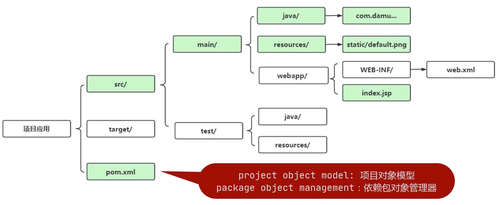
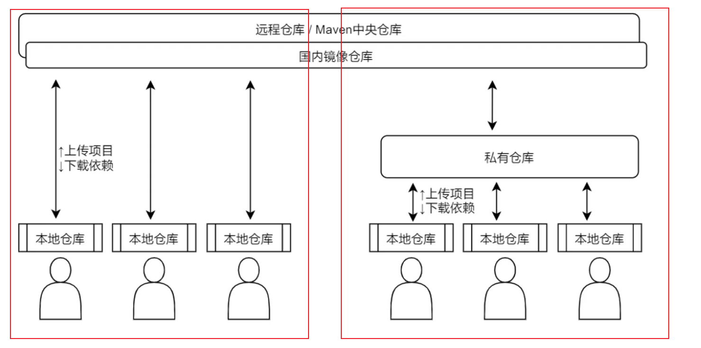

- 基础知识
	- maven项目的一般结构
	  collapsed:: true
		- 结构图
		  
	- 基础组件：仓库-Repository
	  collapsed:: true
		- 仓库的类型
		  collapsed:: true
			- 远程仓库/中央仓库
			- 本地仓库
			- 私有服务器
		- 远程参考和私有服务器的使用
		  collapsed:: true
			- 示例图片
			  
			- 常规项目
			- 企业项目
		- 本地仓库和中央参考的配置
		  collapsed:: true
			- 示例图片
			  
	- DependencyManagement标签的使用
	  collapsed:: true
		- 作用
		  collapsed:: true
			- 使用`DependencyManagement`可以统一管理项目的版本号，确保应用的各个项目的依赖和版本一致，不用每个模块项目都弄一个版本号，不利于管理，当需要变更版本号的时候只需要在父类容器里更新，不需要任何一个子项目的修改；
			- 如果某个子项目需要另外一个特殊的版本号时，只需要在自己的模块`Dependencies`中声明一个版本号即可。子类就会使用子类声明的版本号，不继承于父类版本号。
		- 与Dependencies的区别
		  collapsed:: true
			- `Dependencies`相对于`DependencyManagement`，所有生命在`Dependencies`里的依赖都会自动引入，并默认被所有的子项目继承。
			- `DependencyManagement`里只是声明依赖，并不自动实现引入，因此子项目需要显式的声明需要用的依赖。如果不在子项目中声明依赖，是不会从父项目中继承下来的；只有在子项目中写了该依赖项，并且没有指定具体版本，才会从父项目中继承该项，并且`version`和`scope`都读取自父pom；另外如果子项目中指定了版本号，那么会使用子项目中指定的jar版本。
		- DependencyManagement坑：依赖传递的包的版本会受DependencyManagement依赖声明版本的影响。
		  collapsed:: true
			- 我今天遇到了一种情况，我的子module中引用了一个mybatis-spring的包，我发现我项目里面真实引入的版本是1.3.1，但是这个依赖是另一个包A依赖传递过来的，在包A的pom里发现mybatis-spring的版本是2.0.5，为他现在的版本却是1.3.1呢？
			  最后我发现，我在父级pom中引用的一个type为`pom`的pom依赖中，发现他声明的mybatis-spring的版本是1.3.1。因为这里声明的1.3.1的版本号将包A的依赖给覆盖了，导致我最后引用的版本号就是1.3.1。解决方法也很简单，我直接在父级pom的`DependencyManagement`添加如下依赖：
			            ```xml
			  <dependency>
			    <groupId>org.mybatis</groupId>
			    <artifactId>mybatis-spring</artifactId>
			    <version>2.0.5</version>
			  </dependency>
			  ```
	- scope的值为`import`
	  collapsed:: true
		- `<scope>import</scope>` 只能用在 `DependencyManagement` 块中
		- ```
		  <dependencyManagement>
		  	<dependencies>
		  		<dependency>
		  			<!-- Import dependency management from Spring Boot -->
		  			<groupId>org.springframework.boot</groupId>
		  			<artifactId>spring-boot-dependencies</artifactId>
		  			<version>2.1.12.RELEASE</version>
		  			<type>pom</type>
		  			<scope>import</scope>
		  		</dependency>
		  	</dependencies>
		  </dependencyManagement>
		  ```
		- 以上面这段配置来做说明，它将 `spring-boot-dependencies`  中 `DependencyManagement` 下的 `Dependencies` 插入到当前工程的 `DependencyManagement` 中，所以不存在依赖传递。
		- 当没有 `<scope>import</scope>` 时，意思是将 `spring-boot-dependencies`  的 `Dependencies` 全部插入到当前工程的 `Dependencies` 中，并且会依赖传递。
	- 指定jdk编译版本号
	  collapsed:: true
		- 参见如下代码
		  ```xml
		  <build>
		    <plugins>
		      <plugin>
		        <groupId>org.apache.maven.plugins</groupId>
		        <artifactId>maven-compiler-plugin</artifactId>
		        <version>3.10.1</version>
		        <configuration>
		          <source>11</source>
		          <target>11</target>
		        </configuration>
		      </plugin>
		    </plugins>
		  </build>
		  ```
	- 打包Spring Boot项目
	  collapsed:: true
		- 在maven添加spring-boot-maven-plugin依赖
		- 使用`mvn -Dmaven.test.skip=true clean package spring-boot:repackage`进行打包
	- maven中snapshot快照库和release发布库的区别和作用
	  collapsed:: true
		- 快照版本
		  collapsed:: true
			- 定义一个组件/模块为**快照版本**，只需要在pom文件中在该模块的版本号后加上**-SNAPSHOT**即可(注意这里必须是大写)。
			- snapshot一般是开发过程中的迭代版本，snapshot更新后，引用的项目可以不修改版本号自动下载构建。
		- 发布版本
		  collapsed:: true
			- release版本不允许修改，每次进行release版本修改，发布新的版本必须提升版本号。
		- 参考文章
		  collapsed:: true
			- [maven中snapshot快照库和release发布库的区别和作用](https://www.cnblogs.com/panchanggui/p/12110186.html)
	- maven项目中引用本地的jar
	  collapsed:: true
		- 第一步：在引用本地包的module的pom中加入依赖：
		  
		    ```xml
		    <dependency>
		        <groupId>com.hikvision.ga</groupId>
		        <artifactId>artemis-http-client</artifactId>
		        <version>1.1.8</version>
		        <systemPath>${basedir}/libs/artemis-http-client-1.1.8.jar</systemPath>
		        <scope>system</scope>
		    </dependency>
		    ```
		- 第二步：将本地jar打入package中：
		    我这边其实还有另一种场景，就是我的A module中引入了本地的jar，但是我的B module又依赖A module，真正需要部署的时候只需要启动B module的jar，所以只需要在A module中加入第一步的配置，将下面的配置加到B module中就行。
		    ```xml
		    <plugin>
		    	<groupId>org.springframework.boot</groupId>
		    	<artifactId>spring-boot-maven-plugin</artifactId>
		    	<configuration>
		    	    <includeSystemScope>true</includeSystemScope>
		    	</configuration>
		    </plugin>
		    ```
	- Maven配置
		- 配置maven3的环境变量
		  collapsed:: true
			- 直接将bin目录配置到系统变量的`path`中即可，不用配MAVEN_HOME。
		- 全局配置：`setting.xml`
		  collapsed:: true
			- `localRespository`
			  collapsed:: true
				- 作用：用于配置本地仓库。
			- `interactiveMode`
			  collapsed:: true
				- 作用：用于配置是否需要和用户交互，默认为ture，一般不做修改。
			- `usePluginRegistry`
			  collapsed:: true
				- 作用：maven是否需要使用`plugin-registry.xml`文件来管理插件版本。如果需要让maven使用文件`~/.m2/plugin-registry.xml`来管理插件版本，则设为`true`。默认为`false`。一般我们会将插件的声明写到pom里，所以一般不做配置。
			- `offline`
			  collapsed:: true
				- 作用：表示maven是否需要在离线模式下运行。如果构建系统需要在离线模式下运行，则为`true`，默认为`false`。当由于网络设置原因或者安全因素，构建服务器不能连接远程仓库的时候，该配置就十分有用。
			- `pluginGroups`
			  collapsed:: true
				- 作用：当插件的组织id（groupId）没有显式提供时，供搜寻插件组织Id（groupId）的列表。一般不做配置。
			- `servers`
			  collapsed:: true
				- 作用：一般，仓库的下载和部署是在pom.xml文件中的`repositories`和`distributionManagement`元素中定义的。然而，一般类似用户名、密码（**有些仓库访问是需要安全认证的**）等信息不应该在pom.xml文件中配置，这些信息可以配置在`settings.xml`中。
			- `mirrors`
			  collapsed:: true
				- 作用：为仓库列表配置的下载镜像列表。
			- `proxies`
			  collapsed:: true
				- 作用：用来配置连接仓库的代理。
			- `profiles`
			  collapsed:: true
				- 作用：根据环境参数来调整构建配置的列表。
				- 内容
				  collapsed:: true
					- `settings.xml`中的`profile`元素是`pom.xml`中`profile`元素的**裁剪版本**。
					- 它包含了`id`、`activation`、`repositories`、`pluginRepositories`和 `properties`元素。这里的profile元素只包含这五个子元素是因为这里只关心构建系统这个整体（这正是settings.xml文件的角色定位），而非单独的项目对象模型设置。如果一个`settings.xml`中的`profile`被激活，它的值会覆盖任何其它定义在`pom.xml`中带有相同id的`profile`。
			- `activeProfiles`
			  collapsed:: true
				- 作用：手动激活profiles的列表，按照`profile`被应用的顺序定义`activeProfile`。
				- 内容：该元素包含了一组`activeProfile`元素，每个`activeProfile`都含有一个profile id。任何在`activeProfile`中定义的profile id，不论环境设置如何，其对应的 `profile`都会被激活。如果没有匹配的`profile`，则什么都不会发生。
			- `activation`
			  collapsed:: true
				- 作用：自动触发`profile`的条件逻辑。
				- 内容：如`pom.xml`中的`profile`一样，`profile`的作用在于它能够在某些特定的环境中自动使用某些特定的值；这些环境通过`activation`元素指定。
				  `activation`元素并不是激活`profile`的唯一方式。`settings.xml`文件中的`activeProfile`元素可以包含`profile`的`id`。`profile`也可以通过在命令行，使用-P标记和逗号分隔的列表来显式的激活（如，-P test）。
			- `properties`
			  collapsed:: true
				- 作用：声明变量。
			- `repositories`
			  collapsed:: true
				- 作用：远程仓库列表，它是maven用来填充构建系统本地仓库所使用的一组远程仓库。
			- `pluginRepositories`
			  collapsed:: true
				- 作用：发现插件的远程仓库列表。
				- 内容：
				  collapsed:: true
					- 和`repository`类似，只是`repository`是管理jar包依赖的仓库，`pluginRepositories`则是管理插件的仓库。
					- maven插件是一种特殊类型的构件。由于这个原因，插件仓库独立于其它仓库。`pluginRepositories`元素的结构和`repositories`元素的结构类似。每个`pluginRepository`元素指定一个Maven可以用来寻找新插件的远程地址。
			- 常用的全局配置
			  collapsed:: true
				- 配置JDK版本的全局配置
				  collapsed:: true
					- 代码
					  ```xml
					  <profiles>
					    <profile>
					        <id>jdk1.8</id>
					        <activation>
					            <activeByDefault>true</activeByDefault>
					            <jdk>1.8</jdk>
					        </activation>
					        <properties>
					            <maven.compiler.source>1.8</maven.compiler.source>
					            <maven.compiler.target>1.8</maven.compiler.target>
					            <maven.compiler.compilerVersion>1.8</maven.compiler.compilerVersion>
					            <maven.compiler.encoding>utf-8</maven.compiler.encoding>
					        </properties>
					    </profile>
					  </profiles>
					  ```
					- 参考文章
					  collapsed:: true
						- [maven设置全局和局部jdk版本](https://www.cnblogs.com/cookiewu/p/10547586.html)
			- 参考文章
			  collapsed:: true
				- [maven全局配置文件settings.xml详解](https://www.cnblogs.com/jingmoxukong/p/6050172.html)
		- 用户配置：`setting.xmlnote`
		  collapsed:: true
			- 基本不用
		- 项目配置：`pom.xml`
		  collapsed:: true
			- 项目基础信息配置
			  collapsed:: true
				- 代码
				  ```xml
				  <parent>  
				      <!--被继承的父项目的构件标识符 -->  
				      <artifactId />  
				      <!--被继承的父项目的全球唯一标识符 -->  
				      <groupId />  
				      <!--被继承的父项目的版本 -->  
				      <version />  
				      <!--父项目的pom.xml文件的相对路径。相对路径允许你选择一个不同的路径。默认值是../pom.xml。Maven首先在构建当前项目的地方寻找父项目的pom，其次在文件系统的这个位置（relativePath位置），然后在本地仓库，最后在远程仓库寻找父项目的pom。 -->  
				      <relativePath />  
				  </parent>  
				  <!--声明项目描述符遵循哪一个POM模型版本。模型本身的版本很少改变，虽然如此，但它仍然是必不可少的，这是为了当Maven引入了新的特性或者其他模型变更的时候，确保稳定性。 -->  
				  <modelVersion>4.0.0</modelVersion>  
				  <!--项目的全球唯一标识符，通常使用全限定的包名区分该项目和其他项目。并且构建时生成的路径也是由此生成， 如com.mycompany.app生成的相对路径为：/com/mycompany/app -->  
				  <groupId>asia.banseon</groupId>  
				  <!--构件的标识符，它和group ID一起唯一标识一个构件。换句话说，你不能有两个不同的项目拥有同样的artifact ID和groupID；在某个特定的group   
				      ID下，artifact ID也必须是唯一的。构件是项目产生的或使用的一个东西，Maven为项目产生的构件包括：JARs，源码，二进制发布和WARs等。 -->  
				  <artifactId>banseon-maven2</artifactId>  
				  <!--项目产生的构件类型，例如jar、war、ear、pom。插件可以创建他们自己的构件类型，所以前面列的不是全部构件类型 -->  
				  <packaging>jar</packaging>  
				  <!--项目当前版本，格式为:主版本.次版本.增量版本-限定版本号 -->  
				  <version>1.0-SNAPSHOT</version>  
				  <!--项目的名称, Maven产生的文档用 -->  
				  <name>banseon-maven</name>  
				  <!--项目主页的URL, Maven产生的文档用 -->  
				  <url>http://www.baidu.com/banseon</url>  
				  <!--项目的详细描述, Maven 产生的文档用。 当这个元素能够用HTML格式描述时（例如，CDATA中的文本会被解析器忽略，就可以包含HTML标签），   
				      不鼓励使用纯文本描述。如果你需要修改产生的web站点的索引页面，你应该修改你自己的索引页文件，而不是调整这里的文档。 -->  
				  <description>A maven project to study maven.</description> 
				  <!--项目创建年份，4位数字。当产生版权信息时需要使用这个值。 -->  
				  <inceptionYear />  
				  <!--项目相关邮件列表信息 -->  
				  <mailingLists>  
				      <!--该元素描述了项目相关的所有邮件列表。自动产生的网站引用这些信息。 -->  
				      <mailingList>  
				          <!--邮件的名称 -->  
				          <name>Demo</name>  
				          <!--发送邮件的地址或链接，如果是邮件地址，创建文档时，mailto: 链接会被自动创建 -->  
				          <post>Demo@126.com</post>  
				          <!--订阅邮件的地址或链接，如果是邮件地址，创建文档时，mailto: 链接会被自动创建 -->  
				          <subscribe>Demo@126.com</subscribe>  
				          <!--取消订阅邮件的地址或链接，如果是邮件地址，创建文档时，mailto: 链接会被自动创建 -->  
				          <unsubscribe>Demo@126.com</unsubscribe>  
				          <!--你可以浏览邮件信息的URL -->  
				          <archive>http://localhost:8080/demo/dev/</archive>  
				      </mailingList>  
				  </mailingLists>  
				  <!--项目开发者列表 -->  
				  <developers>  
				      <!--某个项目开发者的信息 -->  
				      <developer>  
				          <!--SCM里项目开发者的唯一标识符 -->  
				          <id>HELLO WORLD</id>  
				          <!--项目开发者的全名 -->  
				          <name>youname</name>  
				          <!--项目开发者的email -->  
				          <email>youname@qq.com</email>  
				          <!--项目开发者的主页的URL -->  
				          <url />  
				          <!--项目开发者在项目中扮演的角色，角色元素描述了各种角色 -->  
				          <roles>  
				              <role>Project Manager</role>  
				              <role>Architect</role>  
				          </roles>  
				          <!--项目开发者所属组织 -->  
				          <organization>demo</organization>  
				          <!--项目开发者所属组织的URL -->  
				          <organizationUrl>http://www.xxx.com/</organizationUrl>  
				          <!--项目开发者属性，如即时消息如何处理等 -->  
				          <properties>  
				              <dept>No</dept>  
				          </properties>  
				          <!--项目开发者所在时区， -11到12范围内的整数。 -->  
				          <timezone>+8</timezone>  
				      </developer>  
				  </developers>  
				  <!--项目的其他贡献者列表 -->  
				  <contributors>  
				      <!--项目的其他贡献者。参见developers/developer元素 -->  
				      <contributor>  
				          <name />  
				          <email />  
				          <url />  
				          <organization />  
				          <organizationUrl />  
				          <roles />  
				          <timezone />  
				          <properties />  
				      </contributor>  
				  </contributors>  
				  <!--该元素描述了项目所有License列表。 应该只列出该项目的license列表，不要列出依赖项目的 license列表。如果列出多个license，用户可以选择它们中的一个而不是接受所有license。 -->  
				  <licenses>  
				      <!--描述了项目的license，用于生成项目的web站点的license页面，其他一些报表和validation也会用到该元素。 -->  
				      <license>  
				          <!--license用于法律上的名称 -->  
				          <name>Apache 2</name>  
				          <!--官方的license正文页面的URL -->  
				          <url>http://www.xxxx.com/LICENSE-2.0.txt</url>  
				          <!--项目分发的主要方式： repo，可以从Maven库下载 manual， 用户必须手动下载和安装依赖 -->  
				          <distribution>repo</distribution>  
				          <!--关于license的补充信息 -->  
				          <comments>A business-friendly OSS license</comments>  
				      </license>  
				  </licenses>  
				  <!--SCM(Source Control Management)标签允许你配置你的代码库，供Maven web站点和其它插件使用。 -->  
				  <scm>  
				      <!--SCM的URL,该URL描述了版本库和如何连接到版本库。欲知详情，请看SCMs提供的URL格式和列表。该连接只读。 -->  
				      <connection>  
				          scm:svn:http://svn.xxxx.com/maven/xxxxx-maven2-trunk(dao-trunk)     
				      </connection>  
				      <!--给开发者使用的，类似connection元素。即该连接不仅仅只读 -->  
				      <developerConnection>  
				          scm:svn:http://svn.xxxx.com/maven/dao-trunk     
				      </developerConnection>  
				      <!--当前代码的标签，在开发阶段默认为HEAD -->  
				      <tag />  
				      <!--指向项目的可浏览SCM库（例如ViewVC或者Fisheye）的URL。 -->  
				      <url>http://svn.xxxxx.com/</url>  
				  </scm>  
				  <!--描述项目所属组织的各种属性。Maven产生的文档用 -->  
				  <organization>  
				      <!--组织的全名 -->  
				      <name>demo</name>  
				      <!--组织主页的URL -->  
				      <url>http://www.xxxxxx.com/</url>  
				  </organization>  
				  ```
			- 项目构建环境配置
				- maven配置打包文件的名称，如下：
				   ```xml
				   <build>
				     <!-- 打包名称 使用配置文件名称 -->
				     <finalName>${project.artifactId}</finalName>
				   </build>
				   ```
				- 代码
				  ```xml
				  <!--描述了这个项目构建环境中的前提条件。 -->  
				  <prerequisites>  
				      <!--构建该项目或使用该插件所需要的Maven的最低版本 -->  
				      <maven />  
				  </prerequisites>  
				  <!--项目的问题管理系统(Bugzilla, Jira, Scarab,或任何你喜欢的问题管理系统)的名称和URL，本例为 jira -->  
				  <issueManagement>  
				      <!--问题管理系统（例如jira）的名字， -->  
				      <system>jira</system>  
				      <!--该项目使用的问题管理系统的URL -->  
				      <url>http://jira.xxxx.com/xxxx</url>  
				  </issueManagement>  
				  <!--项目持续集成信息 -->  
				  <ciManagement>  
				      <!--持续集成系统的名字，例如continuum -->  
				      <system />  
				      <!--该项目使用的持续集成系统的URL（如果持续集成系统有web接口的话）。 -->  
				      <url />  
				      <!--构建完成时，需要通知的开发者/用户的配置项。包括被通知者信息和通知条件（错误，失败，成功，警告） -->  
				      <notifiers>  
				          <!--配置一种方式，当构建中断时，以该方式通知用户/开发者 -->  
				          <notifier>  
				              <!--传送通知的途径 -->  
				              <type />  
				              <!--发生错误时是否通知 -->  
				              <sendOnError />  
				              <!--构建失败时是否通知 -->  
				              <sendOnFailure />  
				              <!--构建成功时是否通知 -->  
				              <sendOnSuccess />  
				              <!--发生警告时是否通知 -->  
				              <sendOnWarning />  
				              <!--不赞成使用。通知发送到哪里 -->  
				              <address />  
				              <!--扩展配置项 -->  
				              <configuration />  
				          </notifier>  
				      </notifiers>  
				  </ciManagement>  
				  <!--模块（有时称作子项目） 被构建成项目的一部分。列出的每个模块元素是指向该模块的目录的相对路径 -->  
				  <modules />  
				  <!--构建项目需要的信息 --> 
				  <build>  
				      <!--该元素设置了项目源码目录，当构建项目的时候，构建系统会编译目录里的源码。该路径是相对于pom.xml的相对路径。 -->  
				      <sourceDirectory />  
				      <!--该元素设置了项目脚本源码目录，该目录和源码目录不同：绝大多数情况下，该目录下的内容 会被拷贝到输出目录(因为脚本是被解释的，而不是被编译的)。 -->  
				      <scriptSourceDirectory />  
				      <!--该元素设置了项目单元测试使用的源码目录，当测试项目的时候，构建系统会编译目录里的源码。该路径是相对于pom.xml的相对路径。 -->  
				      <testSourceDirectory />  
				      <!--被编译过的应用程序class文件存放的目录。 -->  
				      <outputDirectory />  
				      <!--被编译过的测试class文件存放的目录。 -->  
				      <testOutputDirectory />  
				      <!--使用来自该项目的一系列构建扩展 -->  
				      <extensions>  
				          <!--描述使用到的构建扩展。 -->  
				          <extension>  
				              <!--构建扩展的groupId -->  
				              <groupId />  
				              <!--构建扩展的artifactId -->  
				              <artifactId />  
				              <!--构建扩展的版本 -->  
				              <version />  
				          </extension>  
				      </extensions>  
				      <!--当项目没有规定目标（Maven2 叫做阶段）时的默认值 -->  
				      <defaultGoal />  
				      <!--这个元素描述了项目相关的所有资源路径列表，例如和项目相关的属性文件，这些资源被包含在最终的打包文件里。 -->  
				      <resources>  
				          <!--这个元素描述了项目相关或测试相关的所有资源路径 -->  
				          <resource>  
				              <!--描述了资源的目标路径。该路径相对target/classes目录（例如${project.build.outputDirectory}）。举个例子，如果你想资源在特定的包里(org.apache.maven.messages)，你就必须该元素设置为org/apache/maven/messages。然而，如果你只是想把资源放到源码目录结构里，就不需要该配置。 -->  
				              <targetPath />  
				              <!--是否使用参数值代替参数名。参数值取自properties元素或者文件里配置的属性，文件在filters元素里列出。 -->  
				              <filtering />  
				              <!--描述存放资源的目录，该路径相对POM路径 -->  
				              <directory />  
				              <!--包含的模式列表，例如**/*.xml. -->  
				              <includes />  
				              <!--排除的模式列表，例如**/*.xml -->  
				              <excludes />  
				          </resource>  
				      </resources>  
				      <!--这个元素描述了单元测试相关的所有资源路径，例如和单元测试相关的属性文件。 -->  
				      <testResources>  
				          <!--这个元素描述了测试相关的所有资源路径，参见build/resources/resource元素的说明 -->  
				          <testResource>  
				              <targetPath />  
				              <filtering />  
				              <directory />  
				              <includes />  
				              <excludes />  
				          </testResource>  
				      </testResources>  
				      <!--构建产生的所有文件存放的目录 -->  
				      <directory />  
				      <!--产生的构件的文件名，默认值是${artifactId}-${version}。 -->  
				      <finalName />  
				      <!--当filtering开关打开时，使用到的过滤器属性文件列表 -->  
				      <filters />  
				      <!--子项目可以引用的默认插件信息。该插件配置项直到被引用时才会被解析或绑定到生命周期。给定插件的任何本地配置都会覆盖这里的配置 -->  
				      <pluginManagement>  
				          <!--使用的插件列表 。 -->  
				          <plugins>  
				              <!--plugin元素包含描述插件所需要的信息。 -->  
				              <plugin>  
				                  <!--插件在仓库里的group ID -->  
				                  <groupId />  
				                  <!--插件在仓库里的artifact ID -->  
				                  <artifactId />  
				                  <!--被使用的插件的版本（或版本范围） -->  
				                  <version />  
				                  <!--是否从该插件下载Maven扩展（例如打包和类型处理器），由于性能原因，只有在真需要下载时，该元素才被设置成enabled。 -->  
				                  <extensions />  
				                  <!--在构建生命周期中执行一组目标的配置。每个目标可能有不同的配置。 -->  
				                  <executions>  
				                      <!--execution元素包含了插件执行需要的信息 -->  
				                      <execution>  
				                          <!--执行目标的标识符，用于标识构建过程中的目标，或者匹配继承过程中需要合并的执行目标 -->  
				                          <id />  
				                          <!--绑定了目标的构建生命周期阶段，如果省略，目标会被绑定到源数据里配置的默认阶段 -->  
				                          <phase />  
				                          <!--配置的执行目标 -->  
				                          <goals />  
				                          <!--配置是否被传播到子POM -->  
				                          <inherited />  
				                          <!--作为DOM对象的配置 -->  
				                          <configuration />  
				                      </execution>  
				                  </executions>  
				                  <!--项目引入插件所需要的额外依赖 -->  
				                  <dependencies>  
				                      <!--参见dependencies/dependency元素 -->  
				                      <dependency>......</dependency>  
				                  </dependencies>  
				                  <!--任何配置是否被传播到子项目 -->  
				                  <inherited />  
				                  <!--作为DOM对象的配置 -->  
				                  <configuration />  
				              </plugin>  
				          </plugins>  
				      </pluginManagement>  
				      <!--使用的插件列表 -->  
				      <plugins>  
				          <!--参见build/pluginManagement/plugins/plugin元素 -->  
				          <plugin>  
				              <groupId />  
				              <artifactId />  
				              <version />  
				              <extensions />  
				              <executions>  
				                  <execution>  
				                      <id />  
				                      <phase />  
				                      <goals />  
				                      <inherited />  
				                      <configuration />  
				                  </execution>  
				              </executions>  
				              <dependencies>  
				                  <!--参见dependencies/dependency元素 -->  
				                  <dependency>......</dependency>  
				              </dependencies>  
				              <goals />  
				              <inherited />  
				              <configuration />  
				          </plugin>  
				      </plugins>  
				  </build>  
				  <!--在列的项目构建profile，如果被激活，会修改构建处理 -->  
				  <profiles>  
				      <!--根据环境参数或命令行参数激活某个构建处理 -->  
				      <profile>  
				          <!--构建配置的唯一标识符。即用于命令行激活，也用于在继承时合并具有相同标识符的profile。 -->  
				          <id />  
				          <!--自动触发profile的条件逻辑。Activation是profile的开启钥匙。profile的力量来自于它 能够在某些特定的环境中自动使用某些特定的值；这些环境通过activation元素指定。activation元素并不是激活profile的唯一方式。 -->  
				          <activation>  
				              <!--profile默认是否激活的标志 -->  
				              <activeByDefault />  
				              <!--当匹配的jdk被检测到，profile被激活。例如，1.4激活JDK1.4，1.4.0_2，而!1.4激活所有版本不是以1.4开头的JDK。 -->  
				              <jdk />  
				              <!--当匹配的操作系统属性被检测到，profile被激活。os元素可以定义一些操作系统相关的属性。 -->  
				              <os>  
				                  <!--激活profile的操作系统的名字 -->  
				                  <name>Windows XP</name>  
				                  <!--激活profile的操作系统所属家族(如 'windows') -->  
				                  <family>Windows</family>  
				                  <!--激活profile的操作系统体系结构 -->  
				                  <arch>x64</arch>  
				                  <!--激活profile的操作系统版本 -->  
				                  <version>6.1.7100</version>  
				              </os>  
				              <!--如果Maven检测到某一个属性（其值可以在POM中通过${名称}引用），其拥有对应的名称和值，Profile就会被激活。如果值 字段是空的，那么存在属性名称字段就会激活profile，否则按区分大小写方式匹配属性值字段 -->  
				              <property>  
				                  <!--激活profile的属性的名称 -->  
				                  <name>mavenVersion</name>  
				                  <!--激活profile的属性的值 -->  
				                  <value>2.0.3</value>  
				              </property>  
				              <!--提供一个文件名，通过检测该文件的存在或不存在来激活profile。missing检查文件是否存在，如果不存在则激活 profile。另一方面，exists则会检查文件是否存在，如果存在则激活profile。 -->  
				              <file>  
				                  <!--如果指定的文件存在，则激活profile。 -->  
				                  <exists>/usr/local/xxxx/xxxx-home/tomcat/maven-guide-zh-to-production/workspace/  
				                  </exists>  
				                  <!--如果指定的文件不存在，则激活profile。 -->  
				                  <missing>/usr/local/xxxx/xxxx-home/tomcat/maven-guide-zh-to-production/workspace/  
				                  </missing>  
				              </file>  
				          </activation>  
				          <!--构建项目所需要的信息。参见build元素 -->  
				          <build>  
				              <defaultGoal />  
				              <resources>  
				                  <resource>  
				                      <targetPath />  
				                      <filtering />  
				                      <directory />  
				                      <includes />  
				                      <excludes />  
				                  </resource>  
				              </resources>  
				              <testResources>  
				                  <testResource>  
				                      <targetPath />  
				                      <filtering />  
				                      <directory />  
				                      <includes />  
				                      <excludes />  
				                  </testResource>  
				              </testResources>  
				              <directory />  
				              <finalName />  
				              <filters />  
				              <pluginManagement>  
				                  <plugins>  
				                      <!--参见build/pluginManagement/plugins/plugin元素 -->  
				                      <plugin>  
				                          <groupId />  
				                          <artifactId />  
				                          <version />  
				                          <extensions />  
				                          <executions>  
				                              <execution>  
				                                  <id />  
				                                  <phase />  
				                                  <goals />  
				                                  <inherited />  
				                                  <configuration />  
				                              </execution>  
				                          </executions>  
				                          <dependencies>  
				                              <!--参见dependencies/dependency元素 -->  
				                              <dependency>......</dependency>  
				                          </dependencies>  
				                          <goals />  
				                          <inherited />  
				                          <configuration />  
				                      </plugin>  
				                  </plugins>  
				              </pluginManagement>  
				              <plugins>  
				                  <!--参见build/pluginManagement/plugins/plugin元素 -->  
				                  <plugin>  
				                      <groupId />  
				                      <artifactId />  
				                      <version />  
				                      <extensions />  
				                      <executions>  
				                          <execution>  
				                              <id />  
				                              <phase />  
				                              <goals />  
				                              <inherited />  
				                              <configuration />  
				                          </execution>  
				                      </executions>  
				                      <dependencies>  
				                          <!--参见dependencies/dependency元素 -->  
				                          <dependency>......</dependency>  
				                      </dependencies>  
				                      <goals />  
				                      <inherited />  
				                      <configuration />  
				                  </plugin>  
				              </plugins>  
				          </build>  
				          <!--模块（有时称作子项目） 被构建成项目的一部分。列出的每个模块元素是指向该模块的目录的相对路径 -->  
				          <modules />  
				          <!--发现依赖和扩展的远程仓库列表。 -->  
				          <repositories>  
				              <!--参见repositories/repository元素 -->  
				              <repository>  
				                  <releases>  
				                      <enabled />  
				                      <updatePolicy />  
				                      <checksumPolicy />  
				                  </releases>  
				                  <snapshots>  
				                      <enabled />  
				                      <updatePolicy />  
				                      <checksumPolicy />  
				                  </snapshots>  
				                  <id />  
				                  <name />  
				                  <url />  
				                  <layout />  
				              </repository>  
				          </repositories>  
				          <!--发现插件的远程仓库列表，这些插件用于构建和报表 -->  
				          <pluginRepositories>  
				              <!--包含需要连接到远程插件仓库的信息.参见repositories/repository元素 -->  
				              <pluginRepository>  
				                  <releases>  
				                      <enabled />  
				                      <updatePolicy />  
				                      <checksumPolicy />  
				                  </releases>  
				                  <snapshots>  
				                      <enabled />  
				                      <updatePolicy />  
				                      <checksumPolicy />  
				                  </snapshots>  
				                  <id />  
				                  <name />  
				                  <url />  
				                  <layout />  
				              </pluginRepository>  
				          </pluginRepositories>  
				          <!--该元素描述了项目相关的所有依赖。 这些依赖组成了项目构建过程中的一个个环节。它们自动从项目定义的仓库中下载。要获取更多信息，请看项目依赖机制。 -->  
				          <dependencies>  
				              <!--参见dependencies/dependency元素 -->  
				              <dependency>......</dependency>  
				          </dependencies>  
				          <!--不赞成使用. 现在Maven忽略该元素. -->  
				          <reports />  
				          <!--该元素包括使用报表插件产生报表的规范。当用户执行“mvn site”，这些报表就会运行。 在页面导航栏能看到所有报表的链接。参见reporting元素 -->  
				          <reporting>......</reporting>  
				          <!--参见dependencyManagement元素 -->  
				          <dependencyManagement>  
				              <dependencies>  
				                  <!--参见dependencies/dependency元素 -->  
				                  <dependency>......</dependency>  
				              </dependencies>  
				          </dependencyManagement>  
				          <!--参见distributionManagement元素 -->  
				          <distributionManagement>......</distributionManagement>  
				          <!--参见properties元素 -->  
				          <properties />  
				      </profile>  
				  </profiles>  
				  ```
			- 项目仓库管理配置
			  collapsed:: true
				- 代码
				  ```xml
				  <!--发现依赖和扩展的远程仓库列表。 -->  
				  <repositories>  
				      <!--包含需要连接到远程仓库的信息 -->  
				      <repository>  
				          <!--如何处理远程仓库里发布版本的下载 -->  
				          <releases>  
				              <!--true或者false表示该仓库是否为下载某种类型构件（发布版，快照版）开启。 -->  
				              <enabled />  
				              <!--该元素指定更新发生的频率。Maven会比较本地POM和远程POM的时间戳。这里的选项是：always（一直），daily（默认，每日），interval：X（这里X是以分钟为单位的时间间隔），或者never（从不）。 -->  
				              <updatePolicy />  
				              <!--当Maven验证构件校验文件失败时该怎么做：ignore（忽略），fail（失败），或者warn（警告）。 -->  
				              <checksumPolicy />  
				          </releases>  
				          <!--如何处理远程仓库里快照版本的下载。有了releases和snapshots这两组配置，POM就可以在每个单独的仓库中，为每种类型的构件采取不同的策略。例如，可能有人会决定只为开发目的开启对快照版本下载的支持。参见repositories/repository/releases元素 -->  
				          <snapshots>  
				              <enabled />  
				              <updatePolicy />  
				              <checksumPolicy />  
				          </snapshots>  
				          <!--远程仓库唯一标识符。可以用来匹配在settings.xml文件里配置的远程仓库 -->  
				          <id>banseon-repository-proxy</id>  
				          <!--远程仓库名称 -->  
				          <name>banseon-repository-proxy</name>  
				          <!--远程仓库URL，按protocol://hostname/path形式 -->  
				          <url>http://10.10.10.123:8080/repository/</url>  
				          <!--用于定位和排序构件的仓库布局类型-可以是default（默认）或者legacy（遗留）。Maven 2为其仓库提供了一个默认的布局；然而，Maven   
				              1.x有一种不同的布局。我们可以使用该元素指定布局是default（默认）还是legacy（遗留）。 -->  
				          <layout>default</layout>  
				      </repository>  
				  </repositories>  
				  
				  <!--发现插件的远程仓库列表，这些插件用于构建和报表 -->  
				  <pluginRepositories>  
				      <!--包含需要连接到远程插件仓库的信息.参见repositories/repository元素 -->  
				      <pluginRepository>......</pluginRepository>  
				  </pluginRepositories> 
				  ```
			- 项目依赖管理配置
			  collapsed:: true
				- 代码
				  ```xml
				  <!--继承自该项目的所有子项目的默认依赖信息。这部分的依赖信息不会被立即解析,而是当子项目声明一个依赖（必须描述group ID和artifact   
				      ID信息），如果group ID和artifact ID以外的一些信息没有描述，则通过group ID和artifact ID匹配到这里的依赖，并使用这里的依赖信息。 -->  
				  <dependencyManagement>  
				      <dependencies>  
				          <!--参见dependencies/dependency元素 -->  
				          <dependency>......</dependency>  
				      </dependencies>  
				  </dependencyManagement>
				  <!--该元素描述了项目相关的所有依赖。 这些依赖组成了项目构建过程中的一个个环节。它们自动从项目定义的仓库中下载。要获取更多信息，请看项目依赖机制。 -->  
				  <dependencies>  
				      <dependency>  
				          <!--依赖的group ID -->  
				          <groupId>org.apache.maven</groupId>  
				          <!--依赖的artifact ID -->  
				          <artifactId>maven-artifact</artifactId>  
				          <!--依赖的版本号。 在Maven 2里, 也可以配置成版本号的范围。 -->  
				          <version>3.8.1</version>  
				          <!--依赖类型，默认类型是jar。它通常表示依赖的文件的扩展名，但也有例外。一个类型可以被映射成另外一个扩展名或分类器。类型经常和使用的打包方式对应，尽管这也有例外。一些类型的例子：jar，war，ejb-client和test-jar。如果设置extensions为   
				              true，就可以在plugin里定义新的类型。所以前面的类型的例子不完整。 -->  
				          <type>jar</type>  
				          <!--依赖的分类器。分类器可以区分属于同一个POM，但不同构建方式的构件。分类器名被附加到文件名的版本号后面。例如，如果你想要构建两个单独的构件成JAR，一个使用Java   
				              1.4编译器，另一个使用Java 6编译器，你就可以使用分类器来生成两个单独的JAR构件。 -->  
				          <classifier></classifier>  
				          <!--依赖范围。在项目发布过程中，帮助决定哪些构件被包括进来。欲知详情请参考依赖机制。 
				  			- compile ：默认范围，用于编译 
				  			- provided：类似于编译，但支持你期待jdk或者容器提供，类似于classpath   
				              - runtime: 在执行时需要使用 
				  			- test: 用于test任务时使用 
				  			- system: 需要外在提供相应的元素。通过systemPath来取得   
				              - systemPath: 仅用于范围为system。提供相应的路径 
				  			- optional: 当项目自身被依赖时，标注依赖是否传递。用于连续依赖时使用 -->  
				          <scope>test</scope>  
				          <!--仅供system范围使用。注意，不鼓励使用这个元素，并且在新的版本中该元素可能被覆盖掉。该元素为依赖规定了文件系统上的路径。需要绝对路径而不是相对路径。推荐使用属性匹配绝对路径，例如${java.home}。 -->  
				          <systemPath></systemPath>  
				          <!--当计算传递依赖时， 从依赖构件列表里，列出被排除的依赖构件集。即告诉maven你只依赖指定的项目，不依赖项目的依赖。此元素主要用于解决版本冲突问题 -->  
				          <exclusions>  
				              <exclusion>  
				                  <artifactId>spring-core</artifactId>  
				                  <groupId>org.springframework</groupId>  
				              </exclusion>  
				          </exclusions>  
				          <!--可选依赖，如果你在项目B中把C依赖声明为可选，你就需要在依赖于B的项目（例如项目A）中显式的引用对C的依赖。可选依赖阻断依赖的传递性。 -->  
				          <optional>true</optional>  
				      </dependency>  
				  </dependencies>  
				  
				  ```
			- 项目报表信息配置
			  collapsed:: true
				- 代码
				  ```xml
				  <!--以值替代名称，Properties可以在整个POM中使用，也可以作为触发条件（见settings.xml配置文件里activation元素的说明）。格式是<name>value</name>。 -->  
				  <properties />  
				  <!--不赞成使用. 现在Maven忽略该元素. -->  
				  <reports></reports>  
				  <!--该元素描述使用报表插件产生报表的规范。当用户执行“mvn site”，这些报表就会运行。 在页面导航栏能看到所有报表的链接。 -->  
				  <reporting>  
				      <!--true，则，网站不包括默认的报表。这包括“项目信息”菜单中的报表。 -->  
				      <excludeDefaults />  
				      <!--所有产生的报表存放到哪里。默认值是${project.build.directory}/site。 -->  
				      <outputDirectory />  
				      <!--使用的报表插件和他们的配置。 -->  
				      <plugins>  
				          <!--plugin元素包含描述报表插件需要的信息 -->  
				          <plugin>  
				              <!--报表插件在仓库里的group ID -->  
				              <groupId />  
				              <!--报表插件在仓库里的artifact ID -->  
				              <artifactId />  
				              <!--被使用的报表插件的版本（或版本范围） -->  
				              <version />  
				              <!--任何配置是否被传播到子项目 -->  
				              <inherited />  
				              <!--报表插件的配置 -->  
				              <configuration />  
				              <!--一组报表的多重规范，每个规范可能有不同的配置。一个规范（报表集）对应一个执行目标 。例如，有1，2，3，4，5，6，7，8，9个报表。1，2，5构成A报表集，对应一个执行目标。2，5，8构成B报表集，对应另一个执行目标 -->  
				              <reportSets>  
				                  <!--表示报表的一个集合，以及产生该集合的配置 -->  
				                  <reportSet>  
				                      <!--报表集合的唯一标识符，POM继承时用到 -->  
				                      <id />  
				                      <!--产生报表集合时，被使用的报表的配置 -->  
				                      <configuration />  
				                      <!--配置是否被继承到子POMs -->  
				                      <inherited />  
				                      <!--这个集合里使用到哪些报表 -->  
				                      <reports />  
				                  </reportSet>  
				              </reportSets>  
				          </plugin>  
				      </plugins>  
				  </reporting>  
				  ```
			- 项目部署分发配置
			  collapsed:: true
				- 代码
				  ```xml
				  <!--项目分发信息，在执行mvn deploy后表示要发布的位置。有了这些信息就可以把网站部署到远程服务器或者把构件部署到远程仓库。 -->  
				  <distributionManagement>  
				      <!--部署项目产生的构件到远程仓库需要的信息 -->  
				      <repository>  
				          <!--是分配给快照一个唯一的版本号（由时间戳和构建流水号）？还是每次都使用相同的版本号？参见repositories/repository元素 -->  
				          <uniqueVersion />  
				          <id>xxx-maven2</id>  
				          <name>xxx maven2</name>  
				          <url>file://${basedir}/target/deploy</url>  
				          <layout />  
				      </repository>  
				      <!--构件的快照部署到哪里？如果没有配置该元素，默认部署到repository元素配置的仓库，参见distributionManagement/repository元素 -->  
				      <snapshotRepository>  
				          <uniqueVersion />  
				          <id>xxx-maven2</id>  
				          <name>xxx-maven2 Snapshot Repository</name>  
				          <url>scp://svn.xxxx.com/xxx:/usr/local/maven-snapshot</url>  
				          <layout />  
				      </snapshotRepository>  
				      <!--部署项目的网站需要的信息 -->  
				      <site>  
				          <!--部署位置的唯一标识符，用来匹配站点和settings.xml文件里的配置 -->  
				          <id>banseon-site</id>  
				          <!--部署位置的名称 -->  
				          <name>business api website</name>  
				          <!--部署位置的URL，按protocol://hostname/path形式 -->  
				          <url>  
				              scp://svn.baidu.com/xxx:/var/www/localhost/web     
				          </url>  
				      </site>  
				      <!--项目下载页面的URL。如果没有该元素，用户应该参考主页。使用该元素的原因是：帮助定位那些不在仓库里的构件（由于license限制）。 -->  
				      <downloadUrl />  
				      <!--如果构件有了新的group ID和artifact ID（构件移到了新的位置），这里列出构件的重定位信息。 -->  
				      <relocation>  
				          <!--构件新的group ID -->  
				          <groupId />  
				          <!--构件新的artifact ID -->  
				          <artifactId />  
				          <!--构件新的版本号 -->  
				          <version />  
				          <!--显示给用户的，关于移动的额外信息，例如原因。 -->  
				          <message />  
				      </relocation>  
				      <!--给出该构件在远程仓库的状态。不得在本地项目中设置该元素，因为这是工具自动更新的。有效的值有：none（默认），converted（仓库管理员从Maven   
				          1 POM转换过来），partner（直接从伙伴Maven 2仓库同步过来），deployed（从Maven 2实例部署），verified（被核实时正确的和最终的）。 -->  
				      <status />  
				  </distributionManagement> 
				  ```
	- Maven的gav坐标
	  collapsed:: true
		- gav坐标
		  collapsed:: true
			- groupId：项目ID，当前项目和其他项目的唯一标志，也就是公司域名。
			- artifactId：组件ID，当前项目中的子应用或者子组件的唯一标志，也就是项目名。
			- version：版本号，迭代开发时标志的产品版本信息。
		- 版本号的含义
		  collapsed:: true
			- 格式：软件名称.主版本号.小版本号.阶段版本号.字母版本号
			- 主版本号：表示软件重大功能新增和修改
			- 小版本号：也称为子版本号，表示小功能新增和修改
			- 阶段版本号：表示bug修复
			- 字母版本号：表示里程碑版本
			  collapsed:: true
				- ALPHA：表示软件正在开发，为内测版本
				- BETA：表示已经实现了基本功能，消除了严重的错误，为公测版本
				- RC：表示候选版本，项目已基本完成，即将发行。
				- Stable：表示正在发行的稳定版本。
				- RELEASE/R/GA：也表示正在发行的稳定版本。
				- FINAL：表示最终版本，也是正式版本的一直表示方式。
	- Maven命令操作
	  collapsed:: true
		- 项目构建命令
			- `mvn --version`：查看maven的版本。
			- `mvn archetype:generate`：使用项目模板创建项目。
		- 项目清理/编译/打包
			- `mvn clean`：清理target目录下的编译文件和数据。
			- `mvn compile`：编译java代码，将编译后的代码放到target目录下。
			- `mvn package`：将项目打成jar或是war。
		- 项目运行/测试/发布
			- `mvn tomcat:run`：使用tomcat插件运行web应用程序
			- `mvn test`：运行test目录下的测试代码，并生成测试报告。
			- `mvn site`：生成项目的文档。
			- `mvn verify`：`verify` 阶段的主要目的是验证构建的完整性。它确保所有的构建步骤都已正确执行，并且生成的包是可用的。
			- `mvn dependency:tree`：查看项目的依赖。
			- `mvn install`：将项目打包并发布到本地仓库中。
			- `mvn deploy`：将项目打包并发布到远程仓库中。
	- Maven的生命周期
	  collapsed:: true
		- maven的生命周期本质上是描述项目的构建过程。
		- Maven三个标准的生命周期
		  collapsed:: true
			- clean lifecycle
			  collapsed:: true
				- 描述项目构建之前的清理环节。
			- default lifecycle
			  collapsed:: true
				- 描述项目编译和打包环节。
			- site lifecycle
			  collapsed:: true
				- 描述项目项目报告、站点信息、发布环节。
		- 文档： [Maven生命周期](https://maven.apache.org/guides/introduction/introduction-to-the-lifecycle.html#Lifecycle_Reference)
	- 手动构建Maven项目
	  collapsed:: true
		- Maven规定的目录结构
		  
		- 构建步骤
		  collapsed:: true
			- 1.按照上述目录在资源管理器中新建相应的文件夹。
			- 2.在项目的一级目录中新建pom.xml文件，添加的文本内容如下：
			  ```
			  <project xmlns="http://maven.apache.org/POM/4.0.0" xmlns:xsi="http://www.w3.org/2001/XMLSchema-instance"
			           xsi:schemaLocation="http://maven.apache.org/POM/4.0.0 http://maven.apache.org/xsd/maven-4.0.0.xsd">
			      <modelVersion>4.0.0</modelVersion>
			  
			      <groupId>cn.bravedawn</groupId>
			      <artifactId>example</artifactId>
			      <version>1.0-SNAPSHOT</version>
			      <packaging>jar</packaging>
			      
			      <dependencies>
			      	<dependency>
			          	<groupId>junit<groupId>
			          	<artifactId>junit<artifactId>
			          	<version>4.11</version>
			          </dependency>
			      	
			          <dependency>
			          	<groupId>log4j<groupId>
			          	<artifactId>log4j<artifactId>
			          	<version>1.2.17</version>
			          </dependency>
			      </dependencies>
			      
			  </project>
			  ```
			- 3.执行`mvn clean`命令对项目进行清理。
			- 4.执行`mvn compile`命令对项目进行编译。
			- 5.执行`mvn package`命令对项目进行打包。
			- 6.执行`mvn exec:java -Dexec.mainClass="cn.bravedawn.HelloWorld"`命令运行项目。
	- mvn命令构建Maven项目
	  collapsed:: true
		- 使用mvn提供的初始化命令（3.0.5之后的版本）
		  ```
		  mvn archetype:generate
		  -DgroupID="cn.bravedawn"
		  -DartifactId="app"
		  -DpackageName="cn.bravedawn"
		  -DArchetypeArtifactId=maven-archetype-quickstart/maven-archetype-webapp
		  -DinteractiveMode=false
		  ```
		- 下面我对上面的命令进行一个简单的解析
		  collapsed:: true
			- `-DpackageName="cn.bravedawn"`：指定新建后的包名。
			- `-DArchetypeArtifactId`：指定使用的maven项目模板。一个是普通maven项目，一个是web项目。
			- `-DinteractiveMode`：是否在交互模式中，若没有指定`-DArchetypeArtifactId`的参数的前提下，`true`的情况下，会在提示你输入模版名称；`false`的情况下，默认会使用`maven-archetype-quickstart`作为默认的模板。
- 插件
	- maven内建的插件
	  collapsed:: true
		- [maven内建插件](https://maven.apache.org/plugins/index.html)
	- spring-boot-maven-plugin
	  collapsed:: true
		- 作用
			- maven项目的pom.xml中，添加了*org.springframework.boot:spring-boot-maven-plugin*插件，当运行`mvn package`进行打包时，会打包成一个可以直接运行的 JAR 文件，使用“Java -jar”命令就可以直接运行。
			- spring-boot-maven-plugin插件，在很大程度上简化了应用的部署，只需要安装了 JRE 就可以运行。
		- 配置项目运行的主类
			- `<mainClass>${start-class}</mainClass>`
		- 参考文章
			- [spring-boot-maven-plugin插件的作用](https://www.cnblogs.com/acm-bingzi/p/mavenspringbootplugin.html)
	- maven-compiler-plugin
	  collapsed:: true
		- 背景
			- `maven`是个项目管理工具，如果我们不告诉它我们的代码要使用什么样的`jdk`版本编译的话，它就会用`maven-compiler-plugin`默认的`jdk`版本来进行处理，这样就容易出现版本不匹配，以至于可能导致编译不通过的问题。
		- 作用
			- 使用`maven-compiler-plugin`插件可以指定项目源码的`jdk`版本，编译后的`jdk`版本，以及`编码`。
		- 参考文章
			- [Maven 教程（21）— maven-compiler-plugin 插件详解](https://blog.csdn.net/liupeifeng3514/article/details/80236077)
	- flatten-maven-plugin
	  collapsed:: true
		- 使用场景：适合父子项目时使用
		- 配置
		  collapsed:: true
			- **FlattenMode=resolveCiFriendliesOnly**，设置该属性表示flatten只`${revision}`, `${sha1}` and/or `${changelist}`这个几个占位符。
			- **updatePomFile=true**，插件默认只会处理`packaging`属性为非`pom`的，如果要处理`packaging`为`pom`的，可将本属性值设置为`true`。
		- 使用
		  collapsed:: true
			- [单一项目](https://www.mojohaus.org/flatten-maven-plugin/examples/example-simple-project.html)
			  collapsed:: true
				- 使用场景：单一项目（不建议使用该插件）
				- 在pom文件的properties属性中声明依赖项的版本值，然后执行install或是deploy进行打包。然后项目中会生成.flattened-pom.xml文件，在这个文件中可以看到，flatten将properties属性值替换到原本版本依赖项版本的属性占位符。
			- [中心项目](https://www.mojohaus.org/flatten-maven-plugin/examples/example-central-version.html)
			  collapsed:: true
				- 使用场景：子父级项目，子项目会使用其他子项目作为依赖性
				- 在父级项目的properties属性中声明依赖版本值
				- 在子项目中可以使用父级项目properties属性声明的版本值去替换自己pom文件中依赖项版本的属性占位符。
			- [多个项目](https://www.mojohaus.org/flatten-maven-plugin/examples/example-multiple-versions.html)
			  collapsed:: true
				- 使用场景：子父级项目，子项目会使用其他子项目作为依赖项
				- 在父级项目的父级项目中声明依赖版本的属性值，然后在dependencyManagement中声明依赖项，并在依赖项的version中使用属性值的占位符进行声明。
				- 在子项目中，子项目可以直接使用其他子项目作为依赖项且不需要声明依赖版本。
			- 针对浦惠到家这种项目
			  collapsed:: true
				- esm-parent，设置一个版本号revision，打包的时候他的子module也设置这个占位符进行版本控制
				- 像支付服务这种
		- 官网： [flatten-maven-plugin](https://www.mojohaus.org/flatten-maven-plugin)
		- 参考文章
		  collapsed:: true
			- https://zhuanlan.zhihu.com/p/270574226
			- https://www.cnblogs.com/jonath/p/7729903.html
	- maven-failsafe-plugin
	  collapsed:: true
		- 功能：用来执行集成测试的。
	- maven-surefire-plugin
		- 功能：用来执行单元测试的。
	- maven-install-plugin
		- 功能：用于将项目安装到本地仓库中，以便其他项目可以依赖它。
		- 参考文章
	- maven-jar-plugin
		- 功能：将maven工程打成 jar 包。
		- 参考文章
			- [maven-jar-plugin插件](https://blog.csdn.net/qq_40708942/article/details/124579623)
	- exec-maven-plugin
	  collapsed:: true
		- 功能
		  collapsed:: true
			- 提供了在 Maven 构建过程中执行外部命令的功能，常用于在构建过程中执行一些自定义脚本或命令行工具。
			- 如果你想在maven生命周期内，运行一段java代码，或者一段独立的程序，或者说我们所指的预执行，初始化某些值，生成某些不能预先生成的文件。
	- tomcat7-maven-plugin
	  collapsed:: true
		- 可以使用maven命令的方式运行tomcat。
- mvn命令
  collapsed:: true
	- `-U`：强制更新releases、snapshots类型的插件或依赖库(否则maven一天只会更新一次snapshot依赖)。
	- `--setting`：有些时候打包的时候需要指定Maven settings.xml（譬如从内部Nexus 私服获取依赖）。
	- 参考文章
	  collapsed:: true
		- [Maven常用参数说明](https://www.jianshu.com/p/25aff2bf6e56)
- 常见问题
	- 创建Maven项目，挂死在构建项目环境报`Generating project in Batch mode`
	  collapsed:: true
		- 原因是：国内防火墙阻止或延缓了访问在国外的Maven仓库。
	- IDEA maven只有lifecycle，没有Dependencies和Plugins的问题
		- 解决方法：[IDEA maven只有lifecycle，没有Dependencies和Plugins的问题](https://blog.csdn.net/m0_53570322/article/details/125786255)