- 《Spring4.x企业级应用开发实战》
  collapsed:: true
	- 第一章 Spring概述
	  collapsed:: true
		- Spring的体系结构
		  collapsed:: true
			- IoC
				- IoC容器
					- 用配置的方式对类的依赖关系进行描述
					- IoC容器负责依赖类之间的创建、拼接、管理和获取等工作
					- BeanFactory是Spring框架的核心接口
				- Context模块
					- ApplicationContext是Context模块的核心接口
			- AOP
				- 提供了AOP Alliance规范的实现
				- 整合了AspectJ框架
				- JDK5.0提供了引入了java.lang.instrument，允许JVM在启动的时候启用一个代理类，通过代理类可以在运行期修改类的字节码，改变一个类的功能，从而实现AOP的功能。
			- 数据访问和集成
				- 不同数据形式可以采用不同的数据访问方式，比如JDBC、MyBatis或Hibernate
				- Spring建立了与数据形式和数据访问方式无关的统一的DAO层，将数据访问的检查型异常转换为了非检查异常，提供了统一的异常体系
				- 借助AOP技术，提供了声明式事务的功能
			- Web及远程操作
				- Spring提供了Web应用的各种工具类
				- Spring提供了类似于Struts的MVC框架
			- WebSocket
		- Spring对Java版本的要求
			- 推荐使用Java8.0，最低Java6.0
		- Spring的新特性
			- 全面支持Java8
				- [jarjar工具](https://code.google.com/archive/p/jarjar/)
					- 我的理解是可以将原本的以jar包形式引用的代码，直接将其代码编译到自己的项目中，无需再引用这个jar。
				- Java8的Lambda表达式
				- Java8的时间和日期API
					- 如果我们的Controller需要从请求参数中获取Date、LocalDate或者是LocalDateTime，Spring为我们提供了这样的支持
						- 具体可以参考这篇文章： [Working with Date Parameters in Spring](https://www.baeldung.com/spring-date-parameters)
				- 重复注解的支持
					- Spring4.0只支持@Scheduled和@PropertySource可以重复定义
				- 空指针终结者：`Optional<>`
					- 在Spring4.0中使用Optional<>的两个场景
						- 一是使用@Autowired注入对象的时候
						  ```java
						  // 原来
						  @Autowired(required=false)
						  private UserDao userDao;
						  
						  // 现在
						  
						  @Autowired
						  private Optional<UserDao> userDao;
						  ```
						- 二是在定义Controller请求参数的时候，定义某些参数是可选的
						  ```java
						  // 原来
						  @RequestMapping("/hello")
						  public User getUser(String id,  @RequestParam(required=false) String username)
						  
						  
						  // 现在
						  @RequestMapping("/hello")
						  public User getUser(String id, Optional<String> username)
						  ```
	- 第二章 快速入门
	  collapsed:: true
		- 领域对象模型的实体类可以分为以下四种
			- VO（View Object）：表示视图层状态对应的对象
			- DTO（Data Transfer Object）：数据传输对象，一般泛指展示层和服务层之间的数据传输对象
			- DO（Domain Object）：领域对象，即业务实体对象
			- PO（Persistent Object）：持久化对象，表示持久层的数据结构（对应数据库表）
		- ModelAndView
			- 即包含视图信息，又包括视图渲染所需的模型数据信息
			- ModelAndView的第一个参数代表视图的逻辑名，第二个参数代表数据模型名称，第三个参数代表数据模型对象。其中数据模型对象将以数据模型名称为参数名放置到request的属性中：`request.setAttribute(name, value)`
	- 第三章 Spring Boot
	  collapsed:: true
		- 安装配置
			- 基于Maven环境配置
				- 简化依赖的版本管理方式
					- 继承Spring Boot提供的根默认配置依赖`spring-boot-starter-parent`
					- 如果不想继承，则可以选择导入Spring Boot提供的根配置，即`spring-boot-dependencies`
				- 引入spring-boot-maven-plugin，简化Spring Boot项目的打包部署
			- 基于Gradle环境配置
			- 基于Spring Boot CLI环境配置
			- 代码包结构规划
				- 包规划
					- dao：放置数据库操作的代码
					- domain：领域对象
					- service：具体的代码逻辑
					- web：Controller放置的位置
					- `Application.java`：应用主类，在类上需要标注`@SpringBootApplication`注解，并在main方法中通过`SpringApplication.run()`方法启动即可。
		- 持久层
			- 操作数据库的方式
				- 一通过Spring内置的轻量级的JdbcTemplate，可以直接在pom文件中添加`spring-boot-starter-jdbc`
				- 二使用第三方持久化框架Hibernate或Mybatis，使用Hibernate可以直接在pom文件中添加`spring-boot-starter-date-jpa`，使用Mybatis可以直接在pom文件添加`mybatis-spring-boot-starter`
				- 除了上面的依赖外，我们还要添加数据库的驱动依赖，比如MySQL的`mysql-connector-java`
			- Spring Boot中数据库的配置方式
				- 一通过自定义连接的方式，这种方式我们需要做以下三步
					- 1.配置数据库连接信息
					- 2.指定自定义连接池，常见的数据库连接池
						- DBCP
						- C3P0
						- HairkCP
						- Druid
					- 3.配置连接池配置信息
				- 二通过JNDI的方式
			- 初始化数据库脚本
				- 在Spring启动的时候，初始化预先配置的DDL或DML语句
			- 持久层涉及到的注解
				- `@Repository`
		- 业务层
			- 业务层两个重要的步骤
				- 一编写正确的业务逻辑
				- 二对业务代码中事务的管控，这里有两种配置方式
					- 第一种，在类Application上添加`@EnableTransactionManagement`注解，然后在Service方法上添加`@Transational`注解，这个方法就会被事物增强；如果在Service类级别上添加`@Transational`注解，那当前Service类的所有方法都将得到事务增强。
					- 第二种，自定义事务管理器，在类Application上添加`@EnableTransactionManagement`注解，然后在添加自定义的事务管理器txManager()方法，并在方法上标注`@Bean`注解。此时Spring启动会加载自定义的事务管理器，不会重新实例化其他的事务管理器。
			- 分布式事务的支持
				- atomikos
				- bitronix
			- 业务层涉及到的注解
				- `@Service`
		- 展示层
			- 书中的项目采用的jsp，并且采用了JSTL标签
			- 配置Spring MVC框架
			- 基于Spring Boot开发的web项目，在启动时需要通过spring-boot-maven-plugin插件命令来启动应用或者通过Spring Boot命令来运行，否则可能会存在访问视图页面报404的情况
		- 运维支持
			- Spring提供了一个功能完备且可定制的启动器-Actuator，实现对应用本身、数据库等服务健康检查的检测功能。
	- 第四章 Ioc容器
	  collapsed:: true
		- Ioc概念的解释
		  collapsed:: true
			- IOC，Inverse Control，控制反转。
			- 这里我来说下我的理解，在代码开发的时候，原本程序中调用类与实现类的交互调用，使得程序越来越复杂，我们为了实现程序的解耦，原本调用类中对实现类的调用，变成了对其接口的调用，引入了一个中间人的角色，由中间人去维护调用类和实现类的关系，决定具体使用哪个实现类去完成调用逻辑。这个逻辑我们称为依赖注入，另一种对该功能的解释是控制反转。
		- Ioc的类型
		  collapsed:: true
			- 一构造函数注入
			  collapsed:: true
				- 在调用类的构造函数中将接口实现类的对象赋给接口实例，从而实现依赖注入
				- 缺点
				  collapsed:: true
					- 每次创建调用类对象时都要完成对实现类接口实例的注入，在某些场景下我们可能并不需要实现接口的类实例作为构造函数的参数注入进来，无参构造器就行。这样我们每次就多实例化了一个实例，存在资源浪费的情况
				- 代码
				  ```java
				  public class MyClass {
				      // 构造函数注入
				      public MyClass(String dependency1, int dependency2) {
				          this.dependency1 = dependency1;
				          this.dependency2 = dependency2;
				      }
				  }
				  ```
			- 二属性注入
			  collapsed:: true
				- 属性注入是可以有选择的通过Setter方法完成对调用类所需依赖的实现类实例的注入，更加灵活。
				- 代码
				  ```java
				  public class MyClass {
				      // 属性注入
				      @Autowired
				      private String dependency1;
				  
				      @Resource(name = "dependency2")
				      private int dependency2;
				  }
				  ```
			- 三接口注入
			  collapsed:: true
				- 将调用类所有依赖注入的逻辑抽取到一个接口中，调用类通过实现该接口提供相应的注入方法。这种方式与构造函数注入和属性注入区别不大，还新增了一个接口增加了类的数量，不推荐使用。
				- 代码
				  ```java
				  public interface MyInterface {
				      // 接口注入
				      void setDependency1(String dependency1);
				  
				      int getDependency2();
				  }
				  
				  public class MyClass implements MyInterface {
				      // 实现接口的方法，并接受依赖的注入
				      @Override
				      public void setDependency1(String dependency1) {
				          this.dependency1 = dependency1;
				      }
				  
				      @Override
				      public int getDependency2() {
				          return dependency2;
				      }
				  }
				  ```
			- Spring支持**构造函数注入**和**属性注入**。
		- 通过容器完成依赖关系的注入
		  collapsed:: true
			- 从上一节Ioc的类型中我们看到，我们虽然实现了调用类和实现类的解耦，但是在调用类的代码中仍然存在实现类接口的代码，要想将实现类接口的代码也剔除的话，我们就需要一个三方的容器来去维护和管理两个类之间的依赖关系，Spring Ioc容器就是为此而生的。
			- Spring Ioc容器的实现依赖于Java反射。
		- Java相关的知识点
		  collapsed:: true
			- 类加载器ClassLoader
			- Java反射相关知识
		- 资源访问
		  collapsed:: true
			- Spring提供的Resource接口，提供了更强大的底层资源访问的能力
			  collapsed:: true
				- [使用Resource](https://www.liaoxuefeng.com/wiki/1252599548343744/1282383017934882)
				- [Access a File from the Classpath in a Spring Application](https://www.baeldung.com/spring-classpath-file-access)
			- 资源加载
			  collapsed:: true
				- Resource接口
				  collapsed:: true
					- 继承图
					  
					- 整理一下上面的几个接口
					  collapsed:: true
						- `WritableResource`：可写资源接口。
						- `ByteArrayResource`：二进制数组表示的资源。
						- `ClassPathResource`：类路径下的资源，资源以相对于类路径的方式表示。
						- `FileSystemResource`：文件系统资源，资源以文件系统路径的方式表示。
						- `InputStreamResource`：以输入流返回表示的资源。
						- `ServletContextResource`：可以访问以相对于Web应用根目录的路径加载资源。
						- `UrlResource`：可以访问通过URL表示的资源（Web服务器和FTP服务器）。
						- `PathResource`
						  collapsed:: true
							- Spring4.x提供的读取文件的新类。
							- Path封装了`java.net.URL`，`java.nio.file.Path`、文件系统提供的资源。
							- 可以访问通过URL、Path和文件路径表示的资源。
						- `EncodedResource`：如果资源文件使用了特殊的编码格式，可以通过这个类对资源进行编码处理，保证资源内容操作的正确性。
				- 资源地址表达式
				  collapsed:: true
					- `classpath:`和`classpath*:`的区别
					  collapsed:: true
						- `classpath:com/smart/module*.xml`只会加载**一个**模块的配置文件。
						- `classpath*:com/smart/module*.xml`会加载com/smart目录下**所有的**以mudule开头的xml文件。
					- 支持的地址前缀
					  collapsed:: true
						- `classpath:`：从类路径中加载，后面跟类的绝对地址。
						- `file:`：使用`UrlResource`从文件系统中加载资源，可以是绝对地址或相对地址。
						- `http://`：使用`UrlResource`从文件系统中加载资源。
						- `ftp://`：使用`UrlResource`从FTP服务器加载资源。
						- `没有前缀`：根据`ApplicationContext`的具体实现类采用对应类型的`Resource`。
					- 支持Ant风格带通配符的资源地址，支持以下三种通配符
					  collapsed:: true
						- `?`：匹配文件名中的一个字符
						- `*`：匹配文件名中的任意字符
						- `**`：匹配多层路径
				- 资源加载器
				  collapsed:: true
					- 资源加载器类的接口和实现类
					  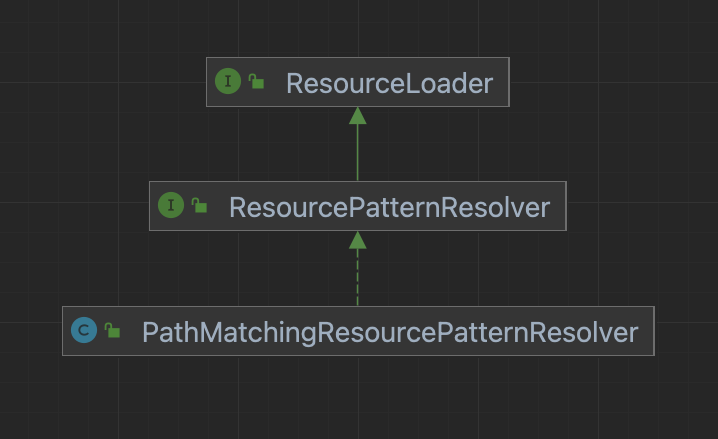
					- `ResourceLoader`接口，仅支持带资源类型前缀的表达式，不支持Ant风格的资源路径表达式。
					- `ResourcePatternResolver`，扩展了`ResourceLoader`接口，支持带资源类型前缀的表达式和Ant风格的资源路径表达式。
					- `PathMatchingResourcePatternResolver`，是Spring提供的标准实现类。
					- 注意点：在项目中使用`Resource`接口的`getFile()`获取工程内的文件，且该项目会被打成jar包，会报`FileNotFoundException`，应该使用`Resource#getInputStream()`方法去做。
		- BeanFactory、ApplicationContext和WebApplicationContext
			- BeanFactory
			  collapsed:: true
				- 功能
					- 一般称BeanFactory为Ioc容器
					- BeanFactory是类的通用工厂，可以创建并管理各种类对象，Spring称这些被创建和管理的Java对象为Bean。
					- BeanFactory是Spring最核心的接口，他提供了高级的Ioc配置机制。
					- BeanFactory是Spring框架的基础设施，面向Spring本身。
				- BeanFactory的类体系结构
				  collapsed:: true
					- Spring为BeanFactory提供了多种实现，建议使用XmlBeanDefinitionReader、DefaultListableBeanFactory进行Spring Ioc容器的启动。
					- BeanFactory的重要方法是getBean(String beanName)，该方法用于从容器中返回特定名称的Bean。
					- `ListableBeanFactory`：该接口定义了访问容器中Bean基本信息的若干方法。
					- `HierarchicalBeanFactory`：父子级联Ioc容器的接口，子容器可以通过该接口访问父容器。
					- `ConfiguraleBeanFactory`：增强了Ioc容器的可定制性。
					- `AutowireCapableBeanFactory`：定义了将容器中的Bean按照某种规则进行自动装配的方法。
					- `singletonBeanRegistry`：定义了在运行期向容器注册单实例Bean的方法。
					- `BeanDefinitionRegistry`：提供了向容器手工注册BeanDefinition对象的方法。
			- ApplicationContext
				- 功能
				  collapsed:: true
					- 一般称Application为**Spring容器**
					- `ApplicationContext`是面向使用Spring的开发者，几乎所有的场合可以直接使用`ApplicationContext`而不是`BeanFactory`。
					- `ApplictionContext`是建立在`BeanFactory`之上的，提供了更多面向应用的功能。
				- 与`BeanFactory`的重大区别
					- `BeanFacotry`在初始化容器的时候，并未实例化Bean，直到第一次访问某个Bean时才实例化目标Bean。因此第一次访问这个Bean时会消耗过多的时间。
					- Application在初始化应用上下文时就实例化所有的单实例的bean，`ApplicationContext`的初始化时间比`BeanFactory`的时间会长一点，但是第一次访问Bean就会很快。
				- ApplicationContext的初始化
					- `ClassPathXmlApplicationContext`，若配置文件在类路径下，使用这个类初始化ApplicationContext。
					- `FileSystemXmlApplicationContext`，若配置文件在文件系统的路径下，使用这个类初始化ApplicationContext。
					- `ClassPathXmlApplicationContext`与`FileSystemXmlApplicationContext`的区别在于在不显示声明资源类型前缀的情况下，他两分别会将路径解析为类路径和文件系统路径。
				- Spring支持基于注解的配置方式
				  collapsed:: true
					- 这部分功能主要由JavaConfig这个项目来负责实现。
					- Spring为注解类的配置提供了`ApplicationContext`的实现类：`AnnotationConfigApplicationContext`。
				- Spring4.0支持使用Groovy DSL来进行Bean定义的配置
				  collapsed:: true
					- 因为Groovy可以提供更复杂的Bean逻辑配置。
					- Spring专门为此提供了`ApplicationContext`的实现类：`GenericGroovyApplicationContext`。
				- ApplicationContext的类体系结构
				  collapsed:: true
					- `ApplicationEventPublisher`：让容器具有发布应用上下文事件的功能。
					- `MessageSource`：为程序提供i18n国际化消息访问的功能。
					- `ResourcePatternResolver`：可以通过带前缀的Ant风格的资源文件路径装载Spring的配置文件。
					- `LifeCycle`：主要用于控制异步处理过程。
				- 参考文章
				  collapsed:: true
					- [The Spring ApplicationContext](https://www.baeldung.com/spring-application-context)
			- WebApplicationContext
			  collapsed:: true
				- 功能
				  collapsed:: true
					- WebApplicationContext是专门为web程序服务的，他允许相对于Web根目录的路径中装载文件完成初始化工作。
				- WebApplicationContext的类体系结构
				  collapsed:: true
					- WebApplicationContext作为属性放置在ServletContext中，Spring提供了`WebApplicationContextUtils`工具类，可以通过该类的`getWebApplicationContext(ServletContext sc)`方法，从`ServletContext`中获取`WebApplicationContext`实例。
					- 在非web应用的环境下，Bean只有`singleton`和`prototype`两种作用域，WebApplicationContext提供了三个新的作用域：`request`、`session`、`global session`。
					- `ConfigurableWebApplicationContext`扩展了`WebApplicationContext`，允许我们通过配置化的方式实例化`WebApplicationContext`。
				- WebApplicationContext的初始化
				  collapsed:: true
					- 与`BeanFactory`、`ApplicationContext`不同的是：`WebApplicationContext`的初始化需要**`ServletContext`实例**，也就是说他必须在拥有**Web容器**的前提下才能完成启动工作。
					- 可以在web.xml配置**自启动的Servlet（已废除）**或**定义Web容器监听器**（`ServletContextListener`），来完成`WebApplicationContext`的初始化，启动Web容器并自动装配ApplicationContext的配置信息。
					- 书上讲了好几个版本的配置，
					  collapsed:: true
						- 1.配置Spring容器的配置文件位置，通过ContextLoaderListener来启动web容器，加载bean资源。
						- 2.通过Web容器监听器启动Web容器，配置Spring `@Configuration`的注解方式配置bean资源，加载bean资源。
						- 3.通过Web容器监听器启动Web容器，配置Spring Groovy DSL配置的bean资源，加载bean资源。
			- 父子容器
			  collapsed:: true
				- 通过之前在介绍`BeanFactory`的时候我们讲到了`HierarchicalBeanFactory`接口，Spring的Ioc容器可以建立父子层级关系的容器体系，子容器可以访问父容器中的Bean，但父容器不能访问子容器中的Bean。
				- 在Spring中父子容器实现了很多功能，在Spring MVC中，展示层的Bean位于一个子容器中，而业务层和持久层位于父容器中，这样展示层可以引用业务层和持久层的Bean，而业务层和持久层的Bean则看不到展示层的Bean。
		- Bean的生命周期
			- `BeanFactory`中Bean的生命周期
				- 生命周期图
				  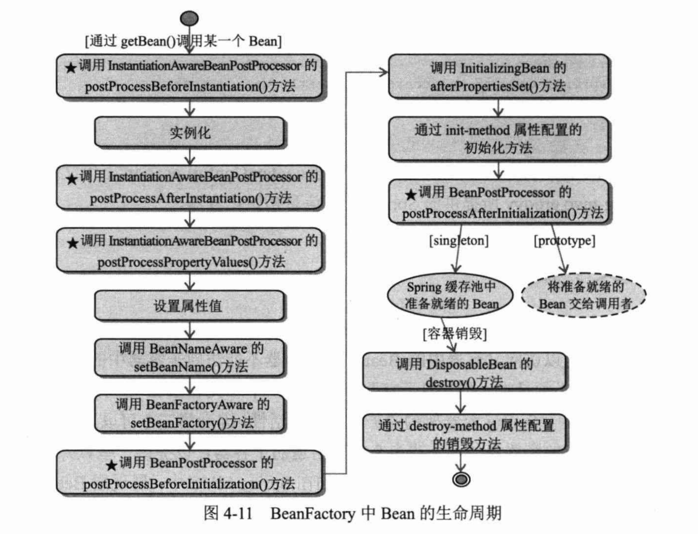
				- 生命周期分类分析，划分为4类
				  collapsed:: true
					- Bean自身的方法
					  collapsed:: true
						- 调用Bean构造函数，实例化Bean
						- 调用Setter方法设置Bean的属性
						- 通过`<bean>`的`init-method`和`destory-method`所指定的方法
					- Bean生命周期接口方法，下面的这些接口由Bean类自己直接实现
					  collapsed:: true
						- `BeanNameAware.setBeanName()`：将配置文件中该Bean的名称设置到Bean中。
						- `BeanFactoryAware.setBeanFactory()`：将BeanFactory容器实例设置到Bean中。
						- `InitializingBean.afterPropertiesSet()`：这个方法在设置了所有Bean属性后才执行初始化逻辑。
						- `DisposableBeandestroy()`：当容器关闭时，将调用该方法，可以在这里编写释放资源、记录日志等操作。
					- 容器级生命周期接口方法，由如下两个接口实现，他们的实现类被称为"**后置处理器**"
					  collapsed:: true
						- `InstantiationAwareBeanPostProcessor`接口
						  collapsed:: true
							- `postProcessBeforeInstantiation()`：在实例化之前调用
							- `postProcessAfterInstantiation()`：在实例化之后调用
							- `postProcessPropertyValues()`：在为Bean设置属性值之前调用
							- 注意：`InstantiationAwareBeanPostProcessor`其实是`BeanPostProcessor`的子接口，我们一般使用他的适配器类`InstantiationAwareBeanPostProcessorAdapter`进行扩展。
						- `BeanPostProcessor`接口
						  collapsed:: true
							- `postProcessBeforeInitialization()`：该方法在 Bean 的初始化方法（如构造函数或init-method）被调用之前执行。可以在这个方法中对 Bean 对象进行修改或添加额外的逻辑。
							- `postProcessAfterInitialization()`：该方法在 Bean 的初始化方法执行之后调用。可以在这个方法中对已经初始化的 Bean 对象进行修改。
							- `BeanPostProcessor`接口十分重要，Spring容器提供的AOP和动态代理等功能都是通过它进行实施的。
						- 值得注意的点
						  collapsed:: true
							- `InitDestroyAnnotationBeanPostProcessor`类
							  collapsed:: true
								- 用于对加了`@PostConstruct`、`@PreDestory`注解的Bean进行处理
						- 后处理器的特点
						  collapsed:: true
							- 他们独立于Bean，他们的实现类以容器附加的形式注册到Spring容器中，并通过反射被Spring容器扫描识别。
							- 后处理器是作用范围是**全局性的（容器级的）**
							- 用户可以通过编写后处理器对特定的Bean进行加工处理
							- 可以定义多个后处理器，只需要同时实现`org.springframework.core.Ordered`接口指定其加载顺序即可。
					- 工厂后置处理器接口方法
					  collapsed:: true
						- 工厂后处理器也是容器级的，在应用上下文装配配置文件之后立即调用。
				- 具体实践：spring-demo/cn/bravedawn/chapter4/beanfactorydemo
			- `ApplicationContext`中Bean的生命周期
				- 生命周期图
				  
				- 相比于BeanFactory中Bean的生命周期的分类，有两处新增的逻辑
				  collapsed:: true
					- Bean生命周期接口方法
					  collapsed:: true
						- 新增了调用`ApplicationContextAware.setApplicationContext()`方法
					- 工厂后置处理器接口方法
					  collapsed:: true
						- 新增了调用`BeanFactoryPostProcessor.postProcessBeanFactory()`方法
							- 发生在应用上下文在装载配置文件之后，在Bean实例化之前调用，用于对配置文件中Bean的信息进行加工处理.
							- 所有的bean定义都已加载，但还没有实例化任何bean。可以**对bean属性进行覆盖或添加操作**。
						- `BeanFactoryPostProcessor`接口
							- `BeanDefinitionRegistryPostProcessor`接口
								- 该接口继承自`BeanFactoryPostProcessor`接口，`BeanDefinitionRegistryPostProcessor.postProcessBeanDefinitionRegistry()`此时我们已经可以访问到所有常规bean定义，但还没有实例化任何bean。可以**在下一个后处理阶段开始之前添加新的bean定义**。
								- 具体实践
								  collapsed:: true
									- 这里讨论了Bean替换的实现，具体参考：spring/spring4.x/chapter4/src/main/java/cn/bravedawn/beanreplace
				- 具体实践：spring-demo/cn/bravedawn/chapter4/applicationbeanfactorydemo
			- `ApplicationContext`与`BeanFactory`的不同之处
				- `ApplicationContext`在Bean生命周期中新增了两处新的调用逻辑
				- `ApplicationContext`可以利用Java反射机制自动识别处配置文件中的`BeanProcessor`、`InstantiationAwareBeanPostProcessor`和`BeanFactoryPostProcesser`，并自动将他们注册到应用上下文中；而后者需要手动调用`addBeanPostPorcessor()`方法进行注册。所以开发中大家普遍使用的是`ApplicationContext`。
			- 参考文章
			  collapsed:: true
				- [Spring - Bean的实例化流程及生命周期](https://blog.csdn.net/weixin_51351637/article/details/131087131)
		- Spring的后置处理器
			- 分类
				- bean工厂后置处理器
				- bean后置处理器
	- 第五章 在Ioc容器中装配Bean
	  collapsed:: true
		- 1.Spring配置概述
		  collapsed:: true
			- Spring容器的高层视图
			  collapsed:: true
				- Bean的配置信息是Bean的元数据信息，由以下四部分组成
				  collapsed:: true
					- Bean的实现类。
					- Bean的属性信息，如数据库连接数、用户名、密码等。
					- Bean的依赖关系，Spring根据依赖关系配置Bean之间的装配。
					- Bean的行为配置，如生命周期范围及生命周期各过程的回调函数等。
				- Spring容器、Bean配置信息、Bean实现类及应用程序四者之间的相互关系，如下图
				  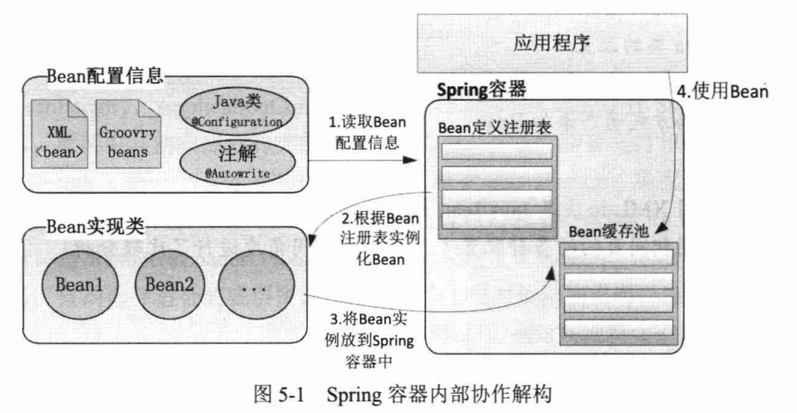{:height 364, :width 686}
			- Spring Bean的配置方式
			  collapsed:: true
				- 基于XML的配置（Spring1.0）
				  collapsed:: true
					- XML DTD
					- XML Schema（XSD，Spring2.0）
				- 基于注解的配置（Spring2.0)
				- 基于Java类的配置（Spring3.0)
				- 基于Groovy动态语言配置（Spring4.0)
				- 参考文章
				  collapsed:: true
					- [Spring中有几种配置方式(xml、注解＜jsr250＞、JavaConfig)](https://blog.csdn.net/m0_45406092/article/details/115203753)
		- 2.Bean的基本配置
		  collapsed:: true
			- Bean的装配
				- xml中bean最基础的配置是`id`和`class`两个属性
				  ```xml
				  <bean id="car" class="cn.bravedawn.chapter4.applicationbeanfactorydemo.Car"/>
				  ```
			- Bean的命名
				- 在配置Bean的时候，我们建议配置id来作为bean的唯一标识，因为如果出现相同name的bean，后定义的bean会覆盖前面定义的bean
		- 3.依赖注入
		  collapsed:: true
			- 属性注入
			  collapsed:: true
				- 定义：属性注入是指通过setXX()方法注入Bean的属性朱或依赖对象。
				- 代码实例：
				  ```xml
				  <bean id="car" class="cn.abc.Car">
				    <property name="maxSpeed"><value>200</value></property>
				    <property name="color"><value>黑色</value></property>
				    <property name="name"><value>奇瑞QQ</value></property>
				  </bean>
				  ```
				- 具体实现：
				  collapsed:: true
					- 属性注入要求Bean提供一个默认的构造函数，并为需要注入的属性提供对应的Setter方法。
					- Spring会先调用bean的构造函数实例化一个bean对象，然后通过反射的方式调用Setter方法注入属性值。
				- 值得注意：**Spring会检查bean的属性值在实现类中是否有对应的Setter方法，并不要求实现类必须有这个属性成员**
				- JavaBean关于属性命名的特殊规范
				  collapsed:: true
					- 一般而言：属性名是小写为xxx，则对应的方法名为setXxx()
					- 考虑到一些特定意义的缩写是大写字母开头的，JavaBean要求：**变量的前两个字母要么全部大写要么全部小写**，也就是说“brand，IDCode，IC”这样的属性名是合法的，但是“iD，iDCard”则是不合法的。
			- 构造函数注入
			  collapsed:: true
				- 定义：构造函数注入是另一种比较常用的注入方式，它保证了一些必要的参数在Bean实例化时就能到的设置，确保Bean实例化后就可以使用。
				- 代码实例
				  collapsed:: true
					- Java部分代码
					  ```java
					  public class Car {
					    
					    private String brand;
					    private double price;
					    
					    public Car(String brand, double price) {
					      this.brand = brand;
					      this.price = price;
					    }
					  }
					  ```
					- XML部分代码
					  ```xml
					  <bean id="car1" class="cn.bravedawn.Car">
					    <constructor-arg type="java.lang.String">
					      <value>红旗A72</value>
					    </constructor-arg>
					    <constructor-arg type="double">
					      <value>20.1</value>
					    </constructor-arg>
					  </bean>
					  ```
				- 相比于属性注入的优点
				  collapsed:: true
					- 属性注入并不保证实现类必须具有属性成员，而构造函数注入则可以在语法级上保证实例化的对象类必须有相应的属性成员。
				- 构造函数注入的四种方式
				  collapsed:: true
					- 一按类型类型入参
					  collapsed:: true
						- 构造函数的每一个入参都是不同类型的，Spring可以通过**入参类型**将不同的属性在实例化时进行赋值。
					- 二索引匹配入参
					  collapsed:: true
						- 如果两个入参的类型相同，通过入参类型Spring并不能准确的进行成员变量的赋值。所以通过为入参设置索引，从而使Spring能够准确的为相同类型的入参进行赋值。
					- 三联合使用类型和索引匹配入参
					  collapsed:: true
						- 若存在两个构造函数，他们的入参数量相同，但是参入的类型却不同，此时Spring就需要结合入参类型和索引去匹配正确的构造函数。
					- 四通过自身类型反射匹配入参
					  collapsed:: true
						- 若入参的类型不是基础数据类型且入参类型各异，Spring可以通过反射获得入参的数据类型，从而匹配正确的构造函数。
				- 循环依赖问题
				  collapsed:: true
					- 问题阐述：Spring在实例化一个Bean的时候要求Bean构造函数入参引用的对象必须已经实例化完成。BeanA的构造函数中有入参BeanB的对象，BeanB的构造函数中有入参BeanA的对象，两个Bean都采用构造函数注入，就会发生类似于线程死锁的循环依赖问题。
					- 解决办法：只需要修改其中一个Bean的注入方式为属性注入就可以解决
			- 工厂方法注入
			  collapsed:: true
				- 定义：可以使用Spring工厂方法注入的方式，对Bean进行实例化。
				- 工厂方法注入的方式
				  collapsed:: true
					- 一非静态工厂方法
					  collapsed:: true
						- 使用场景：若工厂方法是非静态的，必须先实例化工厂类之后才能调用工厂方法。落到具体的实现上面，首先要定义一个工厂类的Bean，然后再通过`factory-bean`和`factory-method`指定工厂实例和对应的工厂方法生成具体的Bean。
					- 二静态工厂方法
					  collapsed:: true
						- 使用场景：若工厂方法是静态的，则无需实例化工厂类就可以调用工厂类方法。落到具体的实现上面，我们无需定义工厂类的Bean，直接在实例Bean上配置`factory-bean`和`factory-method`就行。
		- 4.注入参数详解
		  collapsed:: true
			- 1.字面值
			  collapsed:: true
				- 字面值一般指的就是字符串
				- 字面值可以通过**<value>**元素标签进行注入，在默认情况下，基本数据类型及其封装类、String等类型都可以采用字面值的方式进行注入。Spring内置了**编辑器**可以将字面值转换为相应类型的变量。
				- XMl中有五种特殊字符，分别是`&`，`<`，`>`，`“`，`‘`。使用的时候可以用`<![CDATA[]]>`标签包裹，或者使用这五个字符的转义字符进行表示。
			- 2.引用其他Bean
			  collapsed:: true
				- 在Bean定义时可以通过`<ref>`标签对其他Bean进行引用。
				- 实例代码
				  ```xml
				  <bean id="car" class="cn.bravedawn.Car">
				    
				  <bean id="boss" class="cn.bravedawn.Boss">
				    <property name="car">
				      <ref bean="car"></ref>
				    </property>
				  <bean>
				  ```
				- `<ref>`标签有三个属性
				  collapsed:: true
					- bean：可以引用同一容器或父容器的Bean
					- local：只能引用同一配置文件中定义的Bean
					- parent：引用父容器的Baen
			- 3.内部Bean
			  collapsed:: true
				- 内部Bean和Java的匿名内部类很像，即没有名字，也不能被其他Bean引用，只能在声明处为外部的Bean提供实例注入。
			- 4.null值
			  collapsed:: true
				- 使用专用的`<null/>`标签为属性设置一个`null`的属性值。
				  ```java
				  <property name="brand"><null/></property>
				  ```
			- 5.级联属性
			  collapsed:: true
				- 所谓级联就是，对象Boss有一个Car的实例属性，然后我们可以直接在Boss Bean的注入逻辑中为Car实例属性设置他的属性值。
				  ```xml
				  <property name="car.brand" value="奔驰"/>
				  ```
			- 6.集合类型属性
			  collapsed:: true
				- 集合类型也可以作为Bean的属性进行注入，常见的集合数据结构有List，Set，Map，Properties。Spring为集合类型提供了专属的配置标签。
				- 集合配置的类型
				  collapsed:: true
					- List
					- Set
					- Map
					  collapsed:: true
						- Map元素的键和值可以是任何类型的对象。
					- Properties
					  collapsed:: true
						- Properties的键和值只能是字符串。
					- 强类型集合
					  collapsed:: true
						- 我们在声明Map的时候，可以对键和值的类型进行明确的声明。这样Spring容器在注入强类型集合时就会判断元素的类型，将其值转换为对应的数据类型。
					- 集合合并
					  collapsed:: true
						- Spring支持集合合并的功能，允许子<bean>继承父<bean>的同名属性集合元素，并将子<bean>中配置的集合属性和父<bean>中配置的同名属性值合并起来作为**最终子Bean的属性值**。
					- 通过util命名空间配置集合类型的Bean
					  collapsed:: true
						- 如果要配置一个集合类型的Bean，而非一个集合类型的属性，需要在Bean配置文件中引入`util`命名空间进行配置。
			- 简化配置方式
			  collapsed:: true
				- 背景：上面介绍了完整配置格式的配置方式，比较繁琐，Spring提供了更简便的配置方法。
				- 简化后的配置
				  collapsed:: true
					- 1.字面值属性
					- 2.引用对象属性
					- 3.使用p命名空间
					  collapsed:: true
						- 作用：简化Bean属性的xml配置方式。具体使用的话需要在bean的定义文件中声明p的命名空间。
						- 示例
						  ```xml
						  <!--对于字面值属性，其格式为-->
						  p:<属性名>="xxx"
						   
						  <!--对于引用对象属性，其格式为-->
						  p:<属性名>-ref="xxx"
						  ```
			- 自动装配
			  collapsed:: true
				- 背景
				  collapsed:: true
					- 在上面我们讲到了bean的属性输入的声明方式，但是如果Bean的属性是其他bean的话，声明起来还是挺麻烦的。因为Spring Ioc容器知道所有的Bean信息，这个功能其实Spring自己就可以帮我们做到，无需我们自己去声明`<ref>`标签。
				- Spring提供了四种自动装配的类型
				  collapsed:: true
					- byName：根据属性名称自动装配
					- byType：根据属性类型自动装配
					- constructor：根据构造函数进行自动装配，与byType类似，如果构造函数中有一个参数包含某个Bean类型的参数，Spring会自动将容器中这个类型的Bean作为这个构造函数的入参。
					- autodetect：根据Bean的自省机制决定采用byType还是constructor进行自动装配。
				- 全局配置
				  collapsed:: true
					- <beans>标签的default-autowire属性可以配置全局自动装配策略
					- default-autowire属性默认值为no，其他几个配置如 Spring提供了四种自动装配的类型
					- 值得注意的是：<bean>中的自动装配策略可以覆盖全局的自动装配策略
				- 实际开发
				  collapsed:: true
					- xml配置方式很少使用自动装配的配置。
					- 基于注解的配置方式默认采用byType的自动装配策略。
		- 5.方法注入
		  collapsed:: true
			- 背景：希望通过一个singleton Bean获取一个prototype Bean时使用。换句话说，我们想让singleton的Boss中注入prototype的Car，并且希望每次调用bossBean的getCar()方法的时候都能返回一个新的 car Bean。
			- lookup方法注入
			  collapsed:: true
				- 实现背景：Spring通过使用CGLib类包，使得Spring Ioc容器拥有了复写Bean方法的能力，CGLib可以在运行期动态操作Class字节码，为Bean创建子类或实现类。
				- 具体实践：在bean的声明文件中通过`lookup-method`标签来实现。
				- 使用范围：希望通过一个singleton Bean获取一个prototype Bean时使用。
			- 方法替换
			  collapsed:: true
				- 目的：使用某个Bean的方法去替换另一个Bean的方法。
				- 具体实践
				  collapsed:: true
					- 替换Bean的类需要实现MethodReplacer接口，对reimplement方法进行实现。
					- 在bean的声明文件中，对被替换类Bean的声明中，使用replaced-method标签使用替换Bean的方法对被替换类的方法进行替换。
		- 6.<bean>之间的关系
		  collapsed:: true
			- 背景：之间我们在Bean的声明中使用<ref>引用另一个Bean，去建立Bean之间的依赖关系。这种关系其实是基于类和属性的关系去建立声明的。其实在bean文件的配置过程中，我们可以利用bean声明的一些配置来简化我们的bean配置。
			- 继承
			  collapsed:: true
				- 背景：在面向对象编程的思想中，如果多个类具有相同的属性或是方法，此时我们就可以声明一个父类集中这些相同的内容，不同的内容通过他的子类去声明。在bean文件的配置过程中，我们也可以利用这样的思路，相同的配置放到一个bean的配置中，不同的使用子类配置去声明即可
				- 具体实践
				  collapsed:: true
					- 在父bean的声明中对共性的方法和属性进行声明，并声明`abstract="true"`的属性，表明该bean声明不需要Spring Ioc容器无需对该bean配置进行实例化。
					- 在子bean的声明中使用`parent="父bean的id"`，来将父bean的配置信息传递给子bean。
			- 依赖
			  collapsed:: true
				- 背景：在我们声明bean的时候，我们发现Bean A依赖Bean B，而且Bean A希望在实例化自己之前，自己依赖的Bean B可以提前创建好。
				- Spring允许用户通过`depends-on`属性显式指定Bean前置依赖的Bean，前置依赖的Bean会在本Bean实例化之前创建好。
			- 引用
			  collapsed:: true
				- 背景：
				  collapsed:: true
					- 在bean的xml文件的声明中，假设Bean A有一个属性是Bean B。之前 2.引用其他Bean 我们是通过ref属性去引用的，Spring也不会检测当前容器中是否会有Bean B的实例，只有调用的时候才会发现。
				- <idref>标签
				  collapsed:: true
					- 作用：在bean定义时，通过<idref>标签引用另一个beanB作为属性，在容器启动时，Spring会负责检查引用关系的正确性，确保当前容器中是有beanB的实例的。
					- 具体代码
					  ```xml
					  <bean id="car" class="cn.bravedawn.Car">
					    
					  <bean id="boss" class="cn.bravedawn.Boss">
					    <property name="car">
					      <idref bean="car"></idref>
					    </property>
					  <bean>
					  ```
		- 7.整合多个配置文件
		  collapsed:: true
			- 方法一：在启动Spring容器时，可以通过一个String数组指定这些配置文件。
			- 方法二：Spring还允许通过<import>将多个配置文件引入到一个文件中，进行文件的集成，在配置的时候是需要配置一个集成的配置文件即可。
		- 8.Bean作用域
		  collapsed:: true
			- Bean作用域的类型
				- 类型图
				  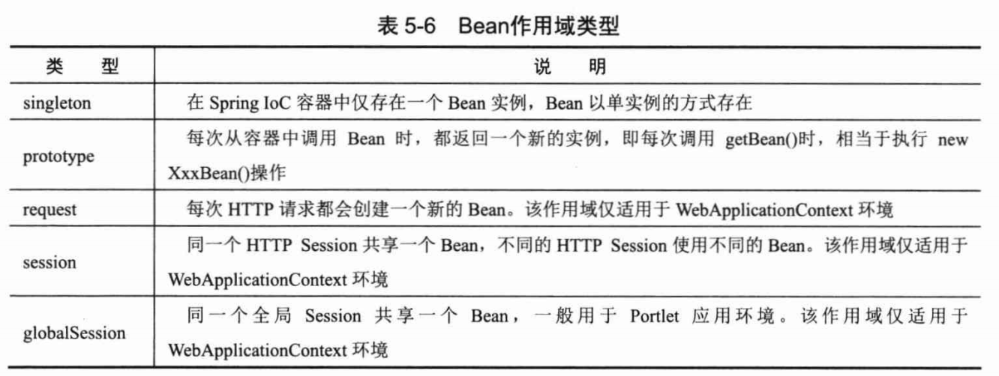
				- 除了上面的作用域类型，Spring还允许用户自定义bean的作用域。
			- singleton作用域
			  collapsed:: true
				- 初始化时机：默认情况下，在Spring的ApplicationContext容器在启动时，自动实例化所有的singleton的Bean并缓存于容器中。
				- Spring中的Bean默认是singleton作用域。
				- 使用场景：一般情况下，无状态或是状态不变的类适合使用单例模式。
				- 优点
				  collapsed:: true
					- 在启动时实例化Bean的时候会及早发现潜在的配置问题。
					- bean以缓存的方式保存，在运行期无需再实例化，提高了运行效率。
				- 懒加载
				  collapsed:: true
					- 如果不希望在容器启动时实例化Bean，可以在Bean声明的时候设置属性`lazy-init="true"`。
					- 按我们之前讲的Bean之间存在 依赖关系，如果该Bean被其他提前实例化的bean引用，那么Spring会忽略延迟实例化的设置。
			- prototype作用域
			  collapsed:: true
				- 每次都会生成一个新的Bean实例。
				- 默认情况下，Spring容器在启动时不会实例化prototype类型的Bean。
				- Spring容器将prototype的bean交给调用者后，就不再管理它的生命周期。
			- 与Web应用环境相关的bean作用域
			  collapsed:: true
				- 在Web容器中的额外配置
				  collapsed:: true
					- 使用另外3中web应相关的Bean作用域的额外配置：在web.xml中配置`RequestContextListener`请求监听器。
					- 之前我们讲了 WebApplicationContext的初始化中提到了`ServletContextListener`，他与`RequestContextListener`的各有什么区别？
					  collapsed:: true
					  
						- `ServletContextListener`
						  collapsed:: true
							- 负责监听web容器启动和关闭的事件.
							- Spring在启动时会使用`ContextLoaderListener`监听器，它实现了`ServletContextListener`接口。
							- 作用：初始化web容器，使得Spring能够对web容器进行Bean作用域的控制。
						- `ReuqestContextListener`
						  collapsed:: true
							- 负责监听Http的请求事件，web服务器每接到一次请求就会通知该监听器。
							- 作用：提供了`request`、`session`和`globalSession`类型的Bean作用域。
				- Spring其实可以提供一个实现了ServletContextListener和ReuqestContextListener接口的监听器，为什么要提供两个实现类？
				  collapsed:: true
					- 一是为了兼容，因为web应用的Bean作用域是从Spring2.0开始提供的。
					- 二是使用新的三种作用域的场景少。没必要让每个Bean都具有这三个作用域类型。
				- web容器Bean的三种类型作用域
				  collapsed:: true
					- request作用域
					  collapsed:: true
						- request作用域的Bean对应一个Http请求和生命周期。
						- 每次http请求调用时创建一个新的Bean，请求处理完成后就销毁这个Bean。
						- 参考代码
						  ```xml
						  <bean id="car" class="cn.bravedawn.Car" scope="request"/>
						  ```
					- session作用域
					  collapsed:: true
						- Bean的作用域横跨整个Http Session，Session中所有的Http请求都共享**同一个Bean**，当Http Session结束后，实例才被销毁。
					- globalSession作用域
					  collapsed:: true
						- 该作用域仅适用于Portlet的Web应用使用，Portlet规范定义了全局Session的概念。
						- 不在Portlet的web应用环境下，global Session作用域等价于session作用域。
			- 作用域依赖问题
			  collapsed:: true
				- 背景：某些场景下，需要将web相关的Bean注入singleton或prototype的Bean中，但是我们需要一些额外的配置。
				- 实例代码
				  ```xml
				  <bean id="car" class="cn.bravedawn.Car" scope="request" <aop:scoped-proxy/>
				  </bean>
				  
				  <bean id="boss" class="cn.bravedawn.Boss" scope="singleton">
				    <property name="car" ref="car"/>
				  </bean>
				  ```
				- 场景描述：当Boss Bean在Web环境中调用car Bean的时候，Spring AOP会启用动态代理智能的判断Boss Bean位于那个http请求线程中，病虫对应的http请求线程中获取对应的car Bean。其中注入Boss Bean的car Bean并不是原来的car Bean，这个car Bean是Spring动态代理生成的代理对象。
		- 9.`FactoryBean`接口
			- 背景：使用xml文件描述Bean的信息过于复杂，采用编码的方式或许是更好的选择。Spring提供了一个工厂类接口`FactoryBean`，用户可以通过这个接口定制实例化Bean的逻辑。
			- 这里具体的例子可以参考本书P154页的实现，这里不再赘述。
		- 10.基于注解的配置
		  collapsed:: true
			- 使用注解定义Bean
				- Spring容器成功启动的三大要件
					- Bean定义信息，就是xml中bean的定义
					- Bean实现类，就是java类中对bean进行定义的类
					- Spring本身
					- 基于xml的配置中，Bean的定义信息和Bean的实现类是分隔开来的；在基于注解的配置中，这两者都在Bean的实现类中得以体现。
				- Spring提供的声明Bean的注解
					- `@Component`，下面的三个注解其实和`@Component`是等效的，只是为了标注类的用途更加清晰化，其实可以用`@Component`替换。
					- `@Respository`
					- `@Service`
					- `@Contoller`
			- 扫描注解定义的Bean
				- 背景：使用了上面的四个注解之后，我们需要在原来的Bean的描述文件中配置需要Spring扫描Bean的类包。
				- xml中的`component-scan`配置
				  collapsed:: true
					- 作用：配置Spring需要扫描Bean定义信息的类包。
					- 属性
						- `base-package`
							- 配置需要扫描的类包。
						- `resource-pattern`
							- 基于base-package的配置，过滤出特定的类，Spring会对这些特定的类进行扫描。
						- `include-filter`
							- 表示要包含的目标类。
							- 支持过滤表达式。
						- `exclude-filter`
							- 表示要排除的目标类。
							- 支持过滤表达式，其中`aspectj`的过滤表达能力是最强的。
							- 过滤表达式的类别
								- annotation
								- assignable_type，通过配置这个类型可以排除指定的类。
								- aspectj
								- regex
								- custom
							- 参考文章
								- [Spring @ComponentScan – Filter Types](https://www.baeldung.com/spring-componentscan-filter-type)
								- [排除指定包的类](https://chwwww.github.io/2020/04/19/202004191/)
								- [Spring注解——使用@ComponentScan自动扫描组件](https://www.jianshu.com/p/64aac6461d5b)
						- `use-default-filters`
							- 默认值是`true`，表示默认会对`@Component`、`@Service`、`@Controller`和`@Resposity`的Bean进行扫描。
							- 如果想只对`@Controller`标注的Bean进行扫描，必须将其值设置为`false`。
						- 关于`include-filter`、`exclude-filter`和`use-default-filters`三者的作用顺序：
						  collapsed:: true
							- Spring首先会根据exclude-filter的配置列出需要排除的黑名单，然后根据include-filter的配置列出白名单，再根据use-default-filters的配置觉得需要扫描的注解配置。
						-
			- 自动装配Bean
				- 使用`@Autowired`进行自动注入
					- `@Autowired`注解默认按类型（byType）匹配的方式在容器中查找匹配的Bean，当有且仅有一个匹配的Bean时，Spring将其注入`@Autowired`标注的变量中。
					- `@Autowired`注解如果Spring作用于属性时，如果相同类型的Bean有多个话，**属性名如果和Bean名称一致的话**，就会注入名称相同的Bean，也就是说在修饰属性的时候，直接使用`@Autowired`就可以达到使用`@Qualifier`的效果。
				- 使用`@Autowired`的requested属性
					- 若容器中没有一个和标注变量类型匹配的Bean，那么Spring在启动的时候会报`NoSuchDefinitionException`异常。若希望Spring在匹配不到的时候不要抛异常，则可以使用`@Autowired(required=false)`进行标注。
				- 使用`@Qualifier`指定注入Bean的名称
					- 如果容器中存在相同类型的Bean的数量超过1个以上，则可以通过`@Qualifier`注解限定Bean的名称。
				- 对类的方法进行标注
				  collapsed:: true
					- @Autowired注解除了可以对类的**属性成员变量**进行注入，还可以对**方法的入参**进行注入。
					- 若方法只有一个入参
						- 示例代码
						  ```java
						  @Autowired
						  public void setLogDao(LogDao logDao) {
						    this.logDao = logDao;
						  }
						  
						  // 会将bean名称为userdao的bean注入给方法参数
						  @Autowired
						  @Qualifier("userdao")
						  public void setUserDao(UserDao userDao) {
						    this.userDao = userDao;
						  }
						  ```
					- 若方法存在多个入参
						- 示例代理
						  ```java
						  // 下面的方法会将名称为userdao的Bean注入给参数userDao，会将类型为LogDao的Bean注入给logDao
						  @Autowired
						  public void init(@Qualifier("userdao") UserDao userDao, LogDao logDao) {
						    this.userDao = userDao;
						    this.logDao = logDao;
						  }
						  ```
				- 对集合类进行注入
				  collapsed:: true
					- 对于List集合
						- 下面代码中会将所有Plugin类型（包含继承和实现了Plugin类的Bean）的Bean注入到这个list变量中。
						- 示例代码
						  ```java
						  @Autowired(required=false)
						  private List<Plugin> plugins;
						  ```
					- 对于Map集合
						- 下面的代码中会将Plugin类型的Bean放入这个Map中，其中key是Bean的名称，value是Bean本身。
						- 示例代码
						  ```java
						  @Autowired(required=false)
						  public Map<String, Plugin> pluginMap;
						  ```
					- 值得注意的是：Bean的加载顺序可以使用@Order注解进行声明，其中值越小，越优先被加载。
				- 对延迟依赖注入的支持
					- Spring容器在启动的时候，对于同时标注了`@Lazy`和`@Autowired`注解的属性不会立刻注入属性值，而是延迟到调用此属性的时候才会注入属性值。
					- `@Lazy`必须同时标注在目标Bean Java类的声明上和注入属性这两个地方才会生效。
				- 对标准注解的支持
					- JSR-250定义的`@Resource`注解
						- 作用：对类成员变量和方法入参提供自动注入的功能。
						- 与@Autowired的区别
							- @Resource是按名称匹配进行Bean的注入的。@Autowired是按类型。
							- @Resource要求提供一个Bean的名称属性方便其进行查找，如果属性为空，则按照标注处的变量名称或方法名作为Bean的名称去做查找。
					- JSR-330定义的`@Inject`注解
						- 作用：对类成员变量和方法入参提供自动注入的功能。
						- 与`@Autowired`的区别
							- `@Inject`注解与`@Autowired`注解一样都是按类型进行注入的，但是`@Inject`没有`required`属性。
			- Bean的作用范围及生命过程方法
				- 作用范围
				  collapsed:: true
					- 我们在通过注解配置一个Bean的时候，除了使用@Component注解外，还可以使用@Scope注解来显示的指定Bean的作用范围或者说是作用域。具体可以参考 8.Bean作用域。
				- 生命过程方法
				  collapsed:: true
					- 除了之前在 Bean自身的方法提到过的`init-method`和`destory-method`方法外，Spring支持了JSR-250定义的`@PostContruct`和`@PreDestory`注解。
					- `@PostContruct`和`@PreDestory`注解的作用时机
					  collapsed:: true
						- Bean的构造方法
						- 调用Setter方法设置Bean的属性
						- 调用`@PostContruct`标注的方法
						- Bean销毁时调用`@PreDestory`注解
		- 11.基于Java类的配置
		  collapsed:: true
			- 使用Java类提供Bean的定义信息
				- 实现步骤
					- 一使用`@Configuration`注解声明一个配置类
					- 二在配置中声明定义类的方法，并使用@Bean注解去标注，默认Bean是以方法名作为Bean的名称。
				- 注意
					- `@Configuration`注解类本身已经标注了`@Component`注解，所以配置类本身就是一个Bean。
					- 在方法上标注`@Bean`注解的地方，我们还可以使用`@Scope`注解来控制Bean的作用范围。
					- 因为采用Java类的配置去声明Bean的方式，在进行Bean的创建时会将Bean的生命周期管理的逻辑植入进来。这里就要用到AOP增强，所以使用基于Java类的配置方式必须保证要将Spirng aop和CGLib的包加载到类路径下。
			- 使用基于Java类的配置信息启动Spring容器
				- 直接通过`@Configuration`类启动Spring容器
					- 方法一：加载一个`@Configuration`配置类
						- Spring提供了`AnnotationConfigApplicationContext`类，直接通过标注`@Configuration`的Java类启动Spring容器。
					- 方法二：加载多个`@Configuration`配置类
						- 通过`AnnotationConfigApplicationContext`类的`register()`（注册配置类）和`refresh()`（刷新容器以应用这些注册的配置类）方法去加载多个配置类。
					- 方法三：通过`@Import`注解将多个配置类组装到一个配置类中
						- 将多个配置类组合到一个配置类中，使用方法一加载配置类。
				- 通过XML配置文件引用@Configuration的配置
					- 在xml文件中配置Java Bean的配置类，让Spring容器去扫描到相应的配置类。
				- 通过@Configuration配置类引用XML配置信息
					- 在标注有@Configuration注解的配置类中，引入声明有Bean定义的xml文件，在Java的配置文件中我们可以直接使用xml中配置的Bean。最后使用@Configuration类启动Spring容器即可。
		- 12.基于Groovy DSL的配置
		  collapsed:: true
			- 使用Groovy DSL提供Bean的定义信息
			  collapsed:: true
				- Bean的配置信息使用Groovy脚本进行声明，Bean定义可以实现的功能有：
				  collapsed:: true
					- 可以与基于注解的配置混用
					- 配置无参的构造函数Bean
					- 配置有参的构造函数Bean
					- 可以根据条件对Bean进行注入
			- 使用GenericGroovyApplicationContext启动
			  collapsed:: true
				- Spring提供了`GenericGroovyApplicationContext`类，通过Groovy DSL去启动Spring容器。
		- 13.通过编码方式动态添加Bean
		  id:: 4a4a373a-d98b-4c8e-aa0a-c8aa5700b02f
		  collapsed:: true
			- 为什么要动态的添加Bean，直接声明（或者说是定义）Bean不就行了吗？
				- 在向Spring容器添加Bean的时候，我们可能需要根据配置做相关逻辑的判断，按照上面xml、注解、Java类的方式等不足以满足我们的需求，因为他们都是静态添加，尽管Groovy DSL可以通过条件判断进行注入的逻辑，但是无法满足将bean的添加到Spring的逻辑。所以我们需要在Spring启动的时候动态的添加Bean实例到Spring容器中。
			- 方法一：通过`DefaultListaleBeanFactory`
				- 第一步实现`BeanFactoryPostProcessor`接口
					- 作用：为了实现在Spring启动阶段能够动态注入自定义Bean，保证动态注入的Bean能够被AOP所增强，需要实现Bean工厂后置处理器接口`BeanFactoryPostProcessor`。
				- 第二步利用`DefaultListableBeanFactory`类
					- 实现了`ConfigurableListableBeanFactory`接口
					- 提供了扩展配置、循环枚举的功能
					- 通过此类可以实现Bean的动态注入
			- 方法二：扩展自定义标签
			  collapsed:: true
				- 实现步骤
				  collapsed:: true
					- 1.创建一个需要扩展的组件，也就是编写bean的Java类定义
					- 2.采用XSD描述自定义标签的元素属性
					- 3.编写Bean定义的解析器，创建一个实现 AbstractSingleBeanDefinitionParser 接口的类，又或者创建一个实现 BeanDefinitionParser 接口的类，用来解析 XSD 文件中的定义和组件定义。这两种实现方式对应不同的 XSD 文件配置方式。
					- 4.注册自定义标签解析器，创建一个 Handler，继承 NamespaceHandlerSupport ，用于将组件注册到 Spring 容器
					- 5.绑定命名空间解析器编写 Spring.handlers 和 Spring.schemas 文件
				- 除了自定义标签之外，我们还可以自定义属性和子标签。
				- 参考文章
				  collapsed:: true
					- [Spring自定义标签的实现](https://zhuanlan.zhihu.com/p/107837020)
			- 这里有一些参考文章
				- [SpringBoot动态注入Bean](https://www.jianshu.com/p/faa6ac6f2ce2)
				- [spring动态创建bean:动态创建方式的时机影响（一）](https://blog.csdn.net/qq_37207266/article/details/120389752)
		- 14.不同配置方式的比较
		  collapsed:: true
			- Bean不同配置方式的比较
				- 书中总结图片
				  
				  
			- Bean不同配置方式的使用场景
				- 书中总结的图片
				  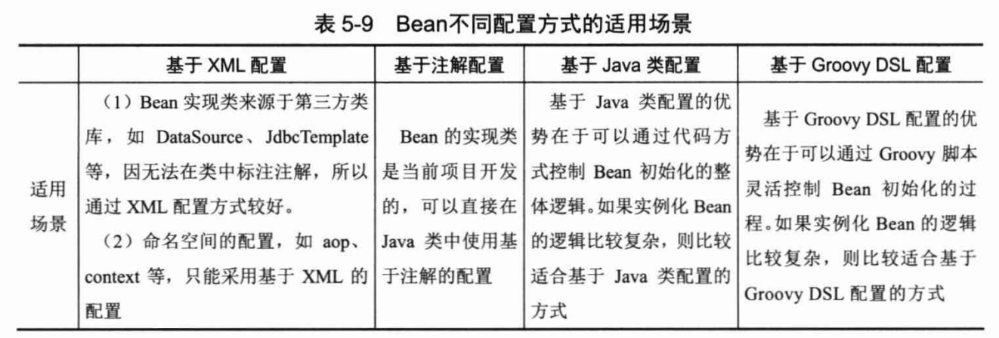
	- 第六章 Spring容器高级主题
	  collapsed:: true
		- 1.Spring容器技术内幕
		  collapsed:: true
			- Spring的内部工作机制
			  collapsed:: true
				- Spring中`AbstractApplicationContext`是`ApplicationContext`的抽象实现类，`AbstractApplication#refresh()`方法定义了Spring容器在加载配置文件之后各项处理过程。
			- IOC流水线
			  collapsed:: true
				- Spring容器从加载配置文件到创建出一个完整的Bean的作业流程如下
				  collapsed:: true
					- 流程图
					  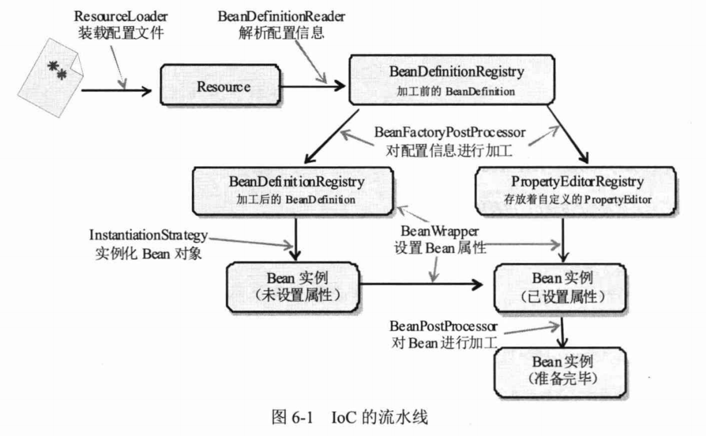
				- 流程解析
				  collapsed:: true
					- 1.`ResourceLoader`从配置文件中读取数据，通过`Resource`对象来表示配置文件资源。
					- 2.`BeanDefinitionReader`读取`Resource`指向的配置文件资源，然后解析配置文件。将配置文件中的每一个`<bean>`标签解析为`BeanDefinition`对象，并将其保存到`BeanDefinitionRegistry`中。
					- 3.容器扫描`BeanDefinitionRegistry`中的`BeanDefinition`，识别出Bean工厂后置处理器（也就是实现了`BeanFactoryPostProcessor`接口的Bean）调用Bean工厂后置处理器对`BeanDefinitionRegistry`中的`BeanDefinition`对象进行加工处理。
					- 4.容器扫描`BeanDefinitionRegistry`中的`BeanDefinition`，找出所有属性编辑器的Bean（也就是实现了`java.beans.PropertyEditor`接口的Bean），并自动将其注册到Spring容器的属性编辑器注册表`PropertyEditorRegistry`中。
					- 5.Spring容器从`BeanDefinitionRegistry`中取出加工后的`BeanDefinition`，并调用`InstantiationStrategy`进行Bean的实例化。
					- 6.在实例化Bean时，Spring容器使用`BeanWrapper`对Bean进行封装，`BeanWrapper`通过Bean的`BeanDefinition`和容器中的属性编辑器，完成Bean的属性注入工作。
			- BeanDefinition
			  collapsed:: true
				- BeanDefinition是配置文件<bean>标签在Spring容器的内部表示。
				- BeanDefinition类继承结构
				  collapsed:: true
					- 结构图
					  
					- 结构说明
					  collapsed:: true
						- `RootBeanDefinition`代表父`<bean>`标签，或者是没有父`<bean>`的`<bean>`标签。
						- `ChildBeanDefnition`代表子<bean>标签。
						- `AbstractBeanDefinition`是对`RootBeanDefinition`和`ChildBeanDefinition`共同类信息的抽象。
			- InstantiationStrategy
			  collapsed:: true
				- `InstantiationStrategy`负责根据`BeanDefinition`对象创建一个Bean实例。
				- `InstantiationStrategy`类继承结构
				  collapsed:: true
					- 结构图
					  
					- 结构说明
					  collapsed:: true
						- `SimpleInstantiationStrategy`是最常用的实例化策略，该策略利用Bean实现类的默认构造函数、带参构造函数或工厂方法创建Bean的实例。
						- `CglibSubclassingInstantiationStrategy`扩展了`SimpleInstantiationStrategy`，为需要进行方法注入的Bean提供了支持。它利用CGLib为Bean动态生成子类，在子类中生成方法注入的逻辑，利用这个动态生成的子类去实例化Bean。
			- BeanWrapper
			  collapsed:: true
				- BeanWrapper负责完成对Bean属性的填充工作。
				- BeanWrapper类继承结构图
				  collapsed:: true
					- 结构图
					  
					- 结构说明
					  collapsed:: true
						- PropertyAccess接口定义了各种访问Bean属性的方法
						- PropertyEditorRegistry是属性编辑器的注册表
				- 属性注入的流程
				  collapsed:: true
					- Spring容器从BeanfDefinition中获取Bean属性的配置信息PropertyValue，并使用属性编辑器对PropertryValue进行转换以得到Bean的属性值。对Bean的其他属性重复这个过程就可以完成属性填充工作。
		- 2.属性编辑器
		  collapsed:: true
			- 作用
			  collapsed:: true
				- Spring配置文件中Bean的属性一般是通过字面值为其设置属性值，但是Bean的类型却有很多种。属性编辑器负责完成配置文件字面值到JVM内部类型的类型转换工作。说白了就是一个类型转换器。
			- JavaBean的属性编辑器
				- 背景
				  collapsed:: true
					- Sun制定的JavaBean很大程度上是为IDE的开发准备的，也就是为Java GUI程序的开发准备的
				- PropertyEditor
					- 任何实现java.beans.PropertyEditor接口的类都是属性编辑器。
					- PropertyEditor是属性编辑器的接口，它规定了将外部设置值转换为内部JavaBean属性值的转换接口方法
				- BeanInfo
					- 主要描述了JavaBean的那些属性可以编辑以及对应的属性编辑器。
			- Spring默认属性编辑器
			  collapsed:: true
				- Spring的属性编辑器与IDE开发的属性编辑器不同，没有UI界面。仅负责将配置文件中的文本配置值转换为Bean属性的对应值。
				- Spring在`PropertyEditoRegistrySupport`中为常见属性类型提供了默认的属性编辑器。
				- Spring提供的默认属性编辑器
				  
			- 在Spring自定义属性编辑器
			  collapsed:: true
				- 开发者可以通过扩展PropertyEditorSupport实现自己的属性编辑器。
				- Spring的属性编辑器功能单一，仅需将配置文件中的字面值转换为属性类型的对象即可。
				- 实例演示
				  collapsed:: true
					- 如果一个BeanA的属性中包含另一个BeanB的引用，要配置BeanA的BeanB属性，有两种方案：
					  collapsed:: true
						- 一首先要声明BeanB，然后在BeanA的声明中使用<ref>标签去引用BeanB。
						- 二是BeanB类型声明一个自定义的属性编辑器，这样就可以像普通类型一样去通过字面值为BeanA的BeanB属性提供配置值。
					- 自定义的编辑器需要实现PropertyEditorSupport，并覆盖setAsText()方法就可以。
					- 注册自定义的属性编辑器
					  collapsed:: true
						- 如果使用`BeanFactory`，需要手工通过调用`registerCustomEditor(Class requiredType, PropertyEditor propertyEditor)`方法去注册自定义的属性编辑器。
						- 如果使用`ApplicationContext`，只需要在配置文件中通过`CustomEditorConfigurer`注册即可。
		- 3.使用外部属性文件
		  collapsed:: true
			- 背景
				- 在Spring的配置文件中，如果一个配置在多个Bean的声明中被使用，那就需要我们在每一个配置的地方都硬编码一次。如果我们统一将这些配置抽取出来，放在一个外部文件中，就会极大的减少维护的工作量，从而降低了在服务部署时因配置导致出错的概率。
			- 实现依赖
				- Spring提供了一个`PropertyPlaceholderConfigurer`类用于支持在Bean配置的时候引用外部属性文件。
				- `PropertyPlaceholderConfigurer`实现了`BeanFactoryPostProcessorBean`接口，也是一个Bean工厂后处理器。
			- `PropertyPlaceholderConfigurer`属性文件
				- 1.`PropertyPlaceholderConfigurer`使用流程
					- 将公共配置抽离出一个`.properties`属性文件
					- 在Bean的配置文件中引入`.properties`属性文件
					- 在Bean的声明中通过`${属性名}`使用配置的属性值。
				- 2.PropertyPlaceholderConfigurer的其他属性
					- `locations`：设置属性文件位置的classpath
					- `fileEncoding`：属性文件的编码格式
					- `order`：若bean的配置文件中定义了多个`PropertyPalceholderConfigurer`，则通过该属性指定优先顺序。
					- `placeholderPrefix`：使用`${属性名}`引用属性文件中的属性项，其中`${`为默认的占位符前缀。
					- `placeholderSuffix`：占位符后缀，默认是`}`。
				- 3.使用<context:property-placeholder>引用属性文件
					- 使用context命名空间定义属性文件，相比于传统的`PropertyPlaceholderConfigurer`配置的方式更优雅。这是第二种引入外部配置文件的方法。
				- 4.在基于注解及基于Java类的配置中引用属性
					- 在基于注解和基于Java类的配置中，我们可以使用`@Value(${属性名})`为Bean（`@Component`和@`Configuration`注解都会将类本省声明为一个Bean）的成员变量和方法入参自动注入容器已有的属性。
			- 使用加密的属性文件
			  collapsed:: true
				- 背景
				  collapsed:: true
					- 在应用程序的配置文件中有时会有一些敏感的数据，比如数据库的账户密码，这些数据如果明文存在配置文件中，会被内部开发人员看到，可能会导致数据库信息的泄露。所以针对一些比较敏感信息，我们需要这些配置信息进行加密。
				- 实现依赖
				  collapsed:: true
					- `PropertyPlaceholderConfigurer`继承了`PropertyResourceConfigurer`类
					- `PropertyResourceConfigurer`有几个有用的`protected`方法，用于在属性使用之前对属性列表中的属性进行转换
					  collapsed:: true
						- `void convertProperties(Properties props)`：props变量中包含了所有的属性列表，可以对所有属性进行转换处理。
						- `String convertProperty(String propertyName, String propertyValue)`：在加载属性文件并读取配置文件中的每一个属性，都会调用这个方法进行转换。**我们一般复写这个方法。**
						- `String convertPropertyValue(String originValue)`：这个方法只传入了每个属性的属性值。
				-
			- 属性文件自身的引用
			  collapsed:: true
				- 在属性文件内容，不同的属性可以通过`${属性名}`引用其他属性的属性值。
				- 如果一个属性值太长写不下，可以在行后添加`\`，将属性值划分为多行。
		- 4.引用Bean的属性值
		  collapsed:: true
			- 背景：如果我们的系统是集群部署或者希望在运行期调整应用的某些配置。此时我们可能会考虑使用数据库去存储我们的一些属性配置项。
			- 在基于xml的配置方式中，我们可以使用`#{bean.属性名}`的方式去获取其他bean的值。
			- 在基于注解和Java类的配置方式中，我们可以使用`@Value(#{bean.属性名}`的方法获取其他bean的属性值。
		- 5.国际化信息
		  collapsed:: true
			- 基础信息
			  collapsed:: true
				- 一般需求两个条件才可以确定一个特定类型的本地化信息，分别是“语言类型”和“国家/地区类型”。
				- Locale
				  collapsed:: true
					- java.util.Locale类是表示语言和国家/地区类型信息的本地化类，它是创建国际化应用的基础。
					- 比如创建中国的国际化信息，代码如下：
					  ```java
					  Locale locale1 = new Locale("zh", "CN");
					  
					  // 等同于
					  Locale locale2 = Locale.CHINA;
					  ```
					- 如果希望改变系统默认的本地化配置，可以在JVM的启动参数中指定：`java -Duer.language=en -Duser.region=US MyTest`。
				- 本地化工具类
				  collapsed:: true
					- JDK的java.util包提供了几个工具类来支持本地化的格式化操作，这几个类分别是：
					  collapsed:: true
						- `NumberFormat`：可以对货币金额按照本地化的方式进行格式化操作。
						- `DateFormat`：可以对日期按照本地化的方式进行格式化操作。
						- `MessageFormat`：提供了字符串占位符的格式化操作。
				- ResourceBoundle
				  collapsed:: true
					- 作用：用于访问国际化信息
					- 资源文件的命名
					  collapsed:: true
						- 国际化资源文件的命名规范：`<资源名>_<语言代码>_<国家/地区代码>.properties`，其中语言代码和国家/地区代码是可选参数。
						- 默认资源文件的命名：`<资源名>.properties`
					- 中文本地化资源文件的内容的编码只能使用ASCII字符，所以需要将非ASCII字符的内容转换为Unicode代码的表示方式。
					  collapsed:: true
						- JDK在bin目录下提供了一个工具native2ascii，用于将中午字符的资源文件转换为Unicode编码的文件。
						- IDEA支持透明化编辑资源文件的功能，在Setting->Editor->File Enconding->勾选“Transparent native-to-ascii conversion”就可以开启。也就是说在idea中你可以以中文字符的方式编写资源文件，idea会自动帮你将中文字符转换Unicode编码。
					- 使用`ResourceBoundle`加载和访问资源文件
					  collapsed:: true
						- ResourceBoundle加载资源文件的顺序：指定本地化对象的资源文件->本系统默认的本地化对象的资源文件->默认的资源文件
					- 使用`ResourceBoundle`和`MessageFormat`读取格式化资源文件
			- MessageSource
			  collapsed:: true
				- 作用：用于访问国际化信息
				- 重要方法
				  collapsed:: true
					- `String getMessage(String code, Object[] args, String defaultMessage, Locale locale)`
					  collapsed:: true
						- `code`：表示国际化信息中的属性名
						- `args`：用于传递格式化串占位符所用的运行期参数
						- `defaultMessage`：在资源中找不到资源名时，返回defaultMessage定义的信息
						- `locale`：指定本地化对象
				- MessageSource的类结构
				  collapsed:: true
					- 结构图
					  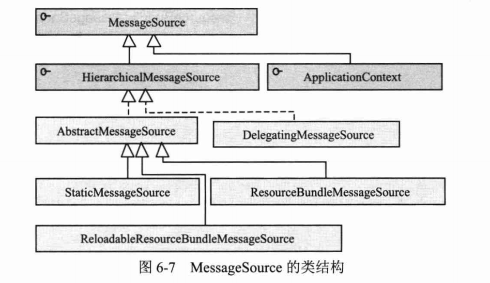
				- `ResourceBundleMessageSource`
				  collapsed:: true
					- 该类允许用户通过beanName访问一个或是多个资源文件
					- 与`ResourceBoundle`的区别
					  collapsed:: true
						- 在加载资源文件的时候无需明确指定本地化信息，通过资源名就可以加载整套国际化资源文件。
						- 无需使用`MessageFormat`去格式化信息，调用getMessage()方法直接就可以完成格式化。
				- `ReloadableResourceBundleMessageSource`
				  collapsed:: true
					- 与ResourceBundleMessageSource的区别是可以定时刷新资源文件，在应用不重启的情况下感知资源文件的变化。
			- 容器级的国际化信息资源
			  collapsed:: true
				- 在 MessageSource的类结构中我们看到`ApplicationContext`实现了`MessageSource`接口，其目的在于将国际化资源信息变为容器级的，Spring将国际化信息资源作为公共基础设施对所有组件公开。
				- 声明容器级的国际化信息资源
				  collapsed:: true
					- 在 Spring的内部工作机制中，在容器启动的时候会执行`initMessageSource()`方法，这个方法的作用就是初始化容器中的国际化信息资源。它根据反射从`BeanDefinitionRegistry`找出名为`messageSource`（这个Bean名称只能为`messageSource`）且类型为`org.springframework.MessageSource`的Bean，将这个Bean定义的信息资源加载为容器级的国际化信息资源。
		- 6.容器事件
		  collapsed:: true
			- 背景：
				- Spring的ApplicationContext能够发布事件并允许注册相应的事件监听器，有一套完整的事件发布和监听机制。
			- Java通过`java.util.EventObject`类描述事件，`java.util.EventListener`接口描述监听器。
			- 重要概念
				- 事件源：事件的产生者，任何一个EventObject都有一个事件源。
				- 事件监听注册表：用于保存事件监听器。
				  collapsed:: true
					- 将一个注册一个事件监听器，就是将监听器保存到事件监听注册表。
					- 当事件源产生事件时，就会通知位于注册表中的事件监听器。
				- 事件广播器：是事件和监听器沟通的桥梁，负责把事件通知给事件监听器。
				- 一个图
				  
			- Spring事件类结构
				- 事件类
					- 事件类结构图
					  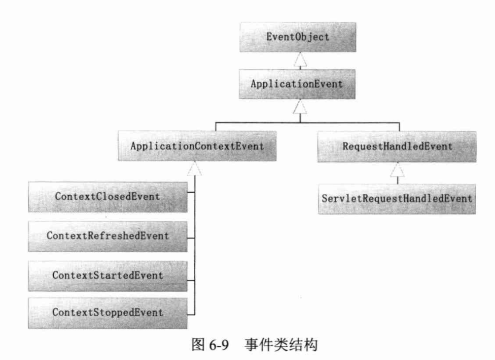
					- ApplicationEvent的唯一构造函数式ApplicationEvent(Object source)，通过source参数指定事件源。
					- ApplicationEvent有两个子类
						- ApplicationContextEvent
							- 这个类代表容器事件，它拥有4个子类，分别代表了容器启动、刷新、停止和关闭的事件。
						- RequestHandledEvent
							- 这个类是和web应用相关的事件，当一个http请求本处理后，就会产生该事件。
						- 也可以根据自己的需要扩展`ApplicationEvent`定义自己的事件，完成其他的特殊功能。
				- 事件监听接口
					- 事件监听接口结构图
					  
					- `ApplicationListener`
						- Spring的事件监听器都继承自`ApplicationListener`接口
						- `ApplicationListener`接口定义了一个`onApplicationEvent(E event)`方法，该方法接收`ApplicationEvent`事件对象，在该方法中编写事件处理的逻辑。
					- `SmartApplicationListener`
						- `boolean supportsEventType(Class<? extends ApplicationEvent> eventType)`：指定监听器对支持哪种类型的容器事件。
						- `boolean supportsSourceType(Class<?> sourceType)`：指定监听器对何种数据源对象做出响应。
					- `GenericApplicationListener`
						- 与`SmartApplicationListener`不同的是，它增强了对泛型事件类型的支持。`suppertsEventTyoe()`方法的入参是`ResolvableType`，他可以获取泛型的实际类型信息。
						- `boolean supportsEventType(ResolvableType eventType)`：指定监听器对支持哪种类型的容器事件。
						- `boolean supportsSourceType(Class<?> sourceType)`：指定监听器对何种数据源对象做出响应。
				- 事件广播器
					- 类结构图
					  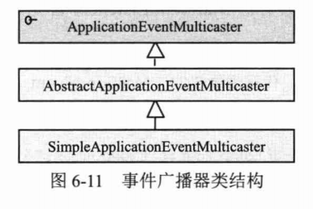
					- Spring为事件广播器定义了接口和实现类。
					- 自定义事件广播器只要实现`AbstractApplicationEventMulticaster`接口即可。
					- 如果没有自定义的事件广播器，则默认使用`SimpleApplicationEventMulticaster`。
				- Spring事件体系的具体实现
					- `org.springframework.context.support.AbstractApplicationContext#refresh`，从容器启动的方法中通过这三个方法搭建事件的基础设施
						- `this.initApplicationEventMulticaster()`：初始化应用上下文事件广播器。
						- `this.registerListeners()`：注册事件监听器。
						- `this.finishRefresh()`：完成刷新并发布容器刷新事件。
				- Spring事件实例的编写
					- 1.继承`ApplicationEvent`，实现定义一个事件。
					- 2.实现`ApplicationListener`接口，定义一个监听器。
					- 3.实现`ApplicationContextAware`接口的`setApplicationContext()`方法，在Spring容器启动时注入容器实例。
					- 4.在bean的声明件中声明事件和监听器。
					- 5.使用`ClassPathXmlApplicationContext`加载配置文件，启动容器。
	- 第七章 Spring AOP基础
	  collapsed:: true
		- 本章主要讨论了基于接口的切面技术。Spring的AOP技术主要有两类，一类是Spring自己实现基础的AOP，一类是基于@AspectJ注解的AOP，后者我们会在第八章进行讨论。
		- 1.AOP概述
		  collapsed:: true
			- AOP的适用场景：只适合那些具有横切逻辑的应用场合，如性能监控、访问控制、事务管理及日志记录等场景。
			- 什么是AOP
			  collapsed:: true
				- 英语翻译过来是Aspect Oriented Programing，翻译过来是面向切面编程。
				- 说下我自己的理解吧，比如我们开发一个接口，我们都是从**controller**->**service**->**repository**这几个层次去开发的，我按照这样的模式开发了很多的接口，但是如果我想对这些接口做一些统一的操作，那我应该怎么去做呢。这里我们就可以利用AOP来做，如果说一个接口的开发是纵向的，那么AOP就是做些横向的工作。
			- AOP的术语
			  collapsed:: true
				- 连接点（Joinpoint）
				  collapsed:: true
					- 连接点就是触发点的意思，描述了切面的逻辑是从什么地方开始执行的。
					- Spring仅支持方法的连接点，也就是说只能从**方法调用前**、**方法调用后**、**方法抛出异常时**和**方法调用前后**这四个地方加入切面的相关逻辑。
					- 连接点有两个信息去进行确认：
					  collapsed:: true
						- 一是用**方法**表示的程序**执行点**，其中使用**切点**对执行点进行定位。
						- 二是用**相对位置**表示的**方位**，在**增强类型**中进行定义。
				- 切点（Pointcut）
				  collapsed:: true
					- AOP通过切点对特定的连接点记性定位。
					- 连接点相当于**数据库中的记录**，而切点相当于**查询条件**。
					- 在Spring中，通过`org.springframework.aop.Pointcut`接口对切点进行描述。
				- 增强（Advice）
				  collapsed:: true
					- 增强是放置在程序连接点上的一段程序代码。
					- 增强还包含了用于定位连接点的**方位**，所谓方位就是在方法的调用前还是调用后这些。
					- Spring提供的增强接口都是带方位的，比如`BeforeAdvice`、`AfterReturningAdvice`等等。
				- 目标对象（Target）
				  collapsed:: true
					- 目标对象就是添加增强逻辑代码的那个目标类。
				- 引介（Introduction）
				  collapsed:: true
					- 引介是一种特殊的增强，它为目标类添加一些属性和方法。
				- 织入（Weaving）
				  collapsed:: true
					- 织入是将增强代码添加到目标类的具体连接点上的过程。
					- AOP有三种织入方式
					  collapsed:: true
						- 编译期织入，这要求使用特殊的Java编译器。
						- 类装载期织入，这要求使用特殊的类装载器。
						- 动态代理织入，在运行期为目标类添加增强生成子类的方式。
					- Spring采用动态代理织入，AspectJ采用编译期织入和类装载期织入。
				- 代理（Proxy）
				  collapsed:: true
					- 一个类被AOP增强之后，就会产生一个结果类，这个结果类是融合了原类和增强逻辑的代理类。
					- 代理类可能是和原来具有相同的接口，或者是原类的子类。所以我们可以通过调用原类相同的方式调用代理类。
				- 切面（Aspect）
				  collapsed:: true
					- 切面由切点和增强组成，即包含横切逻辑的定义，又包含连接点的定义。
				- 要将增强应用于目标对象的连接点上，两个步骤：
				  collapsed:: true
					- 一如何将切点和增强定位到连接点上。
					- 二如何在增强中编写切面的代码。
			- AOP的实现者
			  collapsed:: true
				- AspectJ
				  collapsed:: true
					- 在**编译期**提供横切代码的织入。
					- 有一个编译器用来生成Java字节码规范的Class文件。
				- AspectWerkz
				  collapsed:: true
					- 支持在运行期或类装载期织入横切代码。
				- JBoss Aop
				- Spring Aop
				  collapsed:: true
					- 采用纯Java实现，在运行期通过代理方式向目标类织入增强代码。
					- 不提供完整的AOP实现，侧重提供一种与Spring IOC整合的AOP实现。
		- 2.基础知识
			- 静态代理
			  collapsed:: true
				- 就是在代码中显示指定的代理。
				- 所谓静态就是在程序运行前就已经存在代理类的字节码文件，代理类和委托类的关系在运行前就确定了。
			- 动态代理
			  collapsed:: true
				- 允许开发人员在代理运行期创建接口或者类的代理实例。
			- JDK动态代理
				- JDK只能为接口创建代理实例，这个也是他的一个限制。
				- JDK的动态代理主要涉及`Proxy`类和`InvocationHandler`这两个接口。
			- CGLib动态代理
				- CGLib采用底层的字节码技术，可以为一个类创建子类，在子类中采用方法拦截的技术拦截所有父类方法的调用，并在父类方法上加入横切逻辑。
				- CGLib采用动态创建子类的方式生成代理对象，所以不能对目标类中`final`和`private`的方法进行代理。
			- 代理知识总结
			  collapsed:: true
				- JDK动态代理和CGLib动态代理的不足
				  collapsed:: true
					- 目标类的所有方法都添加了增强的横切逻辑。有时候我们只想针对某些方法来做增强，这个他两不支持。
					- 通过硬编码的方式指定了要放入横切逻辑的位置。对源代码有侵入性。
					- 手动编写代理实例的创建过程。在为不同的类创建代理时，需要分别编写，无法通用。
				- CGLib创建代理对象所花费的时间比JDK要长，但是创建动态代理对象的性能比JDK要好。
		- 3.创建增强类（基于`ProxyFactory`进行实现）
		  collapsed:: true
			- 增强类型
				- AOP联盟定义了`org.application.aop.Advice`接口。
				- Spring提供了五种类型的增强，这些增强都是通过`ProxyFactory`实现的，它通过代理技术实现目标类的代理类，从而对原有类的方法进行增强。
					- 前置增强
						- 在目标方法前执行。
						- BeforeAdvice代表前置增强，是为了为了版本扩展定义的。
						- 因为Spring只支持方法级的增强，所以MethodBeforeAdvice是目前可用的强置增强。
					- 后置增强
						- AfterReturningAdvice，在目标方法后执行。
					- 环绕增强
						- MethodInterceptor，在目标方法执行前后执行。
					- 异常抛出增强
						- ThrowsAdvice，在目标方法抛出异常后执行。
					- 引介增强
						- IntroductionInterceptor，在目标类的代理类中通过实现接口的方式，为目标类添加一些新的方法和属性。
			- 前置增强
			  collapsed:: true
				- 1.通过`MethodBeforeAdvice`接口实现前置增强
				  collapsed:: true
					- MethodBeforeAdvices的唯一接口方法：`before(Method method, Objects[] args, Object obj)`
					  collapsed:: true
						- method：为目标方法
						- args：为目标方法参数
						- obj：目标类实例
				- 2.解刨`ProxyFactory`
				  collapsed:: true
					- ProxyFactory负责将增强织入到目标类中。
					- ProxyFactory内部使用JDK和CGLib动态代理技术将增强应用到目标类中。
					- AopProxy
					  collapsed:: true
						- AopProxy类结构图
						  
						- CgLib2AopProxy
						  collapsed:: true
							- 使用CGLib动态代理技术创建代理。
							- 针对类进行代理。
							- ProxyFacotory.setOptimize(true)方法让ProxyFactory启动优化代理，也会使用CglibAopProxy去创建代理。
						- JdkDynamicAopProxy
						  collapsed:: true
							- 使用jdk动态代理技术创建代理。
							- 针对接口进行代理。
				- 3.在Spring中通过`ProxyFactoryBean`配置代理
			- 后置增强
			  collapsed:: true
				- 通过实现`AfterReturningAdvice`来定义后置增强的逻辑
				- AfterReturningAdvice的唯一接口方法：`AfterReturning(Method method, Objects[] args, Object obj)`
			- 环绕增强
			  collapsed:: true
				- Spring直接使用AOP联盟定义的`MethodInterceptor`作为环绕增强的接口。
				- `MethodInterceptor`接口的唯一方法：`Object invoke(MethodInvocation invocation)`。
			- 异常抛出增强
			  collapsed:: true
				- 异常抛出增强最适合的应用场景就是事务管理。
				- `ThrowsAdvice`异常抛出增强接口，是一个**标签接口**，本身没有定义任何方法。
				- `ThrowsAdvice`接口的实现类必须采用如下方法的签名形式定义增强方法：`void afterThrowing(Method method, Object[] args, Object target, Throwable e)`
				  collapsed:: true
					- 这个方法的前三个参数是可选的，要么都提供，要么不提供。
				- 在同一个异常抛出增强类中可以定义多个`afterThrowing()`方法，目标类抛出异常的时候会自动选择最匹配的增强方法。
			- 引介增强
			  collapsed:: true
				- Spring为引介增强定义了`IntroductionInterceptor`接口，该接口没有定义任何方法。接着Spring又提供了他的实现类`DelegatingIntroductionInterceptor`，一般情况下拓展该类实现自己的引介增强类。
		- 4.创建切面
		  collapsed:: true
			- 切面概述
				- Spring通过`Pointcut`接口描述切点。
				- `Pointcut`由`ClassFilter`和`MethodMather`构成。
				- `ClassFilter`负责定位到特定的类，`MethodMather`负责定位到特定的方法。
				- Spring支持两种方法匹配器
				  collapsed:: true
					- 静态方法匹配器
					  collapsed:: true
						- 仅对方法签名（包括方法名和入参类型及顺序）进行匹配。
						- 静态匹配只会判别一次。
					- 动态方法匹配器
					  collapsed:: true
						- 会在运行期检查方法入参的值。
						- 动态匹配每次调用方法的时候都会进行判别。
						- 对性能的影响很大，一般不用。
			- 切点类型
				- 静态方法切点：`StaticMethodMatcherPointcut`
				- 动态方法切点：`DynamicMethodMatcherPointcut`
				- 注解切点：`AnnotationMatchingPointcut`
				- 表达式切点：`ExpressionPointcut`
				- 流程切点：`ControlFlowPointcut`
				  collapsed:: true
					- 根据程序执行堆栈的信息查看目标方法是否由某一个方法直接或间接的发起调用，以此判断是否匹配连接点。
				- 复合切点：`ComposablePointcut`
				  collapsed:: true
					- 可以将多个切点以并集或交集的方式组合起来，提供了切点之间复合运算的功能。
			- 切面类型
				- 一般切面
				  collapsed:: true
					- `Advisor`代表一般切面。仅包含Advice，也就是增强。
					- 一般切面代表连接点是所有目标类的所有方法，因为范围太宽泛，所以一般不使用。
				- 切点切面
					- `PointcutAdvisor`代表具有切点的切面。
					- 包含Advice和Pointcut两个类，这样就可以通过类、方法名和方法方位等信息灵活的定义切面的连接点。
					- PointcutAdvisor的具体实现类
						- PointcutAdvisor实现体系
						  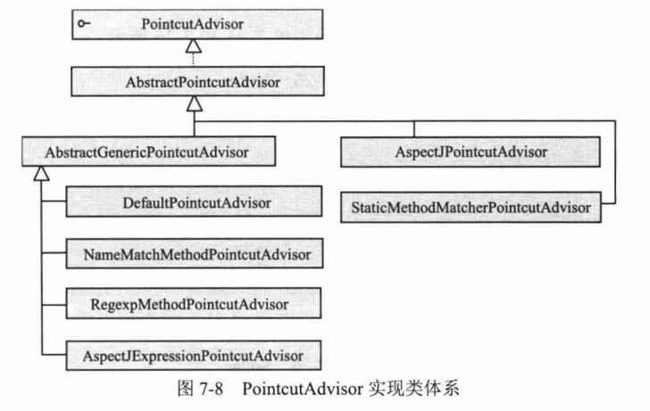
						- `DefaultPointcutAdvisor`
						- `NameMatchMethodPointcutAdvisor`
						- `RegexpMethodPointcutAdvisor`
							- 使用正则表达式匹配方法名进行切点定义的切面。
						- `StaticMethodMatcherPointcutAdvisor`
							- 静态方法匹配器切点定义的切面，默认情况下匹配所有的目标类。这个类的作用就是定义切点。
							- 仅能通过方法名定义切点。
						- `AspectJExpressionPointcutAdvisor`
						- `AspectJPointcutAdvisor`
				- 引介切面
				  collapsed:: true
					- `IntroductionAdvisor`代表引介切面。
					- 引介切面应用于类层面，所以引介切点是使用`ClassFilter`进行定义的。
				- 切面继承关系图
				  
			- 静态切面
			  collapsed:: true
				- 是指在生成代理对象时就确定了增强是否需要织入到目标类的连接点上。
			- 动态切面
			  collapsed:: true
				- 是指必须在运行期根据方法入参的值来判断增强是否需要织入到目标类的连接点上。
			- 切面的实现
				- 普通方法匹配的静态切面的实现
					- 通过`StaticMethodMatcherPointcutAdvisor`进行实现，除了切点定义外，还需要定义一个增强才行。
					- 需要实现`StaticMethodMatcherPointcutAdvisor`的`matches()`方法定义切点方法的匹配规则，覆盖`getClassFilter()`方法来定义切点类的匹配规则。通过这两步就可以完成对切点的定义。
				- 正则表达式方法匹配的静态切面的实现
				  collapsed:: true
					- 通过`RegexpMethodPointcutAdvisor`进行实现。除了切点定义外，还需要定义一个增强才行。
					- 可以通过正则表达式来匹配目标方法，来定义切点。
				- 动态切面的实现
				  collapsed:: true
					- 在低版本中，Spring提供了``DynamicMethodMathcherPointcutAdvisor``抽象类，后来这个类被废弃了，可以使用`DefaultPointcutAdvisor`和`DynamicMethodMatcherPointcut`来完成相同的功能。
					- `DynamicMethodMatcherPointcut`动态切点对静态切点检查和动态切点检查都是有用的。但是动态切点的检查是十分耗性能的。
					  collapsed:: true
						- 可以定义对类静态切点检查
						- 可以定义对方法的静态切点检查
						- 对方法进行动态切点检查
					- Spring对静态切点和动态切点的检查原理
					  collapsed:: true
						- 在创建代理是对目标类的每个连接点进行静态切点检查，若不匹配，则不再进行动态切点价差。若静态切点检查匹配，则在运行时再进行动态连接点检查。
						- 若没有定义静态切点检查，则动态切点在运行时会匹配每一个方法的调用。
				- 流程切面的实现
				  collapsed:: true
					- 流程切面由`DefaultPointcutAdvisor`和 流程切点：`ControlFlowPointcut` 实现。
					- 流程切面与动态切面一样也需要在运行期判断动态的环境。代理对象每次在调用在调用目标方法时，都需要判断方法调用堆栈是否有流程切点要求的方法。
					- 对性能的影响很大，比较慢。
				- 复合切点切面的实现
				  collapsed:: true
					- 有时需要通过多个切点来描述一个连接点的信息时，我们就需要定义复合切点来进行实现。
				- 引介切面的实现
				  collapsed:: true
					- 引介切面是引介增强的封装器，通过引介切面可以更容易的对现有对象添加任何接口的实现。
					- 引介切面类的继承关系
					  collapsed:: true
						- 继承图
						  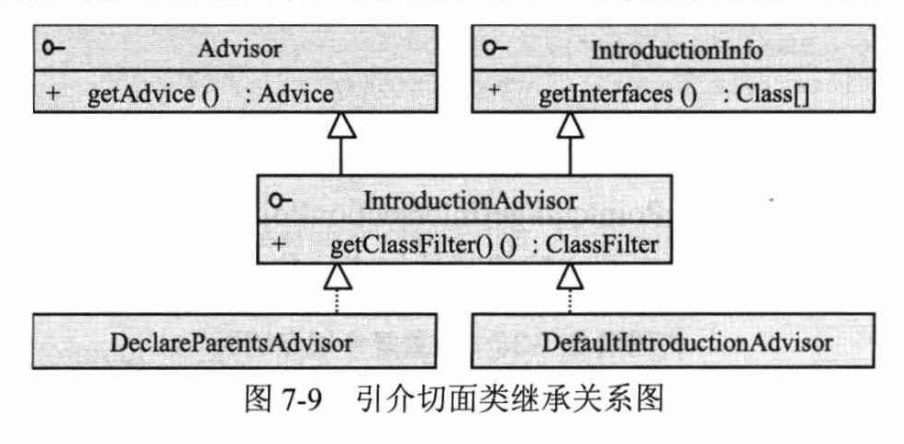
						- `Advisor`代表一般切面。
						- `IntroductionInfo`描述了目标类需要实现的新接口。
						- `DefaultIntroductionAdvisor`是引介切面最常用的实现类。
						- `DeclareParentsAdvisor`用于实现使用AspectJ语言的`DeclareParent`注解表示的引介切面。
		- 5.自动创建代理
		  collapsed:: true
			- 背景
			  collapsed:: true
				- 在 3.创建增强类（基于`ProxyFactory`进行实现）和 ((6486fcb3-45f5-4bfa-928a-fe41754cb908))都是通过`ProxyFactoryBean`创建织入切面的代理，每个需要被增强的Bean都需要使用一个`ProxyFactoryBean`进行配置。对于大项目来讲，配置起来比较麻烦。
				- Spring提供的自动代理，通过`BeanPostProcessor`自动生成代理，从而简化配置。
			- 基于`BeanPostProcessor`实现的自动代理创建器，会在容器实例化Bean时为匹配的Bean创建代理，主要分为三类：
			  collapsed:: true
				- 基于`Bean`配置名规则的自动代理创建器，实现类为`BeanNameAutoProxyCreator`
				- 基于`Advisor`匹配机制的自动代理创建器，实现类为`DefaultAdvisorAutoProxyCreator`
				- 基于`Bean`中AspectJ注解标签的自动代理创建器：实现类为`AnnotationAwareAspectJProxyCreator`
				- 自动代理创建器的类继承图
				  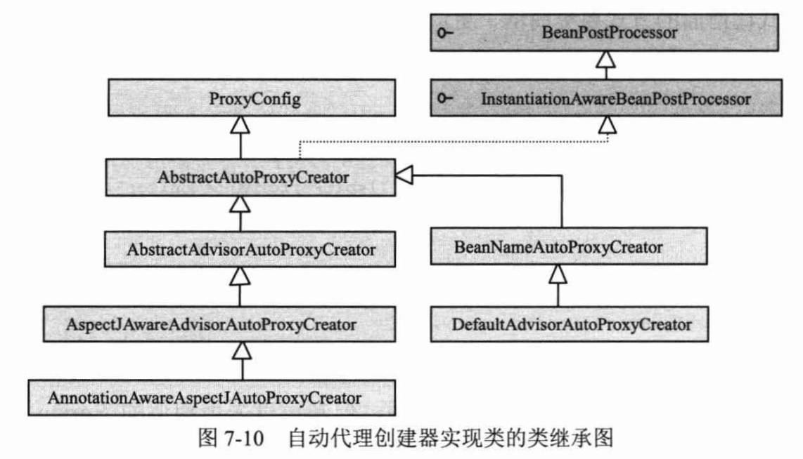
			- BeanNameAutoProxyCreator
			  collapsed:: true
				- 通过指定Bean名称的一组规则去筛选需要为其自动创建代理的Bean。
			- DefaultAdvisorAutoProxyCreator
			  collapsed:: true
				- `DefaultAdvisorAutoProxyCreator`能够扫描容器中的Advisor，并将Advisor自动注入到匹配的目标Bean中，也就是为目标Bean自动创建代理。
			- AOP如何实现方法的嵌套调用增强
			  collapsed:: true
				- 问题
				  collapsed:: true
					- 要对一个Bean的A和B两个方法进行匹配增强，若是B方法嵌套在了A方法的里面，调用A方法的同时也会调用B方法。我们指定的切面匹配规则满足A和B两个方法，但是在运行代码的时候发现只有A方法被增强了，但是B方法却没有。
				- 分析
				  collapsed:: true
					- 原因是在方法内部调用的时候A方法内会直接调用原实例的方法，不会调用代理类的。
				- 解决办法
				  collapsed:: true
					- 在目标类中增加一个设置代理类的实例属性，在容器启动之后调用该属性的setter方法，将生成好的代理类实例设置到代理类自身的实例属性中，这样调用时候就会方法两个方法都被增强了。
	- 第八章 基于AspectJ和Schema的AOP
	  collapsed:: true
		- 1.Spring对AOP的支持
		  collapsed:: true
			- 新增了基于Schema的配置支持，为AOP提供了专门的aop命名空间。
			- 新增了对AspectJ切点表达式语言的支持。
			- 可以无缝集成AscpectJ。
		- 2.Java注解的基础知识
		- 3.着手使用`@AspectJ`
			- 背景
			  collapsed:: true
				- 第七章主要使用`Pointcut`和`Advice`接口描述切点和增强，通过`Advisor`整合切点和增强描述切面。
				- @Aspect采用注解来描述切点和增强。
			- 通过注解使用`@AspectJ`切面
				- 这里主要演示了使用`@AspectJ`和`@Before`注解来实现切面。通过`AspectJProxyFactory`生成其代理类。
			- 通过配置使用`@AspectJ`切面
				- 通过 基于`Bean`中AspectJ注解标签的自动代理创建器：实现类为`AnnotationAwareAspectJProxyCreator` 将@AspectJ注解切面类自动注入目标类bean中
				- 通过基于Schema的aop命名空间进行配置，在配置中添加`<aop:aspectj-autoproxy>`自动为Spring容器中匹配`@AspectJ`切面的Bean创建代理。
			- 参考文章
				- [【Spring AOP】@Aspect结合案例详解（一）: @Pointcut使用@annotation + 五种通知Advice注解](https://juejin.cn/post/7186473207132586044?searchId=20240429110927BE32A8C60B380980D3FD)
		- 4.`@AspectJ`语法基础
			- 背景
				- 由于Spring只支持方法的连接点，所以Spring仅支持部分AspectJ的切点语言。
			- 切点表达式函数
				- AspectJ5.0的切点表达式，由下面两部分组成
					- 关键字（切点函数）
						- 在切点表达式`exectution(* greetTo(..))`中，关键字是`exectution`。
						- 分类
							- 方法切点函数
							- 方法入参切点函数
							- 目标类切点函数
							- 代理类切点函数
					- 操作参数
						- 在切点表达式`exectution(* greetTo(..))`中，操作参数是`* greetTo(..)`。
				- 切点函数表
				  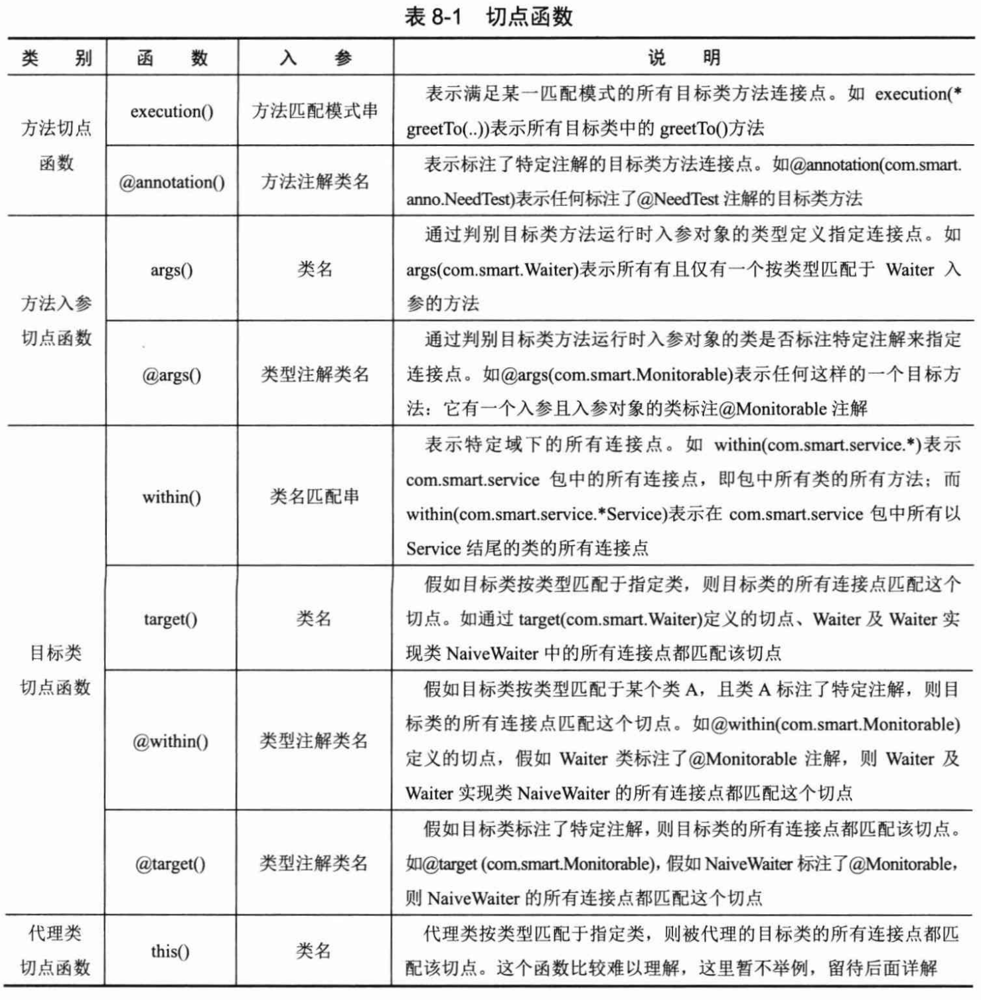
			- 在切点表达式函数中使用通配符
				- @AspectJ支持三种通配符
					- `*`：匹配任意字符，只能匹配上下文中的一个元素。
					- `..`：匹配任意字符，可以匹配上下文中的多个元素。
						- 表示类时，必须和`*`一起使用。
						- 表示入参时，单独使用。
					- `+`：表示按照类型匹配指定类的所有类，必须跟在类名后面。
						- 比如`com.abc.Car+`，就表示继承和扩展指定类的所有类，包括类本身。
				- @Aspect函数按照其是否支持通配符及支持的程度，分为三类
					- 支持所有通配符：`execution()`、`within()`
					- 仅支持`+`通配符：`args()`、`this()`和`target()`
					- 不支持通配符：`@annotation`、`@args()`、`@within()`、`@target`
			- 逻辑运算符
				- 背景
					- 切点表达式由切点函数组成，切点函数之间还可以进行逻辑运算，组成复合切点。
				- Spring支持的切点运算符
					- `&&`：与运算，相当于切点的交集运算。
					- `||`：或运算，相当于切点的并集运算。
					- `!`：非运算，相当于切点的反集运算。
			- 不同的增强类型
				- 背景
					- 第七章 3.创建增强类（基于`ProxyFactory`进行实现）中我们通过接口实现来实现增强。@AspectJ也为各种增强提供了不同的注解类。
				- @Aspect提供的增强注解
					- `@Before`
						- 前置增强，相当于BeforeAdvice。
					- `@AfterReturning`
						- 后置增强，相当于AfterReturningAdvice。
					- `@Around`
						- 环绕增强，相当于MethodInterceptor。
						- **只有环绕增强可以选择继续执行后续任务还是中止后续任务。**
					- `@AfterThrowing`
						- 只有抛出增强才会起作用，相当于ThrowAdvice。
					- `@After`
						- Final增强，不管抛出异常还是正常退出，该增强都会得到执行。
					- `@DeclareParents`
						- 引介增强，相当于IntroductionInterceptor。
			- 引介增强用法
		- 5.切点函数详解
		  collapsed:: true
			- `@annotation()`
			  collapsed:: true
				- 表示了标注了某个注解的所有方法。
				- 使用方法
					- 1.定义一个可以作用在方法上注解。
					- 2.在标注了@Aspect注解的类上定义一个后置切面的方法，例如：
					  ```java
					  @AfterReturning("@annotation(com.abc.自定义的注解)")
					  public void needTestFun() {
					  	System.out.println("...");
					  }
					  ```
			- `execution()`
			  collapsed:: true
				- execution()的语法
				  ````
				  execution(<修饰符模式(可选)> <返回类型模式> <方法名模式>(<参数模式>) <异常模式(可选)>)
				  ```
					- 修饰符模式和异常模式是可选的。
				- 1.通过方法签名定义切点
					- 也就是说我们可以根据方法的签名信息来定义切点。
				- 2.通过类定义切点
					- 也就是通过类这一级来匹配和过滤相关方法。比如某个类的所有方法或是匹配某个接口实现类的所有方法。
				- 3.通过类包定义切点
					- 通过包这一级来匹配和过滤相关方法。
				- 4.通过方法的入参定义切点
					- 通过方法入参的参数类型和数量来匹配和过滤相关的方法。
			- `args()`和`@args()`
			  collapsed:: true
				- args()
					- 该函数的入参是一个类名，表示**目标方法的入参**对象是指定类或是其子类时，匹配切点。
					- 例如`args(com.abc.Car)`等价于`exection(* *(com.abc.Car+))`，等价于`args(com.abc.Car+)`。
				- @args()
					- 该函数的入参是一个注解类名，当方法在运行时入参对象标注了指定的注解时，匹配切点。
					- `@args()`匹配分析
						- 匹配示意图
						  
						- 入参类型点
							- 方法签名中入参类型在类继承树中的位置称为**入参类型点**。
							- 在圈1处，我们在T1类中声明了`fun(T1 t)`方法签名，所以入参类型点就是T1参数所在的问题，也就是圈1处。
						- 注解点
							- @M注解标注的类在继承树中的位置称为**注解点**。
							- 在圈2处，我们在类T2上标注了注解@M，所以注解点就在圈2处。
						- `@args()`切点匹配的原则
							- 若入参连接点在继承树中高于注解点，则注解点所在的类及其子孙类作为方法入参时，该该方法匹配切点（该方法就是入参类型点参数所在的方法）。
							- 若入参连接点在继承树中低于注解点，则目标方法不能匹配切点`@args(M)`。
			- `within()`
			  collapsed:: true
				- 通过类匹配模式串申明切点，within()函数定义的连接点是针对目标类而言的，能匹配的连接点最小范围只能是**类**。
				- 语法
				  ```java
				  within(<类匹配模式>)
				  ```
			- `@within()`和`@target()`
			  collapsed:: true
				- 这两个函数都是标注注解的切点函数。
				- @within(M)函数匹配标注了@M注解的类和子孙类。@M注解标注的如果是一个接口，则无效。
				- @target(M)函数匹配标注了@M注解的目标类。@M注解标注的如果是一个接口，则无效。
			- `target()`和`this()`
			  collapsed:: true
				- target(M)
					- 如果目标类按类型匹配于M，则目标类的所有方法都匹配切点。
				- this()
					- this()函数不但具有target()的功能，此外this()函数还可以将生成的代理对象（引介增强）的方法也进行切点匹配。
		- 6.AspectJ进阶
			- 切点的复合运算
				- 通过使用切点的 逻辑运算符 ，来实现具有复合切点的切面。
			- 切点的命名
				- 背景
					- 在之前的例子中，我们都是直接在增强方法处声明的切点，这种切点声明方式称为匿名切点。匿名切点只能在声明处使用。
					- 如果想要复用一个切点，则可以通过`@Pointcut`注解及切面类方法对切点进行命名。
				- 切点命名的结构
				  
			- 增强织入的顺序
				- 一若增强在同一个切面类中声明，则按照切面在增强类中声明的顺序进行织入。
				- 二若增强位于不同的切面类，且切面类实现了`org.springframework.core.Ordered`接口，则按照接口方法的顺序号进行织入，顺序号越小越早织入执行。
				- 二若增强位于不同的切面类，且没有实现`Ordered`接口，则织入的顺序是不确定的。
			- 访问连接点信息
				- Aspect使用`org.aspectj.lang.JoinPoint`接口代表连接点对象
					- 方法列表
						- `java.lang.Object[] getArgs()`：获取连接点方法运行时的入参列表
						- `Signature getSignature()`：获取连接点的方法签名对象
						- `java.lang.Object getTarget()`：获取连接点所在的目标对象，也就是代理类代理的目标对象
						- `java.lang.Object getThis()`：获取代理对象本身
				- Aspect使用`org.aspectj.lang.ProceedingJoinPoint`接口代表**环绕增强**的连接点对象
					- ProceedingJoinPoint继承自JoinPoint接口，新增了两个用于执行连接点方法的方法
						- `java.lang.Object proceed()`：通过反射执行目标对象连接点处的方法
						- `java.lang Object proceed(java.lang.Object[] args)`：通过反射执行目标对象连接点处的方法，不过可以使用新的入参来代替原来的。
			- 绑定连接点方法入参
				- 除了`within()`和`execution()`不可以指定参数名外，其他七个切点参数即可以指定类名，还可以指定参数名，具体可以回顾 5.切点函数详解
				- `args()`用于绑定连接点方法的入参，可以实现匹配切点（也就是说能够找到匹配切点的方法）和绑定参数的双重功能（可以将方法入参的实际参数绑定到`args()`所设置的参数上）。
					- 参考文章
						- [Spring-AOP @AspectJ进阶之绑定连接点方法入参](https://blog.csdn.net/yangshangwei/article/details/77944158)
				- `@annotation()`用于绑定连接点方法的注解对象实例。
				- `@args()`用于绑定连接点方法入参的注解对象实例。
			- 绑定代理对象
				- 使用`this()`或`target()`函数可以绑定被代理对象实例。可以通过类实例的名称绑定对象进行连接点的匹配。，同样也实现了 绑定连接点方法入参 。
			- 绑定类注解对象
				- `@within()`和`@target()`函数可以绑定注解类的实例，可以将目标类的注解对象实例绑定到增强方法的入参中，同样也实现了 绑定连接点方法入参 。
			- 绑定返回值
				- 在后置增强 `@AfterReturning`中，可以通过`returing`绑定连接点方法的返回值。
			- 绑定抛出的异常
				- 连接点抛出的异常必须使用 `@AfterThrowing`注解的`throwing`成员进行绑定。
		- 7.基于Schema配置切面
			- 背景：前6节中，我们讨论的基于@Aspect注解的切面，但是在Java5.0之前，也就是没有注解之前，我们可以使用Spring提供的基于Schema配置的方式去声明切面。
			- 说白了基于Schema配置切面就是在xml中进行相关配置。
			- 基于Schema配置的切面也可以通过配置命名切点，实现切点的复用。这里和 切点的命名是一样的。
			- 基于Schema可以配置的增强类型
				- 前置增强
				- 后置增强
				- 环绕增强
				- 抛出异常增强
				- Final增强
				- 引介增强
			- Advisor配置
				- 我们之前在 切面类型中提到了Spring的`Advisor`接口，它是Spring中切面概念的对应物，它包含一个切点和增强，是切点和增强的复合体。但是在AspectJ中却没有等价物。
				- 在基于Schema的配置中，我们可以配置一个Advisor的切面。
		- 8.混合切面类型
			- 四种定义切面的方式
				- 基于`@AspectJ`注解的方式
					- **适用场景**：如果JDK是高于等于JDK5的话，推荐使用这种方式。
				- 基于`<aop:aspect>`的方式
					- **适用场景**：只能使用低版本的JDK，可以考虑使用`<aop:aspect>`。
					- 这个就是我们上面讲的 基于Schema可以配置的增强类型
				- 基于`<aop:advisor>`的方式
					- **适用场景**：如果考虑升级一个基于低版本的Spring AOP开发的项目，因为可以复用已经存在的Advice类，可以考虑使用`<aop:advisor>`。
					- `<aop:advisor>`它有几个参数我们可以进行配置
						- `advice-ref`
							- 可以配置一个基于`Advice`接口定义的增强，这个可以参考 3.创建增强类（基于`ProxyFactory`进行实现） 。
						- `pointcut`
							- 声明一个切点表达式，这里参考 AspectJ5.0的切点表达式，由下面两部分组成
						- `pointcut-ref`
							- 引用一个命名的切点，这里参考 切点的命名
				- 基于`Advisor`类的方式
					- **适用场景**：如果项目只能使用低版本的Spring，那就可以使用Advisor。
			- 不同切面定义方式的具体实现比较
				- 图
				  
		- 9.其他
	- 第九章 Spring SpEL
	  collapsed:: true
		- 1.SpEL诞生的背景
			- Java语言不支持像动态语言那样表达式语句的动态解析。
			- 动态语言的显著特征是在运行时可以改变程序结构或变量类型。比如下面这段JavaScript代码：
			  collapsed:: true
			  ```JavaScript
			  function sum(a, b) {
			      return a + b;
			  }
			  undefined
			  
			  sum(1, 2)
			  3
			  
			  sum('hello', 'world')
			  'helloworld'
			  
			  function a() {
			      return 1;
			  }
			  undefined
			  
			  function b() {
			      return 2;
			  }
			  undefined
			  
			  sum(a(), b())
			  3
			  ```
				-
		- 2.概述
			- SpEL（Spring动态语言）是一个支持运行时查询和操作对象图的强大的动态语言。
			- SpEL是一个独立的模块，不依赖与Spring的其他组件运行，可以单独使用。
			- 使用时，只需要在pom中添加`spring-expression`模块依赖即可。
		- 3.SpEL的核心接口
			- SpEL的类和接口都定义在org.springframework.expression包下。
			- `ExpressionParser`接口
				- 作用：用来解析表达式字符串。表达式字符串是一个用单引号或用转义的双引号标注的字符串。
			- `Expression`接口
				- 作用：用来计算表达式字符串的值。
			- 在单独使用SpEL时，需要创建一个`ExpressionParser`解析器，并提供一个`EvaluationContext`求值上下文。
			- `EvaluationContext`接口
				- 作用
					- 提供了针对属性、方法、字段的解析器和类型转换器。
				- 默认实现的`StandardEvaluationContext`的内部是使用反射操作对象的。
				- 默认使用的类型转换器的是引用了Spring核心包的`ConversionService`接口，该接口自动会根据源类型与目标类型选择合适的转换器。
			- SpEL编译器
				- SpelCompiler编译器
					- 诞生背景
						- spel表达式只会在求值的时候才会进行表达式计算，但对于同一表达式每次计算都会进行动态解析，会很影响表达式的执行效率。
						- 如果同一个表达式被频繁调用，则会对性能有很大的影响。
					- spel编译器原理
						- 他会直接将表达式编译成字节码，若表达式不发生变化，则避免在每次调用时进行语法解析所产生的时间消耗，可以有效的提高效率。
						- 若表达式发生变化，则需要重新解析语法生成字节码。
					- spel表达式适用场景
						- 适用于表达式不经常发生变动且重复调用频率较高的场景。
					- 代码实践
						- 具体参考：spring/spring4.x/chapter9/src/main/java/cn/bravedawn/spelcompiler/SpelCompilerExample.java
		- 4.SpEL表达式基础
			- 文本字符解析
				- 文本表达式支持字符串、日期、布尔值、数字和null值的解析。
				- 其中字符串需要使用单引号或反斜杠+双引号包含起来，如`"'hello world'"`，`\"hello world\"`。
				- 代码实践
					- 具体参考：spring/spring4.x/chapter9/src/main/java/cn/bravedawn/basicexpression/LiteralExprSample.java
			- 对象属性解析
				- 在spel中，可以使用"xxx.yyy.zzz"对属性路径轻松的访问对象的属性值。
				- 代码实践
					- 具体参考：spring/spring4.x/chapter9/src/main/java/cn/bravedawn/basicexpression/PropertyExprSample.java
			- 数组、集合类型解析
				- SpEL支持数组、集合类型（Map，List）的解析，目前暂不支持多维数组。
				- 代码实践
					- 具体参考：spring/spring4.x/chapter9/src/main/java/cn/bravedawn/basicexpression/CollectionExprSample.java
			- 方法解析
				- 方法调用解析支持Java可访问的方法，包括对象方法、静态方法、并支持可变参数方法。但是不支持私有方法，会报错。
				- 可以调用String类型所有可访问的方法。
				- 代码实践：cn.bravedawn.basicexpression.MethodExprSample
			- 操作符解析
				- 关系操作符
					- 支持关系操作符：等于、不等于、小于、小于等于、大于、大于等于、正则表达式、instanceof关键字
				- 逻辑操作符
					- 支持与操作：`&&`、`and`
					- 支持或操作：`||`、`or`
					- 非操作：`!`
				- 算术运算操作符
					- 加法运算符可以用于数字、字符串和日期。
					- 减法运算符可以用于数组和日期。
					- 乘法和除法运算符仅可用于数字。
					- 支持的其他运算符还有取余`%`，指数幂`^`。
					- 算术运算符优先级遵守Java优先级规则。
			- 安全导航操作符
				- 安全导航操作符来源于Groovy，作用是通常我们在访问对象方法或是属性时，可以帮我们避免空指针异常。
				- 采用安全导航操作符，它只会返回null值，而不会直接抛出异常。
				- 在访问属性的`.`操作符钱加一个问号`?`，比如`user?.name`
			- 三元操作符
				- 可在表达式中使用if-then-else的条件逻辑三元操作符。
			- Elvis操作符
				- Elvis操作符是Groovy语言中的三元操作符的缩写。
				- Evis操作符的格式是：name?:'UnKnown'，如果**name**是**null**就返回**UnKnown**，否则返回**name**本身
			- 赋值、类型、构造器、变量
				- 赋值
					- 方式一：通过`Expression`结构提供的`setValue()`方法为对象属性赋值。
					- 方式二：通过调用`getValue()`方法时通过赋值表达式赋值。
				- 类型
					- 通过`T`操作符加载类`Class`对象。
					- 通过`T`操作符直接调用类的静态方法。
				- 构造器
					- 使用`new`操作符调用构造器创建一个对象的实例。
				- 变量
					- 可是使用`EvaluationContext#setVariable(var, value)`为变量赋值。
			- 集合过滤
				- 可以使用`#this`变量来指代当前变量。
				- 可以使用`?[selectExpression]`对集合进行过滤。
				- 可以使用`^[...]`获得第一个匹配值，使用`$[...]`获得最后一个匹配值。
			- 集合转换
				- 可以使用`![projectionExpression]`表达式对集合中的元素进行计算。
		- 5.在Spring中使用SpEL
			- 基于XML的配置
				- 在beans.xml文件中声明bean
					- 使用SpEL表达式可以引用环境变量
					- 使用SpEL表达式可以引用其他bean的属性
			- 基于注解的配置
				- 使用@Value注解可以自动注入属性文件中的属性选项值。
					- 第一种通过`#{properties['属性名']}`
					- 第二种通过`${属性名}`，这里需要一些额外的配置，具体看代码。
	- 第十章 Spring对DAO的支持
	  collapsed:: true
		- 1.Spring的DAO理念
			- Spring提供了DAO（Data Access Object，用于访问数据的对象）上层抽象，屏蔽了底层Hibernate、MyBatis、JPA、JDP持久层技术的差异，提供了统一的方式进行调用和事务管理，避免了持久层技术对业务层代码的入侵。
		- 2.统一的异常体系
			- 背景
				- 原有JDK提供的API因为检查型异常的泛滥，导致很难使用，对业务代码又入侵。
				- 统一异常体系是整合不同持久层的关键。
			- Spring DAO异常体系
				- 第一层次的异常类
					- 如下图所示，下面异常类都要多个子类进行了异常的细分
					  
			- JDBC异常转换器
				- JDBC API几乎所有的数据操作问题都会抛出相同的SQLException。
				- `SQLException`有两个代表异常原因的属性：错误码和SQL状态码。
				- Spring会根据`SQLException`的**错误码**和**SQL状态码**翻译成Spring DAO异常体系对应的异常。
				- 接口`SQLExceptionTranslator`，第一个实现类`SQLErrorCodeSQLExceptionTranslator`处理错误码，第二个实现类`SQLStateSQLExceptionTranslator`处理SQL状态码的翻译工作。
				- 其他持久化技术的异常转换器
					- 如下图所示
					  
		- 3.统一的数据访问模板
			- 传统的JDBC数据访问的代码，具体见代码。
			- Spring将传统的数据方法方式进行了模板化，将数据访问中固定和变化的部分做了区分，保证了模板类的线程安全，以便多个数据访问线程共享同一个模板实例。
			- Spring DAO模板和回调
				- 如下图所示，DAO模板是固定的，DAO回调是变化的
				  
			- Spring为不同持久化层提供的模板类
				- 不同持久化层对应的模板类
					- 如下图所示
					  
				- 不同持久化层对应的支持类
					- 如下图所示，下面这些类都继承自`dao.support.DaoSupport`类，这个类实现了`InitializingBean`接口，会在`afterPropertiesSet()`接口方法中检查模板对象和数据源是否正确设置，否则会报错。
					  
		- 4.数据源
			- 数据源的作用：所有的持久化技术都需要数据连接才能进行具体操作，数据源负责**提供**和**管理**数据连接。
			- Spring依赖的两个数据源实现
				- Apache的DBCP
					- DBCP是依赖Jakarta commons-pool对象池机制的数据源，需要引这个包。
					- DBCP的数据源是`BasicDataSource`
					- DBCP的设置参数说明，这个自己看书。
					- 关于配置的几个关键点
						- `testOnBorrow`属性
							- 存在的问题：该属性默认是true，也就意味着每次获取数据连接的时候，都需要先检查这个连接是否是可用的，如果该连接有问题，数据库会关闭该连接，数据源会重新拿一个连接给DAO，所以不会有MySQL的8小时问题，但是这样做的后果就是在高并发的程序中会有性能问题，因为这样会导致更多的数据库访问请求。
							- 解决办法：将testOnBorrow设置为false，而将testWhileIdle设置为true，接着再设置好timeBetweenEvictionRUnsMillis的值，该值应该小于8小时。这样DBCP会通过一个后台线程定时检测空闲连接，当发现无用连接时，就会将他们清除掉，保证了DAO每次获取的连接都是可用的。
						- MySQL连接的8小时关闭问题
							- 这个时间可以通过变量`interactive-timeout`来调整，单位是秒。
				- C3P0
					- C3P0是一个开源的JDBC数据源实现项目。
					- C3P0的数据源是`ComboPooledDataSource`。
					- C3P0的设置参数说明，这个自己看书。
					- 其中提到的和DBCP一样的关于检测数据库连接是否有效的方法，在C3P0中使用`idleConnectionTestPeriod`或`automaticTestTable`等方法去处理。
						- `idleConnectionTestPeriod`的意思是说：间隔多少秒去检查所有连接池中的空闲连接，默认为0，表示不检查。
						- `automaticTestTable`的意思是说：C3P0将自己创建一张Test表去测试连接的有效性。
			- 获取JNDI数据源
				- Spring支持应用服务器提供的数据源，应用服务器的数据源通过JNDI的方式开放给调用者使用，Spring提供了专门引用JNDI数据源的`JndiObjectFactoryBean`类。
			- Spring数据源的实现类
				- Spring通过实现`javax.sql.DataSource`接口实现了自己的数据源实现类`DriverManagerDataSource`。
				- 该数据源没有提供连接池的功能，只能通过`getConnection()`方法简单的创建一个新的连接，所以不推荐在业务代码中使用，比较适合在单元测试和简单项目中使用。
	- 第十一章 Spring的事务管理
	  collapsed:: true
		- 1.数据库事务基础知识
			- 数据库事务
				- 定义：事务是一个或一系列操作的最小逻辑单元。在这个逻辑单元中的所有语句，要不都执行成功，要么都执行失败，不存在任何中间状态，一旦事务执行失败，那么所有的操作都会被撤销，一旦事务执行成功，那么所有的操作结果都会被保存。
				- 特性
					- 原子性
						- 表示组成一个事务的多个数据库操作时一个不可分割的原子单元。一荣俱荣，一损共损。
					- 一致性
						- 事务操作成功后，数据库的数据和业务逻辑规则是保持一致的。
					- 隔离性
						- 在并发操作时，不同事务拥有各自的数据空间，互不影响。
					- 持久性
						- 事务操作成功后，数据操作涉及的数据都被保持到数据库了。
			- 数据的并发问题
				- 3类数据读问题
					- 脏读
					- 不可重复读
					- 幻读
				- 2类数据更新问题
					- 第一类丢失问题（我称它为事务回滚覆盖问题）
						- A事务首先读取了数据
						- B事务读取数据，修改数据，并提交事务。
						- A修改了自己之前读取的数据，接着又回滚了事务，这倒好，他把B事务的修改直接抹掉了。
					- 第二类丢失问题（我称它为事务提交覆盖问题）
						- A事务首先读取了数据
						- B事务读取数据，修改数据，并提交事务。
						- A修改了自己之前读取的数据，这倒好直接把B食物的修改给抹掉了。
			- 事务锁机制
				- 锁按照粒度分为：表锁和行锁
				- 锁按照行为方式分为：共享锁和独占锁
				- 数据库自动为用户提供了锁的机制，对于开发来讲无需关系其具体实现细节。
			- 事务隔离级别
				- 数据库会根据设定的隔离级别，自动为数据资源添加合适的锁。
				- 分四级，按递增的属性并发性能逐渐减低，并发问题的处理能力越好
					- 读未提交
					- 读提交
					- 可重复读
					- 串行化
			- JDBC对事务的支持
				- JDBC可以通过`DatabaseMetaData`对象获取对底层数据库的支持情况。
				- JDBC默认情况下是自动提交的，可以通过`Connection.setAutoCommit(false)`阻止自动提交。
				- JDBC支持设置事务的隔离级别。
				- JDBC支持提交和回滚事务。
				- JDBC3.0支持保存点特性。
		- 2.ThreadLocal基础知识
			- 多线程环境下，线程安全对象的构建思路两个
				- 一通过`synchronized`进行线程同步，用时间换空间，实现难度较大。
				- 二通过`ThreadLocal`构建当前线程的本地变量副本，用空间换时间，实现简单。
			- `ThreadLocal`的实现思路
				- ThreadLocal作为保存线程本地化对象的容器，实现上会使用一个MAP，键为当前线程的id，值则为线程所要保存的对象。
				- ThreadLocal支持泛型。
				- `InheritableThreadLocal`继承于ThreadLocal，它会自动为子线程复制一份从父线程那里继承而来的本地变量。
			- `ThreadLocal`的接口方法，这个自己看书吧。
			- Spring是通过ThreadLocal对一些非线程安全的有状态的对象进行封装，使其变得线程安全。
		- 3.Spring对事务管理的支持
			- 事务管理的关键抽象
				- `TransactionDefinition`
					- 负责事务的定义。
					- 属性
						- 事务隔离的级别，配置事务的隔离级别，和数据库隔离级别是一个东西。它有一个默认的配置，意思是使用底层数据库的默认隔离级别。
						- 事务传播，配置事务的传播属性，不同的事务传播逻辑，对业务逻辑是有影响的。
						- 事务超时，配置事务的生命时长，如果超时，事务将会回滚。
						- 只读状态，只读事务不能修改数据，只读事务在某些场景下是十分有用的，有很好的性能。
				- `TransactionStatus`
					- 负责描述事物具体运行的状态，可以间接回滚事务。
					- 该接口继承于`SavepointManager`接口，提供了分段事务控制能力。
				- `PlalfromTransactionManager`
					- 负责管理事务。
					- 三个接口方法
						- `getTransaction()`：从事务环境返回一个事务或是新建一个事务。
						- `commit()`：提交事务。
						- `rollback()`：回滚事务。
			- Spring事务管理器的实现类
				- 不同持久化技术对应的事务管理器的实现类，如下图所示
				  
				  
				- 接着书中又介绍了Spring JDBC、MyBatis、JPA、Hibernate、JTA的事务管理器的具体配置，这个这里就不再细说。
			- 事务同步管理器
				- 背景
					- JDBC的Connection、Hibernate的iSession等访问数据库的连接或是会话对象，Spring将其统称为**资源**，这写资源在同一时刻是不能被多个线程共享使用的。
					- 为了保证Spring中DAO、Service层对象的Singleton，**Spring事务同步管理器**使用`ThreadLocal`为不同事物的线程提供了独立的资源副本，同时维护了当前线程事务的配置属性和运行状态信息。
					- `SynchronizationManager`事务同步管理器是Spring事务管理的基石。
				- 资源获取工具类
					- Spring为不同持久化框架提供的从`TransactionSynchronizationManager`中获取对应线程绑定资源的工具类，如下图所示
					  
					- 这些工具类的作用
						- 需要摆脱模板类，手工操作底层持久化技术的原生API。这里可以参考 Spring为不同持久化层提供的模板类。
						- 可以使用这些工具将特定的持久化技术的异常，转换为Spring的DAO异常。
						- 可以直接通过这些资源获取工具访问线程相关的资源。
			- 事务的传播行为
				- 作用
					- Spring通过事务传播行为控制当前的事务是如何传播到嵌套调用的目标类方法中的。
					- 通俗来讲我们如果给A方法加了事务，在A方法里面又调用了B方法，那么B方法的事务传播行为该如果定义。因为A此时已经有了事务。所以事务的传播行为就是用来协调事务嵌套的一种规则。
				- 事务传播行为的类型
					- 如下图所示
					  
		- 4.编程式事务管理
			- Spring的事务管理模板类
				- `TransactionTemplate`是Spring提供的事务管理模板类，是线程安全的，可以使用该类实现编程式事务管理。
				- `TransactionTemplate`的两个重要方法
					- `setTransactionManager()`：设置事务管理器。
					- `execute(TransactionCallBack action)`：在`TransactionCallBack`回调接口中定义需要以事务方式组织的数据访问逻辑，就是就在这个接口中编写需要手工执行事务的逻辑。
						- 若手工执行事务的逻辑有返回值，使用`TransactionCallBack`。
						- 若手工执行事务的逻辑没有返回值，使用`TransactionWithoutResult`。
						- 值得注意的是：在回调接口方法中需要显式访问底层数据连接，必须通过 资源获取工具类得到绑定的数据连接。
		- 5.使用XML配置声明式事务
			- 背景
				- 在Spring的早期阶段，使用`TransactionProxyFactoryBean`代理类对事务管理的业务类进行代理。
				- Spring2.0后，可以通过使用`aop/tx`命名空间声明事务。
			- 方式一：使用原始的`TransactionProxyFactoryBean`
				- 配置步骤
					- 1.配置好`datasource`，`jdbcTemplate`，`transactionTemplate`。
					- 2.配置事务管理器`transactionManager`。
					- 3.配置需要实施事务增强的业务目标Bean。
					- 4.使用事务代理工厂类`TransactionProxyFactoryBean`为目标业务Bean提供事务增强。
						- 4.1指定事物管理器
						- 4.2指定目标业务Bean
						- 4.3配置**事务属性**
							- 事务属性配置的规则，如下图所示，具体细节请查书。这里针对于一次的配置过于繁琐和复杂，不建议使用方式一，这种方式去做配置。
							  
			- 方式二：基于aop/tx命名空间配置
				- 背景：由于Spring2.0引入了AspectJ切面定义语言的配置，所以事务方法切面描述的问题就容易解决了。
				- 配置步骤
					- 1.配置事务管理器。
					- 2.使用切点表达式定义目标方法。
					- 3.配置事务增强。
		- 6.使用注解配置声明式事务
			- 使用@Transactional注解
				- 配置步骤
					- 1.在Spring的Beans配置文件中添加如下配置，告知Spring对`@Transactional`注解进行处理
					  ```xml
					  <bean id="txManager"
					            class="org.springframework.jdbc.datasource.DataSourceTransactionManager"
					            p:dataSource-ref="dataSource"/>
					  
					  <tx:annotation-driven transaction-manager="txManager" proxy-target-class="true"/>
					  ```
						- `transaction-manager`属性
							- 若用户配置的事务管理器id为`transactionManager`，则可以忽略改配置，直接配置`<tx:annotation-driven>`
						- `proxy-target-class`属性
							- 若为`true`，Spring将通过创建子类的方式来代理目标类，这里需要使用CGLib。
							- 若为`false`，Spring使用JDK的代理技术，基于接口的实现来做代理。
						- `order`属性
							- 控制事务切面在目标连接点的织入顺序。
					- 2.直接在业务代码中使用`@Transaction`。
				- `@Transacational`的属性
					- 注解属性说明
					  
				- 在哪里使用`@Transactional`注解
					- `@Transactional`的配置位置
						- 接口定义
						- 接口方法
						- 类定义
						- 类的`public`方法
					- 如果在接口和接口方法上使用了`@Transactional`注解，在其实现类上该注解不会被继承，实现类和其方法是不会启用事务机制的。
					- Spring建议在具体的业务类上使用`@Transactional`注解。
				- 在方法上使用`@Transactional`，会覆盖类定义处的注解。
				- 使用不同的事务管理器
					- 如果希望在不同的地方使用不同的事务管理器，有两种方案
						- 一在使用`@Transactional`注解时可以配置注解的属性`transactionManager`，指定特定的事务管理器的bean名称。
						- 二是自定义一个绑定到特定事务管理器的注解，如下面代码所示，该自定义注解绑定的是`form`事务管理器
						  ```java
						  @Target({ElementType.METHOD, ElementType.TYPE})
						  @Retention(RetentionPolicy.RUNTIME)
						  @Transactional("forum")
						  public @interface ForumTransactional {
						  }
						  
						  ```
			- 通过AspectJ LTW引入事务切面
				- 可以使用AspectJ提供的`AnnotationTransactionAspect`切面来，为`@Transactional`注解的业务类提供事务增强。
		- 7.集成特定的应用服务器
			- Spring的事务抽象与应用服务器是无关的，如果想使用特定的事务管理器对象，获取更多的事务管理功能，Spring也为这些服务器提供了适配器。
			- BEA WebLogic
			- WebSphere
	- 第十二章 Spring事务管理难点剖析
	  collapsed:: true
		- 1.DAO层和事务管理存在的一些问题的讨论
			- DAO层指的就是我们的ORM框架，比如Spring JDBC、Spring JPA、Hibernate和MyBatis等等。
			- JDBC和事务管理之间的问题
				- 默认情况下，`datasource`数据源的`autoCommit`被设置为`true`，所以通过模板类JdbcTemplate执行的语句会马上提交，没有事务。
				- 如果讲`autoCommit`设置为`false`，则JdbcTemplate必须显式的提交事务，否则所做的数据库操作并没有提交到数据库。
				- 如果数据库本身不支持事务，就没有必要再去Spring配置事务管理器，因为配置了也没有用。
			- Hibernate和事务管理器之间的问题
				- Hibernate不会直接向数据库发送SQL语句，只有在**提交事务**和**`flush`一级缓存**的时候才会真正向数据库发送SQL。
				- 如果不使用Spring为Hibernate提供的事务管理器，Spring就会采用默认的事务管理策略也就是只支持**只读的事务**，如果涉及更新操作会报异常。
				- 综上所述，Hibernate在Spring中，在没有事务管理器的情况下，**只能读取数据而无法修改数据**。
		- 2.应用分层的问题
			- 在Spring的web开发模式中一直倡导三层模式，分别是Controller，Service和Dao层。
			- 其中Service层我们经常会先声明接口，然后再进行实现。其余两层基本上不做接口和实现的分离。
			- 个人觉得，你可以直接讲三层合并到Controller来做，这样其实也是没错的，怎么方便怎么来。
		- 3.事务方法嵌套调用的问题
			- 之前我曾在 ((64c61efd-4e86-497a-95b0-0d20d0e0c124))和 事务的传播行为中介绍了事务传播行为的配置和类型。
			- 当嵌套的方法包含数据库操作时，数据库操作默认情况下事务的传播行为是`PROPAGATION_REQUIRED`，通俗来说就是当前有事务就加入，当前没事务就新建事务。
		- 4.多线程中事务传播行为的问题
			- 一个类**是否线程安全**，换种说法**是否“无状态”**，即一个类不能有状态化的成员变量。
			- Spring已经通过`ThreadLocal`将Bean无状态化。
			- 换一种玩法：启动独立的线程去调用事务方法
				- 具体步骤
					- 模式事务的传播行为为`PROPAGATION_REQUIRED`。
					- 在方法A中，先执行数据库操作。
					- 然后再方法A中新启一个线程去执行B方法中的数据库操作。
				- 实验结论
					- 方法A的执行是在一个线程一个事务中的。
					- 方法B的执行新启了一个线程，同时也新启了一个事务。
					- 两个线程和事务互不影响。
		- 5.在一个项目中使用两种不同的持久化框架
			- Spring支持在一个项目中使用两个不同的持久化框架，假如你使用Hibernate+Spring JDBC的持久化方案，Hibernate使用的是会话对数据库进行操作，而JDBC使用的是连接，Spring会将同一个事务线程中让Hibernate的会话去封装后者的连接，从而只需使用Hibernate的事务管理器就可以提供事务管理的能力了。
			- Spring为不同框架组合提供的事务管理器
			  
			- 上面说的这种方式不推荐。
		- 6.哪些方法是不能实施Spring AOP事务的
			- 背景：Spring的事务管理是基于接口代理和动态字节码技术的。其中基于接口代理就是JDK的动态代理技术，他会创建接口的代理类，CGLib则是通过创建目标类的子类的方式去进行AOP增强的织入的。
			- 不能被Spring AOP事务增强的方法，如下图所示
			  
				- 值得注意的是
					- 这些方法和被事务增强的方法的唯一区别：是否可以主动的启动一个新的事务。后者是可以的。
					- 这些方法如果被外层事务增强的方法调用了，由于Spring事务传播的特性，内部的方法是可以共享外部方法的事务上下文的，也就是说也是受事务增强范围内的。
		- 7.数据连接泄露问题
			- 切记：只要你的程序中使用了 不同持久化层对应的模板类进行数据访问，就一定不会存在数据泄露问题。
			- 背景：使用模板类**直接获取数据连接**，会造成连接泄露的问题。
			- 如果我们想直接获取被Spring管理的数据连接而不会造成连接泄露呢，有两种办法
				- 第一种：使用 资源获取工具类
					- 这里有分两种情况，第一种在开启事务管理的情况下
						- 使用资源获取工具直接获取数据连接，而不需要再担心连接的释放问题，Spring会自动帮我们释放。
					- 第二种情况，在没有无事务环境下
						- 使用资源获取工具获取数据连接后，需要在`finally`子句中手动的释放连接。
				- 第二种：对数据源进行代理
					- 可以通过TransactionAwareDataSourceProxy对数据源进行代理，然后数据源就有了感知事务上下文的能力，这样你通过模板类直接获取数据连接的方式就不会造成连接泄露了。
					- 不同数据访问技术框架下TransactionAwareDataSourceProxy的等价类
					  
	- 第十三章 使用Spring JDBC访问数据库
	  collapsed:: true
		- 1.使用Spring JDBC
			- 在Dao层使用`JdbcTemplate`的简单步骤
				- 1.在Spring的配置文件中定义`DataSoure`和`JdbcTemplate`。
				- 2.在Dao层的代码逻辑中注入`JdbcTemplate`去执行sql。
			- 在Spring中配置DAO的基本步骤，下面这些配置都是基于Spring xml进行配置的，其实第三和第四步可以使用`@Repository`注解代替xml配置。
				- 1.定义`DataSource`。
				- 2.定义`JdbcTemplate`。
				- 3.定义一个抽象的`BaseDao`，将`JdbcTemplate`作为属性注入进来，并封装一些通用的数据库操作的方法。
				- 4.继承`BaseDao`，实现具体的Dao。
		- 2.基本的数据操作
			- 1.更改数据
			- 2.返回数据库的表自增主键值
			- 3.批量更改数据
			- 4.查询数据
				- 1）使用`RowCallbackHandler`处理结果集
				- 2）使用`RowMapper<T>`处理结果集
				- 3）`RowCallBackHandler`和`RowMapper<T>`的比较
			- 5.查询单值数据
				- 1）int类型的单值查询接口（已过期，不建议使用）
				- 2）long类型的单值查询接口（已过期，不建议使用）
				- 3）其他类型的单值查询接口
			- 6.调用存储过程
		- 3.BLOB/CLOB类型数据的操作
			- 为什么要获取数据源的本地JDBC对象
			- 相关的操作接口
				- LobCreator
				- LobHandler
			- 插入LOB类型的数据
		- 4.自增键和行集
		- 5.`NamedParameterJdbcTemplate`模版类
	- 第十四章 整合其他ORM框架
	  collapsed:: true
		- 1.Spring整合ORM技术
			- Spring为ORM技术提供的整合方案
				- 1.方便基础设施的搭建，包括数据源，配置文件，框架初始化等方面进行了统一抽象。
				- 2.异常封装，将ORM框架的异常进行转换和统一处理。
				- 3.统一的事务管理。
				- 4.允许混合使用多个ORM框架。
				- 5.方便单元测试。
		- 2.在Spring中使用Hibernate
			- 配置`SessionFactory`
				- 1.基于Hibernate原有配置的方式
				- 2.基于Spring的配置
			- 使用`HibernateTemplate`
				- 1.常用的API方法
				- 2.使用回调接口
				- 3.在Spring配置DAO
			- 处理LOB类型的数据
			- 添加Hibernate事件监听器
			- 使用原生的Hibernate API
			- 使用注解配置
			- 事务处理
			- 延迟加载的问题
		- 3.在Spring中使用Mybatis
			- 配置原生的Mybatis
			- 在Spring中配置Mybatis
			- 编写Mybatis的DAO
				- 1.使用`SqlSessionTemplate`
				- 2.使用映射接口
		- 4.DAO层设计
			- 背景
			- DAO层基类设计
			- 查询接口方法设计
				- 方式一：每个条件项对应一个参数
				- 方式二：使用数组传递条件项参数
				- 方式三：使用Java5.0提供的不定参数
				- 方式四：将查询条件项参数封装成对象
				- 方式五：使用Map传递条件项参数
			- 分页查询接口的设计
				- 分页技术的分类
					- 客户端分页
					- 数据库分页
					- 服务端分页
	- 第十五章 Spring Cache
	  collapsed:: true
		- 1.缓存概述
			- 缓存的概念
				- 1.缓存命中率
				- 2.过期策略
			- 使用Spring Cache
				- 1.自己的缓存实现
				- 2.使用Spring Cache的简单缓存管理器实现
		- 2.Spring的缓存抽象
			- 缓存注解
				- 1.`@Cacheable`
					- 1）键生成器
					- 2）带条件的缓存
				- 2.@CachePut
				- 3.`@CacheEvict`
					- 1）`allEntries`属性
					- 2）`beforeInvocation`属性
				- 4.`@Caching`
				- 5.`@CacheConfig`
			- 缓存管理器
				- 1.`SimpleCacheManager`
				- 2.`NoOpCacheManager`
				- 3.`ConcurrentMapCacheManager`
				- 4.`CompositeCacheManager`
			- 使用SpEL表达式
			- 基于XML的Cache声明
			- 以编程的方式初始化缓存
			- 自定义缓存注解
		- 3.配置Cache存储
			- EhCache
			- Guava
			- HazelCast
			- GemFire
			- JSR-107 Cache
		- 4.实战经验
			- 1.非public方法的问题
				- 这种情况下，我们就不能使用Spring基于JDK和CGLib的动态代理了，因为子类和接口的实现类是无法对非public进行实现的。
				- 可以可以参考AspectJ LTW解决方案，因为他是在类加载期通过字节码技术将切面逻辑织入到目标类中的，并不是在运行期动态生成代理类去做的。
			- 2.基于Proxy的Spring AOP带来的内部调用问题
				- 这个问题和 AOP如何实现方法的嵌套调用增强 类似，可以参考相同的解决办法。
			- 3.`@CacheEvict`的可靠性问题
				- 这个注解在使用的时候就要注意了，它是在方法之后完之后会将缓存中的数据进行清空操作，如果方法在执行的过程中遇到异常，则缓存清空的操作将不会执行。
			- 4.运行期开发
				- 如果我们在项目中使用了Spring Cache，但是在开发的时候没有可用的缓存服务容器，这个时候我们可以**禁用缓存**，从而不会影响我们代码的开发和调试。
	- 第十六章 任务调度和异步执行器
	  collapsed:: true
		- 1.任务调度概述
			- Quartz可以解决绝大多数任务调度的功能。
			- 从Java1.3开始，通过`java.util.Timer`和`TimerTask`提供了简单的调度功能。
			- Java5.0通过java.util.concurrent这个新包的若干接口和类，提供线程池的调用功能。
		- 2.Quartz快速进阶
			- Quartz基础结构
				- 1.`Job`
					- 一个接口，只有一个`void execute(JobExecutionContext context)`方法。
					- 可以通过实现该接口定义需要执行的任务。
					- 有一个子接口`StatefulJob`，代表有状态的任务，该接口是一个没有方法的标签接口，目的是让Quartz知道任务的类型。
				- 2.`JobDetails`
					- 描述Job实现类和它相关的静态信息。
					- Quartz每次执行Job都要重新创建一个Job实例，使用该类通过反射机制实例化Job。
				- 3.`Tigger`
					- 描述触发Job执行的时间触发规则。
					- 有两个子类
						- `SimpleTrigger`：当且仅当需要触发一次或是以固定间隔周期性执行批量任务时，使用该类。
						- `CronTrigger`：通过Cron表达式定义复杂的调度方案。
				- 4.`Calendar`
				- 5.`Scheduler`
				- 6.`ThreadPool`
			- 使用`SimpleTrigger`
			- 使用`CronTrigger`
			- 使用`Calendar`
			- 任务调度信息存储
		- 3.在Spring中使用Quartz
			- 创建`JobDetail`
				- 1.`JobDetailBean`
				- 2.`MethodInvokingJobDeatilFactoryBean`
			- 创建`Tigger`
				- 1.`SimpleTriggerFactoryBean`
				- 2.`CronTriggerFactoryBean`
			- 创建`Scheduler`
		- 4.在Spring中使用JDK `Timer`
			- `Timer`和`TimerTask`
			- Spring对JDK `Timer`的支持
				- 1.`ScheduledTimerTask`
				- 2.`MethodInvokingTimerTaskFactoryBean`
				- 3.`TimerFactoryBean`
		- 5.Spring对Java5.0 `Executor`的支持
			- 了解Java 5.0 的`Executor`
			- Spring对`Executor`所提供的抽象
		- 6.实际应用中的任务调度
			- 如何生产任务
				- 在业务流程中动态触发产生
				- 有扫描任务周期性的产生
			- 任务调度对应用程序集群的影响
			- 任务调度云
			- Web应用程序中调度器的启动和关闭问题
	- 第十七章 Spring MVC
	  collapsed:: true
		- 1.Spring MVC体系概述
		  collapsed:: true
			- 体系结构
				- DispatcherServlet的作用
					- 负责协调和组织不同组件以完成请求处理并返回响应的工作。
				- DispatcherServlet的默认实现组件
					- 组件的配置文件：spring-webmvc包的`org\springframework\web\servlet\DispatcherServlet.properties`
					- 比较重要的组件
					- 处理器映射器：`DefaultAnnotationHandlerMapping`
					- 处理器适配器：`RequestMappingHandlerAdapter`
					- 视图解析器：`InternalResourceViewResolver`
				- Spring MVC处理请求的过程
					- 第一步：服务端接收到客户端的请求，判断是否匹配DispatcherServlet的请求映射路径。
					- 第二步：DispatcherServlet根据请求的相关信息，利用**处理器映射器**查找可以处理请求的Handler。
					- 第三步：DispatcherServlet利用上一步查找的Handler，通过**处理器适配器**的统一接口对Handler的方法进行调用。
					- 第四步：Handler完成业务逻辑的处理后，返回一个ModelAndView给DispatcherServlet，ModelAndView中包含了**视图逻辑名**和**数据模型**。
					- 第五步：DispatcherServlet利用**视图解析器**，完成逻辑视图名到**真实视图对象**的解析工作。
					- 第六步：DispatcherServlet利用ModelAndView中的**数据模型**，对上一步中的真实视图对象进行**视图渲染**。
					- 第七步：客户端接收响应信息。
			- 配置`DispatcherServlet`
				- 三个问题
					- 1.`DispatcherServlet`框架是如何截获特定的HTTP请求并交由Spring MVC框架处理的？
						- 通过在**web.xml**中声明`DispatcherServlet`和他所拦截的URL匹配规则。
						- Spring4.x支持Servlet3.0，可以通过**编程的方式**配置Servlet容器。
					- 2.位于Web层的Spring容器（`WebApplicationContext`）如何与位于业务层的Spring容器（`ApplicationContext`）建立关联，以使Web层的Bean可以调用业务层的Bean？
						- 在web.xml中声明如下配置，从而建立Spring容器和Web容器之间的关系：
						  ```xml
						  <context-param>
						    <param-name>contextConfigLocation</param-name>
						    <param-value>classpath:/applicationContext.xml</param-value>
						  </context-param>
						  <listener>
						    <listener-class>org.springframework.web.context.ContextLoaderListener</listener-class>
						  </listener>
						  ```
						- 关于这点，我觉得还可以参考 BeanFactory、ApplicationContext和WebApplicationContext。
					- 3.如何初始化Spring MVC的各个组件，并将他们装配到`DispatcherServlet`中？
						- 探究DispatcherServlet的内部逻辑
							- 代码
							  ```java
							  protected void initStrategies(ApplicationContext context) {
							    this.initMultipartResolver(context);
							    this.initLocaleResolver(context);
							    this.initThemeResolver(context);
							    this.initHandlerMappings(context);
							    this.initHandlerAdapters(context);
							    this.initHandlerExceptionResolvers(context);
							    this.initRequestToViewNameTranslator(context);
							    this.initViewResolvers(context);
							    this.initFlashMapManager(context);
							  }
							  ```
							- DispatcherServlet装配各类型组件的逻辑
							  :LOGBOOK:
							  CLOCK: [2023-08-21 Mon 22:09:42]
							  :END:
							  
							  
		- 2.注解驱动的控制器
		  collapsed:: true
			- `@RequestMapping`的使用，这个注解有四个值
			  collapsed:: true
				- `value`：请求的url
				- `method`：请求的方法
				- `param`：请求的参数
				- `headers`：报文头的映射条件
			- 请求的方法签名
			    collapsed:: true
				- `@RequestParam`：url参数
				- `@RequestHeader`：请求头
				- `@PathValiable`：获取url中的占位符参数，类似：`/user/{userId}`中的userId
				- `HttpServletRequest`：Http请求对象
				- 报文体对象
			- 使用矩阵变量绑定参数
			    collapsed:: true
				- `@MatrixVariable`：矩阵变量，请求参数中包含多个`;`，类似于请求参数中包含：`GET /book/22;a=1;b=2 `，可以利用矩阵变量获取a和b的参数值。
			- 请求处理参数详解
			    collapsed:: true
				- `@RequestParam`
				    collapsed:: true
					- `value`：url参数的参数名
					- `require`：是否必须
					- `defaultValue`：默认值
				- `@CookieValue`
				- `@RequestHeader`
				- 使用命令/表单对象绑定请求参数值
				- 使用Servlet API对象作为入参
				    collapsed:: true
					- `HttpServletRequest`
					- `HttpServletResponse`：如果该参数作为入参，则方法签名的返回值设置成void即可。
					- `HttpSession`
				- 将IO对象作为入参
				  collapsed:: true
					- `java.io.InputStream/Reader`
					- `java.io.OutputStrean/Writer`
			- 使用`HttpMessageConverter<T>`接口
			  collapsed:: true
				- 功能
					- 将请求信息转换为一个对象，将一个对象输出为响应信息。
					- 这个接口的实现是由处理器适配器`RequestMappingHandlerAdapter`使用的，通过这些实现类实现请求消息转换为对象，对象转换为响应信息的功能。
				- 实现类
					- Spring为`HttpMessageConverter`接口提供了很多的默认的实现类，这些实现类定义了读取和响应数据的**类型**和**读写转换逻辑**。
					- 具体的实现类包含了请求参数和响应参数的两种处理逻辑。
				- 如何使用`HttpMessageConverter<T>`将请求消息转换并绑定到方法的入参，Spring MVC提供了两种方案，从而实现选择合适数据转换器的功能：
					- 第一种：使用`@RequestBody`（标记方法入参）和@`ResponseBody`（标记方法）对处理的方法进行标记。
					- 第二种：使用`HttpEntity<T>`/`ResponseEntity<T>`作为方法的入参或返回值。
					- 值得注意的是
					  collapsed:: true
						- 只有使用了上面两种办法，Spring MVC才会使用注册的`HttpMessageConverter<T>`对请求和响应数据做处理。
						- 这两种方法都是根据http请求头的Accpet字段判断数据类型的，如果找不到就会报错。
						- `@RequestBody`和`@ResponseBody`不需要成对出现，也就是说，这两个使用一个就成，一般我们都用`@RequestBody`就行，因为通过请求参数的格式，我们就可以选择出处理请求和响应的合适的数据转换器来。
						- 这两种方法的功能是相似的，不同的是第二种方法是可以获取到报文的头信息的。
				- 在接收到Http请求时，Spring MVC是如何知道消息的格式的？
					- 请求数据格式：通过`Accept`
					- 响应数据格式：通过`Content-Type`
			- `@RestController`
			  collapsed:: true
				- 这个注解大家很熟悉了，就是`@Controller`和`@ResponseBody`注解的结合体。
			- `AsyncRestTemplate`
			  collapsed:: true
				- 这个类和普通的`RestTemplate`的区别是这个类可以实现异步无阻塞的访问请求。
				- `AsyncRestTemplate`的底层访问组件是`SimpleClientHttpRequestFactory`进行http操作。
			- 处理模型数据
				- 目的
				  collapsed:: true
					- 下面的四种类型参数都是为了实现请求上下文中参数的共享。
				- 输出模型数据的方法
				  collapsed:: true
					- `ModelAndView`
					  collapsed:: true
						- 这个比较简单，在这个对象中可以存储逻辑视图和数据模型。
					- `@ModelAttribute`
					  collapsed:: true
						- 两个功能
						  collapsed:: true
							- 第一个：如果这个参数修饰路由方法的入参，那么这个入参对象就会自动放置到响应视图的上下文中，供响应的视图去访问这个数据对象。
							- 第二个：可以修饰一个普通方法，与此同时一个路由方法也使用这个注解修饰了同一个数据对象，那么在访问路由方法之前会先执行普通方法，普通方法的返回值会放置到这个视图中，然后放入路由方法的入参中，我们就可以直接访问到已经被普通方法处理的数据对象，最后这个数据对象还会被放到这个方法的响应视图的上下文中。
						- 值得注意的是：如果方法的入参使用了`@ModelAttribute`注解，那么就不能再使用`@RequestParam`或是`@CookieValue`了。
					- `ModelMap`
					  collapsed:: true
						- 如果路由方法的入参包含一个ModelMap的参数，如果该Controller上下文中包含@ModelAttribute，则会默认将@ModelAttribute**标注的对象**隐式的放置到ModelMap中，这样在这个路由方法中我们就可以直接获取这个**标注的对象**了。
					- `@SessionAttribute`
					  collapsed:: true
						- 两个功能
						  collapsed:: true
							- 一将相关属性放入session会话中，方便请求方法复用。
							- 二可以将**隐含对象**中所有类型为xxx.class的属性添加到会话中。
		- 3.处理方法的参数绑定
		  collapsed:: true
			- a.数据绑定流程解析
				- 参数解析是通过**反射机制**对目标方法进行解析并绑定的。
				- 解析步骤
					- 第一步：ServletRequest会将Controller的入参对象传递给DataBinder，由DataBinder负责完成数据的绑定工作。
					- 第二步：`DataBinder`首先会调用**`ConversionService`组件**完**成数据类型转换、数据格式化**等工作。将ServletRequest中的**消息数据填充到入参对象中**。
					- 第三步：`DataBinder`会调用**`Validator`组件**对已经绑定消息数据的**入参对象进行参数校验**。
					- 第四步：`DataBinder`会将最终生成的**数据绑定到`BindingResult`对象**中。`BindingResult`对象包含了**入参对象**和**校验错误结果对象**。
			- b.数据类型转换
				- 背景
					- Java标准的属性编辑器`PropertyEditor`
						- 核心功能是将**一个字符串**转换为**一个Java对象**。
						- 缺点
							- 只能用于**字符串和Java对象的转换**，无法实现任意两个Java类型的转换。
							- 对源对象和目标对象的**上下文信息不敏感**，无法利用上下文信息。
					- Spring在核心模块中添加了类型转换模块，位于spring-core项目的`org.springframework.core.convert`包中。
				- `ConversionService`
					- 这个类是Spring类型转换的核心类。
				- Spring支持哪些转换器
					- `Converter<S, T>`
						- 只负责将一个类型的对象转换为另一个类型的对象，并没有考虑对象所在宿主类的上下文信息，因此不能做负责的类型转换工作。
					-
	- 第十八章 实战案例开发
	- 第十九章 Spring OXM
	  collapsed:: true
		- 1.认识XML解析技术
			- XML是可扩展标记语言，主要用于数据配置、数据传输和数据存储。
			- XML的处理技术
				- DOM
					- 会将整个XML读入内存，并提供了遍历XML树，访问元素、值和属性的编程接口。
					- 缺点是内存开销过大。
				- SAX
					- 采用事件驱动的方式处理xml解析。
					- 解决了DOM内存开销过大的问题，但是无法随机读取文档。
				- StAX
					- 基于流的模型去解析xml。
					- 两种方式
						- 基于指针
						- 将文档解析操作拆解为一系统事件对象。
	- 第二十章 实战型单元测试
	  collapsed:: true
		- 1.单元测试概述
		    collapsed:: true
			- 单元测试
				- 就是对单个功能的测试，一小段代码。
				- 一般对Service或是Dao的方法层面的测试。
			- 集成测试
				- 就是对一个功能模块的测试，比如一个接口。
				- 一般对web层或是业务层进行模块测试。
		- 2.TestNG
		- 3.Mockito
		    collapsed:: true
			- 这个工具的功能是它可以构建一个实例对象，该实例对象的行为（方法）可以按照测试中自己的想法去定制，比如模拟一个接口调用的实例对象。
		- 4.Unitils
		    collapsed:: true
			- 这个工具继承了Spring、Hibernate和DbUint。
			- 这个工具可以实现对dao、service和contrller层的测试。
			- 但是过于复杂了，不建议使用。
		- 5.Dbunit
		    collapsed:: true
			- 这个工具主要是用来做数据库层面的数据校验的，但是配置复杂，数据准备比较繁琐，不建议使用。
		- 6.Controller层的测试
		    collapsed:: true
			- 建议使用Restemplate进行测试。
- spring-core
  collapsed:: true
	- IOC
	  collapsed:: true
		- 对IOC的理解
			- 称为Inverse of Control，控制反转。也被叫做DI（Dependency Injection），依赖注入
			- **依赖管理和低耦合**：让调用者类对某一个接口实现类的依赖关系由第三方（容器或者协作类）注入，从而移除调用者类对某一接口实现类的依赖。换一个通俗的说话，比如说调用者类A要使用接口B的实现类C，故类A和类C之前有着依赖关系，如果我们将依赖关系硬编码到类A的逻辑中，类A代码的耦合度就比较高了，这还只是类A与类C之间有依赖关系，要是类A依赖的类特别多，那该怎么办？类A就需要硬编码组织多个类的依赖关系，代码耦合度很高。要是有第三方负责去管理这些被调用的类，调用类只负责使用不负责维护，我们开发代码的耦合度就会大大的降低。
			- **代码复用**：OC 促进了代码的重用，因为组件不再直接依赖于其他具体的实现，而是通过依赖注入的方式获取所需的依赖对象。这使得组件可以更容易地被复用在不同的上下文中。
			- **可测试性**：由于依赖是通过外部注入的，所以在测试时可以更容易地模拟依赖对象，从而提高了测试的可重复性和效率。
			- **松耦合**：IOC 使得组件之间的关系更加松耦合，减少了组件之间的直接依赖，提高了系统的灵活性和可扩展性。
			- **配置灵活性**：使用 IOC 容器，你可以通过配置文件或注解来定义组件的依赖关系和配置，而无需在代码中进行硬编码。这提供了更大的配置灵活性和可维护性。
		- IOC的类型
			- 构造函数注入
			- 属性注入
			- 接口注入
		- 参考博客
			- [极简 Spring 框架 -- 浅析循环依赖](http://heeexy.com/2018/01/28/IoC/)
			- [徒手撸框架--实现IoC](https://diaozxin007.github.io/2018/01/08/spring-ioc/)
	- 在抽象类中使用@Autowired
	  collapsed:: true
		- 背景
		  collapsed:: true
			- 第一，Spring不会对抽象类进行组件扫描。
			- 第二，setter 注入在抽象类中是可能的，但是如果我们不为setter 方法使用final 关键字是有风险的。 如果子类重写 setter 方法，应用程序可能不稳定。
			- 第三，由于 Spring 不支持在抽象类中注入构造函数，我们通常应该让具体的子类提供构造函数参数。 这意味着我们需要在具体子类中进行构造函数注入。
		- 方法一：在 setter 方法中使用@Autowired
		- 方法二：构造函数注入
		- 参考文章
		  collapsed:: true
			- [Using @Autowired in Abstract Classes](https://www.baeldung.com/spring-autowired-abstract-class)
	- 注解@Scope
	  collapsed:: true
		- 作用
		  collapsed:: true
			- Scope，也称作用域，在 Spring IoC 容器是指其创建的 Bean 对象相对于其他 Bean 对象的请求可见范围。
		- Spring IoC容器的作用域
		  collapsed:: true
			- 基本作用域
			  collapsed:: true
				- `singleton`：单例模式，在整个Spring IoC容器中，使用singleton定义的Bean将只有一个实例。
				- `prototype`：原型模式，每次通过容器的getBean方法获取prototype定义的Bean时，都将产生一个新的Bean实例。
			- Web 作用域
			  collapsed:: true
				- `reqeust`：对于每次HTTP请求，使用request定义的Bean都将产生一个新实例，即每次HTTP请求将会产生不同的Bean实例。只有在Web应用中使用Spring时，该作用域才有效。
				- `session`：对于每次HTTP Session，使用session定义的Bean都将产生一个新实例。同样只有在Web应用中使用Spring时，该作用域才有效。
				- `globalsession`：每个全局的HTTP Session，使用session定义的Bean都将产生一个新实例。典型情况下，仅在使用portlet context的时候有效。同样只有在Web应用中使用Spring时，该作用域才有效。
			- 自定义作用域。
	- 注解@PostContruct
	  collapsed:: true
		- Spring 仅在 `bean` 属性初始化之后调用一次用 `@PostConstruct` 注释的方法。 请记住，即使没有要初始化的内容，这些方法也会运行。
		- 用`@PostConstruct` 注解的方法可以有任何访问级别，但不能是静态的。
		- 请注意，@PostConstruct 和@PreDestroy 注释都是 Java EE 的一部分。 由于 Java EE 在 Java 9 中被弃用，并在 Java 11 中被删除，我们必须添加一个额外的依赖项来使用这些注释：
		  ```xml
		  <dependency>
		      <groupId>javax.annotation</groupId>
		      <artifactId>javax.annotation-api</artifactId>
		      <version>1.3.2</version>
		  </dependency>
		  ```
		- 参考文章
			- [Guide To Running Logic on Startup in Spring](https://www.baeldung.com/running-setup-logic-on-startup-in-spring)
			- [Spring PostConstruct and PreDestroy Annotations](https://www.baeldung.com/spring-postconstruct-predestroy)
	- 注解@PreDestroy
	  collapsed:: true
		- 用`@PreDestroy` 注释的方法只运行一次，就在 Spring 从应用程序上下文中删除我们的 bean 之前。
		- 与`@PostConstruct` 相同，使用`@PreDestroy` 注释的方法可以具有任何访问级别，但不能是静态的。
		- 请注意，@PostConstruct 和@PreDestroy 注释都是 Java EE 的一部分。 由于 Java EE 在 Java 9 中被弃用，并在 Java 11 中被删除，我们必须添加一个额外的依赖项来使用这些注释：
		  ```xml
		  <dependency>
		      <groupId>javax.annotation</groupId>
		      <artifactId>javax.annotation-api</artifactId>
		      <version>1.3.2</version>
		  </dependency>
		  ```
		- 参考文章
			- [Guide To Running Logic on Startup in Spring](https://www.baeldung.com/running-setup-logic-on-startup-in-spring)
			- [Spring PostConstruct and PreDestroy Annotations](https://www.baeldung.com/spring-postconstruct-predestroy)
	- 注解@Primary
	  collapsed:: true
		- 如果同时存在多个类型的Bean，使用此注解来表明优先注入该注解。
		- @Primary注解可以用于在多个实现类中指定默认的实现类。当存在多个实现类时，Spring框架将默认选择带有@Primary注解的实现类进行自动装配。
	- 注解@Qualifier
	  collapsed:: true
		- 如果存在多个相同类型的实现类但bean名称不同的情况，可以通过该注解选择特定bean名称的bean。
	- 在Spring中的Bean初始化之后，可以通过哪些方法实现启动时运行的逻辑（按照方法执行的顺序排列）
	  collapsed:: true
		- Bean的构造函数
		- `@PostConstruct`注解方法
		- `InitializingBean`的`afterPropertiesSet()`方法
		- 在xml或是`@bean`中指定为`init-method` 的初始化方法
	- 动态的创建Bean
	  collapsed:: true
		- 方法一：通过实现`ImportBeanDefinitionRegistrar`的`registerBeanDefinitions()`方法
		- 方法二：通过实现`BeanDefinitionRegistryPostProcessor`的`postProcessBeanDefinitionRegistry()`方法
		- 方法三： ((4a4a373a-d98b-4c8e-aa0a-c8aa5700b02f))
		- 参考文章
			- [SpringBoot根据配置文件动态创建Bean](https://juejin.cn/post/7223325947339931707#heading-2)
			- [Spring系列之@import详解(bean批量注册)](https://juejin.cn/post/7092972221097836575#heading-44)
	- 工具类
	  collapsed:: true
		- `ReflectionUtils`
		  collapsed:: true
			- 反射工具类
- spring MVC
  collapsed:: true
	- 注解
	  collapsed:: true
		- `@RequestBody`
			- 作用：用来接收前端传递给后端的`json`字符串中的数据的(请求体中的数据的)，需要在实体对象的参数名前面使用该参数。
			- `@RequestBody`中的`required`默认是`true`，这个接口必须要传输json格式的数据，假如没有数据，就会报错：`Required request body is missing`。如果我们要自己做数据校验的话，可以将`required`设置为`false`。
	- 过滤器
	  collapsed:: true
		- Filter、Inteceptor、ControllerAdvice、Aspect和Controller的关系
			- 如下图
			  
		- 过滤器-Filter
			- Filter是Servlet提供的过滤器，与Spring无关。
			- 是所有过滤组件中最外层的，从粒度来说是最大的。
			- 顺序控制：通过`@Order`注解制定，越小越先被执行。
			- 使用场景
				- 在将请求正文（body）或报头（header）发送到servlet之前进行格式化。
				- 通过添加一些cookie，标题信息等来更改响应。
				- 编码转换：将请求中的特定编码转换为服务器支持的编码。
				- 字符集设置：设置响应的字符集，确保客户端能正确解析响应内容。
				- 跨域请求处理：在过滤器中设置响应头，允许跨域请求。
				- 数据压缩：压缩发送给客户端的响应数据
			- 不足
			  collapsed:: true
				- 使用Filter是不能获取到具体是**那个Controller的那个方法**处理某一个请求
		- Spring的OncePreRequestFilter
			- 与Servlet Filter的区别
				- `Filter`：在每次请求时都可能执行，没有内置机制来防止在请求转发时重复执行。
				- `OncePerRequestFilter`：确保在整个请求过程中只执行一次，即使请求被转发或重定向。
			- 参考文章
				- [What is OncePerRequestFilter](https://www.baeldung.com/spring-onceperrequestfilter)
		- 拦截器-Intercepter
			- Interceptor是Spring提供的过滤器，由Spring容器进行管理。
			- 在自定义Interceptor的时候需要实现`org.springframework.web.servlet.HandlerInterceptor`接口
			- 多个Intercepeter，按照注册的顺序执行。
			- 不足
				- 通过preHandle方法的handle方法，我们可以**获取请求调用的Controller类和方法名**。但是并**不能获取请求的调用方法的具体参数**
			- 使用场景
				- 权限检查：在`preHandle`方法中检查用户权限，决定是否允许访问。
				- 日志记录：在`postHandle`或`afterCompletion`方法中记录请求处理的相关信息。
				- `preHandle`：在业务处理器处理请求之前被调用。预处理，可以进行编码、安全控制、权限校验等处理；如果要继续执行则返回true，否则返回false表示这个拦截器已经处理了响应本身。
				- `postHandle`：在业务处理器处理请求执行完成后，生成视图之前执行。后处理（调用了Service并返回ModelAndView，但未进行页面渲染），有机会修改ModelAndView （这个基本不怎么用了）；
				- `afterCompletion`：在DispatcherServlet完全处理完请求后被调用，可用于清理资源等。返回处理（已经渲染了页面）；
			- 参考文章
				- [SpringBoot之HandlerInterceptor拦截器的使用](https://juejin.cn/post/6921145139968606215)
				- [SpringMVC中的过滤器和拦截器](https://juejin.cn/post/7065111385247580196)
		- Controller增强-`@ControllerAdvice`
		  collapsed:: true
			- 使用场景
			  collapsed:: true
				- 全局异常处理
				- 全局数据绑定
				- 全局数据预处理
		- 切面-aspect
	- 如何多次读取HttpServletRequest
	  collapsed:: true
		- 具体实现
			- jasper:cn/bravedawn/web/config/cachedrequest
		- 参考文章
			- [Reading HttpServletRequest Multiple Times in Spring](https://www.baeldung.com/spring-reading-httpservletrequest-multiple-times)
			- [在过滤器中多次读取请求体内容](https://www.muedsa.com/posts/servlet-filter-multi-read-input-stream)
	- 异常处理
	  collapsed:: true
		- 方法一：为每一个controller添加一个@ExceptionHandler注解的方法
		  collapsed:: true
			- 代码
			  ```java
			  public class FooController{
			      
			      //...
			      @ExceptionHandler({ CustomException1.class, CustomException2.class })
			      public void handleException() {
			          //
			      }
			  }
			  ```
			- 缺点
			  collapsed:: true
				- 带注释的@ExceptionHandler方法只对特定的Controller有效，对整个应用程序不是全局的。当然，为每一个控制器添加一个@ExceptionHandler方法不太适合通用异常处理机制。
		- 方法二：定义一个HandlerExceptionResolver，为Rest API实现统一的异常处理机制
		  collapsed:: true
			- 现有的实现
			  collapsed:: true
				- `SimpleMappingExceptionResolver`
				  collapsed:: true
					- SimpleMappingExceptionResolver可以根据需要轻松地将任何异常映射到默认的错误视图。
				- `DefaultHandlerExceptionResolver`
				  collapsed:: true
					- 这个解析器是Spring3.0中引入的，在DispatcherServlet中默认启用。
					- 它用于将标准Spring异常解析为相应的HTTP状态码，即客户端错误4xx和服务器错误5xx状态码。下面是他处理的[Spring异常的完整列表](https://docs.spring.io/spring-framework/docs/3.2.x/spring-framework-reference/html/mvc.html#mvc-ann-rest-spring-mvc-exceptions)，以及它们如何映射到状态代码。
					- 缺点
					  collapsed:: true
						- 虽然它正确的设置了响应的状态码，但有一个限制是它没有为响应体设置任何内容。对于REST API来说——状态码并不能提供给客户端足够的信息，响应也必须有一个主体，以允许应用程序提供关于故障的附加信息。
				- `ExceptionHandlerExceptionResolver`
				  collapsed:: true
					- 这个解析器是Spring3.1中引入的，在DispatcherServlet中默认启用。这个处理器是@ExceptionHandler机制如何工作的核心组件。
				- `ResponseStatusExceptionResolver`
				  collapsed:: true
					- 这个解析器是Spring3.0中引入的，在DispatcherServlet中默认启用。
					- 它的主要职责是能在自定义异常上使用@ResponseStatus注解，并将这些异常映射到HTTP状态码上。
					- 代码
					  ```java
					  @ResponseStatus(value = HttpStatus.NOT_FOUND)
					  public class MyResourceNotFoundException extends RuntimeException {
					      public MyResourceNotFoundException() {
					          super();
					      }
					      public MyResourceNotFoundException(String message, Throwable cause) {
					          super(message, cause);
					      }
					      public MyResourceNotFoundException(String message) {
					          super(message);
					      }
					      public MyResourceNotFoundException(Throwable cause) {
					          super(cause);
					      }
					  }
					  ```
					- 缺点
					  collapsed:: true
						- 与DefaultHandlerExceptionResolver一样，该解析器在处理响应体的方式上受到限制——可以映射状态码到响应上，但响应体仍然为空。
			- 自定义HandlerExceptionResolver
			  collapsed:: true
				- 要实现的功能：希望能够输出JSON或XML到响应体中，这取决于客户端要求的格式（通过Accept报头）
				- 代码
				  ```java
				  @Component
				  public class RestResponseStatusExceptionResolver extends AbstractHandlerExceptionResolver {
				  
				      @Override
				      protected ModelAndView doResolveException(
				        HttpServletRequest request, 
				        HttpServletResponse response, 
				        Object handler, 
				        Exception ex) {
				          try {
				              if (ex instanceof IllegalArgumentException) {
				                  return handleIllegalArgument(
				                    (IllegalArgumentException) ex, request, response);
				              }
				              ...
				          } catch (Exception handlerException) {
				              logger.warn("Handling of [" + ex.getClass().getName() + "] 
				                resulted in Exception", handlerException);
				          }
				          return null;
				      }
				  
				      private ModelAndView 
				        handleIllegalArgument(IllegalArgumentException ex, HttpServletRequest request, HttpServletResponse response) 
				        throws IOException {
				          response.sendError(HttpServletResponse.SC_CONFLICT);
				          String accept = request.getHeader(HttpHeaders.ACCEPT);
				          ...
				          return new ModelAndView();
				      }
				  }
				  ```
		- 方法三：@ControllerAdvice
		  collapsed:: true
			- Spring3.2通过@ControllerAdvice注解支持了全局的@ExceptionHandler。
			- 这是一种新的机制，脱离了旧的MVC模型，并利用了ResponseEntity以及@ExceptionHandler的类型安全性和灵活性。
			- @ControllerAdvice注释允许我们将之前分散的多个@ExceptionHandler合并为单个的全局错误处理组件。
			- 代码
			  ```java
			  @ControllerAdvice
			  public class RestResponseEntityExceptionHandler 
			    extends ResponseEntityExceptionHandler {
			  
			      @ExceptionHandler(value 
			        = { IllegalArgumentException.class, IllegalStateException.class })
			      protected ResponseEntity<Object> handleConflict(
			        RuntimeException ex, WebRequest request) {
			          String bodyOfResponse = "This should be application specific";
			          return handleExceptionInternal(ex, bodyOfResponse, 
			            new HttpHeaders(), HttpStatus.CONFLICT, request);
			      }
			  }
			  ```
			- 优点
			  collapsed:: true
				- 能够自定义响应body体和状态代码
				- 提供了多个异常映射到同一个方法，以便一起处理
				- 可以很好的新的RESTful ResponseEntity响应
			- 缺点
			  collapsed:: true
				- 用@ExceptionHandler处理的异常应与其方法参数的异常声明相匹配。如果他们不匹配，编译器不会报错，Spring也不会报错。但是，异常会在运行时实际抛出来时，异常解析机制将失败。
				  ```
				  java.lang.IllegalStateException: No suitable resolver for argument [0] [type=...]
				  HandlerMethod details: ...
				  ```
		- 方法四：ResponseStatusException (Spring 5 and Above)
		  collapsed:: true
			- Spring5引入了ResponseStatusException类
			- 我们可以创建它的一个实例，提供一个HttpStatus，并可选的提供一个reason和cause
			- 参考文章
			  collapsed:: true
				- [Spring ResponseStatusException](https://www.baeldung.com/spring-response-status-exception)
		- 参考文章
		  collapsed:: true
			- [Error Handling for REST with Spring](https://www.baeldung.com/exception-handling-for-rest-with-spring)
	- 开发过程中的错误记录
	  collapsed:: true
		- Spring Boot请求(状态码是406)Could not find acceptable representation原因
		  collapsed:: true
			- 有可能是你的响应对象的属性没有写get/set方法导致的
	- 全局异常处理器针对404、405的处理
	  collapsed:: true
		- 代码
		  ```java
		  @ControllerAdvice
		  public class GlobalExceptionHandler{
		      @ExceptionHandler(Exception.class)
		      @ResponseBody
		      public CommonReturnType doError(HttpServletRequest httpServletRequest, HttpServletResponse httpServletResponse, Exception ex) {
		          ex.printStackTrace();
		          Map<String,Object> responseData = new HashMap<>();
		          if( ex instanceof BusinessException){
		              BusinessException businessException = (BusinessException)ex;
		              responseData.put("errCode",businessException.getErrCode());
		              responseData.put("errMsg",businessException.getErrMsg());
		          }else if(ex instanceof ServletRequestBindingException){
		              // 处理405，get方法没有传递请求参数会抛出的异常
		              responseData.put("errCode",EmBusinessError.UNKNOWN_ERROR.getErrCode());
		              responseData.put("errMsg","url绑定路由问题");
		          }else if(ex instanceof NoHandlerFoundException){
		              // 处理404
		              responseData.put("errCode",EmBusinessError.UNKNOWN_ERROR.getErrCode());
		              responseData.put("errMsg","没有找到对应的访问路径");
		          }else{
		              responseData.put("errCode", EmBusinessError.UNKNOWN_ERROR.getErrCode());
		              responseData.put("errMsg",EmBusinessError.UNKNOWN_ERROR.getErrMsg());
		          }
		          return CommonReturnType.create(responseData,"fail");
		      }
		  }
		  ```
		- 404就是找不到处理这个url的控制器，这种情况下我们需要捕获的异常类是`NoHandlerFoundException`，此外还要在配置文件中添加两个配置
		  ```properties
		  spring.mvc.throw-exception-if-no-handler-found=true
		  spring.resources.add-mappings=false
		  ```
		- 405当前方法不可用，可能的原因有请求参数没有传或是请求的http方法不支持
	- 参数校验
	  collapsed:: true
		- FailFast配置
			- 如果遇到一个参数匹配错误就结束校验。
		- `@Valid`和`@Validated`
			- 相同点
				- `@Valid`与`@Validated`都是做数据校验的，只不过注解位置与用法有点不同。
			- 不同点：
				- `@Valid`是使用Hibernate validation的时候使用。`@Validated`是只用Spring Validator校验机制使用。
				- `@Valid` 可以嵌套验证，@Validation 不能进行嵌套验证
				- `@Valid`：可以用在方法、构造函数、方法参数和成员属性（field）上。
				- `@Validated`：用在类、方法和方法参数上。但不能用于成员属性（field）。（如果@Validated注解在成员属性上，则会报不适用于field的错误。）
				- `@Valid`：没有分组功能。@Validated：提供分组功能，可以在参数验证时，根据不同的分组采用不同的验证机制。
			- 注意的点
				- 在使用`@Valid`校验Controller的请求参数的时候，如果参数时嵌套的，一定要在嵌套参数属性上面也要添加`@Valid`注解，否则`@Valid`不生效。
		- 参考文章
			- [Spring中的@Valid 和 @Validated注解你用对了吗](https://www.cnblogs.com/xiaoqi/p/spring-valid.html)
			- [@Valid与@Validated的区别](https://juejin.cn/post/7152324367857713159)
			- 自定义校验工具类：[Spring Boot 参数校验、校验工具类](https://blog.csdn.net/WEDUEST/article/details/121594610)
			- [如何优雅的做数据校验-Hibernate Validator详细使用说明](https://juejin.cn/post/6844903976270299149#heading-13)
	- 获取`HttpServletRequest`的三种方式
	  collapsed:: true
		- 一通过`Controller`中增加`request`参数
		  collapsed:: true
			- 代码
			  ```java
			  @RestController
			  public class DemoController { 
			   
			      @RequestMapping("/demo")
			      public void demo(HttpServletRequest request) {        
			          System.out.println(request.getParameter("hello"));
			      }
			  }
			  ```
		- 二通过`RequestContextHolder.currentRequestAttributes()`手动获取
		  collapsed:: true
			- 代码
			  ```java
			  HttpServletRequest request = ((ServletRequestAttributes) (RequestContextHolder.currentRequestAttributes())).getRequest();
			  ```
	- 在处理日志记录的时候，如何缓存请求和响应
	  collapsed:: true
		- 在开发web应用的时候，我们经常需要写一个interceptor去记录请求的日志，但是Servlet的`HttpServletRequest`和`HttpServletResponse`的body信息只能被读取一次，所以这里我们需要缓存一次请求和响应的body，使用缓存的request和response去做日志信息的记录。
		- Spring提供了两个类用于这里这块工作，分别是`ContentCachingRequestWrapper`和`ContentCachingResponseWrapper`。
	- `OncePerRequestFilter`与`Filter`的区别
	  collapsed:: true
		- 建议在Spring环境下使用`OncePerRequestFilter`，因为在Servlet2.3和2.4版本中，Filter的逻辑存在差异。
		- 在servlet2.3中，Filter会经过一切请求，包括服务器内部使用的`forward`转发请求和<%@ include file=”/login.jsp”%>的情况。
		- 在servlet2.4中，Filter默认情况下只过滤外部提交的请求，`forward`和`include`这些内部转发都不会被过滤。
	- 文件上传
	  collapsed:: true
		- 参考文章
			- [Spring Boot实现文件上传](https://juejin.cn/post/6989115926503227399)
	- 对URL进行匹配
	  collapsed:: true
		- 第一个工具是Spring-core提供的`AntPathMatcher`
		- 第二个工具是Spring-Security提供的`AntPathRequestMatcher`
		- 参考文章
			- [AntPathMatcher路径匹配器，Ant风格的URL](https://cloud.tencent.com/developer/article/1840091)
- spring-tx
  collapsed:: true
	- Spring对事务管理的支持
	  collapsed:: true
		- 事务管理的关键抽象
		  collapsed:: true
			-
	- Spring对异常的整合
	  collapsed:: true
		- 针对于唯一键重复的异常：`DuplicateKeyException`
	- 事务超时的控制
		- [Spring 事务管理 Timeout 的一点问题研究](https://dongzl.github.io/2020/08/04/33-Spring-Transaction-Timeout/index.html)
		- [Programmatic Transaction Management in Spring](https://www.baeldung.com/spring-programmatic-transaction-management)
- Spring Boot
  collapsed:: true
	- SpringBoot注解
		- `@ConditionalOnProperty`
		  collapsed:: true
			- 作用：我们需要根据配置属性是否存在、具体的值是什么，来**有条件地创建一些 bean**。
			- 具体属性
			  collapsed:: true
				- `prefix`：配置前缀
				- `name`：具体的配置项名称
				- `havingValue`：配置属性的具体的值，只有配置的值和该值是匹配的时候才执行创建bean的逻辑。
				- `matchIfMissing`：如果配置文件中缺少该配置项，是否还继续执行创建bean的逻辑。如果设置为`true`的话，表明没有该配置项也会正常加载创建bean的逻辑，反之则不会生效
		- `@ConditionalOnSingleCandidate`
		  collapsed:: true
			- `@ConditionalOnSingleCandidate` 注解的作用是确保在上下文中**只有一个**特定的 bean 实例存在，标注的方法代码才会生效。
		- `@ConditionalOnWebApplication` 和 `@ConditionalOnNotWebApplication`
		  collapsed:: true
			- 这两个注解用于判断该程序是否web应用程序。
		- `@ConfigurationProperties`
		  collapsed:: true
			- 该注解用来读取自定义的特定配置信息，配合`@Component注解`使用。
			- 配置文件中的命名建议都使用`-`来连接，不建议使用驼峰。
			- 注意的点
			  collapsed:: true
				- `prefix`属性应该是以`-`作为分隔符进行区分的，不能是驼峰命名。具体的文章参考：[Spring Boot Properties Prefix Must Be in Canonical Form](https://www.baeldung.com/spring-boot-properties-canonical-form)
			- 参考文章：[Guide to @ConfigurationProperties in Spring Boot](https://www.baeldung.com/configuration-properties-in-spring-boot)
		- `@Conditional`注解
		  collapsed:: true
			- 如果现有的条件注解不能满足需求，可以自定义实现`Condition`接口的类，并在`matches`方法中定义自己的条件逻辑。这可以用于实现更复杂的条件判断，比如根据不同的环境或配置来激活不同的Bean。
		- `@ConditionalOnBean`
		  collapsed:: true
			- 这个注解用于条件化Bean的创建。如果容器中有指定的Bean存在，那么带有`@ConditionalOnBean`的Bean才会被创建。
			- 它可以用来确保某些Bean只有在其他特定Bean存在时才被注册到Spring容器中。
		- `@DependsOn`
			- 这个注解用于指定Bean初始化的顺序。它确保在创建当前Bean之前，指定的其他Bean已经被初始化。
			- 它主要用于控制Bean的初始化顺序，而不是条件化Bean的创建。
			- 与`@ConditionalOnBean`注解的区别
				- `@ConditionalOnBean`是基于Bean存在性的条件化注解，而`@DependsOn`是基于初始化顺序的注解。
		- 参考文章
			- [Spring系列（六）：@Conditional注解用法介绍](https://developer.aliyun.com/article/1049184)
	- 依赖管理
	  collapsed:: true
		- Spring Boot 的每个版本都提供了它支持的依赖项列表，因此，我们在引入其他的依赖时不需要在配置中指定依赖项的版本，Spring Boot会自行管理。具体可以参考文章：[springboot依赖的一些配置：spring-boot-dependencies、spring-boot-starter-parent、io.spring.platform](https://www.cnblogs.com/leeego-123/p/12665279.html)
	- 上传文件
	  collapsed:: true
		- 在Spring Boot上传文件的时候，如果你上传的文件是0kb，spring是会报错的，报的错是：`Error parsing HTTP request header java.io.EOFException: null`
	- 重要接口
	  collapsed:: true
		- Interface `ApplicationRunner` 和 `CommandLineRunner`
			- 作用：
				- 在Spring容器加载完之后，执行一些操作，且只执行一次。
			- 区别
				- 这两个接口的方法入参不同，ApplicationRunner是`ApplicationArguments args`，CommandLineRunner是`String... args`。
			- 参考文章
				- https://www.jianshu.com/p/5d4ffe267596
				- https://www.baeldung.com/running-setup-logic-on-startup-in-spring
				- [【Spring系列】应用启动后回调机制CommandLineRunner和ApplicationRunner接口](https://blog.csdn.net/chenlixiao007/article/details/113881768)
				- [CommandLineRunner和ApplicationRunner作用及区别——SpringBoot](https://blog.csdn.net/u010132847/article/details/108044044)
	- 日志
	  collapsed:: true
		- Spring Boot 默认使用 SLF4J+Logback 记录日志，其中SLF4J提供了日志接口，Logback提供的日志实现。
		- 日志配置的级别
			- 使用root级别，即项目的所有日志
				- 例如：
				  ```
				  logging.level.root=trace
				  ```
			- 使用package级别，即指定包下使用相应的日志级别
				- 例如：
				  ```
				  logging.level.cn.bravedawn=trace
				  ```
		- 参考
			- [使用SLF4J和Logback-廖雪峰](https://www.liaoxuefeng.com/wiki/1252599548343744/1264739155914176)
			- [Spring Boot日志配置及输出](http://c.biancheng.net/spring_boot/log-config.html)
	- web相关
		- SpringBoot实现`Filter`过滤器的两种方式
			- 通过`FilterRegistrationBean`
			- 通过`@WebFilter`
			- 推荐使用`FilterRegistrationBean`，因为他可以设置过滤器的优先级。
	- 读取外部配置
		- 使用`java -jar --spring.config.additional-location=<file.properties>`在jar启动时引入外部的配置项，他会覆盖jar中的同名配置。
- Spring Test
  collapsed:: true
	- 在单元测试中如果依赖Spring的RequestContext，怎么办
		- 先看代码：
		  ```Java
		  // Spring-test 有一个灵活的请求模拟，称为 MockHttpServletRequest。
		  MockHttpServletRequest request = new MockHttpServletRequest();
		  RequestContextHolder.setRequestAttributes(new ServletRequestAttributes(request));
		  ```
		- 参考文章
			- [How to Mock HttpServletRequest](https://www.baeldung.com/java-httpservletrequest-mock)
	- 整合Junit
	  collapsed:: true
		- 参考文章
			- [springBoot整合的Junit4单元测试](https://www.jianshu.com/p/921282034c5d)
			- [Spring Boot 基于 JUnit 5 实现单元测试](https://www.jianshu.com/p/4648fd55830e)
- Spring Cloud
  collapsed:: true
	- [spring-cloud-release](https://github.com/spring-cloud/spring-cloud-release)
	  collapsed:: true
		- 该项目的作用就是管理SpringCloud版本的发布，主要做了二件事，一个是分布版本的规则，二是管理各个发布版本的子项目的版本的映射关系。
		- 参考文章： https://www.cnblogs.com/hzhuxin/p/12393456.html
	- Open Feign
	  collapsed:: true
		- 配置规则
		  collapsed:: true
			- 第一种：自定义配置类
			  collapsed:: true
				- 自定义FeignClientsConfiguration配置类
				  collapsed:: true
					- openFeign允许我们为每个Feign客户端定制一套组件
					  collapsed:: true
						- 设置@FeignClinet的Configuration属性
						  collapsed:: true
							- 作用：可以对客户端的组件进行自定义，使用新的Bean定义覆盖原有的配置
							- 默认配置类：`org.springframework.cloud.openfeign.FeignClientsConfiguration`
							- 配置的定义的Bean
							  collapsed:: true
								- Decoder – *ResponseEntityDecoder*, which wraps *SpringDecoder*, used to decode the *Response*
								- Encoder – `SpringEncoder` is used to encode the *RequestBody*.
								- Logger – `Slf4jLogger` is the default logger used by Feign.
								- Contract – `SpringMvcContract`, which provides annotation processing
								- Feign-Builder – `HystrixFeign.Builder` is used to construct the components.
								- Client – `LoadBalancerFeignClient` or default Feign client
					- openFeign日志级别
					  collapsed:: true
						- `NONE`：不做任何记录（默认）
						- `BASIC`：仅记录请求方法和 URL 以及响应状态代码和执行时间
						- `HEADERS`：记录基本信息以及请求和响应标头
						- `FULL`：记录请求和响应的标题，正文和元数据
					- 自定义Http客户端
					  collapsed:: true
						- 使用Apache HttpClient
						- 使用OKHttp
			- 第二种：配置文件
			  collapsed:: true
				- 在配置文件中设置全局配置
				- 在配置文件中为每个FeignClient设置专属配置
			- 配置优先级：配置文件中每个FeignClient设置的专属配置 > 配置文件中的全局配置 > 配置类
			- 拦截器的追加规则
			  collapsed:: true
				- `RequestInterceptor` 是拦截器，通过用于在请求发送前做一些处理，比如添加头信息。他可以被专属FeignClient在配置文件中配置、全局配置文件中配置、配置类中配置。
				- 他的模式是追加，而不是覆盖。
				- 若在三种场景都配置了拦截器，则执行顺序是：专属FeignClient在配置文件中配置->全局配置文件中配置->配置类中配置。
				- 若在三种场景都配置了同一个拦截器，则这个拦截器就会被重复执行三次。
		- 数据压缩
		  collapsed:: true
			- 请求压缩配置
			  collapsed:: true
				- 配置代码
				  collapsed:: true
				  ```properties
				  feign.compression.request.enabled=true
				  feign.compression.request.mime-types=application/json
				  feign.compression.request.min-request-size=1
				  ```
					- 上述的配置是无效的，配置了上面的代码之后openFeign会判断当前请求的`content-type`是否包含在`mime-types`属性列表内并且请求的`content-length`必须大于`min-request-size`才会在请求的头信息中添加下面的几个属性：
					  collapsed:: true
						- Content-Encoding: gzip
						- Content-Encoding: deflate
			- 响应压缩配置
			  collapsed:: true
				- 配置代码
				  ```properties
				  feign.compression.response.enabled=true
				  feign.compression.response.useGzipDecoder=true
				  ```
		- 参考文章
		  collapsed:: true
			- [OpenFeign / SpringBoot 响应使用gzip压缩（含例子）](https://blog.csdn.net/Jokers_lin/article/details/126342022)
			- [SpringBoot 使用 Feign 无废话 All-in-one 指南](https://juejin.cn/post/7169549885723639838)
			- [openFeign夺命连环9问，这谁受得了？](https://www.cnblogs.com/cbvlog/p/15322926.html)
			- [Feign Client Exception Handling](https://www.baeldung.com/java-feign-client-exception-handling)
	- Sentinel
	  collapsed:: true
		- 官网：[Sentinel](https://sentinelguard.io/zh-cn/index.html)
		- 常见的限流算法
		  collapsed:: true
			- 计数器算法
				- 缺点：存在临界问题，无法应对突发流量。
			- 滑动窗口算法（Sentinel）
				- 可以解决临界问题，主要做法就是将时间段划分为较小的时间窗口，利用队列，先进先出。
			- 令牌桶算法
				- 令牌以固定的速率填充到桶中
				- 请求过来之后先去获取令牌，如果获取不到则被限流
			- 漏洞算法
				- 请求就像水一样不断的被加入到这个漏洞中
				- 如果漏斗中的水会按照一定的速率流出
				- 如果请求过多，加入漏斗的水就会变多，从而使得请求被限流
				- 缺点：无法解决突增的流量。
		- 流量控制（flow controller）
		  collapsed:: true
			- 定义：
				- 其原理是监控应用流量的 **QPS** 或**并发线程数**等指标，当达到指定的**阈值**时对流量进行控制，以避免被瞬时的流量高峰冲垮，从而保障应用的**高可用性**。
				- 服务降级一般是指在服务器压力剧增的时候，根据实际业务使用情况以及流量，对一些服务和页面有策略的不处理或者用一种简单的方式进行处理，从而**释放服务器资源的资源以保证核心业务的正常高效运行。**
			- 三种流控效果（controlBehavior）
				- 快速失败
					- 默认的流量控制方式，当QPS超过任意规则的阈值后，新的请求就会被立即拒绝，拒绝方式为抛出`FlowException`。
				- warm up（热身）
					- 即**预热/冷启动**方式。当系统长期处于低水位的情况下，当流量突然增加时，直接把系统拉升到高水位可能瞬间把系统压垮。通过"冷启动"，让通过的流量**缓慢增加**，在**一定时间内**逐渐增加到**阈值上限**，给冷系统一个**预热**的时间，避免冷系统被压垮。
					- 对应**令牌桶算法**
				- 排队等待
					- 匀速排队方式会严格控制请求通过的间隔时间，也即是让请求以均匀的速度通过。
					- 对应**漏桶算法**
					- 适用场景：这种方式适合用于请求以突刺状来到，这个时候我们不希望一下子把所有的请求都通过，这样可能会把系统压垮；同时我们也期待系统以稳定的速度，逐步处理这些请求，以起到“**削峰填谷**”的效果，而不是拒绝所有请求。
			- 三种流控模式（strategy）
				- 直接拒绝：接口达到限流条件时，直接限流。
				  collapsed:: true
					- 默认的流量控制方式。
					- 当QPS超过任意规则的阈值后，新的请求就会被立即拒绝，拒绝方式为抛出`FlowException`。
				- 关联：当关联的资源达到阈值时，就限流自己。
				  collapsed:: true
					- **典型的使用场景**：一个是**支付**接口，一个是**下单**接口，此时一旦**支付接口达到了阈值**，那么订单接口就应该被限流，不然这边还在下单，用户等待或者直接被拒绝支付将会极大的影响用户体验。**简而言之：A关联B，一旦B到达阈值，则A被限流**。
				- 链路：只记录指定链路上的流量（指定资源从入口资源进来的流量，如果达到阈值，就可以限流）。
			- 两种统计类型
				- QPS
					- 定义：每秒请求数，即在不断向服务器发送请求的情况下，服务器每秒能够处理的请求数量。
					- 通俗理解：同时能接收的请求数量，也就是说同时能**接收**几个任务。
				- 并发线程数
					- 定义：指的是施压机施加的同时请求的线程数量。
					- 通俗理解：同时处理请求的线程数，也就是说同时有几个人能**干活**。
		- 熔断降级
			- 服务雪崩的定义
				- 多个微服务之间调用的时候，假设微服务A调用微服务B和微服务C，微服务B和微服务C有调用其他的微服务，如果整个链路上某个微服务的调用响应式过长或者不可用，对微服务A的调用就会占用越来越多的系统资源，进而引起系统雪崩，所谓的”雪崩效应”。
			- 定义
				- 应对微服务雪崩效应的一种链路保护机制，类似股市、保险丝
				- 熔断机制是应对雪崩效应的一种微服务链路保护机制，当整个链路的某个微服务不可用或者响应时间太长时，会进行服务的降级，进而熔断该节点微服务的调用，快速返回”错误”的响应信息。
		- 参考文章
			- [阿里限流神器Sentinel夺命连环 17 问？](https://www.cnblogs.com/cbvlog/p/15385100.html)
		- 资源保护规则
		  collapsed:: true
			- 基于并发线程数和QPS的流量控制
				- 并发线程数限流
				    collapsed:: true
					- 控制服务器的工作线程不会被耗尽。比如A服务调用B服务，如果B服务响应较慢，那么A服务的大量线程都会被占用，如果继续下去，A服务的线程资源就会被耗尽。
					- 解决办法
						- 不同的业务采用不同的线程池去执行，从而隔离单个业务自身的资源竞争问题，但是这样做依然会带来线程过多导致的上下文切换问题。
						- Sentinel通过统计当前请求线程的上下文线程数量，如果超过阈值，则新的请求拒绝处理。
				- QPS流量控制行为
				    collapsed:: true
					- 当QPS超过阈值之后，就会触发流量控制的行为，主要有以下四种：
						- 直接拒绝
						- 冷启动
						- 匀速排队
						- 冷启动+匀速排队
	- consul
	  collapsed:: true
		- 各个端口的作用
			- 8500：提供获取服务列表、注册服务、注销服务等HTTP接口；提供UI服务
			- 8600：采用DNS协议提供服务发现功能
	- Gateway
	  collapsed:: true
		- 技术选型
		  collapsed:: true
			- OpenResty
			    collapsed:: true
				- 本质上是将Lua嵌入到了Nginx中，每一个Nginx进程中都嵌入了一个LuaJIT的虚拟机来运行lua脚本。
				- 可以在Nginx处理请求的不同阶段挂载Lua脚本实现不同阶段的自定义行为。
			- Spring Cloud Zuul
			    collapsed:: true
				- 每个请求会分配一个线程来处理，直到请求完成才会释放线程资源，性能不好。
			- Spring Cloud Gateway
			    collapsed:: true
				- Spring官方开发的API网关技术。
				- Gateway与Zuul的优势在哪里？
		- 主要功能
		    collapsed:: true
			- 认证鉴权
			- 限流
			- 灰度发布
			- 日志
			- 缓存
		- 配置规则
		    collapsed:: true
			- id
			    collapsed:: true
				- 自定义路由ID
			- Uri
			    collapsed:: true
				- 目标服务器地址
				- 配置
					- 支持普通URI
					- `lb://应用注册服务名称`
			- Predicate
			    collapsed:: true
				- 这个配置会返回一个布尔值，用于条件过滤和请求参数的校验。
			- Filter
			    collapsed:: true
				- GatewayFilter
					- 作用范围：单个路由或是一个分组上的路由。我的理解就是需要在filter之前配置一个Predicate的规则，他作用于满足这个规则的路由。
				- GlobalFilter
					- 作用范围：应用到所有的路由。
		- 在该系统中主要做了流量分发，通过路由将请求发送到不同的微服务上。
- Spring Integration
  collapsed:: true
	- FTP
		- [FTP/FTPS Adapters](https://docs.spring.io/spring-integration/reference/ftp.html)
		- [Spring 技巧：远程文件系统集成 (FTP) 与 Spring 集成](https://spring.io/blog/2020/03/18/spring-tips-remote-file-system-integrations-ftp-with-spring-integration)
- Spring Security
  collapsed:: true
	- 核心类
		- `HttpSecurity`
		  collapsed:: true
			- `addFilterAfter(A, B)`
				- 在B Filter的后面添加A Filter。
			- `addFilterBefore(A, B)`
				- 在B Filter的前面添加A Filter。
			- `addFilterAt(A, B)`
				- 给A Filter和B Filter一样的`Order`，但是执行的时候会先执行A Filter。
		- `AccessDecisionVoters`
			- 作用：定制用户接口访问权限校验逻辑。
			- 参考文章：[Custom AccessDecisionVoters in Spring Security](https://www.baeldung.com/spring-security-custom-voter)
		- `FilterInvocationSecurityMetadataSource`
		  collapsed:: true
			- 参考文章
				- [FilterInvocationSecurityMetadataSource 接口](https://blog.csdn.net/qq_60458298/article/details/129771731)
		- `AntPathRequestMatcher`
			- 对请求的url和method进行Ant风格的校验。
	-
- Spring context
- Spring retry
	- 参考文章
		- [Guide to Spring Retry](https://www.baeldung.com/spring-retry)