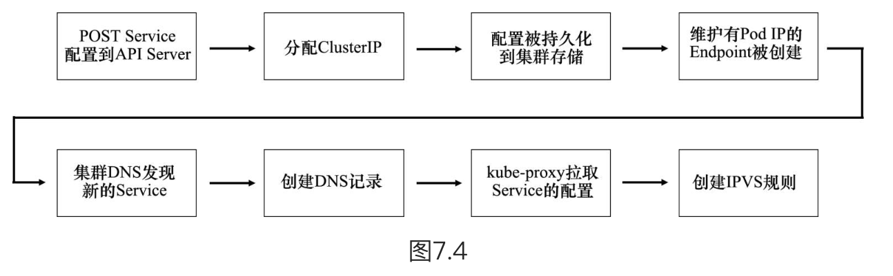

- 《Kubernetes实战》
  collapsed:: true
	- 第一章 Kubernetes介绍
	  collapsed:: true
		- 单体应用部署遇到的问题
		- 微服务应用部署遇到的问题
		- 容器技术
		  collapsed:: true
			- Linux的Namespace技术
				- `Namespace`的作用是环境隔离，它让应用程序只看到该`Namespace`内的世界，诸如文件系统、用户ID、网络接口等。
				- 命名空间
					- 每个容器都有自己单独的命名空间，运行在其中的应用都像是在独立的操作系统中运行一样。命名空间保证了容器之间彼此互不影响。
				- docker容器化借助Liunx六种命名空间实现相应资源的隔离
					- network命名空间，隔离网络资源
						- network namespace 是实现网络虚拟化的重要功能，它能创建多个隔离的网络空间，它们有独自的网络栈信息。不管是虚拟机还是容器，运行的时候仿佛自己就在独立的网络中。
					- UTS命名空间，隔离主机名和域名
						- UTS("UNIX Time-sharing System") 命名空间允许每个容器拥有独立的 hostname 和 domain name， 使其在网络上可以被视作一个独立的节点而非 主机上的一个进程。
					- IPC命名空间，进程间通信的隔离
						- IPC是进程间通信(Inter-Process Communication)的缩写。
						- IPC namespace 用来隔离 System V IPC 对象和 POSIX message queues。其中 System V IPC 对象包含共享内存、信号量和消息队列。
						- 容器中进程交互还是采用了 Linux 常见的进程间交互方法(interprocess communication - IPC)， 包括信号量、消息队列和共享内存等。
					- PID命名空间，隔离进程ID
						- PID Namespace对进程PID重新标号，即不同的Namespace下的进程可以有同一个PID，PID 命名空间实现的容器可在主机之间迁移，并保持容器内的进程 ID 不变。
					- MNT命名空间，隔离文件系统挂载点
						- mnt 命名空间允许不同命名空间的进程看到的文件结构不同，这样每个命名空间 中的进程所看到的文件目录就被隔离开了。
					- user命名空间，隔离用户和用户组
						- 每个容器可以有不同的用户和组 id， 也就是说可以在容器内用容器内部的用户执行程序而非主机上的用户。
			- Linux的Cgroups技术
				- Cgroups 的作用是限制分配给进程的宿主机资源，诸如CPU、内存和网络带宽等。
				- 用于限制和隔离一组进程对系统资源的使用。
		- Kubernetes的作用
		  collapsed:: true
			- 为应用的开发和部署提供一致的系统环境，包括网络，依赖，系统配置等。
			- 让开发人员专注应用开发，让运维人员专注系统基础设施的维护。
		- 容器技术的介绍
			- Kubernetes使用Linux容器技术来提供应用的隔离，现有的容器技术有docker和rkt。
	- 第二章 开始使用Kubernetes和docker
	  collapsed:: true
		- 3.在Kubernetes上运行第一个应用
			- Pod的介绍
				- 一个工作节点上可以运行多个Pod，一个Pod上面可以运行多个容器，每个容器是一个进程。
				- kubernetes的基本构件是Pod。
			- ReplicationController
				- ReplicationController用于复制Pod，即创建Pod的多个副本，并让他们保持运行。
	- 第三章 pod：运行于kubernetes中的容器
	  collapsed:: true
		- 1.介绍Pod
			- 一个Pod总是运行在一个工作节点上，他不会跨越多个工作节点。
			- 一个Pod中应该包含一个容器还是多个容器。
			- 同一Pod内的多个容器可以资源共享
				- Pod内的多个容器运行在**相同的Network命名空间**下，所以他们共享相同的IP地址和端口空间，当然也包括loopback接口，我们在容器中可以通过localhost加端口访问不同容器中的应用程序。
				- Pod内的多个容器运行在**相同的IPC命名空间**下，因此他们可以利用IPC进行通信。
				- **PID命名空间**也是可以共享的，但是默认是关闭的。
				- 默认情况下每个容器的**文件资源是隔离的**，但是我们可以通过k8s的`Volume`来共享文件目录。
			- 不同节点的Pod都可以通过ip地址实现互相访问，因为他们在一个无NAT（网络地址转换）的平坦网络中。
			- 尽量将一个容器运行在一个pod上。
				- 这样做有助于提高基础资源的利用率。
				- pod是扩缩容的基本单位，所以这样做方便进行扩缩容。
		- 2.通过yaml或是json描述文件创建Pod
			- Pod描述文件的主要部分
			  collapsed:: true
				- *metadata*：包括名称、命名空间、标签和关于该容器的其他信息。
				- *spec*：包含 Pod 内容的实际说明，例如Pod的容器、卷和其他数据。
				- *status*：包含运行中pod的当前信息。在创建新的Pod时，这部分信息不需要定义。
			- 通过`kubectl explain pods`或是`kubectl explain pods.spec`来查看pod的描述信息。
			- 为pod创建一个简单的yaml描述文件
			  collapsed:: true
				- 代码
				  ```yaml
				  apiVersion: v1
				  kind: Pod
				  metadata:
				  	name: kubia-biz
				  spec:
				      containers:
				      - images: luksa/kubia
				        name: kubia
				        ports:
				        - containerPort: 8080
				          protocol: TCP
				  ```
			- 使用`kubectl create`创建一个Pod
			- 查看Pod中的应用日志
				-
			- 向Pod发送请求
		- k8s的命名空间
			- 作用
			  collapsed:: true
				- 使用命名空间对k8s中的对象进行分组，并为分组中的对象提供一个作用域。如果未明确指定命名空间，默认为default命名空间。
				- 命名空间的主要作用是用来实现多套环境的资源隔离，或者说是多租户的资源隔离。
				- 命名空间允许你对指定命名空间下的对象进行操作。
			- 创建命名空间
			  collapsed:: true
				- 可以通过yaml配置和命令的方式创建命名空间。
			- 管理其他命名空间中的对象
			  collapsed:: true
				- 命名空间的切换
				- 在创建的命名空间中创建资源
			- 命名空间提供的隔离
			  collapsed:: true
				- 命名空间并不是开箱即用的，不同命名空间pod的互相通信不受命名空间的约束，这个取决于k8s所采用的网络策略。
			- 涉及到的相关命令
				- 查询集群中所有的命名空间：`kubectl get namespace`
				- 查看指定命名空间下的pod：
					- `kubectl get po --namespace <命名空间名称>`
					- `kubectl get po --n <命名空间名称>`
				- 创建命名空间的命令：
					- 使用yaml：`kubectl create -f custom-namespace.yaml`
					- 使用命令：`kubectl create namespace custom-namespace`
	- 第七章 ConfigMap和Secret：配置应用程序
	  collapsed:: true
		- 参考文章
			- [K8s 集群使用 ConfigMap 优雅加载 Spring Boot 配置文件](https://blog.csdn.net/aixiaoyang168/article/details/90116097#1Spring_Boot__1)
	- 第14章 计算资源管理
	  collapsed:: true
		- 申请资源
			- 一个例子
				- ```yaml
				    resources:
				    	requests:
				        	cpu: 200m # 容器申请了200毫核（即一个CPU核心时间的1/5）
				            memory: 10Mi # 容器申请了10MB的内存
				    ```
			- 若不指定requests，表示我们不关系系统为容器内的进程分配了多少CPU时间，最坏的情况下进程可能分不到CPU时间。
			- 调度器如何判断一个pod是否可以调度到某个节点
				- 通过设置资源requests，来指定pod对资源需求的最小值。
				- 调度器在将pod调度到节点的过程中，只会调度**未分配资源量大于pod需求量**的节点，否则说明该节点没有能力提供pod对资源的最小使用量，就不会将该pod调度到这个节点。
			- 调度器如何利用pod requests为其选择最佳的节点
				- 调度器根据优先级函数来进行判定
					- LeastRequestedPriority：优先将pod分配到拥有**更多未分配资源**的节点。
					- MostRequestedPriority：优先将pod分配到拥有**更少未分配资源**的节点。
			- 查看节点的资源总量
				- 查看节点的资源总量和可分配资源命令：`kubectl describe nodes`。
				- 查看节点已分配的资源：`kubectl describe node`。
			- CPU requests如何影响CPU的时间分配
				- CPU request不仅影响资源调度时的逻辑，还会决定剩余（未使用）的CPU时间是如何分配的。
				- 比如：假设在不设置limits限制时，A pod调度时请求了200毫核的CPU，B pod调度时请求了400毫核的CPU，那么该节点剩余的CPU则会按照1:2的比例来分配给这两个pod来使用。
		- 限制资源
			- 通过限制容器的可用资源，可以指定容器消耗资源的最大量。
			- CPU是一种可压缩资源，意味着我们可以在保证容器内进程正常运行的同时，对其使用量进行限制。
			- 内存是一种不可压缩资源，一旦操作系统Wie进程分配了一块内存，在这块内存主动释放之前是无法回收的。
				- 这是我们限制容器的最大内存分配量的根本原因。
				- 如果不限制内存的最大分配量，工作节点上的pod（容器）可能会吃掉所有的可用内存，对该节点上运行的其他pod和新调度的pod造成影响。
			- 一个例子
				- ```yaml
				    resources:
				    	limits:
				        	cpu: 1 # 容器允许最大只能使用1核的CPU
				            memory: 20Mi # 容器允许最大使用20MB内存
				    ```
			- limits可以超卖
				- 资源limits不受节点剩余可分配资源的限制，可以允许设置超过节点100%内存使用量的内存。
				- 这会导致一些容器被杀掉。
			- 容器中的应用是如何看待limits的
				- 在容器内看到的始终是节点的内存，而不是容器本身的内存。
				- 在容器内看到的是节点所有的CPU，而不是容器本省的CPU。
		- pod Qos等级
		    collapsed:: true
			- QoS（Quality of Service），大部分译为 “服务质量等级”，又译作 “服务质量保证”，是作用在 Pod 上的一个配置，当 Kubernetes 创建一个 Pod 时，它就会给这个 Pod 分配一个 QoS 等级。
- 《Kubernetes修炼手册》
  collapsed:: true
	- 第二章 Kubernetes
	  collapsed:: true
		- *Kubernetes*
			- 功能：负责应用的部署和管理。
			- 组成
				- 主节点
					- Kubernetes的主节点（master）是组成集群的控制平面的系统服务的集合。
					- 组成
						- API Server
							- API Server（API服务）是Kubernetes的中央车站。所有组件之间的通信，都需要通过API Server来完成。
						- 集群存储
							- 在整个控制层中，只有集群存储是有状态（stateful）的部分，它持久化地存储了整个集群的配置与状态。
							  id:: 64a3de66-2124-4341-ad45-112ae95baf5c
							- 通常集群存储底层会选用一种常见的分布式数据库etcd。
						- controller管理器
							- controller管理器实现了全部的后台控制循环，完成对集群的监控并对事件作出响应。
							- controller管理器是controller的管理者（controller of controller），负责创建controller，并监控它们的执行。
						- 调度器
							- 调度器的职责就是通过监听API Server来启动新的工作任务，并将其分配到适合的且处于正常运行状态的节点中。
						- 云controller管理器
							- 云controller管理器负责集成底层的公有云服务
				- 工作节点
					- 功能
						- 监听API Server分派的新任务。
						- 执行新分派的任务。
						- 向控制平面回复任务执行的结果（通过API Server）。
					- 组成
						- Kubelet
							- 功能：负责监听API Server新分配的任务。每当其监听到一个任务时，Kubelet就会负责执行该任务，并维护与控制平面之间的一个通信频道，准备将执行结果反馈回去。
						- 容器运行时
							- 功能：执行依赖容器才能执行的任务，例如拉取镜像并启动或停止容器。
						- kube-proxy
							- 功能：kube-proxy运行在集群中的每个工作节点，负责本地集群网络。
		- *Pod*
			- Pod是Kubernetes调度的原子单位。
			- Pod是一种包含了一个或多个容器的结构。
			- Pod是一个用于运行容器的有限制的环境。
			- Kubernetes中最小的调度单元也是Pod。
			- 一个Pod只会被唯一的工作节点调度。这一点对于多容器Pod来说也是一样的，一个多容器Pod中的全部容器都会运行在相同的工作节点上。
			- 对于存在强绑定关系的多个容器部署在同一个Pod，比如需要共享内存与存储，多容器Pod就是一个非常完美的选择。否则尽量在一个Pod上只部署一个容器。
			- 更确切地说，**一个Pod就是由一个或多个容器共享的运行环境。**
		- *Development*
			- 是Pod的更高一层封装。
			- 提供了如扩缩容管理、不停机更新以及版本控制等其他特性。
		- *Service*
			- 一个稳定的网络终端，提供了基组动态Pod集合的TCP以及UDP负载均衡能力。
			- Service使用标签（label）与一个标签选择器（label selector）来决定应当将流量负载均衡到哪一个Pod集合。
			- 鉴于Pod这种天生不稳定的特性，Kubernetes通过使用Service对象来为一组Pod提供固定的名称、IP地址和端口。客户端通过连接Service对象，来进一步以负载均衡的方式连接到目标Pod。
	- 第四章 Pod的使用
	  collapsed:: true
		- Pod的清单文件分析
			- 4个顶级资源
				- *apiVersion*
					- 用于创建部署对象的API组和API版本，其中API组可以忽略，版本默认是v1。
				- *kind*
					- 指定Kubernetes要部署的对象类型。
					- 这里的值可能是`Pod`，`Deployment`，`Service`
				- *metadata*
					- 用于定义名称、命名空间、标签和关于该容器的其他信息。其中标签就是简单的键值对。
				- *spec*
					- 用于定义Pod所运行的容器。
	- 第五章 Kubernetes Deployment
		- 部署*Deployment*对象
	- 第六章 Kubernetes Service
		- 背景
			- Pod的IP地址是不可靠的。在某个Pod失效之后，它会被一个拥有新的IP的Pod代替。Deployment扩容也会引入拥有新IP的Pod；而缩容则会删除Pod。这会导致大量的IP流失，因而Pod的IP地址是不可靠的。
		- 关于Service
			- 一个Kubernetes Service是指我们在部署文件中定义的API中的一个REST对象，最终需要POST到API Server。
			- 每一个Service都拥有固定的IP地址、固定的DNS名称，以及固定的端口。
			- Service利用Label来动态选择将流量转发至哪些Pod。
		- Service的原理
			- 可以将Service理解为具有固定的前端和动态的后端的中间层。所谓前端，主要由IP、DNS名称和端口组成，始终不变；而后端，则主要由一系列的Pod构成，会时常发生变化。
			- Service的标签选择器
			- Service与Endpoint对象之间的关系
				- Endpoint对象
				  collapsed:: true
					- 整个Endpoint对象其实就是一个动态的列表，其中包含集群中所有的匹配Service Label筛选器的健康Pod。
				- Service会动态更新其维护的相匹配的健康Pod列表。具体来说，其中的匹配关系是通过Label筛选器和名为Endpoint对象的结构共同完成的。
			- 从集群内部访问Service
				- Service的默认类型是*ClusterIP*
				- 集群中的Pod能够从集群内部的DNS服务中知道Service的名称，能够解析对应的ClusterIP，进而连接到所需的Pod。
			- 从集群外部访问Service
				- Service的另一种类型叫做*NodePort Service*，它在ClusterIP的基础上增加了从集群外部访问的可能。
		- Service的服务发现
			- 两种方式
				- DNS（推荐）
					- DNS插件可以自动检测集群中Service的动向。
				- 环境变量（绝对不推荐）
					- 环境变量只有在Pod最初创建的时候才会被注入，没有自动检测Service的功能。
		- Service的另一个功能
			- 支持多种运维操作：红蓝发布、金丝雀发布等，简单而强大。
		- Service推荐使用声明式的方式去使用，不推荐命令式。
	- 第七章 Kubernetes的服务发现
		- Kubernetes *Service*服务注册的过程
			- 注册过程中涉及到的组件有
				- Kubernetes中内部的一个DNS服务作为注册中心。
				- 服务是基于DNS注册的（而非具体的Pod）。
				- 每个服务的名称、IP地址和网络端口都会被注册。
			- 注册流程总结，主要分为服务前端和后端两部分的注册过程
			  
		- Kubernetes服务发现的过程
			-
- kubectl的命令
  collapsed:: true
	- kubectl
	  collapsed:: true
		- kubectl是在进行Kubernetes管理的过程中使用的主要命令行工具。
		- kubectl的作用是将对用户友好的命令转换成API Server所能理解的JSON格式。它基于一个配置文件来决定将其POST到哪个集群的API Server。
	- `kubectl get pods`
	  collapsed:: true
		- 查看Pod信息。
		- 拓展命令
			- `-o wide`：能够多输出几列信息。
			- `-o yaml`：能够返回集群存储中的一份完整的关于Pod的yaml清单。
			- `-o json`：返回pod的json格式定义清单。
	- `kubectl get services`
	- `kubectl get ReplicationControllers`
	- `kubectl get rs`
	  collapsed:: true
		- 查看ReplicaSet。
	- `kubectl get Pods <pod名称> -o yaml`
		- 获取pod完整的YAML定义。
	- `kubectl create -f <pod描述文件.yaml>`
	  collapsed:: true
		- 用于从yaml或是json文件中创建pod。
	- `kubectl log <pod名称>`
	  collapsed:: true
		- 容器化的应用程序会将日志记录到标准输出和标准错误流，而不是写入文件。
		- 我们可以通过上述命令查看Pod的日志。
	- `kubectl log <pod名称> -c <容器名称>`
	  collapsed:: true
		- 获取多容器Pod的日志时指定容器名称。
		- 值得注意的是这个命令只能获取仍然存在于pod中的日志。
	- `kubectl port-forward <pod名称> 8888:8080`
	  collapsed:: true
		- 将请求本地8888端口的请求转发到Pod的8080端口上。
	- `kubectl apply -f Pod.yml`
	  collapsed:: true
		- 将清单文件发送到API Server。
	- `kubectl describe Pods <pod名称>`
		- 该命令会打印出所查看对象的总览信息，其多行格式易于阅读。内容中还包含对象的重要的生命周期事件。
	- `kubectl exec`
	  collapsed:: true
		- 功能：在Pod中执行命令。
		- `-it`
		  collapsed:: true
			- 参数`-it`的作用在于使exec的会话成为交互式（interactive）的，并且把当前终端的STDIN和STDOUT与Pod中第一个容器的STDIN和STDOUT连接起来。
	- `kubectl rollout`
	  collapsed:: true
		- 回滚版本。
	- `kubectl delete`
	  collapsed:: true
		- 删除部署的服务。
	- `kubectl expose`
	  collapsed:: true
		- 创建一个新的Service
	- `kubectl explain`
	  collapsed:: true
		- 通过该命令我们可以查看每个API对象支持哪些属性，比如查看pods的属性，可以使用`kubectl explain pods`
	- `kubectl create`
	  collapsed:: true
		- 可以使用该命令来创建pod。
		- 拓展命令
			- `-f xxx.yaml`：指定yaml或是json的配置文件。
			-
- 比较好的博客文章
  collapsed:: true
	- [一文带你了解虚拟化、虚拟机、Docker及裸金属服务器](https://www.a-programmer.top/2022/07/23/%E4%B8%80%E6%96%87%E5%B8%A6%E4%BD%A0%E4%BA%86%E8%A7%A3%E8%99%9A%E6%8B%9F%E5%8C%96%E3%80%81%E8%99%9A%E6%8B%9F%E6%9C%BA%E3%80%81Docker%E5%8F%8A%E8%A3%B8%E9%87%91%E5%B1%9E%E6%9C%8D%E5%8A%A1%E5%99%A8/)
- youtube k8s
  collapsed:: true
	- Kubernetes的官方定义
		- 开源的容器编排工具
		- google
	- Kubernetes解决了什么问题
	- 编排工具提供了哪些功能
		-
- K8s中的pod和docker中的容器是什么关系
  collapsed:: true
	- docker中的容器是镜像运行的实体，docker中的镜像和实体类似于Java中的类和对象的关系。
	- k8s中的pod相当于一个逻辑主机，可以在这里运行一个或多个容器。
	- [kubernetes——pod和docker容器的关系](https://juejin.cn/user/4353721777532574/posts)
- 存储卷的作用
	- 存储卷的原理是将外部存储设备（如云硬盘、NFS 等）或本地文件系统挂载到容器内部，使得容器可以像使用本地文件系统一样访问和修改存储卷中的数据。这样即使容器被重新调度或重新启动，存储卷中的数据仍然可以保持不变。