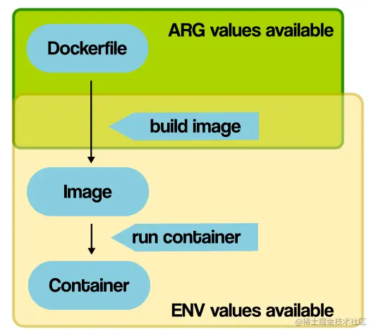

- 《Kubernetes实战》
	- 第一章 Kubernetes介绍
		- 单体应用部署遇到的问题
		- 微服务应用部署遇到的问题
		- 容器技术
		  collapsed:: true
			- Linux的Namespace技术
				- `Namespace`的作用是环境隔离，它让应用程序只看到该`Namespace`内的世界，诸如文件系统、用户ID、网络接口等。
				- 命名空间
					- 每个容器都有自己单独的命名空间，运行在其中的应用都像是在独立的操作系统中运行一样。命名空间保证了容器之间彼此互不影响。
				- docker容器化借助Liunx六种命名空间实现相应资源的隔离
					- network命名空间，隔离网络资源
						- network namespace 是实现网络虚拟化的重要功能，它能创建多个隔离的网络空间，它们有独自的网络栈信息。不管是虚拟机还是容器，运行的时候仿佛自己就在独立的网络中。
					- UTS命名空间，隔离主机名和域名
						- UTS("UNIX Time-sharing System") 命名空间允许每个容器拥有独立的 hostname 和 domain name， 使其在网络上可以被视作一个独立的节点而非 主机上的一个进程。
					- IPC命名空间，进程间通信的隔离
						- IPC是进程间通信(Inter-Process Communication)的缩写。
						- IPC namespace 用来隔离 System V IPC 对象和 POSIX message queues。其中 System V IPC 对象包含共享内存、信号量和消息队列。
						- 容器中进程交互还是采用了 Linux 常见的进程间交互方法(interprocess communication - IPC)， 包括信号量、消息队列和共享内存等。
					- PID命名空间，隔离进程ID
						- PID Namespace对进程PID重新标号，即不同的Namespace下的进程可以有同一个PID，PID 命名空间实现的容器可在主机之间迁移，并保持容器内的进程 ID 不变。
					- MNT命名空间，隔离文件系统挂载点
						- mnt 命名空间允许不同命名空间的进程看到的文件结构不同，这样每个命名空间 中的进程所看到的文件目录就被隔离开了。
					- user命名空间，隔离用户和用户组
						- 每个容器可以有不同的用户和组 id， 也就是说可以在容器内用容器内部的用户执行程序而非主机上的用户。
			- Linux的Cgroups技术
				- Cgroups 的作用是限制分配给进程的宿主机资源，诸如CPU、内存和网络带宽等。
				- 用于限制和隔离一组进程对系统资源的使用。
		- Kubernetes的作用
		  collapsed:: true
			- 为应用的开发和部署提供一致的系统环境，包括网络，依赖，系统配置等。
			- 让开发人员专注应用开发，让运维人员专注系统基础设施的维护。
		- 容器技术的介绍
			- Kubernetes使用Linux容器技术来提供应用的隔离，现有的容器技术有docker和rkt。
	- 第二章 开始使用Kubernetes和docker
	  collapsed:: true
		- 3.在Kubernetes上运行第一个应用
			- Pod的介绍
				- 一个工作节点上可以运行多个Pod，一个Pod上面可以运行多个容器，每个容器是一个进程。
				- kubernetes的基本构件是Pod。
			- ReplicationController
				- ReplicationController用于复制Pod，即创建Pod的多个副本，并让他们保持运行。
	- 第三章 pod：运行于kubernetes中的容器
		- 1.介绍Pod
			- 一个Pod总是运行在一个工作节点上，他不会跨越多个工作节点。
			- 一个Pod中应该包含一个容器还是多个容器。
			- 同一Pod内的多个容器可以资源共享
				- Pod内的多个容器运行在**相同的Network命名空间**下，所以他们共享相同的IP地址和端口空间，当然也包括loopback接口，我们在容器中可以通过localhost加端口访问不同容器中的应用程序。
				- Pod内的多个容器运行在**相同的IPC命名空间**下，因此他们可以利用IPC进行通信。
				- **PID命名空间**也是可以共享的，但是默认是关闭的。
				- 默认情况下每个容器的**文件资源是隔离的**，但是我们可以通过k8s的`Volume`来共享文件目录。
			- 不同节点的Pod都可以通过ip地址实现互相访问，因为他们在一个无NAT（网络地址转换）的平坦网络中。
			- 尽量将一个容器运行在一个pod上。
				- 这样做有助于提高基础资源的利用率。
				- pod是扩缩容的基本单位，所以这样做方便进行扩缩容。
		- 2.通过yaml或是json描述文件创建Pod
			- Pod描述文件的主要部分
			  collapsed:: true
				- *metadata*：包括名称、命名空间、标签和关于该容器的其他信息。
				- *spec*：包含 Pod 内容的实际说明，例如Pod的容器、卷和其他数据。
				- *status*：包含运行中pod的当前信息。在创建新的Pod时，这部分信息不需要定义。
			- 通过`kubectl explain pods`或是`kubectl explain pods.spec`来查看pod的描述信息。
			- 为pod创建一个简单的yaml描述文件
			  collapsed:: true
				- 代码
				  ```yaml
				  apiVersion: v1
				  kind: Pod
				  metadata:
				  	name: kubia-biz
				  spec:
				      containers:
				      - images: luksa/kubia
				        name: kubia
				        ports:
				        - containerPort: 8080
				          protocol: TCP
				  ```
			- 使用`kubectl create`创建一个Pod
			- 查看Pod中的应用日志
				-
			- 向Pod发送请求
		- k8s的命名空间
			- 作用
			  collapsed:: true
				- 使用命名空间对k8s中的对象进行分组，并为分组中的对象提供一个作用域。如果未明确指定命名空间，默认为default命名空间。
				- 命名空间的主要作用是用来实现多套环境的资源隔离，或者说是多租户的资源隔离。
				- 命名空间允许你对指定命名空间下的对象进行操作。
			- 创建命名空间
			  collapsed:: true
				- 可以通过yaml配置和命令的方式创建命名空间。
			- 管理其他命名空间中的对象
			  collapsed:: true
				- 命名空间的切换
				- 在创建的命名空间中创建资源
			- 命名空间提供的隔离
			  collapsed:: true
				- 命名空间并不是开箱即用的，不同命名空间pod的互相通信不受命名空间的约束，这个取决于k8s所采用的网络策略。
			- 涉及到的相关命令
				- 查询集群中所有的命名空间：`kubectl get namespace`
				- 查看指定命名空间下的pod：
					- `kubectl get po --namespace <命名空间名称>`
					- `kubectl get po --n <命名空间名称>`
				- 创建命名空间的命令：
					- 使用yaml：`kubectl create -f custom-namespace.yaml`
					- 使用命令：`kubectl create namespace custom-namespace`
- 《Kubernetes修炼手册》
  collapsed:: true
	- 第二章 Kubernetes
	  collapsed:: true
		- *Kubernetes*
			- 功能：负责应用的部署和管理。
			- 组成
				- 主节点
					- Kubernetes的主节点（master）是组成集群的控制平面的系统服务的集合。
					- 组成
						- API Server
							- API Server（API服务）是Kubernetes的中央车站。所有组件之间的通信，都需要通过API Server来完成。
						- 集群存储
							- 在整个控制层中，只有集群存储是有状态（stateful）的部分，它持久化地存储了整个集群的配置与状态。
							  id:: 64a3de66-2124-4341-ad45-112ae95baf5c
							- 通常集群存储底层会选用一种常见的分布式数据库etcd。
						- controller管理器
							- controller管理器实现了全部的后台控制循环，完成对集群的监控并对事件作出响应。
							- controller管理器是controller的管理者（controller of controller），负责创建controller，并监控它们的执行。
						- 调度器
							- 调度器的职责就是通过监听API Server来启动新的工作任务，并将其分配到适合的且处于正常运行状态的节点中。
						- 云controller管理器
							- 云controller管理器负责集成底层的公有云服务
				- 工作节点
					- 功能
						- 监听API Server分派的新任务。
						- 执行新分派的任务。
						- 向控制平面回复任务执行的结果（通过API Server）。
					- 组成
						- Kubelet
							- 功能：负责监听API Server新分配的任务。每当其监听到一个任务时，Kubelet就会负责执行该任务，并维护与控制平面之间的一个通信频道，准备将执行结果反馈回去。
						- 容器运行时
							- 功能：执行依赖容器才能执行的任务，例如拉取镜像并启动或停止容器。
						- kube-proxy
							- 功能：kube-proxy运行在集群中的每个工作节点，负责本地集群网络。
		- *Pod*
			- Pod是Kubernetes调度的原子单位。
			- Pod是一种包含了一个或多个容器的结构。
			- Pod是一个用于运行容器的有限制的环境。
			- Kubernetes中最小的调度单元也是Pod。
			- 一个Pod只会被唯一的工作节点调度。这一点对于多容器Pod来说也是一样的，一个多容器Pod中的全部容器都会运行在相同的工作节点上。
			- 对于存在强绑定关系的多个容器部署在同一个Pod，比如需要共享内存与存储，多容器Pod就是一个非常完美的选择。否则尽量在一个Pod上只部署一个容器。
			- 更确切地说，**一个Pod就是由一个或多个容器共享的运行环境。**
		- *Development*
			- 是Pod的更高一层封装。
			- 提供了如扩缩容管理、不停机更新以及版本控制等其他特性。
		- *Service*
			- 一个稳定的网络终端，提供了基组动态Pod集合的TCP以及UDP负载均衡能力。
			- Service使用标签（label）与一个标签选择器（label selector）来决定应当将流量负载均衡到哪一个Pod集合。
			- 鉴于Pod这种天生不稳定的特性，Kubernetes通过使用Service对象来为一组Pod提供固定的名称、IP地址和端口。客户端通过连接Service对象，来进一步以负载均衡的方式连接到目标Pod。
	- 第四章 Pod的使用
	  collapsed:: true
		- Pod的清单文件分析
			- 4个顶级资源
				- *apiVersion*
					- 用于创建部署对象的API组和API版本，其中API组可以忽略，版本默认是v1。
				- *kind*
					- 指定Kubernetes要部署的对象类型。
					- 这里的值可能是`Pod`，`Deployment`，`Service`
				- *metadata*
					- 用于定义名称、命名空间、标签和关于该容器的其他信息。其中标签就是简单的键值对。
				- *spec*
					- 用于定义Pod所运行的容器。
	- 第五章 Kubernetes Deployment
		- 部署*Deployment*对象
	- 第六章 Kubernetes Service
		- 背景
			- Pod的IP地址是不可靠的。在某个Pod失效之后，它会被一个拥有新的IP的Pod代替。Deployment扩容也会引入拥有新IP的Pod；而缩容则会删除Pod。这会导致大量的IP流失，因而Pod的IP地址是不可靠的。
		- 关于Service
			- 一个Kubernetes Service是指我们在部署文件中定义的API中的一个REST对象，最终需要POST到API Server。
			- 每一个Service都拥有固定的IP地址、固定的DNS名称，以及固定的端口。
			- Service利用Label来动态选择将流量转发至哪些Pod。
		- Service的原理
			- 可以将Service理解为具有固定的前端和动态的后端的中间层。所谓前端，主要由IP、DNS名称和端口组成，始终不变；而后端，则主要由一系列的Pod构成，会时常发生变化。
			- Service的标签选择器
			- Service与Endpoint对象之间的关系
				- Endpoint对象
				  collapsed:: true
					- 整个Endpoint对象其实就是一个动态的列表，其中包含集群中所有的匹配Service Label筛选器的健康Pod。
				- Service会动态更新其维护的相匹配的健康Pod列表。具体来说，其中的匹配关系是通过Label筛选器和名为Endpoint对象的结构共同完成的。
			- 从集群内部访问Service
				- Service的默认类型是*ClusterIP*
				- 集群中的Pod能够从集群内部的DNS服务中知道Service的名称，能够解析对应的ClusterIP，进而连接到所需的Pod。
			- 从集群外部访问Service
				- Service的另一种类型叫做*NodePort Service*，它在ClusterIP的基础上增加了从集群外部访问的可能。
		- Service的服务发现
			- 两种方式
				- DNS（推荐）
					- DNS插件可以自动检测集群中Service的动向。
				- 环境变量（绝对不推荐）
					- 环境变量只有在Pod最初创建的时候才会被注入，没有自动检测Service的功能。
		- Service的另一个功能
			- 支持多种运维操作：红蓝发布、金丝雀发布等，简单而强大。
		- Service推荐使用声明式的方式去使用，不推荐命令式。
	- 第七章 Kubernetes的服务发现
		- Kubernetes *Service*服务注册的过程
			- 注册过程中涉及到的组件有
				- Kubernetes中内部的一个DNS服务作为注册中心。
				- 服务是基于DNS注册的（而非具体的Pod）。
				- 每个服务的名称、IP地址和网络端口都会被注册。
			- 注册流程总结，主要分为服务前端和后端两部分的注册过程
			  
		- Kubernetes服务发现的过程
			-
- kubectl的命令
  collapsed:: true
	- kubectl
	  collapsed:: true
		- kubectl是在进行Kubernetes管理的过程中使用的主要命令行工具。
		- kubectl的作用是将对用户友好的命令转换成API Server所能理解的JSON格式。它基于一个配置文件来决定将其POST到哪个集群的API Server。
	- `kubectl get pods`
		- 查看Pod信息。
		- 拓展命令
			- `-o wide`：能够多输出几列信息。
			- `-o yaml`：能够返回集群存储中的一份完整的关于Pod的yaml清单。
			- `-o json`：返回pod的json格式定义清单。
	- `kubectl get services`
	- `kubectl get ReplicationControllers`
	- `kubectl get rs`
	  collapsed:: true
		- 查看ReplicaSet。
	- `kubectl get Pods <pod名称> -o yaml`
		- 获取pod完整的YAML定义。
	- `kubectl create -f <pod描述文件.yaml>`
	  collapsed:: true
		- 用于从yaml或是json文件中创建pod。
	- `kubectl log <pod名称>`
	  collapsed:: true
		- 容器化的应用程序会将日志记录到标准输出和标准错误流，而不是写入文件。
		- 我们可以通过上述命令查看Pod的日志。
	- `kubectl log <pod名称> -c <容器名称>`
	  collapsed:: true
		- 获取多容器Pod的日志时指定容器名称。
		- 值得注意的是这个命令只能获取仍然存在于pod中的日志。
	- `kubectl port-forward <pod名称> 8888:8080`
	  collapsed:: true
		- 将请求本地8888端口的请求转发到Pod的8080端口上。
	- `kubectl apply -f Pod.yml`
	  collapsed:: true
		- 将清单文件发送到API Server。
	- `kubectl describe Pods <pod名称>`
		- 该命令会打印出所查看对象的总览信息，其多行格式易于阅读。内容中还包含对象的重要的生命周期事件。
	- `kubectl exec`
	  collapsed:: true
		- 功能：在Pod中执行命令。
		- `-it`
		  collapsed:: true
			- 参数`-it`的作用在于使exec的会话成为交互式（interactive）的，并且把当前终端的STDIN和STDOUT与Pod中第一个容器的STDIN和STDOUT连接起来。
	- `kubectl rollout`
	  collapsed:: true
		- 回滚版本。
	- `kubectl delete`
	  collapsed:: true
		- 删除部署的服务。
	- `kubectl expose`
	  collapsed:: true
		- 创建一个新的Service
	- `kubectl explain`
	  collapsed:: true
		- 通过该命令我们可以查看每个API对象支持哪些属性，比如查看pods的属性，可以使用`kubectl explain pods`
	- `kubectl create`
	  collapsed:: true
		- 可以使用该命令来创建pod。
		- 拓展命令
			- `-f xxx.yaml`：指定yaml或是json的配置文件。
			-
- docker
  collapsed:: true
	- docker的三个概念
	  collapsed:: true
		- 镜像（image）：镜像中包含了应用软件运行的基础设施和应用软件本身。镜像的名称一般由`镜像名:TAG`组成。
		- 容器（container）：容器是镜像创建的运行实例。
		- 仓库（Repository）：存放镜像的仓库，类似与Maven的仓库。
	- 构建镜像的两种方式
	  collapsed:: true
		- 一基于现有镜像启动一个容器，然后利用容器创建一个新的镜像
		  collapsed:: true
			- 启动现有镜像：`docker run -it $image_name /bin/bash`
			  logseq.order-list-type:: number
			- 对现有镜像进行修改，例如安装一个新的软件到镜像中。
			  logseq.order-list-type:: number
			- 根据容器的更改创建新映像：`docker commit -m "$commit messages" -a "$作者的用户名" $容器id $新的镜像名`
			  logseq.order-list-type:: number
		- 二利用Dockerfile创建镜像
		  collapsed:: true
			- 构建命令：`docker build -t $image_name -f $Dockerfile_path`
	- 容器的基本操作
	  collapsed:: true
		- 基于镜像启动容器：`docker run -it 镜像名称/镜像tag /bin/bash`
		  collapsed:: true
			- `-i`：表示打开并保持标准输出。
			- `-t`：分配一个终端。
		- 后台启动容器：`docker run -dit 镜像名称/镜像tag /bin/bash`
		  collapsed:: true
			- `-d`：使这个容器处于后台运行的状态，不会对当前终端产生任何输出，所有的stdout都输出到log，可以使用`docker logs container_name或container_id`查看。
		- 启动容器命令：`docker start container_name或container_id`
		- 停止容器命令：`docker stop container_name或container_id`
		- 重启容器命令：`docker restart container_name或container_id`
		- 启动容器之后想进入容器，输入命令：`docker attach container_name或container_id`
		- 删除容器：`docker rm container_name或container_id`
	- 仓库的基本操作
	  collapsed:: true
		- 注册[docker hub](https://hub.docker.com/)公共仓库
		- 登录，命令`docker login $address -u$username $password`
		- 推送本地仓库镜像到远程仓库：`docker push $image_name`
		- 拉取远程仓库镜像到本地：`docker pull $image_name`
		- 更新镜像的两种方式，与创建镜像的两种方式一样
		  collapsed:: true
			- 创建容器之后做更改，之后commit生成镜像，然后push到仓库中。
			- 更新Dockerfile。在工作时一般建议这种方式，更简洁明了。
	- 容器中的数据管理
	  collapsed:: true
		- 数据卷
		  collapsed:: true
			-
		- 数据卷容器
		  collapsed:: true
			-
	- Dockerfile
	  collapsed:: true
		- 命令参数
		  collapsed:: true
			- `FROM`：构建镜像基于哪个镜像。
			  collapsed:: true
				- 作用：定制的镜像都是基于 FROM 的镜像，通过这个命令指定基础镜像。
				- 命令格式：`FROM 基础镜像`
			- `RUN`：构建镜像时运行的指令。
			  collapsed:: true
				- 作用：用于执行后面跟着的命令行命令。
				- **值得注意**的是docker每运行一次`RUN`命令都会在镜像文件上新建一层，使用多条RUN命令会造成镜像文件过大。建议多条`RUN`命令使用`&&`连接为一条指令，这样只会创建一层镜像。
				- 命令格式
				  collapsed:: true
					- shell命令：`RUN <shell命令>`
					  logseq.order-list-type:: number
					- 可执行文件：`RUN ["可执行文件", "参数1", "参数2"]`
					  logseq.order-list-type:: number
			- `CMD`：运行容器时执行的shell环境。
			  collapsed:: true
				- 作用：为启动的容器指定默认要运行的程序，程序运行结束，容器也就结束。`CMD`指令指定的程序可被`docker run`命令行参数中指定要运行的程序所覆盖。
				- 类似于 RUN 指令，用于运行程序，但二者运行的时间点不同。
				  collapsed:: true
					- `CMD` 在`docker run` 时运行。
					- `RUN` 是在`docker build`。
				- **注意**：如果 Dockerfile 中如果存在多个`CMD`指令，仅最后一个生效。
				- 命令格式
				  collapsed:: true
					- `CMD <shell 命令>`
					  logseq.order-list-type:: number
					- `CMD ["<可执行文件或命令>","<param1>","<param2>",...]`
					  logseq.order-list-type:: number
					- `CMD ["<param1>","<param2>",...]  # 该写法是为 ENTRYPOINT 指令指定的程序提供默认参数`
					  logseq.order-list-type:: number
			- `ENTRYPOINT`：运行容器时执行的shell命令。
			  collapsed:: true
				- 作用
				  collapsed:: true
					- 类似`CMD`指令，但其参数不会被`docker run`的命令行参数指定的指令所覆盖，其命令行参数会被当作参数送给 `ENTRYPOINT` 指令指定的程序。
					- 如果运行`docker run`时使用了`--entrypoint`选项，将覆盖`ENTRYPOINT`指令指定的程序。
				- **优点**：在执行`docker run`的时候可以指定`ENTRYPOINT`运行所需的参数。
				- **注意**：如果 Dockerfile 中如果存在多个`ENTRYPOINT`指令，仅最后一个生效。
				- 命令格式：`ENTRYPOINT ["<executeable>","<param1>","<param2>",...]`
			- `COPY`：拷贝文件或目录到容器中，跟ADD类似，但不具备自动下载或解压的功能。
			  collapsed:: true
				- 作用：复制指令，将主机上的资源复制或加入到容器镜像中，都是在构建镜像的过程中完成的。
				- 命令格式：`COPY <源路径1>...  <目标路径>`
			- `ADD`：拷贝文件或目录到容器中，如果是URL或压缩包便会自动下载或自动解压。
			  collapsed:: true
				- 作用：ADD 指令和 COPY 的使用格类似（同样需求下，官方推荐使用 COPY），功能也类似。
				- 命令格式：`ADD <源路径1>...  <目标路径>`
				- COPY指令和ADD指令的唯一区别：**是否支持从远程URL获取资源。**
				  collapsed:: true
					- `COPY`指令只能从执行docker build所在的主机上读取资源并复制到镜像中。
					- `ADD`指令还支持通过URL从远程服务器读取资源并复制到镜像中。
					- Docker开发者推荐：满足同等功能的情况下，推荐使用`COPY`指令。`ADD`指令更擅长读取本地tar文件并解压缩。
			- `ARG`：构建时指定的一些参数。
			  collapsed:: true
				- 作用：用于定义构建参数。它允许在构建镜像时从外部传递参数。
				- 当我们使用`docker build`命令构建映像时，可以使用`--build-arg`选项来传递该参数的值。例如：`docker build --build-arg VERSION=2.0 .`这里将`VERSION`参数的值设置成了2.0。
				- 如果要在dockerfile文件中使用`ARG`命令配置的参数，需要使用`$`符号，如下：
				   ```docker
				   AGR APP_NAME=my-app
				   WORKDIR $APP_NAME
				  ```
			- `ENV`：设置容器环境变量。
			  collapsed:: true
				- 作用：用于定义环境变量。这些变量在容器运行时是可用的，并且可以在容器内部的任何进程中使用。
				- `ENV`与`ARG`的区别
				  collapsed:: true
					- `ARG`和`ENV`指令的最大区别在于它们的**作用域**。`ARG`指令定义的参数**仅在构建映像期间可用**，而`ENV`指令定义的环境变量**在容器运行时可用**。因此，你可以使用`ARG`指令来**传递构建参数**，而使用`ENV`指令来**设置容器的环境变量**。
					  
			- `EXPOSE`：声明容器的服务端口（仅仅是声明）。
			  collapsed:: true
				- 作用
				  collapsed:: true
					- 声明端口，帮助镜像使用者理解这个镜像服务的守护端口，以方便配置映射。
					- 在运行时使用随机端口映射时，也就是`docker run -P`时，会自动随机映射`EXPOSE`的端口。
				- 命令格式：`EXPOSE <端口1> [<端口2>...]`
			- `WORKDIR`：为 `RUN`、`CMD`、`ENTRYPOINT`、`COPY` 和 `ADD` 设置工作目录，就是切换目录。
			  collapsed:: true
				- 作用
				  collapsed:: true
					- 指定工作目录。
					- 用`WORKDIR`指定的工作目录，会在构建镜像的每一层中都存在。`docker build`构建镜像过程中的，每一个`RUN`命令都是新建的一层。只有通过`WORKDIR`创建的目录才会一直存在。
				- 命令格式：`WORKDIR <工作目录路径>`
			- `MAINTAINER`： 镜像维护者信息。
			- `VOLUME`：定义数据卷，如果没有定义则使用默认。
			- `USER`：指定后续执行的用户组和用户。
			- `HEALTHCHECH`：健康检测指令。
		- 上下文路径
		  collapsed:: true
			- 定义：是指 docker 在构建镜像，有时候想要使用到本机的文件（比如复制），`docker build`命令得知这个路径后，会将路径下的所有内容打包。
			- 如果未说明最后一个参数，那么默认上下文路径就是 Dockerfile 所在的位置。这个参数一般在最后，比如下面的`.`
			  ```shell
			  $ docker build -t nginx:v3 .
			  ```
			- **注意**：上下文路径下不要放无用的文件，因为会一起打包发送给 docker 引擎，如果文件过多会造成过程缓慢。
	- 参考文章
	  collapsed:: true
		- [只要一小时，零基础入门Docker](https://zhuanlan.zhihu.com/p/23599229)
		- [Docker进阶：容器中的数据管理](https://zhuanlan.zhihu.com/p/23630443)
- 比较好的博客文章
  collapsed:: true
	- [一文带你了解虚拟化、虚拟机、Docker及裸金属服务器](https://www.a-programmer.top/2022/07/23/%E4%B8%80%E6%96%87%E5%B8%A6%E4%BD%A0%E4%BA%86%E8%A7%A3%E8%99%9A%E6%8B%9F%E5%8C%96%E3%80%81%E8%99%9A%E6%8B%9F%E6%9C%BA%E3%80%81Docker%E5%8F%8A%E8%A3%B8%E9%87%91%E5%B1%9E%E6%9C%8D%E5%8A%A1%E5%99%A8/)
- youtube k8s
  collapsed:: true
	- Kubernetes的官方定义
		- 开源的容器编排工具
		- google
	- Kubernetes解决了什么问题
	- 编排工具提供了哪些功能
		-