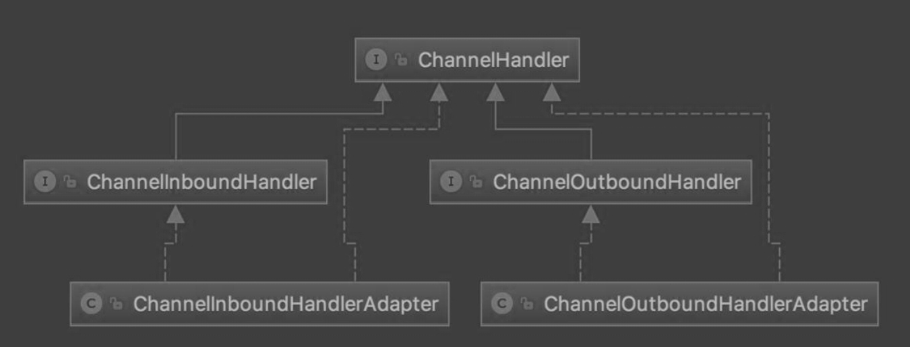
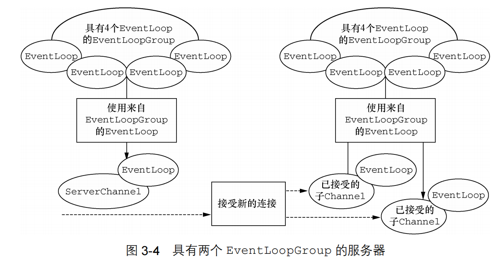

- 跟闪电侠学Netty：Netty即时聊天实战与底层原理
  collapsed:: true
	- 第四章 服务端启动流程
	  collapsed:: true
		- Netty服务端启动的流程，一句话总结就是：首先创建一个引导类，然后给它指定线程模型、IO模型、连接读写处理逻辑，绑定端口之后，服务端就启动起来了
		- 端口动态绑定
		- 其他参数配置
	- 第五章 客户端启动流程
	  collapsed:: true
		- Netty客户端启动流程，首先创建一个引导类，然后为它指定线程模型、IO模型、连接读写处理逻辑，连接上特定主机和端口后，客户端就启动起来了。
		- 设置重连次数
		- 其他参数配置
	- 第八章 客户端和服务端通讯协议编解码
	  collapsed:: true
		- 通信协议的设计
			- 示例图
			  
			- 魔数
				- 作用
					- 服务器端接收到报文之后，根据魔数字段确定是否是符合规范的报文。
					- 出于安全考虑，如果魔数校验不通过，就是无效数据包，可以关闭连接。
	- 第十一章 Pipeline和ChannelHandler
		- ChannelHandler的分类
		  collapsed:: true
			- 接口分类图
			  
		- ChannelInboundHandler
		  collapsed:: true
			- **处理读数据的逻辑**。比如在一端读到一段数据，首先要解析这段数据，然后对这段数据做一系列逻辑处理，最终把响应写到对端。在组装响应之前的所有处理逻辑，都可以放置在一系列`ChannelInboundHandler`里处理，它的一个最重要的方法就是`channelRead()`。
			- **从低到高**，可以将`ChannelInboundHandler`的逻辑处理过程与TCP的七层协议解析过程联系起来，把收到的数据一层层地从物理层上升到应用层。
			- 默认实现
				- ChannelInboundHandlerAdapter
				- SimpleChannelInboundHandler
		- ChannelOutboundHandler
		  collapsed:: true
			- **处理写数据的逻辑**，它是定义一端在组装完响应之后把数据写到对端的逻辑。比如，我们封装好一个response对象后，有可能对这个response做一些其他特殊逻辑处理，然后编码成ByteBuf，最终写到对端。它最核心的方法就是`write()`。
			- **从高到低**，可以将ChannelOutboundHandler的逻辑处理过程与TCP的七层协议封装过程联系起来。我们在应用层组装响应之后，通过层层协议的封装，直到底层的物理层。
			- 默认实现
				- ChannelOutboundHandlerAdapter
	- 第十二章 构建客户端与服务端的Pipeline
		- 基于`ByteToMessageDecoder`，可以实现自定义解码，而不用关心`ByteBuf`的强转和解码结果的传递。
		- 基于`SimpleChannelInboundHandler`，可以实现每一种指令的处理，不再需要强转，不再有冗长乏味的`if else`逻辑，不再需要手动传递对象。
		- 基于`MessageToByteEncoder`，可以实现自定义编码，不用关心`ByteBuf`的创建，不用每次向对端写Java对象都进行一次编码。
	- 第十三章 拆包/粘包理论与解决方案
		- `FixedLengthFrameDecoder`：定长消息拆包和粘包的处理类。
			- 关于`lengthAdjustment`字段的使用，参考文章：[【Netty】「优化进阶」（二）浅谈 LengthFieldBasedFrameDecoder：如何实现可靠的消息分割？](https://xie.infoq.cn/article/05b7f6179fa3167d0803080c9)
	- 第十四章 ChannelHandler的生命周期
	  collapsed:: true
		- 这一章主要讲了ChannelHandler的生命周期方法
			- handlerAdded()：当检测到新连接之后。
			- channelRegistered()：当前channel的处理逻辑已和NIO线程建立了绑定关系。
			- `channelActive()`：channel被激活。
			- channelRead()：客户端向服务端发送数据，服务端每次都会回调此方法，表示有数据可读。
			- channelReadComplete()：服务端每读完一次完整的数据，都回调该方法，表示数据读取完毕。
			- channelInactive()：连接已经被关闭了，这个连接在TCP层面已经不再是ESTABLISH状态。
			- channelUnregistered()：连接对应的NIO线程移除了对这个连接的处理。
			- handlerRemoved()：连接添加的所有业务逻辑处理器都被移除。
	- 第十五章 使用ChannelHandler的热插拔实现客户端身份校验
	  collapsed:: true
		- 如果有多个业务逻辑的handler要进行相同的操作，我们可以将这部分逻辑单独抽到一个逻辑中进行实现。例如在server端的校验用户是否登录。
		- 如果某一个独立的逻辑在执行几次之后（这里是一次）不需要再执行，则可以通过`ChannelHandler`的热插拔机制来实现动态删除逻辑，使应用程序的性能处理更为高效。
	- 第十六章 客户端互聊的原理与实现
	  collapsed:: true
		- 使用`SessionUtil`来管理用户`Session`和`Channel`之间的映射关系。
		- 在服务端处理消息的时候，通过用户id获取到用户的`Channel`，从而实现两个客户端信息的交互。
	- 第十七章 群聊的发起和通知
	  collapsed:: true
		- 重新整合了登录，一对一，群聊，登出控制台操作的逻辑。
		- 通过`ChannelGroup`，可以很方便地对一组`Channel`进行批量操作。
	- 第十八章 群聊的成员管理
	  collapsed:: true
		- 这里实现了建群，进群，查看群成员，退群的操作。
	- 第十九章 群聊消息的收发及Netty的性能优化
	  collapsed:: true
		- 群聊消息的收发。
		- 共享Handler
		- 压缩Handler-合并编解码器
		- 压缩Handler-合并平行Handler
		- 更改事假传播源
		  collapsed:: true
			- `ctx.channel().writeAndFlush();`：对象会从最后一个Outbound类型的Handler开始，逐个往前传播，路径要比ctx.writeAndFlush()方法长。
			- `ctx.writeAndFlush()`：可以直接一口气把对象送到codec中编码，然后写出去。
		- 减少主线程的阻塞
		  collapsed:: true
			- 在服务器端的`channelRead0()`方法中如果涉及耗时操作，应放到线程池中进行处理。
		- 如何准确的统计时长
		  collapsed:: true
			- `writeAndFlush()`方法会返回一个`ChannelFuture`对象，我们给这个对象添加一个监听器，然后在回调方法里，可以监听这个方法执行的结果，进而执行其他逻辑，最后统计耗时，这样统计出来的耗时才是最准确的。
	- 第二十章 心跳与空闲检测
	  collapsed:: true
		- 空闲检测
			- 空闲检测指的是每隔一段时间，检测这段时间内是否有数据读写。简化一下，服务端或客户端只需要检测一段时间内，是否收到过客户端或服务端发来的数据即可，Netty自带的`IdleStateHandler`就可以实现这个功能。
		- 客户端定时发送心跳数据包
			- 解决的问题：客户端非假死状态下确实没有发送数据，这样可能会被服务端误以为是连接假死。
	- 第二十一章 服务端启动流程分析
	  collapsed:: true
		- 创建一个NioServerSocketChannel对象的过程分析
		- 代码分析的入口
			- 创建Channel
				- 第一步：`ServerBootstrap.bind()`方法中
				- 第二步：`io.netty.bootstrap.AbstractBootstrap#doBind()`方法
				- 第三步：`io.netty.bootstrap.AbstractBootstrap#initAndRegister()`方法
				- 第四步：通过`io.netty.channel.ReflectiveChannelFactory#newChannel`创建了Java底层的`Channel`对象，创建的这个`Channel`其实是
				  `NioServerSocketChannel`，这个channel里面包含了Java底层的`Channel`。
			- 将Channel注册到Java底层的Selector
				- 第一步：`io.netty.bootstrap.AbstractBootstrap#initAndRegister`在完成创建和初始化channel的操作之后开始注册工作。
				- 第二步：`io.netty.channel.nio.AbstractNioChannel#doRegister`将Netty的Channel注册到底层的Selector选择器上。
				- 第三步：`io.netty.channel.socket.nio.NioServerSocketChannel#javaChannel`通过该方法获取之前创建的底层的`ServerSocketChannel`。
			- 调用底层api进行端口绑定，触发active事件
				- 第一步：`io.netty.bootstrap.AbstractBootstrap#doBind`在完成channel的创建和注册之后，开始绑定
				- 第二步：`io.netty.bootstrap.AbstractBootstrap#doBind0`开始绑定
				- 第三步：`io.netty.channel.socket.nio.NioServerSocketChannel#doBind`调用底层api进行绑定
				- 第四步：`io.netty.channel.DefaultChannelPipeline#fireChannelActive`触发active方法
	- 第二十二章 Reactor线程模型
	  collapsed:: true
		- bossGroup对应的就是监听端口的线程池，在绑定一个端口的情况下，这个线程池里只有一个线程；
		- workerGroup对应的是连接的数据读写的线程。
		- 源码分析：`EventLoopGroup workerGroup = new NioEventLoopGroup();`中的`io.netty.util.concurrent.MultithreadEventExecutorGroup#MultithreadEventExecutorGroup(int, java.util.concurrent.Executor, io.netty.util.concurrent.EventExecutorChooserFactory, java.lang.Object...)`
			- 创建`ThreadPerTaskExecutor`
				- `ThreadPerTaskExecutor`是负责创建线程和执行任务的。
				- `NioEventLoop`线程的命名规则是nioEventLoopGroup-xx-yy，xx表示全局第xx个`NioEventLoopGroup`，yy表示这个`NioEventLoop`在`NioEventLoopGroup`中是第yy个。
			- `NioEventLoop`的创建
				- `NioEventLoop`对应一个线程，也就是`FastThreadLocalThread`。
				- 最关键的其实就是两部分：创建一个`Selector`和创建一个MPSC队列（高性能无锁队列），这三者均为一对一关系。
				- 在默认情况下，`NioEventLoopGroup`会创建两倍CPU核数个`NioEventLoop`，一个`NioEventLoop`和一个`Selector`及一个MPSC任务队列一一对应。
			- 创建线程选择器
				- 在传统的NIO编程中，一个新连接被创建后，通常需要给这个连接绑定一个`Selector`，之后这个连接的整个生命周期都由这个`Selector`管理。
				- Netty中一个`Selector`对应一个`NioEventLoop`，线程选择器的作用是为一个连接在一个`EventLoopGroup`中选择一个`NioEventLoop`，从而将这个连接绑定到某个`Selector`上。
				- `NioEventLoop`对应Netty的一个Reactor线程。
				-
- 《Netty实战》阅读笔记
	- 第一章 Netty-异步和事件驱动
	  collapsed:: true
		- Netty的核心组件
		  collapsed:: true
			- Chanel
			  collapsed:: true
				- Channel 是 Java NIO 的一个基本构造。
				- 可以把 Channel 看作是传入（入站）或者传出（出站）数据的载体。因此，它可以被打开或者被关闭，连接或者断开连接。
			- 回调
			  collapsed:: true
				- 一个回调其实就是一个方法，一个指向已经被提供给另外一个方法的方法的引用。这使得后者可以在适当的时候调用前者。
			- Future
			  collapsed:: true
				- `Future`提供了另一种在操作完成时通知应用程序的方式。但是它需要开发程序手动检测操作是否已经完成或者一直阻塞到它完成，使用十分繁琐。
				- 这个类的实例可以看做代表了一个异步操作。
				- `ChannelFuture`
				  collapsed:: true
					- 是Netty自己的实现，用于在异步操作时使用。
					- 可以注册多个`ChannelFutureListener`实例。
					- 每一个Netty出站的IO操作都会返回一个`ChannelFuture`。
				- `ChannelFutureListener`
				  collapsed:: true
					- 是一个监听器
					- 当ChannelFuture中定义的操作完成的时候，监听器中的`OperationComplete()`方法将会被调用。
			- 事件和ChannelHandler
			  collapsed:: true
				- 背景：Netty通过不同的事件来通知我们状态的改变或者操作的状态。
				- 事件
				  collapsed:: true
					- 事件按照事件与入栈和出栈数据流的相关性进行分类的。
					- 每个事件都会被分发给一个`ChannelHandler`中某个用户实现的方法。
				- `ChannleHandler`
				  collapsed:: true
					- 是一种为了响应特定事件而被执行的回调。
					- Netty提供了大量的开箱即用的`ChannelHandler`实现。
	- 第二章 编写Netty应用程序
	  collapsed:: true
		- 服务器端
		  collapsed:: true
			- 所有Netty服务端都需要以下两部分
			  collapsed:: true
				- 至少一个`ChannelHandler`：该组件实现了服务器对从客户端接收的数据的处理，即它的业务逻辑。
				- 引导：这是配置服务器的启动代码。它会将服务器绑定到它要监听连接请求的端口上。
			- 具体实现
			  collapsed:: true
				- `ChannelHandler`和业务逻辑
				  collapsed:: true
					- 因为服务器会响应传入的数据，所以需要实现`ChannelInBoundHandler`接口，来**定义响应入站事件的方法**。这里直接继承了`ChannelInboundHandlerAdapter`类，她是`ChannelInBoundHandler`接口的**默认实现**。
				- 引导服务器
				  collapsed:: true
					- 需要做的工作主要有两步
					  collapsed:: true
						- 一将连接请求的端口绑定到服务器上，让服务器对其进行监听。
						- 二配置`Channel`，通过Channel将入站的消息通知给`ChannelHandler`。
		- 客户端
			- 具体实现
				- 通过ChannelHandler实现客户端逻辑
					- 扩展`SimpleChannelInboundHandler`类进行消息的处理。这里没有像服务端一样使用ChannelInBoundHandler，主要是因为客户端和服务器端消息处理的方式和资源管理方式不同。
				- 引导客户端
				  collapsed:: true
					- 不同于服务端只需要监听端口，客户端使用主机和端口来连接远程地址。
	- 第三章 Netty的组件和设计
		- 1.Channel、EventLoop和ChannelFuture
			- 概述
				- Channel可以类比Socket。
				- EventLoop负责控制流，多线程处理、并发。
				- ChannelFuture负责异步通知。
			- Channel接口
			  collapsed:: true
				- Netty的Channel接口提供的API降低了直接使用Socket类的复杂性。
				- Channel有很多预定义的实现。
			- EventLoop接口
			  collapsed:: true
				- 定义了Netty的核心抽象，用于处理连接的生命周期中所发生的事件。
				- 一幅图来说明Channel、EventLoop和EventLoopGroup之间的关系
					- 关系图
					  
					- 一个 `EventLoopGroup` 包含一个或者多个`EventLoop`；
					- 一个 `EventLoop` 在它的生命周期内只和一个 `Thread` 绑定。所有由 `EventLoop` 处理的 I/O 事件都将在它专有的 `Thread` 上被处理；
					- 一个`Channel`在它的生命周期内只注册于一个 `EventLoop`； 一个 `EventLoop` 可能会被分配给一个或多个 `Channel`。
					- 注意，在这种设计中，一个给定`Channel` 的 I/O 操作都是由相同的Thread处理的，所以不会有同步的问题。
			- ChannelFuture接口
			  collapsed:: true
				- 可以将 `ChannelFuture` 看作是将来要执行的操作的结果的占位符。
				- 可以给`ChannelFuture`注册多个`ChannelFutureListener`实例。以便在某个操作完成时（无论是否成功）得到通知
		- 2.ChannelHandler和ChannelPipeline
			- ChannelHandler接口
				- Netty 的主要组件是 `ChannelHandler`，它充当了所有处理入站和出站数据的应用程序逻辑的容器。
				- 可以处理任何处理动作，比如处理格式换行逻辑或是异常处理逻辑等。
			- ChannelPipeline接口
				- `ChannelPipeline`提供了`ChannelHandler`链的容器，提供了在该链上传播入站和出站事件流的API。
				- 当`Channel`创建时，他会被自动分配到专属的`ChannelPipeline`上。
				- `ChannelPipeline`就像一个管道，我们可以将`ChannelHandler`添加到这个管道中，当事件到达后，会逐个在管道的`ChannelHandler`链上进行传递。
				- 入站和出站
					- 入站操作主要是指**读取数据**的操作；而出站操作主要是指**写入数据**的操作。
					- 入站会从先读取，再执行入站的Handler；出站会先执行出站的Handler，再写入。
					- 入站和出站`ChannelHandler`可以安装到同一个`ChannelPipeline`中。
				- `ChannelHandler`被添加到`ChannelPipeline`中时，将会给他分配一个`ChannelHandlerContext`对象，这个对象代表了`ChannelHander`和`ChannelPipeline`的绑定关系。
				- 两种发送消息的方式
				  collapsed:: true
					- 方式一直接将消息写到`Channel`中。
					- 方式二将消息写到`ChannelHandlerContext`中。
			- 深入理解ChannelHandler
				- Netty以适配器类的形式提供了大量默认的ChannelHandler实现。
				- 解码器
					- 入站消息会被解码，会从字节转换为另一种格式。并将解码后的字节传递给`ChannelPipeline`中的下一个`ChannelInBoundHandler`。
					- Netty提供的解码器实现了`ChannelInBoundHandler`接口
				- 编码器
					- 出站消息会被编码，会从一种格式转化为字节。并将编码后的数据传递给`ChannelPipeline`中的下一个`ChannelOutBoundHandler`。
					- Netty提供的编码器实现了`ChannelOutBoundHandler`接口。
				- 抽象类`SimpleChannelInboundHandler`
					- 最常见的情况，你的程序只需要一个ChannelHandler来接收解码消息，我们只需要实现SimpleChannelInboundHandler<T>接口就行，其中T是你要处理消息的Java类型。
		- 3.引导
			- 两种类型的引导
				- 用于客户端的`Bootstrap`
				  collapsed:: true
					- 网络编程中的作用：连接到服务端主机和端口。
					- 引导客户端只需要一个`EventLoopGroup`。
				- 用于服务器的`ServerBootstrap`
				  collapsed:: true
					- 网络编程中的作用：绑定到一个本地端口，监听传入的连接。
					- 引导服务器端需要两个EventLoopGroup。
					  collapsed:: true
						- 第一组将只包含一个 ServerChannel，代表服务器自身的已绑定到某个本地端口的正在监听的套接字。
						- 第二组将包含所有已创建的用来处理传入客户端连接（对于每个服务器已经接受的连接都有一个）的 Channel。
						- 上面的叙述如下图所示
						  
	- 第四章 传输
	  collapsed:: true
		- 案例研究：传输迁移
		  collapsed:: true
			- 使用Java原有的网络编程模型，去实现OIO和NIO。
			-
			-
- RPC（ Remote Procedure Call ）框架和 HTTP 服务的区别
  collapsed:: true
	- 1.	通信协议：RPC 框架通常使用自定义的协议来进行远程调用，而 HTTP 服务使用的是 HTTP 协议。RPC 框架可以更高效地进行远程方法调用，因为它可以直接传递方法参数和返回值，而不需要进行协议解析和序列化。
	  	2.	数据格式：RPC 框架通常使用自定义的数据格式来序列化和反序列化参数和返回值，而 HTTP 服务通常使用 JSON 、XML 或其他通用的数据格式。RPC 框架的数据格式可以更高效地进行传输，因为它可以针对特定的编程语言和数据类型进行优化。
	  	3.	调用方式：RPC 框架通常采用同步调用方式，即客户端发起调用后会阻塞直到服务器返回结果。而 HTTP 服务可以支持同步和异步调用方式，客户端可以通过发送请求后立即返回，然后通过轮询或回调的方式获取结果。
	  	4.	性能：RPC 框架通常设计为在局域网或高速网络环境下进行高效的远程调用，因此在性能上可能比 HTTP 服务更优。RPC 框架可以通过减少网络开销和数据传输量来提高性能。
	- 对于调用的客户端来说，使用 RPC 框架和 HTTP 服务的主要区别在于调用方式和数据格式。如果你需要高效地进行远程方法调用，并且客户端和服务器使用相同的编程语言和数据类型，那么使用 RPC 框架可能更适合。如果你需要支持多种编程语言和数据格式，或者需要通过 HTTP 协议进行通信，那么使用 HTTP 服务可能更合适。
- ByteBuf
  collapsed:: true
	- 大小端
		- 对于16进制的数来说，比如十进制的10，十六进制是0x0a，占一个字节，二级制表示为`00001010`，是从左到右是高位字节到低位字节。
		- 对于字节数组来说，一个4个字节长度的数组，从低地址到高地址，数组下标是从0到3。
		- 大端，高位字节存储在低地址，也就是存储为`0x00 0x00 0x00 0x0a`
		- 小端，低位字节存储在低地址，也就是存储为`0x0a 0x00 0x00 0x00`
		- 参考文章
			- [小端模式和大端模式——踩坑记录](https://blog.csdn.net/weixin_46111235/article/details/134072302)
	- 参考文章
		- [Netty 框架学习 —— ByteBuf](https://www.cnblogs.com/Yee-Q/p/14880801.html)
- 参考文章
	- [Netty入门看这一篇就够了](https://juejin.cn/post/6924528182313893896)