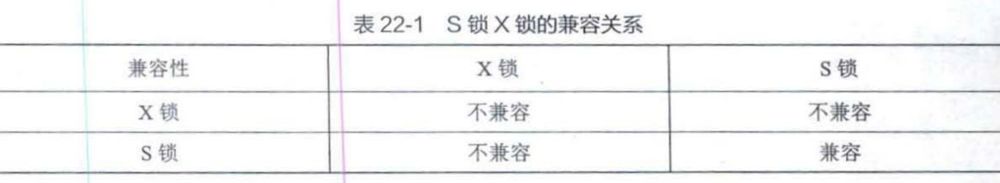
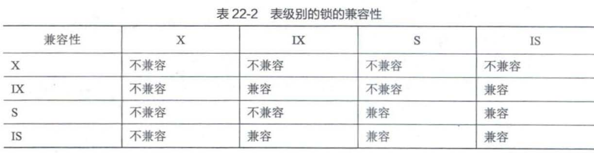
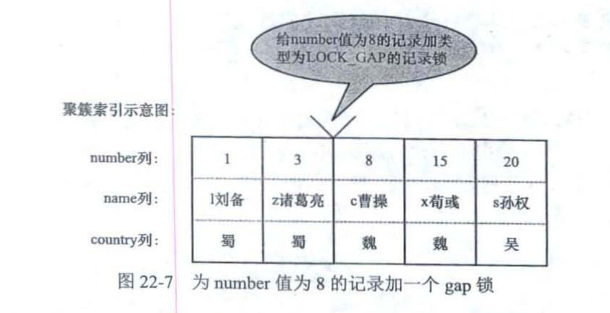
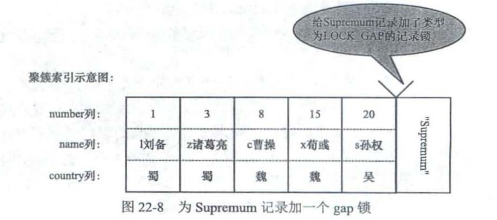
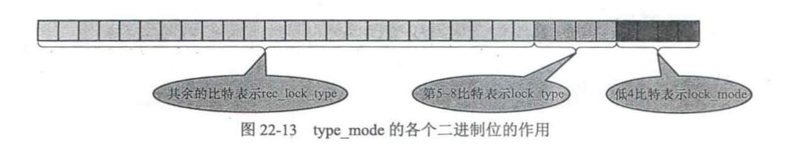

- 数据库基础
  collapsed:: true
	- 事务
	  collapsed:: true
		- 定义
		  collapsed:: true
			- 把多条语句作为一个整体进行操作的功能，被称为数据库事务。
			- 数据库事务可以确保该事务范围内的所有操作都可以全部成功或者全部失败。如果事务失败，那么效果就和没有执行这些SQL一样，不会对数据库数据有任何改动。
		- 四大特性
		  collapsed:: true
			- 原子性-Atomic
			  collapsed:: true
				- 表示组成一个事物中的多个数据库操作是一个不可分割的原子单元，作为原子工作单元执行，要么全部执行，要么全部不执行。
			- 一致性-Consistent
			  collapsed:: true
				- 事务完成后，数据库所处的状态与它的业务规则是一致的，即A账户转账100元到B账户，无论成功与否，A账户和B账户的存款总额是不变的。
			- 隔离性-Isolation
			  collapsed:: true
				- 如果有多个事务并发执行，每个事务作出的修改必须与其他事务隔离。
			- 持久性-Duration
			  collapsed:: true
				- 事务完成后，对数据库数据的修改被持久化存储。
		- 具体实现
		  collapsed:: true
			- 数据库采用**重执行日志**来保证原子性、一致性和持久性。
			- 数据库采用数据库**锁机制**保证事务的隔离性。Oracle数据库还采用了数据版本的机制去保证隔离性。
	- 数据并发导致的问题
	  collapsed:: true
		- 3类数据读问题
		  collapsed:: true
			- 脏读（dirty read）
			  id:: 642d322f-4f72-4c9b-875c-2fcc8d125514
			  collapsed:: true
				- A事务读取了B事务尚未提交的更改数据，A事务并在此基础上做了操作。
				- 就是说A事务读了错的数据，并进行了操作，然后A事务提交事务后修改的数据也是错的。
			- 不可重复读（unrepeatable read）
			  collapsed:: true
				- A事务第一次读取了数据
				- B事务已经提交了事务，更改了数据（更新或是删除）
				- A事务第二次读取数据，发现与第一次读取的不一样
			- 幻象读
			  collapsed:: true
				- A事务第一次读取了数据
				- B事务已经提交了事务，新增了数据（新增）
				- A事务第二次读取数据，发现与第一次读取的不一样
			- 不可重复读和幻象读的区别
			  collapsed:: true
				- 一幻象读一般发生在计算统计数据的事务中
				- 二幻象度是另一个事务进行了**新增数据**的操作，而不可重复读是进行了**数据更新和删除**的操作
				- 三采取的解决策略不同
				  collapsed:: true
					- 幻象读，需要防止事务读到新增数据，需要添加表级锁，也就是将整张表锁定，防止新增数据。
					- 不可重复读，需要防止事务读到更改的数据，只需对操作的数据添加行级锁，阻止操作的数据发生变化
		- 2类数据更新问题
		  collapsed:: true
			- 第一类丢失问题
			  collapsed:: true
				- A事务第一次读取了数据
				- B事务第一次读取了数据，并对数据进行了更新操作，并提交了事务
				- A事务根据第一次读到的数据对其进行了更新操作
				- A事务**撤销了更新操作**，数据恢复为事务A第一次读到的数据
				- 在上述过程中A事物撤销时，将已经提交的B事务的更新数据给覆盖了
			- 第二类丢失问题
			  collapsed:: true
				- A事务第一次读取了数据
				- B事务第一次读取了数据，并对数据进行了更新操作，并提交了事务
				- **A事务根据第一次读到的数据对其进行了更新操作，并提交了事务**
				- 在上述过程中A事物覆盖了B事务已经提交的数据，造成B事物所做操作丢失
	- 数据库的隔离级别
	  collapsed:: true
		- 读未提交（READ UNCOMMITTED）
		  collapsed:: true
			- 定义：就是一个事务可以读取另一个未提交事务的数据。
			- 该隔离级别下，可能会出现**脏读**、**不可重复读**和**幻读**情况。
		- 读提交 （READ COMMITTED）
		  collapsed:: true
			- 定义：就是一个事务要等另一个事务提交后才能读取数据。
			- 该隔离级别下，可能会出现**不可重复读**和**幻读**情况。
		- 可重复读 （REPEATABLE READ）
		  collapsed:: true
			- 定义：就是在开始读取数据（事务开启）时，不再允许修改操作。
			- 该隔离级别下，可能会出现**幻读**，不可能出现**脏读**和**不可重复读**。
		- 串行化 （SERIALIZABLE）
		  collapsed:: true
			- 定义：最高的事务隔离级别，该级别下，事务串行顺序执行。
			- 该隔离级别下，**幻读**、**脏读**和**不可重复读**都不会出现。
		- 参考文章
		  collapsed:: true
			- [MySQL事务隔离级别和实现原理（看这一篇文章就够了！）](https://zhuanlan.zhihu.com/p/117476959)
	- 数据库锁机制
	  collapsed:: true
		- 参考文章
		  collapsed:: true
			- [MySql: 表级锁、行级锁、共享锁、排他锁、乐观锁、悲观锁](https://blog.csdn.net/hanchao5272/article/details/98607314)
	- SQL程序语言有四种类型
	  collapsed:: true
		- DDL
		  collapsed:: true
			- Data Definition Language，数据定义语言。
			- 即数据定义语言，定义语言就是定义关系模式、删除关系、修改关系模式以及创建数据库中的各种对象，比如表、聚簇、索引、视图、函数、存储过程和触发器等等。
			- 包括：`create`、`alter`、`drop`、`truncate`
		- DML
		  collapsed:: true
			- Data Manipulation Language，数据操作语言。
			- 主要是进行插入元组、删除元组、修改元组的操作。
			- 包括：`insert`、`update`、`delete`
		- DQL
		  collapsed:: true
			- Data Query Language，数据查询语言。
			- 用来进行数据库中数据的查询的，即最常用的select语句。
			- 包括：`select`
		- DCL
		  collapsed:: true
			- Data Control Language，数据控制语言。
			- 用来授权或回收访问数据库的某种特权，并控制数据库操纵事务发生的时间及效果，能够对数据库进行监视。
			- 包括：
				- 创建用户
				- 给用户授权
				- 撤销授权
				- 查看用户权限
				- 删除用户
				- 修改用户密码
- MySQL数据手册
  collapsed:: true
	- 资料信息
		- [MySQL 8.0 Reference Manual](https://dev.mysql.com/doc/refman/8.0/en/features.html)
	- 一般信息
		- 1.2 MySQL 数据库管理系统概述
			- [什么是MySQL](https://dev.mysql.com/doc/refman/8.0/en/what-is-mysql.html)
			  collapsed:: true
				- MySQL是一个数据库管理系统
				- MySQL是一个关系型数据库
				- MySQL是开源的
				- MySQL 数据库服务器非常快速，可靠，可伸缩，易于使用的
				- MySQL 服务器工作在客户端/服务器或嵌入式系统中
				- 有很多应用程序和编程语言支持MySQL
			- [MySQL的主要功能](https://dev.mysql.com/doc/refman/8.0/en/features.html)
			  collapsed:: true
				- 数据类型
				- 语句和函数
				  collapsed:: true
					- 1.支持在SELECT查询参数和WHERE子句中使用运算符和函数。
					- 2.完全支持 SQL GROUP BY 和 ORDER BY 子句。 支持组函数（COUNT()、AVG()、STD()、SUM()、MAX()、MIN() 和 GROUP_CONCAT()）。
					- 3.支持使用标准 SQL 和 ODBC 语法的 LEFT OUTER JOIN 和 RIGHT OUTER JOIN。
					- 4.支持标准 SQL 要求的表和列的别名。
					- 5.支持 DELETE、INSERT、REPLACE 和 UPDATE 以返回更改（受影响）的行数，或通过在连接到服务器时设置标志来返回匹配的行数。
					- 6.支持检索有关数据库、存储引擎、表和索引的信息的 MySQL 特定 SHOW 语句。 支持 INFORMATION_SCHEMA 数据库，根据标准 SQL 实现。
					- 7.EXPLAIN 语句显示优化器如何解析查询。
					- 8.函数名称与表或列名称的独立性。比如：命名不能与保留字重合、函数名与后面(之间不能有空格。
					- 9.可以在同一语句中引用来自不同数据库的表。
				- 安全
				  collapsed:: true
					- 一个非常灵活和安全的权限和密码系统，并且支持基于主机的验证。
					- 当您连接到服务器时，通过加密所有密码流量来实现密码安全性。
				- 可扩展性和限制
				  collapsed:: true
					- 支持大型数据库
					- 每个表最多支持 64 个索引。 每个索引可能由 1 到 16 列或部分列组成。 InnoDB 表的最大索引宽度为 767 字节或 3072 字节。MyISAM 表的最大索引宽度为 1000 字节。索引可以使用 CHAR、VARCHAR、BLOB 或 TEXT 列类型的列前缀。
				- 连通性
				  collapsed:: true
					- 客户端可以使用多种协议连接到 MySQL 服务器：
						- 客户端可以在任何平台上使用 TCP/IP 套接字进行连接。
						- 在 Windows 系统上，如果服务器在启用 named_pipe 系统变量的情况下启动，则客户端可以使用**命名管道**进行连接。 如果在启用 shared_memory 系统变量的情况下启动，Windows 服务器也支持**共享内存**连接。 客户端可以使用 --protocol=memory 选项通过共享内存进行连接。
						- 在 Unix 系统上，客户端可以使用 Unix 域**套接字文件**进行连接。
					- MySQL 客户端程序可以用多种语言编写。
					- Connector/ODBC (MyODBC) 为使用 ODBC（开放式数据库连接）连接的客户端程序提供 MySQL 支持。
					- Connector/J 接口为使用 JDBC 连接的 Java 客户端程序提供 MySQL 支持。
					- MySQL Connector/NET 使开发人员能够轻松创建需要与 MySQL 进行安全、高性能数据连接的 .NET 应用程序。
				- 本土化
					- 服务器可以用多种语言向客户端提供错误消息。
					- 完全支持多种不同的字符集，包括 latin1 (cp1252)、german、big5、ujis、多种 Unicode 字符集等。
					- 所有数据都按所选数据集进行保存。
					- 根据默认的字符集和排序规则进行排序和比较。
					- 服务器时区可以动态更改，各个客户端可以指定自己的时区。
				- 客户端和工具
					- MySQL 包括几个客户端和实用程序。 其中包括命令行程序（例如 mysqldump 和 mysqladmin）和图形程序（例如 MySQL Workbench）。
					- MySQL Server 内置支持 SQL 语句来检查、优化和修复表。 这些语句可通过 mysqlcheck 客户端从命令行获得。 MySQL 还包括 myisamchk，这是一个非常快速的命令行实用程序，用于在 MyISAM 表上执行这些操作。
					- MySQL 程序可以用 --help 或 -? 获得在线帮助的选项。
- MySQL
  collapsed:: true
	- 数据类型
		- 字符创类型
			- `text`
				- 最大字符长度是65,535 ( 2的16次− 1) 个字符。
			- `mediumtext`
				- 最大的字符长度是16,777,215 (2的24次 − 1) 字符。
			- `longtext`
				- 最大长度是4,294,967,295 or 4GB (2的32次 − 1) 字符。
			- 说到这里，我们就有必要讨论下字节和字符长度的问题
				- `length()`：该函数返回字符串的字节大小。
				- `char_length()`：该函数返回字符串的字符长度。
				- 举个例子来讲，在utf8编码下，**一个汉字字符长度是1，字节大小为3**。
	- 查看数据库隔离级别
	  collapsed:: true
		- 脚本如下
		  ```mysql
		  # MySQL 8.0 之前
		  SELECT @@global.tx_isolation;
		  SELECT @@session.tx_isolation;
		  SELECT @@tx_isolation;
		  
		  # MySQL8.0
		  SELECT @@global.transaction_isolation;
		  SELECT @@session.transaction_isolation;
		  SELECT @@transaction_isolation;
		  ```
	- SQL
	  collapsed:: true
		- 查看建表结构：`show create table <表名>`
		- explain关键字的使用          
		  collapsed:: true
			- 参考文档
				- https://dev.mysql.com/doc/refman/5.7/en/explain-output.html
			- type              
			  
			    > 这是最重要的字段之一，显示查询使用了何种类型。从最好到最差的连接类型依次为：system，const，eq_ref，ref，fulltext，ref_or_null，index_merge，unique_subquery，index_subquery，range，index，ALL
			- system
		- between and日期包含范围边界的查询
		  collapsed:: true
			- 针对datetime和timestamp类型，
			- 针对date类型，
		- 游标-Cursor
		  collapsed:: true
			- 背景
				- MySQL执行检索操作会返回一组称为结果集的行，这组返回的行都是与SQL 语句相匹配的行（零行或多行），但是，使用简单的select 语句，没有办法得到第一行、下一行、或前十行，也不存在一行地处理所有行简单方法（也就是成批地处理它们）,而有时，需要在检索出来的行中前进或后退一行或多行，怎么办来
			- 定义：游标（cursor）是一个存储在mysql服务器上数据库查询，它不是一条select 语句，而是被语句检索出来的结果集。
			- 好处：在存储了游标之后，应用程序可以根据需要滚动或浏览其中的数据。
			- 主要用于：交互式应用，其中用户需要滚动屏幕上的数据，并对数据进行浏览或做出更改。
		- Select查询
		  collapsed:: true
			- MySQL将 select 查询分为简单查询和复杂查询。复杂查询分为三类：**简单子查询**、**派生表（from语句中的子查询）**、**union 查询**。
		- explain的使用
		  collapsed:: true
			- id列
			  collapsed:: true
				- 定义：id列的编号是 select 的序列号，有几个 select 就有几个id，并且id的顺序是按 select 出现的顺序增长的。
			- select_type列
			  collapsed:: true
				- 定义：select_type 表示对应行是是简单还是复杂的查询。
				- 类型
					- `simple`：简单查询。查询不包含子查询和union。
					- `primary`：复杂查询中最外层的 select。
					- `subquery`：包含在 select 中的子查询（不在 from 子句中）。
					- `derived`：包含在 from 子句中的子查询。MySQL会将结果存放在一个临时表中，也称为派生表（derived的英文含义）
						- 例子：用这个例子来了解 primary、subquery 和 derived 类型
							- SQL：`explain select (select 1 from actor where id = 1) from (select * from film where id = 1) der;`
								- `primary`指的就是第一个select
								- `subquery`指的是(select 1 from actor where id = 1)子查询
								- `derived`指的是(select * from film where id = 1)子查询
					- `union`：在 union 中的第二个和随后的 select
					- `union result`：从 union 临时表检索结果的 select
			- table列
			  collapsed:: true
				- 定义：这一列表示 explain 的一行正在访问哪个表。
				- 类型
					- 当 `from`子句中有子查询时，table列是 `<derivenN>` 格式，表示当前查询依赖 id=N 的查询，于是先执行 id=N 的查询。
					- 当有 `union` 时，`UNION RESULT` 的 table 列的值为 <union1,2>，1和2表示参与 union 的 select 行id。
			- type列
			  collapsed:: true
				- 定义：这一列表示关联类型或访问类型，即MySQL决定如何查找表中的行。
				- 从最优到最差分别为：`system` > `const` > `eq_ref` > `ref` > `fulltext` > `ref_or_null` > `index_merge` > `unique_subquery` > `index_subquery` > `range` > `index` > `ALL`
				- 类型
					- `NULL`：mysql能够在优化阶段分解查询语句，在执行阶段用不着再访问表或索引。
					- `system`：表中只有一行数据或者是空表，这是const类型的一个特例。且只能用于myisam和memory表。如果是Innodb引擎表，type列在这个情况通常都是all或者index
					- `const`：最多只有一行记录匹配。当联合主键或唯一索引的所有字段跟常量值比较时，join类型为const。其他数据库也叫做唯一索引扫描。
		- `REPLACE SELECT FROM`语句
		  collapsed:: true
			- `REPLACE SELECT FROM`用于将其他表中的数据实时覆盖写入目标表中。写入数据时，根据主键判断待写入的数据是否已经存在于表中，如果已经存在，则先删除该行数据，然后插入新的数据；如果不存在，则直接插入新数据。
		- `INSERT INTO SELECT`语句
		  collapsed:: true
			- `INSERT INTO SELECT` 语句从一个表复制数据，然后把数据插入到一个已存在的表中。目标表中任何已存在的行都不会受影响。
		- `LOAD DATA`语句
		  collapsed:: true
			- 能快速将一个文本文件的内容导入到对应的数据库表中（一般文本的一行对应表的一条记录）。
	- 索引
	  collapsed:: true
		- 聚集索引（聚簇索引）
			- 定义
				- 指索引项的排序方式和表中数据记录排序方式一致的索引。（以InnoDB聚集索引的主键索引来说，叶子节点中存储的就是行数据，行数据在物理储器中的真实地址就是按照主键索引树形成的顺序进行排列的）
				- 聚簇索引并不是一种单独的索引类型，而是一种数据存储方式。术语“聚簇”表示数据行和相邻的键值紧凑的存储在一起。
				- 聚集索引的顺序就是数据的物理存储顺序。它会根据聚集索引键的顺序来存储表中的数据，即对表的数据按索引键的顺序进行排序，然后重新存储到磁盘上。因为数据在物理存放时只能有一种排列方式，所以一个表只能有一个聚集索引。
			- 特点
				- 因为在物理内存中的顺序只能有一种，所以聚集索引在一个表中只能有一个。
			- 优点
				- 查询效率快
			- 缺点
				- 修改数据慢
		- 非聚集索引
			- 定义：索引顺序与物理存储顺序不同
	- 运维相关
	  collapsed:: true
		- MySQL配置中`bind-address = 127.0.0.1`的坑
			- `bind-address = 127.0.0.1`的含义就是说mysql只接受localhost，不接受远程连接。在bind-address后面增加远程访问IP地址或者禁掉这句话就可以让远程机登陆访问了。
		- 重启mysql：`service mysql restart`
		- 写入MySQL报错超出 `max_allowed_packet` 的问题
			- MySQL根据配置文件会限制Server接受的数据包大小。有时候大的插入和更新会受 `max_allowed_packet` 参数限制，导致大数据写入或者更新失败。
			- 查看sql：`select @@max_allowed_packet;`
	- JDBC
	  collapsed:: true
		- URL参数配置
		  collapsed:: true
			- 示例：`jdbc:mysql://localhost:3306/test?user=root&password=&serverTimezone=Aisa/Shanghai`
			- 参考文章
				- [MySQL JDBC URL参数（转）](https://www.cnblogs.com/EasonJim/p/7659475.html)
				- [mysql官方文档-Configuration Properties](https://dev.mysql.com/doc/connector-j/8.0/en/connector-j-reference-configuration-properties.html)
		- 开发问题
		  collapsed:: true
			- `no suitable driver found for jdbc`在IDEA中使用Tocmat该如何解决
				- 第一步将mysql-connector-java的包放到tomcat的lib目录下，看问题是否解决
				- 若还不行，则看tomcat版本支持的mysql驱动的版本是不是错的，可以看这个[JNDI Datasource How-To](https://tomcat.apache.org/tomcat-8.5-doc/jndi-datasource-examples-howto.html)
	- MySQL的相关问题
	  collapsed:: true
		- [Mac解决 Can‘t connect to local MySQL server through socket ‘/tmp/mysql.sock‘ (2)问题](https://blog.csdn.net/cxclll/article/details/116024881)
- H2
  collapsed:: true
	- 参考文章
		- [H2 数据库使用简介](https://www.cnblogs.com/cnjavahome/p/8995650.html)
		- [H2启动器](https://www.jianshu.com/p/f8886c35fa6f)
		- [H2设置自动创建数据库](https://blog.csdn.net/qq_21078159/article/details/108754166)
- Redis
  collapsed:: true
	- Jedis
		- 使用
		  collapsed:: true
			- 参考文章：
			  collapsed:: true
				- [jedis的基本使用](https://blog.csdn.net/zhang_sheng_nian/article/details/127734172)
		- Jedis连接池
		  collapsed:: true
			- 参考文章
			  collapsed:: true
				- [java客户端：Jedis和Jedis连接池的基本使用和配置](https://zhuanlan.zhihu.com/p/84481313)
				- [GenericObjectPool源码分析](https://www.cnblogs.com/chenjian5/p/5149312.html)
				- [为什么建议JedisPool的maxIdle与maxActive设置成一样的数值](https://www.jianshu.com/p/1f1568627f87)
	-
- 《MySQL 是怎样运行的：从根儿上理解 MySQL》
	- 第一章 重新认识MySQL
	  collapsed:: true
		- 1.启动MySQL的服务器程序
			- Unix中启动
			  collapsed:: true
				- mysqld
				  collapsed:: true
					- mysqld是一个可执行文件。
					- 在控制台直接输入`mysqld`命令，会直接在控制台上运行MySQL服务。
				- mysqld_safe
				  collapsed:: true
					- `mysqld_safe`是一个启动脚本。
					- 它间接调用了mysqld，它还包括了一个监控进程，如果mysql服务挂了的话可以帮忙重启服务。
					- 此外它会将服务启动时的出错信息保存到出错日志里，方便排查。
				- mysql.server
				  collapsed:: true
					- mysql.server也是一个启动脚本
					- 它会间接调用mysqld_safe。
					- 后面指定`start`参数就可以启动服务器程序，关闭程序可以使用`stop`参数。
				- mysqld_multi
				  collapsed:: true
					- 一台计算机上也可以运行多个服务器实例，也就是运行多个MySQL服务器进程。`mysql_multi`可执行文件可以对每一个服务器进程的启动或停止进行监控。
			- Windows中启动
			  collapsed:: true
				- mysqld
				  collapsed:: true
					- 在windows中MySql的安装目录下也有一个mysqld的可执行文件，双击该文件就可以启动MySQL服务器程序了。
				- 以服务的方式运行服务器程序
				  collapsed:: true
					- 使用命令`mysqld的路径 --install [-manual] [服务名]`来将MySQL作为windows的一个服务。例子`"C:\Program Files\MySQL\MySQL Server 5.7\bin\mysqld" --install`
					- `--manual`命令可以省略，加上它的话，windows系统启动的时候就不会自动启动MySQL的服务了。
					- 将MySQL注册为服务之后，我们可以使用命令`net start MySQL`来启动服务了，接着使用`net stop MySQL`来关闭服务。
		- 2.启动MySQL的客户端程序
			- 可以使用`mysql -h主机名  -u用户名 -p密码`启动客户端来连接服务器端。
		- 3.客户端和服务器端的连接过程
			- 运行着的服务器程序和客户端程序本质上都是计算机上的一个进程，所以客户端进程向服务器进程发送请求并得到回复的过程本质上是一个进程间通信的过程。
			- MySQL支持下面三种客户端进程和服务器进程的通信方式
			  id:: 64a6b818-7479-426a-a175-fa24189a58ef
				- TCP/IP
					- 数据库服务器进程和客户端进程可能运行在不同的主机中，它们之间必须通过网络来进行通讯。`MySQL`采用`TCP`作为服务器和客户端之间的网络通信协议。
					- 在网络环境中，客户端进程就可以通过`IP地址`+`端口号`的方式与这个进程连接。
					- 启动客户端程序时在`-h`参数后边紧跟服务器的IP地址，这就意味着客户端和服务器之间需要通过`TCP/IP`网络进行通信。
				- 命名管道和共享内存
					- 在Windows环境中，我们可以使用**命名管道**和**共享内存**的方式进行通信。
					- MySQL使用**命名管道**来进行进程间通信
					  collapsed:: true
						- 需要在启动服务器程序的命令中加上`--enable-named-pipe`参数，然后在启动客户端程序的命令中加入`--pipe`或者`--protocol=pipe`参数。
					- MySQL使用共享内存来进行进程间通信
					  collapsed:: true
						- 前提是客户端和服务器端在同一台`Windows`主机中。
						- 在启动服务器程序的命令中加上`--shared-memory`参数，在成功启动服务器后，`共享内存`便成为本地客户端程序的默认连接方式，不过我们也可以在启动客户端程序的命令中加入`--protocol=memory`参数来显式的指定使用共享内存进行通信。
				- Unix域套接字文件
					- 前提是客户端和服务器端在同一台操作系统为类`Unix`的机器上。
					- 如果我们在启动客户端程序的时候`-h`参数指定的主机名为`localhost`，或者指定了`--protocol=socket`的启动参数，那服务器程序和客户端程序之间就可以通过`Unix`域套接字文件来进行通信了。
					- `MySQL`服务器程序默认监听的`Unix`域套接字文件路径为`/tmp/mysql.sock`，客户端程序也默认连接到这个`Unix`域套接字文件。
					- 指定Unix域套接字文件：`mysqld --socket=/tmp/a.txt`。
		- 4.服务器处理客户端请求
			- 客户端和服务器端通信的本质：客户端进程向服务器进程发送一段文本（MySQL语句），服务器进程处理后再向客户端进程发送一段文本（处理结果）。
			- 服务器端处理客户端查询请求的过程图
			  
			- 连接管理
				- 客户端采用 ((64a6b818-7479-426a-a175-fa24189a58ef))和服务器端建立连接。
				- 服务器端会专门创建一个线程来处理和客户端的交互。
				- 当客户端和服务器端断开连接之后，服务器端不会立刻把这个交互的线程销毁掉，而是把它缓存了起来。从而节省了开销，避免的线程的频繁创建和销毁。
			- 解析与优化
				- 查询缓存
				  collapsed:: true
					- 如果两个查询请求的字符串一样，就可以命中缓存，无需接着查询。
					- 如果两个查询请求在任何字符上的不同（例如：空格、注释、大小写），都会导致缓存不会命中。
					- 另外，如果查询请求中包含某些**系统函数**、**用户自定义变量**和**函数**、一**些系统表**，如 mysql 、information_schema、 performance_schema 数据库中的表，那这个请求就不会被缓存。
					- MySQL的缓存系统会监测涉及到的每张表，只要该表的结构或者数据被修改，如对该表使用了`INSERT`、 `UPDATE`、`DELETE`、`TRUNCATE TABLE`、`ALTER TABLE`、`DROP TABLE`或 `DROP DATABASE`语句，那使用该表的所有高速缓存查询都将变为无效并从高速缓存中删除！
				- 语法解析
				  collapsed:: true
					- 事实上这块内容涉及到了编译器的知识，会涉及到词法分析，语法分析，语义分析等步骤。
				- 查询优化
					- MySQL会对用户的sql进行优化。
			- 存储引擎
				- `MySQL`服务器把数据的存储和提取操作都封装到了一个叫`存储引擎`的模块里
				- 为了管理方便，人们把`连接管理`、`查询缓存`、`语法解析`、`查询优化`这些并不涉及真实数据存储的功能划分为`MySQL server`的功能，把真实存取数据的功能划分为`存储引擎`的功能。
				- 负责数据的提取和写入。
		- 5.常用的存储引擎
		  collapsed:: true
			- InnoDB：具备外键支持功能的事务存储引擎。
			- MyISAM：主要的非事务处理存储引擎。
		- 6.关于存储引擎的一些操作
		  collapsed:: true
			- 查看当前数据库支持的存储引擎
			  ```sql
			  SHOW ENGINES;
			  ```
			- 设置表的存储引擎
				- 存储引擎是负责对表中的数据进行提取和写入的，我们可以为不同的表设置不同的存储引擎，也就是说不同的表可以有不同的物理存储结构，不同的提取和写入方式。
			- 创建表时指定存储引擎
			  ```sql
			  CREATE TABLE 表名(
			      建表语句;
			  ) ENGINE = 存储引擎名称;
			  ```
			- 修改表的存储引擎
			  ```sql
			  ALTER TABLE 表名 ENGINE = 存储引擎名称;
			  ```
	- 第二章 MySQL的调控按钮-启动选项和系统变量
	  collapsed:: true
		- 1.在命令行中指定启动选项参数
		- 2.在配置文件中指定启动选项参数
	- 第九章 InnoDB的表空间结构
	  collapsed:: true
		- 独立表空间的结构
			- 段、组、区都是逻辑结构，表空间和页是物理结构
			- 一个区包含64个页。
			- 一个组包含256个区。
			- 一个索引包含两个段。
			- 为什么需要区这个结构：一个区中相邻两个页的物理地址是连续的，减少了随机IO。
			- 为什么需要段这个结构：
				- 范围查询是对B+树叶子节点的顺序扫描，不需要扫描非叶子节点。所以段区分了叶子节点和非叶子节点。
				- 一个段中叶子节点有自己独有的区，存放非叶子节点的区的集合为一个段。
				- 一个段中非叶子节点有自己独有的区，存放非叶子阶段的取的集合为一个段。
			- 区对应的逻辑结构是XDES，Extent Descriptor Entry
			- 段对应的逻辑结构是INODE
				- 最重要的是3个List Base Node结构
			- 直属于表空间的三个链表
			- FSP_HDR类型的页
				- 表空间的第一个页。
				- 存储了直属于表空间的三个量表的基节点。
			- 每个分组的第一个页的结构与FSP_HDR类似，只是表空间的唯一一个FSP_HDR他除了记录XDFS信息外，还记录了表空间的属性。
			- IBUF_BITMAP类型的页
			- INODE类型的页
				- 为了存储INODE Entry结构而存在的。
				- Segment Hader结构：用于记录叶子节点和非叶子节点的段对应的INODE ENTRY结构的地址。
		- 系统表空间的结构
			- 数据字典表的页结构
	- 第十章 单表访问方法
	  collapsed:: true
		- 访问类型：MySQL执行查询语句的方式
			- const
				- 定义：通过主键或者**唯一**二级索引列来定位**一条**记录的访问方法。
				- 只能匹配一条数据。
				- 这里的唯一指的是通过二级索引查到的数据只有一条，需要回表的数据也只有一条。
				- 如果执行一个唯一二级索引为null的等值查询，因为可能会查到多条数据，所以这个语句不使用const访问方法执行。
			- eq_ref
				- 定义：在**连接查询**中对**被驱动**表**使用主键值或者唯一二级索引列的值进行等值查找**的查询执行方式。
			- ref
				- 定义：通过普通**二级索引**与常数进行等值比较来定位**多条**记录的方法方法。
				- 二级索引列值为null，因为可能查询到多条记录，所以这种情况属于ref的访问方法。
				- 对于联合索引的二级索引，只要是符合**最左匹配原则**且是与**常数的等值比较**，可能采用ref的访问方法。
			- ref_or_null
				- 定义：不仅想找出某个**二级索引列的值等于某个常数**的记录，还想把该列的**值为NULL**的记录也找出来。
			- range
				- 定义：利用索引进行**范围匹配**的访问方法。
			- index
				- 定义：如果查询的字段能够通过**遍历二级索引记录**就能获取而不用回表，我们称这种执行方式为index。
				- 等值查询对应的是**单点区间**，也就是索引列等值匹配的情况
				- 范围查询对应的是**范围区间**，范围区间是为了从索引中获取记录提出的概念。
			- index merge
				- 定义：使用到多个索引来完成一次查询的执行方法。
				- 索引合并算法
					- Intersection合并
					- Union合并
					- Sort-Union合并
			- all
				- 定义：直接扫描聚簇索引进行的全表扫描的查询方式称为all。
		- 注意事项
			- 一般情况下执行一个查询只会用到单个二级索引。
			- **一个使用到索引的搜索条件**和**没有使用该索引的搜索条件**使用**OR连接**起来后是无法使用该索引的。
			- LIKE操作符比较特殊，只有在匹配完整字符串或者匹配字符串前缀时才可以利索引。因为字符串列的二级索引是按照顺序存储了，如果不是前缀匹配就用不到排序了。
				-
				-
	- 第十一章 连接的原理
	  collapsed:: true
		- 连接的本质：将两个表的数据组合起来，即求一个笛卡尔积。
		- 连接的过程
			- 驱动表
			- 被驱动表
		- 内连接
			- 驱动表中的记录在被驱动表中找不到匹配的记录，该记录不会加入到最后的结果集。
		- 外连接
			- 驱动表中的记录即使在被驱动表中没有匹配的记录，也仍然需要加入到结果集。
			- 连接条件
				- 背景：不想把驱动表的全部记录都加入到最后的结果集。
				- 一般情况下，会把涉及到两张表的过滤条件放到`on`子句中，只涉及单表的过滤条件放到`where`子句中。
		- 内外连接的区别
			- **内连接和外连接的根本区别**就是在驱动表中的记录不符合ON子句中的连接条件时不会把该记录加入到最后的结果集。
			- 对于内连接而言，两张表谁做驱动表谁做被驱动表，得到的笛卡尔积都是一样的。但是对于外连接，驱动表和被驱动表的关系不能随便更换。
		- 连接的原理
		    collapsed:: true
			- 嵌套循环连接（Nested-Loop-Join）
				- 定义：驱动表只访问一次，但被驱动表却可能被多次访问，访问次数取决于对驱动表执行单表查询后的结果集中的记录条数的连接执行方式
			- 使用索引加快连接速度
				- 定义：被驱动表利用索引来加快查询速度。
			- 基于块的嵌套循环连接（Block Nested-Loop Join）
				- 背景
				- join buffer：一块存放被驱动表结果集的内存。
				- 定义：将被驱动表结果集中的记录装载到join buffer中，然后开始扫描被驱动表，每一条被驱动表的记录一次性和join buffer中的多条驱动表记录做匹配，因为匹配的过程都是在内存中完成的，所以这样可以显著减少被驱动表的I/O代价。
	- 第十二章 MySQL基于成本的优化
	  collapsed:: true
		- 查询成本
		    collapsed:: true
			- IO：从磁盘加载数据到内存的时间
			- CPU：读取和检测数据是否满足搜索条件、对结果集进行排序等操作的时间
		- 单表查询的成本
			- 基于成本的优化步骤
			    collapsed:: true
				- 根据搜索条件，找出所有可能使用的索引
				- 计算全表扫描的代价
				- 计算使用不同索引执行查询的代价
				- 对比各种执行方案的代价，找出成本最低的那一个
			- 基于index dive的成本计算
				- 定义：通过直接访问索引对应的B+树来计算某个范围区间对应的索引记录条数的方式称之为index dive。
			- 基于索引统计数据的成本计算
			    collapsed:: true
				- 触发场景
					- 使用索引执行查询是会有很多单点区间，也就是说不是范围查询，比如in语句就会产生很多单点区间。
			- 查看一张表的统计数据：`SHOW TABLE STATUS LIKE 'table_name'`
			- 查看一张表索引的统计数据：`SHOW INDEX FROM  table_name`
		- 连接查询的成本
		  collapsed:: true
			- MySQL中连接查询采用的是嵌套循环连接算法。
			- 驱动表进行查询后得到的记录条数称之为驱动表的扇出（英文名：fanout）。
			- 两表连接的成本分析
			  collapsed:: true
				- 优化重点
					- 尽量减少驱动表的扇出
					- 对被驱动表的访问成本尽量低：尽量在被驱动表的连接列上建立索引
		- 调节成本函数
		  collapsed:: true
			- server层
			- 存储引擎层
	- 第十三章 InnoDB统计数据是如何收集的
	  collapsed:: true
		- `InnoDB`默认是以表为单位来收集和存储统计数据的
		- 统计的数据主要有两块，第一块是表的数据，第二块是索引的数据
		- 基于磁盘的永久性统计数据
			- 默认采用这种方式来做
		- 基于内存的非永久性统计数据
			- 这种方式暂时不用了
		- `innodb_stats_method`决定着在统计某个索引列不重复值的数量时如何对待`NULL`值。
	- 第十四章 MySQL基于规则的优化
	  collapsed:: true
		- 条件化简
		- 外连接消除
		  collapsed:: true
			- 在外连接查询中，指定的`WHERE`子句中包含被驱动表中的列不为`NULL`值的条件称之为`空值拒绝`（英文名：`reject-NULL`）。
			- 在被驱动表的WHERE子句符合**空值拒绝**的条件后，外连接和内连接可以相互转换。这种转换带来的好处就是查询优化器可以通过评估表的不同连接顺序的成本，选出成本最低的那种连接顺序来执行查询。
		- 子查询优化
		  collapsed:: true
			- 子查询可以出现的位置
			- 按返回的结果区分子查询
				- 标量子查询：只返回一个单一值的子查询称之为`标量子查询`。
				- 行子查询：只返回一条记录的子查询。
				- 列子查询：查询出一个列的数据。
				- 表子查询：子查询的结果既包含很多条记录，又包含很多个列。
			- 按照外层查询关系来区分子查询
				- 外层关系指的就是子查询中有没有用到外层查询的字段。
				- 相关子查询：如果子查询可以单独运行出结果，而不依赖于外层查询的值。
				- 不相关子查询：如果子查询的执行需要依赖于外层查询的值。
			- 子查询在布尔表达式中的使用
				- 使用`=`、`>`、`<`、`>=`、`<=`、`<>`、`!=`、`<=>`作为布尔表达式的操作符
					- 注意：这里的子查询只能是标量子查询或者行子查询，也就是子查询的结果只能返回一个单一的值或者只能是一条记录。
				- [NOT] IN/ANY/SOME/ALL子查询
				- EXISTS子查询
					- 功能：仅仅需要判断子查询的结果集中是否有记录。
					- 语法：`[NOT] EXISTS (子查询)`
		- 子查询在MySQL中时怎么执行的
		  collapsed:: true
			- 标量子查询、行子查询的执行方式
				- 对于包含**不相关**的标量子查询或者行子查询的查询语句来说，MySQL会分别独立的执行外层查询和子查询，就当作两个单表查询就好了。
				- 对于**相关**的标量子查询或者行子查询，先取外层表的第一条记录，然后根据这条记录取内层表去查，然后拿到内层表的数据去匹配外层的where条件。然后取外层表第二条记录，重复上述步骤。
		- in子查询优化
		  collapsed:: true
			- 物化：将子查询结果集中的记录保存到临时表的过程。
			- 物化表：把存储子查询结果集的临时表称之为`物化表`。
			- 物化表转连接
				- 概念解释：可以将in子查询转换为与物化表的连接查询。
				- 半连接（semi-join）：对于外层`s1`表的某条记录来说，我们只关心在内层`s2`表中是否存在与之匹配的记录**是否存在**，而不关心具体有多少条记录与之匹配，最终的结果集中**只保留`s1`表的记录**。
				- 半连接的实现方法
					- Table pullout （子查询中的表上拉）
						- 当子查询的查询列表处只有**主键**或者**唯一索引列**时，因为主键或者唯一索引列中的**数据本身就是不重复的**，所以可以直接将子查询转换为连接查询。
					- DuplicateWeedout execution strategy （重复值消除）
						- 当子查询的查询列没有主键或是唯一索引列时，我们需要为外层s1表建一张临时表，与子查询连接查询时，会将s1表多条满足条件的记录的id添加到临时表中，这个临时表保存的是最后结果集中返回s1表数据的id，通过这种方式消除重复值的实现方法称为des。
					- LooseScan execution strategy （松散索引扫描）
					- Semi-join Materialization execution strategy
					- FirstMatch execution strategy （首次匹配）
				- semi-join的适用条件
				- 不适用于semi-join的情况
		- ANY/ALL子查询优化
		- [NOT] EXISTS子查询的优化
		- 对派生表的优化
		  collapsed:: true
			- 把派生表物化
			- 将派生表和外层的表合并，也就是将查询重写为没有派生表的形式
	- 第二十二章 锁
	  collapsed:: true
		- 1.解决并发事务带来问题的两种基本方式
			- 这两种方式分别是：MVCC和锁。
			- 并发事务访问相同数据的情况
			  collapsed:: true
				- 读-读情况，不会产生并发问题。
				- 写-写情况，并发事务相继对相同的记录进行改动。
				- 读-写或写-读情况，一个事务进行读或另一个事务进行写。
			- 写-写的情况
			  collapsed:: true
				- 在多个事务并发进行写操作时，可能会出现脏写的现象。
				- 在多个未提交事务相继对同一条记录进行写操作时，需要让它们排队执行，排队是通过加锁来实现的。
				- 锁结构中的重要信息
				  collapsed:: true
					- trx信息：锁结构与事务的关联关系。
					- is_waiting：当前事物是否在等待。
				- 假设事务T1和T2想要对一行数据进行写操作，他们会进行如下步骤
				  collapsed:: true
					- 1.他会判断是否有别的事物对这条数据进行加锁，若没有则会在内存中生成一个锁结构与该记录关联，此时`is_waiting`为`false`，故T1获取锁成功。
					- 2.在T1事务提交之前，此时T2事务来了，首页他会判断是否有别的事物对这条数据进行加锁，因为T1的存在，所以T2需要等待，此时也会为T2生成一个锁结构来与该记录关联，此时`is_waiting`为`true`，故T2加锁失败。
					- 3.T1事务提交之后，他会去看看是否与该记录关联的锁在等待，若有的话，他会将T2所在的线程唤醒，此时T2会将`is_waiting`改为`false`，此时T2获取锁成功。
			- 读-写和写-读的情况
			  collapsed:: true
				- 在SQL标准中规定了读未提交，读提交，可重复读和串行化4种不同的事务隔离级别，这里会涉及到脏读、不可重复读和幻读3类数据读问题。
				- 解决三类数据读取问题的方案
				  collapsed:: true
					- 方案一：读操作采取多版本并发控制（MVVC），写操作采取加锁方式
					  collapsed:: true
						- MVCC，全称Multi-Version Concurrency Control，即多版本并发控制。其原理就是生成一个ReadView，ReadView中保存着符合条件的记录版本（记录版本是由undo日志构建的），查询语句只能查到**生成ReadView之前**已提交事务所做的修改，未提交的事务或是后面才开启的事务所在更改时看不到的。
						- 在读提交和可重复读的隔离级别下会使用**MVCC读取数据**。
						- 在**读提交隔离**级别下，一个事务每次执行SELECT语句，都会生成一个ReadView。这样每一个事物是不可能读取到为提交的事务，从而不会发生脏读的情况。
						- 在**可重复读**隔离级别下，一个事务只有在第一次执行SELECT语句时，才会生成一个ReadView，之后的SELECT操作都会复用该ReadView，一个事务只能查到第一次SELECT之前已经提交事务的数据，那么就不会出现脏读、不可重复读和幻读的情况了。
						- **值得注意**的是MVCC在可重复读隔离级别下，**最大可能**的规避了幻读，但不是万千规避。
					- 方案二：读写操作都采取加锁的方式
					  collapsed:: true
						- 在银行转账的场景中，我们会读取账户的余额信息，然后并对余额信息就行修改。在此期间不允许被人对这条数据进行访问和修改，所以读写操作都要加锁，都要进行排队执行。
						- 这种方式相比于方案一性能开销过大，并发能力也比较低。
			- 一致性读
			  collapsed:: true
				- 事务利用MVCC进行的读取操作称为一致性读（Consistent read），一致性读不会对表中的任何记录进行加锁操作。
				- 所有普通的SELECT语句在读提交和重复读隔离级别下都算是一致性读。
			- 锁定读
			  collapsed:: true
				- 共享锁和独占锁
					- 背景：MySQL按照并发场景将锁分为共享锁和独占锁。
					- 共享锁（Shared Lock）：简称S锁，在事务读取一条记录时，需要获取该记录的S锁。
					- 排他锁（Exclusive Lock）：简称X锁，在事务改动一条记录时，需要先获取该记录的X锁。
					- 共享锁和排他锁的兼容关系
						- 图
						  
						- 简单解释一下，比如事务T1获取了一条记录的S锁，之后事务T2想要获取该记录的X锁就不行了，该操作会被阻塞；如果T2事务想要获取该记录的S锁是可以的。
				- 锁定读的语句
					- 背景：MySQL提供了两种特殊的SELECT语句来支持锁定读。
					- 一对读取的记录加S锁
						- sql：`SELECT ... LOCK IN SHARE MODE;`
					- 二对读取的记录加X锁
						- sql：`SELECT ... FOR UPDATE;`
				- 写操作
				  collapsed:: true
					- DELETE的执行过程
					  collapsed:: true
						- 1.先在B+树中定位这条记录的位置。
						- 2.获取这条记录的X锁（获得锁定读）。
						- 3.进行删除操作。
					- UPDATE
					  collapsed:: true
						- 若未修改该记录行涉及的键值且记录每列所占的存储空间在修改前后并未变化
						  collapsed:: true
							- 1.先在B+树中定位这条记录的位置。
							- 2.获取这条记录的X锁（获得锁定读）。
							- 3.在原记录的位置进行修改操作。
						- 若未修改该记录行涉及的键值且至少有一个被更新的列的存储空间在修改前后发送了变化
						  collapsed:: true
							- 1.先在B+树中定位这条记录的位置。
							- 2.获取这条记录的X锁（获得锁定读）。
							- 3.将该条记录删除。
							- 4.插入一条新的记录。
						- 若修改了该记录行的键值
						  collapsed:: true
							- 1.在原记录上执行DELETE操作。
							- 2.进行INSERT操作。
					- INSERT
					  collapsed:: true
						- 一般情况下，新插入一条记录受隐式锁保护，不需要内存为其生成对应的索结构。
		- 2.多粒度锁
			- 表级锁
			  collapsed:: true
				- 共享锁和独占锁
					- 共享锁（S锁）
					- 独占锁（X锁）
				- 意向锁（Intention lock）
					- 作用：IS锁和IX锁时表级锁，是为了在添加**表级别**的S锁和X锁时可以快速的判断出表中的记录是否上锁，以避免使用遍历的方式来查看表中有没有上锁的记录。也就是说IS锁和IX锁是兼容的，IX锁和IX锁也是兼容的。
					- 意向共享锁（Intention Shared Lock）
						- 简称IS锁，当事务准备在某条记录上加S锁时，需要先在表级别上加一个IS锁。
					- 意向独占锁（Intention Exclusive Lock）
						- 简称IX锁，当事务准备在某条记录上加X锁时，需要先在表级别上加一个IX锁。
				- 表级别锁的兼容性
					- 图
					  
		- 3.MySQL中的行锁和表锁
			- InnoDB引擎中的表级别锁
			  collapsed:: true
				- 表级别的S锁、X锁
					- 首先值得注意的是，InnoDB引擎**不会**为SELECT、INSERT、UPDATE、DELETE语句的执行添加表级别的S锁和X锁。
					- 元数据锁
						- 在两个事务同时对同一张表进行操作时，第一个事务在执行DDL语句，另一个事物在执行DML语句，这两个事物会发生阻塞，若第一个事务操作在前则第二个事务被阻塞，若第二个事务操作在前，第一个事务被阻塞。
						- 这个阻塞的逻辑是由Server层的元数据锁（Metadata Lock，MDL）来实现的。
					- 手动获取InnoDB存储的S锁和X锁
						- `LOCK TABLES t READ`：InnoDB会对表t添加表级别S锁。
						- `LOCK TABLES t WRITE`：InnoDB会对表t添加表级别的X锁。
				- 表级别的IS锁、IX锁
					- 当使用InnoDB存储引擎的表的某些记录加S锁，需要先在表级别添加一个IS锁。
					- 当使用InnoDB存储引擎的表的某些记录加X锁，需要先在表级别添加一个IX锁。
				- 表级别的AUTO-INC锁
				  collapsed:: true
					- 背景：在我们使用MySQL的时候，一般会给表的主键id添加`AUTO_INCREMENT`属性，表示该字段的值是自动递增的。
					- 作用：保证自增字段值的有序插入。
					- MySQL针对`AUTO_INCREMENT`修饰的列进行递增赋值的实现方式有两个
					  collapsed:: true
						- 一采用AUTO-INC锁
						  collapsed:: true
							- 原理
							  collapsed:: true
								- 在执行该插入语句的时候会先加一个AUTO-INC锁
								- 然后为每天插入记录标记了AUTO_INCREMENT属性的列生成递增的值
								- 执行插入操作后，释放该锁
							- 缺点：一个事务在获得该锁后，其他事务的插入语句都会被阻塞。
							- 场景：在不确定具体要插入多少条记录的时候会使用这个锁，例如`INSERT....SELECT`、`REPLACE...SELECT`或者`LOAD DATA`这种插入语句。
						- 二采用一个轻量级的锁
						  collapsed:: true
							- 原理
							  collapsed:: true
								- 在执行插入语句的时候会先加一个轻量级锁
								- 然后生成本次插入记录标记了AUTO_INCREAMENT属性的列的值
								- 然后释放轻量级锁
								- 最后执行插入
							- 优点：避免锁表，可以提升插入性能。
							- 场景：适合在执行前就可以确定要插入数据的条数。
			- InnoDB引擎中的行级锁
			  collapsed:: true
				- 行级锁主要有以下四种，每种行锁又分为S锁和X锁。
				- 记录锁-Record Lock
					- 作用：仅仅是将一条记录锁上
					- 官方名称：LOCK_REC_NOT_GAP
					- 分类
						- 也分为S锁和X锁。
						- 两个事务针对S锁和X锁的四中组合中，只有两个事务都持有S锁是兼容的，其余情况都会被阻塞。
				- Gap Lock
					- 作用：解决幻读问题。
					- 原理
					  collapsed:: true
						- 它会在一条记录**之前**添加一个区间锁，阻塞新插入该区间的数据，从而防止在该条记录之前插入新的数据。
						- 如图所示，number列的值在区间(3,8)加gap锁之后是不允许插入新的记录的，`number`是这张表的主键。
						  
						- 如何阻止在表的最后一条记录之后插入新的记录
						  collapsed:: true
							- 这里涉及到数据库表的两条伪记录，一个是Infimum，表示该页面中最小的记录，一个是Supermum，表示该页面最大的记录。
							- 在最后一行数据之后加gap锁，保证最后一条数据之后不允许再插入新的记录。
							- 如图所示，number列的值在区间(20,正无穷)加gap锁，不允许插入新的记录。
							  
					- Next-Key Lock
						- 是gap锁的一种特殊的锁。
						- 作用：不仅会锁住当前这行记录，还会阻止其他事务在这条记录之前的间隙插入新的记录。也就是说他同时具备Record Lock和Gap Lock的功能。
				- 插入意向锁-Insert Intention Lock
				  collapsed:: true
					- 官方命名：LOCK_INSERT_INTENTION
					- 作用：一个事务在插入一条记录时，需要判断插入位置是否存在gap锁。若存在的话，插入操作就需要等待，并于此同时需要生成一个锁结构，表明自己想要在某个间隙插入新的记录，这个生成的锁结构，我们称为意向插入锁。
					- 工作原理：假设三个事务T1、T2、T3，T1持有gap锁，那么T2和T3就需要等待并生成意向插入锁。当T1释放gap锁之后，T2和T3就会获得插入意向锁，他两之间不会阻塞，可以同时获得插入意向锁。
				- 隐式锁
				  collapsed:: true
					- 工作原理
						- 对于聚簇索引的记录
						  id:: 64c20048-f871-42a3-afc1-e88fc24f0053
							- 对于聚簇索引的记录来讲有一个隐藏的tx_id（事务id），该事务id记录着修改这条记录**最后修改记录的事务id，值得注意的是这里的修改记录，包含SELECT查询**。
							- 如果有新的事物想要获取该记录的S锁或是X锁，首先看判断记录的隐藏列tx_id是否是当前活跃事务的id。
							- 如果**不是**的话说明这个事务已经提交了，可以正常读取。
							- 如果**是**说明这个事务还没有提交，所以给当前活跃的事务生成一个X锁的索结构，锁的is_waiting属性为false，给自己也创建一个锁结构，该锁的is_waiting属性为true，自己这个事务进入等待状态。
						- 对于二级索引的记录
						  collapsed:: true
							- 二级索引记录没有隐藏的tx_id隐藏列，但二级索引页面的Page Header部分有一个PAGE_MAX_TRX_ID属性，该属性代表**对该页面做改动的最大的事务id**。
							- 如果PAGE_MAX_TRX_ID属性值小于当前最小活跃事务的id，那说明事务已经提交了，可以正常读取。
							- 否则就需要找到二级索引记录，通过回表操作找到容对应的聚簇索引记录，然后重复 ((64c20048-f871-42a3-afc1-e88fc24f0053))的步骤。
					- 作用
					  collapsed:: true
						- 隐式锁起到的延迟加锁的效果，如果当前事务与该记录操作的事务没有冲突，那就不用加锁了。这个动作对用户来讲是透明的。
			- 其他存储引擎中的锁
			  collapsed:: true
				- MyIASM、MEMORY、MERGE存储引擎来说，只支持表级别的锁，不支持事务。
				- MyIASM支持并发插入的特性，可以在读取MyIASM表的同时插入记录，从而提高性能。
				-
			- InnoDB锁的内存结构
			  collapsed:: true
				- 对一条记录加锁的本质就是在内存中创建了一个锁结构与之关联。
				- 锁的内存结构
				  collapsed:: true
					- 锁所在的事务信息
					- 索引信息
					- 表锁/行锁信息
					  collapsed:: true
						- Space ID：记录所在的表空间
						- Page Number：记录所在的页号
						- n_bits：一条记录对应一个比特，用来标识在哪些记录上加了锁，这个地方记录了这些标识的比特信息。
					- type_mode
					  collapsed:: true
						- 是一个32比特的数，结构如下图所示
						  
						- lock_mode
						  collapsed:: true
							- 标记锁模式，占用低4比特
							- 参数
							  collapsed:: true
								- LOCK_IS：意向共享锁
								- LOCK_IX：意向独占锁
								- LOCK_S：共享锁
								- LOCK_X：独占锁
								- LOCK_AUTO_INC：AUTO-INC锁
						- lock_type
						  collapsed:: true
							- 标锁类型，占用4比特
							- 参数
							  collapsed:: true
								- LOCK_TABLE：表示表锁
								- LOCK_REC：表示行锁
						- rec_lock_type
						  collapsed:: true
							- 标记行锁的具体类型，占用24比特
							- 参数
							  collapsed:: true
								- LOCK_ORDINARY：表示next-key锁
								- LOCK_GAP：表示gap锁。
								- LOCK_REC_NOT_GAP：表示记录锁
								- LOCK_INSERT_INTENTION：表示插入意向锁
								- 其他类型
		- 4.语句加锁分析
			- 普通的SELECT语句
			  collapsed:: true
				- 在**读未提交**情况下
				  collapsed:: true
					- 不加锁，直接读取记录的版本。
					- 可能会出现脏读、不可重复读、幻读的情况。
				- 在**读提交**情况下
				  collapsed:: true
					- 不加锁，**每次**执行SELECT语句都会生成一个ReadView。
					- 由于每次都是新的一个ReadView，就不会读取到其他事务提交的数据，**不存在脏读**。
					- 但是由于每次都是新的一个ReadView，第一次读取的数据和第二次读取的数据就是两个不同的ReadView，**所以存在不可重复读和幻读的问题**。
				- 在**可重复读**情况下
					- 不加锁，只在第一次执行SELECT语句的时候生成一个ReadView
					- 由于只在第一次生成一个ReadView，也就是说当前事物只能看到他自己事务SELECT之前所能看见的数据，之后其他事务的动作都看不见，所以不存在脏读、不可重复读和幻读（一般意义上来说）的情况。
					- **可重复读情况下也是存在幻读的情况的**
						- 情况描述
							- 假设事务A使用聚簇索引去查询SELECT一条数据，这条数据数据库就没有。
							- 接着B事务插入了一条新的数据，
							- 事务A再去查询SELECT一条数据，此时查到了。
						- 原因分析
							- 首先事务A在可重复读情况下查询一条数据，此时会生成一个新的ReadView，这个ReadView里压根没那条数据。
							- 接着B事务插入了一条新的数据，此新数据的聚簇索引trx_id隐藏列就会记录事务A的事务id。
							- 接着A事务再次查询就可以看到这条记录了。
				- 在**串行化**情况下
					- 两种情况，第一种系统变量`autocommit=0`
						- 普通的`select`语句就会转换为`select ... lock in share mode`语句去执行。
					- 第二种情况`autocommit=1`
						- 由于会自动提交事务，所以一个事务里面只有一条select语句，所以不会出现脏读、不可重复读和幻读的情况。
			- 锁定读的语句
				- 锁定读的语句有四个
					- select ... lock in share mode
					- select ... for update
					- update
					- delete
				- 两个概念
				  collapsed:: true
					- 匹配模式
					  collapsed:: true
						- 匹配模式的执行步骤：使用索引查询时，查询优化器会生成一个若干个扫描区间，针对每一个扫描区间，可以迅速定位到第一条记录，然后沿着第一条记录所在的单链表访问该扫描区间的其他记录，直到某条记录不在扫描区间内为止。
						- 如何判断当前查询的匹配模式是否为精准匹配
							- 这个取决于扫描区间的可控范围，如果查询条件是精确的，例如采用`=`操作符，我们就认为当前查询的匹配模式是精准匹配。如果查询条件不是精准的，例如采用`<`、`<`等操作符，我们认为当前查询的匹配模式不是精准的。
					- 唯一性搜索
					  collapsed:: true
						- 定义：在扫描某个扫描区间之前，就能够确定该扫描区间最多只包含一条记录。比如包含主键查询、例如`id=1`或者是唯一索引这种情况的。
						- 如何判断扫描区间最多只包含一条记录，需满足如下条件
							- 匹配模式是精准匹配。
							- 使用的索引是主键或唯一二级索引。
							- 若搜索条件是唯一二级索引，则搜索条件不能为`索引列 IS NULL`，原因是唯一索引列可以存储多个NULL值的记录。
				- 锁的释放：一般锁在事务提交或是回滚时才会释放。但是在隔离级别不大于**READ COMMITTED**的某些情况下也会提前将一些不符合条件的记录上的锁释放掉。
				- 锁定读操作的一般步骤
					- 步骤一：快速在B+数中定位改扫描区间的第一条记录，将该记录作为当前记录。
					- 步骤二：为当前记录加锁
					  collapsed:: true
						- 针对隔离级别不大于**READ COMMITTED**时，会为当前记录加**正经记录锁**。
						- 针对隔离级别不小于**REPEATABLE READ**时，会为当前记录加**next key锁**。
					- 步骤三：判断索引条件下推的条件是否成立
					  collapsed:: true
						- 什么事索引条件下推
						  collapsed:: true
							- 将查询中与索引有关的搜索条件下推到存储引擎中判断，而不是返回到server层再判断。
						- 目的
						  collapsed:: true
							- 减少回表次数，也就是减少读取完整聚簇索引记录的次数，减少IO操作。
						- 判断条件
						  collapsed:: true
							- 1.该步骤只适用于二级索引，若为聚簇索引则不成立。
							- 2.该步骤只适用于SELECT语句，不适用于UPDATE、DELETE语句。
							- 3.判断当前记录是否符合扫描区间的边界条件，若不符合则直接返回server层“查询完毕”。
							- 若符合上述条件则执行步骤四。否则直接读取单链表的下一条记录，将新的记录作为当前记录，会跳到步骤二执行。
						- **值得注意**的是当前步骤不释放锁。
					- 步骤四：执行回表操作
					  collapsed:: true
						- 若读取的二级索引记录，则需要回表操作。
						- 若获取到的是聚簇索引记录，则给该聚簇索引加**正经记录锁**。
					- 步骤五：判断边界条件是否成立
					  collapsed:: true
						- 判断当前记录是否符合扫描区间的边界条件，若符合则继续执行。
						- 否则
							- 在隔离级别不大于**READ COMMITTED**时，释放掉该记录上的锁，并返回server层“查询完毕”。
							- 在隔离级别不小于**REPEATABLE READ**时，不释放该记录上的锁。
					- 步骤六：server层判断其余搜索条件是否成立
					  collapsed:: true
						- 判断其他搜索条件是否成立，若成立，将该记录发送给客户端。
						- 否则
							- 在隔离级别不大于**READ COMMITTED**时，释放掉该记录上的锁。
							- 在隔离级别不小于**REPEATABLE READ**时，不释放该记录上的锁。
					- 步骤七：获取当前记录所在单向链表的下一条记录，将其作为新的当前记录，回跳执行步骤二。
- 问题
  collapsed:: true
	- MySQL中text类型的存储和检索
	- MySQL中decimal类型的使用