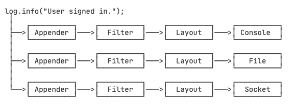
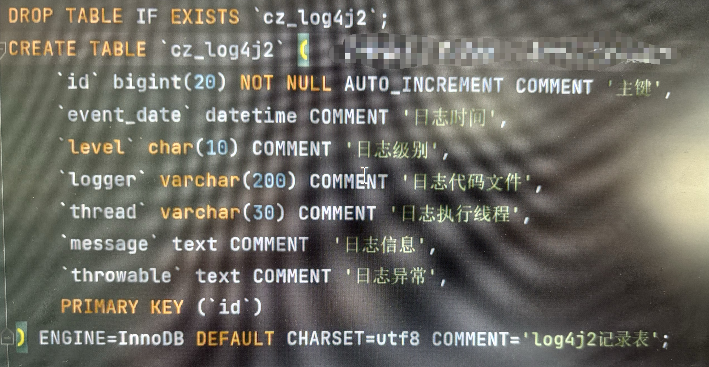
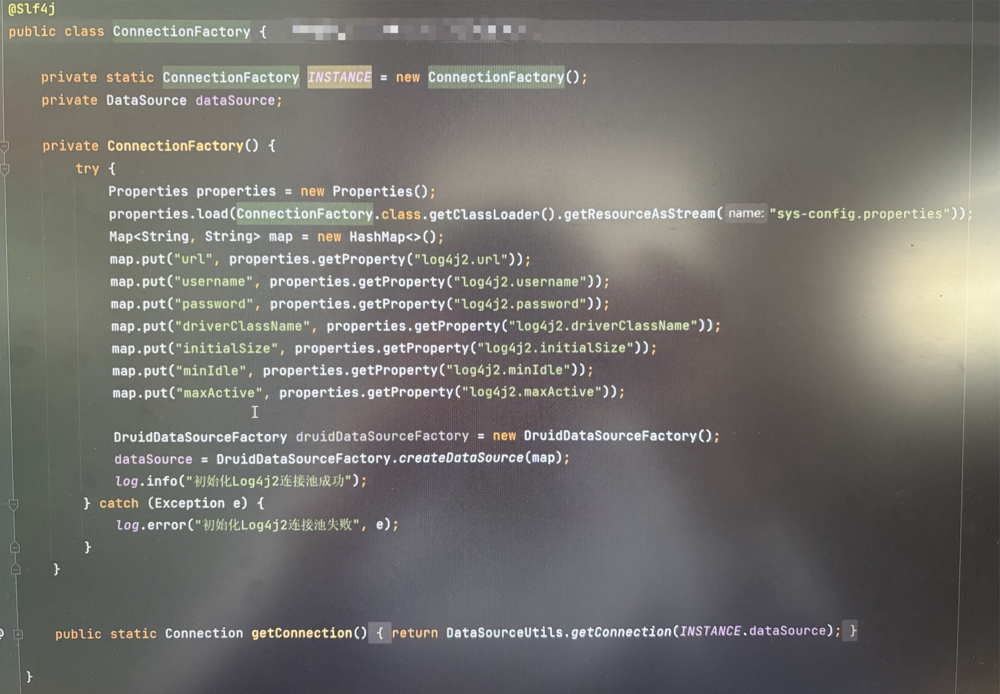
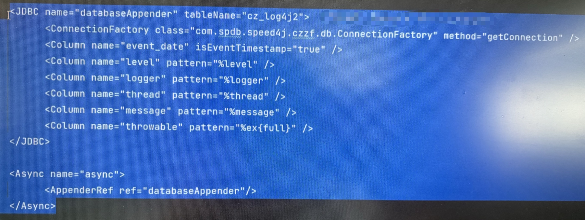
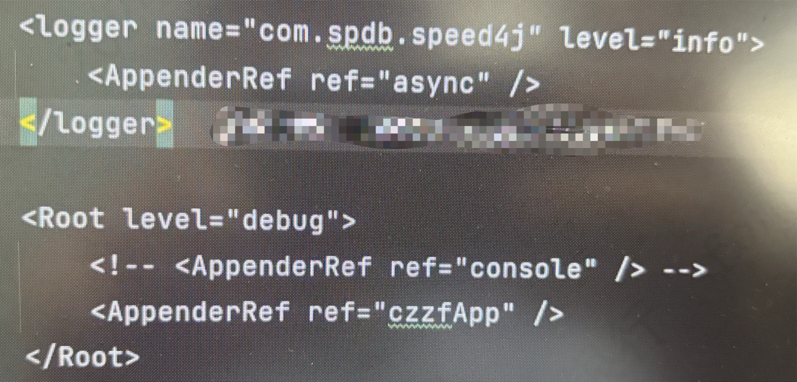

- 使用日志的好处
  collapsed:: true
	- 可以设置输出样式，避免自己每次都写"ERROR: " + var；
	- 可以设置输出级别，禁止某些级别输出。例如，只输出错误日志；
	- 可以被重定向到文件，这样可以在程序运行结束后查看日志；
	- 可以按包名控制日志级别，只输出某些包打的日志；
- Java.util.logging
  collapsed:: true
	- JDK的Logging定义了7个日志级别，从严重到普通：
	    collapsed:: true
		- SEVERE
		- WARNING
		- INFO（默认的级别）
		- CONFIG
		- FINE
		- FINER
		- FINEST
	- 局限
	    collapsed:: true
		- Logging系统在JVM启动时读取配置文件并完成初始化，一旦开始运行main()方法，就无法修改配置。
		- 配置文件需要通过在JVM启动时传递参数`-Djava.util.logging.config.file=<config-file-name>`。
- Commons Logging
  collapsed:: true
	- common-logging 是 apache 的一个开源项目。也称Jakarta Commons Logging，缩写 JCL。
	- common-logging是一个日志门面。
	- commons logging的功能是提供日志功能的 API 接口，本身并不提供日志的具体实现是在运行时动态的绑定日志实现组件来工作。
	- commons logging 默认会搜索使用Log4j、JDK Logging作为自己的日志系统。
	- 参考文章： [使用Commons Logging](https://www.liaoxuefeng.com/wiki/1252599548343744/1264738932870688)
- Log4j2
  collapsed:: true
	- Log4j是一个日志的具体实现
	- 在Spring中的使用
	  collapsed:: true
		- 引入依赖
		  ```xml
		  <dependencies>
		   
		    <dependency>
		      <groupId>org.springframework.boot</groupId>
		      <artifactId>spring-boot-starter</artifactId>
		      <exclusions>
		        <exclusion>
		          <groupId>org.springframework.boot</groupId>
		          <artifactId>spring-boot-starter-logging</artifactId>
		        </exclusion>
		      </exclusions>
		    </dependency>
		   
		    <dependency>
		      <groupId>org.springframework.boot</groupId>
		      <artifactId>spring-boot-starter-log4j2</artifactId>
		    </dependency>
		   
		    <dependency>
		      <groupId>org.projectlombok</groupId>
		      <artifactId>lombok</artifactId>
		    </dependency>
		   
		  </dependencies>
		  ```
	- Log4j的架构
	    collapsed:: true
		- 
	- Commons Logging和Log4j的搭配使用
	  collapsed:: true
		- Commons Logging，可以作为“日志接口”来使用。而真正的“日志实现”可以使用Log4j。
		- 使用Log4j只需要把log4j2.xml和相关jar放入classpath，分别是log4j-api-2.x.jar、log4j-core-2.x.jar、log4j-jcl-2.x.jar。
		- 只有扩展Log4j时，才需要引用Log4j的接口（例如，将日志加密写入数据库的功能，需要自己开发）。
	- 主要的三个组件
	  collapsed:: true
		- Logger：用于记录消息。
		- Appender：用于将日志信息发布到目标，如文件、数据库、控制台等。
		- Layout：用于以不同的风格格式化日志信息。
	- Log4j2的最佳实践
	  collapsed:: true
		- 为LogManager对象使用静态修饰符：当开发人员在代码中声明任何变量时，都会带来开销。开发人员可以通过如下所示声明静态Logger引用来克服这种开销。
		  ```java
		  private static final Logger log = Logger.getLogger(YourClassName.class);
		  ```
		- 使用`isDebugEnabled()`将调试日志放在Java中，因为它将节省大量的字符串连接活动。下面是Java中调试模式的示例。在Java8中我们可以不用做日志登记的判断，具体可以参考 [Java8不需要校验日志等级](https://logging.apache.org/log4j/2.0/manual/api.html#Java_8_lambda_support_for_lazy_logging) 
		  ```java
		  if(logger.isDebugEnabled()) { 
		       logger.debug("java logging level is DEBUG Enabled"); 
		  }
		  ```
		- 通过使用log4j2.xml，开发人员可以为不同的Java类提供不同的Logger配置。开发人员可以让一些类处于INFO模式，一些类处于WARN模式或ERROR模式。
		- 制作定制的Log4j2 Appenders。如果开发人员想做一些标准Appenders不支持的事情，他们可以在线搜索或编写自己的定制Appenders。例如，开发人员可以通过扩展`AppenderSkeleton`类来制作他们自己的自定义Log4j2 Appender。
		- 如果给定的记录器没有分配级别，那么它将从最接近的祖先继承一个级别。这就是为什么开发人员总是将日志级别分配给配置文件中的根日志记录器，即log4j2.rootLogger=DEBUG。
		- 参考文章： [Log4j 2 Best Practices Example](https://examples.javacodegeeks.com/java-development/enterprise-java/log4j/log4j-2-best-practices-example/)
	- 简单自定义Log4j2的配置
	  collapsed:: true
		- 简单配置
		  ```xml
		  <?xml version="1.0" encoding="UTF-8"?>
		  <Configuration status="WARN">
		      <Appenders>
		          <Console name="Console" target="SYSTEM_OUT">
		              <PatternLayout pattern="%d{HH:mm:ss.SSS} [%t] %-5level %logger{36} - %msg%n"/>
		          </Console>
		      </Appenders>
		      <Loggers>
		          <Root level="INFO">
		              <AppenderRef ref="Console"/>
		          </Root>
		      </Loggers>
		  </Configuration>
		  ```
		- Configuration
		  collapsed:: true
			- Log4j2配置文件的根元素; **status** 属性表示应该记录内部 log4j 事件的级别。
		- Appdenders
		  collapsed:: true
			- 这个元素包含一个追加器列表; 在上面的示例中，定义了一个对应于系统控制台的追加器。
		- Loggers
		  collapsed:: true
			- 这个元素包含一个 Logger 实例列表。 **Root** 元素是一个输出所有消息的标准日志记录器。
		- **注意**：如果您没有提供一个，那么默认情况下将自动配置一个 Console appender 和 ERROR 日志级别。
	- Log4j2 Appenders
	  collapsed:: true
		- ConsoleAppender
			- 功能：将日志输出到系统控制台。
		- FileAppender
			- 功能：将日志写入文件。
		- RollingFileAppender，滚动文件追加器
			- 功能：将日志写入滚动日志文件。
			- 解决的问题：将所有内容都记录到一个文件中并不理想。定期滚动活动日志文件通常要好得多。也就是说他会在某个条件被触发的时候将现有的日志文件存档，新起一个文件进行日志记录。
			- 参考配置
			  下面的滚动策略是每天滚动日志或是文件大于10MB时滚动。
			  ```xml
			  <Configuration status="DEBUG">
			      <Appenders>
			          <Console name="LogToConsole" target="SYSTEM_OUT">
			              <PatternLayout pattern="%d{HH:mm:ss.SSS} [%t] %-5level %logger{36} - %msg%n"/>
			          </Console>
			          <RollingFile name="LogToRollingFile" fileName="logs/app.log"
			                      filePattern="logs/$${date:yyyy-MM}/app-%d{MM-dd-yyyy}-%i.log.gz">
			  			<PatternLayout>
			  				<Pattern>%d %p %c{1.} [%t] %m%n</Pattern>
			  			</PatternLayout>
			  			<Policies>
			  				<TimeBasedTriggeringPolicy />
			  				<SizeBasedTriggeringPolicy size="10 MB"/>
			  			</Policies>
			  		</RollingFile>
			      </Appenders>
			  	
			      <Loggers>
			          <!-- avoid duplicated logs with additivity=false -->
			          <Logger name="com.mkyong" level="debug" additivity="false">
			              <AppenderRef ref="LogToRollingFile"/>
			          </Logger>
			          <Root level="error">
			              <AppenderRef ref="LogToConsole"/>
			          </Root>
			      </Loggers>
			  </Configuration>
			  ```
			- 配置参数
				- append：如果为 true （默认值），则记录将附加到文件末尾。设置为 false 时，将在写入新记录之前清除该文件。
				- bufferedIO：如果为 true （默认值），则记录将写入缓冲区，数据将在缓冲区已满时写入磁盘，或者，如果设置了 iminstantteFlush，则在写入记录时写入磁盘。文件锁定不能与缓冲 IO 一起使用。性能测试表明，即使启用了即时刷新，使用缓冲 I/O 也能显著提高性能。
				- bufferSize：当 bufferedIO 为 true 时，这是缓冲区大小，默认值为 8192 字节。
				- fileName：要写入的文件的名称。如果文件或其任何父目录不存在，则将创建它们。
				- filePattern：已归档日志文件的文件名的模式。模式的格式取决于所使用的滚动更新策略。DefaultRolloverPolicy 将接受与 SimpleDateFormat 兼容的日期/时间模式和/或表示整数计数器的 %i。该模式还支持在运行时进行插值，因此任何查找（如 DateLookup）都可以包含在模式中。
				- immediateFlush：设置为 true（默认值），每次都将写入缓存区的内容刷新到本地磁盘中。
				- filter：用于确定事件是否应由此追加程序处理的筛选器。使用复合过滤器可以使用多个过滤器。
				- policy：用于确定是否应进行滚动更新的策略。
				- strategy：用于确定存档文件的名称和位置的策略。
			- 触发策略
				- 作用：触发策略确定是否应该执行翻转。
				- 复合触发策略
				    collapsed:: true
					- 组合多个 `CompositeTriggeringPolicy` 触发策略，如果任何配置的策略返回 `true`，则返回 `true`。只需 `CompositeTriggeringPolicy` 将其他策略包装在 `Policies` 元素中即可进行配置。
				- Cron触发策略
				    collapsed:: true
					- 触发器基于 `CronTriggeringPolicy` cron 表达式的滚动更新。此策略由计时器控制，并且与处理日志事件是异步的，因此上一个或下一个时间段的日志事件可能会出现在日志文件的开头或结尾。追加器的 `filePattern` 属性应包含时间戳，否则目标文件将在每次翻转时被覆盖。
				- 启动时触发策略
				  collapsed:: true
					- 如果日志文件早于当前 JVM 的启动时间，并且满足或超过最小文件大小，则该 `OnStartupTriggeringPolicy` 策略会导致滚动更新。
				- 基于文件大小的触发策略
				    collapsed:: true
					- 一旦 `SizeBasedTriggeringPolicy` 文件达到指定大小，就会发生翻转。大小可以以字节为单位指定，后缀为 KB、MB、GB 或 TB，例如 20MB 。
				- 基于时间的触发策略
				  collapsed:: true
					- TimeBasedTriggeringPolicy是基于`filePattern`中的`%d{yyyy-MM-dd-HH-mm-ss}`来决定到底采用哪种时间单位（天、小时、分钟、秒等）。
					- 一旦 `TimeBasedTriggeringPolicy` 日期/时间模式不再适用于活动文件，就会出现翻转。此策略接受一个属性， interval 该属性指示根据时间模式和 modulate 布尔属性进行滚动更新的频率。
					- 配置参数
					    collapsed:: true
						- interval：根据日期模式中最具体的时间单位进行滚动更新的频率。例如filePattern的最后一位日期是小时，这里设置4，则表示每4个小时就生成一个新文件。
						- modulate：是否对封存时间进行调制。若modulate=true， 则封存时间将以0点为边界进行偏移计算。比如，modulate=true，interval=4hours， 那么假设上次封存日志的时间为03:00，则下次封存日志的时间为04:00， 之后的封存时间依次为08:00，12:00，16:00。。。
					- 参考文章： [Log4j2日志滚动策略TimeBasedTriggeringPolicy的魔鬼槽点](https://blog.csdn.net/qq_17776287/article/details/110948948)
					  collapsed:: true
						-
			- 滚动策略
				- 作用：滚动定义应该如何进行翻转，或者说是如何将现有的日志文件存档，创建一个新的文件。如果未配置 RolloverStrategy，RollingFileAppender 将使用 DefaultRolloverStrategy。
				- 默认滚动更新策略
					- 更新策略
					    collapsed:: true
						- 默认翻转策略接受在滚动文件追加程序本身上指定的 filePattern 属性中的**日期/时间模式**和**整数**。
						- 如果存在日期/时间模式，它将替换为当前日期和时间值。
						- 如果模式包含一个整数，它将在每次翻转时递增。
						- 如果模式中同时包含日期/时间和整数，则整数将递增，直到日期/时间模式的结果发生变化。
						- 如果文件模式以“.gz”、“.zip”、“.bz2”、“.deflate”、“.pack200”或“.xz”结尾，则生成的存档将使用与后缀匹配的压缩方案进行压缩。
					- 配置参数
					    collapsed:: true
						- fileIndex：如果设置为“max”（默认值），则索引较高的文件将比索引较小的文件先更新。如果设置为“min”，则文件重命名和计数器将遵循上述固定窗口策略。
						- min：计数器的最小值。默认值为 1。
						- max：计数器的最大值。一旦达到此值，旧存档将在后续滚动更新时删除。默认值为 7。
						- compressionLeverl：设置压缩级别 0-9，其中 0 = 无，1 = 最佳速度，到 9 = 最佳压缩。仅适用于 ZIP 文件。
				- 直接写入滚动更新策略
		- RollingRandomAccessFileAppender
		  collapsed:: true
			- RollingFileAppender相似，但速度更快。
		- AsyncAppender
		  collapsed:: true
			- 功能：异步记录日志，提高性能。
		- SMTPAppender
		- JDBCAppender
		  collapsed:: true
			- 功能：将日志记录到数据库
			- 具体实践：将Log4j2中的日志输出到数据库中去
			  collapsed:: true
				- 步骤
				  collapsed:: true
					- 新建一张表结构
					  
					- 配置获取数据库连接的工厂类
					  
					- 在log4j2中配置JDBC和Async的Appender
					  
					- 配置日志输出的logger
					  
				- 注意
					- 数据库表中throwable字段其实记录的是`e.printStack()`和`log.error("", e)`的错误日志。
					- 因为上面采用的是异步的方式记录日志到数据库，所以代码执行的具体**行数**，无法在数据库中进行记录。
		- FailoverAppender
		  collapsed:: true
			- 功能：配置一个故障转移策略Appender，在配置的主Appender失败时，就可以使用这个故障转移Appender做备份。
			- 例如，可以配置一个主 JDBCAppender，如果无法建立数据库连接，可以配置一个辅助的 RollingFile 和 Console appender：
			  ```xml
			  <Failover name="FailoverAppender" primary="JDBCAppender">
			      <Failovers>
			          <AppenderRef ref="RollingFileAppender" />
			          <AppenderRef ref="Console" />
			      </Failovers>
			  </Failover>
			  ```
		- RoutingAppender
	- Filters
	  collapsed:: true
		- log4j2 LevelRangeFilter 过滤器，如果 LogEvent 中的级别在配置 min 和 max 级别的范围内，则返回 onMatch 结果，否则返回 onMismatch 值。
		- 配置参数
			- min：配置最高级别。
			- max：配置最低级别。
			- onMatch：如果日志的级别在max至min之间，`ACCEPT`为接受，`DENY`为拒绝。
			- onMismatch：如果日志的级别不在max至min之间，`ACCEPT`为接受，`DENY`为拒绝。
		- 参考文章
			- [log4j2中LevelRangeFilter的注意点](https://blog.csdn.net/lewky_liu/article/details/85219126)
	- 日志级别
	  collapsed:: true
		- OFF：最高等级的，用于关闭所有日志记录。
		- FATAL：致命等级的日志，指发生了严重的会导致应用程序退出的事件。
		- ERROR：错误等级的日志，指发生了错误，但是不影响系统运行。
		- WARN：警告等级的日志，指发生了异常，可能是潜在的错误。
		- INFO：信息等级的日志，指一些在粗粒度级别上需要强调的应用程序运行信息。
		- DEBUG：调试等级的日志，指一些细粒度的对于程序调试有帮助的信息。
		- TRACE：跟踪等级的日志，指一些包含程序运行详细过程的信息。
		- ALL 最低等级的，用于打开所有日志记录。
	- 配置布局
	  collapsed:: true
		- 通过使用布局来定义日志消息的格式。
		- Log4j2提供的常用布局：
		  collapsed:: true
			- *PatternLayout*：根据字符串规则配置消息格式
			  collapsed:: true
				- 该机制主要由包含转换说明符的转换模式驱动。每个说明符以% 符号开始，后面跟着控制消息的宽度和颜色等内容的修饰符，以及表示内容的转换字符，如日期或线程名称。
				- 关于说明符的含义的解释参考： [PatternLayout](https://logging.apache.org/log4j/2.x/manual/layouts.html#PatternLayout)
			- *JsonLayout*：为日志消息定义JSON格式
			- *CsvLayout*：可用于创建CSV格式的消息
	- 配置过滤器
	  collapsed:: true
		- Log4j2中的筛选器用于确定是否应处理或跳过日志消息。
		- 可以为**整个配置**或在**日志记录器**或**追加器**三个级别上配置筛选器。
		- 过滤器类型
		  collapsed:: true
			- `BurstFilter`：控制允许的日志事件数。
			  collapsed:: true
				- 例如控制日志输出的速率
				  下面的配置中level="info"说明将有选择地忽略 INFO 级别及以下级别消息的流量控制，同时确保您不会丢失任何高于 INFO 的更重要的消息。
				  rate 定义每秒应处理的平均日志消息数。
				  maxBurst 控制过滤器开始消除日志条目之前流量突发的总体大小。
				  ```xml
				  <Filters>
				      <BurstFilter level="INFO" rate="10" maxBurst="100"/>
				  </Filters>
				  ```
			- `DynamicThresholdFilter`：基于特定属性的过滤器日志行
			- `RegexFilter`：根据消息是否与正则表达式匹配来筛选消息
	- 配置Loggers
	  collapsed:: true
		- 属性
			- `name`：记录器名称
			- `level`：记录器记录的日志级别，默认为ERROR
			- `additivity`：是否支持与Root记录器叠加使用，默认为true。如果设置为true，比如当前logger和Root都配置了输出到控制台的Appender，那么这个包下面的日志就会在控制台被输出两次。
			- `AppenderRef`：一个记录器（Logger）可以配置多个追加器（Appender），如果配置了多个追加器，在处理日志记录事件的时候将分别调用每一个追加器。
			- `includeLocation`：关闭日志记录的行号信息，也就是说打印的日志不显示行号。这个配置比较消耗性能，如非必要不要设置该属性为true。
		- 必须配置一个Root记录器
		- Root记录器与其他记录器的区别
		  collapsed:: true
			- 根记录器没有名称属性。
			- 根记录器不支持`additivity`属性，因为它没有父记录器。
		- 排除一些包的日志输出，该怎么做
			- 比如我想要将http包下的日志排除或者说过滤，只需要配置一个logger就行，具体代码如下：
			  ```xml
			  <logger name="cn.bravedawn.http" level='debug'></logger>
			  ```
	- 使用MDC（Mapped Diagnostic Context）增强日志
		- [日志之MDC和异步多线程间传递线程id](https://blog.csdn.net/u012060033/article/details/129718315)
		- 参考文章
			- [Improved Java Logging with Mapped Diagnostic Context (MDC)](https://www.baeldung.com/mdc-in-log4j-2-logback)
	- 日志记录方式
	  collapsed:: true
		- 方式
			- 同步
			  collapsed:: true
				- 我们正常定义的Appender和Logger都是同步的。
			- 异步
			  collapsed:: true
				- AsyncAppender
				  collapsed:: true
					- AsyncAppender是通过引用别的Appender来实现的，当有日志事件到达时，会开启另外一个线程来处理它们。
					- 在配置文件中，AsyncAppender应该在它引用的Appender之后配置，默认使用 java.util.concurrent.ArrayBlockingQueue实现而不需要其它外部的类库。
					- 当使用此Appender的时候，在多线程的环境下需要注意，阻塞队列容易受到锁争用的影响，这可能会对性能产生影响。这时候，我们应该考虑使用无锁的异步记录器（AsyncLogger）。
				- AsyncLogger
				  collapsed:: true
					- 定义：所有的日志都异步的记录，在配置文件上不用做任何改动，只需要在jvm启动的时候增加一个参数
					- 配置
					  collapsed:: true
						- 需要引入disruptor以来进行使用
					- 全异步
					  collapsed:: true
						- 特点：提供最佳性能
						- 特殊配置
						  collapsed:: true
							- 在log4j2.component.properties配置如下内容
							  ```properties
							  log4j2.contextSelector=org.apache.logging.log4j.core.async.AsyncLoggerContextSelector
							  ```
					- 混合异步
					  collapsed:: true
						- 定义：在应用中同时使用同步日志和异步日志
						- 特点：提供最大灵活性
						- 配置
						  collapsed:: true
							- 使用`<asyncRoot>`或`<asyncLogger>`配置元素指定需要异步的记录器。
							- 一个配置只能包含一个根记录器(`<root>`或`<asyncRoot>`元素)，但异步和非异步记录器可以组合使用。例如，对于同步记录器，包含`<asyncLogger>`元素的配置文件也可以包含`<root>`和`<logger>`元素。
		- 异步日志的实现
		  collapsed:: true
			- 会有两个后台线程，您的应用程序将日志消息传递给线程 A，线程 A 将消息传递给线程 B，最后将消息记录到磁盘。 线程间消息的传递是通过Disruptor实现的。
			- 异步日志记录可以通过在单独的线程中执行 I/O 操作来提高应用程序的性能，也就是上面提到的线程B。
		- 异步日志的优缺点
		  collapsed:: true
			- 优点
			  collapsed:: true
				- **更高的峰值吞吐量**。 使用异步记录器，您的应用程序记录消息的速度是同步记录器的 6 到 68 倍。
				- 异步日志记录可以通过缩短等待时间来帮助**防止或抑制延迟峰值**，直到可以记录下一条消息。这里的延迟是指在记录突发消息的时候，第一条突发消息的日志记录和第二条消息的日志记录之间的间隔时间。而Log4j2可以减少这种情况的延迟。
				- **更低的日志记录响应时间延迟**。 响应时间延迟是在给定工作负载下调用 Logger.log 返回所需的时间。 异步记录器的延迟始终低于同步记录器甚至基于队列的异步附加程序（AsyncAppender）。
			- 缺点
			  collapsed:: true
				- **错误处理**，如果在日志记录的过程中出现问题并抛出异常，log4j2无法向应用程序通知这个问题。这可以通过配置 ExceptionHandler 来部分缓解，但这可能仍然无法涵盖所有情况。所以针对比较重要的日志，例如审计日记，可以采用同步日志来记录。
				- **极少数情况下，包含可变对象的日志记录可能不是准确的**，你可能在日志输出中看到对象修改前或是修改后的可变对象数据。所以针对这种情况，一不要在异步日志打印后再去修改可变对象，二**自定义 Message 实现**在设计时应考虑到异步使用，并在构造时对其参数进行快照，或记录其线程安全特性。
				- **若应用程序运行在CPU稀缺的环境中**，例如一台机器只有一个CPU的单核机器，这种情况不建议使用异步日志。
	- Pattern Layouts format配置
	  collapsed:: true
		- 以下面这段配置为例，更多具体的配置参考： [Pattern Layout](https://logging.apache.org/log4j/2.x/manual/layouts.html#PatternLayout) 
		  ```
		  %date{yyyy-MM-dd HH:mm:ss.SSS} [%thread] [%level{length=5}] %logger{36}.%M(%line) - %msg %n
		  ```
			- `%date{yyyy-MM-dd HH:mm:ss.SSS}`：它以给定的日期-时间格式写入日期。
			- `%thread`：它在日志中写入线程名称，值得注意的是线程名的最大长度是15，这个无法修改，超出的部分会从头截取掉。
			- `%level{length=5}`：它在日志中写入级别。`length=5`中的5将字段的宽度设置为5个字符。
			- `%logger{36}`：它在日志中写入日志记录器的名称(例如com.jcg.log4j2.demo)，36是指记录日记记录器的精度，先固定写成36。或者可以写为`%c`
			- `%M`：记录日志输出所在的方法。
			- `%line`：它在日志中写入行号。
			- `%msg`：将消息写入日志。
			- `%n`：换行，输出与平台相关的行分隔符字符。
	- Policy触发策略
	  collapsed:: true
		- Policy是用来控制日志文件何时(When)进行滚动的。
		- 如果配置的是RollingFile或RollingRandomAccessFile，则必须配置一个Policy。
		- 触发策略
			- SizeBasedTriggeringPolicy
			  collapsed:: true
				- 基于日志文件大小的触发策略。单位有：KB，MB，GB
			- CronTriggeringPolicy
			  collapsed:: true
				- 基于Cron表达式的触发策略，很灵活。
			- TimeBasedTriggeringPolicy
			  collapsed:: true
				- 基于时间的触发策略。该策略主要是完成周期性的log文件封存工作。
				- 配置参数
					- **interval**：日记压缩的时间间隔，这个配置与filePattern属性的精确时间相关，上面配置的是`%d{yyyy-MM-dd}-%i.log.gz`，结尾时间是dd，也就是按照天作为时间间隔配置的单位
					- **modulate**：是否对压缩时间进行调制。比如说我们配置interval="4"，filePattern配置的单位是小时，也就是每两个小时做一次压缩备份。 那么假设上次封存日志的时间为03:00，则下次封存日志的时间为04:00， 之后的封存时间依次为08:00，12:00，16:00
	- Strategy策略
	  collapsed:: true
		- Strategy是用来控制日志文件如何(How)进行滚动的。
		- DefaultRolloverStrategy
			- DefaultRolloverStrategy指定了当触发rollover时的默认策略。
			- DefaultRolloverStrategy是Log4j2提供的默认的rollover策略，即使在log4j2.xml中没有显式指明，也相当于为RollingFile配置下添加了如下语句。DefaultRolloverStrategy默认的max为7。
			  ```xml
			  <DefaultRolloverStrategy max="7"/>
			  ```
			- 参数配置
				- max
					- max参数是与filePattern中的计数器`%i`配合起作用的，若filePattern为`filePattern="logs/app-%d{yyyy-MM-dd}.log"`，由于没有设置%i计数器，max参数将不起作用。
					- max参数不是需要保留的文件的最大个数，而是**当前目录下**日记归档的一个**计数器**。
					- 若计数器大小大于max时，他会删除之前的计数器为1的归档日志，然后对后续日志按照计数器从小到大依次进行重命名。
		- 日志归档的保留策略：Delete on Rollove（滚动删除）
			- 配置参数
				- basePath：删除匹配到的过期备份文件
				- maxDepth：由于备份文件保存在`${LOG_HOME}/$${date:yyyy-MM}`，所以目录深度设置为2
				- IfFileName：匹配文件名称
					- glob：匹配2级目录深度下的以.log.gz结尾的备份文件
				- IfLastModified：匹配文件修改时间
					- age：匹配超过180天的文件，单位D、H、M、S分别表示天、小时、分钟、秒
	- 参考文章
	  collapsed:: true
		- [Apache Log4j](https://logging.apache.org/log4j/2.x/)
		- [Asynchronous Loggers for Low-Latency Logging](https://logging.apache.org/log4j/2.x/manual/async.html)
		- [Java Logging Tutorials](https://www.javacodegeeks.com/java-logging-tutorials)
		- [How Log4J2 Works: 10 Ways to Get the Most Out Of It](https://stackify.com/log4j2-java/)
		- [Apache Log4j 2 Tutorials](https://mkyong.com/logging/apache-log4j-2-tutorials/)
		- [Log4j2实现不同线程不同级别日志输出到不同的文件中](http://codepub.cn/2016/12/18/Log4j2-to-achieve-different-levels-of-different-threads-log-output-to-a-different-file/)
		- [使用Log4j](https://www.liaoxuefeng.com/wiki/1252599548343744/1264739436350112)
		- [Spring Boot Logback and Log4j2 Extensions](https://www.baeldung.com/spring-boot-logback-log4j2)
		  collapsed:: true
			- 主要介绍了Spring Boot项目中引入Logback和Log4j2框架的方法和步骤。
		- 比较好的文章，介绍了各种使用案例：https://www.haoyizebo.com/posts/a29ac0/#
		- 过滤器的配置：https://blog.csdn.net/yzx3105/article/details/106296250
		- logger上additivity属性的文章：https://blog.csdn.net/chen_lay/article/details/122979095
	- 实践
	  collapsed:: true
		- Log4j2的简单实战
			- 项目：Log4j2Example
			- 参考文章：https://examples.javacodegeeks.com/java-development/enterprise-java/log4j/log4j-2-getting-started-example/
- Slf4j
  collapsed:: true
	- SLF4J是一个日志门面。
	- 对比一下Commons Logging和SLF4J的接口：
		- 
	- SLF4J和Logback的搭配使用
		- 使用SLF4J和Logback需要引入的依赖：slf4j-api-1.7.x.jar、logback-classic-1.2.x.jar、logback-core-1.2.x.jar。
	- 是一个门面框架，只定义接口，没有具体的实现。在日常使用时调用Slf4j的接口就行，底层的日志实现有具体的日志实现框架去做。
	- 背景
		- 市面上出现多种日志实现工具，场面十分混乱，因为这些日志系统互相没有关联，替换和统一也就变成了比较棘手的一件事。
- Logback
  collapsed:: true
	- Logback是一个日志的具体实现。
- 日志级别（以下等级由高到低，等级越低输出的日志信息越多）
  collapsed:: true
	- Fatal：致命等级的日志，指发生了严重的会导致应用程序退出的事件
	- Error：错误等级的日志，指发生了错误，但是不影响系统运行；
	- Warn：警告等级的日志，指发生了异常，可能是潜在的错误；
	- Info：信息等级的日志，指一些在粗粒度级别上需要强调的应用程序运行信息；
	- Debug：调试等级的日志，指一些细粒度的对于程序调试有帮助的信息；
	- Trace：跟踪等级的日志，指一些包含程序运行详细过程的信息。
- 日志记录主要分为三部分
  collapsed:: true
	- Logger：Logger负责捕获要记录的消息以及某些元数据，并将其传递给日志框架。
	- Formatter：在接收到消息后，框架使用该消息调用Formatter。Formatter为输出格式化它。
	- Appender：框架将格式化的消息交给适当的Appender处理。可能包括控制台显示、写入磁盘、追加到数据库或电子邮件。
- `System.out.println()`的局限性
  collapsed:: true
	- 任何日志框架都允许开发人员将调试信息记录到可以用作过滤标准的日志级别，即可以禁用属于特定日志级别的消息。例如，在生产环境中，开发人员更关心WARN消息而不是DEBUG消息。
	- 日志框架可以产生更好的输出和元数据，这有助于故障排除和调试。例如，Log4j2允许通过指定格式化模式来打印格式化输出，即使用PatternLayout可以包括时间戳、类名等。