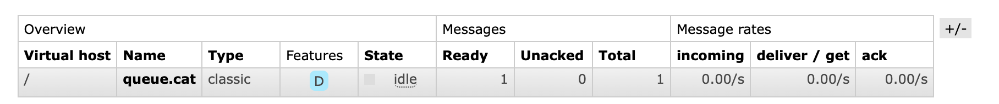
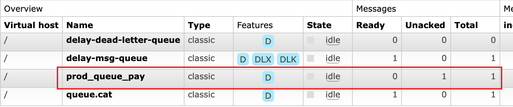

- RabbitMQ
	- 工作模式
	  collapsed:: true
		- 简单模式
		  collapsed:: true
			- 特征：一个生产者对应一个消费者
		- 工作队列模式
		  collapsed:: true
			- 特征：与入门程序的`简单模式`相比，多了一个或一些消费端，多个消费端共同消费同一个队列 中的消息。
			- 应用场景：对于任务过重或任务较多情况使用工作队列可以提高任务处理的速度。
			- 关键点
			  collapsed:: true
				- 循环调度：rabbitmq会将消息不断地发送给接收方。
				- 消息确认：接收方异常如果没有确认消费消息，超过交付时间，rabbitmq就会将该消息发送另一个接受者。
				- 消息持久化
				  collapsed:: true
					- 发送方在发送时要将消息持久化，避免rabbitmq崩溃或退出时消息丢失。值得注意的是已经创建的队列不允许修改是否持久化参数。
					- rabbitmq只是将消息保存到了缓存中，持久性并不强，简单的任务队列是够用的。如果要保证强持久性，需要使用**发布者确认**。
				- 公平调度
				  collapsed:: true
					- rabbitmq默认是将消息平均的分配给消费者Round-Robin，也就是，并不考虑消费者尚未确认的消息数量。
					- 可以通过prefetchCount=1，告诉rabbitmq在一个工作消费者确认一条消息前，不会再给他发消息。
		- 发布/订阅模式
		  collapsed:: true
			- 特征：
			  collapsed:: true
				- 1、同时向多个消费者发送消息
				- 2、每个消费者监听自己的队列。
				- 2、生产者将消息发给broker，由交换机将消息转发到绑定此交换机的每个队列，每个绑定交换机的队列都将接收到消息。
			- 角色
			  
			- P：生产者，也就是要发送消息的程序，但是不再发送到队列中，而是发给X（交换机）
			- C：消费者，消息的接受者，会一直等待消息到来。
			- Queue：消息队列，接收消息、缓存消息。
			- Exchange：交换机，图中的X。一方面，接收生产者发送的消息。另一方面，知道如何处理消息，例如递交给某个特别队列、递交给所有队列、或是将消息丢弃。到底如何操作，取决于 Exchange的类型。Exchange有常见以下3种类型：
			  collapsed:: true
				- Fanout：广播，将消息交给所有绑定到交换机的队列上
				- Direct：定向，把消息交给符合指定routing key 的队列
				- Topic：通配符，把消息交给符合routing pattern（路由模式） 的队列
				- Header：根据发送消息内容中的headers属性进行匹配，性能差，一般不使用
		- 路由模式
		  collapsed:: true
			- 特征
				- 1、选择性地接收信息，把消息交给符合指定routing key 的队列。
				- 2、Routing模式要求队列在绑定交换机时要指定routing key，消息会转发到符合routing key的队列。
			- 角色
			  
		- 通配符模式
		  collapsed:: true
			- 特征
			  collapsed:: true
				- Topic 类型与 Direct 相比，都是可以根据 RoutingKey 把消息路由到不同的队列。只不过Topic类型Exchange可以让队列在绑定Routing key的时候使用`通配符`。Routingkey 一般都是有一个或多个单词组成，多个单词之间以”.”分割，例如： `item.insert`。
				- 相比于路由模式，通配符模式可以让一个队列接收多种不同的消息，或者说RoutingKey可以接收多个生产者的消息。而不是像路由模式一样只能接收固定RoutingKey生产者的消息。
				- 可以实现
			- 匹配规则
			  collapsed:: true
				- `#` ：匹配一个或多个词
				- `*` ：只能匹配1个词
			- 角色
			  
		- 远程过程调用（RPC）模式
		  collapsed:: true
			- 特征
			  collapsed:: true
				- 如果我们需要在远程计算机上运行一个耗时计算并等待结果，我们可以利用消息队列方便的实现一个rpc系统。
			- 角色
			  collapsed:: true
			  
				- client
				- server
				- rpc_queue：保存客户端的请求信息
				- reply_to：保存服务器端的响应信息
			- 如何处理服务器的的响应
			  collapsed:: true
				- 通过reply_to回调队列将消息返回给客户端。
			- 如何准确的将响应返回到特定的客户端上
			  collapsed:: true
				- 放在回调队列上的响应，客户端如何判断这个响应是属于哪个请求的。这里我们就要提到AMQP协议消息附带的correlationId属性，我们通过在客户端声明这个属性，告诉服务端这个参数，在服务端处理后，这个参数就会发送到指定的客户端上。
		- 发布者确认
		  collapsed:: true
			- 目的：使用发布者确认来确保发布的消息已安全到达服务器被处理。
			- 策略
			  collapsed:: true
				- 单独发布消息
				  collapsed:: true
					- 单独发布消息，同步等待确认：简单，但吞吐量非常有限。
					- 消息发送之后，调用`Channel#waitForConfirmsOrDie(long)`方法等待被消费者确认，如果被消费了，客户端会收到异步确认，这个方法就会返回。如果消息在超时时间内没有得到确认或者被拒绝（意味着代理由于某种原因无法处理它），该方法将抛出异常。异常的处理通常包括记录错误消息或重试发送消息。
					- 主要缺点：它会显着减慢发布速度，因为消息的确认会阻止所有后续消息的发布。这种方法不会提供每秒超过数百条已发布消息的吞吐量。
				- 批量发布消息
				  collapsed:: true
					- 批量发布消息，批量同步等待确认：简单，吞吐量合理，但很难推断何时出现问题。
				- 异步处理发布者确认
				  collapsed:: true
					- 异步处理：最好的性能和资源利用，在出错的情况下很好的控制，但可以参与正确的实现。
		- 参考文章
		  collapsed:: true
			- [RabbitMQ教程](https://juejin.cn/post/7071589818886520869#heading-48)
			- [消息队列学习 | 基础](https://www.sulvblog.cn/posts/tech/message_queue_foundation/)
	- 按我的理解RoutingKey是邮件发送人填写的收件人地址，BindingKey是邮件收件人的地址
	- AMQP协议的模型架构：生产者将消息发送给交换器，交换器和队列绑定。当生产者发送消息时所携带的 RoutingKey 与绑定时 BindingKey 匹配时，消息即被存入相应的队列之中，消费者可以订阅相应的队列来获取消息。
	- 连接RabbitMQ
	  collapsed:: true
		- Connection就是一个TCP连接，通过连接来创建**信道（Channel）**，多个信道可以复用一个Connection。
		- Connection 可以用来创建**多个 Channel 实例**，但是 Channel 实例**不能在线程问共享**，应用程序应该为每一个线程开辟一个 Channel 。
		- 每个 Channel 都拥有自己独立的线程。
	- 使用交换机和队列
	  collapsed:: true
		- 通过`channel.exchangeDeclare()`方法创建交换机，这里具体参数说明参考《RabbitMQ实战指南》3.2.1节。
		- 通过`channel.queueDeclare(name, durable, autoDelete, exclusive, noWait, args)`方法创建队列
		  collapsed:: true
			- `name`：队列名字。
			- `durable`：是否持久化，队列的声明默认是存放到内存中的，如果rabbitmq重启会丢失，如果想重启之后还存在就要使队列持久化，保存到Erlang自带的Mnesia数据库中，当rabbitmq重启之后会读取该数据库。
			- `autoDelete`：是否自动删除队列，当最后一个消费者断开连接之后队列是否自动被删除，可以通过RabbitMQ Management，查看某个队列的消费者数量，当consumers = 0时队列就会自动删除。
			- `exclusive`：是否排外的，有两个作用，一：**当连接关闭时connection.close()该队列是否会自动删除**；二：该队列是否是私有的private，如果不是排外的，可以使用两个消费者都访问同一个队列，没有任何问题，如果是排外的，会对当前队列加锁，其他通道channel是不能访问的，如果强制访问会报异常：`com.rabbitmq.client.ShutdownSignalException: channel error; protocol method: #method<channel.close>(reply-code=405, reply-text=RESOURCE_LOCKED - cannot obtain exclusive access to locked queue 'queue_name' in vhost '/', class-id=50, method-id=20)`，**一般等于true的话用于一个队列只能有一个消费者来消费的场景**。
			- `args`：相关参数，目前一般为null。
		- 通过`channel.queueBind()`方法将交换机和队列进行绑定
		- 通过`channel.exchangeBind()`方法将交换机和交换机进行绑定，交换机也可以看做是一个队列，消息也可以从一个交换机到另一个交换机
	- 发送消息
	  collapsed:: true
		- 通过`channel.basicPublish()`发送消息
	- 生产端消息确认类型
	  collapsed:: true
		- `NONE`：表示禁用发布确认模式，默认值，使用此模式之后，不管消息有没有发送到Broker都不会触发ConfirmCallback回调。
		- `CORRELATED`：表示消息成功到达Broker后触发**ConfirmCalllBack**回调
		- `SIMPLE`：一simple模式下如果消息成功到达Broker后一样会触发**ConfirmCalllBack**回调；二发布消息成功后使用rabbitTemplate调用waitForConfirms或waitForConfirmsOrDie方法等待broker节点返回发送结果，根据返回结果来判定下一步的逻辑，🚨注意：waitForConfirmsOrDie方法如果返回false则会关闭channel信道，则接下来无法发送消息到broker。
	- 消费消息
	  collapsed:: true
		- 消费模式有两种：推模式和拉模式
		- 推模式，如果要实现高吞吐量建议使用这种模式。
		  collapsed:: true
			- 消费端的代码：`channel.basicConsume()`。
		- 拉模式，如果只想从队列获得单条消息而不是持续订阅建议使用这种。
		  collapsed:: true
			- 消费端的代码：`channel.basicGet()`，是一条一条从队列中获取的。
		- 参考文章：
		  collapsed:: true
			- [推或拉？ rabbitMQ 消费模式该如何选择](https://developer.aliyun.com/article/1279784)
			- [基于推和拉两种方式消费RabbitMQ消息](http://www.lzhpo.com/article/172)
	- 消费端的确认和拒绝
	  collapsed:: true
		- 作用：采用消息确认机制，消费者就有足够的时间去消费消息，不会因消息消费过程中因消费者进程挂掉导致的消息丢失问题。
		- 原理：RabbitMQ将消息投递给消费者之后，消费者如果一直没有返回确认的话，RabbitMQ就会一直等消费者处理。如果消费者断开了连接，RabbitMQ就会将这条消息重新投递。
		- 消息是否重新投递给消费者的唯一依据：消费者连接是否断开
	- `@QueueBinding`注解
	  collapsed:: true
		- 代码
		  ```java
		  @RabbitListener(bindings = @QueueBinding(
		          value = @Queue(value = "topic.n1", durable = "false", autoDelete = "true"),
		          exchange = @Exchange(value = "topic.e", type = ExchangeTypes.TOPIC), key = "r")), 
		          ackMode = "MANUAL", 
		          concurrency = "4")
		  public void consumerDoAck(String data, @Header(AmqpHeaders.DELIVERY_TAG) long deliveryTag, Channel channel) {
		    
		  }
		  ```
		- `@Queue`注解，用于声明队列
		- `@Exchange`注解，用于声明交换机
		- `deliveryTag`: 相当于消息的唯一标识，用于mq辨别是哪个消息被ack/nak了
		- `channel`: mq和consumer之间的管道，通过它来ack/nak
		- 设置`ackMode=MANUAL`，手动ack
		- 设置`concurrency`，进行并发消费，注解中的`concurrency = "4"`属性，表示固定4个消费者；
	- 消费端的限流策略和消费模型
	  collapsed:: true
		- Qos 服务质量
		  collapsed:: true
			- RabbitMQ Client的API中
				- `Channel.basicQos(int prefetchSize, int prefetchCount, boolean global)`
					- `prefetchSize`：指定每个通道一次可以预取的消息字节数。
					- `prefetchCount`：指定每个通道一次可以预取的消息数量。
					- `global`：指示是否将设置应用于整个连接，而不仅仅是当前通道。简单点说就是：**是否将上面设置应用于channel，就是上面两个限制是 channel 级别的还是 consumer 级别。**
						- RabbitMQ 采用 global=false 表示 QoS 设置应适用于每个消费者（对于通道上的新消费者；现有消费者不受影响），也就是说每个消费者都有自己的配置。
						- 而 global=true 表示 QoS 设置应适用于每个通道。这里的通道指的就是Channel。如果采用simple线程模型的话，一个channel会分发到多个消费者，prefetchCount是针对一个Channel来说的，就目前理解来看，为true的话，实际落到每个消费者的消息会比较少。
			- Spring AMQP的API中
				- [`globalQos`](https://springdoc.cn/spring-amqp/#globalQos)
					- 这个配置在yml里面时无法直接配置的，必须重写**监听器容器的工厂类**，这个可以参考文章：[RabbitMQ消费端并发和限流设置](https://developer.aliyun.com/article/1373263)
		- 监听消息的关键配置
			- direct容器
				- `consumersPerQueue`：为每个队列创建消费者的数量。
			- simple容器
				- `concurrentConsumers(concurrency)`：最初为每个 listener 启动的并发消费者的数量，也就是消费者的数量。
					- 这个值的计算，假如一个消费者消费一条小时需要200ms，一秒钟就只能消费4条消息，那么一个消费者一秒钟的TPS就是4。假设我们预估的TPS是40，那么就需要将消费者的数量配置为10。
				- `maxConcurrentConsumers(max-concurrency)`：如果需要，按需启动的最大并发消费者数量。必须大于或等于 `concurrentConsumers`。
				- `prefetchCount(prefetch)`
					- 可设置 consumer 每次接收到的信息数量，系统默认值为 250，这表示当 consumer 队列接收到 250 请求其状态皆为 unacked 时，broker server 将暂停向 consumer 发送消息，待消息处理后再继续。
					- 这个参数时控制server每次向消费端推送消息的数量，设置该参数是为了尽可能提高消费端的吞吐量，如果该参数设置过小，那么消费端的利用率就可能会偏低，如果该参数设置过大，会导致消费端消息出现消息积压，如果消费端处理速度慢，会导致有效消息长时间无法得到消费，设置过大还有一个问题就会他会占用消费端的内存。
		- 设置监听器类型
			- simple
				- 在 SimpleMessageListenerContainer 模式中，无论系统监听多少个 queue 队列，channel 都是共享的，如果我将maxConcurrentConsumers设置为4，每个 channel 都在固定的线程中运行，一个 channel 会向不同的 consumer 发送队列信息。4个 channel 会把接收到不同的队列请求并分发到对应的 consumer 进行处理。这样做的好处是系统可以通过 concurrentConsumers、maxConcurrentConsumers 灵活设定当前队列中消费者的数量，系统可以跟据实际需求灵活处理。但由于每个 channel 都是在固定线程中运行的，一个 channel 要游走于多个 consumer 当中，这无疑增加了系统在上下文切换中的开销。
				- 线程、连接、队列、消费者的关系：一个**线程**固定绑定一个**channel**（连接），一个**channel**会收到多个**队列**的消息，并将消息分发到对应**多个consumer**中。
				- 使用例子来举例：如果有2个队列，创建10个线程（消费者数量和最大消费者数量都设置为10），也就是10个channel，每个队列都有10个消费者，一共是20个消费者，**这二十个消费者共享这10个线程**。
				- SimpleMessageListenerContainer 是经典的容器，使用 channel 共享，一旦某个 channel 关闭或重启，意味着每个队列 queue 中使用当前 channel 的 consumer 都会受到影响。
			- direct
				- 在 RabbitMQ 2.0 后，系统引入了 DirectMessageListenerContainer ，它允许**每个 consumer 都有各自的对应的 channel**的，channel 只管理负责管理当前 consumer 的通道。这样令 consumer 运用更灵活，同时线程并没有跟 channel 绑定，而是由独立的线程池进行管理，这是更好地解决了 SimpleMessageListenerContainer 中上下文切换所带来的资源消耗问题。
				- 如果将consumersPerQueue 设置为 4，针对每个**队列**会建立一个4个线程的**线程池**，线程池中的每个**线程**并不会和固定的**channel**进行绑定。每个 **consumer** 都有自己单独的 **channel**，即使 channel 发生问题时，也不会对其他的 consumer 发生影响，这正是 DirectMessageListenerContainer 的优胜之处。
				- 线程、连接、队列、消费者的关系：一个消费者对应一个Channel。
			- 两者的区别
				- 对于SimpleMessageListenerContainer，无论监听多少个队列，Channel都是共享的。但对与DirectMessageListenerContainer，每个队列的每个消费者都有自己的的Channel。
				- 对于SimpleMessageListenerContainer，可以根据工作量动态地调整并发性，这个功能DirectMessageListenerContainer没有。
				- 对于SimpleMessageListenerContainer，由于Channel可能是多个消费者共享的，所以在不同的Consumer间切换存在性能开销；而DirectMessageListenerContainer没有这个问题，所以相对性能更好。
				- 对于SimpleMessageListenerContainer，如果一个Channel关闭或是重启，意味着每个队列 queue 中使用当前 channel 的 consumer 都会受到影响。而DirectMessageListenerContainer因为一个Channel对应一个消费者，不存在这种问题。
		- Spring 消息监听的三种方案
			- 第一种：单独声明`SimpleMessageListenerContainer`Bean，需要实现`MessageListenerAdapter`的子类，在子类中可以实现它的`getListenerMethodName`进而完成监听不同队列走不同逻辑的功能，可以使用`SimpleMessageListenerContainer`的`addQueueNames()`方法添加多个队列，使得多个队列共用同一个线程容器。
			- 第二种：直接在配置文件中对listener进行配置，这种情况下直接使用`@RabbitMQListener`声明消费者就行，无需指定`containerFactory`属性。这种配置方式其实和下面的第三种是相同的效果。
			- 第三种：单独声明`SimpleRabbitListenerContainerFactory`Bean，并使用`@RabbitListener`注解中的`containerFactory`属性声明该工厂类，该工厂类会为每个队列的消费者单独创建一个`SimpleMessageListenerContainer`，与上面第一种方法的区别是每一个队列的消费者都有自己的单独的`SimpleMessageListenerContainer`，不存在多个队列共用一个线程容器。和第二种情况是类似的。
		- 参考文章
			- [推或拉？ rabbitMQ 消费模式该如何选择](https://developer.aliyun.com/article/1279784)
			- [深入剖析 RabbitMQ —— Spring 框架下实现 AMQP 高级消息队列协议](https://www.cnblogs.com/leslies2/p/11238859.html)
			- [深入理解RabbitMQ中的prefetch_count参数](https://www.cnblogs.com/throwable/p/13834465.html)
	- 关闭连接
	  collapsed:: true
		- Connection和Channel的生命周期
		- 监听器
		- 获取关闭原因
	- 生产者发送消息到交换器的逻辑
	  collapsed:: true
		- 背景：如果生产者生产消息，消息发送不到消息者那里该怎么办
		- `mandatory`参数（`channel.basicPublish`方法参数）
		  collapsed:: true
			- 作用：用于控制一个消息到达交换机器时，**交换器根据自身类型和路由键找不到一个符合条件的队列**，若该参数设置为true就将该消息返回给生产者，如果为false，就将消息丢弃。
			- **发送时没有必要设置mandotory**，因为Spring Boot和RabbitMQ的集成后，我发现即便是exchage找不到对应的queue后，生产端不仅在rabbitTemplate的ReturnsCallback中做了返回，而且还在ConfirmCallback中做了ack的确认，所以这里其实作用不大，这就需要我们在项目启动的时候做好exchange、queue和binding的创建。
		- `immediate`参数
		  collapsed:: true
			- 作用：如果**交换器将消息路由到队列时发现队列上不存在任何消费者**，如果该参数为true，该消息不会存入到队列而会返回给生产者。
			- 这个参数在RabbitMQ3.0被废弃。
		- 备份交换机
		  collapsed:: true
			- 背景：功能和mandatory参数类似，都是消息和交换机无法匹配到符合条件的队列时所做的逻辑处理。不同的是mandatory的处理逻辑相对比较麻烦，我们可以直接创建一个新的交换机，用来将之前不符合条件的消息放置到备份交换机的队列中。
	- 设置过期时间
	  collapsed:: true
		- 设置消息的过期时间
			- 为队列设置过期时间
				- 如果为队列设置了过期时间，则队列中所有的消息都有相同的过期时间。
				- 因为队列中的消息都有同样的过期时间，所以即将过期的消息都集中在队列的头部，RabbitMQ会定期从对头扫描过期的消息，如果消息过期会统一进行过期清理。
				- RabbitMQ Client的API中
					- 通过队列属性设置消息 TTL 的方法是在 `channel.queueDeclare` 方法中加入`x-message -ttl` 参数实现的，这个参数的单位是毫秒。
					- 代码
					  ```java
					  Map<String, Object> argss = new HashMap<String , Object>(); 
					  argss.put("x-message-ttl " , 6000); 
					  channel . queueDeclare(queueName , durable , exclusive , autoDelete , argss) ;
					  ```
			- 为每条消息设置过期时间
				- 如果为每条消息设置过期时间，那么每条消息都有不同的ttl（time to live）。
				- 因为队列中的每条消息都有不同的过期时间，消息散落在队列中，无法集中对消息进行过期清理，只有等到此消息即将被消费时再判定是否过期，如果过期再进行删除即可。
				- **经过实验，RabbitMQ中针对每条消息设置ttl是没有上限的控制的，也就是说可以设置的足够大。**
				  collapsed:: true
					- 参考文章
					  collapsed:: true
						- [google groups上的讨论](https://groups.google.com/g/rabbitmq-users/c/cvvkB0rOAdU?pli=1)
				- RabbitMQ Client的API中
					- 针对每条消息设置 TTL 的方法是在 `channel.basicPublish` 方法中加入 expiration的属性参数，单位为毫秒。
					- 代码
					  ```java
					  AMQP .BasicProperties.Builder builder = new AMQP.BasicProperties . Builder(); 
					  builder deliveryMode(2); //持久化消息
					  builder expiration( 60000 ); //设置 TTL=60000ms
					  AMQP.BasicProperties properties = builder. build() ; 
					  channel.basicPublish(exchangeName , routingKey, mandatory, properties, 
					  " ttlTestMessage".getBytes());
					  ```
			- 同时设置队列和消息的过期时间
				- 具体消息的过期时间以较小的ttl为准。
			- 事件的设置时需要注意
				- 消息默认没有设置过期时间是不会过期的。
				- 如果将 TTL 设置为0，则表示除非此时可以直接将消息投递到消费者，否则该消息会被立即丢弃。
		- 设置队列的过期时间
			- 作用：自动清除已过期且处于**未使用状态**的队列。
			  collapsed:: true
				- 未使用状态的三层意思
				  collapsed:: true
					- 队列上没有任何的消费者
					- 且队列也没有被重新声明
					- 且在过期时间段 内也未调用过 `Basic.Get` 命令。
			- 实现：通过 `channel.queueDeclare` 方法中的 `x-expires` 参数可以控制队列被自动删除前处于未使用状态的时间。
			- 注意点
			  collapsed:: true
				- RabbitMQ 会确保在过期时间到达后将队列删除，但是不保障删除的动作有多及时 。
				- 在RabbitMQ 重启后，持久化的队列的过期时间会被重新计算。
				- 用于表示过期时间的`x-expires`参数以毫秒为单位，若没有设置就不会过期，不过不能设置为0 。比如该参数设置为1000 ，则表示该队列如果在 秒钟之内未使用则会被删除。
			- RabbitMQ Client的API中
			  collapsed:: true
				- 代码，创建一个过期时间为 30 分钟的队列：
				  ```java
				  Map<String , Object> args =口ew HashMap<String, Object>{) ; 
				  args . put( "x-expires" , 1800000);
				  channel.queueDeclare("myqueue " , false , false , false , args) ;
				  ```
	- 死信队列
	  collapsed:: true
		- 消息变为死信的情况
			- 消息被拒绝，在消费端使用了 `basic.reject` 或 `basic.nack` ，并且`requeue`设置为`false`
			- 消息过期
			- 队列达到最大长度
		- DLX，Dead-Letter-Exchange，死信交换器
			- 死信消息会从原队列被转发到死信交换器上，最后存到死信队列中。
			- 值得注意的是：只有在消息有效时间内且没有消费者消费这条消息，消息才会传递到死信队列。
		- 死信队列
			- 是指绑定死信交换机队列被称为死信队列。
			- 通过设置`x-dead-letter-exchange`属性为队列指定消息死信时需要转发的死信交换机。
			- 通过设置`x-dead-letter-routing-key`属性为队列指定消息死信时死信交换机绑定队列的routing key。这个可以简称DLK。
		- 弥补immediate参数
			- 采用**DLX**+**消息的TTL设置为0**来弥补这个功能的废弃，如果消息找不到消费者就将消息发送到死信队列。
		- 使用场景
			- **错误处理**：通过将处理失败的消息发送到死信队列，你可以对这些消息进行特殊的错误处理、消息重发或日志记录。
			- **延迟处理**：通过将消息发送到死信队列并在一段时间后重新处理，你可以实现消息的延迟处理。
			- **保证消息的顺序性**：在某些场景中，你可能需要保证消息的顺序性。通过将处理失败的消息发送到死信队列并在稍后重新处理，你可以确保按照正确的顺序处理消息。
		- 参考文章
			- [【RabbitMQ】一文带你搞定RabbitMQ死信队列](https://mfrank2016.github.io/breeze-blog/2020/05/04/rabbitmq/rabbitmq-how-to-use-dead-letter-queue/#toc-heading-6)
			- [RabbitMQ死信队列实战——解决订单超时未支付](https://developer.aliyun.com/article/938794)
	- 延时队列
	  collapsed:: true
		- 解决方案
		  collapsed:: true
			- 使用TTL+死信队列机制
			  collapsed:: true
				- 设置了`x-message-tll`属性的队列为延时队列，如果放置到这个队列的消息到有效时间之后就会被自动转发到死信交换机DLX。
				- RabbitMQ没有直接支持延时队列，但是可以通过DLX死信队列交换器和TTL属性模拟出延时队列，经过实验**ttl的设置没有上限限制**。
				- 具体使用：假设延时时间分为多个等级1s，10s，30s，1min，分别为这些消息设置不同的路由键、不同的队列，不同的死信交换机，不同的死信队列。
			- 使用插件
		- 参考文章
		  collapsed:: true
			- [RabbitMQ插件延迟队列大坑--x-delay时间最多只能49天](https://blog.csdn.net/weixin_43566316/article/details/132409695)
			- [RabbitMQ延迟消息的延迟极限是多少？](https://juejin.cn/post/6844903894670114823)
	- 优先级队列
	    collapsed:: true
		- 设置了`x-max-priority`属性的队列为优先级队列，在消费者消费的速度小于生产者生产的速度时，也就说会有消息的堆积，此时高优先级的消息可以优先被消费。
	- RPC实现
	    collapsed:: true
		- BasicProperties的两个属性
		  collapsed:: true
			- `replyTo`：回调队列
			- `correlationId`：用于关联请求和调用RPC服务之后的响应。不然服务端无法区分该响应返回给那个请求。
	- 持久化
	    collapsed:: true
		- 交换机持久化
		  collapsed:: true
			- 在声明交换机时将durable置为true实现
			- 丢失的信息：保存交换机元数据不会丢失，对于一个长期使用的交换机建议设置为true
		- 队列持久化
		  collapsed:: true
			- 在声明队列时将durable置为true实现
			- 丢失的信息：保存队列的元数据和存储在队列中的消息。
			- 值得注意的是队列的持久化并不能保证消息的持久化。
		- 消息持久化
		  collapsed:: true
			- 在发送消息时`channel.basicPublish()`有一个`BasicProperties`属性，这个类有一个`deliveryMode`属性，设置为`2`，表示进行消息的持久化。
		- 值得注意的是
		  collapsed:: true
			- 将所有消息设置持久化，需要将消息写入磁盘，会降低吞吐量。对于可靠性不高的消息，可以不做持久化。
			- 消费者手动确认消息，保证消费者接收到消息并正确处理后进行手动确认，避免消息因消费者处理异常导致消息丢失。
			- 关键业务队列要设置为镜像队列。
			- 消息生产者引入事务机制和发送方确认机制，保证消息的可靠性。
	- 生产者确认
	    collapsed:: true
		- 背景：生产者为了保证发送的消息能够正确的到达broker。
		- 方法
		  collapsed:: true
			- 事务机制
			  collapsed:: true
				- 同步阻塞
				- 严重减低RabbitMQ消息的吞吐量。
			- 发送方确认机制
			  collapsed:: true
				- 同步确认
				- 批量确认
				- 异步确认
		- RabbitMQ返回给生产者的确认信息
		  collapsed:: true
			- `deliveryTag`：确认消息的序号
			- `multiple`：这个序号之前的所有消息都得到了处理
		- 注意要点
		  collapsed:: true
			- 事务机制和发送方确认机制不能共存。
			- 事务机制和发送方确认机制保证的是消息从发送方到交换机之前的可靠投递，并不保证交换机到队列的可靠性投递，所以这里我们需要借助`mandatory`参数或是备份交换机一起来保证消息的可靠性传输。
	- Spring Boot中使用RabbitMQ
	  collapsed:: true
		- 配置文件
		  collapsed:: true
			- 生产者
			- 消费者
		- `CorrelationData`的作用
		  collapsed:: true
			- 在 Spring AMQP 中，`CorrelationData` 用于关联消息和相关的业务逻辑。
			- 具体的使用：
			  collapsed:: true
				- 生产端消息确认：与请求消息相关联，以便进行相应的回复。
		- AMQP 事务
		  collapsed:: true
			- AMQP事务只适用于发送给 broker 的消息和acks。
		- 死信队列这块的处理
		  background-color:: red
		- 消息消费如何保证顺序性
		  background-color:: red
		- 参考文章
		  collapsed:: true
			- [mandatory、publisher-confirms、publisher-return属性区别](https://blog.csdn.net/yaomingyang/article/details/106857104)
			- [SpringBoot接入消息中间件RabbitMQ](https://www.cnblogs.com/xfeiyun/p/16185655.html)
			- [SpringBoot AMQP](https://pencil.lynchj.com/2022/07/07/springboot-amqp/)
			- [优雅封装RabbitMQ实现动态队列、动态生产者，动态消费者绑定](https://juejin.cn/post/7223325947339931707#heading-2)
			- [Spring AMQP 中文文档](https://springdoc.cn/spring-amqp/)
	- 队列、交换机和绑定关系的声明
	  collapsed:: true
		- RabbitAdmin
		  collapsed:: true
			- RabbitAdmin 是 Spring-AMQP 中的核心基础组件，是我们在 Spring 中对 RabbitMQ 进行初始化的必须组件，其提供了 RabbitMQ 中声明交换机、声明队列、绑定交换机和队列，以及绑定路由 Key 等其他 API ，RabbitAdmin 正式由此得名。
		- 手动进行bean声明，这里涉及三个对象
		  collapsed:: true
			- `Exchange`，按照不同的工作模式设置对应的实现子类就行。
			- `Queue`
			- `Binding`
			- 值得注意的是：如果只在生产端声明了这些bean，其实是不会触发RabbitMQ去创建这些组件的。Spring AMQP默认是根据消费端的@RabbitListener的声明去做这些组件的创建动作，前提是先要声明那些bean。
		- 参考文章
		  collapsed:: true
			- [Spring项目集成RabbitMQ及自动创建队列](https://blog.csdn.net/xhp312098226/article/details/129137943)
	- VirtualHost
	  collapsed:: true
		- 我的理解virtual-host类似于一个命名空间的东西，他就跟普通的物理 RabbitMQ 一样，不同的 vhost 能够提供逻辑上的分离，确保不同的应用消息队列能够安全独立运行。
		- 参考文章：[RabbitMQ 中的 VirtualHost 该如何理解](https://juejin.cn/post/7034476248332140575?searchId=20240423135624B080998E451F93F6977F)
	- Web管理端
	  collapsed:: true
		- Queues
		  collapsed:: true
			- 界面说明
			  
			- Name：表示消息队列名称。
			- Type：表示消息队列的类型，除了上图的 classic，另外还有一种消息类型是 Quorum。
			- Features：表示消息队列的特性，D 表示消息队列持久化。
			- State：表示当前队列的状态，running 表示运行中；idle 表示空闲。
			- Ready：表示待消费的消息总数。
			- Unacked：表示待应答的消息总数。
			- Total：表示消息总数 Ready+Unacked。
			- incoming：表示消息进入的速率。
			- deliver/get：表示消费端获取消息的速率。
			- ack：表示消息应答的速率。
	- 消息队列如果挂了，是不是还要用批量保证可用性
	- 如何保证消息的可靠性传输
	  collapsed:: true
		- 生产端
		  collapsed:: true
			- 消息生产者需要开启事物机制或 publisher confirm 机制。**确保消息传输到 RabbitMQ 中**
		- broker
		  collapsed:: true
			- 确保消息能够发送到队列：可以使用`modatory`配置在生产端进行监控。
			- 确保队列、交换机信息不丢失：需要分别对他们进行持久化。
		- 消费端
			- 开启消息的手动确认机制或是自动确认重试机制。
		- 参考视频
		  collapsed:: true
			- [如何确保RabbitMQ消息有序性？](https://www.bilibili.com/video/BV1Kw4m1f7bu/?p=23&spm_id_from=pageDriver)
	- 在保证消息的可靠性传输时，如何保证消息不会重复发送（**消息队列的幂等性控制**）
	  collapsed:: true
		- 场景描述：在使用**批量+数据库方案**来保证消息的可靠性传输方案后，存在一种情况就是生产端将消息发送到了broker，但是由于网络问题生产端没有收到broker发送的确认请求，导致在生产端认为这笔消息发送失败了，后面批量还会对这笔消息进行重新发送，从而导致了消息的重复发送问题。
		- 解决办法：这个问题在生产端是没有办法解决的，只能在消费端对这两条消息进行幂等性控制，避免两条消息都被消费。
		- 参考文章
			- [字节二面：引入RabbitMQ后，你如何保证全链路数据100%不丢失？](https://www.51cto.com/article/756406.html)
			- [RabbitMQ消费幂等性](https://juejin.cn/post/6999460990945329188)
			- [RabbitMQ 幂等性概念及业界主流解决方案](https://juejin.cn/post/6844903766743842823)
			- [RabbitMQ 消息幂等性&顺序性&消息积压&面试问题](https://www.cnblogs.com/MrYuChen-Blog/p/16050668.html)
	- 如何保证消息的顺序消费
	  collapsed:: true
		- 生产端消息发送的有序性
		  collapsed:: true
			- 如果采用事务机制，如果发送异常需要消息补发，此时如果采用另一个线程去发送，此时消息的顺序在生产端就得不到保证了。
			- 如果采用消息确认机制，如果生产端没有收到broker的确认通知，同样涉及到消息补偿的情况，也会和事务机制一样，无法在生产端保证消息的有序发送。
		- 消费端消息消费的有序性
		  collapsed:: true
			- 如果给消费者设置了不同的超时时间且设置了死信队列，由于是按照不同的时间到达死信队列的，所以消息的消费顺序也是不能保证的。
			- 如果给消费者设置了优先级，消息的顺序性是无法保证的。
			- 如果给一个队列存在多个消费者，按照轮训的方式分发消息到消费者，如果存在4条消息msg1，msg2，msg3，msg4，有两个消费者，分发消息的时候consumer1收到了msg1和msg3，consumer2收到了msg2和msg4，在消息分发这里就出现顺序的不一致，更别说具体的消费逻辑这里了。
	- 消息重试
	  collapsed:: true
		- 消息重试机制的配置方式
			- [Exponential Backoff With Spring AMQP](https://www.baeldung.com/spring-amqp-exponential-backoff)
		- 消息重试失败后的处理策略，在Spring AMQP中的类为`MessageRecoverer`，这里有三个实现类
			- `RejectAndDontRequeueRecoverer`：拒绝消费该消息，并且不会将该消息重新加入队列。
				- 当消费者是自动提交时，达到最大重试次数后，将自动执行reject，如果消费队列设置了死信队列，则会将失败的消息放入死信队列。
				- 当消费者是手动提交时，达到最大重试次数后，不会自动执行reject，需要手动计算重试次数，并手动执行ack或reject才能正确处理。
			- `RepublishMessageRecoverer`：将消息重新发送到指定队列。
			- `ImmediateRequeueMessageRecoverer`：重试失败的消息会立马回到原队列中。
			- `RepublishMessageRecovererWithConfirms`：可以指定消息确认机制，将消息发送到指定队列。
		- 参考文章
			- [RabbitMQ 重试机制(十一)](https://juejin.cn/post/6979390382371143694)
			- [RabbitMQ重试机制](https://www.cnblogs.com/ybyn/p/13691058.html)
	- 消费端消息确认
	  collapsed:: true
		- 消息确认模式
			- `MANUAL`：手动确认，必须要收到ack或者nack
			- `AUTO`：程序在执行中，消息会保存，直到程序正常执行完或者抛出异常才删除消息
			- `NONE`：发送到消费端后就自动确认，消息被删除
		- `default-requeue-rejected`：决定是否应该重新接收因 listener 抛出异常而被拒绝的消息。默认值：`true`。
		- 消费的确认逻辑，这里看两个参数：**acknowledge-mode**和**default-requeue-rejected**
		  collapsed:: true
			- 当`acknowledge-mode=auto`，`default-requeue-rejected=false`
			  collapsed:: true
				- 若消息队列设置了死信队列，则消息到达重试次数之后会将消息放到死信队列中。
				- 若消息队列没有设置了死信队列，则消息到达重试次数之后会丢失。
			- 当`acknowledge-mode=auto`，`default-requeue-rejected=true`
			  collapsed:: true
				- 若消息队列设置了死信队列，则消息到达重试次数之后会将消息放到死信队列中。
				- 若消息队列没有设置了死信队列，则消息到达重试次数之后会丢失。
			- 当`acknowledge-mode=manual`，`default-requeue-rejected=false`
				- 若消息队列设置了死信队列，则消息到达重试次数之后在队列中**待确认**。当我重新启动项目的时候，消息又会被重新消费。
				- 若消息队列没有设置了死信队列，则消息到达重试次数之后会积压在队列中**待确认**。当我重新启动项目的时候，消息又会被重新消费。
				  
			- 当`acknowledge-mode=manual`，`default-requeue-rejected=true`
				- 若消息队列设置了死信队列，则消息到达重试次数之后在队列中**待确认**。当我重新启动项目的时候，消息又会被重新消费。
				- 若消息队列没有设置了死信队列，则消息到达重试次数之后会积压在队列中**待确认**。当我重新启动项目的时候，消息又会被重新消费。
			- 当`acknowledge-mode=none`，`default-requeue-rejected=false`
			  collapsed:: true
				- 若消息队列设置了死信队列，则消息到达重试次数之后直接被丢弃了。
				- 若消息队列没有设置了死信队列，则消息到达重试次数之后直接被丢弃了。
			- 当`acknowledge-mode=none`，`default-requeue-rejected=true`
			  collapsed:: true
				- 若消息队列设置了死信队列，则消息到达重试次数之后直接被丢弃了。
				- 若消息队列没有设置了死信队列，则消息到达重试次数之后直接被丢弃了。
			- 结论
				- 如果你配置了消息重试消费的机制，那么你就应该配置死信队列，在死信队列的消费逻辑里面去做一些操作。
				- 从上面看下来，`acknowledge-mode`和`default-requeue-rejected`没有必然的联系。
				- 如果要使用消息队列提供的retry机制，应该将消费端消息的确认模式设置为`auto`。
	- 疑问
	  collapsed:: true
		- 消息如何路由到多个队列？
		- 死信队列的routing key该如何设置？
		  collapsed:: true
			- 参考文章：[RabbitMQ实现延迟队列](https://jaskey.github.io/blog/2018/08/15/rabbitmq-delay-queue/)
	- 参考博文
	  collapsed:: true
		- [RabbitMQ最佳实践](https://www.cnblogs.com/davenkin/p/rabbitmq-best-practices.html)
		- [RabbitMQ消息丢失的场景，如何保证消息不丢失？（详细讲解，一文看懂）](https://cloud.tencent.com/developer/article/2342719)
		- [消息队列的系列文章](https://www.kuangstudy.com/bbs?searchKey=%E6%B6%88%E6%81%AF%E9%98%9F%E5%88%97&cid=&pageNo=1&pageSize=15)
		- [面试官：如何保证 RabbitMQ 的消息可靠性](https://xie.infoq.cn/article/12c4bd997a7bd20985f2ddc00)
		- [rabbitMQ常见问题](https://www.cnblogs.com/hello-/articles/10345021.html)
		- [关于 RabbitMQ，应该没有比这更详细的教程了！](https://juejin.cn/post/7051469607806173221#heading-77)
		- [《RabbitMQ系列》之RabbitMQ的队列长度限制、消息存活时间、队列存活时间](https://zhuanlan.zhihu.com/p/587104544)
		- [RabbitMQ（四）：RabbitMQ消息大小限制，队列长度限制](https://blog.csdn.net/cuibin1991/article/details/107930479)
		- [MQ 系列教程（笔记）](https://zq99299.github.io/mq-tutorial/)
- 使用场景
- 主题Topic和队列Queue的区别
- 消息队列的消息模型
	- 队列模型
		- RabbitMQ
	- 发布-订阅模型
		- RocketMQ
		- Kafka