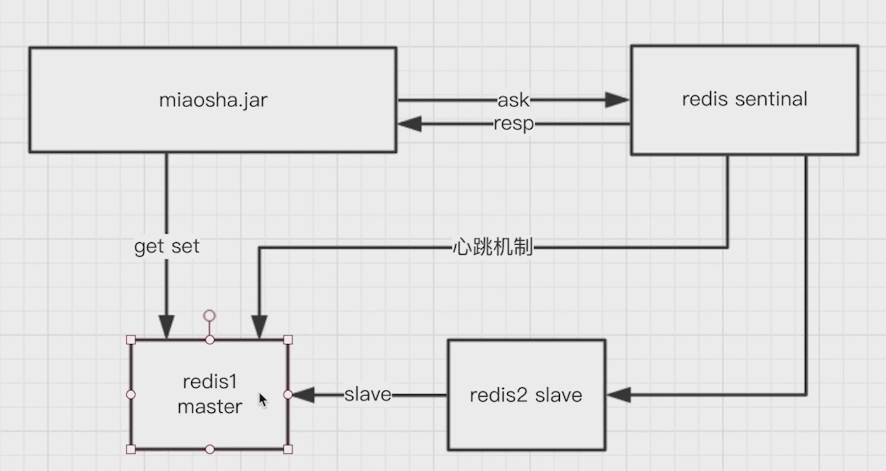
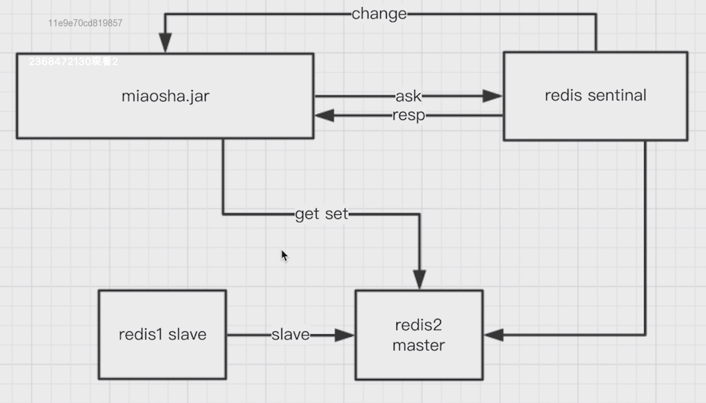

- Redis
  collapsed:: true
	- 安装
	  collapsed:: true
		- [Redis安装](https://www.runoob.com/redis/redis-install.html)
		- [Redis-Linux下安装Redis及make安装问题](https://www.cnblogs.com/shook/p/12883742.html)
	- 数据结构
	  collapsed:: true
		- String
		  collapsed:: true
			- 使用场景
			  collapsed:: true
				- 缓存对象
				- 常规计数
				- 分布式锁
				- 共享session
			- 存储的最大容量
			  collapsed:: true
				- Redis 一个字符串类型的值最大可以存储512MB的数据。这是因为Redis使用了一个sds数据结构（simple dynamic string），这种数据结构在Redis中被广泛使用，可以实现高效的字符串操作，并且支持动态扩容。而sds的最大长度是2^32-1字节，也就是4GB，但在Redis中，字符串类型的值除了存储数据外，还需要存储一些元数据信息（例如长度等），所以实际上字符串类型的值能存储的最大容量是512MB。
		- List
		  collapsed:: true
			- 常用命令
				- `LPUSH`：将元素添加到列表的头部。
				- `LPOP`：从列表的头部弹出一个元素。
				- `RPUSH`：将元素添加到列表的尾部。
				- `RPOP`：从列表的尾部弹出一个元素。
				- `Llen`：获取列表的长度。
				- `LRANGE`：获取列表的所有元素。
				  collapsed:: true
					- `LRANGE list_key 0 -1`：将返回指定列表 list_key 中的所有元素。
					- 通过指定不同的起始和结束索引，可以灵活地获取列表中的部分元素。
		- Hash
		  collapsed:: true
			- 常用命令
				- [Redis hash 命令](https://www.runoob.com/redis/redis-hashes.html)
		- Set
		- Zset
	- 常用命令
	  collapsed:: true
		- `expire key seconds`：设置锁的有效时间，单位：秒
		- `pexpire key milliseconds`：设置key的有效时间，单位：毫秒
		- `pttl key`：返回key的有效时间，单位：毫秒
		- `ttl key`：返回key的有效时间，单位：秒
	- 持久化机制
	  collapsed:: true
		- RDB
			- Redis DataBase缩写快照
			- 默认的持久化方式。
			- 优点
				- 只有一个文件，方便持久化。
				- 容灾性好，一个文件可以保存到安全的磁盘。
				- 性能最大化，fork 子进程来进行持久化写操作，让主进程继续处理命令，只存在毫秒级不响应请求。
				- 相对于数据集大时，比 AOF 的启动效率更高。
			- 缺点
			  collapsed:: true
				- RDB 是间隔一段时间进行持久化，如果持久化之间 redis 发生故障，会发生数据丢失。
		- AOF
			- Append Only File持久化
			- 优点
				- 数据安全系数高，如果服务器发送宕机，数据丢失的少。
			- 缺点
				- AOF 文件比 RDB 文件大，且恢复速度慢。
				- 数据集大的时候，比 rdb 启动效率低。
			-
	- Redis的集群架构
	  collapsed:: true
		- 单台Redis
		- 主从架构
		  collapsed:: true
			- 解决的问题
				- 单个Redis节点出现宕机，无法正常提供服务。
				- 单个Redis节点磁盘损坏，造成数据丢失。
				- 单个Redis节点的内存是有限的，存在性能瓶颈
			- 实现思路
				- 一个主节点可以有多个备份的从节点。
				- 主节点可以进行**读写操作**，当发生写操作时自动将写操作同步给从节点，而**从节点一般是只读**，并接受主节点同步过来写操作命令，然后执行这条命令。
				- 对于缓存来说，一般都是用来支撑读高并发的。架构做成主从(master-slave)架构，一主多从，主负责写，并且将数据复制到其它的 slave 节点，从节点负责读。所有的读请求全部走从节点。这样也可以很轻松实现水平扩容，支撑读高并发。
				- 一般采用一主两从。
			- 实现细节
				- **replication buffer 缓冲区**：记录主节点全量复制，同步数据到从节点时，在主节点生产、传输RDB文件和从节点读取RDB文件的期间，记录主节点收到的写操作命令的缓冲区，待全量复制成功后，将增量的这部分写命令同步给从节点。
				- **repl_backlog_buffer 缓冲区**：是一个「**环形**」缓冲区，用于主从服务器断连后，通过**replication offset**判断从服务器待更新的从中找到差异的数据
			- 参考文章：
				- [主从复制是如何实现的](https://xiaolincoding.com/redis/cluster/master_slave_replication.html)
		- 哨兵架构
		  collapsed:: true
			- 主要角色
				- Redis Master节点
				- Redis Slave节点
				- Redis Sentinal节点
			- 客户端与Redis服务器端的交互
				- **客户端会连接主节点**：哨兵节点通过心跳机制监控主节点，客户端首先会向哨兵发起请求，询问Redis的主节点。当**客户端尝试连接到 Redis 服务器**时，它会向主节点发送连接请求。如果主节点正常运行，客户端将能够与主节点进行通信并执行各种 Redis 操作。
				  :LOGBOOK:
				  CLOCK: [2024-06-05 Wed 08:18:28]--[2024-06-05 Wed 08:18:29] =>  00:00:01
				  :END:
				  
				- **出现异常，哨兵会将新的主节点通知给客户端**：如果主节点发生故障或不可用，哨兵节点会检测到这种情况，并触发故障转移过程。在故障转移期间，哨兵节点会选择一个新的主节点，并将其信息传播给其他哨兵节点和客户端。
				  :LOGBOOK:
				  CLOCK: [2024-06-05 Wed 08:20:50]--[2024-06-05 Wed 08:20:51] =>  00:00:01
				  :END:
				  
				- **客户端可以通过配置来监听哨兵节点的通知**，以便及时了解主节点的变化。当主节点发生更改时，客户端可以自动重新连接到新的主节点，继续执行操作。
			- 多主从的哨兵架构
				- 需要客户端进行分片逻辑，负责将不同的数据分散到不同的节点
				- 缺点
					- 分片逻辑需要客户端自己实现。
					- 新增节点时数据迁移会造成很大工作量。
		- 集群架构
			- Redis Cluster模式下将存储数据的单元叫做slot-槽（数据分区的单位），默认一共有16384个。如果集群中有三个主节点，它会将这些槽分区均衡分散到这三个主节点上。
			- 在数据存储的时候，会利用键的哈希定位到该键值对存储的槽。
			- 每个主节点都有一个从节点，是为了主节点出现故障时，从节点能够替换成为新的主节点。
			- 集群中节点之间的通信采用了Gossip协议，沟通的主要是节点的元数据信息，比如是否故障、负责的槽位有哪些等等。
			- 节点扩容的时候，首先需要向集群加入主节点，然后使用redis-trib.rb将之前几个主节点的槽数据批量转移到新的主节点，最后为主节点配置从节点，至此节点扩容工作完成。
	- 缓存穿透
	  collapsed:: true
		- **缓存穿透是指数据库和缓存都没有的数据**，每次都要经过缓存去访问数据库，大量的请求有可能导致DB宕机。
		- 应对策略
		  collapsed:: true
			- **使用布隆过滤器**（Bloom Filter）：布隆过滤器是一种快速判断元素是否存在的数据结构，它可以在很小的内存占用下，快速判断一个元素是否在一个集合中。将所有可能存在的数据哈希到一个足够大的位数组中，当一个请求过来时，先经过布隆过滤器判断是否存在于缓存中，如果不存在，则直接返回，避免对数据库的查询压力。
			  collapsed:: true
				- 存在的问题：布隆过滤器经常使用在缓存数据更新较少的场景中，如果缓存中数据有更新，则要及时同步到布隆过滤器中。如果数据同步失败了，还需要增加重试机制
			- **空对象缓存**：对于确定不存在的数据，在缓存中也存储一个空对象，表示该数据不存在。当请求访问这些不存在的数据时，直接从缓存中返回空对象，避免每次请求都穿透到数据库层进行查询。
	- 缓存击穿
	  collapsed:: true
		- **缓存击穿是指数据库有，缓存没有的热点数据**，大量请求访问这个缓存不存在的数据，最后请求打到DB可能导致DB宕机。
		- 应对策略
			- **设置热点数据的热度时间窗口**：对于热点数据，可以设置一个热度时间窗口，在这个时间窗口内，如果一个数据被频繁访问，就将其缓存时间延长，避免频繁刷新缓存导致缓存击穿。
			- **使用互斥锁或分布式锁**：在缓存失效时，只允许一个线程去查询数据库，其他线程等待查询结果。可以使用互斥锁或分布式锁来实现，确保只有一个线程能够查询数据库，其他线程等待结果，避免多个线程同时查询数据库造成数据库压力过大。
			- **缓存永不过期**：对于一些热点数据，可以将其缓存设置为永不过期，或者设置一个很长的过期时间，这样即使缓存失效，也有足够的时间来刷新缓存，避免缓存击穿。
	- 缓存雪崩
		- **缓存雪崩指的是在同一时段大量的缓存键（key）同时失效**，导致大量请求打到数据库，最后请求打到DB可能导致DB宕机。
		- 应对策略
		  collapsed:: true
			- **使用多级缓存架构**：将缓存划分为多个层级，每个层级的缓存设置不同的过期时间。例如，将热点数据存储在近期失效的缓存层级，而将非热点数据存储在长期失效的缓存层级。这样即使某一层级的缓存失效，仍然可以从其他层级获取数据，避免所有请求直接访问数据库。
			- **设置缓存数据的随机过期时间**：在设置缓存数据的过期时间时，加上一个随机值，使得不同的缓存数据在过期时刻不一致。这样可以避免大量数据同时过期，减轻数据库负荷。
	- 在Spring Boot中的RedisConfig配置
	  collapsed:: true
		- Jedis整合Spring Boot的配置方式
		  collapsed:: true
			- pom.xml
			  ```xml
			  <dependency>
			              <groupId>org.springframework.boot</groupId>
			              <artifactId>spring-boot-starter-data-redis</artifactId>
			              <exclusions>
			                  <exclusion>
			                      <groupId>io.lettuce</groupId>
			                      <artifactId>lettuce-core</artifactId>
			                  </exclusion>
			              </exclusions>
			          </dependency>
			          <dependency>
			              <groupId>redis.clients</groupId>
			              <artifactId>jedis</artifactId>
			          </dependency>
			  ```
			- application.yml
			  ```yml
			  spring:
			    data:
			    	redis:
			    	  host: 127.0.0.1:6379
			    	  password: 6379
			        database: 0
			        jedis:
			          pool:
			          enabled: true
			          max-active: 8
			          min-idle: 0
			          max-idle: 8
			  ```
			- RedisConfig
			  ```java
			  @Configuration
			  public class RedisConfig {
			      
			      @Bean
			      public RedisTemplate<String, Object> redisTemplate(RedisConnectionFactory redisConnectionFactory) {
			          RedisTemplate<String, Object> redisTemplate = new RedisTemplate<>();
			          redisTemplate.setConnectionFactory(redisConnectionFactory);
			          
			          ObjectMapper objectMapper = new ObjectMapper();
			          SimpleModule simpleModule = new SimpleModule();
			          simpleModule.addSerializer(DateTime.class, new JodaDateTimeJsonSerializer());
			          simpleModule.addDeserializer(DateTime.class, new JodaDateTimeJsonDeserializer());
			  
			          // 指定序列化输入类型
			          objectMapper.activateDefaultTyping(LaissezFaireSubTypeValidator.instance ,
			                  ObjectMapper.DefaultTyping.NON_FINAL, JsonTypeInfo.As.PROPERTY);
			          // 指定要序列化的域，field,get和set,以及修饰符范围，ANY是都有包括private和public
			          objectMapper.setVisibility(PropertyAccessor.ALL, JsonAutoDetect.Visibility.ANY);
			  
			          objectMapper.registerModule(simpleModule);
			  
			          // 解决value的序列化方式
			          Jackson2JsonRedisSerializer<Object> jackson2JsonRedisSerializer = new Jackson2JsonRedisSerializer<>(objectMapper, Object.class);
			  
			          // 首先解决key的序列化方式
			          StringRedisSerializer stringRedisSerializer = new StringRedisSerializer();
			          redisTemplate.setKeySerializer(stringRedisSerializer);
			          redisTemplate.setValueSerializer(jackson2JsonRedisSerializer);
			  
			          return redisTemplate;
			      }
			  }
			  ```
			-
		- 参考文章
		  collapsed:: true
			- [Spring Boot 结合 Redis 的序列化配置](https://www.cnblogs.com/Vincent-yuan/p/15468126.html)
			- [RedisTemplate配置的jackson.ObjectMapper里的一个enableDefaultTyping方法过期解决](https://www.cnblogs.com/shanheyongmu/p/15157378.html)
- Guava Cache
  collapsed:: true
	- LoadingCache
	- Callable
	- 参考文章
		- [Guava Cache 原理分析与最佳实践](https://blog.csdn.net/weixin_44259720/article/details/125890496)
		- [Guava Cache实现原理及最佳实践](https://albenw.github.io/posts/df42dc84/)
- Jedis
	- 使用
		- 参考文章：
			- [jedis的基本使用](https://blog.csdn.net/zhang_sheng_nian/article/details/127734172)
			- [redis基于zset实现延迟队列](https://cloud.tencent.com/developer/article/2310463)
			- [【进阶篇】Redis实战之Jedis使用技巧详解](https://www.cnblogs.com/dxflqm/p/17012394.html)
	- Jedis连接池
	  collapsed:: true
		- 参考文章
		  collapsed:: true
			- [java客户端：Jedis和Jedis连接池的基本使用和配置](https://zhuanlan.zhihu.com/p/84481313)
			- [GenericObjectPool源码分析](https://www.cnblogs.com/chenjian5/p/5149312.html)
			- [为什么建议JedisPool的maxIdle与maxActive设置成一样的数值](https://www.jianshu.com/p/1f1568627f87)
- Redisson
  collapsed:: true
	- pom配置
		- 在整合Spring Boot的时候，配置如下：
		  ```xml
		  <dependency>
		              <groupId>org.redisson</groupId>
		              <artifactId>redisson-spring-boot-starter</artifactId>
		              <version>3.19.1</version>
		              <exclusions>
		                  <exclusion>
		                      <groupId>org.redisson</groupId>
		                      <artifactId>redisson-spring-data-30</artifactId>
		                  </exclusion>
		              </exclusions>
		          </dependency>
		  
		          <dependency>
		              <groupId>org.redisson</groupId>
		              <artifactId>redisson-spring-data-26</artifactId>
		              <version>3.19.1</version>
		          </dependency>
		  ```
		  上面这段配置中第一个依赖我将`redisson-spring-data-30`移除了，这是因为我使用的spring boot版本是2.6.x，所以在第二依赖中我特意引入了适合该版本的依赖，`redisson-spring-data-30`这个包是与Spring Boot的兼容模块，如果不和Spring Boot的版本适配的话，会报错。
		-
	- 官网
		- [redisson文档](https://github.com/redisson/redisson/wiki/Table-of-Content)
		- [Spring Boot Starter](https://github.com/redisson/redisson/blob/master/redisson-spring-boot-starter/README.md)
		- redisson-spring-boot-starter
	- 参考文章
		- [Spring Boot 整合Redisson配置](https://www.cnblogs.com/east7/p/16255253.html)
- 多级缓存的设置
  collapsed:: true
	- 先打本地缓存，接着redis缓存，最后数据库
- 缓存置换策略
	- LRU，least recently used，表示最近最少使用。当缓存已满时，淘汰最久没有被使用的元素。是基于**访问时间**来决定元素的去留。
	- LFU，least frequently used，表示最不频繁使用。根据元素的**使用频率**来决定淘汰那个元素。淘汰使用次数最少的元素。
- 参考文章
  collapsed:: true
	- [Java本地缓存技术选型（Guava Cache、Caffeine、Encache）](https://juejin.cn/post/6844904199453409294)