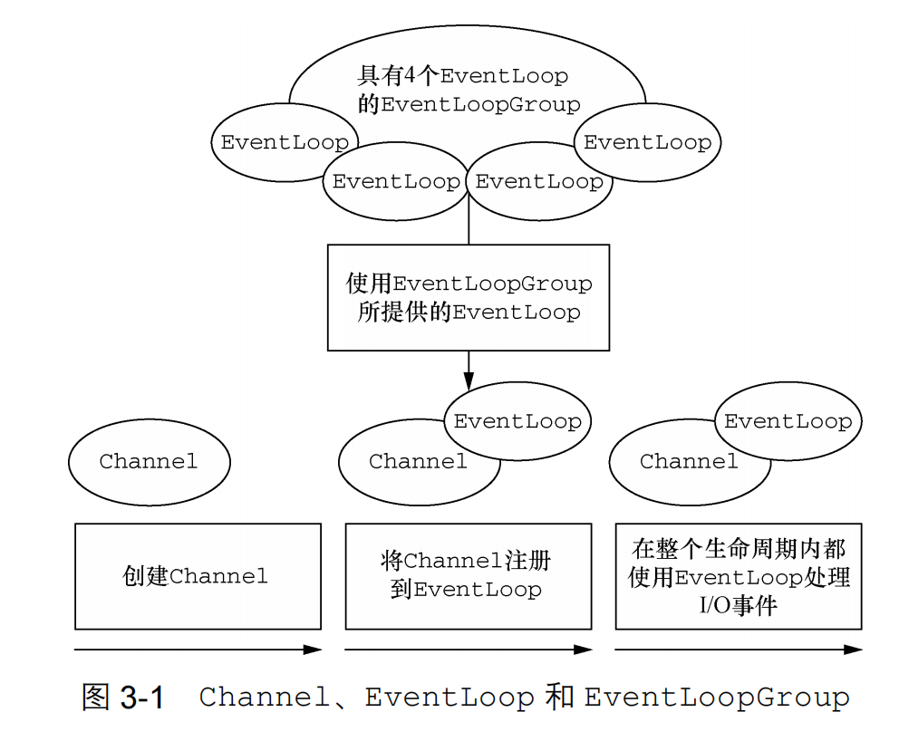
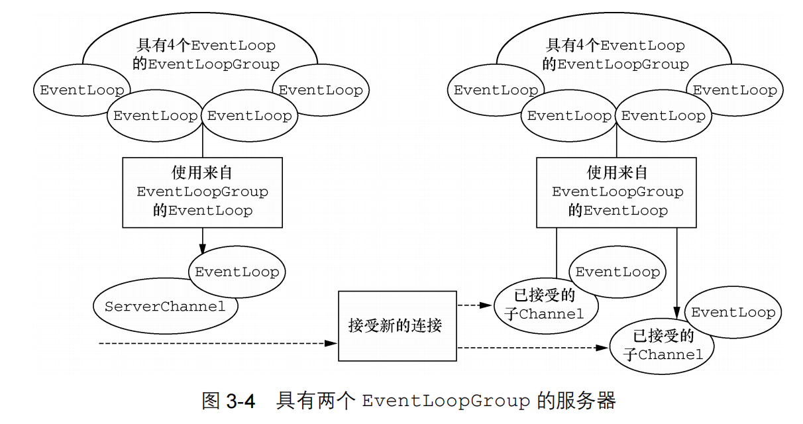

- Http
  collapsed:: true
	- Http基础
		- MIME类型
		  collapsed:: true
			- 定义：**媒体类型**（通常称为 **Multipurpose Internet Mail Extensions** 或 **MIME** 类型）是一种标准，用来表示文档、文件或字节流的性质和格式。
			- 语法
				- 结构：`type/subtype`
				- 独立类型
					- text
					- image
					- audio
					- video
					- application
					- multipart类型
			- 重要的MIME类型
				- `application/json`：JSON 已用于在使用所有这些编程语言编写的应用程序之间交换数据。
	- 头信息
	  collapsed:: true
		- [**Accept**](https://developer.mozilla.org/zh-CN/docs/Web/HTTP/Headers/Accept) ：该请求头用来告知服务器，客户端可以处理的内容类型，这种内容类型用[MIME 类型](https://developer.mozilla.org/zh-CN/docs/Web/HTTP/Basics_of_HTTP/MIME_types)来表示。通过内容协商的方式，服务器可以从诸多备选项中选择一项进行应用，并使用 [`Content-Type`](https://developer.mozilla.org/zh-CN/docs/Web/HTTP/Headers/Content-Type) 应答头通知客户端它的选择。
		- [**Accept-Encoding**](https://developer.mozilla.org/zh-CN/docs/Web/HTTP/Headers/Accept-Encoding)：该请求头将客户端能够理解的内容编码方式——通常是某种压缩算法——进行通知（给服务端）。通过内容协商的方式，服务端会选择一个客户端提议的方式，使用并在响应头 [`Content-Encoding`](https://developer.mozilla.org/zh-CN/docs/Web/HTTP/Headers/Content-Encoding) 中通知客户端该选择。
		- [**Content-Type**](https://developer.mozilla.org/zh-CN/docs/Web/HTTP/Headers/Content-Type)：
			- 在请求时，客户端会告诉服务器实际发送的数据类型。
			- 在响应中，Content-Type 标头告诉客户端，服务器端实际返回的内容的内容类型，来用于指示资源的 MIME 类型。
		- [**Content-Encoding**](https://developer.mozilla.org/zh-CN/docs/Web/HTTP/Headers/Content-Encoding)：在响应中，告诉客户端需要用何种编码类型和何种顺序解码去解析响应，以获取原始数据。
		  collapsed:: true
			- 属性值
			  collapsed:: true
				- gzip
				- compress
				- deflate
				- br
	- 响应状态码
		- 401： 表示“未经授权”。这意味着客户端在尝试访问受保护的资源时提供的认证信息无效或不被认可。
- Netty
  collapsed:: true
	- 《Netty实战》阅读笔记
		- 第一章 Netty-异步和事件驱动
		  collapsed:: true
			- Netty的核心组件
			  collapsed:: true
				- Chanel
				  collapsed:: true
					- Channel 是 Java NIO 的一个基本构造。
					- 可以把 Channel 看作是传入（入站）或者传出（出站）数据的载体。因此，它可以被打开或者被关闭，连接或者断开连接。
				- 回调
				  collapsed:: true
					- 一个回调其实就是一个方法，一个指向已经被提供给另外一个方法的方法的引用。这使得后者可以在适当的时候调用前者。
				- Future
				  collapsed:: true
					- `Future`提供了另一种在操作完成时通知应用程序的方式。但是它需要开发程序手动检测操作是否已经完成或者一直阻塞到它完成，使用十分繁琐。
					- 这个类的实例可以看做代表了一个异步操作。
					- `ChannelFuture`
					  collapsed:: true
						- 是Netty自己的实现，用于在异步操作时使用。
						- 可以注册多个`ChannelFutureListener`实例。
						- 每一个Netty出站的IO操作都会返回一个`ChannelFuture`。
					- `ChannelFutureListener`
					  collapsed:: true
						- 是一个监听器
						- 当ChannelFuture中定义的操作完成的时候，监听器中的`OperationComplete()`方法将会被调用。
				- 事件和ChannelHandler
				  collapsed:: true
					- 背景：Netty通过不同的事件来通知我们状态的改变或者操作的状态。
					- 事件
					  collapsed:: true
						- 事件按照事件与入栈和出栈数据流的相关性进行分类的。
						- 每个事件都会被分发给一个`ChannelHandler`中某个用户实现的方法。
					- `ChannleHandler`
					  collapsed:: true
						- 是一种为了响应特定事件而被执行的回调。
						- Netty提供了大量的开箱即用的`ChannelHandler`实现。
		- 第二章 编写Netty应用程序
		  collapsed:: true
			- 服务器端
			  collapsed:: true
				- 所有Netty服务端都需要以下两部分
				  collapsed:: true
					- 至少一个`ChannelHandler`：该组件实现了服务器对从客户端接收的数据的处理，即它的业务逻辑。
					- 引导：这是配置服务器的启动代码。它会将服务器绑定到它要监听连接请求的端口上。
				- 具体实现
				  collapsed:: true
					- `ChannelHandler`和业务逻辑
					  collapsed:: true
						- 因为服务器会响应传入的数据，所以需要实现`ChannelInBoundHandler`接口，来**定义响应入站事件的方法**。这里直接继承了`ChannelInboundHandlerAdapter`类，她是`ChannelInBoundHandler`接口的**默认实现**。
					- 引导服务器
					  collapsed:: true
						- 需要做的工作主要有两步
						  collapsed:: true
							- 一将连接请求的端口绑定到服务器上，让服务器对其进行监听。
							- 二配置`Channel`，通过Channel将入站的消息通知给`ChannelHandler`。
			- 客户端
			  collapsed:: true
				- 具体实现
				  collapsed:: true
					- 通过ChannelHandler实现客户端逻辑
					  collapsed:: true
						- 扩展`SimpleChannelInboundHandler`类进行消息的处理。这里没有像服务端一样使用ChannelInBoundHandler，主要是因为客户端和服务器端消息处理的方式和资源管理方式不同。
					- 引导客户端
					  collapsed:: true
						- 不同于服务端只需要监听端口，客户端使用主机和端口来连接远程地址。
		- 第三章 Netty的组件和设计
		  collapsed:: true
			- 1.Channel、EventLoop和ChannelFuture
			  collapsed:: true
				- 概述
				  collapsed:: true
					- Channel可以类比Socket。
					- EventLoop负责控制流，多线程处理、并发。
					- ChannelFuture负责异步通知。
				- Channel接口
				  collapsed:: true
					- Netty的Channel接口提供的API降低了直接使用Socket类的复杂性。
					- Channel有很多预定义的实现。
				- EventLoop接口
				  collapsed:: true
					- 定义了Netty的核心抽象，用于处理连接的生命周期中所发生的事件。
					- 一幅图来说明Channel、EventLoop和EventLoopGroup之间的关系
					  collapsed:: true
						- 关系图
						  
						- 一个 `EventLoopGroup` 包含一个或者多个`EventLoop`；
						- 一个 `EventLoop` 在它的生命周期内只和一个 `Thread` 绑定。所有由 `EventLoop` 处理的 I/O 事件都将在它专有的 `Thread` 上被处理；
						- 一个`Channel`在它的生命周期内只注册于一个 `EventLoop`； 一个 `EventLoop` 可能会被分配给一个或多个 `Channel`。
						- 注意，在这种设计中，一个给定`Channel` 的 I/O 操作都是由相同的Thread处理的，所以不会有同步的问题。
				- ChannelFuture接口
				  collapsed:: true
					- 可以将 `ChannelFuture` 看作是将来要执行的操作的结果的占位符。
					- 可以给`ChannelFuture`注册多个`ChannelFutureListener`实例。以便在某个操作完成时（无论是否成功）得到通知
			- 2.ChannelHandler和ChannelPipeline
			  collapsed:: true
				- ChannelHandler接口
				  collapsed:: true
					- Netty 的主要组件是 `ChannelHandler`，它充当了所有处理入站和出站数据的应用程序逻辑的容器。
					- 可以处理任何处理动作，比如处理格式换行逻辑或是异常处理逻辑等。
				- ChannelPipeline接口
				  collapsed:: true
					- `ChannelPipeline`提供了`ChannelHandler`链的容器，提供了在该链上传播入站和出站事件流的API。
					- 当`Channel`创建时，他会被自动分配到专属的`ChannelPipeline`上。
					- `ChannelPipeline`就像一个管道，我们可以将`ChannelHandler`添加到这个管道中，当事件到达后，会逐个在管道的`ChannelHandler`链上进行传递。
					- 入站和出站
					  collapsed:: true
						- 入站操作主要是指**读取数据**的操作；而出站操作主要是指**写入数据**的操作。
						- 入站会从先读取，再执行入站的Handler；出站会先执行出站的Handler，再写入。
						- 入站和出站`ChannelHandler`可以安装到同一个`ChannelPipeline`中。
					- `ChannelHandler`被添加到`ChannelPipeline`中时，将会给他分配一个`ChannelHandlerContext`对象，这个对象代表了`ChannelHander`和`ChannelPipeline`的绑定关系。
					- 两种发送消息的方式
					  collapsed:: true
						- 方式一直接将消息写到`Channel`中。
						- 方式二将消息写到`ChannelHandlerContext`中。
				- 深入理解ChannelHandler
				  collapsed:: true
					- Netty以适配器类的形式提供了大量默认的ChannelHandler实现。
					- 解码器
					  collapsed:: true
						- 入站消息会被解码，会从字节转换为另一种格式。并将解码后的字节传递给`ChannelPipeline`中的下一个`ChannelInBoundHandler`。
						- Netty提供的解码器实现了`ChannelInBoundHandler`接口
					- 编码器
					  collapsed:: true
						- 出站消息会被编码，会从一种格式转化为字节。并将编码后的数据传递给`ChannelPipeline`中的下一个`ChannelOutBoundHandler`。
						- Netty提供的编码器实现了`ChannelOutBoundHandler`接口。
					- 抽象类SimpleChannelInboundHandler
					  collapsed:: true
						- 最常见的情况，你的程序只需要一个ChannelHandler来接收解码消息，我们只需要实现SimpleChannelInboundHandler<T>接口就行，其中T是你要处理消息的Java类型。
			- 3.引导
			  collapsed:: true
				- 两种类型的引导
				  collapsed:: true
					- 用于客户端的`Bootstrap`
					  collapsed:: true
						- 网络编程中的作用：连接到服务端主机和端口。
						- 引导客户端只需要一个`EventLoopGroup`。
					- 用于服务器的ServerBootstrap
					  collapsed:: true
						- 网络编程中的作用：绑定到一个本地端口，监听传入的连接。
						- 引导服务器端需要两个EventLoopGroup。
						  collapsed:: true
							- 第一组将只包含一个 ServerChannel，代表服务器自身的已绑定到某个本地端口的正在监听的套接字。
							- 第二组将包含所有已创建的用来处理传入客户端连接（对于每个服务器已经接受的连接都有一个）的 Channel。
							- 上面的叙述如下图所示
							  
		- 第四章 传输
		  collapsed:: true
			- 案例研究：传输迁移
			  collapsed:: true
				- 使用Java原有的网络编程模型，去实现OIO和NIO。
				-
				-
- 正向代理和反向代理
  collapsed:: true
	- 正向代理代理的是客户端，反向代理代理的是服务器。
	- 正向代理就像是买票的黄牛，它是代理买票的人去买票。
	- 反向代理代理的是服务器，它可以将请求分发到不同的服务器上，而客户端是不知道源服务器是那一台。